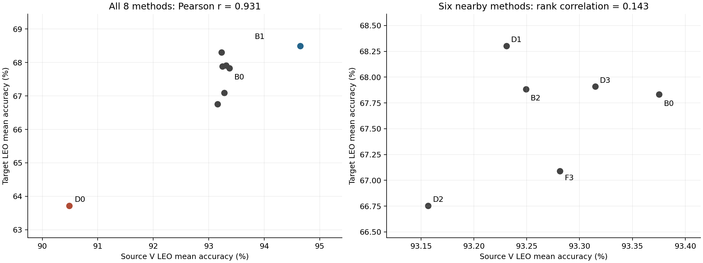
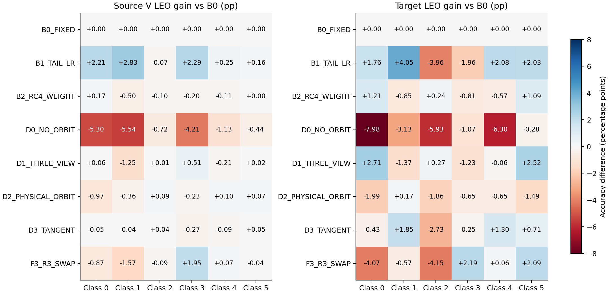
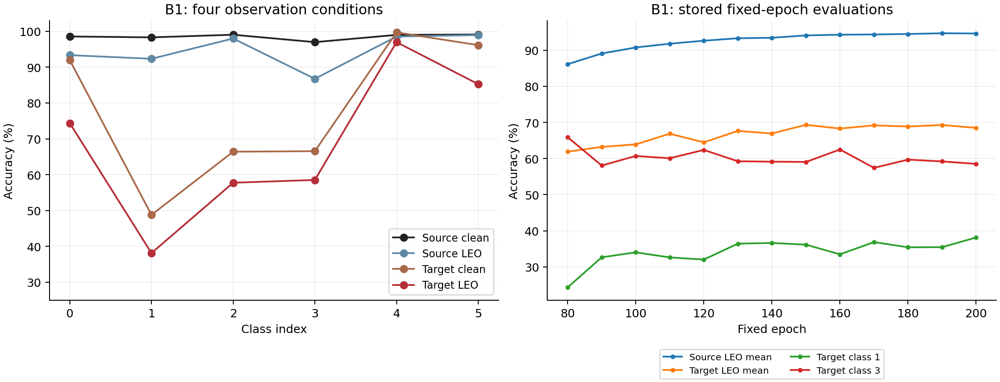

# 方法间LEO迁移关联与类别差异增强分析

八种方法之间，源域V的LEO均值与目标域LEO均值存在明显正相关：同一E200下Pearson相关系数为0.931。这支持把源域LEO作为鲁棒性的一个重要观察指标。不过，关联主要由关闭DAOT的D0与连续学习率B1等差异较大的实验拉开；在性能接近的六种方法中，Spearman排序相关只有0.143。因此，源域LEO适合识别较大的鲁棒性变化，尚不足以单独决定相近方法的优劣。

类别差异是另一个层面的问题。B1提高了整体源域LEO和目标域LEO，但其目标域类2、类3分别比B0下降3.96、1.96个百分点。提高平均鲁棒性并不保证每个类别的跨接收机性能都改善。增强路线需要同时覆盖LEO扰动稳定性、同一身份的跨接收机几何、类别与接收条件的尾部风险，避免只优化一个均值。

本报告区分三种结论：直接可复算的数据事实、由日志与代码支持的机制解释，以及需要新实验确认的增强假设。所有目标域结果都是已授权的探索性监测，不能写成独立确认或据此追认正式晋级。

## 证据范围与计算口径

分析对象严格对应八行已完成实验：B0_FIXED、B1_TAIL_LR、B2_RC4_WEIGHT、D0_NO_ORBIT、D1_THREE_VIEW、D2_PHYSICAL_ORBIT、D3_TANGENT、F3_R3_SWAP。共同run为`a1_mechanism_periodic_s392005_20260910_r1`，训练seed为392005，均从零初始化，固定E200快照与最终模型逐张量相同。此处不纳入后来可能完成的其他行，也不混用不同epoch的最高分。

本次重新完整解析八行各200条JSONL，核对各200行CSV，并扫描八份完整stdout，共1600个epoch记录和72264行stdout。未发现指定的Traceback、RuntimeError、OOM或RC4系统性非有限错误，warning计数为0；但梯度保护跳步并非为0，发生过非有限梯度跳步的epoch数为17–37，故不能称为全程数值无异常。重算分析不运行训练、不改checkpoint，也不更新远端状态。

方法级源域均值采用原E200日志，与截图口径完全一致。逐类源域数据来自已完成的冻结E200复评：每类每场景4500条、每场景27000条，模型评估前后state_dict一致。逐类数据必须从原计数计算，不能由总体准确率反推。目标域采用原独立scorer输出，每场景168000条，六个类等量；均值为三个正式LEO弱场景的等权平均。四种场景为clean、leo_clear_weak、leo_low_elev_weak、leo_rain_weak。

源域复评与原日志存在极小的计数差异；例如B1每场景最多相差1/27000，即0.00370个百分点。因此，方法级关联使用原日志，逐类变化使用复评计数，两者明确区分。源域三场景是同一V的重复扰动视图，不能把4500条视为13500条独立物理样本；同理，不把8方法×3场景或104个固定epoch分数当作独立方法重复。

source是单一验证集V，不是训练准确率。实际契约为ManySig、equalized=1、source RX=1,3,4,6,8、day=1,2,3，L/U/V=6300/56700/27000。六个类使用统一的索引0–5。本报告不把已有V重新划分为新的校准或选择角色。[项目协议](E:/type10-7/项目.md)

## 方法之间的关联有多强

|方法|源域clean%|源域LEO%|目标域clean%|目标域LEO%|源域LEO相对B0/pp|目标域LEO相对B0/pp|
|---|---:|---:|---:|---:|---:|---:|
|B0_FIXED|98.49|93.38|77.67|67.83|0.00|0.00|
|B1_TAIL_LR|98.50|94.65|78.25|68.50|+1.28|+0.67|
|B2_RC4_WEIGHT|98.51|93.25|78.69|67.88|-0.13|+0.05|
|D0_NO_ORBIT|98.54|90.49|77.81|63.72|-2.89|-4.11|
|D1_THREE_VIEW|98.49|93.23|79.09|68.30|-0.14|+0.47|
|D2_PHYSICAL_ORBIT|98.51|93.16|78.05|66.75|-0.22|-1.08|
|D3_TANGENT|98.47|93.31|78.81|67.91|-0.06|+0.08|
|F3_R3_SWAP|98.60|93.28|77.81|67.09|-0.09|-0.74|

Pearson衡量数值上的线性关联，Spearman衡量排序是否一致。二者一起看，能够区分“大范围共同升降”和“细粒度排序可用”。

|诊断范围|方法数|Pearson r|Spearman ρ|
|---|---:|---:|---:|
|全部八种方法|8|0.931|0.643|
|仅去掉D0|7|0.569|0.464|
|仅去掉B1|7|0.949|0.464|
|同时去掉D0、B1|6|0.437|0.143|

去掉B1后Pearson依然很高，而去掉D0后明显下降，说明D0对全局直线关系的影响尤其大。这里的去点分析是敏感性检查，不是删除“不好看”的实验；正式描述仍包含八行。剩余六行源域LEO只跨约0.22个百分点，目标域LEO却跨1.55个百分点，在如此窄的source区间内不能精确预测target。

D1是直观反例：源域LEO比B0低0.14个百分点，目标域却高0.47个百分点。F3的源域LEO略高于D1，目标域却低1.21个百分点。因而，“方法之间总体正相关”成立，“source每提高一点，target就按固定比例提高”没有证据。

源域clean与目标域LEO的Pearson为-0.450，但不能解释为提高clean会损害泛化。八种方法的源域clean集中在98.47%–98.60%，已高度饱和，微小差异不足以形成可靠排序。当前数据更支持“clean均值缺乏区分力”，不支持“clean准确率越低越好”。

这八行共享同一个模型家族、训练seed、数据划分和目标测试记录，且部分变体按递进结构构造。它们不是八次独立随机抽样。即使计算常规相关检验的p值，也无法替代独立训练重复、不同接收机划分和未反馈确认集；本报告不据此宣布统计显著的方法规律。既有研究确实发现ID与OOD准确率在多类模型和分布偏移下相关，也报告了相关性较弱的情形；该研究不是本任务中逐类迁移或因果收益的保证。[^1]

## 为什么源域LEO能反映一部分目标性能

源域clean主要衡量“熟悉接收机、熟悉日期分布下的识别”。源域LEO额外要求身份信息在LEO弱扰动下仍可分；目标域LEO同时承受未见接收机分布与LEO扰动。如果某项机制改善了两边共同需要的抗扰能力，source与target就有理由同向变化。反过来，只记住源域接收链路的特征，可能让source较好，却仍无法迁移。

项目观测模型为`x=R_d(H_d*T_y(s))+n`。TX身份非理想性、接收机响应、信道与噪声共同出现在输入里；识别器学习的是它们混合后的可分信息，而不是天然纯净的TX特征。WiSig原始研究已发现更换接收机或采集日期会显著影响识别，跨接收机RIEI研究则明确把接收机特征与发射机特征分离作为目标。两者支持这一机制背景，但不能据此断言本实验某一类的物理失真根因。[^2][^3]

可以把迁移风险概念性地写成三个部分：source侧残余识别风险、接收机/日期引起的类条件分布偏移，以及该偏移与LEO扰动的交互。此处不是可直接相加的定理或因果估计，只用于解释为什么提高source LEO只能覆盖问题的一部分。source误差较低和全局分布对齐，并不足以保证target误差较低；类条件变化仍然重要。[^4]

因此，应继续利用source LEO观察共享鲁棒性，同时用source内部的类×接收机×场景统计、同类跨RX几何与合法的source域泛化episode，检查模型是否依赖接收机。不能把源域模拟LEO表现当成真实在轨结果，更不能认为重新叠加信道就消除了接收机固有响应。

## 各方法实际改变了什么

|方法|实际改动与日志证据|当前可支持的解释|
|---|---|---|
|B0|DAOT双教师视图，E21起DAOT总损失非零；卫星CE从E80非零|已具备轨道教师和LEO监督，是有机制的对照|
|B1|全预算连续余弦学习率，取消主干额外尾段缩放；E200记录LR为1e-5，B0为1e-6|source抗扰训练更充分是合理解释；该对照改变全程日程，不能把收益全部归因于最后若干epoch|
|B2|相同接纳规则与预算内改变RC4可靠性权重|目标均值仅+0.05pp，单seed不足以证明有效或等效|
|D0|关闭DAOT，教师view_count=0，DAOT loss全程0；LEO卫星CE仍从E80非零|DAOT整体移除伴随source/target LEO下降；不能称为“完全没有LEO增强”的对照|
|D1|教师视图2→3，均值聚合|target略改善但source未改善，暴露source均值精排的局限|
|D2|在D1上改为物理可靠性鲁棒聚合|source较D1低0.07pp，target低1.55pp；聚合的偏置、可靠性估计与类条件效应值得核查|
|D3|在D2上增加协方差方向tangent约束|target较D2回升1.16pp；相对B0仅+0.08pp，不能概括成普遍改善|
|F3|启用R3并使用source fingerprint与destination nuisance的交换路径|相对B0是组合差异；只有与F0匹配比较才可归因于swap本身，本八行表不完成该归因|

B1的E200教师标注准确率约98.65%，B0约98.35%；教师共识率分别约95.14%、93.73%。这些读数与B1较好的source LEO一致，但没有逐类教师正确性和被接纳样本的误差去向，不能证明教师改善正是目标域收益的唯一原因。

三教师视图的D1/D2/D3共识率约88%，双教师视图B0/B1约94%–95%。视图数增加本身就让“所有视图一致”的条件更严格，不能直接把较低共识率当成教师变差。需要比较相同视图条件下的正确率、有效样本覆盖和类条件分布。

F3的E200 RC4有效加权覆盖约0.00670，其他七行约0.15。这是明确的路径差异线索，不能直接转述为F3伪标签正确率低，也不能断言R3抢占了预算；应先查有效权重、接纳类型与覆盖随epoch的变化。U真值可用标记全程为0，日志无法直接提供各类U伪标签精度。

相关实现位置：[实验矩阵](E:/type10-7/code/snapshots/a1_fast_v2_20260909_wt/code/scripts/run_a1_mechanism_screen.py)、[DAOT消融映射](E:/type10-7/code/snapshots/a1_fast_v2_20260909_wt/code/cvsrffi/deployment_orbit.py:76)、[学习率日程](E:/type10-7/code/snapshots/a1_fast_v2_20260909_wt/code/SSDG/train_ssdg.py:6651)。配置、日志非零和最终收益是不同层次的证据，不能相互替代。

## 均值提高是否覆盖了弱类

|类别|B1源域LEO%|B1目标域LEO%|B1相对B0的源域变化/pp|B1相对B0的目标域变化/pp|
|---|---:|---:|---:|---:|
|0|93.35|74.36|+2.21|+1.76|
|1|92.34|38.12|+2.83|+4.05|
|2|97.99|57.75|-0.07|-3.96|
|3|86.75|58.52|+2.29|-1.96|
|4|98.53|96.98|+0.25|+2.08|
|5|98.96|85.26|+0.16|+2.03|

B1的总体target LEO增加0.67pp，是六类变化相互抵消后的结果。类1明显提高，但仍是最弱类；类2、类3损失近6个“类别百分点”的合计，其中类3在source上反而改善。这意味着仅用source最弱类准确率也无法保证target弱类同步提高。

固定某一类，再比较八种方法，可得到更贴近原问题的关联：类0、1、2、3、4、5的Pearson分别约0.891、0.905、0.645、0.233、0.931、0.296；对应Spearman为0.905、0.857、0.405、-0.119、0.548、0.024。类0/1有较明确同向趋势，类3/5的排序几乎不一致。所有数值仍为共享seed下的描述统计，不能把六次相关检验当作独立验证。

|方法|目标LEO均值%|最弱类%|两个最弱类均值%|类间标准差/pp|
|---|---:|---:|---:|---:|
|B0|67.83|34.07|47.28|19.25|
|B1|68.50|38.12|47.93|19.43|
|B2|67.88|33.22|46.45|19.62|
|D0|63.72|30.94|43.36|18.91|
|D1|68.30|32.70|45.97|20.19|
|D2|66.75|34.24|47.04|18.92|
|D3|67.91|35.92|47.45|19.31|
|F3|67.09|33.50|45.53|19.79|

类间标准差不能单独最小化：D0的标准差较小，却同时降低了均值和最弱类。应要求弱类提高且均值/强类不明显退化，而不是靠压低强类制造“均衡”。B1的类1/2/3合计贡献约77.04%的target LEO错误；这个比例来自等类样本数的现有测试，用于解释错误结构，不用来设置未来target驱动的类别权重。

## 类别差异中的跨接收机与LEO成分

|类别|源域clean%|源域LEO%|目标域clean%|目标域LEO%|clean跨域差/pp|目标域LEO额外下降/pp|
|---|---:|---:|---:|---:|---:|---:|
|0|98.56|93.35|91.94|74.36|6.62|17.57|
|1|98.31|92.34|48.78|38.12|49.54|10.66|
|2|99.04|97.99|66.41|57.75|32.64|8.66|
|3|96.98|86.75|66.55|58.52|30.42|8.03|
|4|99.00|98.53|99.70|96.98|-0.70|2.73|
|5|99.11|98.96|96.15|85.26|2.96|10.89|

类1在没有额外LEO扰动时，target clean已经只有48.78%，与source clean相差49.54pp。因此，把类1所有问题解释成LEO强度不够或卫星噪声过大不符合数据。类2同样在source LEO接近98%的情况下，target clean仅66.41%，提示未被source平均抗扰准确率捕获的跨域缺口。

类0、5则有不同症状：target clean分别91.94%、96.15%，叠加LEO后下降17.57、10.89pp，说明其主要可见弱点更偏向目标接收条件下的抗扰稳定性。类3同时存在source LEO较低、clean跨域缺口较大的问题。这样的分型是现象层面的诊断，尚不能证明某类PA、IQ失衡、CFO或多径的具体物理原因。

定义`D_clean=A_source_clean-A_target_clean`，`P_source=A_source_clean-A_source_LEO`，`P_target=A_target_clean-A_target_LEO`，则有严格算术恒等式：

`A_source_LEO-A_target_LEO=D_clean+(P_target-P_source)`。

右侧第二项是附加LEO退化在两域间的差异。它不是随机化因果交互；source和target可能还存在接收机、日期、采集质量等差异。特别是类4的clean跨域差为负，说明target某些类可能更容易，不能强行要求所有差值都非负。

完整曲线也不支持“训练更久，各类必然都变好”。B1从E80到E200，source LEO均值由86.15%升至94.65%，target均值由61.90%升至68.50%；但target类3从65.92%变为58.52%。E150到E200，source均值仍由约94%的区间继续提升，target均值却由69.35%变为68.50%。这些是固定轮次下的历史描述，不据此回选E80/E150或触发target选模。

## 增强方案及优先顺序

### 先补全source侧类别与接收机诊断

优先增加source V的`class×RX×day×scene`正确数、总数、混淆矩阵、分类margin分布，并在训练L_s记录相同分组的loss、有效样本数与梯度贡献。原有source平均值和逐类值都可能掩盖“某个类在少数RX严重失败”。V只做只读评估、source校准和选模；任何训练权重的在线更新必须由L_s或合法U_s统计驱动，不能对V反向传播或更新模型状态。

更有辨识力的指标是：同TX不同RX的中心偏移、同RX不同TX的间隔、以及跨RX偏移相对类间margin的比值。若source分类正确但margin很薄，轻微域移位就可能越过边界；因此98%的source准确率也不代表身份几何足够稳定。只看t-SNE图不能证明这点，需要可复算的距离和margin统计。

这一步主要增加评估和记录成本，不一定需要重训。当前缺少逐类混淆去向、按RX分层分数、原始logit/embedding和包级配对错误，无法确认类1到底被误判成谁，也无法给出可靠的接收机聚类置信区间；报告不补造这些信息。

### 第一条训练路线：均衡合法配对与同类跨接收机约束

现有八行的ECRS跨RX成功步数全为0；B1完整stdout明确记录`balanced_sampler=0`。仓库已有`labeled_cross_rx_objective`，其正样本为同TX不同RX，负样本为不同TX但相同RX/day/view。它作用于实际身份特征，能够直接针对接收机捷径；这比单纯再增加一个独立分支更贴近目前的缺口。

先使用合法L_s实现TX与RX/day交叉覆盖，保证每个batch存在足够的合法正负配对；不从U_s读取TX真值。再独立比较clean配对和clean+实际执行LEO视图配对。需要分开“采样改善”和“损失改善”，否则无法识别收益来源。现有实现可复用已有z_id，不需要新增主干前向；距离计算约为O(B²)，应实际测量时间和显存，不能把理论低成本写成已测提速。

配对损失不能只让同类收缩，还要保持同RX下不同类的margin，否则可能把可分身份一起压平。监督对比学习与类条件域不变表征提供了相关方法基础；将它们限定到同TX跨RX的合法配对，是本项目的具体设计选择，其收益仍待验证。[^5][^6]

源域LEO较弱的类不一定就是target最弱类，因此不能只固定给类1、类3加权。应对所有类使用相同规则，并让source分组风险决定训练关注点。代码存在不代表已在这八行生效；新设计要记录configured、executed、valid anchors、LEO count、raw/weighted loss以及有效梯度。

### 第二条训练路线：从接收域均值风险扩展到类别×域风险

当前并非完全没有group CE：B1的`lambda_group_ce=0.16`，E200加权group CE约0.224，调用按domain分组的`groupdro_or_hard_domain_ce_loss`。但“某个接收域整体困难”与“某类在某接收域困难”不等价。已有group CE不能自动保证每个TX×RX单元都被保护。

可研究把group定义改为`g=(TX,RX,scene)`，day作为监测分层；先避免把每个因素全部相乘造成稀疏小组。候选目标为平均风险与尾部组风险的混合：

`L=(1-β)·mean_g L_g+β·sum_g q_g L_g+λ_xrx·L_xrx`。

其中`q_g`仅由训练侧组损失的平滑统计更新，并对最大权重与最小组样本数作控制。也可以用组损失最高部分的CVaR代替极端最大值，减少单个坏包支配训练。β、权重上限和组定义属于待预登记超参数，不由已看过的target结果拟合。

Group DRO研究表明，盲目把训练最坏组压到零并不能保证测试最坏组改善，正则化和泛化控制同样重要。其原始收益来自其他数据任务，不可移植为本项目的预期百分点。[^7]这里的创新空间是类条件接收域风险与合法LEO视图的结合，而不是把现有domain group CE换个名字。

### 第三条路线：调整教师和半监督覆盖，防止弱类被排除

弱类可能因为预测置信度低、跨view不一致而较少进入U训练；也可能以高置信错误伪标签进入，从而自我强化。两种情况需要不同处理。当前没有合法U真值的逐类精度证据，所以只能列为待检验假设。

先记录预测类别×RX×scene的接纳率、有效加权覆盖、teacher/student分歧和margin，再用合法L_s诊断批次或只读V校准评估可靠性。可以研究带可靠性下限的类自适应阈值或预算分配；不能只为了各类接纳数相同就降低弱类阈值，也不能假设U的真实类别先验等于均匀分布。FlexMatch提供了依据类别学习状态调整阈值的参考，但不直接解决本任务的接收机偏移和伪标签安全问题。[^8]

轨道教师还可能对难类过度平均。建议考察跨视图的身份margin是否保持、错误教师是否被过度赋权，以及`z_id`中身份敏感方向是否被tangent约束误消除。全局loss数值相近不能排除某些类受到相反方向的梯度；至少需要按类记录TX监督与辅助损失的梯度夹角或对主干的贡献。相关测量可低频进行，避免显著增加每步成本。

### 第四条路线：物理增强要保留身份，不能只加大扰动

跨接收机扰动和LEO传播扰动并不相同。增加信道噪声或更复杂的轨道视图，可能提高抗扰能力，也可能抹掉本来微弱的TX非理想性；D2的结果已经说明，物理命名更强的聚合并不自动带来更好的target表现。

可研究source范围内的接收机响应随机化、身份保持的残差表征、对同TX跨RX观测的一致性约束，以及对接收质量的有界权重。CFO、IQ失衡、非线性残差等量可能同时包含TX与RX信息，不能未经验证全部视为nuisance并消除。尤其当前输入已equalized，继续均衡或归一化可能减少信道差异，也可能降低身份可辨性。选择哪种扰动必须由source合法对照和身份margin证据决定。

默认LEO场景和CE日程有项目协议约束；新增一致性损失、改变增强起始或强度时，须作为明确的实验变体记录，不能静默修改默认。当前主干已存在DAOT、group CE、几何和半监督路径，宜先定位这些路径是否正确保护类别，再考虑新增大模型或物理分支。

### Phase2作为另一种能力，独立评价

如果部署场景允许合法target support，source阶段无法覆盖的接收机差异可以研究在Stage2-B/C内通过support适配或原型注册补偿。它可能更直接处理类条件偏移，但结果必须标为few-shot适配，不能用来抬高Phase1零适配DG的结论。

每个query仍逐样本面对全部注册类，不使用query真值、真实类别数量、配额、batch重排或query统计更新。不能拿当前target测试集的薄弱类别去拟合分类偏置，也不能按真实类别切换最优模型。若研究多模型融合，只能source预登记并验证其互补错误与成本；当前各类“最好的一行”构成的oracle上界不可部署，也不是合法模型。

## 如何评价增强是否真正有效

source端应联合记录LEO宏平均、类×RX尾部风险、最弱类与两弱类均值、clean保护指标及身份margin；U端记录覆盖与可靠性代理；成本端记录训练时间、有效更新、训练纯峰值显存与推理开销。source clean已经饱和，继续把它作为唯一细粒度指标会忽略部署压力；但其协议保护价值仍然存在。

可讨论的新实验顺序如下，均为建议而非已启动任务：

|阶段|单独变化|主要判断|成本与证据限制|
|---|---|---|---|
|A|source分层诊断|找到类×RX×scene失败及混淆去向|只读统计优先，V不更新模型|
|B|合法TX/RX采样|配对覆盖是否改善，均值/弱类是否同时受益|会改变训练分布；与损失效果分开|
|C|B上加入cross-RX margin|同类跨RX偏移减小且类间margin保留|复用z_id，仍须测实际开销|
|D|加入类×域尾部风险|source困难组改善而非强类一起下降|控制稀疏组与权重放大|
|E|仅在覆盖证据支持时修改U策略|可靠覆盖是否扩大，弱类是否免于错误强化|无U真值不报告伪标签精度|
|F|必要时独立Phase2 support适配|能否弥补DG残余缺口|与Phase1能力分开报告|

不建议一次把B–E全部打开。先保留B0匹配对照，在source规则下检查连续学习率与cross-RX机制的单独作用及交互；B1有source侧改善证据，可以作为候选日程，但不能因为其当前target最高就把它选为正式晋级基座。类似地，不能直接采用“B1专治类1、F3专治类3”的真值路由。

当前8行累计epoch耗时为16.35–19.28小时，包含验证与周期目标测试，GPU并行竞争也不同；不能直接当成严格吞吐benchmark。历史峰值显存部分包含周期测试重建模型，不适合据此声称某方法训练显存减半。新的比较应报告同设备条件下每epoch纯训练时间、有效step数、峰值显存与推理预算。

方法稳定性需要独立训练seed和未反馈的确认设计；少量独立seed是起点，不是充分性保证。置信区间应考虑RX/day及物理包相关性，方法比较使用相同记录的配对误差，而不是将每个扰动view当成独立样本。领域泛化研究已指出模型选择规则是完整算法的重要组成部分，不能由目标测试峰值事后补定。[^9]

依据本次分析提出的后续研发，已经受到当前探索性target结果启发；因此不得继续在这些目标记录上宣称独立确认。正式路线须按项目协议保持source-only选择、检查所有checkpoint祖先与历史目标接触，使用未反馈的确认设计。V角色和物理样本划分不变时，不新增数据重验；若修改source/target契约或继承来源，则只检查实际受影响的数据权限与checkpoint一致性。当前报告不授权新训练、替换活动run或修改协议。

## 证据缺口与可声明范围

目前已证实：八种方法整体存在source/target LEO正相关；该相关对D0敏感，不能稳定精排邻近方法；B1的均值提升伴随部分target类别退化；类1、2、3在target clean上已存在较大缺口；DAOT和LEO监督实际执行，而新增ECRS跨RX路径未在这八行生效。

目前未证实：具体哪个TX物理缺陷导致弱类；类1错误主要流向哪一类；是哪一个RX或日期贡献了最大跨域损失；某种group权重、对比损失或阈值一定提高target；B1优于其他方法的跨seed显著性；当前探索目标可以继续作为新方法的独立确认数据。

最值得推进的是把source LEO从一个总体均值扩展为类别与接收条件的可解释风险，再用合法跨RX配对约束身份几何。这样既保留已经观察到的共享抗扰收益，也直接针对source高分仍无法迁移的缺口。

## 数据与复现

- [完整计算表](supporting_data.xlsx)：方法、逐类、逐场景、相关敏感性、固定epoch曲线、机制激活及来源。
- [方法级CSV](methods.csv)、[48行逐类CSV](classes.csv)、[192行场景逐类CSV](scene_classes.csv)、[相关CSV](correlations.csv)、[104次固定epoch评分CSV](fixed_epoch_curves.csv)。
- [完整日志解析审计](full_log_audit.json.gz)：所有epoch先完整解析，再保存与本问题相关的字段、全字段名及stdout扫描结果；不声称压缩包包含原始日志的每一行文本。
- [计算脚本](E:/type10-7/code/snapshots/a1_fast_v2_20260909_wt/analysis/analyze_method_class_transfer.py)、[只读采集脚本](E:/type10-7/code/snapshots/a1_fast_v2_20260909_wt/analysis/collect_method_class_analysis.py)。
- 原始输入：[已完成实验快照](E:/type10-7/code/snapshots/a1_fast_v2_20260909_wt/analysis/completed_experiments_20260910_2122.json)、[源域冻结复评计数](E:/type10-7/code/snapshots/a1_fast_v2_20260909_wt/analysis/source_classes_results.json)。

## 参考来源

[^1]: Miller, J. P., et al. “Accuracy on the Line: on the Strong Correlation Between Out-of-Distribution and In-Distribution Generalization.” ICML/PMLR139,2021. [原文](https://proceedings.mlr.press/v139/miller21b.html)。用于说明方法级ID/OOD关联及例外，不用于保证本项目迁移比例。
[^2]: Hanna, S., Karunaratne, S., Cabric, D. “WiSig: A Large-Scale WiFi Signal Dataset for Receiver and Channel Agnostic RF Fingerprinting.” IEEE Access10,2022. [论文](https://ieeexplore.ieee.org/document/9721895/)、[原始数据说明](https://cores.ee.ucla.edu/downloads/datasets/wisig/)。用于接收机/日期偏移与数据预处理背景。
[^3]: Zhang, Y., Li, Q., Liu, H., Yang, L., Yang, J. “Domain Generalization for Cross-Receiver Radio Frequency Fingerprint Identification.” arXiv2411.03636,2024；页面标注IEEE Internet of Things Journal接收。[全文](https://arxiv.org/html/2411.03636v1)。用于RIEI身份/接收机解耦背景，不直接套用论文收益。
[^4]: Zhao, H., Tachet Des Combes, R., Zhang, K., Gordon, G. J. “On Learning Invariant Representations for Domain Adaptation.” ICML/PMLR97,2019. [原文](https://proceedings.mlr.press/v97/zhao19a.html)。用于说明低source误差及全局对齐不是target性能充分条件；不声称本实验存在其全部理论前提。
[^5]: Khosla, P., et al. “Supervised Contrastive Learning.” NeurIPS,2020. [全文](https://arxiv.org/html/2004.11362v5)。用于同类聚合、异类分离及抗扰表征的方法依据；原实验证据以视觉任务为主。
[^6]: Li, Y., Gong, M., Tian, X., Liu, T., Tao, D. “Domain Generalization via Conditional Invariant Representations.” AAAI32,2018. [原文](https://ojs.aaai.org/index.php/AAAI/article/view/11682)。用于类条件域不变性，区别于只对齐边缘分布。
[^7]: Sagawa, S., Koh, P. W., Hashimoto, T. B., Liang, P. “Distributionally Robust Neural Networks for Group Shifts: On the Importance of Regularization for Worst-Case Generalization.” ICLR,2020. [全文](https://arxiv.org/html/1911.08731v2)。用于最坏组风险与正则化边界；具体分组和混合目标为本报告建议。
[^8]: Zhang, B., et al. “FlexMatch: Boosting Semi-Supervised Learning with Curriculum Pseudo Labeling.” NeurIPS,2021. [全文](https://arxiv.org/html/2110.08263v3)。用于类自适应伪标签阈值；不作为target query拟合的许可。
[^9]: Gulrajani, I., Lopez-Paz, D. “In Search of Lost Domain Generalization.” ICLR,2021. [原文](https://arxiv.org/abs/2007.01434)。用于匹配比较与source模型选择的研究设计背景。
