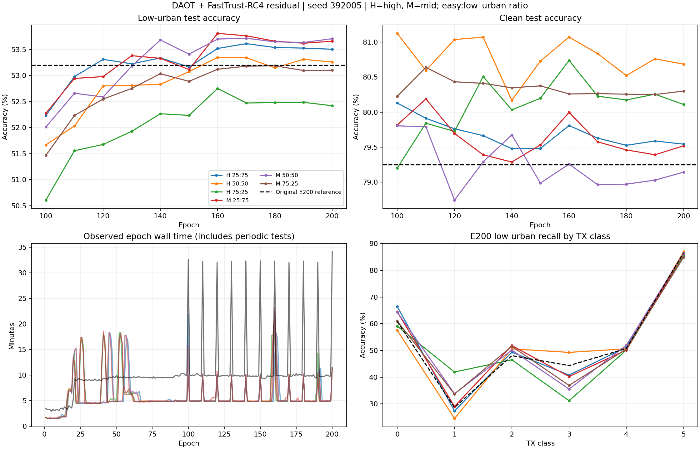

# 六组DAOT＋FastTrust-RC4 residual环境比例实验最终分析

六组全部完成200epoch，E100—E200每10epoch的clean＋六Practical场景测试齐全，completion.json为ARTIFACTS_COMPLETE，所属训练PID全部退出。本报告固定使用E200；不选择历史目标最高分checkpoint。服务器核验时间：2026-09-21T15:48:34.678092+08:00。

核心判断：仅重分配简单/困难场景比例带来有限改善。mid＋low_urban的50∶50组困难准确率最高53.7089%，比旧配方53.2006%高0.5083个百分点；high＋low_urban的50∶50组clean最高80.6857%。不存在同时占优的唯一配方。75%困难比例没有稳定胜过50%。训练与评估加速已兑现，完整200epoch约19.17—19.46小时，而旧residual约34.30小时。

## 1．范围、完整性和证据边界

- 全部解析六新组1200条epoch，加旧四组652条，合计1852条；JSONL/CSV epoch序列及耗时一致，无缺轮或解析错误。完整stdout扫描未发现Traceback/Error/Warning/Killed。旧full三组为用户停止的历史记录，不作为当前residual速度或精度主对照。
- 六组共66次七场景周期测试，全部有evaluation_scope.json与score.json且计数1176000。最终七个checkpoint（六新组＋旧residual）独立重读冻结prediction，逐记录连接truth，验证每场景168000个ID无遗漏/重复，正确计数与原score一致；共复计8232000条预测。中间60次使用已完成独立scorer的完整结果核验覆盖，并未另读全部中间prediction重算。
- seed392005、硬件seed2027；L/U/V=6300/56700/27000；scratch；200epoch；DAOT/RC4科学配置一致。比例仅改变有标签拼接卫星分支，DAOT student high与teacher mid/low_urban保持不变。
- source/target角色和checkpoint来源在启动时核对，训练不加载旧模型；旧E200仅作固定参考。六新组采用相同加速代码，旧配方参考采用历史训练实现，因此相对旧配方的细小差异不是完全隔离的“只有比例”因果效应；新组之间更适合讨论比例。
- 这是一组seed的地面IQ叠加Practical LEO压力实验。168000样本及同一run的多个epoch并非多个独立训练seed；不能将0.05—0.5个百分点差异直接宣称统计显著或真实在轨收益。

## 2．统一E200七场景准确率

单位为%，最后列为六个Practical环境的等权均值，不包含clean。

|训练组|clean|high|mid|low_suburban|high_urban|mid_urban|low_urban|六环境均值|
|---|---:|---:|---:|---:|---:|---:|---:|---:|
|high＋low_urban 75∶25|80.11|80.00|77.58|75.63|76.68|63.37|52.42|70.95|
|high＋low_urban 50∶50|80.69|80.27|77.95|75.96|77.09|64.12|53.26|71.44|
|high＋low_urban 25∶75|79.54|80.10|77.81|75.96|77.02|64.16|53.51|71.43|
|mid＋low_urban 75∶25|80.30|80.31|78.02|76.16|77.00|63.89|53.10|71.41|
|mid＋low_urban 50∶50|79.14|80.20|77.89|76.08|76.95|64.29|53.71|71.52|
|mid＋low_urban 25∶75|79.52|79.91|77.62|75.82|76.84|64.17|53.66|71.34|
|旧配方参考|79.25|80.18|77.87|75.99|76.91|63.93|53.20|71.34|

以困难场景为主要目标，mid50∶50为本次E200数值第一；同时high50∶50比它的clean高1.5435个百分点，而low_urban低0.4488个百分点。两者代表不同权衡，不应只报告其中一个分数。

## 3．增大困难比例到底有什么作用

|组合内变化|low_urban变化（百分点）|clean变化（百分点）|解释|
|---|---:|---:|---|
|high：困难25%→50%|+0.8393|+0.5762|两者同时改善，是该组合主要收益区间|
|high：困难50%→75%|+0.2458|−1.1435|额外困难收益较小，clean代价明显|
|mid：困难25%→50%|+0.6071|−1.1583|困难与clean发生权衡|
|mid：困难50%→75%|−0.0488|+0.3768|75%困难没有进一步提升E200困难准确率|

原配方并非始终三环境均匀：E1—40仅high，E41—90为mid/low_urban，E91起三者等比例。新组从早期即使用两个环境的固定条件比例。故相对旧配方还包含环境课程差异，不能写成单纯三视图删为两视图的实验；DAOT自身仍生成原内部视图。

实际采样核验：E91—200的困难条件比例分别约24.7%、49.7%、74.8%；对应星地应用概率均约80.0%。E1—40、E41—90应用概率分别约30.0%、60.3%。计数符合配置，未出现比例开关不生效。这里是已应用拼接星地样本内的条件比例，不能称整个训练输入有75%困难样本。

## 4．哪些环境真正改善

mid50∶50相对旧配方：high+0.0256、mid+0.0190、low_suburban+0.0911、high_urban+0.0417、mid_urban+0.3625、low_urban+0.5083个百分点，六环境均值+0.1748，clean−0.1083。改善集中在两个困难城市场景；简单场景变化极小。

high50∶50相对旧配方：clean+1.4351个百分点，但low_urban仅+0.0595，六环境均值约+0.0974。它适合保留为clean较强的候选，不能包装为困难环境的大幅提升。

mid25∶75的clean79.5190%、low_urban53.6601%，相对mid50∶50损失困难仅0.0488个百分点、clean高0.3768。若以后需要兼顾两者，应连同mid50∶50保留验证，而非因为E200单点0.05个百分点差距删除。

困难瓶颈仍显著：最好low_urban也只有53.71%，与该组clean79.14%相差25.43个百分点。提高困难比例仅降低约1.09%的旧困难场景错误量，并未解决主要泛化问题。当前证据支持“采样权重有帮助但容量有限”，不支持继续无限加大困难比例。

## 5．训练曲线与损失解释

六组DAOT objective和无标签DAOT损失均E21实际启用，拼接卫星分类损失E80实际非零，E91应用概率提高为0.8。普通无标签损失从E1已存在，不能看到label_epochs=130就说所有无标签训练E130才开始。

在high25∶75示例中，总loss由E79约5.35升至E80约8.54，E91约8.48，E200约8.17；这是卫星CE和增强日程改变后的混合目标值，不等于发散。E200六组总loss约6.59—8.24，困难比例更高的组往往更高；训练分布与加权损失不同，不能以最低总loss选最优配方。

source validation最终98.61%—98.66%，目标clean仅79.14%—80.69%，仍有约18—20个百分点域差距。因此source高准确率不代表目标域问题已解决。

|组别|E100 low_urban|E150|E200|E160—200五次均值|五次范围|
|---|---:|---:|---:|---:|---|
|high＋low_urban 75∶25|50.61|52.24|52.42|52.52|52.42—52.75|
|high＋low_urban 50∶50|51.67|53.08|53.26|53.28|53.15—53.35|
|high＋low_urban 25∶75|52.23|53.17|53.51|53.54|53.51—53.61|
|mid＋low_urban 75∶25|51.47|52.89|53.10|53.14|53.10—53.19|
|mid＋low_urban 50∶50|52.01|53.41|53.71|53.68|53.64—53.72|
|mid＋low_urban 25∶75|52.28|53.12|53.66|53.70|53.62—53.81|

E100到E150仍有约0.84—1.63个百分点提升；多数困难曲线到E160以后趋于平台。mid25∶75的后五次均值53.7036%略高于mid50∶50的53.6826%，E200单点排名却相反。这说明两者接近，不宜凭末轮细小差异声称唯一最优；此处五次结果仅用于曲线描述，不选目标最优checkpoint，也不当作独立重复。

数值状态：六组各有21—24个非有限梯度安全跳步，占44400个预期batch约0.047%—0.054%，均无非有限loss跳步；最近跳步E191—E198，不能沿用“只有首轮一次”的旧结论。全部完成且不是持续跳步，但也不是数值完全洁净。任何后续AMP/梯度优化应保留检查和异常证据。

## 6．类别分析：平均改善掩盖了部分退化

low_urban每类28000条，以下为各TX召回率（%）。

|组别|TX0|TX1|TX2|TX3|TX4|TX5|
|---|---:|---:|---:|---:|---:|---:|
|high＋low_urban 75∶25|59.13|41.93|46.53|31.19|50.15|85.60|
|high＋low_urban 50∶50|57.55|24.55|50.60|49.29|50.64|86.94|
|high＋low_urban 25∶75|66.48|27.36|49.37|40.80|51.21|85.81|
|mid＋low_urban 75∶25|60.99|33.71|51.55|36.93|50.53|84.90|
|mid＋low_urban 50∶50|64.37|33.84|50.15|35.56|51.97|86.37|
|mid＋low_urban 25∶75|64.45|29.06|51.83|40.25|50.17|86.21|
|旧配方参考|60.82|28.66|48.07|44.35|50.73|86.58|

mid50∶50相对旧配方，TX0约+3.55、TX1+5.19、TX2+2.08、TX4+1.25个百分点；TX3却约−8.79，TX5约−0.21。因此整体+0.51并非各类一致改善。该组TX1仅33.84%、TX3仅35.56%，而TX5达86.37%，困难场景有强烈类别不均衡。

该组主要混淆是TX1→TX3的8655条（该类30.91%），TX3→TX0的7492条（26.76%）。旧配方TX1→TX3为10891条，说明第一种混淆减轻；旧TX3→TX0为6786条，第二种混淆加重。后续应检验信道是否破坏特定类别的可分特征，以及DAOT教师在困难视图上的一致性，而不是仅整体增加困难采样。

独立混淆矩阵计算的low_urban Macro-F1：旧配方52.9683%，mid50∶50为53.4092%（+0.4408个百分点）。提升方向一致但幅度仍小。完整49个场景的Macro-F1和逐类指标见CSV。

## 7．完整训练加速结果

以下为epoch日志覆盖的累计耗时，含周期评估；不是对未来任意负载的保证。

|组别|总小时|训练batch小时|source验证小时|目标评估小时|相对旧总耗时加速|
|---|---:|---:|---:|---:|---:|
|high＋low_urban 75∶25|19.46|17.53|0.96|0.95|1.76倍|
|high＋low_urban 50∶50|19.30|17.29|0.95|1.04|1.78倍|
|high＋low_urban 25∶75|19.17|17.06|0.94|1.16|1.79倍|
|mid＋low_urban 75∶25|19.28|17.38|0.93|0.95|1.78倍|
|mid＋low_urban 50∶50|19.29|17.27|0.93|1.06|1.78倍|
|mid＋low_urban 25∶75|19.32|17.38|0.96|0.96|1.78倍|
|旧配方参考|34.30|25.42|4.70|4.16|1.00倍|

最终总耗时减少约43.3%—44.1%，每组节省14.84—15.12小时；六组累计约115.82小时任务运行时间（不是本机实际历时，也不是独占GPU等效计算量）。纯训练batch部分加速约1.45—1.49倍；source验证累计约5倍；目标评估累计约3.6—4.4倍，但新旧场景数不同，不能将此视为相同工作量的单项bench。

E180—200中位epoch，新组约292—297秒，旧组588秒，约2倍。全程因并发资源争用与周期测试混合，总加速低于该中位数。此前仅前25轮得到1.025—1.094倍是当时局部观察，完整实验已不再适用；没有矛盾。

六组固定七场景测试E110以后大多约281—321秒，首次E100按组约291—1020秒。共享缓存、CPU流水线与identity-only评估组合确实已接入；先启动组建缓存、后启动组可复用，但没有逐次cache命中计数日志，不能反推出各单项独立加速比例。缓存不会替代每checkpoint的模型预测。

剩余优先级：避免同卡高负载争用；真实激活阶段10—20步分段profile；审计DAOT教师identity_batched与RC4无标签teacher identity-only；合并非反馈诊断标量同步；按profile优化residual命名RNG初始化和进程IPC；冻结checkpoint后异步完整评估。不要重复投入已只占很小比例的日志写入，也不要靠减少困难环境测试来报速度。

## 8．后续科研决策

若关注最难场景，mid50∶50是本次E200数值首选，mid25∶75是接近且clean更好的备选；若clean优先，保留high50∶50。它们是待确认候选，不自动替换正式默认方案。

比继续扩大比例网格更有价值的是：以同一优化实现保留原配方对照，对上述少数候选做匹配多seed重复；预先规定clean可接受退化及困难场景主指标，完整报告各TX/RX/day的损益。当前预测只直接提供opaque ID与TX预测，本轮类别分析已完成；RX/day分层未在本报告中重新连接身份映射，不能冒称完成逐RX/day归因。

接着检查困难视图教师伪标签的正确/错误一致性、TX1/TX3混淆和特征间距，以及loss是否把可靠困难样本和信息严重受损样本同等对待。以上属于后续需要预先定义的分析/方法实验，当前结果本身不能证明具体机制因果，更不能因low_urban差就调弱信道。

## 9．交付与复核

- [结构化统计、完整性与采样比例](evidence/final_analysis_summary_20260921.json)
- [49场景准确率、Macro-F1和逐类召回](evidence/final_class_metrics_20260921.csv)
- [七个最终checkpoint逐预测独立复计与混淆矩阵](evidence/final_independent_recount_20260921.json)
- [E100—E200完整目标评分快照](evidence/final_residual_20260921.json)
- 全量训练原始快照evidence/final_full_snapshot_20260921.json约169MB，本地保留，未进入Git；服务器原始日志/checkpoint保持原路径。

本次没有启动新训练、修改模型或改变信道参数。目标评分用于本次用户授权的事后分析，不回流六组已结束的训练。
