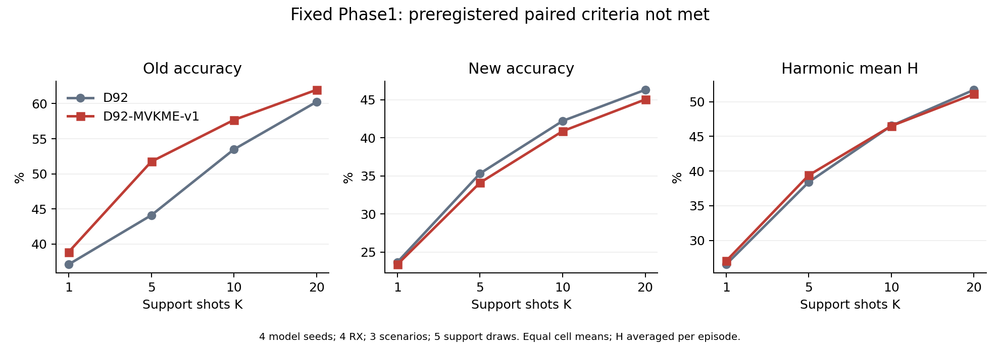
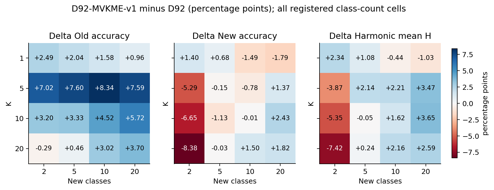

# D92-MVKME-v1重复基准比较结果

记录：9648。4个固定Phase1模型、4RX、3场景、4个K、5种新增类规模、5组support抽样。

单元等权平均；H先在单元内计算再平均。不同support抽样复用query，不作为独立模型重复。

|K|方法|旧类准确率|新类准确率|H|宏F1|
|---|---|---:|---:|---:|---:|
|1|D92|37.11%|23.67%|26.55%|28.33%|
|1|D92-MVKME-v1|38.88%|23.37%|27.04%|29.31%|
|5|D92|44.10%|35.32%|38.42%|39.59%|
|5|D92-MVKME-v1|51.74%|34.10%|39.41%|41.35%|
|10|D92|53.48%|42.21%|46.54%|47.89%|
|10|D92-MVKME-v1|57.68%|40.87%|46.51%|48.31%|
|20|D92|60.24%|46.30%|51.72%|53.28%|
|20|D92-MVKME-v1|61.96%|45.03%|51.11%|52.74%|

|K|Δ旧类（百分点）|Δ新类（百分点）|ΔH（百分点）|
|---|---:|---:|---:|
|1|+1.77|-0.30|+0.49|
|5|+7.64|-1.21|+0.99|
|10|+4.19|-1.34|-0.03|
|20|+1.72|-1.27|-0.61|

以上表格为新增类数大于0的联合任务。旧类保护条件另按全部单元（含旧类单独任务）计算，见per_k_all.csv。

验收标准：每个K的H和新类严格提升、旧类退化不超过1个百分点。通过：False。每个K的新类均提升：False。

完整K×新增类规模、每seed和RX×场景结果见同目录CSV。最弱类别准确率、分组宏F1与遗忘均保留，不能用总体H掩盖局部退化。

适用范围：REPEATED_BENCHMARK_PREVIOUSLY_SCORED_TARGETS: user authorized reuse; frozen D92-MVKME-v1 support-only formula, no query fitting; all four receivers pooled with equal paired-cell weight; not a new independent confirmation or evidence of unexposed generalization。评分不回流本候选调参或选择性重跑。

<!-- MVKME_FINAL_ANALYSIS_20260929 -->

## 独立解释核验

完整 9,648 条评分对应 4,800 对任务和 48 条冻结 DG。独立核对 1840 个汇总值，最大绝对差 2.22e-16。每 K 联合任务为 720 对 rx3 加 240 对 rx1；旧类保护条件另含 old-only，共 1,200 对。H 为单元 H 的均值。

| K | Δ旧类（联合） | Δ新类 | ΔH | Δ旧类（全部任务） |
|---|---:|---:|---:|---:|
| 1 | +1.766 | -0.297 | +0.490 | +2.000 |
| 5 | +7.637 | -1.213 | +0.987 | +7.506 |
| 10 | +4.194 | -1.341 | -0.030 | +3.750 |
| 20 | +1.721 | -1.271 | -0.607 | +1.079 |

单位为百分点。所有 K 的新类平均准确率均下降，H 只在 K1、K5 上升，在 K10、K20 下降。全部任务旧类保护条件各 K 均通过，但预登记的全面改善目标未达成，候选未晋级。

| K | ΔH 为正的模型 seed | Δ新类为正的模型 seed | ΔH 范围（百分点） |
|---|---:|---:|---:|
| 1 | 3/4 | 2/4 | -0.148 至 +0.932 |
| 5 | 4/4 | 0/4 | +0.040 至 +1.964 |
| 10 | 1/4 | 0/4 | -0.488 至 +0.577 |
| 20 | 1/4 | 0/4 | -1.092 至 +0.164 |

不同 support 抽样共享 query，不能当作独立模型重复；这里不作统计显著性声明。四个模型 seed、两个批次和全部 K×新增类规模均保留在[独立解释审计](interpretation_audit.json)，不挑选有利单元。这是已评分目标上的透明重复基准，不是独立泛化验证。

成本与模型传输假设见各 run 的 artifacts.json：训练 checkpoint 大小不是最小推理包；部署状态未知，新增模型传输字节为 null。4,800 次拟合均为闭式头及 support 交叉验证，不称梯度训练收敛。

