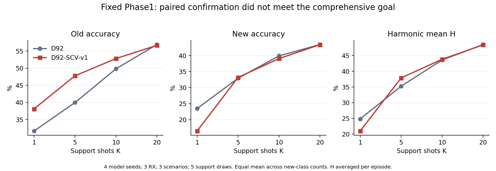
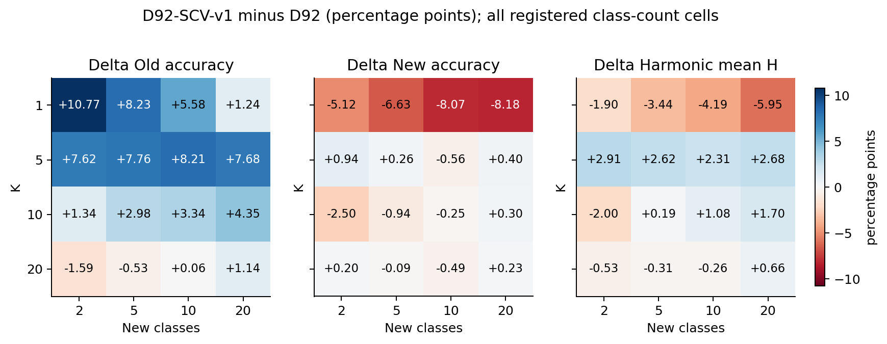

# D92-SCV新旧类配对确认结果

记录：7236。4个固定Phase1模型、3RX、3场景、4个K、5种新增类规模、5组support抽样。

单元等权平均；H先在单元内计算再平均。不同support抽样复用query，不作为独立模型重复。

|K|方法|旧类准确率|新类准确率|H|宏F1|
|---|---|---:|---:|---:|---:|
|1|D92|31.64%|23.47%|24.85%|25.61%|
|1|D92-SCV-v1|38.09%|16.47%|20.98%|24.72%|
|5|D92|39.96%|32.92%|35.26%|36.32%|
|5|D92-SCV-v1|47.78%|33.18%|37.89%|39.58%|
|10|D92|49.81%|39.89%|43.60%|44.89%|
|10|D92-SCV-v1|52.81%|39.04%|43.84%|45.52%|
|20|D92|56.91%|43.42%|48.53%|50.15%|
|20|D92-SCV-v1|56.68%|43.39%|48.41%|49.79%|

|K|Δ旧类（百分点）|Δ新类（百分点）|ΔH（百分点）|
|---|---:|---:|---:|
|1|+6.46|-7.00|-3.87|
|5|+7.82|+0.26|+2.63|
|10|+3.00|-0.85|+0.24|
|20|-0.23|-0.04|-0.11|

预登记H及双侧退化约束通过：False。每个K的新类均提升：False。

完整K×新增类规模、每seed和RX×场景结果见同目录CSV。最弱类别准确率、分组宏F1与遗忘均保留，不能用总体H掩盖局部退化。

适用范围：相对本轮源域和最近目标接收机独立的3RX；不宣称从未在所有历史实验使用。评分不回流本候选调参或选择性重跑。

