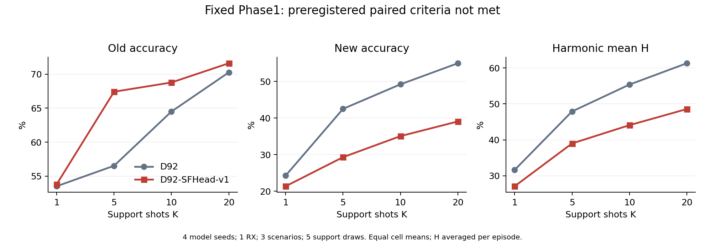
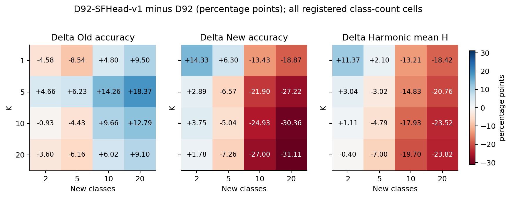

# D92-SFHead-v1新旧类配对确认结果

记录：2412。4个固定Phase1模型、1RX、3场景、4个K、5种新增类规模、5组support抽样。

单元等权平均；H先在单元内计算再平均。不同support抽样复用query，不作为独立模型重复。

|K|方法|旧类准确率|新类准确率|H|宏F1|
|---|---|---:|---:|---:|---:|
|1|D92|53.53%|24.28%|31.64%|36.47%|
|1|D92-SFHead-v1|53.82%|21.37%|27.10%|30.84%|
|5|D92|56.53%|42.50%|47.89%|49.40%|
|5|D92-SFHead-v1|67.41%|29.30%|39.00%|42.72%|
|10|D92|64.50%|49.19%|55.36%|56.89%|
|10|D92-SFHead-v1|68.77%|35.05%|44.07%|45.91%|
|20|D92|70.25%|54.95%|61.28%|62.69%|
|20|D92-SFHead-v1|71.59%|39.05%|48.55%|49.75%|

|K|Δ旧类（百分点）|Δ新类（百分点）|ΔH（百分点）|
|---|---:|---:|---:|
|1|+0.29|-2.92|-4.54|
|5|+10.88|-13.20|-8.89|
|10|+4.27|-14.14|-11.28|
|20|+1.34|-15.90|-12.73|

验收标准：每个K的H和新类严格提升、旧类退化不超过1个百分点。通过：False。每个K的新类均提升：False。

完整K×新增类规模、每seed和RX×场景结果见同目录CSV。最弱类别准确率、分组宏F1与遗忘均保留，不能用总体H掩盖局部退化。

适用范围：Paired frozen candidate confirmation on one current-unexposed complete receiver; all-time historical non-exposure not certified.。评分不回流本候选调参或选择性重跑。

## 完整核验与运行成本

全部2412条评分已从混淆矩阵独立复算。1200次辅助拟合中，1168次满足数值收敛条件，32次在K20达到预登记300次迭代上限；全部有限值，未回退或重跑。K1、K5、K10均收敛，仍未达到性能标准，因此不能把整体失败简单归为迭代次数不足。

累计实际拟合时间260.44秒，平均0.217秒/次（N607 CPU环境，不能代表星载硬件速度）；不含特征提取、预测和日志序列化。实际FP64分类头数值状态为7728至33488字节，未将优化器临时内存混称为持久状态。新增地面统计传输0字节，Phase1模型未更新。

该版本未晋级，整体优化目标未完成。四个模型seed的每K新类和H差值均为负；不筛选表现较好的新增类规模替代完整结论。确认集仅RX20-19，跨接收机结论有限。

