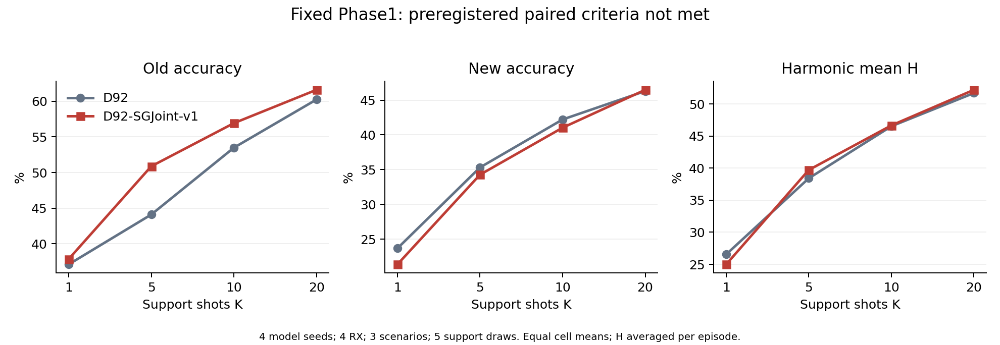
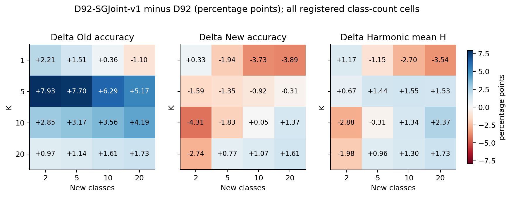

# D92-SGJoint-v1重复基准比较结果

记录：9648。4个固定Phase1模型、4RX、3场景、4个K、5种新增类规模、5组support抽样。

单元等权平均；H先在单元内计算再平均。不同support抽样复用query，不作为独立模型重复。

|K|方法|旧类准确率|新类准确率|H|宏F1|
|---|---|---:|---:|---:|---:|
|1|D92|37.11%|23.67%|26.55%|28.33%|
|1|D92-SGJoint-v1|37.85%|21.37%|24.99%|27.26%|
|5|D92|44.10%|35.32%|38.42%|39.59%|
|5|D92-SGJoint-v1|50.88%|34.27%|39.72%|42.05%|
|10|D92|53.48%|42.21%|46.54%|47.89%|
|10|D92-SGJoint-v1|56.93%|41.03%|46.67%|48.96%|
|20|D92|60.24%|46.30%|51.72%|53.28%|
|20|D92-SGJoint-v1|61.60%|46.48%|52.21%|54.29%|

|K|Δ旧类（百分点）|Δ新类（百分点）|ΔH（百分点）|
|---|---:|---:|---:|
|1|+0.74|-2.31|-1.56|
|5|+6.77|-1.04|+1.30|
|10|+3.45|-1.18|+0.13|
|20|+1.36|+0.18|+0.50|

验收标准：每个K的H和新类严格提升、旧类退化不超过1个百分点。通过：False。每个K的新类均提升：False。

完整K×新增类规模、每seed和RX×场景结果见同目录CSV。最弱类别准确率、分组宏F1与遗忘均保留，不能用总体H掩盖局部退化。

适用范围：REPEATED_BENCHMARK_PREVIOUSLY_SCORED_TARGETS: user authorized reuse; frozen D92-SGJoint-v1 support-only formula, no query fitting; all four receivers pooled with equal paired-cell weight; not a new independent confirmation or evidence of unexposed generalization。评分不回流本候选调参或选择性重跑。

<!-- SGJOINT_FINAL_ANALYSIS_20260928 -->

## 完整解释与旧类验收口径

完整 9,648 条评分包含 4,800 对任务与 48 条冻结 DG。每 K 的联合新旧类汇总为 rx3 的 720 对加 rx1 的 240 对，权重 3∶1。H 是单元 H 的均值。独立核验 1,760 个汇总数值，最大绝对差为 2.23×10⁻¹⁶ 以内。

原联合表中的旧类列仅含 new_count>0；预登记旧类退化约束含 old-only。下表最后一列补齐正式验收口径；所有 K 的旧类约束均通过，但 K1 的 H 及 K1、K5、K10 的新类指标未通过，整体不晋级。原 summary 文件保留，口径补充见两 run 的 artifacts.json。

| K | Δ旧类（联合） | Δ新类 | ΔH | Δ旧类（全部注册任务） |
|---|---:|---:|---:|---:|
| 1 | +0.744 | -2.306 | -1.557 | +1.213 |
| 5 | +6.774 | -1.041 | +1.296 | +7.097 |
| 10 | +3.446 | -1.181 | +0.129 | +3.287 |
| 20 | +1.361 | +0.178 | +0.500 | +0.973 |

四模型 seed 中，K1 的 H 全部下降，K1、K5、K10 的新类准确率全部下降。K5 的 H 在四个 seed 均上升，但新类下降；K10 的 H 仅小幅提升且 1/4 seed 下降；K20 的 H 四个 seed 均提升，但新类仅 2/4 seed 提升。不能称为全面明显改善。rx3 在 K10、K20 的 ΔH 分别为 −0.760、−0.008 个百分点，rx1 对应 +2.797、+2.023，联合改善存在接收机差异。old-only 的 K20 旧类准确率还下降 0.581 个百分点，完整旧类任务没有被隐藏。

两批次共 4,800 次拟合，累计 fit_seconds 为 1119.447 秒。详细成本、状态字节和摘要交付假设见各 run 的 artifacts.json 与 fit_audit.json。此处没有迭代头训练收敛结论，也没有独立泛化或统计显著性声明。

[独立解释核验](interpretation_audit.json)保留每 K、模型 seed、批次和全部 K×新增类规模的结果。

