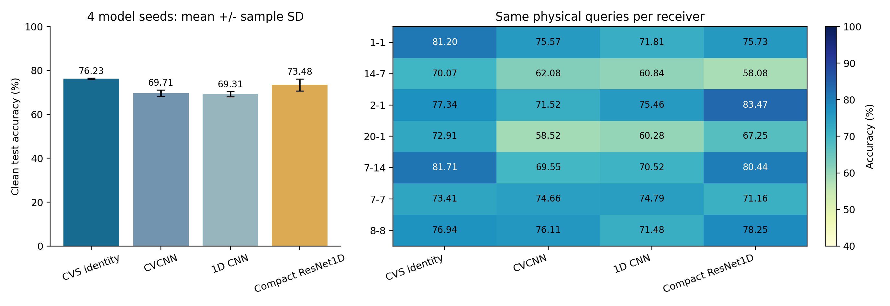

# 无信道增强四基准的 clean 测试报告

**结果：原 CVS 身份骨干 76.2272%±0.3291%，高于 CVCNN 6.5141 个百分点、普通 1D CNN 6.9161 个百分点、轻量 1D ResNet 2.7446 个百分点。** CVS 对前两者的优势在 4 个配对 seed 中均成立；对轻量 ResNet 在 3/4 个 seed 中成立，不声称每个 seed 或每个接收机都最优。

状态：ANALYZED，远端产物独立读回 **VERIFIED**。run：`20261001-phase1-clean-baselines-manysig-m16-r01`；评估 release commit：`b5bf609e185141ac8e371aa7586e41f65806fc1b`。4 网络×4 seed=16 行全部预测完成，独立 scorer 产生 128 条 overall/RX 指标。每行使用同一组 168,000 个物理测试包，7 个 RX 各 24,000 包，6 个 TX 各 28,000 包。

## 总体测试结果

数值为 4 个 model seed（2026092701 至 2026092704）的均值 ± 样本标准差（ddof=1），不是置信区间，也不是测试包抽样误差。

|网络|Accuracy|Macro-F1|Macro accuracy|
|---|---:|---:|---:|
|原 CVS 身份骨干|76.2272% ± 0.3291%|75.9075% ± 0.3709%|76.2272% ± 0.3291%|
|CVCNN|69.7131% ± 1.4695%|69.5270% ± 1.3587%|69.7131% ± 1.4695%|
|普通 1D CNN|69.3112% ± 1.2009%|68.9914% ± 0.9864%|69.3112% ± 1.2009%|
|轻量 1D ResNet|73.4826% ± 2.7392%|73.1214% ± 2.5849%|73.4826% ± 2.7392%|

## 同 seed 配对比较

差值均为“原 CVS − 对比网络”，单位为百分点；同 seed 使用相同 batch 顺序、训练与测试物理样本。只有 4 个训练 seed，不作强统计显著性声明。

|对比网络|平均差值 ± seed SD|四个 seed 的差值|CVS 更优的 seed 数|
|---|---:|---|---:|
|CVCNN|+6.5141 ± 1.6157|+7.7173, +4.1958, +7.5119, +6.6315|4/4|
|普通 1D CNN|+6.9161 ± 1.1605|+8.2863, +6.1976, +7.4369, +5.7435|4/4|
|轻量 1D ResNet|+2.7446 ± 2.9201|+4.5190, -0.4571, +5.8208, +1.0958|3/4|

## 每个 seed 的总体准确率

|model seed|原 CVS|CVCNN|普通 1D CNN|轻量 1D ResNet|
|---|---:|---:|---:|---:|
|2026092701|76.0024%|68.2851%|67.7161%|71.4833%|
|2026092702|75.9369%|71.7411%|69.7393%|76.3940%|
|2026092703|76.6542%|69.1423%|69.2173%|70.8333%|
|2026092704|76.3155%|69.6839%|70.5720%|75.2196%|

## 各目标接收机

每个接收机每个 seed 为 24,000 包；表中使用数据里的实际接收机 ID，不把 ID 字符串当作 RX 索引。各网络逐包面对全部 6 类，未使用类别配额或全局重排。

|接收机 ID|原 CVS|CVCNN|普通 1D CNN|轻量 1D ResNet|
|---|---:|---:|---:|---:|
|1-1|81.1979% ± 1.5577%|75.5677% ± 1.7529%|71.8073% ± 3.3394%|75.7344% ± 0.6106%|
|14-7|70.0740% ± 1.5625%|62.0781% ± 3.9749%|60.8354% ± 3.6074%|58.0792% ± 3.0895%|
|2-1|77.3438% ± 6.1019%|71.5167% ± 2.6510%|75.4562% ± 4.0716%|83.4687% ± 2.3661%|
|20-1|72.9094% ± 3.2157%|58.5167% ± 1.9895%|60.2823% ± 2.2892%|67.2458% ± 5.6849%|
|7-14|81.7125% ± 6.4343%|69.5479% ± 5.4802%|70.5198% ± 4.5022%|80.4396% ± 4.3306%|
|7-7|73.4146% ± 3.2518%|74.6552% ± 1.7102%|74.7937% ± 3.0317%|71.1635% ± 4.6237%|
|8-8|76.9385% ± 1.5145%|76.1094% ± 1.6589%|71.4833% ± 1.1351%|78.2469% ± 1.2427%|

## 各发射机

由同一测试混淆矩阵计算每类召回率（该 TX 正确识别数 / 该 TX 测试包数），每类每个 seed 为 28,000 包。

|TX|原 CVS|CVCNN|普通 1D CNN|轻量 1D ResNet|
|---|---:|---:|---:|---:|
|14-10|95.5848% ± 1.9172%|98.0625% ± 0.4041%|98.6705% ± 0.4606%|98.0009% ± 0.7297%|
|14-7|46.1571% ± 2.9563%|37.0304% ± 4.3297%|34.1955% ± 1.5856%|34.0848% ± 4.9457%|
|20-15|61.0768% ± 7.0503%|57.9562% ± 9.2664%|53.8875% ± 4.2571%|62.8661% ± 10.0716%|
|20-19|65.2420% ± 1.2953%|56.2098% ± 2.6141%|56.1875% ± 3.0972%|56.3250% ± 2.6231%|
|6-15|99.8000% ± 0.0335%|99.7679% ± 0.0290%|99.7268% ± 0.0471%|99.7768% ± 0.0513%|
|8-20|89.5027% ± 6.5498%|69.2518% ± 4.3991%|73.1991% ± 7.7499%|89.8420% ± 2.4154%|

## 实际训练与测试口径

用户于 2026-10-01 要求“进行基准的测试集测试，给出报告”。这次立即测试四个已固定基准，不等待新 CVS 候选；新 CVS 六候选仍按已登记的源域联合规则选择，本次结果不得回流候选排序、调参或选择性重训。

源数据是 ManySig，RX 1、3、4、6、8，day 1、2、3，split_seed=392005；L_s=6300 用于训练、U_s=56700 未使用、V=27000 仅源验证。每行从零训练 200 轮，使用固定末轮 E200。每轮优化步数是 ceil(6300/128)=50，最后一批 28 包；不是只取 50 个样本，也不是每轮随机截断 50 步。每轮遍历全部 6300 个有标签源样本，共 10000 次参数更新。AdamW lr=2e-4、wd=1e-4、cosine 最低 lr=1e-6，FP32，无梯度裁剪；同 seed 的 batch 顺序匹配。

四网络均只使用身份交叉熵，不使用任何数据/星地信道增强、域骨干、伪标签、teacher/EMA 或额外损失。equalized=1、中心 256 点 I/Q、逐包 RMS 归一化；测试复用原 VALIDATED_ONCE capsule，clean 的语义是原 received/post-sync/noeq 测试观测，不额外注入卫星残余信道，不能把 clean 理解为理想无噪声信号。目标 RX 0、2、5、7、9、10、11，day 0 至 3；6 类为 14-10, 14-7, 20-15, 20-19, 6-15, 8-20。

原 CVS 保留原时域、频域和 PA 身份分支、cosine scale=30/no margin、内部 dropout；域骨干关闭。常见网络保留标准 Linear 分类头。轻量 ResNet1D 是 6 个 basic block、宽度 32/64/96 的项目基准，不是作者原版 ResNet18。网络和分类头不同，结果证明本配置下整个 CVS 身份网络有总体准确率优势，不能单独归因于某种卷积、某个分支或参数数量。源域 V 结果不代替测试结果，带增强的历史成绩不混入本表。

## 参数与资源成本

RTX 3090、Torch 2.1.0+cu121、FP32。以下时间为 4 个 seed 既有源 resource_profile 的均值，5 次 warmup，20 次推理、10 次训练测量；使用一次性模型副本，未改变训练状态。训练时间是合成 batch 的完整优化步，不是整轮训练时长。原测量期间存在 GPU 共用，不能据此宣称隔离环境的精确加速倍数。

|网络|总参数|CE 有梯度参数|Conv/Linear MAC/包|训练 batch128 ms|推理 batch1 ms|模型常驻状态 MiB|本次 168000 包预测秒|预测峰值显存 MiB（4seed最大）|
|---|---:|---:|---:|---:|---:|---:|---:|---:|
|原 CVS 身份骨干|382146|317665|9862436|29.198|4.955|1.458|10.286|184.274|
|CVCNN|104646|104646|11797248|7.645|0.999|0.403|8.187|65.131|
|普通 1D CNN|174726|174726|11797248|3.354|0.449|0.670|7.554|57.680|
|轻量 1D ResNet|167814|167814|7955008|12.285|1.452|0.648|8.219|25.408|

MAC 只覆盖卷积及矩阵乘法，不含 FFT、归一化、物理特征构造、池化与逐元素操作；CVS 每包有 2 次 FFT，因此 MAC 不是完整 FLOPs。常驻状态只含模型参数与 buffer，不含 optimizer、进程及数据。当前 native 共 382146 个参数，CE 实际有梯度 317665 个，其余 64481 个未参与本次 CE；这部分不计作有效学习容量。原 CVS 总参数、常驻状态和训练成本高于这些紧凑对比网络，准确率优势不能同时解释为轻量化优势。

本次预测时间含 I/Q 批量复制及 GPU 推理，batch=256，CUDA 同步后测量；不含模型装载与后续独立评分。预测峰值为本进程 CUDA 已分配显存，不是整卡占用。完整逐行时间、显存、硬件与源参数配置保留在 evidence。目标端监督微调参数、训练耗时、新增传输字节等为 N/A：本次没有目标适应或注册，不模拟星载微调。

## 结果有效性与局限

16 个实际 checkpoint 均在预测前核实：E200/10000、相同 physical source role IDs/RX/day/比例/split、6 类映射、scratch 无祖先、无 target 接触、无增强/域网络/额外损失。实际 last.pt 与 source contract、initialization、resolved config 全量一致，严格 state_dict 装载后先做无 query 的零输入前向。原始角色 contract 无 runtime 输入扩展字段的问题已在发布前修复，并通过真实 schema 回归检查；13 项协议检查及独立 P0/P1 审查的原问题修复完成。数据复用 VALIDATED_ONCE，不新增重复数据重验。

预测进程只读 clean.npy 与 opaque ID，不读 satellite.npy 或 truth，不拟合 query，每包 argmax 面对全部 6 类。全部 16 个预测文件完整固定、ID 和类一致后，独立 scorer 才读取 truth。新 run/release 输出独占；每个实际空闲 GPU 只启动一个评估进程，未停止、重启或热修改任何健康任务。逐行 provenance、resolved、完成标记、dispatcher 最终状态及 scorer 标记由独立 SSH 读回，最终无失败或缺项。

该目标 benchmark 历史上已有曝光，属于固定研究测试，不声称全新盲测。这里只有固定一次 split 和 4 个 model seed，不能推广为所有数据划分/接收机上的普遍优势。Phase1 是 6 类闭集、零目标适应测试，没有 support 和新增类；D92 的 A/B/C、K×新增类数、H 等为 N/A。本次按已登记总体/RX维度评分，并从混淆矩阵补列 TX；day 0 至 3 汇总，未另做逐日分层。

## 证据与交付

[独立最终读回](evidence/final_readback.json)、[评分完成标记](evidence/scoring_clean_complete.json)、[逐行/RX 指标 CSV](evidence/clean_scored_results.csv)、[4seed 汇总 CSV](evidence/clean_summary.csv)、[CVS 配对差值 CSV](evidence/clean_paired.csv)、[逐 TX 汇总 CSV](evidence/per_transmitter_summary.csv)、[资源汇总 CSV](evidence/resource_summary.csv)、[含混淆矩阵的完整指标](evidence/clean_scored_results.json)、[可导出 PDF 图](evidence/clean_baseline_results.pdf)。

原始预测留在 N607 `/home/szu2070436088/2510044040/CV-SincNet/runs/20261001-phase1-clean-baselines-manysig-m16-r01/<variant>-s<seed>/prediction/clean_predictions.npz`；原 E200 权重和日志保持原 source run，不移动、不覆盖。评估完整命令/数据/seed与16行输出见 experiment.json。发布 commit 已 push 并独立核实 OID，本报告与证据另行提交/push。
