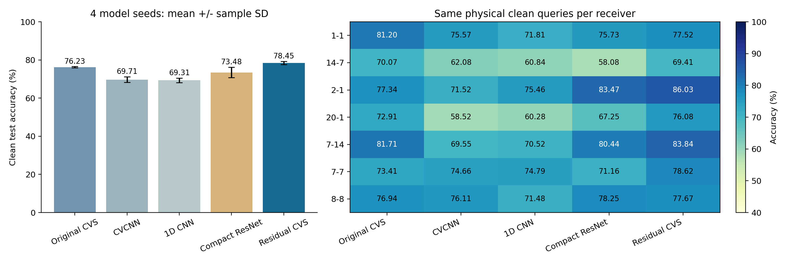

# CVS 结构优化：轻量残差融合的 clean 确认报告

**残差融合 CVS：78.4543% ± 0.8436%；原 CVS：76.2272% ± 0.3291%。同 seed 平均提升 2.2271 个百分点，4/4 个 seed 均提升；总参数减少 57.03%，CE 有梯度参数减少 48.30%。** 在本次固定划分、纯CE无增强、clean测试条件下，结构提升与轻量化两个目标同时得到实测支持。

状态：ANALYZED，N607 独立读回 VERIFIED。run `20261001-phase1-cvs-selected-clean-manysig-m20-r01`，release commit `34f6a98a95f0d7ceedb21c8c496a13cb09b0bb28`。仅新增4个候选预测，原16个基准预测只读复用；联合20行评分，每行同168000包、7接收机、6类，产生160条overall/RX指标。原128条基准指标与上一报告逐字段完全一致，没有重跑基准。

## 整体测试结果

4个model seed=2026092701至2026092704，均值±样本标准差(ddof=1)，不是置信区间。

|网络|Accuracy|Macro-F1|总参数|有效CE参数|
|---|---:|---:|---:|---:|
|原 CVS 身份骨干|76.2272% ± 0.3291%|75.9075% ± 0.3709%|382146|317665|
|CVCNN|69.7131% ± 1.4695%|69.5270% ± 1.3587%|104646|104646|
|普通 1D CNN|69.3112% ± 1.2009%|68.9914% ± 0.9864%|174726|174726|
|轻量 1D ResNet|73.4826% ± 2.7392%|73.1214% ± 2.5849%|167814|167814|
|残差融合 CVS|78.4543% ± 0.8436%|78.2067% ± 0.9517%|164225|164225|

## 与原 CVS 的四seed配对

|seed|原 CVS|残差 CVS|差值（百分点）|
|---|---:|---:|---:|
|2026092701|76.0024%|78.6107%|+2.6083|
|2026092702|75.9369%|77.4298%|+1.4929|
|2026092703|76.6542%|79.4732%|+2.8190|
|2026092704|76.3155%|78.3036%|+1.9881|

平均配对提升 2.2271±0.6033 个百分点，最小提升 1.4929 个百分点。四seed都提升，但目标是单一固定split，不能声称对所有划分或所有接收机均成立。

|对比网络|平均配对提升±seed SD（百分点）|提升seed数|
|---|---:|---:|
|原 CVS 身份骨干|+2.2271±0.6033|4/4|
|CVCNN|+8.7412±2.1886|4/4|
|普通 1D CNN|+9.1432±1.6742|4/4|
|轻量 1D ResNet|+4.9717±3.5194|4/4|

## 接收机与发射机分层

每个接收机每seed24000包，表中为真实设备ID，非RX数组索引。

|接收机ID|原 CVS|残差 CVS|均值差（百分点）|CVCNN|1D CNN|轻量ResNet|
|---|---:|---:|---:|---:|---:|---:|
|1-1|81.1979% ± 1.5577%|77.5219% ± 2.3317%|-3.6760|75.5677% ± 1.7529%|71.8073% ± 3.3394%|75.7344% ± 0.6106%|
|14-7|70.0740% ± 1.5625%|69.4115% ± 5.9142%|-0.6625|62.0781% ± 3.9749%|60.8354% ± 3.6074%|58.0792% ± 3.0895%|
|2-1|77.3438% ± 6.1019%|86.0344% ± 1.3518%|+8.6906|71.5167% ± 2.6510%|75.4562% ± 4.0716%|83.4687% ± 2.3661%|
|20-1|72.9094% ± 3.2157%|76.0812% ± 4.0087%|+3.1719|58.5167% ± 1.9895%|60.2823% ± 2.2892%|67.2458% ± 5.6849%|
|7-14|81.7125% ± 6.4343%|83.8396% ± 1.3901%|+2.1271|69.5479% ± 5.4802%|70.5198% ± 4.5022%|80.4396% ± 4.3306%|
|7-7|73.4146% ± 3.2518%|78.6240% ± 2.3293%|+5.2094|74.6552% ± 1.7102%|74.7937% ± 3.0317%|71.1635% ± 4.6237%|
|8-8|76.9385% ± 1.5145%|77.6677% ± 1.8228%|+0.7292|76.1094% ± 1.6589%|71.4833% ± 1.1351%|78.2469% ± 1.2427%|

每个TX每seed28000包；下表为该类召回率，从同一混淆矩阵计算，不重新训练或预测。

|TX|原 CVS|残差 CVS|
|---|---:|---:|
|14-10|95.5848% ± 1.9172%|94.7884% ± 2.2605%|
|14-7|46.1571% ± 2.9563%|45.6268% ± 1.6612%|
|20-15|61.0768% ± 7.0503%|72.1393% ± 6.3981%|
|20-19|65.2420% ± 1.2953%|66.2179% ± 0.7861%|
|6-15|99.8000% ± 0.0335%|99.8152% ± 0.0166%|
|8-20|89.5027% ± 6.5498%|92.1384% ± 1.2424%|

## 改了什么，为什么不需要叠参数

原时域、频域、PA特征提取器、Sinc滤波、非线性基底、记忆深度、输入和分支dropout保持原实现，域骨干关闭。唯一主要改动是删除多级身份/PA交叉投影与门控分类头，改为两个LayerNorm、160个可学习有界通道增益和余弦分类权重：

`h = LN(u) + tanh(a) ⊙ LN(p)`，`logits_c = 30 × cos(h, w_c)`。

u为原时域+频域融合特征，p为PA_local+PA_delta；增益初值0.25，分类scale30/no margin。新头1760参数，保留原提取器162465参数，总164225；没有增加深度、通道或训练轮数。原未参与CE的64481个参数被移除只是存储控制，不算性能机制；真正改变的是旧有155200有效头参数压缩成1760参数，减少串联非线性和可自由混合的次数。

数学上，通用特征有直接残差路径，PA补充可通过正负有界通道增益进入身份表示；对u的局部导数只经J_LN，而非旧头多层投影/ReLU。LayerNorm与余弦归一化仍会移除部分方向，不能声称梯度永不消失或满秩；头部容量、归一化及dropout变化同时发生，结果不单独证明残差相加的因果作用。

通信上，保留时域波形、复数I/Q和频域特征的联合表征，不施加全局相位强不变性；特征仍可编码IQ失衡、相对相位和频偏纹理。减少多级自由混合的设计假设是让有限源样本学习更直接的身份几何，而非把接收机或频谱捷径进一步放大；目标结果仅支持整体结构，未测量上述单项失真是否被分离。

物理上，PA非线性和记忆基底完整保留，新的p路径直接补充通用u路径；tanh增益是判别学习参数，不是实际PA物理系数或置信度。native PA逐延迟通道的包络门控会随时间变化，因此本实验没有把PA展开声称为精确冗余并折叠。单包received IQ一般无法无条件分离TX、信道和RX，这里不宣称物理解耦已经实现。

射频指纹上，本实验保持唯一身份CE和所有已注册类竞争，让原物理分支直接收到CE梯度；以较小分类头限制复杂记忆，保留160维余弦身份几何。四seed干净测试实测说明在当前契约下，原CVS物理特征可以由更简单的身份头获得更好总体识别表现；不把接收机ID、target统计、额外损失或更多参数当作改进来源。源域候选及完整设计推导见[研发设计](../../../docs/CVS_RESIDUAL_IDENTITY_RESEARCH_20261001.md)。

## 源域冻结与训练预算

六候选全部在目标访问前按预登记sourceV规则联合选择：0.5×四seedE200源V准确率+0.5×最差源RX准确率，0.2个百分点范围优先小MAC、再少参数。自动research_selection选中residual_fusion，选择重算与原结果完全一致；源训练结束早于基准clean launch，当前目标成绩不参与选择。新候选源V98.069444%、最差源RX94.495370%；源指标提升只是研发依据，不替代本次clean结果。未选中的5个候选没有进行目标测试，不拿其潜在目标结果重新排序。

四个候选权重均从零训练、无checkpoint/optimizer/teacher/EMA祖先，与基准使用相同物理L/U/V角色和类映射。L=6300，U=56700未用，V=27000仅源验证；源RX1/3/4/6/8、day1/2/3，split392005；target RX0/2/5/7/9/10/11、day0至3，6类。equalized=1、中心256点I/Q、逐包RMS。200轮×50更新，batch128/no drop，AdamW2e-4/wd1e-4/cosine1e-6，FP32/no clipping。同seed batch顺序匹配；无输入或星地信道增强、域骨干、PL、附加loss。CE是唯一训练目标。

## 实测轻量性与开销

|网络|总参数|CE有梯度参数|Conv/Linear MAC/包|模型常驻MiB|训练batch128 ms|推理batch1 ms|推理batch128 ms|168000包预测秒|预测峰值MiB|
|---|---:|---:|---:|---:|---:|---:|---:|---:|---:|
|原 CVS 身份骨干|382146|317665|9862436|1.458|29.198|4.955|4.707|10.286|184.274|
|CVCNN|104646|104646|11797248|0.403|7.645|0.999|1.173|8.187|65.131|
|普通 1D CNN|174726|174726|11797248|0.670|3.354|0.449|0.500|7.554|57.680|
|轻量 1D ResNet|167814|167814|7955008|0.648|12.285|1.452|1.512|8.219|25.408|
|残差融合 CVS|164225|164225|9708836|0.627|29.145|4.726|4.472|10.217|183.438|

总参数减少57.0256%，有效CE参数减少48.3025%，常驻模型状态减少57.0013%；Conv/Linear MAC只减少1.5574%，2次FFT仍保留。因此轻量性主要体现在权重/优化器状态及头部容量，不宣称计算量或推理延迟同比例下降。

硬件RTX3090、Torch2.1.0+cu121、FP32。源profile每seed测量warmup5、推理20次、训练10次，使用一次性副本；训练时间含合成batch完整优化步，4seed均值，测量有GPU共用，不是隔离加速倍数。MAC只覆盖卷积/矩阵乘法，不含FFT、物理基底、归一化、池化及逐元素运算。常驻状态只含参数与buffer。当前预测batch256，168000包耗时含输入复制/GPU同步，不含模型加载和评分；峰值是本进程CUDA分配显存，不是整卡。完整源profile和逐行时间/显存保存，未测星载硬件/传输开销记N/A，不声称星上已部署或达到SFT省算力。

实际源训练进程到E200的累计峰值显存（训练、源V验证及初始smoke，位于训练后副本profile之前）也保留：原CVS四seed最大239.372MiB，残差CVS最大236.781MiB。它不同于副本benchmark双模型峰值，也不同于整卡占用；逐seed口径见[evidence/training_memory.json](evidence/training_memory.json)。

## 协议与复用验证

仅预测器加载合法权重：实际completion、scratch初始化、完整物理source角色、num_classes/input/classes、resolved及last.pt全量一致，严格load_state_dict后先做无query零输入前向。只读clean.npy与opaque IDs，不读satellite.npy或truth，不拟合query；单样本面对全部6类。20行完成标记、相同ID/类映射和clean预测均验证后，独立scorer才连接truth。复用仅允许固定baseline run、四基准、完整16行评分标记及baseline-only冻结配置；新dispatcher待执行列表排除16基准，全部旧128条指标与上一报告完全一致。

15项聚焦协议检查通过，复用改动单次独立P0/P1审查PASS；冷CLI/compile/真实四权重provenance预检查和最终行resolved/provenance均已核实。dispatcher PID 763909、CWD/argv及最终20行/160指标由独立SSH读回验证。输出独占，仅四新进程在空闲GPU0至3运行，无基准重跑、失败、输出覆盖或健康任务干预。数据复用VALIDATED_ONCE，不重复数据重验。

clean表示原received/post-sync/noeq测试观测，不额外注入卫星信道，不表示理想无噪声信号。目标benchmark历史上已曝光，属于固定研究确认，不是新的盲测；不能将该结果回流调参、候选排序或选择性重训。本次单split/4seed且完整网络与头部正则化一同变化，限制因果归因和广泛泛化声明。Phase1闭集，无target support适应、新类注册或unknown；D92 A/B/C、K表、H和传输字节N/A。day0至3汇总，RX/TX分层完整，未另做逐日表。

## 交付与证据

[最终独立读回](evidence/final_readback.json)、[评分标记](evidence/scoring_clean_complete.json)、[指标CSV](evidence/clean_scored_results.csv)、[四seed汇总](evidence/clean_summary.csv)、[配对差值](evidence/clean_paired.csv)、[各TX](evidence/per_transmitter_summary.csv)、[资源成本](evidence/resource_summary.csv)、[完整混淆矩阵](evidence/clean_scored_results.json)、[分析验证](evidence/analysis_validation.json)、[PDF图](evidence/selected_cvs_clean.pdf)。原权重、日志与预测留在既有N607run，不移动覆盖。代码接口为 experiments/cvs_residual_identity/model.py，冻结source及test配置均进入Git；报告与证据完成提交/push独立OID核实后交付。

## 当前目标完成核对

同划分纯CE、无增强、只clean、无域骨干和无目标反馈均由实际resolved/provenance及评分artifact证明；数学/通信/物理/RFFI分析对应已实现残差头，实际四seed总体accuracy较原CVS全部提升，总参数和有效CE参数减少，Conv/Linear MAC不增加。模型、配置、源冻结、完整评分和成本均已交付。此结论仅指当前固定研究契约，不声称每接收机均提升或整体计算减少57%。具体证据路径见[evidence/goal_completion_audit.json](evidence/goal_completion_audit.json)。
