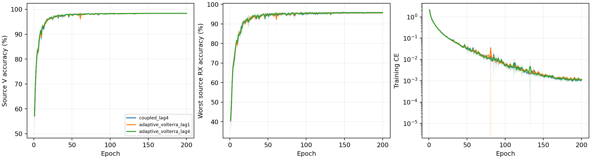

# CVS 可学习相位记忆残差：完整源实验报告

8个新scratch模型完成E200×50；完整核对80000步、1600轮、逐步/epoch JSONL、详细stdout和紧凑JSONL/CSV。实际仅CE、无增强、无域骨干；原L6300/V27000、U56700不使用。两个全局门参数从零开始，总202555参数（控制202553，新增2），全部参与CE梯度；FP32/TF32关闭。控制仅源元数据，无权重继承。

固定源规则选择 `adaptive_volterra_lag4`。新候选胜出，冻结后默认4份新clean预测；本报告仍没有新测试结论。总体目标尚未证明。

|候选|四seed源V（%）|最差源RX（%）|固定分数（%）|参数|
|---|---:|---:|---:|---:|
|coupled_lag4|98.3907|95.6667|97.0287|202553|
|adaptive_volterra_lag1|98.3759|95.6250|97.0005|202555|
|adaptive_volterra_lag4|98.4019|95.7593|97.0806|202555|

按四seed mean(0.5V+0.5最差RX)最高选择；完全并列才比V、最差RX、MAC、参数和固定顺序。所有模型仅E200权重参与，最好轮次只是诊断，不读目标成绩。

|模型|seed|E200 V（%）|最差RX（%）|末轮CE|最好V（%，未选）|最好轮|
|---|---:|---:|---:|---:|---:|---:|
|coupled_lag4|2026092701|98.5630|95.9259|0.000920297|98.5778|146|
|coupled_lag4|2026092702|98.4667|96.0000|0.00138365|98.5037|146|
|coupled_lag4|2026092703|98.3444|95.6296|0.000937345|98.3889|145|
|coupled_lag4|2026092704|98.1889|95.1111|0.00103615|98.2185|98|
|adaptive_volterra_lag1|2026092701|98.5407|95.9444|0.000855446|98.5704|146|
|adaptive_volterra_lag4|2026092701|98.5333|96.0000|0.000999573|98.5519|146|
|adaptive_volterra_lag1|2026092702|98.4481|96.0741|0.00117228|98.5074|166|
|adaptive_volterra_lag4|2026092702|98.5000|96.1296|0.00137079|98.5444|166|
|adaptive_volterra_lag1|2026092703|98.2778|95.3889|0.00121589|98.3370|138|
|adaptive_volterra_lag4|2026092703|98.3778|95.7963|0.000827306|98.4259|121|
|adaptive_volterra_lag1|2026092704|98.2370|95.0926|0.00138549|98.2815|104|
|adaptive_volterra_lag4|2026092704|98.1963|95.1111|0.00137133|98.2185|140|

2400条曲线含四控制及八新模型，阴影是四seed样本SD。全部720个新模型TX/RX/day单元完整覆盖V；源RX分层不是未知RX测试。[曲线](evidence/source_curves.csv) · [同seed控制差分](evidence/source_paired_control.csv) · [全部源单元](evidence/source_all720_cells.csv)。

## 实际学习系数与卷积输入

在t=n-m，p=(P[t]+P[t-4])/8、C=z[t-l]²conj(z[t-2l])/4；保留z，三阶为zp+tanh(raw3)(C-zp)，五阶为zp²+tanh(raw5)(Cp-zp²)。m0至3、l固定1或4；两个raw精确零初始化。零门时保持原控制输入和共享scratch输出；实测训练系数不称硬件PA参数。

|模型|seed|末轮a3|末轮a5|门梯度范数均值|三阶相对输入变化|五阶相对输入变化|公式误差|
|---|---:|---:|---:|---:|---:|---:|---:|
|adaptive_volterra_lag1|2026092701|0.0042947801|-0.0033666117|0.00149342|0.0048789619|0.0033338373|0|
|adaptive_volterra_lag4|2026092701|-0.05066064|-0.026101371|0.0022717553|0.071784176|0.035223603|0|
|adaptive_volterra_lag1|2026092702|-0.0059913322|-0.015595122|0.0017499891|0.0067723705|0.015377457|0|
|adaptive_volterra_lag4|2026092702|-0.012986984|-0.006644316|0.0028286899|0.01837123|0.0089803673|0|
|adaptive_volterra_lag1|2026092703|-0.041386746|0.032569285|0.002264981|0.046871774|0.032176584|0|
|adaptive_volterra_lag4|2026092703|-0.043928787|-0.00083599851|0.0018583929|0.063402884|0.0011537614|0|
|adaptive_volterra_lag1|2026092704|0.049261812|0.02109432|0.0015869213|0.055085599|0.020472676|0|
|adaptive_volterra_lag4|2026092704|0.0014801999|-0.028019736|0.0024226317|0.0021256329|0.038640849|0|

完整80000步审计两门梯度、前后raw/实际tanh系数及连续性；1600轮记录门状态/梯度均值，输入诊断来自当轮实际末batch28包；公共冻结输入每模型30包。相对变化分母是控制项L2范数clamp至1e-12，不是识别收益，也不参与选模。[1600轮门测量](evidence/source_gates_all1600.csv) · [1600条源输入](evidence/source_adaptive_input_all1600.csv) · [8条公共输入](evidence/source_public_adaptive_input_all8.csv)。

## 数学、通信与RFF边界

复三阶延迟平衡l+l-2l=0使输入lift对仿射相位协变；整网仅保留常相位性质，不声称CFO/RX/LTI不变。25MHz的lag1/4为40/160ns，三阶新增历史2l为80/320ns；这些是设计尺度，未测真实器件记忆。两个系数是全局模型参数，不按包/RX/目标拟合。raw received输入、固定alpha0；重复相关只测received相对频率，不恢复TX晶振。零门保留控制函数不证明整网动力学等距或更快收敛。

冻结公共链5TX×6RX保留RX镜像/三阶同波形反例。八模型最大常相位logit误差2.0265579e-05，附加±80kHz最大logit响应28.113235；后者不是CFO不变性误差。逐点坐标重建最大误差0。相位容差只报告，不选模或停机。

源几何、同步和公共TX/RX干预是received表征证据；不同硬件链可能产生相同接收波形，不能认定唯一TX器件恢复、完整Volterra、DPD、因果TX/RX分离或真实在轨泛化。公共链不是精确WiSig均衡器，公共设置无实际源身份标签，合成身份准确率N/A。全部9600条实际源block归一化及48条公共测量覆盖共享分母；学习尺度/径向门仍可改变相对通道能量。[归一化](evidence/source_energy_normalization_all9600.csv) · [公共链](evidence/source_physics_cascade.csv) · [相位测量](evidence/source_affine_phase_audit.csv)。

## 实际成本与未完成项

|模型|参数|模型常驻bytes|Conv/Linear MAC/包|batch1推理ms均值|batch128训练ms均值|源峰值bytes最大|
|---|---:|---:|---:|---:|---:|---:|
|coupled_lag4|202553|810844|7199008|7.0622|41.0888|163559936|
|adaptive_volterra_lag1|202555|810852|7199008|7.8142|40.2406|167101440|
|adaptive_volterra_lag4|202555|810852|7199008|7.9069|42.9096|167101440|

RTX3090/Torch2.1/完整FP32。新模型多2个学习参数；Conv/Linear形状相同不等于总运算量相同，复乘/tanh/残差/RMS/FFT不计入该MAC计数。实测时延与显存包含执行且受并发影响，不作独占成本结论；profile使用副本，不更新正式模型。星载、传输、support/SFT/新增类和D92三阶段N/A。

默认clean确认仍待完成；不得把源分数当作测试提升。 所有负差值保留，目标成绩不反馈结构/超参数/选模/重排/选择性重跑。总体性能/RFF目标仍未达到。

[前瞻设计](../../../docs/CVS_ADAPTIVE_VOLTERRA_PHASE_MEMORY_20261002.md) · [预登记](experiment.json) · [全量日志审计](evidence/source_completion_validation.json) · [固定源选择](evidence/source_selection.json) · [独立分析](evidence/source_analysis_validation.json)。

实际源终态 VERIFIED：dispatcher 与8个worker均自然退出，8行各200轮/10000步。源运行commit `db3860587aa6d1c031a9dd9b9226cfc38f51f513`。[终态证据](evidence/final_source_readback.json)。固定源规则选中 `adaptive_volterra_lag4`；选中候选独立clean收尾仍待完成。目标仍未证明完成。
