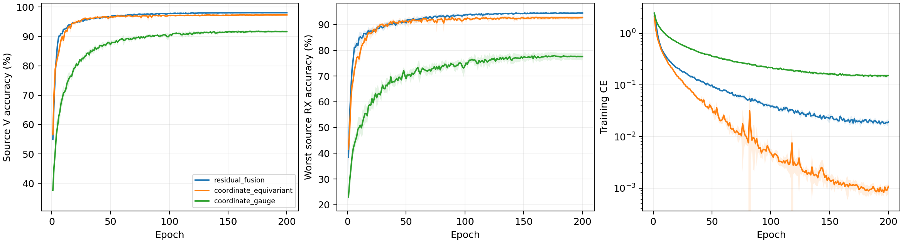

# CVS 同步坐标保留身份网络：完整源实验报告

8 个新 scratch 模型完成 E200×50；完整核对 80000 步、1600 轮、详细文本与紧凑 epoch JSONL/CSV。实际为普通 CE、无增强、无域骨干、无权重继承，原 L6300/V27000、U56700 unused；全部新模型采用固定完整 FP32。原四份残差控制完整源曲线与实时核实终值一致。

固定性能优先源规则选择 `residual_fusion`。原残差胜出，未选同步候选不读query；默认保留已核实历史clean，不重跑历史。

| 候选 | 四seed源V（%） | 最差源RX（%） | 固定性能分数（%） | 参数 |
|---|---:|---:|---:|---:|
| residual_fusion | 98.0694 | 94.4954 | 96.2824 | 164225 |
| coordinate_equivariant | 97.3028 | 92.7593 | 95.0310 | 203193 |
| coordinate_gauge | 91.6500 | 77.6065 | 84.6282 | 164865 |

四 seed mean(0.5V+0.5最差源RX)最高优先；完全并列后才比较V、最差RX和成本。物理误差不参与选模，最佳轮只作诊断，所有选模使用E200。

| 模型 | seed | E200 V（%） | E200 最差RX（%） | 末轮CE | 最佳V（%） | 最佳轮（未选） |
|---|---:|---:|---:|---:|---:|---:|
| residual_fusion | 2026092701 | 98.0926 | 94.6481 | 0.018705 | 98.1111 | 156 |
| residual_fusion | 2026092702 | 98.1963 | 94.5741 | 0.018651 | 98.2222 | 159 |
| residual_fusion | 2026092703 | 97.9852 | 94.4630 | 0.016202 | 98.0185 | 177 |
| residual_fusion | 2026092704 | 98.0037 | 94.2963 | 0.022983 | 98.0556 | 169 |
| coordinate_equivariant | 2026092701 | 97.4556 | 92.9259 | 0.000958 | 97.5074 | 132 |
| coordinate_gauge | 2026092701 | 91.2889 | 76.5000 | 0.151311 | 91.9185 | 154 |
| coordinate_equivariant | 2026092702 | 97.5593 | 93.5556 | 0.000763 | 97.5852 | 163 |
| coordinate_gauge | 2026092702 | 91.3148 | 76.2963 | 0.156729 | 91.5407 | 150 |
| coordinate_equivariant | 2026092703 | 97.0704 | 92.2037 | 0.001505 | 97.1185 | 173 |
| coordinate_gauge | 2026092703 | 91.9630 | 78.8333 | 0.144253 | 92.1481 | 177 |
| coordinate_equivariant | 2026092704 | 97.1259 | 92.3519 | 0.001097 | 97.1741 | 134 |
| coordinate_gauge | 2026092704 | 92.0333 | 78.7963 | 0.158766 | 92.1481 | 162 |

四seed样本SD阴影覆盖全部200轮。[2400条曲线](evidence/source_curves.csv)、[1600轮同步测量](evidence/source_coordinate_by_epoch.csv)、[全部720个源单元](evidence/source_all720_cells.csv)、[同seed源差分](evidence/source_paired_control.csv)。源RX是源验证，不称未知RX测试。

## 整体物理性质与边界

80:160内60对重复相关给出arg(C)/20，全部波形身份路径位于逐包同步后，同时保留频率圆周坐标和重复相干度，以640参数有界gain条件化160维身份特征。整体不宣称仿射相位不变；同步形状与omega可逐点重建原received输入，本轮未把坐标保留自动当作身份收益。主值±625kHz、歧义1.25MHz，完整模型不宣称仿射不变，无效相关回退零校正；退化输入在atan2前替换，零校正与有限梯度已经测试。全部实现与正式训练无随机增强。

冻结公共链每模型5TX×6RX，检查公共相位及±80kHz仿射相位。全8权重最大公共相位logit误差3.3378601e-05，最大仿射logit误差0.20789909；坐标逐点重建最大误差2.3841858e-07。常相位容差1e-3只报告，不是选模或停机门槛；附加频偏响应不称不变性误差。

| 模型 | seed | 相位rad | 附加相对CFO Hz | 整网logit响应 | 单位嵌入距离 | 主值跨界数 | 有效相关数 |
|---|---:|---:|---:|---:|---:|---:|---:|
| coordinate_equivariant | 2026092701 | 0.37 | 0.0 | 3.3378601e-05 | 2.3932253e-06 | 0 | 30 |
| coordinate_equivariant | 2026092701 | -1.2 | 80000.0 | 0.057182789 | 0.0081244949 | 0 | 30 |
| coordinate_equivariant | 2026092701 | 2.9 | -80000.0 | 0.057476521 | 0.0088138077 | 0 | 30 |
| coordinate_gauge | 2026092701 | 0.37 | 0.0 | 1.2636185e-05 | 1.6892393e-06 | 0 | 30 |
| coordinate_gauge | 2026092701 | -1.2 | 80000.0 | 0.15174675 | 0.019593088 | 0 | 30 |
| coordinate_gauge | 2026092701 | 2.9 | -80000.0 | 0.14894295 | 0.019464657 | 0 | 30 |
| coordinate_equivariant | 2026092702 | 0.37 | 0.0 | 2.4318695e-05 | 2.0467419e-06 | 0 | 30 |
| coordinate_equivariant | 2026092702 | -1.2 | 80000.0 | 0.046878815 | 0.0060246396 | 0 | 30 |
| coordinate_equivariant | 2026092702 | 2.9 | -80000.0 | 0.047989845 | 0.0060158195 | 0 | 30 |
| coordinate_gauge | 2026092702 | 0.37 | 0.0 | 1.3232231e-05 | 9.4609481e-07 | 0 | 30 |
| coordinate_gauge | 2026092702 | -1.2 | 80000.0 | 0.1200161 | 0.017446393 | 0 | 30 |
| coordinate_gauge | 2026092702 | 2.9 | -80000.0 | 0.11996794 | 0.017434591 | 0 | 30 |
| coordinate_equivariant | 2026092703 | 0.37 | 0.0 | 2.1934509e-05 | 1.7977899e-06 | 0 | 30 |
| coordinate_equivariant | 2026092703 | -1.2 | 80000.0 | 0.038100243 | 0.0071854815 | 0 | 30 |
| coordinate_equivariant | 2026092703 | 2.9 | -80000.0 | 0.032083511 | 0.0071462789 | 0 | 30 |
| coordinate_gauge | 2026092703 | 0.37 | 0.0 | 9.059906e-06 | 1.3256193e-06 | 0 | 30 |
| coordinate_gauge | 2026092703 | -1.2 | 80000.0 | 0.20789909 | 0.018414168 | 0 | 30 |
| coordinate_gauge | 2026092703 | 2.9 | -80000.0 | 0.19987869 | 0.017976958 | 0 | 30 |
| coordinate_equivariant | 2026092704 | 0.37 | 0.0 | 2.9087067e-05 | 2.133896e-06 | 0 | 30 |
| coordinate_equivariant | 2026092704 | -1.2 | 80000.0 | 0.069650412 | 0.0075978441 | 0 | 30 |
| coordinate_equivariant | 2026092704 | 2.9 | -80000.0 | 0.077133417 | 0.0078707095 | 0 | 30 |
| coordinate_gauge | 2026092704 | 0.37 | 0.0 | 1.5735626e-05 | 1.5021434e-06 | 0 | 30 |
| coordinate_gauge | 2026092704 | -1.2 | 80000.0 | 0.1809411 | 0.022824822 | 0 | 30 |
| coordinate_gauge | 2026092704 | 2.9 | -80000.0 | 0.17500162 | 0.022824613 | 0 | 30 |

源V同步统计是27000包/90单元全部覆盖，估计均为received相对CFO；没有真频偏标签，不能把偏差称为晶振测量误差。

| 模型 | seed | 相对CFO范围 Hz | 相干度均值 | fallback比例 | TX中心间平方距离 | 同TX跨RX中心偏移 |
|---|---:|---:|---:|---:|---:|---:|
| coordinate_equivariant | 2026092701 | -621967.875 至 622686.000 | 0.943506 | 0 | 0.913936 | 0.107828 |
| coordinate_gauge | 2026092701 | -621967.875 至 622686.000 | 0.943506 | 0 | 0.823077 | 0.101588 |
| coordinate_equivariant | 2026092702 | -621967.875 至 622686.000 | 0.943506 | 0 | 1.0582 | 0.147051 |
| coordinate_gauge | 2026092702 | -621967.875 至 622686.000 | 0.943506 | 0 | 0.773926 | 0.126356 |
| coordinate_equivariant | 2026092703 | -621967.875 至 622686.000 | 0.943506 | 0 | 0.947832 | 0.114718 |
| coordinate_gauge | 2026092703 | -621967.875 至 622686.000 | 0.943506 | 0 | 0.73085 | 0.114186 |
| coordinate_equivariant | 2026092704 | -621967.875 至 622686.000 | 0.943506 | 0 | 1.05245 | 0.115824 |
| coordinate_gauge | 2026092704 | -621967.875 至 622686.000 | 0.943506 | 0 | 0.813921 | 0.0833196 |

## 坐标模块实际执行

全部80000步均记录640个conditioner参数的实际梯度。[1600轮完整梯度表](evidence/source_conditioner_optimization.csv)与50步均值逐轮核对；下表覆盖各模型全部200轮及源V全部90单元。非零梯度或增益变化只证明模块参与执行，不证明唯一TX身份或识别收益。

| 模型 | seed | 200轮conditioner梯度范数均值 | 最后一轮梯度范数 | 全源V gain最小 | gain均值 | gain最大 |
|---|---:|---:|---:|---:|---:|---:|
| coordinate_equivariant | 2026092701 | 0.00494765 | 0.000439607 | 0.833962 | 1.009393 | 1.126268 |
| coordinate_gauge | 2026092701 | 0.0145167 | 0.0100766 | 0.832555 | 1.005606 | 1.184169 |
| coordinate_equivariant | 2026092702 | 0.00476659 | 0.000276584 | 0.816726 | 1.008952 | 1.125085 |
| coordinate_gauge | 2026092702 | 0.0144071 | 0.0102845 | 0.838304 | 1.005062 | 1.180215 |
| coordinate_equivariant | 2026092703 | 0.00461263 | 0.000751328 | 0.788066 | 1.011383 | 1.126233 |
| coordinate_gauge | 2026092703 | 0.0145522 | 0.0101994 | 0.839915 | 1.007154 | 1.172375 |
| coordinate_equivariant | 2026092704 | 0.00506328 | 0.000393946 | 0.824228 | 1.009798 | 1.133875 |
| coordinate_gauge | 2026092704 | 0.0150221 | 0.0102209 | 0.856272 | 1.005464 | 1.185508 |

TX/RX 镜像及三阶相同波形反例保留。LTI/RX影响不承诺消除，公共合成链不是精确WiSig均衡器、真实硬件采集或完整瞬态/噪声仿真。源嵌入几何只说明关联，不证明TX/RX因果分离。[全部240个公共组合](evidence/source_physics_cascade.csv)、[32个孤立TX变化](evidence/source_isolated_TX.csv)。

## 实测成本

| 模型 | 参数 | 常驻模型bytes | Conv/Linear MAC/包 | batch1推理ms均值 | batch128训练ms均值 | 源训练峰值bytes最大 |
|---|---:|---:|---:|---:|---:|---:|
| residual_fusion | 164225 | 657552 | 9708836 | 4.7265 | 29.1454 | 248282624 |
| coordinate_equivariant | 203193 | 813404 | 7199488 | 7.5420 | 44.1485 | 164185600 |
| coordinate_gauge | 164865 | 660112 | 9710276 | 7.7446 | 35.2534 | 176997888 |

RTX3090/Torch2.1/FP32；新模型全部cuDNN TF32=False，旧残差控制保留历史精度，非单因子因果对照。坐标conditioner新增640学习参数，增加逐元素计算；MAC仅计Conv/Linear/矩阵乘，FFT/归一化/相关/atan2/复旋转等不计入MAC，实测延时与显存包括全部执行。副本profile不更新正式模型。并发条件可能影响小幅计时差；星载/额外传输/SFT成本N/A。[逐seed完整资源](evidence/source_resources.csv)。

原残差选中，按预登记规则保留其已核实历史 clean；本轮两个未选新候选的测试记 N/A，没有新增 query。不宣称识别优势或总体目标完成。历史clean代理口径、无LEO/SFT/新增类；D92三阶段N/A。目标成绩不反馈结构、超参数、重排或选择性重跑，负结果保留。

[前瞻设计](../../../docs/CVS_COORDINATE_IDENTITY_HYPOTHESIS_20261002.md) · [全量日志审计](evidence/source_completion_validation.json) · [源选择](evidence/source_selection.json) · [独立分析](evidence/source_analysis_validation.json)。

## 默认测试收尾：原控制保留

固定源规则选择原 residual_fusion，原四 seed clean 测试为 78.4543% ± 0.8436%（样本标准差），每行168000包。原20行/160份CM完整独立评分证据仍有效，本次只读核实四个ALL混淆矩阵与均值/SD，未重跑或读取新query/truth。两个未选新模型测试为N/A；条件24行新测试没有生成或发布。原结果只用于报告，不反馈本轮选择或后续设计。

[原独立测试报告](../20261001-phase1-cvs-selected-clean-manysig-m20-r01/report.md) · [保留测试核实](evidence/retained_baseline_test.json)。状态ANALYZED；本轮默认条件收尾完成，性能及真正RFF physics aware总体目标未完成。

## 下一步源诊断原型

已完成五种内部消融原型：trained、频率参考、相干度参考、全部坐标参考、单位增益。全部坐标参考保留学到的conditioner偏置，单位增益另行移除固定重权，避免混淆二者。5项合成检查通过，实际forward对应、逐包独立与模型状态不变已验证；未读取正式数据或权重，尚未预登记/发布40行诊断。后续仅在合法源域冻结权重上诊断，不能改变本轮冻结选择、访问未选模型target或把内部消融称硬件因果分离。
