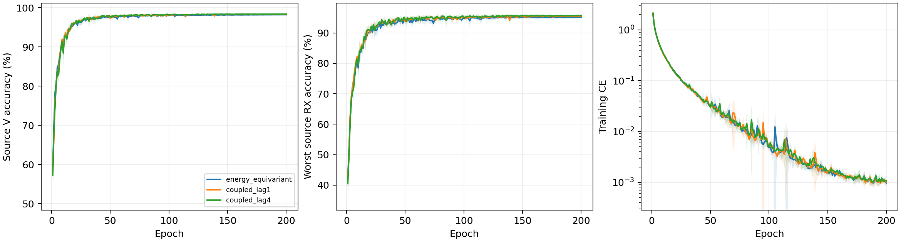

# CVS 因果包络耦合：完整源实验报告

8 个新 scratch 模型完成 E200×50；完整核对 80000 步、1600 轮、详细文本与紧凑 epoch JSONL/CSV。实际为普通 CE、无增强、无域骨干、无权重继承，原 L6300/V27000、U56700 unused；全部新模型采用固定完整 FP32。当前四份能量保留控制完整源曲线与实时核实终值一致。

固定性能优先源规则选择 `coupled_lag4`。新候选胜出，下一步冻结后默认4行clean测试；源成绩还不能证明测试提升。

| 候选 | 四seed源V（%） | 最差源RX（%） | 固定性能分数（%） | 参数 |
|---|---:|---:|---:|---:|
| energy_equivariant | 98.2241 | 95.2315 | 96.7278 | 202553 |
| coupled_lag1 | 98.3278 | 95.4676 | 96.8977 | 202553 |
| coupled_lag4 | 98.3907 | 95.6667 | 97.0287 | 202553 |

四 seed mean(0.5V+0.5最差源RX)最高优先；完全并列后才比较V、最差RX和成本。物理误差不参与选模，最佳轮只作诊断，所有选模使用E200。

| 模型 | seed | E200 V（%） | E200 最差RX（%） | 末轮CE | 最佳V（%） | 最佳轮（未选） |
|---|---:|---:|---:|---:|---:|---:|
| energy_equivariant | 2026092701 | 98.3444 | 95.5556 | 0.000891 | 98.3963 | 171 |
| energy_equivariant | 2026092702 | 98.3185 | 95.5556 | 0.001117 | 98.3481 | 169 |
| energy_equivariant | 2026092703 | 98.2630 | 95.3333 | 0.000857 | 98.2852 | 119 |
| energy_equivariant | 2026092704 | 97.9704 | 94.4815 | 0.001042 | 98.0000 | 120 |
| coupled_lag1 | 2026092701 | 98.4296 | 95.7222 | 0.000872 | 98.4556 | 111 |
| coupled_lag4 | 2026092701 | 98.5630 | 95.9259 | 0.000920 | 98.5778 | 146 |
| coupled_lag1 | 2026092702 | 98.3296 | 95.6481 | 0.001196 | 98.3741 | 162 |
| coupled_lag4 | 2026092702 | 98.4667 | 96.0000 | 0.001384 | 98.5037 | 146 |
| coupled_lag1 | 2026092703 | 98.2852 | 95.2778 | 0.000876 | 98.3556 | 165 |
| coupled_lag4 | 2026092703 | 98.3444 | 95.6296 | 0.000937 | 98.3889 | 145 |
| coupled_lag1 | 2026092704 | 98.2667 | 95.2222 | 0.001101 | 98.2852 | 132 |
| coupled_lag4 | 2026092704 | 98.1889 | 95.1111 | 0.001036 | 98.2185 | 98 |

四seed样本SD阴影覆盖全部200轮。[2400条曲线](evidence/source_curves.csv)、[1600轮同步测量](evidence/source_energy_by_epoch.csv)、[全部720个源单元](evidence/source_all720_cells.csv)、[同seed源差分](evidence/source_paired_control.csv)。源RX是源验证，不称未知RX测试。

## 因果包络输入的实际执行

输入仍12项：z[n-m]((P[n-m]+P[n-m-lag])/8)^q，m0至3/q0至2。lag1或4使用因果补零，三阶项含滞后功率，五阶项含两时刻功率乘积。保留原四段位置功率读出、网络深宽和202553参数，同seed初始state与energy控制一致。新增的是lift线性空间中的交互，不证明旧全网无法近似它们。共同常相位不改变功率，新基函数保持charge1；不宣称任意received CFO或RX不变。

全部1600轮源末batch和8个冻结公共输入均测量实际behavior.0.conv输入，共1600+8条；三阶/五阶相对变化的分母是原aligned项L2范数clamp至1e-12。它是输入变化，不是恢复TX器件参数，也不参与候选排序。

|模型|seed|实际lag|复数项数|公式最大误差|三阶相对变化均值|五阶相对变化均值|
|---|---:|---:|---:|---:|---:|---:|
|coupled_lag1|2026092701|1|12|0|0.320148|0.540386|
|coupled_lag4|2026092701|4|12|0|0.324568|0.537097|
|coupled_lag1|2026092702|1|12|0|0.324349|0.537466|
|coupled_lag4|2026092702|4|12|0|0.325459|0.538952|
|coupled_lag1|2026092703|1|12|0|0.314|0.528709|
|coupled_lag4|2026092703|4|12|0|0.314395|0.532459|
|coupled_lag1|2026092704|1|12|0|0.317269|0.534819|
|coupled_lag4|2026092704|4|12|0|0.323679|0.54595|

[全部1600条源输入测量](evidence/source_coupled_input_all1600.csv) · [8条公共输入测量](evidence/source_public_coupled_input_all8.csv)。40ns/160ns只是25MHz下的设计时间间隔，未测量真实器件记忆；received包络同时包含RX、channel和noise影响，不等于完整GMP、DPD或PA辨识。固定功率平均可能平滑有用瞬态，负结果保留。

## 整体物理性质与边界

六个复数时间/行为block使用跨通道/时间共享的包内RMS分母，归一化本身保留相对通道能量；学习尺度与径向门可以改变比例。两个候选均raw received输入、固定alpha0、不校正CFO。重复相关仅作received相对频率诊断，lag20/window80:160，主值±625kHz、歧义1.25MHz。不宣称整网频偏/RX/LTI不变、唯一TX参数或TX/RX因果分离。

冻结公共链每模型5TX×6RX，检查公共相位及±80kHz仿射相位。全8权重最大公共相位logit误差2.7030706e-05，最大仿射logit误差27.518486；坐标逐点重建最大误差0。常相位容差1e-3只报告，不是选模或停机门槛；附加频偏响应不称不变性误差。

| 模型 | seed | 相位rad | 附加相对CFO Hz | 整网logit响应 | 单位嵌入距离 | 主值跨界数 | 有效相关数 |
|---|---:|---:|---:|---:|---:|---:|---:|
| coupled_lag1 | 2026092701 | 0.37 | 0.0 | 2.4795532e-05 | 2.419619e-06 | 0 | 30 |
| coupled_lag1 | 2026092701 | -1.2 | 80000.0 | 5.3797498 | 0.72632051 | 0 | 30 |
| coupled_lag1 | 2026092701 | 2.9 | -80000.0 | 25.629032 | 1.3942026 | 0 | 30 |
| coupled_lag4 | 2026092701 | 0.37 | 0.0 | 1.4543533e-05 | 1.6859437e-06 | 0 | 30 |
| coupled_lag4 | 2026092701 | -1.2 | 80000.0 | 5.0113163 | 0.66035002 | 0 | 30 |
| coupled_lag4 | 2026092701 | 2.9 | -80000.0 | 27.518486 | 1.5274214 | 0 | 30 |
| coupled_lag1 | 2026092702 | 0.37 | 0.0 | 1.6689301e-05 | 1.3704548e-06 | 0 | 30 |
| coupled_lag1 | 2026092702 | -1.2 | 80000.0 | 8.8956909 | 0.88096678 | 0 | 30 |
| coupled_lag1 | 2026092702 | 2.9 | -80000.0 | 26.227314 | 1.3718368 | 0 | 30 |
| coupled_lag4 | 2026092702 | 0.37 | 0.0 | 1.8119812e-05 | 1.5488258e-06 | 0 | 30 |
| coupled_lag4 | 2026092702 | -1.2 | 80000.0 | 8.6627913 | 0.82192397 | 0 | 30 |
| coupled_lag4 | 2026092702 | 2.9 | -80000.0 | 26.083344 | 1.4531115 | 0 | 30 |
| coupled_lag1 | 2026092703 | 0.37 | 0.0 | 1.5258789e-05 | 1.4464745e-06 | 0 | 30 |
| coupled_lag1 | 2026092703 | -1.2 | 80000.0 | 7.2461824 | 0.76498896 | 0 | 30 |
| coupled_lag1 | 2026092703 | 2.9 | -80000.0 | 25.748436 | 1.5503019 | 0 | 30 |
| coupled_lag4 | 2026092703 | 0.37 | 0.0 | 2.7030706e-05 | 1.7831277e-06 | 0 | 30 |
| coupled_lag4 | 2026092703 | -1.2 | 80000.0 | 7.624258 | 0.78549105 | 0 | 30 |
| coupled_lag4 | 2026092703 | 2.9 | -80000.0 | 25.248041 | 1.5314894 | 0 | 30 |
| coupled_lag1 | 2026092704 | 0.37 | 0.0 | 1.5258789e-05 | 1.3186125e-06 | 0 | 30 |
| coupled_lag1 | 2026092704 | -1.2 | 80000.0 | 4.5544214 | 0.71190494 | 0 | 30 |
| coupled_lag1 | 2026092704 | 2.9 | -80000.0 | 22.416618 | 1.2851332 | 0 | 30 |
| coupled_lag4 | 2026092704 | 0.37 | 0.0 | 1.4305115e-05 | 1.1161404e-06 | 0 | 30 |
| coupled_lag4 | 2026092704 | -1.2 | 80000.0 | 3.1627769 | 0.58575487 | 0 | 30 |
| coupled_lag4 | 2026092704 | 2.9 | -80000.0 | 24.247023 | 1.5079583 | 0 | 30 |

源V同步统计是27000包/90单元全部覆盖，估计均为received相对CFO；没有真频偏标签，不能把偏差称为晶振测量误差。

| 模型 | seed | 相对CFO范围 Hz | 相干度均值 | fallback比例 | TX中心间平方距离 | 同TX跨RX中心偏移 |
|---|---:|---:|---:|---:|---:|---:|
| coupled_lag1 | 2026092701 | -621967.875 至 622686.000 | 0.943506 | 0 | 1.00412 | 0.125819 |
| coupled_lag4 | 2026092701 | -621967.875 至 622686.000 | 0.943506 | 0 | 1.0082 | 0.128537 |
| coupled_lag1 | 2026092702 | -621967.875 至 622686.000 | 0.943506 | 0 | 1.06123 | 0.147391 |
| coupled_lag4 | 2026092702 | -621967.875 至 622686.000 | 0.943506 | 0 | 1.07397 | 0.151669 |
| coupled_lag1 | 2026092703 | -621967.875 至 622686.000 | 0.943506 | 0 | 1.04259 | 0.12871 |
| coupled_lag4 | 2026092703 | -621967.875 至 622686.000 | 0.943506 | 0 | 1.08472 | 0.141367 |
| coupled_lag1 | 2026092704 | -621967.875 至 622686.000 | 0.943506 | 0 | 1.08175 | 0.114607 |
| coupled_lag4 | 2026092704 | -621967.875 至 622686.000 | 0.943506 | 0 | 1.14073 | 0.118297 |

## 实际共享归一化与固定校正

[9600条源末batch测量](evidence/source_energy_normalization_all9600.csv)覆盖1600轮×6block，[48条冻结公共测量](evidence/source_public_normalization_all48.csv)覆盖8模型×6block。测量基于实际conv输出及共享分母，只比较归一化前后的相对通道能量；学习尺度和径向门不在该比值守恒声明内。测量误差仅报告，不参与选模。

[1600轮固定校正执行](evidence/source_alignment_optimization.csv)与完整80000步核对；两版本均无学习校正参数，相关梯度N/A。

| 模型 | seed | 最终alpha | 200轮校正梯度 | 残余频率公式最大误差Hz | 有效公式包数 |
|---|---:|---:|---:|---:|---:|
| coupled_lag1 | 2026092701 | 0 | N/A | 0.0 | 27000 |
| coupled_lag4 | 2026092701 | 0 | N/A | 0.0 | 27000 |
| coupled_lag1 | 2026092702 | 0 | N/A | 0.0 | 27000 |
| coupled_lag4 | 2026092702 | 0 | N/A | 0.0 | 27000 |
| coupled_lag1 | 2026092703 | 0 | N/A | 0.0 | 27000 |
| coupled_lag4 | 2026092703 | 0 | N/A | 0.0 | 27000 |
| coupled_lag1 | 2026092704 | 0 | N/A | 0.0 | 27000 |
| coupled_lag4 | 2026092704 | 0 | N/A | 0.0 | 27000 |

[部分波形协变与整网响应](evidence/source_affine_phase_audit.csv)逐行列出有效包数、主值跨界、波形误差与logit响应，两种误差含义不同。物理干预采用冻结公共合成波形，不是训练增强，也不涉及真实query。

TX/RX 镜像及三阶相同波形反例保留。LTI/RX影响不承诺消除，公共合成链不是精确WiSig均衡器、真实硬件采集或完整瞬态/噪声仿真。源嵌入几何只说明关联，不证明TX/RX因果分离。[全部240个公共组合](evidence/source_physics_cascade.csv)、[32个孤立TX变化](evidence/source_isolated_TX.csv)。

## 实测成本

| 模型 | 参数 | 常驻模型bytes | Conv/Linear MAC/包 | batch1推理ms均值 | batch128训练ms均值 | 源训练峰值bytes最大 |
|---|---:|---:|---:|---:|---:|---:|
| energy_equivariant | 202553 | 810844 | 7199008 | 6.5708 | 41.0323 | 163822080 |
| coupled_lag1 | 202553 | 810844 | 7199008 | 6.9651 | 41.7906 | 163559936 |
| coupled_lag4 | 202553 | 810844 | 7199008 | 7.0622 | 41.0888 | 163559936 |

RTX3090/Torch2.1/FP32；两个新候选和四份energy控制均采用显式完整FP32。三候选具有相同核心、深宽、原读出和202553参数。新候选只在行为输入引入固定滞后包络平均，两个候选均raw/alpha0；与energy控制差异是输入lift。MAC相同不表示总运算量相同。不增加学习参数；相对原residual_fusion164225参数的比较不是等参数单因子对照。MAC仅计Conv/Linear/矩阵乘，FFT/归一化/包络逐元素乘积/相关/atan2等不计入MAC，实测延时与显存包括全部执行。副本profile不更新正式模型。并发条件可能影响小幅计时差；星载/额外传输/SFT成本N/A。[逐seed完整资源](evidence/source_resources.csv)。

新候选选中，默认 clean 收尾待完成，不能宣称实验已全部完成。不宣称识别优势或总体目标完成。历史clean代理口径、无LEO/SFT/新增类；D92三阶段N/A。目标成绩不反馈结构、超参数、重排或选择性重跑，负结果保留。

[前瞻设计](../../../docs/CVS_COUPLED_ENVELOPE_HYPOTHESIS_20261002.md) · [全量日志审计](evidence/source_completion_validation.json) · [源选择](evidence/source_selection.json) · [独立分析](evidence/source_analysis_validation.json)。

实际终态独立读回：dispatcher 及全部8个源 worker 已自然退出，8行各200轮/10000步。源执行commit `2ca8a8dc4ef21ca063bdf6499da0e638d517685d`。[终态证据](evidence/final_source_readback.json)。本轮实际选中候选clean配置和预登记已生成，4份新预测＋24份冻结控制；只读元数据与资源preflight通过，尚未发布或读取本轮新query。

## 默认clean测试收尾已完成

实际冻结候选 `coupled_lag4` 的四份新预测与24份原控制统一28行，每行168000物理query；224份混淆矩阵与配对差分独立复算，原192份控制逐字段保持一致。未选 `coupled_lag1` 的测试为N/A，未追加query访问。全部源/预测/scorer进程自然退出，完整产物保留。[独立clean报告](../20261002-phase1-cvs-coupled-clean-manysig-m28-r01/report.md)。该候选未证明进一步识别性能提升，整体目标保持未完成；测试结果仅用于报告，不回流结构、延迟、系数、预算、候选重排或重跑。
