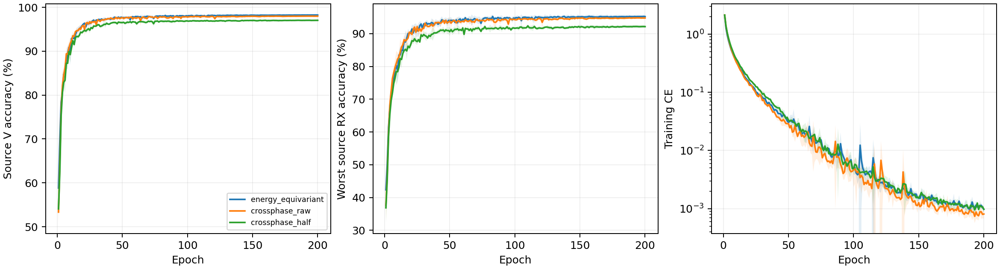

# CVS 跨复数通道相干读出：完整源实验报告

8 个新 scratch 模型完成 E200×50；完整核对 80000 步、1600 轮、详细文本与紧凑 epoch JSONL/CSV。实际为普通 CE、无增强、无域骨干、无权重继承，原 L6300/V27000、U56700 unused；全部新模型采用固定完整 FP32。当前四份能量保留控制完整源曲线与实时核实终值一致。

固定性能优先源规则选择 `energy_equivariant`。当前源赢家保留，未选相干读出候选不读query；默认保留已核实历史clean，不重跑历史。

| 候选 | 四seed源V（%） | 最差源RX（%） | 固定性能分数（%） | 参数 |
|---|---:|---:|---:|---:|
| energy_equivariant | 98.2241 | 95.2315 | 96.7278 | 202553 |
| crossphase_raw | 97.9722 | 94.7917 | 96.3819 | 202553 |
| crossphase_half | 97.0231 | 92.1620 | 94.5926 | 202553 |

四 seed mean(0.5V+0.5最差源RX)最高优先；完全并列后才比较V、最差RX和成本。物理误差不参与选模，最佳轮只作诊断，所有选模使用E200。

| 模型 | seed | E200 V（%） | E200 最差RX（%） | 末轮CE | 最佳V（%） | 最佳轮（未选） |
|---|---:|---:|---:|---:|---:|---:|
| energy_equivariant | 2026092701 | 98.3444 | 95.5556 | 0.000891 | 98.3963 | 171 |
| energy_equivariant | 2026092702 | 98.3185 | 95.5556 | 0.001117 | 98.3481 | 169 |
| energy_equivariant | 2026092703 | 98.2630 | 95.3333 | 0.000857 | 98.2852 | 119 |
| energy_equivariant | 2026092704 | 97.9704 | 94.4815 | 0.001042 | 98.0000 | 120 |
| crossphase_raw | 2026092701 | 97.8889 | 94.5556 | 0.000780 | 97.9370 | 159 |
| crossphase_half | 2026092701 | 96.9519 | 92.0556 | 0.001003 | 97.0148 | 144 |
| crossphase_raw | 2026092702 | 97.9667 | 95.1852 | 0.000762 | 98.0000 | 112 |
| crossphase_half | 2026092702 | 97.0630 | 92.2222 | 0.001130 | 97.1593 | 94 |
| crossphase_raw | 2026092703 | 97.8889 | 94.4630 | 0.000689 | 98.0000 | 71 |
| crossphase_half | 2026092703 | 96.8370 | 91.7037 | 0.000916 | 96.8519 | 146 |
| crossphase_raw | 2026092704 | 98.1444 | 94.9630 | 0.001003 | 98.1815 | 162 |
| crossphase_half | 2026092704 | 97.2407 | 92.6667 | 0.000859 | 97.2926 | 115 |

四seed样本SD阴影覆盖全部200轮。[2400条曲线](evidence/source_curves.csv)、[1600轮同步测量](evidence/source_energy_by_epoch.csv)、[全部720个源单元](evidence/source_all720_cells.csv)、[同seed源差分](evidence/source_paired_control.csv)。源RX是源验证，不称未知RX测试。

## 跨通道相干的实际执行

每个复通道相对固定anchor的统计为 `rho(c,a)=mean(z_c*conj(z_a))/sqrt(mean|z_c|²*mean|z_a|²+1e-6)`。全部通道乘同一个常相位时分子相位抵消；不同通道分别旋转时相干相位变化。每通道读出维度仍为10，两个anchor的实部/虚部替代四段位置功率。这个读出性质明确保留跨通道关系，但不证明旧整网没有通过前层把相位信息编码到功率，也不证明学得的通道等于可辨识的硬件参数。

逐轮实际记录6400个anchor测量，来自时间和行为两条路径，各使用channel0与channel floor(C/2)。anchor功率小于1e-6时会被epsilon压低，舍弃位置功率也可能损失非平稳信息；以下是E200源末batch的实际测量，不是全部源V的统计，也没有真TX/RX参数标签。

|模型|seed|路径|anchor|通道数|读出维度|anchor平均功率|低功率包比例|相干幅值均值|相干幅值最大|
|---|---:|---|---:|---:|---:|---:|---:|---:|---:|
|crossphase_raw|2026092701|time|0|32|320|1.30995|0|0.274997|1|
|crossphase_raw|2026092701|time|16|32|320|0.909038|0|0.272232|1|
|crossphase_raw|2026092701|behavior|0|32|320|0.71733|0|0.214554|1|
|crossphase_raw|2026092701|behavior|16|32|320|0.636268|0|0.221311|0.999999|
|crossphase_half|2026092701|time|0|32|320|1.30878|0|0.278681|1|
|crossphase_half|2026092701|time|16|32|320|0.885597|0|0.297702|1|
|crossphase_half|2026092701|behavior|0|32|320|0.935223|0|0.219307|1|
|crossphase_half|2026092701|behavior|16|32|320|0.753896|0|0.219163|1|
|crossphase_raw|2026092702|time|0|32|320|0.815182|0|0.23695|1|
|crossphase_raw|2026092702|time|16|32|320|0.767465|0|0.265893|1|
|crossphase_raw|2026092702|behavior|0|32|320|1.01074|0|0.218453|1|
|crossphase_raw|2026092702|behavior|16|32|320|0.804284|0|0.245973|1|
|crossphase_half|2026092702|time|0|32|320|0.905166|0|0.254643|1|
|crossphase_half|2026092702|time|16|32|320|0.539624|0|0.273355|0.999999|
|crossphase_half|2026092702|behavior|0|32|320|1.19057|0|0.221889|1|
|crossphase_half|2026092702|behavior|16|32|320|1.0056|0|0.241535|1|
|crossphase_raw|2026092703|time|0|32|320|0.780871|0|0.215833|1|
|crossphase_raw|2026092703|time|16|32|320|1.00081|0|0.204659|1|
|crossphase_raw|2026092703|behavior|0|32|320|0.652758|0|0.234923|1|
|crossphase_raw|2026092703|behavior|16|32|320|0.970846|0|0.20468|1|
|crossphase_half|2026092703|time|0|32|320|0.621199|0|0.198792|0.999999|
|crossphase_half|2026092703|time|16|32|320|0.780364|0|0.215994|1|
|crossphase_half|2026092703|behavior|0|32|320|0.703259|0|0.231773|1|
|crossphase_half|2026092703|behavior|16|32|320|1.01461|0|0.220279|1|
|crossphase_raw|2026092704|time|0|32|320|0.679841|0|0.226052|0.999999|
|crossphase_raw|2026092704|time|16|32|320|0.964153|0|0.257274|1|
|crossphase_raw|2026092704|behavior|0|32|320|0.853682|0|0.234825|1|
|crossphase_raw|2026092704|behavior|16|32|320|0.824837|0|0.222519|1|
|crossphase_half|2026092704|time|0|32|320|0.746214|0|0.213939|1|
|crossphase_half|2026092704|time|16|32|320|1.0528|0|0.26242|1|
|crossphase_half|2026092704|behavior|0|32|320|0.855347|0|0.231635|1|
|crossphase_half|2026092704|behavior|16|32|320|0.990151|0|0.227586|1|

[全部逐轮读出测量](evidence/source_crosschannel_readout_by_epoch.csv)。测量只解释执行与可能的信息瓶颈，不参与候选排序。

## 整体物理性质与边界

全部六个复数时间/行为block采用一个跨通道/时间共享的包内RMS分母，归一化本身保留相对通道能量。原学习尺度与径向门可能改变比例，不承诺门后比例固定。两版本核心、深宽及202553参数相同：raw版本直接使用原received输入，half版本在所有身份波形路径前执行固定alpha0.5频偏校正。lag20/window80:160相对CFO主值±625kHz、歧义1.25MHz，无效相关安全回退零。保留整体常相位性质，部分波形频率协变仅在相关有效且不跨分支时成立，不声明整网仿射/RX/LTI不变、唯一TX参数或TX/RX因果分离。alpha不是晶振贡献比例。

冻结公共链每模型5TX×6RX，检查公共相位及±80kHz仿射相位。全8权重最大公共相位logit误差2.592802e-05，最大仿射logit误差29.956356；坐标逐点重建最大误差2.3841858e-07。常相位容差1e-3只报告，不是选模或停机门槛；附加频偏响应不称不变性误差。

| 模型 | seed | 相位rad | 附加相对CFO Hz | 整网logit响应 | 单位嵌入距离 | 主值跨界数 | 有效相关数 |
|---|---:|---:|---:|---:|---:|---:|---:|
| crossphase_raw | 2026092701 | 0.37 | 0.0 | 1.4305115e-05 | 1.0768591e-06 | 0 | 30 |
| crossphase_raw | 2026092701 | -1.2 | 80000.0 | 14.282028 | 1.0872831 | 0 | 30 |
| crossphase_raw | 2026092701 | 2.9 | -80000.0 | 25.178741 | 1.2862692 | 0 | 30 |
| crossphase_half | 2026092701 | 0.37 | 0.0 | 2.1934509e-05 | 1.7493021e-06 | 0 | 30 |
| crossphase_half | 2026092701 | -1.2 | 80000.0 | 11.833206 | 0.65747201 | 0 | 30 |
| crossphase_half | 2026092701 | 2.9 | -80000.0 | 12.600241 | 0.75684553 | 0 | 30 |
| crossphase_raw | 2026092702 | 0.37 | 0.0 | 1.6689301e-05 | 1.5816335e-06 | 0 | 30 |
| crossphase_raw | 2026092702 | -1.2 | 80000.0 | 10.91363 | 1.0064609 | 0 | 30 |
| crossphase_raw | 2026092702 | 2.9 | -80000.0 | 28.806709 | 1.4752473 | 0 | 30 |
| crossphase_half | 2026092702 | 0.37 | 0.0 | 2.0027161e-05 | 1.7913205e-06 | 0 | 30 |
| crossphase_half | 2026092702 | -1.2 | 80000.0 | 7.5557714 | 0.55621725 | 0 | 30 |
| crossphase_half | 2026092702 | 2.9 | -80000.0 | 11.239169 | 0.67392254 | 0 | 30 |
| crossphase_raw | 2026092703 | 0.37 | 0.0 | 1.1444092e-05 | 1.2496256e-06 | 0 | 30 |
| crossphase_raw | 2026092703 | -1.2 | 80000.0 | 10.401281 | 0.88004428 | 0 | 30 |
| crossphase_raw | 2026092703 | 2.9 | -80000.0 | 27.15773 | 1.5304474 | 0 | 30 |
| crossphase_half | 2026092703 | 0.37 | 0.0 | 9.059906e-06 | 1.2376125e-06 | 0 | 30 |
| crossphase_half | 2026092703 | -1.2 | 80000.0 | 6.3199058 | 0.47359037 | 0 | 30 |
| crossphase_half | 2026092703 | 2.9 | -80000.0 | 13.626964 | 0.88449085 | 0 | 30 |
| crossphase_raw | 2026092704 | 0.37 | 0.0 | 2.0503998e-05 | 1.9629606e-06 | 0 | 30 |
| crossphase_raw | 2026092704 | -1.2 | 80000.0 | 8.8269949 | 0.88020056 | 0 | 30 |
| crossphase_raw | 2026092704 | 2.9 | -80000.0 | 29.956356 | 1.571183 | 0 | 30 |
| crossphase_half | 2026092704 | 0.37 | 0.0 | 2.592802e-05 | 1.8886517e-06 | 0 | 30 |
| crossphase_half | 2026092704 | -1.2 | 80000.0 | 9.702261 | 0.62879109 | 0 | 30 |
| crossphase_half | 2026092704 | 2.9 | -80000.0 | 12.064552 | 0.78659016 | 0 | 30 |

源V同步统计是27000包/90单元全部覆盖，估计均为received相对CFO；没有真频偏标签，不能把偏差称为晶振测量误差。

| 模型 | seed | 相对CFO范围 Hz | 相干度均值 | fallback比例 | TX中心间平方距离 | 同TX跨RX中心偏移 |
|---|---:|---:|---:|---:|---:|---:|
| crossphase_raw | 2026092701 | -621967.875 至 622686.000 | 0.943506 | 0 | 0.980179 | 0.107896 |
| crossphase_half | 2026092701 | -621967.875 至 622686.000 | 0.943506 | 0 | 0.885719 | 0.130686 |
| crossphase_raw | 2026092702 | -621967.875 至 622686.000 | 0.943506 | 0 | 0.978795 | 0.122806 |
| crossphase_half | 2026092702 | -621967.875 至 622686.000 | 0.943506 | 0 | 0.888196 | 0.140088 |
| crossphase_raw | 2026092703 | -621967.875 至 622686.000 | 0.943506 | 0 | 0.987515 | 0.127342 |
| crossphase_half | 2026092703 | -621967.875 至 622686.000 | 0.943506 | 0 | 0.905291 | 0.149763 |
| crossphase_raw | 2026092704 | -621967.875 至 622686.000 | 0.943506 | 0 | 1.11047 | 0.137249 |
| crossphase_half | 2026092704 | -621967.875 至 622686.000 | 0.943506 | 0 | 0.963466 | 0.157765 |

## 实际共享归一化与固定校正

[9600条源末batch测量](evidence/source_energy_normalization_all9600.csv)覆盖1600轮×6block，[48条冻结公共测量](evidence/source_public_normalization_all48.csv)覆盖8模型×6block。测量基于实际conv输出及共享分母，只比较归一化前后的相对通道能量；学习尺度和径向门不在该比值守恒声明内。测量误差仅报告，不参与选模。

[1600轮固定校正执行](evidence/source_alignment_optimization.csv)与完整80000步核对；两版本均无学习校正参数，相关梯度N/A。

| 模型 | seed | 最终alpha | 200轮校正梯度 | 残余频率公式最大误差Hz | 有效公式包数 |
|---|---:|---:|---:|---:|---:|
| crossphase_raw | 2026092701 | 0 | N/A | 0.0 | 27000 |
| crossphase_half | 2026092701 | 0.5 | N/A | 0.296875 | 27000 |
| crossphase_raw | 2026092702 | 0 | N/A | 0.0 | 27000 |
| crossphase_half | 2026092702 | 0.5 | N/A | 0.296875 | 27000 |
| crossphase_raw | 2026092703 | 0 | N/A | 0.0 | 27000 |
| crossphase_half | 2026092703 | 0.5 | N/A | 0.296875 | 27000 |
| crossphase_raw | 2026092704 | 0 | N/A | 0.0 | 27000 |
| crossphase_half | 2026092704 | 0.5 | N/A | 0.296875 | 27000 |

[部分波形协变与整网响应](evidence/source_affine_phase_audit.csv)逐行列出有效包数、主值跨界、波形误差与logit响应，两种误差含义不同。物理干预采用冻结公共合成波形，不是训练增强，也不涉及真实query。

TX/RX 镜像及三阶相同波形反例保留。LTI/RX影响不承诺消除，公共合成链不是精确WiSig均衡器、真实硬件采集或完整瞬态/噪声仿真。源嵌入几何只说明关联，不证明TX/RX因果分离。[全部240个公共组合](evidence/source_physics_cascade.csv)、[32个孤立TX变化](evidence/source_isolated_TX.csv)。

## 实测成本

| 模型 | 参数 | 常驻模型bytes | Conv/Linear MAC/包 | batch1推理ms均值 | batch128训练ms均值 | 源训练峰值bytes最大 |
|---|---:|---:|---:|---:|---:|---:|
| energy_equivariant | 202553 | 810844 | 7199008 | 6.5708 | 41.0323 | 163822080 |
| crossphase_raw | 202553 | 810844 | 7199008 | 7.7926 | 44.5831 | 172605952 |
| crossphase_half | 202553 | 810844 | 7199008 | 8.5574 | 42.2068 | 172868096 |

RTX3090/Torch2.1/FP32；两个新候选和四份energy控制均采用显式完整FP32。三候选具有相同核心、深宽、同维度读出和202553参数。新候选以两个固定anchor的复相干替换四段位置功率；raw与energy控制只差读出运算，half另有预登记固定alpha0.5。不增加学习参数；相对原residual_fusion164225参数的比较不是等参数单因子对照。MAC仅计Conv/Linear/矩阵乘，FFT/归一化/相关/atan2/复旋转等不计入MAC，实测延时与显存包括全部执行。副本profile不更新正式模型。并发条件可能影响小幅计时差；星载/额外传输/SFT成本N/A。[逐seed完整资源](evidence/source_resources.csv)。

当前源赢家选中，按预登记规则保留其已核实历史 clean；本轮两个未选新候选的测试记 N/A，没有新增 query。不宣称识别优势或总体目标完成。历史clean代理口径、无LEO/SFT/新增类；D92三阶段N/A。目标成绩不反馈结构、超参数、重排或选择性重跑，负结果保留。

[前瞻设计](../../../docs/CVS_CROSSPHASE_IDENTITY_HYPOTHESIS_20261002.md) · [全量日志审计](evidence/source_completion_validation.json) · [源选择](evidence/source_selection.json) · [独立分析](evidence/source_analysis_validation.json)。

## 收尾状态

本轮源候选实验ANALYZED／VERIFIED，独立核对全部80000步、1600轮与源选择。8个worker及dispatcher均自然退出；旧energy源控制保留，新候选clean测试按预登记为N/A，新增query为0。仅核对旧energy clean评分完成metadata：原24行、6模型、4种子、每seed168000包完整；没有为本轮研发读取旧目标分数。原目标“进一步提高纯CE clean性能”尚未完成。

[最终进程证据](evidence/final_source_readback.json) · [保留clean完成metadata](evidence/retained_clean_metadata.json)。
