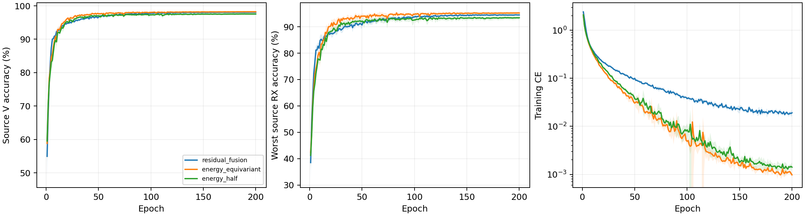

# CVS 相对滤波能量保留身份网络：完整源实验报告

8 个新 scratch 模型完成 E200×50；完整核对 80000 步、1600 轮、详细文本与紧凑 epoch JSONL/CSV。实际为普通 CE、无增强、无域骨干、无权重继承，原 L6300/V27000、U56700 unused；全部新模型采用固定完整 FP32。原四份残差控制完整源曲线与实时核实终值一致。

固定性能优先源规则选择 `energy_equivariant`。新候选胜出，下一步冻结后默认4行clean测试；源成绩还不能证明测试提升。

| 候选 | 四seed源V（%） | 最差源RX（%） | 固定性能分数（%） | 参数 |
|---|---:|---:|---:|---:|
| residual_fusion | 98.0694 | 94.4954 | 96.2824 | 164225 |
| energy_equivariant | 98.2241 | 95.2315 | 96.7278 | 202553 |
| energy_half | 97.5509 | 93.4306 | 95.4907 | 202553 |

四 seed mean(0.5V+0.5最差源RX)最高优先；完全并列后才比较V、最差RX和成本。物理误差不参与选模，最佳轮只作诊断，所有选模使用E200。

| 模型 | seed | E200 V（%） | E200 最差RX（%） | 末轮CE | 最佳V（%） | 最佳轮（未选） |
|---|---:|---:|---:|---:|---:|---:|
| residual_fusion | 2026092701 | 98.0926 | 94.6481 | 0.018705 | 98.1111 | 156 |
| residual_fusion | 2026092702 | 98.1963 | 94.5741 | 0.018651 | 98.2222 | 159 |
| residual_fusion | 2026092703 | 97.9852 | 94.4630 | 0.016202 | 98.0185 | 177 |
| residual_fusion | 2026092704 | 98.0037 | 94.2963 | 0.022983 | 98.0556 | 169 |
| energy_equivariant | 2026092701 | 98.3444 | 95.5556 | 0.000891 | 98.3963 | 171 |
| energy_half | 2026092701 | 97.7333 | 93.7407 | 0.001122 | 97.8222 | 142 |
| energy_equivariant | 2026092702 | 98.3185 | 95.5556 | 0.001117 | 98.3481 | 169 |
| energy_half | 2026092702 | 97.8481 | 94.3704 | 0.001797 | 97.8593 | 173 |
| energy_equivariant | 2026092703 | 98.2630 | 95.3333 | 0.000857 | 98.2852 | 119 |
| energy_half | 2026092703 | 97.3630 | 93.0185 | 0.001129 | 97.4185 | 110 |
| energy_equivariant | 2026092704 | 97.9704 | 94.4815 | 0.001042 | 98.0000 | 120 |
| energy_half | 2026092704 | 97.2593 | 92.5926 | 0.001606 | 97.3444 | 118 |

四seed样本SD阴影覆盖全部200轮。[2400条曲线](evidence/source_curves.csv)、[1600轮同步测量](evidence/source_energy_by_epoch.csv)、[全部720个源单元](evidence/source_all720_cells.csv)、[同seed源差分](evidence/source_paired_control.csv)。源RX是源验证，不称未知RX测试。

## 整体物理性质与边界

全部六个复数时间/行为block采用一个跨通道/时间共享的包内RMS分母，归一化本身保留相对通道能量。原学习尺度与径向门可能改变比例，不承诺门后比例固定。两版本核心、深宽及202553参数相同：raw版本直接使用原received输入，half版本在所有身份波形路径前执行固定alpha0.5频偏校正。lag20/window80:160相对CFO主值±625kHz、歧义1.25MHz，无效相关安全回退零。保留整体常相位性质，部分波形频率协变仅在相关有效且不跨分支时成立，不声明整网仿射/RX/LTI不变、唯一TX参数或TX/RX因果分离。alpha不是晶振贡献比例。

冻结公共链每模型5TX×6RX，检查公共相位及±80kHz仿射相位。全8权重最大公共相位logit误差2.9087067e-05，最大仿射logit误差27.028837；坐标逐点重建最大误差2.3841858e-07。常相位容差1e-3只报告，不是选模或停机门槛；附加频偏响应不称不变性误差。

| 模型 | seed | 相位rad | 附加相对CFO Hz | 整网logit响应 | 单位嵌入距离 | 主值跨界数 | 有效相关数 |
|---|---:|---:|---:|---:|---:|---:|---:|
| energy_equivariant | 2026092701 | 0.37 | 0.0 | 1.4781952e-05 | 1.9529216e-06 | 0 | 30 |
| energy_equivariant | 2026092701 | -1.2 | 80000.0 | 5.8973765 | 0.78341514 | 0 | 30 |
| energy_equivariant | 2026092701 | 2.9 | -80000.0 | 27.028837 | 1.5305309 | 0 | 30 |
| energy_half | 2026092701 | 0.37 | 0.0 | 2.0980835e-05 | 2.0099724e-06 | 0 | 30 |
| energy_half | 2026092701 | -1.2 | 80000.0 | 12.823858 | 0.76051998 | 0 | 30 |
| energy_half | 2026092701 | 2.9 | -80000.0 | 13.117777 | 0.78312635 | 0 | 30 |
| energy_equivariant | 2026092702 | 0.37 | 0.0 | 1.3589859e-05 | 1.3085171e-06 | 0 | 30 |
| energy_equivariant | 2026092702 | -1.2 | 80000.0 | 7.5144844 | 0.77108926 | 0 | 30 |
| energy_equivariant | 2026092702 | 2.9 | -80000.0 | 26.062174 | 1.4577233 | 0 | 30 |
| energy_half | 2026092702 | 0.37 | 0.0 | 2.9087067e-05 | 2.3306309e-06 | 0 | 30 |
| energy_half | 2026092702 | -1.2 | 80000.0 | 10.706948 | 0.78242517 | 0 | 30 |
| energy_half | 2026092702 | 2.9 | -80000.0 | 10.641063 | 0.74687779 | 0 | 30 |
| energy_equivariant | 2026092703 | 0.37 | 0.0 | 1.8119812e-05 | 1.3483004e-06 | 0 | 30 |
| energy_equivariant | 2026092703 | -1.2 | 80000.0 | 7.134407 | 0.74899048 | 0 | 30 |
| energy_equivariant | 2026092703 | 2.9 | -80000.0 | 23.907156 | 1.5255266 | 0 | 30 |
| energy_half | 2026092703 | 0.37 | 0.0 | 2.1576881e-05 | 1.9218387e-06 | 0 | 30 |
| energy_half | 2026092703 | -1.2 | 80000.0 | 11.285612 | 0.72755653 | 0 | 30 |
| energy_half | 2026092703 | 2.9 | -80000.0 | 10.644728 | 0.73357266 | 0 | 30 |
| energy_equivariant | 2026092704 | 0.37 | 0.0 | 2.4676323e-05 | 1.6254636e-06 | 0 | 30 |
| energy_equivariant | 2026092704 | -1.2 | 80000.0 | 4.0100541 | 0.70693332 | 0 | 30 |
| energy_equivariant | 2026092704 | 2.9 | -80000.0 | 25.309181 | 1.4339234 | 0 | 30 |
| energy_half | 2026092704 | 0.37 | 0.0 | 2.5510788e-05 | 1.8790159e-06 | 0 | 30 |
| energy_half | 2026092704 | -1.2 | 80000.0 | 9.8188 | 0.50434214 | 0 | 30 |
| energy_half | 2026092704 | 2.9 | -80000.0 | 13.11532 | 0.68249923 | 0 | 30 |

源V同步统计是27000包/90单元全部覆盖，估计均为received相对CFO；没有真频偏标签，不能把偏差称为晶振测量误差。

| 模型 | seed | 相对CFO范围 Hz | 相干度均值 | fallback比例 | TX中心间平方距离 | 同TX跨RX中心偏移 |
|---|---:|---:|---:|---:|---:|---:|
| energy_equivariant | 2026092701 | -621967.875 至 622686.000 | 0.943506 | 0 | 1.01062 | 0.130927 |
| energy_half | 2026092701 | -621967.875 至 622686.000 | 0.943506 | 0 | 0.971157 | 0.144696 |
| energy_equivariant | 2026092702 | -621967.875 至 622686.000 | 0.943506 | 0 | 1.06892 | 0.161675 |
| energy_half | 2026092702 | -621967.875 至 622686.000 | 0.943506 | 0 | 0.980042 | 0.179752 |
| energy_equivariant | 2026092703 | -621967.875 至 622686.000 | 0.943506 | 0 | 1.03764 | 0.132199 |
| energy_half | 2026092703 | -621967.875 至 622686.000 | 0.943506 | 0 | 0.896135 | 0.139126 |
| energy_equivariant | 2026092704 | -621967.875 至 622686.000 | 0.943506 | 0 | 1.07274 | 0.114581 |
| energy_half | 2026092704 | -621967.875 至 622686.000 | 0.943506 | 0 | 0.972921 | 0.137561 |

## 实际共享归一化与固定校正

[9600条源末batch测量](evidence/source_energy_normalization_all9600.csv)覆盖1600轮×6block，[48条冻结公共测量](evidence/source_public_normalization_all48.csv)覆盖8模型×6block。测量基于实际conv输出及共享分母，只比较归一化前后的相对通道能量；学习尺度和径向门不在该比值守恒声明内。测量误差仅报告，不参与选模。

[1600轮固定校正执行](evidence/source_alignment_optimization.csv)与完整80000步核对；两版本均无学习校正参数，相关梯度N/A。

| 模型 | seed | 最终alpha | 200轮校正梯度 | 残余频率公式最大误差Hz | 有效公式包数 |
|---|---:|---:|---:|---:|---:|
| energy_equivariant | 2026092701 | 0 | N/A | 0.0 | 27000 |
| energy_half | 2026092701 | 0.5 | N/A | 0.296875 | 27000 |
| energy_equivariant | 2026092702 | 0 | N/A | 0.0 | 27000 |
| energy_half | 2026092702 | 0.5 | N/A | 0.296875 | 27000 |
| energy_equivariant | 2026092703 | 0 | N/A | 0.0 | 27000 |
| energy_half | 2026092703 | 0.5 | N/A | 0.296875 | 27000 |
| energy_equivariant | 2026092704 | 0 | N/A | 0.0 | 27000 |
| energy_half | 2026092704 | 0.5 | N/A | 0.296875 | 27000 |

[部分波形协变与整网响应](evidence/source_affine_phase_audit.csv)逐行列出有效包数、主值跨界、波形误差与logit响应，两种误差含义不同。物理干预采用冻结公共合成波形，不是训练增强，也不涉及真实query。

TX/RX 镜像及三阶相同波形反例保留。LTI/RX影响不承诺消除，公共合成链不是精确WiSig均衡器、真实硬件采集或完整瞬态/噪声仿真。源嵌入几何只说明关联，不证明TX/RX因果分离。[全部240个公共组合](evidence/source_physics_cascade.csv)、[32个孤立TX变化](evidence/source_isolated_TX.csv)。

## 实测成本

| 模型 | 参数 | 常驻模型bytes | Conv/Linear MAC/包 | batch1推理ms均值 | batch128训练ms均值 | 源训练峰值bytes最大 |
|---|---:|---:|---:|---:|---:|---:|
| residual_fusion | 164225 | 657552 | 9708836 | 4.7265 | 29.1454 | 248282624 |
| energy_equivariant | 202553 | 810844 | 7199008 | 6.5708 | 41.0323 | 163822080 |
| energy_half | 202553 | 810844 | 7199008 | 7.8910 | 42.8324 | 164084224 |

RTX3090/Torch2.1/FP32；新模型全部cuDNN TF32=False，旧残差控制保留历史精度，非单因子因果对照。两个版本具有相同核心，两版本均202553参数；只改变归一化轴和固定received频率保留，不增加学习参数；MAC仅计Conv/Linear/矩阵乘，FFT/归一化/相关/atan2/复旋转等不计入MAC，实测延时与显存包括全部执行。副本profile不更新正式模型。并发条件可能影响小幅计时差；星载/额外传输/SFT成本N/A。[逐seed完整资源](evidence/source_resources.csv)。

新候选选中，默认 clean 收尾待完成，不能宣称实验已全部完成。不宣称识别优势或总体目标完成。历史clean代理口径、无LEO/SFT/新增类；D92三阶段N/A。目标成绩不反馈结构、超参数、重排或选择性重跑，负结果保留。

[前瞻设计](../../../docs/CVS_ENERGY_IDENTITY_HYPOTHESIS_20261002.md) · [全量日志审计](evidence/source_completion_validation.json) · [源选择](evidence/source_selection.json) · [独立分析](evidence/source_analysis_validation.json)。

## 同核心半校正的归一化源域配对

实际重读此前4份fractional_half源E200记录，完整物理角色、预算、scratch、model/loader seed、完整FP32和半校正前端匹配。同一equivariant_memory核心比较；两者固定alpha0.5、202553参数；结构差异仅归一化轴，历史独立训练/不同GPU/非确定核仍可能有数值差异。raw候选的历史核心未登记同一完整FP32，因此不声明raw的单因素配对。独立历史训练，不加载旧权重，不改变本轮冻结12记录候选排序。

| 候选 | 最终alpha均值 | Δ源V均值±seedSD（百分点） | Δ最差源RX均值±seedSD（百分点） |
|---|---:|---:|---:|
| energy_half | 0.5 | +0.0972±0.1430 | +0.2222±0.5031 |

差分为共享分母减逐通道分母（两者alpha=0.5），只说明源域关联，不是独有TX频偏或硬件因果分离证明。[4行配对](evidence/paired_normalization_source.csv) · [实际源来源](evidence/paired_normalization_source.json)。

|seed|源TX/RX几何比：逐通道→共享|公共孤立TX距离：逐通道→共享|公共同TX跨RX距离：逐通道→共享|
|---|---:|---:|---:|
|2026092701|8.86097→6.71172|0.105743→0.0742854|0.269499→0.269258|
|2026092702|8.64048→5.45218|0.0749439→0.0731543|0.244323→0.232487|
|2026092703|8.72442→6.44116|0.0516301→0.0656431|0.186352→0.242637|
|2026092704|9.8328→7.07266|0.0576773→0.0733436|0.191266→0.19302|

源几何比为真实TX类中心间平方距离/同TX跨RX中心偏移。公共TX距离使用四个孤立硬件设置变化，RX距离使用25个同TX/非identityRX组合；公共设置不是实际TX标签。距离只描述敏感性和源关联，不进入源选择，也不证明真实硬件因果分离。
