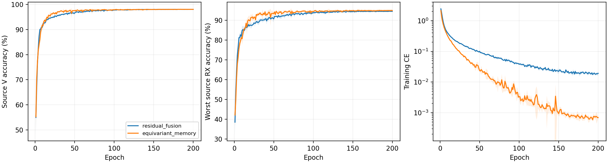

# CVS 全路径复相位等变记忆网络：完整源实验报告

四个新scratch模型完成E200×50。完整核对800轮、40000步、详细文本、epoch JSONL/CSV，实际为普通CE权重1、无增强、无域骨干、无继承。原物理L6300/V27000、U56700unused，每轮50步覆盖6300样本。原残差四份完整源曲线与实时核实的终值一致。

固定源规则选择 `equivariant_memory`。新候选胜出，下一步默认执行冻结后4seed clean测试；源成绩不能证明测试提升。

|候选|四seed源V均值|最差源RX均值|固定性能分数|参数|
|---|---:|---:|---:|---:|
|residual_fusion|98.0694%|94.4954%|96.2824%|164225|
|equivariant_memory|98.0722%|94.8657%|96.4690%|202553|

分数为四seed的0.5V＋0.5最差源RX均值，最高优先，完全并列后才比V、最差RX、MAC、参数及固定顺序。公共相位数值误差与合成机制不参与排名或停止。

|模型|seed|E200源V|E200最差源RX|末轮CE|最佳源V（仅诊断）|最佳轮（未选）|
|---|---:|---:|---:|---:|---:|---:|
|residual_fusion|2026092701|98.0926%|94.6481%|0.018705|98.1111%|156|
|residual_fusion|2026092702|98.1963%|94.5741%|0.018651|98.2222%|159|
|residual_fusion|2026092703|97.9852%|94.4630%|0.016202|98.0185%|177|
|residual_fusion|2026092704|98.0037%|94.2963%|0.022983|98.0556%|169|
|equivariant_memory|2026092701|98.1259%|95.2222%|0.000671|98.1630%|184|
|equivariant_memory|2026092702|98.2815%|95.4630%|0.000716|98.3037%|125|
|equivariant_memory|2026092703|97.8185%|94.0185%|0.000596|97.8630%|158|
|equivariant_memory|2026092704|98.0630%|94.7593%|0.000792|98.0741%|181|

四seed样本SD阴影覆盖完整200轮；[全部1600曲线记录](evidence/source_curves.csv)、[源RX逐seed](evidence/source_rx_by_seed.csv)、[同seed源差分](evidence/source_paired_control.csv)。源RX仍为源验证，不称作未知RX测试。

## 数学约束与物理证据

Sinc使用相同实系数作用于I/Q；时间与received记忆路径的无bias复卷积、逐包复通道RMS、实径向门控均保持公共常相位等变。功率、lag1/2复相关和位置功率形成不变读出，原rawFFT频谱也不变，全部身份输入无未约束IQ旁路。相对相位/CFO仍可进入复相关，未将波形全部取模。行为基底及左padding滤波因果，但RMS/读出使用整包，整体不是在线因果模型。

冻结后每seed对固定30个TX/RX组合测试3个公共相位，四seed最大logit误差为0.026841521，最大单位嵌入距离为0.0018618506。这是90个扰动/seed的实测数值证据，不是身份准确率或任意接收链解耦证据。数值容差1e-3只报告，不作为选模门槛。

|seed|公共相位rad|全网logit最大绝对误差|单位嵌入最大距离|
|---|---:|---:|---:|
|2026092701|0.37|0.022706687|0.0013350138|
|2026092701|-1.2|0.026841521|0.0018618506|
|2026092701|2.9|0.02678448|0.0016459174|
|2026092702|0.37|0.010892749|0.00095200818|
|2026092702|-1.2|0.012721896|0.0010127992|
|2026092702|2.9|0.012291908|0.00094667973|
|2026092703|0.37|0.011924028|0.00092112296|
|2026092703|-1.2|0.015646696|0.0010986668|
|2026092703|2.9|0.018521905|0.0010831774|
|2026092704|0.37|0.015501261|0.00097445224|
|2026092704|-1.2|0.013714314|0.0010384547|
|2026092704|2.9|0.013541698|0.001025959|

|seed|源V的TX中心间平方距离|同TX各RX中心偏移平方距离|
|---|---:|---:|
|2026092701|1.14228|0.0980708|
|2026092702|1.26205|0.121348|
|2026092703|1.1105|0.105424|
|2026092704|1.28191|0.0955444|

源V几何覆盖27000包/90个TX×RX×day组；它检验表征关联，不证明硬件因果分离。实际时间/记忆路径权重、径向门控和末batch梯度见[全部800轮](evidence/source_equivariant_by_epoch.csv)，不把非零梯度当作性能归因。

受控链沿用100Msps公共稳态L-STF→TX cubic/image/memory→周期FIR→RX gain/image/cubic→12tone投影→25Msps/相对CFO/RMS。5TX×6RX只用于冻结机制解释，没有增强、正式数据、目标、噪声/瞬态或真实WiSig完整均衡器复现。received多项式也可能表示RX/均衡器影响，不是已辨识TX PA系数。

|固定理想TX的RX/信道变化|全网单位嵌入距离均值（四seed）|
|---|---:|
|identity|0|
|flat_phase_gain|0.000930112|
|relative_cfo|0.999095|
|lti_channel|0.322721|
|rx_iq_image|0.14279|
|rx_cubic|0.02368|

[全部120组合](evidence/source_physics_cascade.csv)、[孤立TX变化](evidence/source_physics_isolated_tx.csv)保留TX敏感性与RX扰动。TX/RX镜像及三阶相同received波形的反例仍成立，完整证据保留误差。全网公共相位不变、RX干扰稳定性及真实身份性能分别评价；不声称CFO/LTI/RX普遍不变或TX参数唯一恢复。

## 实际资源

|模型|参数|checkpoint模型bytes|实数Conv/Linear MAC/包|batch1推理ms均值|batch128训练ms均值|实际训练峰值bytes最大|
|---|---:|---:|---:|---:|---:|---:|
|residual_fusion|164225|657552|9708836|4.7265|29.1454|248282624|
|equivariant_memory|202553|810844|7199008|7.1652|41.6219|292654080|

新模型202553参数，比原164225增加38328（约23.34%）；成本次要，不据更多或更少参数宣称成功。复卷积实数矩阵实际执行已由Conv计入MAC；FFT/RMS/门控/读出逐元素运算不计入MAC，但实际计时和显存包含它们。RTX3090/Torch2.1/FP32，一次性副本profile；并发条件可能影响细小计时差。checkpoint状态不包括optimizer/临时分配；星载耗时、额外传输bytes和适应训练N/A。[逐seed资源](evidence/source_resource_by_seed.csv)。

尚无本轮新clean成绩。历史已暴露六类clean为代理基准，不扩展LEO/SFT/新类；D92三阶段及K×新增类N/A。任何新测试结果不反馈结构、参数、选模或重跑；负结果全部保留。真正RFF physics aware与实际识别优势仍需独立证据，目标未宣称完成。

[前瞻结构与边界](../../../docs/CVS_EQUIVARIANT_IDENTITY_HYPOTHESIS_20261002.md) · [完整源审计](evidence/source_completion_validation.json) · [固定源选择](evidence/source_selection.json) · [独立分析](evidence/source_analysis_validation.json)。

GPU冻结合成诊断的最大全网相位logit误差为0.0268415213，超过预先报告容差0.001；最大单位嵌入距离0.00186185061。实数精确运算下的等变推导与实际有限精度分别报告，不声称本次GPU数值容差通过。该诊断不参与源排名或新门槛；按既定源规则继续clean，待用固定source权重/公共合成输入定位数值来源，不改待测模型，不以测试反馈修补或重跑。
