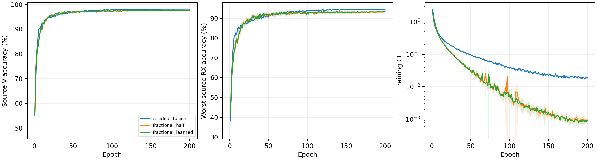

# CVS 波形层分数频偏校正身份网络：完整源实验报告

8 个新 scratch 模型完成 E200×50；完整核对 80000 步、1600 轮、详细文本与紧凑 epoch JSONL/CSV。实际为普通 CE、无增强、无域骨干、无权重继承，原 L6300/V27000、U56700 unused；全部新模型采用固定完整 FP32。原四份残差控制完整源曲线与实时核实终值一致。

固定性能优先源规则选择 `residual_fusion`。原残差胜出，未选分数校正候选不读query；默认保留已核实历史clean，不重跑历史。

| 候选 | 四seed源V（%） | 最差源RX（%） | 固定性能分数（%） | 参数 |
|---|---:|---:|---:|---:|
| residual_fusion | 98.0694 | 94.4954 | 96.2824 | 164225 |
| fractional_half | 97.4537 | 93.2083 | 95.3310 | 202553 |
| fractional_learned | 97.4815 | 93.2500 | 95.3657 | 202554 |

四 seed mean(0.5V+0.5最差源RX)最高优先；完全并列后才比较V、最差RX和成本。物理误差不参与选模，最佳轮只作诊断，所有选模使用E200。

| 模型 | seed | E200 V（%） | E200 最差RX（%） | 末轮CE | 最佳V（%） | 最佳轮（未选） |
|---|---:|---:|---:|---:|---:|---:|
| residual_fusion | 2026092701 | 98.0926 | 94.6481 | 0.018705 | 98.1111 | 156 |
| residual_fusion | 2026092702 | 98.1963 | 94.5741 | 0.018651 | 98.2222 | 159 |
| residual_fusion | 2026092703 | 97.9852 | 94.4630 | 0.016202 | 98.0185 | 177 |
| residual_fusion | 2026092704 | 98.0037 | 94.2963 | 0.022983 | 98.0556 | 169 |
| fractional_half | 2026092701 | 97.7296 | 93.9444 | 0.000739 | 97.7296 | 200 |
| fractional_learned | 2026092701 | 97.7704 | 93.9444 | 0.000661 | 97.7741 | 199 |
| fractional_half | 2026092702 | 97.5667 | 93.6852 | 0.001262 | 97.6556 | 116 |
| fractional_learned | 2026092702 | 97.6074 | 93.7778 | 0.001018 | 97.6815 | 157 |
| fractional_half | 2026092703 | 97.2259 | 92.3889 | 0.000626 | 97.3000 | 110 |
| fractional_learned | 2026092703 | 97.2556 | 92.4259 | 0.000964 | 97.3111 | 125 |
| fractional_half | 2026092704 | 97.2926 | 92.8148 | 0.001141 | 97.3333 | 138 |
| fractional_learned | 2026092704 | 97.2926 | 92.8519 | 0.001060 | 97.3704 | 118 |

四seed样本SD阴影覆盖全部200轮。[2400条曲线](evidence/source_curves.csv)、[1600轮同步测量](evidence/source_fractional_by_epoch.csv)、[全部720个源单元](evidence/source_all720_cells.csv)、[同seed源差分](evidence/source_paired_control.csv)。源RX是源验证，不称未知RX测试。

## 整体物理性质与边界

使用 lag20/window80:160 的相对频率估计 omega；在全部身份波形路径前执行 y[n]=x[n]exp(-j alpha omega n)。固定版本 alpha=0.5；学习版本共享一标量 sigmoid(a)，初始化0.5。样本振幅保留，alphaomega 与 y 可重建原输入；保留的(1-alpha)频率参与后续复数特征。常相位性质保留，但整网不宣称仿射相位不变。alpha不是TX/RX晶振贡献比例。主值±625kHz、歧义1.25MHz，无效相关回退零校正。仅在两次相关有效且不跨主值分支时声称部分波形频率协变，不声称任意RX/LTI不变或硬件参数辨识。实际float sigmoid可能饱和，全部实测alpha保留。

冻结公共链每模型5TX×6RX，检查公共相位及±80kHz仿射相位。全8权重最大公共相位logit误差4.2915344e-05，最大仿射logit误差14.429116；坐标逐点重建最大误差2.3841858e-07。常相位容差1e-3只报告，不是选模或停机门槛；附加频偏响应不称不变性误差。

| 模型 | seed | 相位rad | 附加相对CFO Hz | 整网logit响应 | 单位嵌入距离 | 主值跨界数 | 有效相关数 |
|---|---:|---:|---:|---:|---:|---:|---:|
| fractional_half | 2026092701 | 0.37 | 0.0 | 4.2915344e-05 | 2.7653036e-06 | 0 | 30 |
| fractional_half | 2026092701 | -1.2 | 80000.0 | 12.072973 | 0.65393132 | 0 | 30 |
| fractional_half | 2026092701 | 2.9 | -80000.0 | 14.429116 | 0.79016054 | 0 | 30 |
| fractional_learned | 2026092701 | 0.37 | 0.0 | 2.0503998e-05 | 1.5441867e-06 | 0 | 30 |
| fractional_learned | 2026092701 | -1.2 | 80000.0 | 11.979695 | 0.6661104 | 0 | 30 |
| fractional_learned | 2026092701 | 2.9 | -80000.0 | 13.50663 | 0.75155956 | 0 | 30 |
| fractional_half | 2026092702 | 0.37 | 0.0 | 3.0517578e-05 | 2.2544307e-06 | 0 | 30 |
| fractional_half | 2026092702 | -1.2 | 80000.0 | 9.1117859 | 0.62071812 | 0 | 30 |
| fractional_half | 2026092702 | 2.9 | -80000.0 | 7.5847883 | 0.55668962 | 0 | 30 |
| fractional_learned | 2026092702 | 0.37 | 0.0 | 2.7924776e-05 | 2.1200237e-06 | 0 | 30 |
| fractional_learned | 2026092702 | -1.2 | 80000.0 | 8.0882072 | 0.5898298 | 0 | 30 |
| fractional_learned | 2026092702 | 2.9 | -80000.0 | 8.7980642 | 0.60258627 | 0 | 30 |
| fractional_half | 2026092703 | 0.37 | 0.0 | 1.8596649e-05 | 1.3514149e-06 | 0 | 30 |
| fractional_half | 2026092703 | -1.2 | 80000.0 | 7.4206729 | 0.53221387 | 0 | 30 |
| fractional_half | 2026092703 | 2.9 | -80000.0 | 9.3435783 | 0.55441773 | 0 | 30 |
| fractional_learned | 2026092703 | 0.37 | 0.0 | 1.7642975e-05 | 1.3703871e-06 | 0 | 30 |
| fractional_learned | 2026092703 | -1.2 | 80000.0 | 7.649354 | 0.47824159 | 0 | 30 |
| fractional_learned | 2026092703 | 2.9 | -80000.0 | 8.8155651 | 0.5337323 | 0 | 30 |
| fractional_half | 2026092704 | 0.37 | 0.0 | 2.1934509e-05 | 1.3834662e-06 | 0 | 30 |
| fractional_half | 2026092704 | -1.2 | 80000.0 | 9.3114519 | 0.55255294 | 0 | 30 |
| fractional_half | 2026092704 | 2.9 | -80000.0 | 9.2993832 | 0.55255252 | 0 | 30 |
| fractional_learned | 2026092704 | 0.37 | 0.0 | 2.0503998e-05 | 1.4495355e-06 | 0 | 30 |
| fractional_learned | 2026092704 | -1.2 | 80000.0 | 10.168098 | 0.58798027 | 0 | 30 |
| fractional_learned | 2026092704 | 2.9 | -80000.0 | 10.133474 | 0.58797997 | 0 | 30 |

源V同步统计是27000包/90单元全部覆盖，估计均为received相对CFO；没有真频偏标签，不能把偏差称为晶振测量误差。

| 模型 | seed | 相对CFO范围 Hz | 相干度均值 | fallback比例 | TX中心间平方距离 | 同TX跨RX中心偏移 |
|---|---:|---:|---:|---:|---:|---:|
| fractional_half | 2026092701 | -621967.875 至 622686.000 | 0.943506 | 0 | 1.00042 | 0.112901 |
| fractional_learned | 2026092701 | -621967.875 至 622686.000 | 0.943506 | 0 | 1.02058 | 0.110046 |
| fractional_half | 2026092702 | -621967.875 至 622686.000 | 0.943506 | 0 | 1.13985 | 0.131919 |
| fractional_learned | 2026092702 | -621967.875 至 622686.000 | 0.943506 | 0 | 1.16362 | 0.12828 |
| fractional_half | 2026092703 | -621967.875 至 622686.000 | 0.943506 | 0 | 0.967701 | 0.110919 |
| fractional_learned | 2026092703 | -621967.875 至 622686.000 | 0.943506 | 0 | 0.97116 | 0.106746 |
| fractional_half | 2026092704 | -621967.875 至 622686.000 | 0.943506 | 0 | 1.13979 | 0.115918 |
| fractional_learned | 2026092704 | -621967.875 至 622686.000 | 0.943506 | 0 | 1.10824 | 0.113251 |

## 波形层校正的实际执行

[1600轮校正比例和梯度](evidence/source_alignment_optimization.csv)覆盖完整80000步。固定版本梯度为N/A，学习版本记录一标量的实际CE梯度；非零梯度不等于识别收益。

| 模型 | seed | 最终alpha | 200轮梯度均值 | 残余频率公式最大误差Hz | 有效公式包数 |
|---|---:|---:|---:|---:|---:|
| fractional_half | 2026092701 | 0.5 | N/A | 0.296875 | 27000 |
| fractional_learned | 2026092701 | 0.47319683 | 0.006346141643001432 | 0.15625 | 27000 |
| fractional_half | 2026092702 | 0.5 | N/A | 0.296875 | 27000 |
| fractional_learned | 2026092702 | 0.48189917 | 0.00820742483631418 | 0.5 | 27000 |
| fractional_half | 2026092703 | 0.5 | N/A | 0.296875 | 27000 |
| fractional_learned | 2026092703 | 0.49344659 | 0.00419092314138612 | 0.640625 | 27000 |
| fractional_half | 2026092704 | 0.5 | N/A | 0.296875 | 27000 |
| fractional_learned | 2026092704 | 0.48262736 | 0.006066258514516298 | 0.21875 | 27000 |

[部分波形协变与整网响应](evidence/source_affine_phase_audit.csv)逐行列出有效包数、主值跨界、波形误差与logit响应，两种误差含义不同。物理干预采用冻结公共合成波形，不是训练增强，也不涉及真实query。

TX/RX 镜像及三阶相同波形反例保留。LTI/RX影响不承诺消除，公共合成链不是精确WiSig均衡器、真实硬件采集或完整瞬态/噪声仿真。源嵌入几何只说明关联，不证明TX/RX因果分离。[全部240个公共组合](evidence/source_physics_cascade.csv)、[32个孤立TX变化](evidence/source_isolated_TX.csv)。

## 实测成本

| 模型 | 参数 | 常驻模型bytes | Conv/Linear MAC/包 | batch1推理ms均值 | batch128训练ms均值 | 源训练峰值bytes最大 |
|---|---:|---:|---:|---:|---:|---:|
| residual_fusion | 164225 | 657552 | 9708836 | 4.7265 | 29.1454 | 248282624 |
| fractional_half | 202553 | 810848 | 7199008 | 7.5328 | 42.8472 | 164171776 |
| fractional_learned | 202554 | 810848 | 7199008 | 7.3268 | 47.9494 | 171743744 |

RTX3090/Torch2.1/FP32；新模型全部cuDNN TF32=False，旧残差控制保留历史精度，非单因子因果对照。两个版本具有相同核心，固定版本202553参数，学习版本202554参数；只增加一标量校正自由度；MAC仅计Conv/Linear/矩阵乘，FFT/归一化/相关/atan2/复旋转等不计入MAC，实测延时与显存包括全部执行。副本profile不更新正式模型。并发条件可能影响小幅计时差；星载/额外传输/SFT成本N/A。[逐seed完整资源](evidence/source_resources.csv)。

原残差选中，按预登记规则保留其已核实历史 clean；本轮两个未选新候选的测试记 N/A，没有新增 query。不宣称识别优势或总体目标完成。历史clean代理口径、无LEO/SFT/新增类；D92三阶段N/A。目标成绩不反馈结构、超参数、重排或选择性重跑，负结果保留。

[前瞻设计](../../../docs/CVS_FRACTIONAL_IDENTITY_HYPOTHESIS_20261002.md) · [全量日志审计](evidence/source_completion_validation.json) · [源选择](evidence/source_selection.json) · [独立分析](evidence/source_analysis_validation.json)。

## 同核心完整校正的源域配对

实际重读此前4份同步等变源E200记录，完整物理角色、预算、scratch、model/loader seed、完整FP32和同步前端匹配。同一equivariant_memory核心比较；固定半校正与完整校正参数相同，学习版本多一标量。独立历史训练，不加载旧权重，不改变本轮冻结12记录候选排序。

| 候选 | 最终alpha均值 | Δ源V均值±seedSD（百分点） | Δ最差源RX均值±seedSD（百分点） |
|---|---:|---:|---:|
| fractional_half | 0.5 | +0.1231±0.0711 | +0.4074±0.2068 |
| fractional_learned | 0.48279249 | +0.1509±0.0637 | +0.4491±0.1726 |

差分为本轮减完整校正（alpha=1），只说明源域关联，不是独有TX频偏或硬件因果分离证明。[8行配对](evidence/paired_full_correction_source.csv) · [实际源来源](evidence/paired_full_correction_source.json)。

## 默认测试收尾：原控制保留

固定源规则选择原 residual_fusion，原四 seed clean 测试为 78.4543% ± 0.8436%（样本标准差），每行168000包。原20行/160份CM完整独立评分证据仍有效，本次只读核实四个ALL混淆矩阵与均值/SD，未重跑或读取新query/truth。两个未选新模型测试为N/A；条件24行新测试没有生成或发布。原结果只用于报告，不反馈本轮选择或后续设计。

[原独立测试报告](../20261001-phase1-cvs-selected-clean-manysig-m20-r01/report.md) · [保留测试核实](evidence/retained_baseline_test.json)。状态ANALYZED；本轮默认条件收尾完成，性能及真正RFF physics aware总体目标未完成。

## 后续结构原型：保留相对滤波能量

只依据实际归一化公式发现每通道逐包RMS会弱化通道能量比例；已形成改用跨通道共享RMS的原型，保持202553参数、全部scratch初始化、深度和宽度。7项合成检查通过，未接触正式数据、权重或目标结果，未正式训练；不据此声称识别收益。该本地原型不改变本轮不可变训练与冻结选择。

[数学假设](../../../docs/CVS_ENERGY_IDENTITY_HYPOTHESIS_20261002.md) · [原型核实](evidence/energy_prototype_validation.json)。
