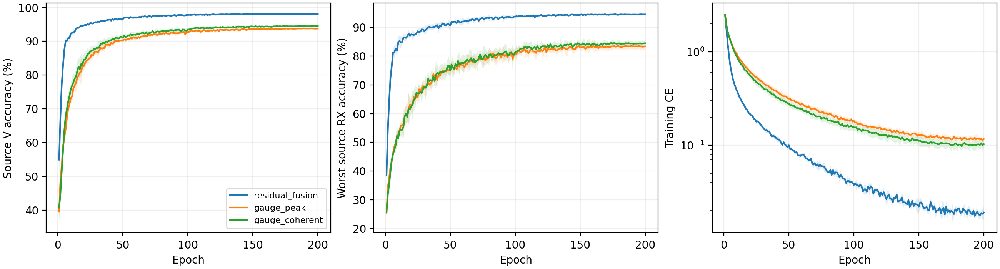

# 完整 IQ 相位规范化 CVS：完整源实验报告

八个新模型均完成 E200×50，共解析1600轮、80000步、CSV及全部文本日志。八个新模型为独立 scratch，没有增强、域骨干、继承或附加损失；L6300、V27000、U56700不用，物理角色一致。四个历史残差源控制的完整200轮曲线与当前只读最终指标匹配。

固定源规则选择 `residual_fusion`。已有残差控制胜出。两个相位候选不访问新query，测试为N/A；保留历史残差测试，不将源拒绝写成测试收益。真正RFF physics-aware与性能目标仍未完成。

|候选|四seed源V均值|最差源RX均值|性能分数|参数|
|---|---:|---:|---:|---:|
|residual_fusion|98.0694%|94.4954%|96.2824%|164225|
|gauge_peak|93.7870%|83.3843%|88.5856%|164225|
|gauge_coherent|94.4935%|84.4676%|89.4806%|164225|

性能分数为四seed的0.5×V+0.5×最差源RX均值。完全并列才比V、最差RX、MAC、参数与固定残差/峰值/相干顺序；没有成本优先容差。来源与物理角色/表示/预算已核查，只读源记录，未加载控制权重；目标成绩不参与排名。

|模型|seed|固定E200 V|固定E200最差源RX|末轮训练CE|最佳V（仅诊断）|最佳轮（未选模）|
|---|---:|---:|---:|---:|---:|---:|
|residual_fusion|2026092701|98.0926%|94.6481%|0.018705|98.1111%|156|
|residual_fusion|2026092702|98.1963%|94.5741%|0.018651|98.2222%|159|
|residual_fusion|2026092703|97.9852%|94.4630%|0.016202|98.0185%|177|
|residual_fusion|2026092704|98.0037%|94.2963%|0.022983|98.0556%|169|
|gauge_peak|2026092701|93.5407%|82.0741%|0.110391|93.7630%|176|
|gauge_coherent|2026092701|94.4963%|84.7593%|0.095954|94.5852%|138|
|gauge_peak|2026092702|94.1741%|84.6296%|0.109169|94.2407%|184|
|gauge_coherent|2026092702|94.8444%|85.5000%|0.099416|95.0926%|157|
|gauge_peak|2026092703|93.6370%|83.0185%|0.121343|93.6704%|187|
|gauge_coherent|2026092703|94.2889%|83.8889%|0.116249|94.4074%|177|
|gauge_peak|2026092704|93.7963%|83.8148%|0.125107|93.8407%|196|
|gauge_coherent|2026092704|94.3444%|83.7222%|0.099622|94.3741%|176|

曲线包括所有200轮，不只末轮。阴影按四个模型seed计算，源RX都是登记的源接收机，不称为独立未知RX测试。完整[2400条曲线CSV](evidence/source_curves.csv)、[源RX逐seed](evidence/source_rx_by_seed.csv)、[配对源差分](evidence/source_paired_control.csv)。

## 冻结物理诊断

全网公共相位不变性在实数运算下成立，完整256点IQ只乘单个复标量。相干平均只确定参考，没有用平均替换IQ或消除整包CFO。所有候选都保留频偏、AM/AM幅度形状和相对AM/PM响应。接收机IQ和多径仍能改变特征，这是明确反例；不声称TX参数唯一辨识。

|新源行|公共相位logit误差|CFO斜率logit差（非不变性声明）|AM/AM距离|AM/PM距离|RX IQ距离|多径距离|末batch回退比例均值|
|---|---:|---:|---:|---:|---:|---:|---:|
|gauge_peak-s2026092701|5.50747e-05|1.69862|0.0396259|0.0459071|0.198803|0.251099|0|
|gauge_coherent-s2026092701|8.52346e-05|2.35258|0.0487617|0.0662979|0.0976624|0.185789|0|
|gauge_peak-s2026092702|0.000118256|4.72756|0.0867407|0.106209|0.448703|0.292862|0|
|gauge_coherent-s2026092702|0.000110388|1.95359|0.0597683|0.0683796|0.0981551|0.10865|0|
|gauge_peak-s2026092703|5.07832e-05|6.41682|0.101212|0.0684033|0.523146|0.524607|0|
|gauge_coherent-s2026092703|2.86102e-06|7.18004|0.0537322|0.0758742|0.115036|0.135235|0|
|gauge_peak-s2026092704|3.57628e-05|3.43396|0.0534677|0.049363|0.393816|0.316333|0|
|gauge_coherent-s2026092704|8.34465e-06|7.98892|0.0827122|0.0453058|0.109519|0.0959154|0|

公共相位误差对照0.001作为诊断，任何失败原样保留，不改变训练、排名或测试精度。近峰选点存在不连续边界；FP32/TF32不能保证逐位不变。合成波形是手设周期20信号，不是标准L-STF系数，也不是训练增强或身份测试。源V几何覆盖每行27000包、90个TX/RX/day组；[完整分层](evidence/source_tx_rx_day.csv)及[冻结物理CSV](evidence/source_physics_by_seed.csv)都是解释证据，不回流选择。

## 实际资源与边界

|模型|参数|常驻模型字节|MAC/包|batch1推理ms均值|batch128训练ms均值|实际训练峰值bytes最大|
|---|---:|---:|---:|---:|---:|---:|
|residual_fusion|164225|657552|9708836|4.7265|29.1454|248282624|
|gauge_peak|164225|657552|9708836|5.2112|25.0454|248544768|
|gauge_coherent|164225|657552|9708836|6.3162|32.7400|248544768|

相位前端0个学习参数，实际所有164225个参数接收CE梯度。MAC仅计Conv/Linear，不含FFT、相位参考、归一化与逐元素运算；这些开销包含实际计时和峰值。RTX3090/Torch2.1/FP32，profile用一次性副本，训练峰值来自profile前日志；历史硬件并发口径保留，不据微小计时差声称加速。常驻字节只计模型，星载runtime/优化器/新增传输字节N/A。完整[资源逐seed](evidence/source_resource_by_seed.csv)。

当前clean是历史已暴露的闭集代理基准。仅CE、无增强、只身份、clean-only授权不扩大到LEO、support微调、新类或校准硬件测量。D92三阶段/K×新增类指标N/A。源指标与可证明物理性质都不能替代独立测试优势，更不能证明TX/RX因果分离。

[前瞻假设](../../../docs/CVS_GAUGE_IDENTITY_HYPOTHESIS_20261002.md) · [完整源审计](evidence/source_completion_validation.json) · [源排名](evidence/source_selection.json) · [独立复算](evidence/source_analysis_validation.json) · [发布读回](evidence/source_launch_readback.json)。

## 默认测试收尾与准确状态

固定源规则选中的仍是历史 `residual_fusion`。已独立重新读取原20行评分标记、完整预测完成状态、summary和全部160条评分；与历史记录逐字段一致。没有重新推理或评分，没有访问两个未选gauge候选的query。保留基线准确率 78.4543%±0.8436%，Macro-F1 78.2067%±0.9517%；这些是原残差模型的历史测试，不能当作本轮gauge测试结果。

本轮状态 ANALYZED_SOURCE_REJECTION_BASELINE_RETAINED。两个新模型测试 N/A（源规则未选中），无新的clean确认run。前瞻默认收尾分支已完成；不宣称新候选获得测试提升或整个研发目标完成。完整[基线保留证据](evidence/retained_baseline_test_readback.json)、[本轮判定](evidence/iteration_verdict.json)、[原完整测试报告](../20261001-phase1-cvs-selected-clean-manysig-m20-r01/report.md)。
