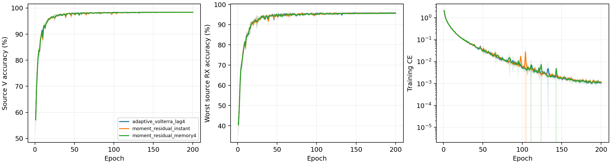

# CVS可学习包内矩残差：完整源实验报告

8个新scratch模型全部完成E200×50；完整审计80000步、1600轮、详细stdout及完整/紧凑JSONL/CSV。实际仅CE、无增强、身份骨干、原L6300/V27000/U56700unused、完整FP32，无权重继承。四个原adaptive控制的完整源曲线终值与本轮独立读回元数据一致。

固定源规则选择 `adaptive_volterra_lag4`。原控制保留；未选两种新候选clean均为N/A，不追加query，按预登记复用控制已完成的测试。总体目标仍未证明完成。

|候选|四seed源V（%）|最差源RX（%）|固定性能分数（%）|参数|
|---|---:|---:|---:|---:|
|adaptive_volterra_lag4|98.4019|95.7593|97.0806|202555|
|moment_residual_instant|98.3852|95.6713|97.0282|202557|
|moment_residual_memory4|98.3676|95.6204|96.9940|202557|

按四seed mean(0.5V+0.5最差源RX)最高选择，完全并列后比较V、最差RX与成本；仅E200权重参加选择，最好轮只作诊断。

|模型|seed|E200 V（%）|最差RX（%）|末轮CE|最好V（%，未选）|最好轮|
|---|---:|---:|---:|---:|---:|---:|
|adaptive_volterra_lag4|2026092701|98.5333|96.0000|0.000999573|98.5519|146|
|adaptive_volterra_lag4|2026092702|98.5000|96.1296|0.00137079|98.5444|166|
|adaptive_volterra_lag4|2026092703|98.3778|95.7963|0.000827306|98.4259|121|
|adaptive_volterra_lag4|2026092704|98.1963|95.1111|0.00137133|98.2185|140|
|moment_residual_instant|2026092701|98.5704|96.0556|0.000957341|98.6074|143|
|moment_residual_memory4|2026092701|98.4815|95.7778|0.00092419|98.5259|150|
|moment_residual_instant|2026092702|98.4593|96.1111|0.00128084|98.5000|159|
|moment_residual_memory4|2026092702|98.4963|96.1481|0.00125079|98.5370|143|
|moment_residual_instant|2026092703|98.2889|95.3889|0.000854847|98.3296|182|
|moment_residual_memory4|2026092703|98.3111|95.5185|0.000874873|98.3667|105|
|moment_residual_instant|2026092704|98.2222|95.1296|0.0015478|98.2481|157|
|moment_residual_memory4|2026092704|98.1815|95.0370|0.00127509|98.2333|132|

阴影为四seed样本标准差。全部720个新模型TX/RX/day单元覆盖源V，源RX分层不替代未知RX测试。

## 实际学习与输入修正

保留原包络B、原相位记忆A；I=A+tanh(beta)(O-B)。两个原alpha与两个新增beta均从零开始、只由源CE学习；beta=0保留原adaptive函数。O来自同包加权矩，不是已识别的TX PA系数，不保证最终混合输入正交。

|模型|seed|末轮alpha3|alpha5|beta3|beta5|三阶矩修正相对量|五阶矩修正相对量|公式误差|
|---|---:|---:|---:|---:|---:|---:|---:|---:|
|moment_residual_instant|2026092701|-0.047442142|-0.018594759|0.018111102|-0.05687692|0.017917302|0.059273195|0|
|moment_residual_memory4|2026092701|-0.053402949|-0.019532194|-0.013887007|-0.030976631|0.012617801|0.030548176|0|
|moment_residual_instant|2026092702|-0.013527309|-0.00052107737|0.046374232|-0.053264953|0.045573607|0.055220634|0|
|moment_residual_memory4|2026092702|-0.011316713|-0.0045133512|0.01183021|-0.050943144|0.010683903|0.050147876|0|
|moment_residual_instant|2026092703|-0.040403068|0.0072485921|0.028593365|-0.051578518|0.028337974|0.053547207|0|
|moment_residual_memory4|2026092703|-0.040937155|0.0052094017|-0.0016887736|-0.029916476|0.0015532573|0.029546874|0|
|moment_residual_instant|2026092704|0.0039132903|-0.026499527|0.019590767|-0.062397961|0.019402564|0.065325603|0|
|moment_residual_memory4|2026092704|0.0048258947|-0.026689067|-0.0083997659|-0.05511827|0.0076775467|0.054450966|0|

完整80000步核对四个系数的真实梯度、raw/tanh更新前后值与连续性；1600轮保留状态和梯度均值、实际末batch28包输入，6400行保留四delay矩。原一阶IQ最大误差0，实际输入公式最大误差0。相对修正量不是识别收益，不用于选模。

## 通信、物理与RFF边界

25MHz下记忆4为160ns、相位项最大历史8为320ns；它们是设计间隔，不是器件测量。包内矩只用同一received256点IQ，无标签、RX/TX标识、跨包或持久拟合状态；完整包矩不宣称流式因果性。输入lift保留相位协变，整网仍可响应CFO。

公共链覆盖5TX×6RX、240条完整观测、32条孤立TX干预与24条相位测量。八模型最大常相位logit误差1.9788742e-05，附加±80kHz最大logit响应27.91534；后者不是CFO不变性误差。保留TX/RX同波形反例，不宣称唯一TX硬件恢复、TX/RX因果分离、任意RX/LTI不变、完整Volterra识别或真实在轨验证。

## 实际成本

|模型|参数|模型常驻bytes|Conv/Linear MAC/包|batch1推理ms均值|batch128训练ms均值|源峰值bytes最大|
|---|---:|---:|---:|---:|---:|---:|
|adaptive_volterra_lag4|202555|810852|7199008|7.9069|42.9096|167101440|
|moment_residual_instant|202557|810860|7199008|9.5876|42.1846|170708480|
|moment_residual_memory4|202557|810860|7199008|9.6024|42.7370|170708480|

RTX3090/Torch2.1/完整FP32。新候选202557参数，控制202555，仅新增2，但包内矩和逐元素计算不计入Conv/Linear MAC；实际时延、显存包含执行且受并发影响，不作独占硬件结论。CPU峰值、星载成本及新增传输未测量，记N/A；无SFT/support/新增类。

[source_curves](evidence/source_curves.csv) · [source_final](evidence/source_final.csv) · [source_RX](evidence/source_RX.csv) · [source_resources](evidence/source_resources.csv) · [source_all720_cells](evidence/source_all720_cells.csv) · [source_geometry](evidence/source_geometry.csv) · [source_paired_control](evidence/source_paired_control.csv) · [source_gates_all1600](evidence/source_gates_all1600.csv) · [source_input_all1600](evidence/source_input_all1600.csv) · [source_moments_all6400](evidence/source_moments_all6400.csv) · [public_input_all8](evidence/public_input_all8.csv) · [public_moments_all32](evidence/public_moments_all32.csv) · [source_normalization_all9600](evidence/source_normalization_all9600.csv) · [public_normalization_all48](evidence/public_normalization_all48.csv) · [source_phase_all24](evidence/source_phase_all24.csv) · [public_cascade_all240](evidence/public_cascade_all240.csv) · [public_isolated_TX_all32](evidence/public_isolated_TX_all32.csv)

[前瞻设计](../../../docs/CVS_LEARNED_MOMENT_RESIDUAL_20261002.md) · [完整日志审计](evidence/source_completion_validation.json) · [源冻结](evidence/source_selection.json) · [分析核对](evidence/source_analysis_validation.json)。只测clean；目标结果不回流结构、矩定义、系数、epoch、seed或选择性重跑，全部负结果保留。

实际源终态 VERIFIED：dispatcher 与8个worker均自然退出，8行各200轮/10000步。源运行commit `a31fd318996be20f030aeccd7ed6ed614ce7048d`。[终态证据](evidence/final_source_readback.json)。固定源规则选中 `adaptive_volterra_lag4`；保留已有源控制，两个未选新候选的clean均为N/A，不追加query；既有控制clean已完成证据见前一轮报告。目标仍未证明完成。

源分析表逐项核对 VERIFIED，1600轮四系数与完整日志一致。固定规则保留已有adaptive控制；其32行历史clean矩阵及4份选中控制预测均已完成，CM/均值/配对此前独立核实，本轮只复用完成元数据，不读取新query或输出历史目标分数。两个未选候选clean均N/A。[本轮收尾](evidence/final_analysis_readback.json) · [控制测试复用](evidence/existing_clean_reuse.json) · [既有控制测试报告](../20261002-phase1-cvs-adaptive-volterra-clean-manysig-m32-r01/report.md)。

## 2026-10-03完整测试补齐

本批全部8个固定E200模型已纳入[全量clean测试报告](../20261003-phase1-cvs-all-frozen-clean-backfill-manysig-m304-r01/report.md)，每模型168,000个测试样本；此前未晋级且未测试的候选也已补测，已有预测复用。304行预测固定后统一独立truth-last评分，完整分类决定复算通过。测试结果见汇总报告和逐seed/RX/TX表；历史源域选择记录保持原样。
