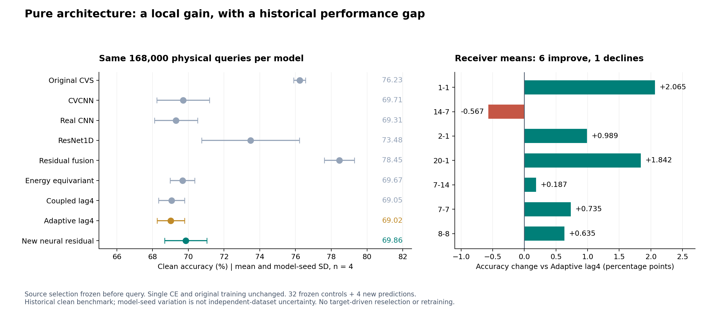

# CVS可学习复卷积残差：独立clean结果

源规则选中`neural_residual_shallow`；四seed准确率69.8567%±1.1881%，较当前adaptive控制+0.8409个百分点。结论：`PERFORMANCE_IMPROVEMENT`。

|模型|准确率/%±seed SD|Macro-F1/%±seed SD|
|---|---:|---:|
|native|76.2272±0.3291|75.9075±0.3709|
|cvcnn|69.7131±1.4695|69.5270±1.3587|
|real_cnn|69.3112±1.2009|68.9914±0.9864|
|resnet1d|73.4826±2.7392|73.1214±2.5849|
|residual_fusion|78.4543±0.8436|78.2067±0.9517|
|energy_equivariant|69.6699±0.6817|68.6784±0.7664|
|coupled_lag4|69.0548±0.7297|67.6476±1.0523|
|adaptive_volterra_lag4|69.0158±0.7715|67.6942±1.0054|
|neural_residual_shallow|69.8567±1.1881|68.2451±1.3308|

|对照|配对均值±SD/百分点|正提升seed|四seed差分/百分点|
|---|---:|---:|---|
|native|-6.3705±1.1752|0/4|-4.9613, -7.6839, -6.8810, -5.9560|
|cvcnn|+0.1436±2.6162|3/4|+2.7560, -3.4881, +0.6310, +0.6756|
|real_cnn|+0.5455±2.0354|2/4|+3.3250, -1.4863, +0.5560, -0.2125|
|resnet1d|-3.6259±3.5884|0/4|-0.4423, -8.1411, -1.0601, -4.8601|
|residual_fusion|-8.5976±1.0057|0/4|-7.5696, -9.1768, -9.7000, -7.9440|
|energy_equivariant|+0.1868±1.6894|3/4|+1.6137, -2.2512, +0.8810, +0.5036|
|coupled_lag4|+0.8019±1.0036|3/4|+2.2571, -0.0167, +0.6089, +0.3583|
|adaptive_volterra_lag4|+0.8409±1.0211|4/4|+2.3440, +0.1732, +0.2315, +0.6149|

|RX（每seed24000包）|adaptive/%|新候选/%±seed SD|差值/百分点|
|---|---:|---:|---:|
|1-1|66.1229|68.1875±1.1067|+2.0646|
|14-7|56.4073|55.8406±2.7512|-0.5667|
|2-1|75.3406|76.3292±2.8175|+0.9885|
|20-1|52.7771|54.6188±3.4645|+1.8417|
|7-14|79.7833|79.9708±5.0283|+0.1875|
|7-7|78.2448|78.9802±3.5772|+0.7354|
|8-8|74.4344|75.0698±3.6610|+0.6354|

|TX（每seed28000包）|adaptive/%|新候选/%±seed SD|
|---|---:|---:|
|14-10|91.2911|92.3268±3.3930|
|14-7|26.1330|25.2027±1.7324|
|20-15|52.7437|51.3205±5.2738|
|20-19|53.1188|56.1473±2.6830|
|6-15|94.4661|96.2884±1.3280|
|8-20|96.3420|97.8545±0.9229|

仅修改网络结构；保持原物理数据、单一CE、E200/AdamW/cosine和无增强。选模在新query前冻结；4份新预测和32份旧冻结预测组成36行，均逐样本面对全部6类。预测固定后独立truth-last评分，全部288个混淆矩阵、72组汇总、64组配对和RX求和复算通过；旧256条控制指标逐字段一致。所有负结果保留，不反馈结构/参数/重排或选择性重跑。

实际参数220987，模型状态884580bytes；batch1推理均值9.8971ms，batch128训练51.4826ms；完整168000query预测均值14.902s。逐seed硬件、显存峰值和状态见资源表；并发会影响耗时。MAC包含实际卷积与矩阵乘法，未覆盖FFT、归一化、门控、池化或逐元素运算。CPU峰值和星载传输未测量，记N/A。

本次是固定历史已暴露clean基准，不能称首次盲测；四seed只覆盖模型初始化变化，不能保证各RX/TX均提高或任意域泛化。无LEO、支持集适应、新增类或在轨测试；D92三阶段/K×新增类为N/A。

[逐row评分](evidence/clean_scored_results.json) · [评分CSV](evidence/clean_scored_results.csv) · [TX汇总](evidence/per_transmitter_summary.csv) · [资源](evidence/resource_summary.json) · [独立复算](evidence/analysis_validation.json) · [源报告](../20261002-phase1-cvs-neural-residual-identity-manysig-m8-r01/report.md)。

## 结果解释与目标状态

**本轮完成了纯结构修改带来的局部提升，但尚未达到整体性能领先。** 相对当前adaptive控制，四seed均提高，平均+0.8409个百分点；四个配对差值的标准差为1.0211个百分点。第一个seed贡献了四seed净增益总和的69.69%，其余三seed改善为0.1732、0.2315、0.6149个百分点。因此可以报告这四次实验均有正增益，但不能据此宣称独立接收机总体上具有稳定优势。

同一矩阵中，原始CVS为76.2272%，历史残差融合模型为78.4543%；新结构分别低6.3705和8.5976个百分点，而且四seed均落后。这些固定历史控制用于完整评价本次结果，不根据测试结果切换基座、晋级历史模型或补测未选deep候选。

源域证据显示：新增深层容量没有提高固定源分数；浅层提升只有0.0412个百分点，小于配对seed波动0.1577。旧曲率模块的冻结源消融也仅有0.0046至0.0167个百分点的净贡献。结合完整训练曲线，更充分拟合源数据、增加可学习参数或满足局部相位性质，都不足以证明跨接收机识别改善。本轮测试只检验了已冻结假设，不用于修改结构、训练、源规则或重跑。

逐RX中6个均值提高、1个下降；RX14-7下降0.5667个百分点。TX14-7与TX20-15均下降，说明总体改善不等于所有设备改善。宏平均F1提高约0.5509个百分点，仍低于CVCNN的69.5270%。后续研究目标仍是依靠网络结构改善识别；本次不把局部增益标记为全面完成。

发布与收尾状态VERIFIED：实际clean release为`a944dbaf7eb3bc6f7a8032d93f9bb9439295f198`；独立读回所有本轮进程已退出，预测/评分产物完整。源训练、源冻结、新预测、独立评分、报告与登记均已完成。未执行LEO、支持集微调、新类注册，也没有修改任何健康任务。
