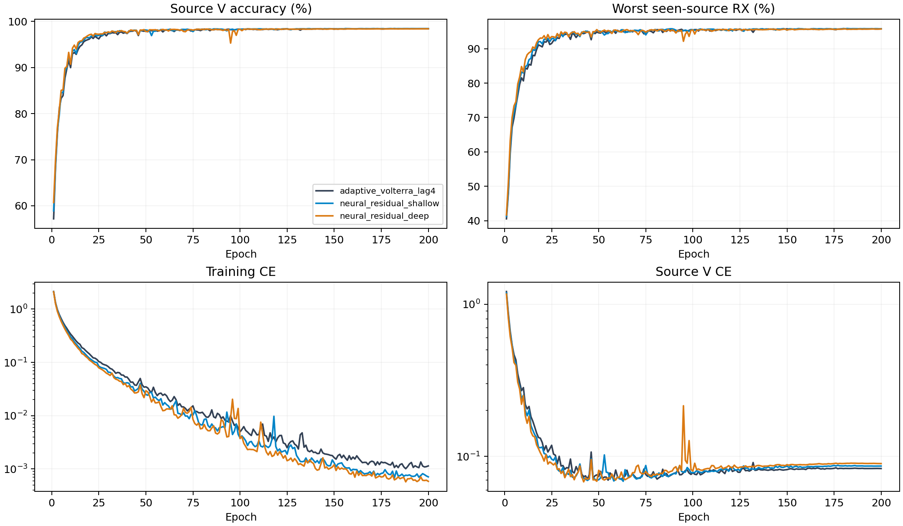

# CVS可学习复卷积残差：完整源训练结果

8个scratch模型完成200轮×50步。源选择由完整12记录独立重算，训练策略和单一CE保持不变。以下是源验证指标，不是测试结果。

|结构|源V/%|最差源RX/%|固定源分数/%|相对控制/百分点±配对SD|正提升seed|参数|
|---|---:|---:|---:|---:|---:|---:|
|adaptive_volterra_lag4|98.4019|95.7593|97.0806|+0.0000±0.0000|0/4|202555|
|neural_residual_shallow|98.4426|95.8009|97.1218|+0.0412±0.1577|3/4|220987|
|neural_residual_deep|98.3972|95.7361|97.0667|-0.0139±0.1599|1/4|239419|

固定规则选中`neural_residual_shallow`。后续只对该候选4模型执行预登记clean测试。

|结构|batch1推理/ms|batch128训练/ms|
|---|---:|---:|
|adaptive_volterra_lag4|7.9069|42.9096|
|neural_residual_shallow|9.8971|51.4826|
|neural_residual_deep|11.4234|56.7731|

资源在实际RTX3090/FP32环境测量，并行运行可能影响时间。MAC计数包含实际aten卷积（包括功能式复卷积）及矩阵乘法，未计FFT、归一化、门控、池化和逐元素运算；不是总FLOPs。峰值内存与常驻状态保留逐seed值。新模块同样只由CE更新；零出口的首步内部零梯度是初始化性质，不能与训练后失活混同。

源V使用已见源RX；四seed不是独立数据集。新增容量是否提高独立clean识别必须由冻结测试证明。没有追加损失、增强、重加权、采样策略、teacher或目标适应。D92的适应三阶段/K×新增类为N/A。

[逐seed](evidence/source_final.csv) · [完整曲线](evidence/source_curves.csv) · [实际新增分支输出](evidence/neural_outputs.csv) · [全部TX/RX/day单元](evidence/source_cells.csv) · [资源](evidence/source_resources.csv) · [80000步审计](evidence/source_completion_validation.json) · [原设计](../../../docs/CVS_NEURAL_RESIDUAL_20261002.md)。
