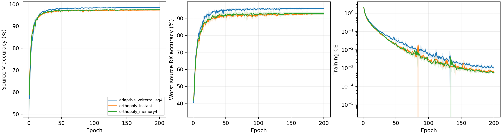

# CVS 包内正交包络输入：完整源实验报告

8个新scratch模型全部完成E200×50；完整审计80000步、1600轮与详细文本/紧凑JSONL/CSV。仅CE、无增强、身份骨干、原L6300/V27000/U56700unused、完整FP32、无权重继承。四个当前adaptive源控制只读元数据与完整源曲线终值一致。

固定源规则选择 `adaptive_volterra_lag4`。当前源控制保留；未选新候选测试N/A、零新query，按预登记复用其既有已核实clean。本报告不证明测试性能提升或总体目标完成。

|候选|四seed源V（%）|最差源RX（%）|固定性能分数（%）|参数|
|---|---:|---:|---:|---:|
|adaptive_volterra_lag4|98.4019|95.7593|97.0806|202555|
|orthopoly_instant|97.2981|92.6065|94.9523|202553|
|orthopoly_memory4|97.4167|92.8843|95.1505|202553|

最高四seed mean(0.5V+0.5最差源RX)，完全并列后才比较V、最差RX与成本。全部选模固定E200；最佳轮仅诊断。

|模型|seed|E200 V（%）|最差RX（%）|CE|最佳V（%）|最佳轮（未选）|
|---|---:|---:|---:|---:|---:|---:|
|adaptive_volterra_lag4|2026092701|98.5333|96.0000|0.001000|98.5519|146|
|adaptive_volterra_lag4|2026092702|98.5000|96.1296|0.001371|98.5444|166|
|adaptive_volterra_lag4|2026092703|98.3778|95.7963|0.000827|98.4259|121|
|adaptive_volterra_lag4|2026092704|98.1963|95.1111|0.001371|98.2185|140|
|orthopoly_instant|2026092701|97.5111|93.2222|0.000800|97.5148|195|
|orthopoly_memory4|2026092701|97.6037|93.6481|0.000621|97.6593|128|
|orthopoly_instant|2026092702|97.1815|92.6481|0.000579|97.4000|75|
|orthopoly_memory4|2026092702|97.6704|93.8148|0.000553|97.7630|119|
|orthopoly_instant|2026092703|97.3667|92.7037|0.000531|97.4333|63|
|orthopoly_memory4|2026092703|97.2778|92.2593|0.000507|97.3667|121|
|orthopoly_instant|2026092704|97.1333|91.8519|0.000772|97.2444|151|
|orthopoly_memory4|2026092704|97.1148|91.8148|0.000623|97.1704|125|

## 实际输入与物理边界

原IQ retained；三阶/五阶按同包加权矩去除相关项。6400个实际源末batch同延迟阶次记录覆盖1600epoch×4delay，公共32个记录覆盖8模型×4delay。Gram只在记录的非退化包上计算；不能说覆盖全部源V，也不证明跨delay或类别正交。

原IQ最大误差0，原三阶/五阶重建最大误差7.6293945e-06，符合记录条件的正交Gram最大残余8.170557459446723e-07。误差只报告，不参与排名或停机。

|模型|seed|delay|原相关均值|正交残余最大值|重建误差|有效包数|三阶能量|五阶能量|
|---|---:|---:|---:|---:|---:|---:|---:|---:|
|orthopoly_instant|2026092701|0|0.829353232509986|4.7632283163413626e-07|9.53674e-07|28|262.589|1071.87|
|orthopoly_instant|2026092701|1|0.8295822811770294|3.454762065547259e-07|1.90735e-06|28|262.181|1069.88|
|orthopoly_instant|2026092701|2|0.8294013742994728|3.3025352060426546e-07|9.53674e-07|28|261.832|1068.89|
|orthopoly_instant|2026092701|3|0.8293930171618171|4.250115592164079e-07|1.90735e-06|28|261.467|1067.47|
|orthopoly_memory4|2026092701|0|0.8655483415997914|4.6152926496879733e-07|4.76837e-07|28|111.453|161.216|
|orthopoly_memory4|2026092701|1|0.865828342885983|4.1613769112635133e-07|4.76837e-07|28|111.135|160.623|
|orthopoly_memory4|2026092701|2|0.8657096073872702|4.2613461256396255e-07|4.76837e-07|28|111.005|160.334|
|orthopoly_memory4|2026092701|3|0.865591963125071|4.76522138096887e-07|4.76837e-07|28|110.875|160.103|
|orthopoly_instant|2026092702|0|0.8259806119321206|3.0365291263106085e-07|3.8147e-06|28|290.541|1667.04|
|orthopoly_instant|2026092702|1|0.8262411641453387|3.410850757617024e-07|3.8147e-06|28|290.025|1664.24|
|orthopoly_instant|2026092702|2|0.826165605997185|5.47497578127871e-07|9.53674e-07|28|289.592|1662.54|
|orthopoly_instant|2026092702|3|0.8262124194557081|4.067143687995092e-07|3.8147e-06|28|289.147|1660.16|
|orthopoly_memory4|2026092702|0|0.857702372612731|5.424046753925184e-07|9.53674e-07|28|123.7|232.818|
|orthopoly_memory4|2026092702|1|0.8580172676706468|4.001577170776545e-07|9.53674e-07|28|123.301|231.907|
|orthopoly_memory4|2026092702|2|0.8579531038348118|8.170557459446723e-07|9.53674e-07|28|123.137|231.687|
|orthopoly_memory4|2026092702|3|0.8578774827959602|4.12885865947648e-07|9.53674e-07|28|123.021|231.582|
|orthopoly_instant|2026092703|0|0.8417230852251645|3.0939508319019543e-07|9.53674e-07|28|187.835|428.845|
|orthopoly_instant|2026092703|1|0.8419894944807736|2.9767466463274216e-07|4.76837e-07|28|187.396|427.88|
|orthopoly_instant|2026092703|2|0.8417323527558774|3.8186516628023344e-07|4.76837e-07|28|187.079|427.318|
|orthopoly_instant|2026092703|3|0.8416715268903475|2.5493316304761136e-07|9.53674e-07|28|186.839|426.892|
|orthopoly_memory4|2026092703|0|0.8764906000455304|5.265268602978344e-07|2.38419e-07|28|83.9864|71.9214|
|orthopoly_memory4|2026092703|1|0.8767860882902795|4.598035590116342e-07|2.38419e-07|28|83.6562|71.504|
|orthopoly_memory4|2026092703|2|0.8766482357573988|4.012075550243727e-07|2.38419e-07|28|83.5425|71.4103|
|orthopoly_memory4|2026092703|3|0.8767123187991458|4.778645239822096e-07|2.38419e-07|28|83.2847|70.926|
|orthopoly_instant|2026092704|0|0.8359156895208822|3.337713128137585e-07|9.53674e-07|28|222.041|774.492|
|orthopoly_instant|2026092704|1|0.8361773002134176|3.8976235318768395e-07|9.53674e-07|28|221.59|772.955|
|orthopoly_instant|2026092704|2|0.8360141883078721|3.9172785875337073e-07|1.90735e-06|28|221.283|772.097|
|orthopoly_instant|2026092704|3|0.8360054507282989|3.5821103374439285e-07|9.53674e-07|28|220.949|771.135|
|orthopoly_memory4|2026092704|0|0.8729182738073981|5.797125361257597e-07|2.38419e-07|28|99.5154|116.683|
|orthopoly_memory4|2026092704|1|0.8732164238082244|3.4485342004567015e-07|4.76837e-07|28|99.1701|116.105|
|orthopoly_memory4|2026092704|2|0.8731060249193717|3.6451793864553564e-07|2.38419e-07|28|99.0407|115.938|
|orthopoly_memory4|2026092704|3|0.873086976267711|4.0161363833853866e-07|2.38419e-07|28|98.8114|115.777|

全模型公共常相位最大logit误差2.5987625e-05，±80kHz仿射相位最大logit响应27.829742。后者是频偏响应，不是证明不变性的误差。原TX/RX同波形反例保留；输入正交不代表唯一TX硬件系数、TX/RX解耦、RX/LTI不变或真实在轨验证。全包矩不是流式因果运算，没有持久拟合状态。

## 实际成本

|模型|参数|常驻模型bytes|Conv/Linear MAC/包|batch1推理ms均值|batch128训练ms均值|源峰值bytes最大|
|---|---:|---:|---:|---:|---:|---:|
|adaptive_volterra_lag4|202555|810852|7199008|7.9069|42.9096|167101440|
|orthopoly_instant|202553|810844|7199008|7.7245|37.8669|163559936|
|orthopoly_memory4|202553|810844|7199008|7.8604|40.9319|163559936|

RTX3090/Torch2.1/完整FP32；统计口径见逐seed资源。MAC不包含包内矩/除法/逐元素运算，不等于总计算相同；实际延时及显存包含全执行，但并发非独占基准。无SFT/星载/新类，未测量CPU峰值与新增传输项为N/A。相对原residual_fusion不是等参数单因子比较。

[source_curves](evidence/source_curves.csv) · [source_final](evidence/source_final.csv) · [source_RX](evidence/source_RX.csv) · [source_resources](evidence/source_resources.csv) · [source_all720_cells](evidence/source_all720_cells.csv) · [source_geometry](evidence/source_geometry.csv) · [source_paired_control](evidence/source_paired_control.csv) · [source_input_all6400](evidence/source_input_all6400.csv) · [public_input_all32](evidence/public_input_all32.csv) · [source_normalization_all9600](evidence/source_normalization_all9600.csv) · [public_normalization_all48](evidence/public_normalization_all48.csv) · [source_phase_all24](evidence/source_phase_all24.csv) · [public_cascade_all240](evidence/public_cascade_all240.csv) ·

[前瞻结构推导](../../../docs/CVS_PACKET_ORTHOGONAL_ENVELOPE_20261002.md) · [全部日志审计](evidence/source_completion_validation.json) · [源冻结](evidence/source_selection.json) · [完整分析核对](evidence/source_analysis_validation.json)。只测clean；目标结果不反馈结构、lag、尺度、超参数、候选、seed或选择性重跑，保留全部负结果。

实际源终态 VERIFIED：dispatcher 与8个worker均自然退出，8行各200轮/10000步。源运行commit `541889b1ec5982773d20f17315d0e0d6300ecee1`。[终态证据](evidence/final_source_readback.json)。固定源规则选中 `adaptive_volterra_lag4`；保留已有源控制，两个未选新候选的clean均为N/A，不追加query；既有控制clean已完成证据见前一轮报告。目标仍未证明完成。

条件 clean 执行支持已实现，实际兼容及权限负测 87 项 PASS（13.61秒）。测试使用合成 scratch checkpoint 与元数据 fixture；没有创建正式 clean 配置、加载正式候选权重或读取 query/truth。因为源控制保留，本轮没有启动该路径；新候选测试 N/A。[验证](evidence/conditional_clean_validation.json)。

## 源冻结后的公共坐标诊断

11项检查 PASS（2.73秒）。既有30组公共合成IQ显示逐包逆坐标恢复误差至1.1102e-16，实际scratch卷积恢复误差至4.4409e-16；统一实数逆矩阵的相对残差分别约0.0040和0.0019。包内系数关系随IQ统计量变化，但这不证明完整CNN表达能力受限或本轮退步的原因。完整逆变换只恢复原lift函数，不能单独作为性能改进。未读取正式源IQ、训练checkpoint、target query/truth，未更新源选模。

[原理与实现边界](../../../docs/CVS_ORTHOGONAL_COORDINATE_LIMIT_20261002.md) · [公共测量](evidence/public_conditioning_transport.json)。
