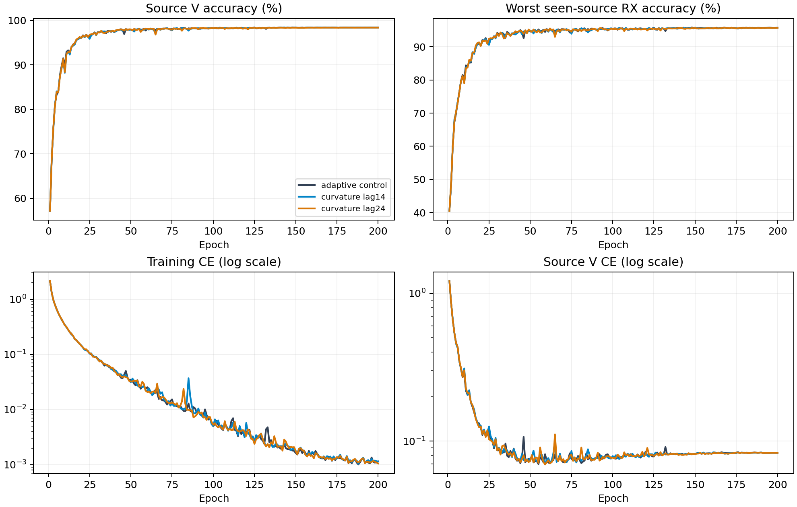

# CVS六层相位曲率残差：完整源实验结果

8行均完成E200，每行10000步。独立重算固定12条源记录和源选择，完整80000步日志审计通过；未根据目标成绩改变排名。

|方法|源V准确率|最差源RX|固定源分数|参数|
|---|---:|---:|---:|---:|
|adaptive_volterra_lag4|98.4019%|95.7593%|97.0806%|202555|
|phase_curvature_lag14|98.3926%|95.7130%|97.0528%|202561|
|phase_curvature_lag24|98.3824%|95.6944%|97.0384%|202561|

源规则选中`adaptive_volterra_lag4`。保留原adaptive控制，两个未选候选的clean为N/A，复用原控制已经完成的clean结果。以上是源验证指标，不是测试成绩。

[逐seed结果](evidence/source_final.csv)、[完整2400轮含控制曲线](evidence/source_curves.csv)、[9600个实际曲率输出](evidence/source_curvature_all9600.csv)、[1600轮八系数日志](evidence/source_gates_all1600.csv)、[全部720个TX×RX×day单元](evidence/source_all720_cells.csv)、[资源](evidence/source_resources.csv)、[公共级联240条](evidence/public_cascade_all240.csv)、[独立复算](evidence/source_analysis_validation.json)。全部负结果保留。

训练继续使用原物理划分、scratch、CE唯一、无增强、身份骨干、完整FP32。曲率系数作用于接收特征，不能解释为TX硬件参数；局部仿射相位协变不等于整网CFO不变。每轮末28个训练样本的输出修正遥测不代表完整V分布；实际识别贡献由独立冻结V消融另行测量。

参数比原控制增加6；Conv/Linear MAC未包含新增逐元素计算，耗时/显存按实测报告。跨seed只覆盖四次初始化随机性。源V来自同一组已见RX，最差源RX并非留一RX泛化验证。完整历史源分析见[evidence/history_analysis/source_history_analysis.json](evidence/history_analysis/source_history_analysis.json)，含48模型、9600轮，不读取目标评分；已有400000步历史原始日志审计引用保存证据，本轮另审计80000步。

当前源实验与条件测试收尾已闭合：完整日志和自然退出VERIFIED；原控制的4模型clean已在32行矩阵评分完成，本轮仅复用完成证据，无新query。曲率两候选未胜出，性能提升目标未完成。后续进行独立源域机制归因。[控制测试复用](evidence/existing_clean_reuse.json)。
