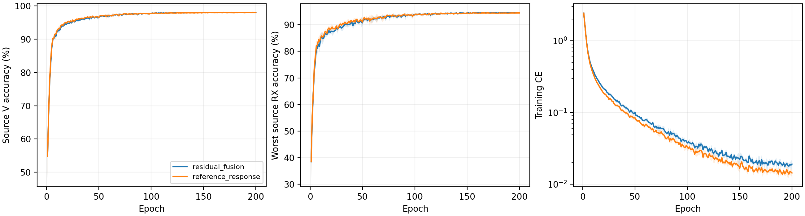

# CVS 已知激励相对响应：完整源实验报告

四个新模型完成 E200×50，完整解析 800 轮、40000 步，将逐步 JSONL、逐轮 JSONL/CSV 与详细文本日志逐项核对。相同物理 L6300/V27000，U56700 不用；scratch、普通身份 CE、无增强、无域骨干、无继承或附加损失。四份原残差源控制的完整曲线与实时核实的最终源指标一致。

固定性能优先源规则选择 `residual_fusion`。原残差基线胜出，新候选不访问 query，测试为 N/A；默认收尾保留并独立核实原历史测试，不把源拒绝写成测试收益。

|候选|四 seed 源 V 均值|最差源 RX 均值|性能分数|参数|
|---|---:|---:|---:|---:|
|residual_fusion|98.0694%|94.4954%|96.2824%|164225|
|reference_response|97.9935%|94.4120%|96.2028%|177025|

分数为四 seed 的 0.5×V＋0.5×最差源 RX 均值。性能完全并列后才比较 V、最差 RX、实数 Conv/Linear MAC、参数及原残差/新响应固定顺序。没有成本容差带，没有目标成绩参与排名，没有加载源控制权重。

|模型|seed|固定 E200 V|固定 E200 最差源 RX|末轮训练 CE|最佳 V（仅诊断）|最佳轮（未选模）|
|---|---:|---:|---:|---:|---:|---:|
|residual_fusion|2026092701|98.0926%|94.6481%|0.018705|98.1111%|156|
|residual_fusion|2026092702|98.1963%|94.5741%|0.018651|98.2222%|159|
|residual_fusion|2026092703|97.9852%|94.4630%|0.016202|98.0185%|177|
|residual_fusion|2026092704|98.0037%|94.2963%|0.022983|98.0556%|169|
|reference_response|2026092701|97.8778%|94.1852%|0.014561|98.0185%|156|
|reference_response|2026092702|98.1741%|94.8333%|0.014760|98.1963%|153|
|reference_response|2026092703|97.9481%|94.2963%|0.012478|97.9889%|183|
|reference_response|2026092704|97.9741%|94.3333%|0.015681|98.0296%|171|

阴影为四 seed 的样本标准差，含所有 200 轮；源 RX 分层仍是源验证，不称作未知 RX 测试。完整 [1600 条曲线](evidence/source_curves.csv)、[源 RX 逐 seed](evidence/source_rx_by_seed.csv)、[配对源差分](evidence/source_paired_control.csv)。

## 物理机制与实际学习

已知公共 L-STF 的 12 个激励频点形成相对复响应，附带匹配质量、周期相干度、显式相对 CFO 和功率比例。它是相对接收响应，可能包含 TX、信道、RX 和均衡器影响。仅参考分支在非退化输入上近似消去一个 flat 复增益；原始身份路径保留，不宣称全网公共相位或任意信道不变。

|seed|E200 门控绝对值均值|末 batch 门控梯度范数|末 batch 投影梯度范数|源 V TX 中心间平方距离|同 TX 各 RX 中心偏移平方距离|
|---|---:|---:|---:|---:|---:|
|2026092701|0.104314|0.00507696|0.0571054|1.63908|0.0642368|
|2026092702|0.106086|0.0466006|0.62757|1.63326|0.0589998|
|2026092703|0.102784|0.0142109|0.313767|1.55659|0.0730028|
|2026092704|0.107532|0.0151607|0.3702|1.50773|0.0768178|

门控和梯度来自每轮最后一个源 batch，不是完整源 V 的分支贡献消融；非零门控只能证明分支参与学习，不能单独证明其改善身份判别。源 V 几何覆盖每行 27000 包及 90 个 TX×RX×day 组，不把组间关联解释成硬件因果分离。[全部 800 轮响应与梯度](evidence/source_response_by_epoch.csv)、[360 个源分层单元](evidence/source_tx_rx_day.csv)。

冻结受控链为 100 Msps 公共稳态激励→TX 三阶/镜像/记忆→周期 FIR 信道→RX 增益/镜像/三阶→12 tone 投影→25 Msps 采样→相对 CFO→RMS。每个模型固定 30 个组合；没有训练增强、目标访问、噪声/瞬态或真实 WiSig MMSE 均衡复现。合成配置不是六个真实源身份，不给合成身份准确率。

|seed|孤立 TX 变化|整网单位嵌入距离|相对响应距离|
|---|---|---:|---:|
|2026092701|tx_am_am|0.0267072|0.00573311|
|2026092701|tx_first_order_am_pm|0.153932|0.00552415|
|2026092701|tx_iq_image|0.127375|0.0282843|
|2026092701|tx_cubic_memory|0.0946489|0.0231917|
|2026092702|tx_am_am|0.0342771|0.00573311|
|2026092702|tx_first_order_am_pm|0.169544|0.00552415|
|2026092702|tx_iq_image|0.136962|0.0282843|
|2026092702|tx_cubic_memory|0.0952126|0.0231917|
|2026092703|tx_am_am|0.041229|0.00573311|
|2026092703|tx_first_order_am_pm|0.121332|0.00552415|
|2026092703|tx_iq_image|0.16031|0.0282843|
|2026092703|tx_cubic_memory|0.0948124|0.0231917|
|2026092704|tx_am_am|0.064002|0.00573311|
|2026092704|tx_first_order_am_pm|0.262985|0.00552415|
|2026092704|tx_iq_image|0.212637|0.0282843|
|2026092704|tx_cubic_memory|0.205314|0.0231917|

上述 TX 变化固定 identity RX，以理想 TX 为参照；[全部 120 个 TX/RX 组合](evidence/source_physics_cascade.csv)同时保留各 RX/信道扰动下同 TX 的变化。unity 信道下 TX 镜像与 RX 镜像、TX 三阶与 RX 三阶能产生相同观测，逐行最大波形误差保存在完整证据中。未知频响还可吸收部分带内失真；不能从该结构宣称 TX PA/IQ 参数唯一辨识、校准晶振频偏或任意接收机解耦。

|固定理想 TX 的 RX/信道变化|相对复响应距离均值|整网单位嵌入距离均值（四 seed）|
|---|---:|---:|
|identity|0|0|
|flat_phase_gain|1.27829e-07|1.11427|
|relative_cfo|9.22717e-08|1.28394|
|lti_channel|0.0961124|0.427166|
|rx_iq_image|0.0282843|0.159321|
|rx_cubic|0.00573311|0.0415539|

flat 复增益/相位经整包 RMS 后消去幅度尺度，参考分支的相对复响应变化接近数值误差，整网嵌入仍明显改变。相对 CFO 的形状校正也不等于整网 CFO 不变，模型显式保留 CFO。以上是本轮可定位的局限：局部物理坐标没有约束原始身份路径；不能把它包装成已经实现整体物理感知。该受控反例不证明源指标小幅下降的唯一原因，也不改变候选排名。下一轮应先研究全部身份路径的干扰作用及合法源域身份信息保留，再前瞻登记新的结构；不依据历史目标成绩调参。[RX 受控汇总](evidence/source_physics_rx_summary.csv)。

## 实际资源

|模型|参数|checkpoint 模型字节|额外公共参考 buffer 字节|实数 Conv/Linear MAC/包|独立 complex correlator MAC/包|batch1 推理 ms 均值|batch128 训练 ms 均值|训练峰值 bytes 最大|
|---|---:|---:|---:|---:|---:|---:|---:|---:|
|residual_fusion|164225|657552|0|9708836|0|4.7265|29.1454|248282624|
|reference_response|177025|708752|102496|9721892|6400|6.6517|34.4399|248598528|

新增 12800 参数（7.79%）；固定前端无学习参数，但有公共 buffer 和 6400 complex MAC（等价 25600 实数 MAC）的相关库开销。Conv/Linear 数量不含 FFT/归一化/逐元素运算，实际计时及峰值包含所有执行。公共 buffer 不进入 checkpoint，常驻量另计。RTX3090/Torch2.1/FP32，用一次性副本 profile；历史并发条件可能影响细小计时差，不能据此声称加速。星载 runtime、优化器常驻及新增传输字节 N/A。[资源逐 seed](evidence/source_resource_by_seed.csv)。

当前没有新的 clean 测试结论；历史已暴露的六类 clean 是代理基准。协议不扩展到 LEO、SFT、新类或硬件标定；D92 三阶段/K×新增类指标 N/A。物理构造、机制证据与独立识别性能分别评价，真正 RFF physics aware 和性能研发目标仍未宣称完成。

[前瞻设计与闭式](../../../docs/CVS_REFERENCE_RESPONSE_HYPOTHESIS_20261002.md) · [完整源审计](evidence/source_completion_validation.json) · [源排名](evidence/source_selection.json) · [独立分析](evidence/source_analysis_validation.json)。

## 默认测试收尾与准确状态

固定源规则选中的仍为历史 `residual_fusion`。独立读取原 20 行评分标记、预测完成状态、summary 与全部 160 条评分；与历史记录逐字段一致，没有重新推理或评分，也没有访问未选 reference 候选的 query。保留基线历史准确率 78.4543%±0.8436%、Macro-F1 78.2067%±0.9517%；这些是原残差模型的历史测试，不能当作本轮新候选测试结果。

本轮状态 `ANALYZED_SOURCE_REJECTION_BASELINE_RETAINED`。新候选测试 N/A（源规则未选中），不创建新 clean 确认 run。前瞻默认收尾分支完成，物理感知与识别性能研发目标仍未达成。[基线保留证据](evidence/retained_baseline_test_readback.json) · [本轮判定](evidence/iteration_verdict.json) · [原完整测试报告](../20261001-phase1-cvs-selected-clean-manysig-m20-r01/report.md)。

## 验证与交接

10 项模型/数学检查、13 项源协议检查、52 项条件 clean 生命周期检查均为既有 PASS；新增 12 项完整日志核对检查 PASS，collector/analyzer 独立 P0/P1 审查 PASS。正式四行 40000 步、800 轮 JSONL/CSV/stdout 已实际核对；远端最终读回确认四 worker 与 dispatcher 均自然结束，没有停止、重启或热修改。

本轮 immutable source commit 为 `bc26714f58932bc7d50b393b4c8e9a3d5a6937e1`；本地收尾代码与报告的提交另行记录。本轮没有待启动 clean run。整体身份表征及性能目标尚未完成；下一步按合法源机制研究整体干扰处理，保留此前相位规范化负结果，不依据历史目标成绩选择结构或重跑。[收尾验证](evidence/completion_tools_validation.json) · [最终进程读回](evidence/source_final_readback.json) · [下一步源研发交接](evidence/next_source_handoff.json)。

## 2026-10-03完整测试补齐

本批全部4个固定E200模型已纳入[全量clean测试报告](../20261003-phase1-cvs-all-frozen-clean-backfill-manysig-m304-r01/report.md)，每模型168,000个测试样本；此前未晋级且未测试的候选也已补测，已有预测复用。304行预测固定后统一独立truth-last评分，完整分类决定复算通过。测试结果见汇总报告和逐seed/RX/TX表；历史源域选择记录保持原样。
