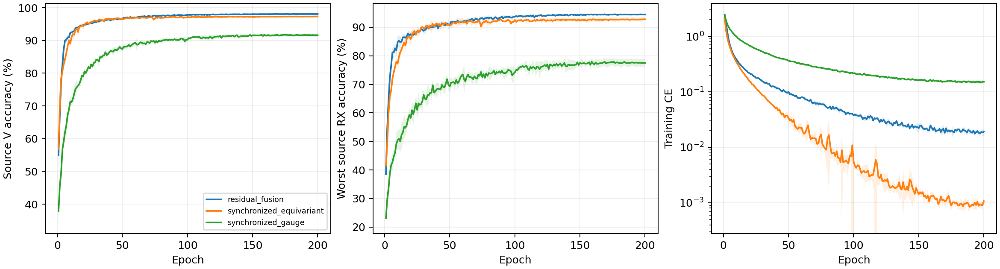

# CVS 全路径逐包同步身份网络：完整源实验报告

8 个新 scratch 模型完成 E200×50；完整核对 80000 步、1600 轮、详细文本与紧凑 epoch JSONL/CSV。实际为普通 CE、无增强、无域骨干、无权重继承，原 L6300/V27000、U56700 unused；全部新模型采用固定完整 FP32。原四份残差控制完整源曲线与实时核实终值一致。

固定性能优先源规则选择 `residual_fusion`。原残差胜出，未选同步候选不读query；默认保留已核实历史clean，不重跑历史。

| 候选 | 四seed源V（%） | 最差源RX（%） | 固定性能分数（%） | 参数 |
|---|---:|---:|---:|---:|
| residual_fusion | 98.0694 | 94.4954 | 96.2824 | 164225 |
| synchronized_equivariant | 97.3306 | 92.8009 | 95.0657 | 202553 |
| synchronized_gauge | 91.6176 | 77.5324 | 84.5750 | 164225 |

四 seed mean(0.5V+0.5最差源RX)最高优先；完全并列后才比较V、最差RX和成本。物理误差不参与选模，最佳轮只作诊断，所有选模使用E200。

| 模型 | seed | E200 V（%） | E200 最差RX（%） | 末轮CE | 最佳V（%） | 最佳轮（未选） |
|---|---:|---:|---:|---:|---:|---:|
| residual_fusion | 2026092701 | 98.0926 | 94.6481 | 0.018705 | 98.1111 | 156 |
| residual_fusion | 2026092702 | 98.1963 | 94.5741 | 0.018651 | 98.2222 | 159 |
| residual_fusion | 2026092703 | 97.9852 | 94.4630 | 0.016202 | 98.0185 | 177 |
| residual_fusion | 2026092704 | 98.0037 | 94.2963 | 0.022983 | 98.0556 | 169 |
| synchronized_equivariant | 2026092701 | 97.5889 | 93.3148 | 0.001030 | 97.5926 | 132 |
| synchronized_gauge | 2026092701 | 91.1000 | 76.0741 | 0.151178 | 91.7630 | 159 |
| synchronized_equivariant | 2026092702 | 97.5481 | 93.5185 | 0.001001 | 97.6074 | 132 |
| synchronized_gauge | 2026092702 | 91.3778 | 76.6852 | 0.153234 | 91.6111 | 148 |
| synchronized_equivariant | 2026092703 | 97.0519 | 92.0741 | 0.001269 | 97.1148 | 89 |
| synchronized_gauge | 2026092703 | 92.0037 | 78.8148 | 0.144274 | 92.1741 | 165 |
| synchronized_equivariant | 2026092704 | 97.1333 | 92.2963 | 0.000979 | 97.2259 | 89 |
| synchronized_gauge | 2026092704 | 91.9889 | 78.5556 | 0.159269 | 92.1667 | 176 |

四seed样本SD阴影覆盖全部200轮。[2400条曲线](evidence/source_curves.csv)、[1600轮同步测量](evidence/source_sync_by_epoch.csv)、[全部720个源单元](evidence/source_all720_cells.csv)、[同seed源差分](evidence/source_paired_control.csv)。源RX是源验证，不称未知RX测试。

## 整体物理性质与边界

80:160内60对重复相关给出arg(C)/20，全部身份路径均位于逐包同步之后。点乘单位复指数保留每个样点幅度和完整256点，只改变线性相位坐标；也删除可能有用的相对频偏信息。本轮并未把同步公式当作身份收益。主值±625kHz、歧义1.25MHz，C退化或跨主值边界时不宣称仿射不变；退化输入在atan2前替换，零校正与有限梯度已经测试。全部实现与正式训练无随机增强。

冻结公共链每模型5TX×6RX，检查公共相位及±80kHz仿射相位。全8权重最大公共相位logit误差4.3153763e-05，最大仿射logit误差3.4093857e-05；容差1e-3只报告，不是选模或停机门槛。

| 模型 | seed | 相位rad | 附加相对CFO Hz | 整网logit误差 | 单位嵌入距离 | 主值跨界数 | 有效相关数 |
|---|---:|---:|---:|---:|---:|---:|---:|
| synchronized_equivariant | 2026092701 | 0.37 | 0.0 | 4.3153763e-05 | 3.3672104e-06 | 0 | 30 |
| synchronized_equivariant | 2026092701 | -1.2 | 80000.0 | 3.0040741e-05 | 3.4422644e-06 | 0 | 30 |
| synchronized_equivariant | 2026092701 | 2.9 | -80000.0 | 3.4093857e-05 | 2.4308874e-06 | 0 | 30 |
| synchronized_gauge | 2026092701 | 0.37 | 0.0 | 1.3232231e-05 | 1.619948e-06 | 0 | 30 |
| synchronized_gauge | 2026092701 | -1.2 | 80000.0 | 1.502037e-05 | 2.1275173e-06 | 0 | 30 |
| synchronized_gauge | 2026092701 | 2.9 | -80000.0 | 1.4305115e-05 | 1.6396349e-06 | 0 | 30 |
| synchronized_equivariant | 2026092702 | 0.37 | 0.0 | 2.7060509e-05 | 2.0729212e-06 | 0 | 30 |
| synchronized_equivariant | 2026092702 | -1.2 | 80000.0 | 2.592802e-05 | 3.656631e-06 | 0 | 30 |
| synchronized_equivariant | 2026092702 | 2.9 | -80000.0 | 3.3855438e-05 | 2.4619546e-06 | 0 | 30 |
| synchronized_gauge | 2026092702 | 0.37 | 0.0 | 1.5676022e-05 | 1.2275208e-06 | 0 | 30 |
| synchronized_gauge | 2026092702 | -1.2 | 80000.0 | 1.5616417e-05 | 1.5921374e-06 | 0 | 30 |
| synchronized_gauge | 2026092702 | 2.9 | -80000.0 | 1.7642975e-05 | 1.6546405e-06 | 0 | 30 |
| synchronized_equivariant | 2026092703 | 0.37 | 0.0 | 2.4795532e-05 | 1.6244815e-06 | 0 | 30 |
| synchronized_equivariant | 2026092703 | -1.2 | 80000.0 | 2.8014183e-05 | 1.6968171e-06 | 0 | 30 |
| synchronized_equivariant | 2026092703 | 2.9 | -80000.0 | 2.8610229e-05 | 1.8186244e-06 | 0 | 30 |
| synchronized_gauge | 2026092703 | 0.37 | 0.0 | 1.1444092e-05 | 1.4525098e-06 | 0 | 30 |
| synchronized_gauge | 2026092703 | -1.2 | 80000.0 | 1.4305115e-05 | 1.2754203e-06 | 0 | 30 |
| synchronized_gauge | 2026092703 | 2.9 | -80000.0 | 2.0980835e-05 | 1.7765656e-06 | 0 | 30 |
| synchronized_equivariant | 2026092704 | 0.37 | 0.0 | 1.8119812e-05 | 1.8921957e-06 | 0 | 30 |
| synchronized_equivariant | 2026092704 | -1.2 | 80000.0 | 1.6212463e-05 | 1.7979286e-06 | 0 | 30 |
| synchronized_equivariant | 2026092704 | 2.9 | -80000.0 | 1.3828278e-05 | 1.3771109e-06 | 0 | 30 |
| synchronized_gauge | 2026092704 | 0.37 | 0.0 | 1.6212463e-05 | 1.9652987e-06 | 0 | 30 |
| synchronized_gauge | 2026092704 | -1.2 | 80000.0 | 1.5258789e-05 | 2.6313005e-06 | 0 | 30 |
| synchronized_gauge | 2026092704 | 2.9 | -80000.0 | 1.335144e-05 | 2.0139421e-06 | 0 | 30 |

源V同步统计是27000包/90单元全部覆盖，估计均为received相对CFO；没有真频偏标签，不能把偏差称为晶振测量误差。

| 模型 | seed | 相对CFO范围 Hz | 相干度均值 | fallback比例 | TX中心间平方距离 | 同TX跨RX中心偏移 |
|---|---:|---:|---:|---:|---:|---:|
| synchronized_equivariant | 2026092701 | -621967.875 至 622686.000 | 0.943506 | 0 | 0.947037 | 0.116833 |
| synchronized_gauge | 2026092701 | -621967.875 至 622686.000 | 0.943506 | 0 | 0.849545 | 0.10464 |
| synchronized_equivariant | 2026092702 | -621967.875 至 622686.000 | 0.943506 | 0 | 1.05415 | 0.145717 |
| synchronized_gauge | 2026092702 | -621967.875 至 622686.000 | 0.943506 | 0 | 0.803064 | 0.130853 |
| synchronized_equivariant | 2026092703 | -621967.875 至 622686.000 | 0.943506 | 0 | 0.957426 | 0.117301 |
| synchronized_gauge | 2026092703 | -621967.875 至 622686.000 | 0.943506 | 0 | 0.752054 | 0.11263 |
| synchronized_equivariant | 2026092704 | -621967.875 至 622686.000 | 0.943506 | 0 | 1.11174 | 0.118712 |
| synchronized_gauge | 2026092704 | -621967.875 至 622686.000 | 0.943506 | 0 | 0.843371 | 0.0898663 |

TX/RX 镜像及三阶相同波形反例保留。LTI/RX影响不承诺消除，公共合成链不是精确WiSig均衡器、真实硬件采集或完整瞬态/噪声仿真。源嵌入几何只说明关联，不证明TX/RX因果分离。[全部240个公共组合](evidence/source_physics_cascade.csv)、[32个孤立TX变化](evidence/source_isolated_TX.csv)。

## 实测成本

| 模型 | 参数 | 常驻模型bytes | Conv/Linear MAC/包 | batch1推理ms均值 | batch128训练ms均值 | 源训练峰值bytes最大 |
|---|---:|---:|---:|---:|---:|---:|
| residual_fusion | 164225 | 657552 | 9708836 | 4.7265 | 29.1454 | 248282624 |
| synchronized_equivariant | 202553 | 810844 | 7199008 | 7.2138 | 42.3913 | 164171264 |
| synchronized_gauge | 164225 | 657552 | 9709796 | 7.0460 | 33.0961 | 176983552 |

RTX3090/Torch2.1/FP32；新模型全部cuDNN TF32=False，旧残差控制保留历史精度，非单因子因果对照。同步没有新增学习参数，但增加逐元素计算；MAC仅计Conv/Linear/矩阵乘，FFT/归一化/相关/atan2/复旋转等不计入MAC，实测延时与显存包括全部执行。副本profile不更新正式模型。并发条件可能影响小幅计时差；星载/额外传输/SFT成本N/A。[逐seed完整资源](evidence/source_resources.csv)。

原残差选中，按预登记规则保留其已核实历史 clean；本轮两个未选新候选的测试记 N/A，没有新增 query。不宣称识别优势或总体目标完成。历史clean代理口径、无LEO/SFT/新增类；D92三阶段N/A。目标成绩不反馈结构、超参数、重排或选择性重跑，负结果保留。

[前瞻设计](../../../docs/CVS_SYNCHRONIZED_IDENTITY_HYPOTHESIS_20261002.md) · [全量日志审计](evidence/source_completion_validation.json) · [源选择](evidence/source_selection.json) · [独立分析](evidence/source_analysis_validation.json)。

## 默认测试收尾：原控制保留

固定源规则选择原 residual_fusion，原四 seed clean 测试为 78.4543% ± 0.8436%（样本标准差），每行168000包。原20行/160份CM完整独立评分证据仍有效，本次只读核实四个ALL混淆矩阵与均值/SD，未重跑或读取新query/truth。两个未选新模型测试为N/A；条件24行新测试没有生成或发布。原结果只用于报告，不反馈本轮选择或后续设计。

[原独立测试报告](../20261001-phase1-cvs-selected-clean-manysig-m20-r01/report.md) · [保留测试核实](evidence/retained_baseline_test.json)。状态ANALYZED；本轮默认条件收尾完成，性能及真正RFF physics aware总体目标未完成。
