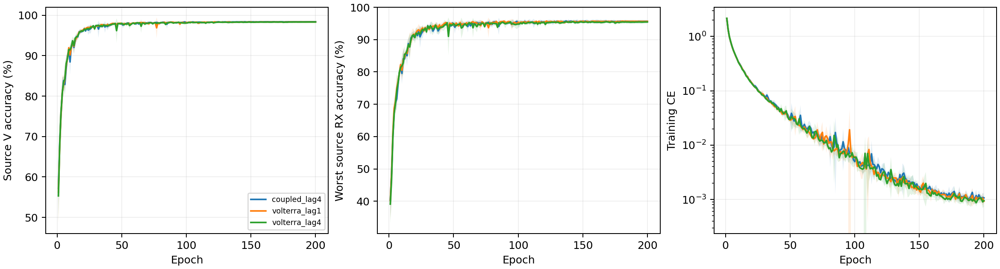

# CVS 复数Volterra延迟相位记忆：完整源实验报告

8 个新 scratch 模型完成 E200×50；完整核对 80000 步、1600 轮、详细文本与紧凑 epoch JSONL/CSV。实际为普通 CE、无增强、无域骨干、无权重继承，原 L6300/V27000、U56700 unused；全部新模型采用固定完整 FP32。当前四份coupled_lag4控制完整源曲线与实时核实终值一致。

固定性能优先源规则选择 `coupled_lag4`。当前源赢家保留，未选Volterra候选不读query；默认保留已核实历史clean，不重跑历史。

| 候选 | 四seed源V（%） | 最差源RX（%） | 固定性能分数（%） | 参数 |
|---|---:|---:|---:|---:|
| coupled_lag4 | 98.3907 | 95.6667 | 97.0287 | 202553 |
| volterra_lag1 | 98.3333 | 95.6389 | 96.9861 | 202553 |
| volterra_lag4 | 98.3204 | 95.4491 | 96.8847 | 202553 |

四 seed mean(0.5V+0.5最差源RX)最高优先；完全并列后才比较V、最差RX和成本。物理误差不参与选模，最佳轮只作诊断，所有选模使用E200。

| 模型 | seed | E200 V（%） | E200 最差RX（%） | 末轮CE | 最佳V（%） | 最佳轮（未选） |
|---|---:|---:|---:|---:|---:|---:|
| coupled_lag4 | 2026092701 | 98.5630 | 95.9259 | 0.000920 | 98.5778 | 146 |
| coupled_lag4 | 2026092702 | 98.4667 | 96.0000 | 0.001384 | 98.5037 | 146 |
| coupled_lag4 | 2026092703 | 98.3444 | 95.6296 | 0.000937 | 98.3889 | 145 |
| coupled_lag4 | 2026092704 | 98.1889 | 95.1111 | 0.001036 | 98.2185 | 98 |
| volterra_lag1 | 2026092701 | 98.4259 | 95.7037 | 0.000935 | 98.4667 | 187 |
| volterra_lag4 | 2026092701 | 98.4296 | 95.6296 | 0.000836 | 98.4593 | 107 |
| volterra_lag1 | 2026092702 | 98.4111 | 95.9630 | 0.001000 | 98.4593 | 161 |
| volterra_lag4 | 2026092702 | 98.3481 | 95.7407 | 0.001276 | 98.3889 | 158 |
| volterra_lag1 | 2026092703 | 98.2630 | 95.5000 | 0.000837 | 98.3037 | 122 |
| volterra_lag4 | 2026092703 | 98.3556 | 95.6111 | 0.000803 | 98.3704 | 112 |
| volterra_lag1 | 2026092704 | 98.2333 | 95.3889 | 0.000935 | 98.2815 | 151 |
| volterra_lag4 | 2026092704 | 98.1481 | 94.8148 | 0.000889 | 98.1963 | 140 |

四seed样本SD阴影覆盖全部200轮。[2400条曲线](evidence/source_curves.csv)、[1600轮同步测量](evidence/source_volterra_by_epoch.csv)、[全部720个源单元](evidence/source_all720_cells.csv)、[同seed源差分](evidence/source_paired_control.csv)。源RX是源验证，不称未知RX测试。

## 复数Volterra输入的实际执行

在 `t=n-m` 保留12项：`z`、`(zp+C)/2`、`(zp²+Cp)/2`，其中 `p=(P[t]+P[t-4])/8`、`C=z[t-l]²conj(z[t-2l])/4`；m0至3，l固定1或4。输入含不同延迟的复数相位交互，仍保留原四段位置功率读出、深宽和202553参数。同seed初始state与coupled_lag4控制逐项相同。共同相位charge1；输入lift对仿射相位协变由l+l-2l=0推出，整网不宣称CFO不变。新增输入线性空间的交互不证明旧全网无法近似它们。

全部1600轮源末batch和8个冻结公共输入均测量实际behavior.0.conv输入，共1600+8条；三阶/五阶相对变化的分母是coupled_lag4输入项L2范数clamp至1e-12。它是输入变化，不是恢复TX器件参数，也不参与候选排序。

|模型|seed|实际phase lag|固定envelope lag|复数项数|公式最大误差|三阶相对变化均值|五阶相对变化均值|
|---|---:|---:|---:|---:|---:|---:|---:|
|volterra_lag1|2026092701|1|4|12|0|0.568011|0.495132|
|volterra_lag4|2026092701|4|4|12|0|0.708481|0.674746|
|volterra_lag1|2026092702|1|4|12|0|0.565181|0.493021|
|volterra_lag4|2026092702|4|4|12|0|0.707294|0.675793|
|volterra_lag1|2026092703|1|4|12|0|0.566266|0.493971|
|volterra_lag4|2026092703|4|4|12|0|0.721655|0.69005|
|volterra_lag1|2026092704|1|4|12|0|0.559111|0.485265|
|volterra_lag4|2026092704|4|4|12|0|0.718022|0.689529|

[全部1600条源输入测量](evidence/source_volterra_input_all1600.csv) · [8条公共输入测量](evidence/source_public_volterra_input_all8.csv)。40ns/160ns只是25MHz下的设计phase lag，最大新增历史2l为80ns/320ns；固定envelope lag4。未测量真实器件记忆；received相位交互同时包含RX、channel和noise影响，不等于完整Volterra、DPD或PA辨识。固定半混合可能削弱有用输入，负结果保留。

## 整体物理性质与边界

六个复数时间/行为block使用跨通道/时间共享的包内RMS分母，归一化本身保留相对通道能量；学习尺度与径向门可以改变比例。两个候选均raw received输入、固定alpha0、不校正CFO。重复相关仅作received相对频率诊断，lag20/window80:160，主值±625kHz、歧义1.25MHz。不宣称整网频偏/RX/LTI不变、唯一TX参数或TX/RX因果分离。

冻结公共链每模型5TX×6RX，检查公共相位及±80kHz仿射相位。全8权重最大公共相位logit误差1.7166138e-05，最大仿射logit误差29.663557；坐标逐点重建最大误差0。常相位容差1e-3只报告，不是选模或停机门槛；附加频偏响应不称不变性误差。

| 模型 | seed | 相位rad | 附加相对CFO Hz | 整网logit响应 | 单位嵌入距离 | 主值跨界数 | 有效相关数 |
|---|---:|---:|---:|---:|---:|---:|---:|
| volterra_lag1 | 2026092701 | 0.37 | 0.0 | 1.4252961e-05 | 1.90843e-06 | 0 | 30 |
| volterra_lag1 | 2026092701 | -1.2 | 80000.0 | 4.4768729 | 0.67031157 | 0 | 30 |
| volterra_lag1 | 2026092701 | 2.9 | -80000.0 | 26.196875 | 1.4826876 | 0 | 30 |
| volterra_lag4 | 2026092701 | 0.37 | 0.0 | 1.335144e-05 | 1.6068944e-06 | 0 | 30 |
| volterra_lag4 | 2026092701 | -1.2 | 80000.0 | 5.3315358 | 0.64732069 | 0 | 30 |
| volterra_lag4 | 2026092701 | 2.9 | -80000.0 | 28.89889 | 1.572564 | 0 | 30 |
| volterra_lag1 | 2026092702 | 0.37 | 0.0 | 1.2397766e-05 | 1.2297872e-06 | 0 | 30 |
| volterra_lag1 | 2026092702 | -1.2 | 80000.0 | 10.71979 | 0.96644998 | 0 | 30 |
| volterra_lag1 | 2026092702 | 2.9 | -80000.0 | 24.932068 | 1.3164637 | 0 | 30 |
| volterra_lag4 | 2026092702 | 0.37 | 0.0 | 1.7166138e-05 | 1.4994127e-06 | 0 | 30 |
| volterra_lag4 | 2026092702 | -1.2 | 80000.0 | 9.0944004 | 0.85413963 | 0 | 30 |
| volterra_lag4 | 2026092702 | 2.9 | -80000.0 | 26.129486 | 1.4117273 | 0 | 30 |
| volterra_lag1 | 2026092703 | 0.37 | 0.0 | 1.1920929e-05 | 1.4455251e-06 | 0 | 30 |
| volterra_lag1 | 2026092703 | -1.2 | 80000.0 | 6.3253765 | 0.71223748 | 0 | 30 |
| volterra_lag1 | 2026092703 | 2.9 | -80000.0 | 26.409048 | 1.4999011 | 0 | 30 |
| volterra_lag4 | 2026092703 | 0.37 | 0.0 | 1.2397766e-05 | 1.6278957e-06 | 0 | 30 |
| volterra_lag4 | 2026092703 | -1.2 | 80000.0 | 7.9088926 | 0.746158 | 0 | 30 |
| volterra_lag4 | 2026092703 | 2.9 | -80000.0 | 29.663557 | 1.519269 | 0 | 30 |
| volterra_lag1 | 2026092704 | 0.37 | 0.0 | 1.5616417e-05 | 1.2320221e-06 | 0 | 30 |
| volterra_lag1 | 2026092704 | -1.2 | 80000.0 | 3.6909337 | 0.62236166 | 0 | 30 |
| volterra_lag1 | 2026092704 | 2.9 | -80000.0 | 23.916317 | 1.4758096 | 0 | 30 |
| volterra_lag4 | 2026092704 | 0.37 | 0.0 | 1.0251999e-05 | 1.0724075e-06 | 0 | 30 |
| volterra_lag4 | 2026092704 | -1.2 | 80000.0 | 2.8014882 | 0.59448665 | 0 | 30 |
| volterra_lag4 | 2026092704 | 2.9 | -80000.0 | 23.479572 | 1.3827478 | 0 | 30 |

源V同步统计是27000包/90单元全部覆盖，估计均为received相对CFO；没有真频偏标签，不能把偏差称为晶振测量误差。

| 模型 | seed | 相对CFO范围 Hz | 相干度均值 | fallback比例 | TX中心间平方距离 | 同TX跨RX中心偏移 |
|---|---:|---:|---:|---:|---:|---:|
| volterra_lag1 | 2026092701 | -621967.875 至 622686.000 | 0.943506 | 0 | 1.00023 | 0.120588 |
| volterra_lag4 | 2026092701 | -621967.875 至 622686.000 | 0.943506 | 0 | 1.03263 | 0.125117 |
| volterra_lag1 | 2026092702 | -621967.875 至 622686.000 | 0.943506 | 0 | 1.09261 | 0.142834 |
| volterra_lag4 | 2026092702 | -621967.875 至 622686.000 | 0.943506 | 0 | 1.08852 | 0.143866 |
| volterra_lag1 | 2026092703 | -621967.875 至 622686.000 | 0.943506 | 0 | 0.997392 | 0.13354 |
| volterra_lag4 | 2026092703 | -621967.875 至 622686.000 | 0.943506 | 0 | 1.02557 | 0.126252 |
| volterra_lag1 | 2026092704 | -621967.875 至 622686.000 | 0.943506 | 0 | 1.14874 | 0.114761 |
| volterra_lag4 | 2026092704 | -621967.875 至 622686.000 | 0.943506 | 0 | 1.08181 | 0.116975 |

## 实际共享归一化与固定校正

[9600条源末batch测量](evidence/source_energy_normalization_all9600.csv)覆盖1600轮×6block，[48条冻结公共测量](evidence/source_public_normalization_all48.csv)覆盖8模型×6block。测量基于实际conv输出及共享分母，只比较归一化前后的相对通道能量；学习尺度和径向门不在该比值守恒声明内。测量误差仅报告，不参与选模。

[1600轮固定校正执行](evidence/source_alignment_optimization.csv)与完整80000步核对；两版本均无学习校正参数，相关梯度N/A。

| 模型 | seed | 最终alpha | 200轮校正梯度 | 残余频率公式最大误差Hz | 有效公式包数 |
|---|---:|---:|---:|---:|---:|
| volterra_lag1 | 2026092701 | 0 | N/A | 0.0 | 27000 |
| volterra_lag4 | 2026092701 | 0 | N/A | 0.0 | 27000 |
| volterra_lag1 | 2026092702 | 0 | N/A | 0.0 | 27000 |
| volterra_lag4 | 2026092702 | 0 | N/A | 0.0 | 27000 |
| volterra_lag1 | 2026092703 | 0 | N/A | 0.0 | 27000 |
| volterra_lag4 | 2026092703 | 0 | N/A | 0.0 | 27000 |
| volterra_lag1 | 2026092704 | 0 | N/A | 0.0 | 27000 |
| volterra_lag4 | 2026092704 | 0 | N/A | 0.0 | 27000 |

[部分波形协变与整网响应](evidence/source_affine_phase_audit.csv)逐行列出有效包数、主值跨界、波形误差与logit响应，两种误差含义不同。物理干预采用冻结公共合成波形，不是训练增强，也不涉及真实query。

TX/RX 镜像及三阶相同波形反例保留。LTI/RX影响不承诺消除，公共合成链不是精确WiSig均衡器、真实硬件采集或完整瞬态/噪声仿真。源嵌入几何只说明关联，不证明TX/RX因果分离。[全部240个公共组合](evidence/source_physics_cascade.csv)、[32个孤立TX变化](evidence/source_isolated_TX.csv)。

## 实测成本

| 模型 | 参数 | 常驻模型bytes | Conv/Linear MAC/包 | batch1推理ms均值 | batch128训练ms均值 | 源训练峰值bytes最大 |
|---|---:|---:|---:|---:|---:|---:|
| coupled_lag4 | 202553 | 810844 | 7199008 | 7.0622 | 41.0888 | 163559936 |
| volterra_lag1 | 202553 | 810844 | 7199008 | 7.3513 | 37.9885 | 163559936 |
| volterra_lag4 | 202553 | 810844 | 7199008 | 7.9134 | 43.2047 | 163559936 |

RTX3090/Torch2.1/FP32；两个新候选和四份coupled_lag4控制均采用显式完整FP32。三候选具有相同核心、深宽、原读出和202553参数。新候选在行为输入以固定半权重混合lag4包络项和延迟复数共轭相位项，raw/alpha0；零新增参数。MAC相同不表示总运算量相同。相对原residual_fusion164225参数不是等参数单因子对照。MAC仅计Conv/Linear/矩阵乘，不计FFT/RMS/复数逐元素乘积/相关/atan2，实测延时与显存包括全部执行。副本profile不更新正式模型。并发条件可能影响计时差；星载/传输/SFT成本N/A。[逐seed完整资源](evidence/source_resources.csv)。

当前源赢家选中，按预登记规则保留其已核实历史 clean；本轮两个未选新候选的测试记 N/A，没有新增 query。不宣称识别优势或总体目标完成。历史clean代理口径、无LEO/SFT/新增类；D92三阶段N/A。目标成绩不反馈结构、超参数、重排或选择性重跑，负结果保留。

[前瞻设计](../../../docs/CVS_VOLTERRA_PHASE_MEMORY_20261002.md) · [全量日志审计](evidence/source_completion_validation.json) · [源选择](evidence/source_selection.json) · [独立分析](evidence/source_analysis_validation.json)。

实际源终态 VERIFIED：dispatcher 与8个worker均自然退出，8行各200轮/10000步。源运行commit `ed6bdf431c4bad584fef774ea12ff23e9d20167a`。[终态证据](evidence/final_source_readback.json)。固定源规则选中 `coupled_lag4`；保留已有源控制，两个未选新候选的clean均为N/A，不追加query；既有控制clean已完成证据见前一轮报告。目标仍未证明完成。

## 保留控制的默认测试收尾

已按冻结规则保留 `coupled_lag4`；独立远端读回四份既有clean预测的完整标记、来源、配置及文件存在性，与原28行/224条评分完成标记一致。此核对不读取目标分数、IQ、truth、预测数组或模型权重。本轮新增clean预测0份，两个未选Volterra候选测试均N/A；不重跑历史控制。[保留控制证据](evidence/retained_control_clean_readback.json) · [既有clean报告](../20261002-phase1-cvs-coupled-clean-manysig-m28-r01/report.md) · [本轮判定](evidence/iteration_verdict.json)。

状态ANALYZED／VERIFIED，本轮源实验及规定收尾完成，整体性能与真正RFF physics-aware目标仍未证明。全部负结果、源权重和日志保留。
