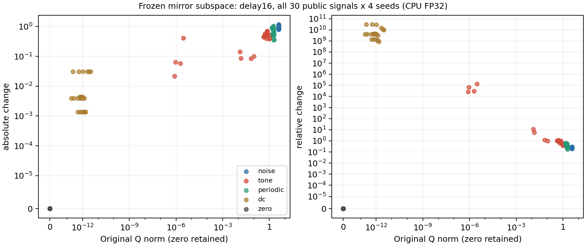

# CVS镜像关系：冻结公开信号机制分解

**诊断已完成，未产生新的识别性能或论文完成结论。** 8份原E200权重、每模型30个公开信号、3种固定FIR延迟和2种诊断精度全部保留。独立NumPy复算1440条样本记录及44640条频对记录；没有源IQ、query、训练或新选模。

先前delay16的大相对距离主要集中于低范数的纯音记录，而非所有输入普遍失稳。下表为子空间分支delay16结果，24条记录/组（4个模型seed×6个固定信号）的描述均值。比值先逐样本计算再平均，不能用表中两个均值相除代替。

|算术|信号组|原Q范数|绝对变化|相对变化|整网单位表征距离（FP32）|
|---|---|---:|---:|---:|---:|
|fp32|noise|3.937|0.956497|0.242951|0.231227|
|fp32|tone|0.478052|0.399055|10926.1|0.13765|
|fp32|periodic|1.79263|0.714328|0.405026|0.14906|
|fp32|dc|1.02383e-12|0.0100418|7.57007e+09|0.740298|
|fp32|zero|0|0|0|0|
|fp64|noise|3.937|0.956497|0.242951|0.231227|
|fp64|tone|0.478052|0.399055|10925.3|0.13765|
|fp64|periodic|1.79263|0.714329|0.405026|0.14906|
|fp64|dc|4.89183e-30|0.0100418|1.00418e+10|0.740298|
|fp64|zero|0|0|0|0|

最大纯音比值来自seed 2026092702、公开packet 11：原Q范数3.00631e-06，绝对变化0.409135，相对变化136092，整网单位表征距离0.198435。分子并非零，说明此处也存在实际表示变化；大比值主要受小分母放大，不能据此声称输出爆炸。

能量与子空间全部频对Q均满足各自原理论范数界。DC组在FP64下原Q近零而改变后非零，进一步说明用近零表示作为相对误差分母并不可靠；零信号组前后都为零，没有剔除。FP64并未消除纯音组的大比值，因此不能把问题归结为FP32舍入，也不能用改训练精度作为优化结果。

图使用对称对数坐标，保留0；所有120条CPU FP32样本都绘出，重合点可能重叠。表和图仅描述固定合成信号，不能推断真实设备分类性能。

当前FIR实现将包前历史设为零。delay16时，前16个接收位置缺少延迟支路的历史输入；64点、hop32的STFT首帧覆盖这段瞬态，后续帧起点至少为32。全包RMS归一化还会作用于所有位置。因而该诊断混合了有限包启动边界、窗口谱泄漏与算子对多径的响应，不能直接称为稳态信道不变性测试。这个边界由代码确定，本轮尚未用连续前历史的配对信号分离其贡献。

FP64使用同一组已生成的FP32输入和同一份学习权重的高精度副本，只改变诊断计算。CPU Torch2.10与原GPU Torch2.1记录分别保留；整网embedding仅以CPU FP32复算，不能把表中重复的FP32距离误称为FP64整网结果。

下一步应先进行合法源V上的固定模型反事实，测量关系分支实际影响了哪些TX/RX/day及分类间隔，再检查连续前历史下的公开FIR算子。只有这两类证据支持时再确定新结构。当前不支持继续增强硬子空间不变性，也未证明“它删掉了身份信息”这一因果解释；本轮没有真实身份标签或互信息估计。

[所有样本](evidence/public_packets.csv) · [全部频对压缩CSV](evidence/public_frequency_pairs.csv.gz) · [分组汇总](evidence/public_summary.csv) · [CPU与原GPU对照](evidence/cpu_gpu_comparison.csv) · [独立复算](evidence/analysis_validation.json)。原始张量、权重及未压缩CSV按[产物清单](evidence/artifact_manifest.json)保留。

初次r01在模型加载前因训练契约合法扩展被整JSON相等检查误报而停止；产物保留。r02逐项核对原始物理字段及6个已知扩展，22项本地检查及独立定点审查通过。8模型计算前后状态完全一致。
