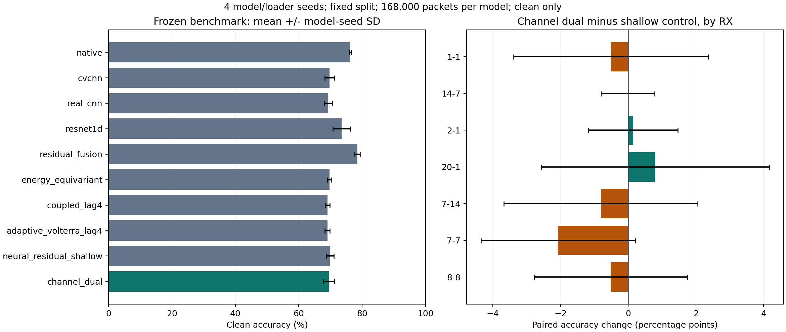

# CVS 信道与非线性运算次序：独立 clean 结果

源规则选中 `channel_dual`。四 seed 准确率为 69.4347% ± 1.7912%，较同核心浅层神经残差控制 -0.4220 个百分点。结论：`NO_MEAN_IMPROVEMENT_ON_FIXED_CLEAN_BENCHMARK`。

本候选实际启用补偿分支：`True`；运算次序差分支：`False`。归因限于该实际结构，未选候选不访问 query。

四 seed 使用同一物理划分，覆盖模型与加载器随机性，不能替代独立数据域重复。本轮均值和配对差值仅描述该固定基准。下表保留所有负差值，不据此调整候选、超参数或选择性重跑。

|模型|准确率/% ± seed SD|Macro-F1/% ± seed SD|
|---|---:|---:|
|native|76.2272 ± 0.3291|75.9075 ± 0.3709|
|cvcnn|69.7131 ± 1.4695|69.5270 ± 1.3587|
|real_cnn|69.3112 ± 1.2009|68.9914 ± 0.9864|
|resnet1d|73.4826 ± 2.7392|73.1214 ± 2.5849|
|residual_fusion|78.4543 ± 0.8436|78.2067 ± 0.9517|
|energy_equivariant|69.6699 ± 0.6817|68.6784 ± 0.7664|
|coupled_lag4|69.0548 ± 0.7297|67.6476 ± 1.0523|
|adaptive_volterra_lag4|69.0158 ± 0.7715|67.6942 ± 1.0054|
|neural_residual_shallow|69.8567 ± 1.1881|68.2451 ± 1.3308|
|channel_dual|69.4347 ± 1.7912|67.6452 ± 2.2395|

|对照|配对均值 ± SD/百分点|正差值 seed|四 seed 差分/百分点|
|---|---:|---:|---|
|native|-6.7926 ± 1.7917|0/4|-5.1452, -8.7190, -7.9113, -5.3946|
|cvcnn|-0.2784 ± 3.0797|2/4|+2.5720, -4.5232, -0.3994, +1.2369|
|real_cnn|+0.1235 ± 2.3459|2/4|+3.1411, -2.5214, -0.4744, +0.3488|
|resnet1d|-4.0479 ± 3.7373|0/4|-0.6262, -9.1762, -2.0905, -4.2988|
|residual_fusion|-9.0196 ± 1.6961|0/4|-7.7536, -10.2119, -10.7304, -7.3827|
|energy_equivariant|-0.2353 ± 2.1431|2/4|+1.4298, -3.2863, -0.1494, +1.0649|
|coupled_lag4|+0.3799 ± 1.3965|2/4|+2.0732, -1.0518, -0.4214, +0.9196|
|adaptive_volterra_lag4|+0.4189 ± 1.4976|2/4|+2.1601, -0.8619, -0.7988, +1.1762|
|neural_residual_shallow|-0.4220 ± 0.7680|1/4|-0.1839, -1.0351, -1.0304, +0.5613|

|RX（每 seed 24,000 包）|浅层控制/%|新候选/% ± SD|差值/百分点|
|---|---:|---:|---:|
|1-1|68.1875|67.6771 ± 2.5381|-0.5104|
|14-7|55.8406|55.8396 ± 2.0975|-0.0010|
|2-1|76.3292|76.4792 ± 3.1129|+0.1500|
|20-1|54.6188|55.4187 ± 2.4852|+0.8000|
|7-14|79.9708|79.1646 ± 4.9927|-0.8063|
|7-7|78.9802|76.9073 ± 5.0451|-2.0729|
|8-8|75.0698|74.5563 ± 3.6034|-0.5135|

|TX（每 seed 28,000 包）|浅层控制/%|新候选/% ± SD|
|---|---:|---:|
|14-10|92.3268|92.0134 ± 5.0006|
|14-7|25.2027|25.2464 ± 2.5486|
|20-15|51.3205|48.6116 ± 8.5111|
|20-19|56.1473|56.5330 ± 2.6531|
|6-15|96.2884|96.5607 ± 1.0604|
|8-20|97.8545|97.6429 ± 1.3819|

保持原物理数据、单一 CE、E200×50、batch 128 和完整 FP32；从零训练，源域固定规则先选择后冻结。4 个新预测与 36 个旧冻结预测统一为 40 行，逐包面对全部 6 类。全部预测固定后独立 truth-last 评分；320 个混淆矩阵、80 组汇总、72 组配对和 RX 分解复算通过。原 288 条控制指标逐字段完全一致。

实际可训练参数 247387；常驻模型状态 990180 bytes。batch 1 推理均值 13.5561 ms，batch 128 训练 62.3477 ms；完整 168,000 query 预测均值 17.263 s。逐 seed 硬件、训练/预测峰值显存和 MAC 口径见资源表；并发会影响耗时。CPU 峰值和新增星载传输未测量，记 N/A。

该固定 clean 基准历史已暴露，不称首次盲测。无 LEO、support 适应、新增类、unknown 或在轨结果；D92 三阶段与 K×新增类表为 N/A。补偿器是单一 CE 学习的受限判别式变换，不等于真实信道逆；运算次序差不等于纯 TX 硬件信息。跨接收机 clean 结果不能单独证明信道扰动鲁棒性、唯一 TX 硬件恢复或任意 RX/信道不变性。

[逐行评分](evidence/clean_scored_results.json) · [全部 RX 汇总](evidence/clean_summary.csv) · [全部 TX 汇总](evidence/per_transmitter_summary.csv) · [配对差值](evidence/clean_paired.csv) · [资源](evidence/resource_summary.json) · [独立复算](evidence/analysis_validation.json)

图中误差线是4个模型seed的样本标准差，不是置信区间。阶段一的实现与实验已完成，但本轮未取得识别提升，不能据此宣称信道鲁棒架构的论文核心贡献已经成立。

[源训练与全部候选](../20261003-phase1-cvs-channel-order-identity-manysig-m16-r01/report.md) · [源机制分析](../20261003-phase1-cvs-channel-order-identity-manysig-m16-r01/mechanism_report.md) · [可导出PDF图](evidence/clean_comparison.pdf)。
