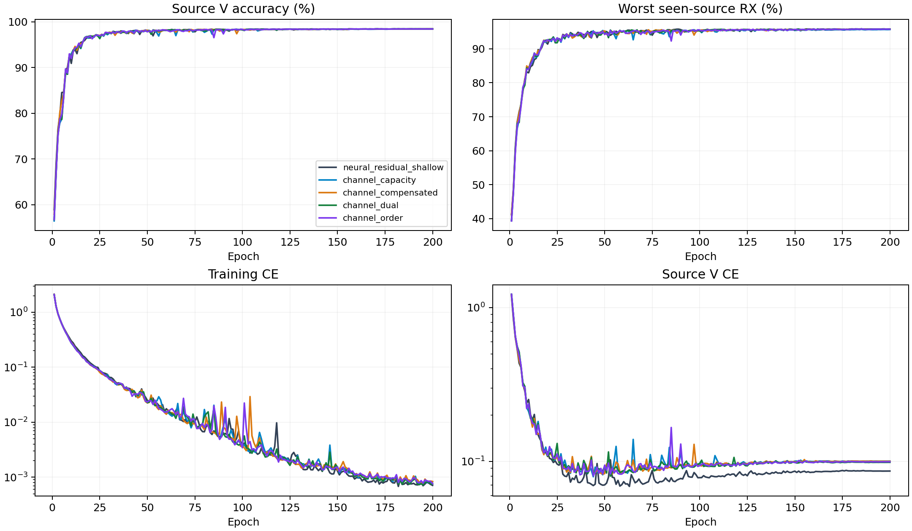

# CVS信道补偿与顺序差值：完整源训练结果

16个scratch模型完成200轮×50步。源选择由完整20记录独立重算，训练策略和单一CE保持不变。以下是源验证指标，不是测试结果。

|结构|源V/%|最差源RX/%|固定源分数/%|相对控制/百分点±配对SD|正提升seed|参数|
|---|---:|---:|---:|---:|---:|---:|
|neural_residual_shallow|98.4426|95.8009|97.1218|+0.0000±0.0000|0/4|220987|
|channel_capacity|98.3954|95.6852|97.0403|-0.0815±0.0890|0/4|247451|
|channel_compensated|98.4148|95.8241|97.1194|-0.0023±0.0502|2/4|234587|
|channel_dual|98.4269|95.8333|97.1301|+0.0083±0.0488|2/4|247387|
|channel_order|98.4148|95.7778|97.0963|-0.0255±0.0704|2/4|249947|

固定规则选中`channel_dual`。该候选4模型已完成预登记clean测试，结果见下方收尾记录。

|结构|batch1推理/ms|batch128训练/ms|
|---|---:|---:|
|neural_residual_shallow|9.8971|51.4826|
|channel_capacity|11.8754|56.3286|
|channel_compensated|12.6479|56.0110|
|channel_dual|13.5561|62.3477|
|channel_order|15.2996|69.8064|

资源在实际RTX3090/FP32环境测量，并行运行可能影响时间。MAC计数包含实际aten卷积（包括功能式复卷积）及矩阵乘法，未计FFT、归一化、门控、池化、动态FIR的unfold及逐元素乘加；不是总FLOPs。实际训练与推理耗时包含全部算子。峰值内存与常驻状态保留逐seed值。新模块同样只由CE更新；零出口的首步内部零梯度是初始化性质，不能与训练后失活混同。

源V使用已见源RX；四seed不是独立数据集。新增容量是否提高独立clean识别必须由冻结测试证明。没有追加损失、增强、重加权、采样策略、teacher或目标适应。D92的适应三阶段/K×新增类为N/A。

[逐seed](evidence/source_final.csv) · [完整曲线](evidence/source_curves.csv) · [实际新增分支输出](evidence/channel_outputs.csv) · [全部TX/RX/day单元](evidence/source_cells.csv) · [资源](evidence/source_resources.csv) · [160000步审计](evidence/source_completion_validation.json) · [原设计](../../../docs/CVS_CHANNEL_ORDER_EXPERIMENT_20261003.md)。

## 本轮收尾

状态ANALYZED。16个模型全部E200，源审计、冻结、40行clean独立评分均已完成。入选双路clean准确率69.4347%±1.7912%，比同核心浅层控制低0.4220个百分点，4个seed中仅1个为正。320条评分、80组汇总、72组配对复算通过，旧288条评分不变。本轮实现和实验闭环完成，识别性能提升及论文核心机制目标尚未达成；不以源分数的0.0083个百分点领先替代独立测试收益。

[完整clean报告](../20261003-phase1-cvs-channel-order-clean-manysig-m40-r01/report.md) · [源机制分析](mechanism_report.md)。所有候选及负结果保留，未选结构未访问query。
