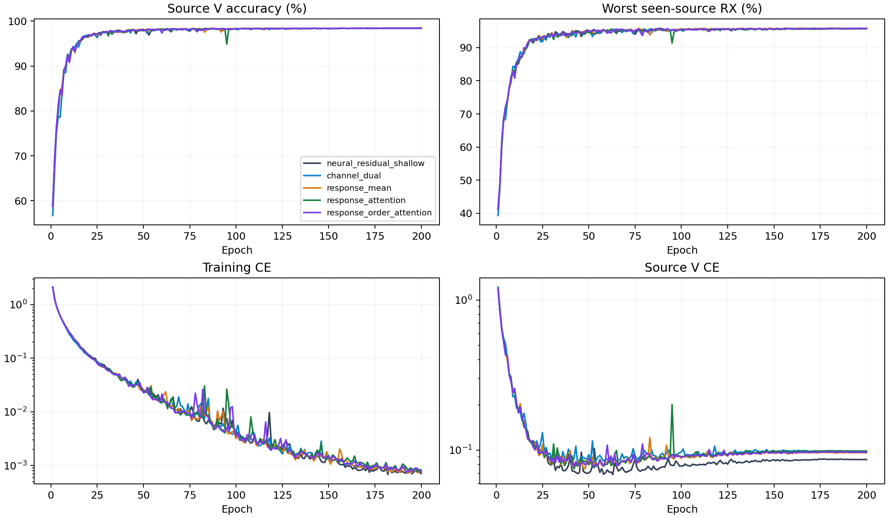

# CVS显式补偿响应：完整源训练结果

12个scratch模型完成200轮×50步。源选择由完整20记录独立重算，训练策略和单一CE保持不变。以下是源验证指标，不是测试结果。

|结构|源V/%|最差源RX/%|固定源分数/%|相对双路控制/百分点±配对SD|正提升seed|参数|
|---|---:|---:|---:|---:|---:|---:|
|neural_residual_shallow|98.4426|95.8009|97.1218|-0.0083±0.0488|1/4|220987|
|channel_dual|98.4269|95.8333|97.1301|+0.0000±0.0000|0/4|247387|
|response_mean|98.4380|95.8102|97.1241|-0.0060±0.1105|2/4|237147|
|response_attention|98.3991|95.6898|97.0444|-0.0856±0.0736|1/4|237359|
|response_order_attention|98.4130|95.7639|97.0884|-0.0417±0.0405|1/4|238383|

固定规则选中`channel_dual`。保留既有控制，未选候选不访问query，复用已有控制clean完成证据。

|结构|batch1推理/ms|batch128训练/ms|
|---|---:|---:|
|neural_residual_shallow|9.8971|51.4826|
|channel_dual|13.5561|62.3477|
|response_mean|12.8485|57.4377|
|response_attention|13.0363|59.9743|
|response_order_attention|13.5211|66.3668|

资源在实际RTX3090/FP32环境测量，并行运行可能影响时间。MAC计数包含实际aten卷积（包括功能式复卷积）及矩阵乘法，未计FFT、归一化、门控、池化、动态FIR的unfold及逐元素乘加；不是总FLOPs。实际训练与推理耗时包含全部算子。峰值内存与常驻状态保留逐seed值。新模块同样只由CE更新；零出口的首步内部零梯度是初始化性质，不能与训练后失活混同。

源V使用已见源RX；四seed不是独立数据集。新增容量是否提高独立clean识别必须由冻结测试证明。没有追加损失、增强、重加权、采样策略、teacher或目标适应。D92的适应三阶段/K×新增类为N/A。

[逐seed](evidence/source_final.csv) · [完整曲线](evidence/source_curves.csv) · [实际新增分支输出](evidence/response_outputs.csv) · [全部TX/RX/day单元](evidence/source_cells.csv) · [资源](evidence/source_resources.csv) · [120000步审计](evidence/source_completion_validation.json) · [原设计](../../../docs/CVS_CHANNEL_RESPONSE_DESIGN_20261003.md)。

## 本轮收尾与机制结论

状态ANALYZED，执行与登记收尾完成；性能和论文目标未达成。固定源规则保留channel_dual，三个response候选均未晋级，未读取其目标query或评分。已重新核实同四个source输出对应的历史clean预测及独立评分，320条指标、80组汇总和72组配对均未变化；未重训、重测或新增预测。

所复用控制的历史clean准确率为69.4347%±1.7912个百分点（四model seed样本标准差）。这是原控制的既有结果，不是新response候选的测试结果，也未用于本轮结构、排名或超参数选择。

完整源V冻结诊断覆盖12模型、48条件、1296000次预测决定。关闭辅助支路的准确率下降依次为0.0574、0.0630、0.0713个百分点，三个结构均4/4seed为正；实际G恒等干预与支路关闭一致，完整V辅助输出严格归零。学习后的辅助/主干特征范数比约0.485、0.494、0.488，G引起的输入相对变化约0.105至0.112。新结构已解决“可绕过补偿的重复特征支路”这一机制问题，但没有由此证明整体识别提升。

均匀替代注意力的源贡献分别为0.0343和0.0194个百分点；order候选关闭D输入的贡献为0.0093个百分点。该结果不支持继续以“分支未激活、数值太小”为主要解释，也不能推导增大分支权重就能改善识别。下一步需要检验响应提供的判别信息及其与主干的关系，而非仅扩大幅度或增加模块。

这些是同一冻结模型上的依赖诊断，不能替代从零训练消融。新架构相对固定控制的四seed源分数没有提升；未选候选的目标指标为N/A，当前不声称信道不变、TX/RX解耦或达到独立论文的性能要求。

[测试复用核对](evidence/reused_control_clean_validation.json) · [本轮结论](evidence/iteration_verdict.json) · [完整源域诊断](../20261003-diagnostic-cvs-response-attribution-source-manysig-m12-r01/report.md)。

## 2026-10-03完整测试补齐

本批全部12个固定E200模型已纳入[全量clean测试报告](../20261003-phase1-cvs-all-frozen-clean-backfill-manysig-m304-r01/report.md)，每模型168,000个测试样本；此前未晋级且未测试的候选也已补测，已有预测复用。304行预测固定后统一独立truth-last评分，完整分类决定复算通过。测试结果见汇总报告和逐seed/RX/TX表；历史源域选择记录保持原样。
