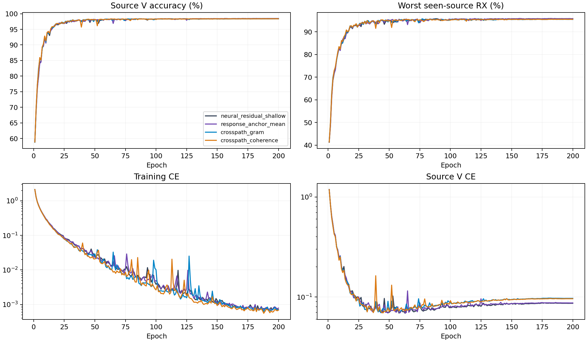

# CVS跨路径关系读出：完整源训练结果

**本轮实验与测试收尾已完成，新结构未提升性能，整体论文目标未达成。** 8份scratch E200训练、80000步日志审计和完整曲线分析完成。Gram与coherence的固定源分数分别为96.9111%和96.9491%，相对同主干Shallow下降0.2106±0.1123和0.1727±0.1513个百分点，均为0/4个seed胜出。配对SD描述固定数据划分下的模型seed差异，不是置信区间。源规则保留Anchor。

8个scratch模型完成200轮×50步。源选择由完整16记录独立重算，包含同主干shallow和当前源赢家Anchor；两种新结构均从scratch Shallow初始化，既有控制仅复用元数据。训练策略和单一CE保持不变。以下是源验证指标，不是测试结果。

|结构|源V/%|最差源RX/%|固定源分数/%|相对控制/百分点±配对SD|正提升seed|参数|
|---|---:|---:|---:|---:|---:|---:|
|neural_residual_shallow|98.4426|95.8009|97.1218|+0.0000±0.0000|0/4|220987|
|response_anchor_mean|98.4435|95.8194|97.1315|+0.0097±0.0234|2/4|237147|
|crosspath_gram|98.3546|95.4676|96.9111|-0.2106±0.1123|0/4|233275|
|crosspath_coherence|98.3750|95.5231|96.9491|-0.1727±0.1513|0/4|233275|

固定规则选中`response_anchor_mean`。保留既有控制，未选候选不访问query，复用已有控制clean完成证据。

|结构|batch1推理/ms|batch128训练/ms|
|---|---:|---:|
|neural_residual_shallow|9.8971|51.4826|
|response_anchor_mean|12.8663|58.7296|
|crosspath_gram|11.3522|52.5647|
|crosspath_coherence|11.1751|55.6323|

资源在实际RTX3090/FP32环境测量，并行运行可能影响时间。MAC计数包含实际aten卷积（包括功能式复卷积）及矩阵乘法，未计FFT、归一化、门控、池化和逐元素运算；不是总FLOPs。峰值内存与常驻状态保留逐seed值。新模块同样只由CE更新；零出口的首步内部零梯度是初始化性质，不能与训练后失活混同。

## 训练CE与源V CE

固定E200；表中为四个模型seed的均值±样本SD。CE差值先按同seed计算V CE−训练CE，再汇总；不是误差率差。训练CE是50个batch均值的等权平均（49×128+28样本），源V CE是全部27000个验证样本的均值；二者的数据、平均方式和train/eval模式不同。

|结构|E200训练CE|E200源V CE|E200 CE差值|后段训练CE变化|后段源V CE变化|后段CE差值变化|
|---|---:|---:|---:|---:|---:|---:|
|neural_residual_shallow|0.000711±0.000169|0.086423±0.003526|0.085711±0.003457|-0.000176±0.000098|0.000855±0.000636|0.001031±0.000697|
|response_anchor_mean|0.000785±0.000131|0.087126±0.003733|0.086341±0.003705|-0.000170±0.000050|0.000680±0.000165|0.000850±0.000125|
|crosspath_gram|0.000700±0.000073|0.096787±0.005724|0.096087±0.005744|-0.000189±0.000072|0.001193±0.000793|0.001382±0.000815|
|crosspath_coherence|0.000686±0.000155|0.095973±0.004665|0.095287±0.004553|-0.000153±0.000023|0.000859±0.000237|0.001012±0.000234|

后段变化固定定义为E176–200均值减E151–175均值，按seed配对后汇总；完整E1–200四seed均值/SD见[source_curve_summary.csv](evidence/source_curve_summary.csv)。这些窗口只描述曲线，不重新选择epoch，也不设鲁棒性门槛。

## 两种关系归一化的固定E200配对差异

以下均为crosspath_coherence−crosspath_gram，同seed配对，单位为百分点。

|指标|均值±配对SD|正差seed|零差seed|
|---|---:|---:|---:|
|score|+0.0380±0.0748|3/4|0/4|
|V|+0.0204±0.0064|4/4|0/4|
|worst_RX|+0.0556±0.1458|2/4|0/4|

四seed共用相同数据，只描述此次源训练差异；小幅均值变化不能单独支持稳定提升或独立clean提升。

## 已有关系分支遥测

下表只用E200最后一个训练batch的28个样本，关系分支指标按四seed汇总。输出变化是新增关系输出相对behavior skip输出的逐样本L2范数比均值。

|结构/分支|相对输出变化|16→320投影范数|384→16压缩范数|
|---|---:|---:|---:|
|crosspath_gram/crosspath.readout|0.054332±0.005189|3.994510±0.453982|4.437684±0.154406|
|crosspath_coherence/crosspath.readout|0.050525±0.005663|4.058616±0.477773|4.492370±0.109620|

两个权重范数均为Frobenius范数。出口384→16→320没有激活与bias；rank≤16仅是架构上界，当前未测量矩阵或特征的实际秩。

|结构|lag0关系范数|lag4关系范数|lag8关系范数|
|---|---:|---:|---:|
|crosspath_gram|0.212594±0.007180|0.209650±0.006942|0.223016±0.009986|
|crosspath_coherence|0.203348±0.007236|0.211938±0.009459|0.222473±0.007894|

各lag关系范数是归一化、除以8后的复关系统计Frobenius范数的逐样本均值；使用未经中心化的复交叉矩，不是中心化协方差。下表为各路径/lag中功率低于1e-6的测量比例。gram的分母按整条投影分支计算，coherence按投影channel计算，二者不能混合汇总。

|结构|time_lag0_floor_fraction|time_lag4_floor_fraction|time_lag8_floor_fraction|behavior_lag0_floor_fraction|behavior_lag4_floor_fraction|behavior_lag8_floor_fraction|
|---|---:|---:|---:|---:|---:|---:|
|crosspath_gram|0.000000±0.000000|0.000000±0.000000|0.000000±0.000000|0.000000±0.000000|0.000000±0.000000|0.000000±0.000000|
|crosspath_coherence|0.000000±0.000000|0.000000±0.000000|0.000000±0.000000|0.000000±0.000000|0.000000±0.000000|0.000000±0.000000|

这28个样本不能代表全源分布，也不能支持信道变化的因果结论。跨路径关系统计及其归一化不会直接证明发射机特异信息、物理信道移除或信道解耦。三个lag均以behavior位置8至63为共同窗口，对应time位置t−lag，每个lag使用56对特征。

|结构|全200轮梯度均值|E200梯度均值|E151–200梯度均值|
|---|---:|---:|---:|
|crosspath_gram|0.083202±0.018909|0.009436±0.002732|0.011036±0.001640|
|crosspath_coherence|0.081047±0.019507|0.008647±0.001316|0.010009±0.002011|

梯度使用每个新模型全部200条epoch记录，每条是50个已有step梯度范数的均值，覆盖整个新增关系分支的12288个参数。原collector另行审计每模型10000步；当前离线产物不含原始step数组，未计算step极值或分支内独立组件梯度。epoch均值的范围、零值计数和已有步数审计信息保留在逐seed表中；梯度非零仅表示CE更新经过这些参数。

[CE与后段逐seed](evidence/source_learning_by_seed.csv) · [关系配对逐seed](evidence/readout_pairwise_by_seed.csv) · [全部1600条关系梯度epoch均值](evidence/readout_gradient_epochs.csv) · [梯度逐seed摘要](evidence/readout_gradient_by_seed.csv) · [E200关系逐seed](evidence/readout_last_epoch.csv) · [完整分析与口径](evidence/source_learning_analysis.json)。

源V使用已见源RX；四seed不是独立数据集。新增容量是否提高独立clean识别必须由冻结测试证明。没有追加损失、增强、重加权、采样策略、teacher或目标适应。D92的适应三阶段/K×新增类为N/A。

[逐seed](evidence/source_final.csv) · [完整曲线](evidence/source_curves.csv) · [实际新增关系输出](evidence/readout_outputs.csv) · [全部TX/RX/day单元](evidence/source_cells.csv) · [资源](evidence/source_resources.csv) · [80000步审计](evidence/source_completion_validation.json)。

## 源产物终态核验

8份固定E200训练、80000步日志审计及完整曲线分析完成，全部训练进程和dispatcher已终止。源码版本`e136f7868e5ff2569d2a61578ea909a4b1d3daa0`，完整16源记录选择与实际远端冻结结果一致；源赢家为`response_anchor_mean`。当前测试收尾尚未完成，不把源验证指标当作泛化结果。

[源终态](evidence/source_terminal_readback.json) · [冻结核验](evidence/source_freeze_validation.json) · [架构与科学边界](../../../docs/CVS_CROSSPATH_RELATION_DESIGN_20261003.md)。

## 负结果解释与测试收尾

新分支持续收到CE梯度，E200最后28个训练样本上的关系出口相对skip约为5.43%和5.05%，因此不能把负结果直接解释为分支未执行；这些局部幅度也不能代表全源贡献。训练CE为0.000700和0.000686，与Shallow的0.000711接近，源V CE却从0.086423升至0.096787和0.095973。曲线与源准确率共同支持过拟合的描述，但没有识别信道/RX捷径这一因果机制。coherence比Gram平均高0.0380个百分点，仍未超过基准，不能据此宣称信道鲁棒。本轮只检验所实现的有限滞后跨路径关系结构，不能否定所有关系建模，也不能证明纯CE架构创新不可行。

未入选候选不访问query，条件48行clean实验未激活。独立读回既有44行clean状态、预测配置与provenance，352条评分完全未变；4个Anchor checkpoint与本次源选择逐seed对应。复用Anchor既有clean准确率69.9129%±1.2142%，不产生新的测试证据，也不把该分数记给本轮新结构。

[复用核验](evidence/retained_control_test_verification.json) · [既有完整clean报告](../20261003-phase1-cvs-response-fusion-clean-manysig-m44-r01/report.md) · [本轮判定](evidence/completion_verdict.json)。保留全部负结果；后续设计只依据源证据。
