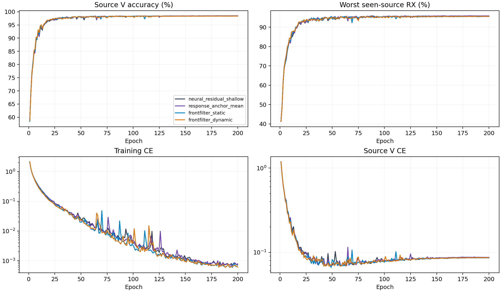

# CVS全主干前置滤波：完整源训练结果

**本轮实验与测试收尾完成；新结构未取代固定源控制，整体性能与论文目标仍未达成。** 8份从零训练的固定E200模型、80000步日志与720个全V前置滤波单元已核验。frontfilter_static源分数96.9435%，相对Shallow为-0.1782±0.1282个百分点，0/4个seed正提升。frontfilter_dynamic源分数96.9611%，相对Shallow为-0.1606±0.0715个百分点，0/4个seed正提升。固定源规则保留response_anchor_mean；四seed配对SD描述固定划分下模型随机性，不是置信区间。

8个scratch模型完成200轮×50步。源选择由完整16记录独立重算，包含同主干shallow和当前源赢家Anchor；两种新结构均从scratch Shallow初始化，既有控制仅复用元数据。三个原身份路径均接收G_x(x)，没有原输入旁路、额外辅助路径或滤波后单位RMS。训练策略和单一CE保持不变。以下是源验证指标，不是测试结果。

|结构|源V/%|最差源RX/%|固定源分数/%|相对控制/百分点±配对SD|正提升seed|参数|
|---|---:|---:|---:|---:|---:|---:|
|neural_residual_shallow|98.4426|95.8009|97.1218|+0.0000±0.0000|0/4|220987|
|response_anchor_mean|98.4435|95.8194|97.1315|+0.0097±0.0234|2/4|237147|
|frontfilter_static|98.3593|95.5278|96.9435|-0.1782±0.1282|0/4|221035|
|frontfilter_dynamic|98.3528|95.5694|96.9611|-0.1606±0.0715|0/4|221307|

固定规则选中`response_anchor_mean`。保留既有控制，未选候选不访问query，复用已有控制clean完成证据。

|结构|batch1推理/ms|batch128训练/ms|
|---|---:|---:|
|neural_residual_shallow|9.8971|51.4826|
|response_anchor_mean|12.8663|58.7296|
|frontfilter_static|10.1599|58.9119|
|frontfilter_dynamic|11.2428|64.2533|

资源在实际RTX3090/FP32环境测量，并行运行可能影响时间。MAC计数包含实际aten卷积（包括功能式复卷积）及矩阵乘法，未计FFT、归一化、门控、池化和逐元素运算；不是总FLOPs。峰值内存与常驻状态保留逐seed值。新模块同样只由CE更新；零出口的首步内部零梯度是初始化性质，不能与训练后失活混同。

## 训练CE与源V CE

固定E200；表中为四个模型seed的均值±样本SD。CE差值先按同seed计算V CE−训练CE，再汇总；不是误差率差。训练CE是50个batch均值的等权平均（49×128+28样本），源V CE是全部27000个验证样本的均值；二者的数据、平均方式和train/eval模式不同。

|结构|E200训练CE|E200源V CE|E200 CE差值|后段训练CE变化|后段源V CE变化|后段CE差值变化|
|---|---:|---:|---:|---:|---:|---:|
|neural_residual_shallow|0.000711±0.000169|0.086423±0.003526|0.085711±0.003457|-0.000176±0.000098|0.000855±0.000636|0.001031±0.000697|
|response_anchor_mean|0.000785±0.000131|0.087126±0.003733|0.086341±0.003705|-0.000170±0.000050|0.000680±0.000165|0.000850±0.000125|
|frontfilter_static|0.000614±0.000130|0.085884±0.005094|0.085269±0.005033|-0.000178±0.000036|0.000706±0.000506|0.000883±0.000517|
|frontfilter_dynamic|0.000613±0.000132|0.086267±0.001539|0.085654±0.001600|-0.000166±0.000067|0.000788±0.000062|0.000954±0.000059|

后段变化固定定义为E176–200均值减E151–175均值，按seed配对后汇总；完整E1–200四seed均值/SD见[source_curve_summary.csv](evidence/source_curve_summary.csv)。这些窗口只描述曲线，不重新选择epoch，也不设鲁棒性门槛。

## 静态与动态前置滤波的固定E200配对差异

以下均为frontfilter_dynamic−frontfilter_static，同seed配对，单位为百分点。static新增48个参数，dynamic新增320个参数，二者不是参数完全匹配的比较。

|指标|均值±配对SD|正差seed|零差seed|
|---|---:|---:|---:|
|score|+0.0176±0.1958|2/4|0/4|
|V|-0.0065±0.1104|2/4|0/4|
|worst_RX|+0.0417±0.2842|3/4|0/4|

四seed共用相同数据，只描述此次源训练差异；小幅均值变化不能单独支持稳定提升或独立clean提升。

## 已有前置滤波遥测

下表只用E200最后一个训练batch的28个样本，按四seed汇总。相对输入变化为||G_x(x)−x||/||x||，输入范数比为||G_x(x)||/||x||；后者只统计非零输入。表中最小/最大值先在各seed末批计算，再汇总四seed，不能解释为全源极值。

|结构|相对变化均值|相对变化最大值|范数比最小值|范数比最大值|
|---|---:|---:|---:|---:|
|frontfilter_static|0.133659±0.005977|0.141191±0.008336|1.115151±0.005878|1.131425±0.006314|
|frontfilter_dynamic|0.161700±0.013460|0.172931±0.013459|1.125517±0.020817|1.157777±0.022552|

L1均指复模L1。系数边界活跃比例是未约束系数L1大于1的包比例；basis边界活跃比例是原始basis L1大于1的基底比例。系数跨包方差使用population variance，再对实虚部与基底分量平均。static跨包共享系数，未测量项记N/A，各字段实测seed数保留在CSV。

|结构|coefficient_l1_mean|coefficient_l1_max|kernel_l1_mean|kernel_l1_max|basis_l1_max|
|---|---:|---:|---:|---:|---:|
|frontfilter_static|0.987524±0.024952|0.987524±0.024952|0.854610±0.063308|0.854610±0.063308|1.000000±0.000000|
|frontfilter_dynamic|0.998699±0.001399|1.000000±0.000000|0.980172±0.017942|0.982953±0.017895|1.000000±0.000000|

|结构|bound_active_fraction|basis_bound_active_fraction|coefficient_packet_variance|fixed_coefficient_delta_operator_bound_max|
|---|---:|---:|---:|---:|
|frontfilter_static|0.750000±0.500000|1.000000±0.000000|0.000000±0.000000|0.213653±0.015827|
|frontfilter_dynamic|0.901786±0.089286|1.000000±0.000000|0.000007±0.000003|0.245738±0.004474|

|结构|basis_gradient_norm|context_gradient_norm|exit_gradient_norm|
|---|---:|---:|---:|
|frontfilter_static|0.001053±0.000870|N/A|0.001476±0.001571|
|frontfilter_dynamic|0.001669±0.001976|0.001791±0.001402|0.001790±0.001402|

固定系数时线性算子的奇异值界为0.75至1.25；这不证明动态非线性映射可逆、物理信道恢复或TX/RX解耦。CFO与coherence诊断读取原输入x，不是G_x(x)，不能用来评价滤波后的补偿效果。这28个样本不能代表全源分布，也不能支持信道变化的因果结论。全部200轮末批遥测均保留；完整曲线不改变每个测量仅覆盖末批的范围。

|结构|全200轮梯度均值|E200梯度均值|E151–200梯度均值|
|---|---:|---:|---:|
|frontfilter_static|0.033180±0.005897|0.001401±0.000138|0.001988±0.000208|
|frontfilter_dynamic|0.047506±0.014373|0.002775±0.001144|0.003635±0.001061|

总体梯度使用每个新模型全部200条epoch记录，每条是50个已有step梯度范数的均值，分别覆盖static的48个或dynamic的320个新增参数。collector另行审计每模型10000步；当前离线产物不含原始step数组，未计算step极值。basis/context/exit组件梯度来自每轮最后一次CE backward，不能当作epoch均值；dynamic的exit属于context，不能相加当作独立梯度。static没有context，记N/A。梯度非零仅表示CE更新经过这些参数。

[CE与后段逐seed](evidence/source_learning_by_seed.csv) · [static/dynamic配对逐seed](evidence/frontfilter_pairwise_by_seed.csv) · [全部1600条梯度epoch均值](evidence/frontfilter_gradient_epochs.csv) · [梯度逐seed摘要](evidence/frontfilter_gradient_by_seed.csv) · [全部1600条末批遥测](evidence/frontfilter_output_epochs.csv) · [四seed遥测曲线](evidence/frontfilter_output_curve_summary.csv) · [E200逐seed](evidence/frontfilter_last_epoch.csv) · [完整分析与口径](evidence/source_learning_analysis.json)。

## 全部源V的前置滤波测量

每模型固定E200、完整27000包与90个TX/RX/day单元；输入变化和L1按样本数加权，先按seed汇总再计算四seed均值±样本SD。下表完整源V测量与前文训练末批遥测分开。

|结构|全V相对输入变化|全V系数L1均值|全Vkernel L1均值|全V系数trace variance|
|---|---:|---:|---:|---:|
|frontfilter_static|0.133232±0.005828|0.987524±0.024952|0.854610±0.063308|0.000000±0.000000|
|frontfilter_dynamic|0.160947±0.014649|0.998272±0.000898|0.979567±0.018276|0.000137±0.000076|

系数trace variance为8个实数分量的population variance之和，以单元内方差加单元均值间散度重构全V值；与末批coefficient_packet_variance的分量平均口径不同。完整源V极值、有效包数和每seed值见CSV；这些变化及TX/RX/day关联不能证明物理信道恢复或因果解耦。

[全部720个前置滤波单元](evidence/source_frontfilter_cells.csv) · [全V逐seed](evidence/source_frontfilter_by_seed.csv) · [四seed摘要](evidence/source_frontfilter_summary.csv) · [口径与完整输出](evidence/source_frontfilter_analysis.json)。

源V使用已见源RX；四seed不是独立数据集。新增模块是否提高独立clean识别必须由冻结测试证明。没有追加损失、增强、重加权、采样策略、teacher或目标适应。D92的适应三阶段/K×新增类为N/A。

[逐seed](evidence/source_final.csv) · [完整曲线](evidence/source_curves.csv) · [完整前置滤波输出位置](evidence/large_artifact_references.json) · [全部TX/RX/day单元](evidence/source_cells.csv) · [资源](evidence/source_resources.csv) · [80000步审计](evidence/source_completion_validation.json)。

## 源产物终态核验

8份固定E200训练、80000步日志审计及完整曲线分析完成，全部训练进程和dispatcher已终止。源码版本`dd5518d1493f2f79fb4213e4731e9f88cb28a349`，完整16源记录选择与实际远端冻结结果一致；源赢家为`response_anchor_mean`。当前测试收尾尚未完成，不把源验证指标当作泛化结果。

[源终态](evidence/source_terminal_readback.json) · [冻结核验](evidence/source_freeze_validation.json) · [架构与科学边界](../../../docs/CVS_FULL_BACKBONE_FRONTFILTER_20261003.md)。

## 冻结后的测试收尾

两个新候选未入选，不新增query访问；条件48行clean实验未激活。独立读取既有44行预测状态、配置及checkpoint来源，352条评分与原记录完全一致，所选4份checkpoint与本次源选择逐seed匹配。复用response_anchor_mean既有clean准确率69.9129%±1.2142%；这是历史控制的复核，不是新结构的测试成绩，也不新增独立测试证据。

[复用核验](evidence/retained_control_test_verification.json) · [已有clean报告](../20261003-phase1-cvs-response-fusion-clean-manysig-m44-r01/report.md) · [本轮结论](evidence/completion_verdict.json)。保持单CE与原训练策略；后续研究只能依据源证据，不能用这次测试收尾决定新结构。

## 机制解释与仍缺少的证据

前置滤波并未停留在恒等映射：全源V上的输入相对变化，静态均值为13.3232%，动态为16.0947%。这些是||G(x)−x||/||x||的样本均值，不是分类贡献百分比。动态系数L1均值为0.998272，说明“模块未执行或没有改变输入”不能解释本轮负结果。

但动态系数的包间方差只占其二阶矩的0.01631%±0.00504%（四seed均值±样本SD）。分母包含全源V系数均值向量的平方范数，不能把这个占比称为预测贡献或信道变化占比。在当前参数坐标内，这支持动态系数主要由近似固定分量构成；尚未测量固定同一权重、以均值系数替代逐包系数的预测差异，因此不能进一步断言逐包变化完全无效。

在剩余包间系数方差中，RX主效应的四seed平均占比为16.57%，TX主效应为1.44%，TX×RX交互为9.14%，单元内变化为67.53%。这些是平衡源样本中的统计关联，不是信道或接收机的因果贡献；单元内变化也不等同于噪声。静态系数的约3.47e−16残余方差保留为数值误差，不计算因素占比。

E200训练CE：Shallow 0.000711，静态0.000614，动态0.000613。源V CE分别为0.086423、0.085884、0.086267。新结构的准确率更差，但V CE没有同步恶化，不能套用之前候选的“V CE升高”解释。CE与top1准确率衡量不同性质，现有统计不足以识别具体错误机制。

[完整系数关联](evidence/source_coefficient_association.md) · [逐seed派生值与口径](evidence/source_coefficient_interpretation.json) · [47项数学与输入检查](evidence/coefficient_association_local_validation.json)。后续优先完成冻结权重的源域反事实诊断，区分固定滤波、逐包变化与主干共同适应；不延长本轮训练，不按目标测试分数调整结构。

## 大体积产物位置

完整源诊断JSON约44.83 MiB、宽字段CSV约9.55 MiB，保留原路径及工作区镜像，不重复纳入Git；[产物引用](evidence/large_artifact_references.json)记录精确路径、字节数与镜像读回。紧凑逐epoch表、全部720个系数单元、选择与审计结果、曲线和分析代码进入Git。

## 2026-10-03完整测试补齐

本批全部8个固定E200模型已纳入[全量clean测试报告](../20261003-phase1-cvs-all-frozen-clean-backfill-manysig-m304-r01/report.md)，每模型168,000个测试样本；此前未晋级且未测试的候选也已补测，已有预测复用。304行预测固定后统一独立truth-last评分，完整分类决定复算通过。测试结果见汇总报告和逐seed/RX/TX表；历史源域选择记录保持原样。
