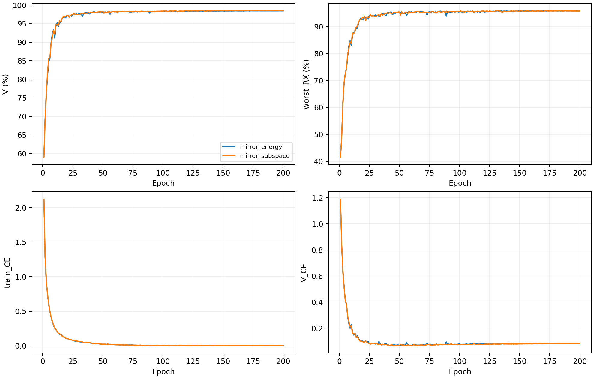

# CVS镜像频对子空间：完整源训练分析

8个新模型完成固定E200训练。20条源记录独立复算，包含同主干Shallow、Anchor和逐频谱关系控制；控制仅复用源元数据。以下均为源验证结果。

|结构|源V/%±SD|最差源RX/%±SD|源分数/%±SD|
|---|---:|---:|---:|
|neural_residual_shallow|98.4426±0.1052|95.8009±0.2290|97.1218±0.1631|
|response_anchor_mean|98.4435±0.1120|95.8194±0.2532|97.1315±0.1815|
|relation_frequency_energy|98.5731±0.1111|96.1389±0.3684|97.3560±0.2394|
|mirror_energy|98.4185±0.0945|95.7778±0.1821|97.0981±0.1365|
|mirror_subspace|98.4657±0.1336|95.7685±0.4376|97.1171±0.2852|

同seed配对差异，单位为百分点；SD为4个模型seed的样本标准差。

|比较|指标|均值±配对SD|正差seed|
|---|---|---:|---:|
|response_anchor_mean−neural_residual_shallow|V|+0.0009±0.0235|1/4|
|response_anchor_mean−neural_residual_shallow|worst_RX|+0.0185±0.0338|2/4|
|response_anchor_mean−neural_residual_shallow|score|+0.0097±0.0234|2/4|
|relation_frequency_energy−neural_residual_shallow|V|+0.1306±0.0759|4/4|
|relation_frequency_energy−neural_residual_shallow|worst_RX|+0.3380±0.1746|4/4|
|relation_frequency_energy−neural_residual_shallow|score|+0.2343±0.1215|4/4|
|mirror_energy−neural_residual_shallow|V|-0.0241±0.0574|1/4|
|mirror_energy−neural_residual_shallow|worst_RX|-0.0231±0.1381|2/4|
|mirror_energy−neural_residual_shallow|score|-0.0236±0.0801|2/4|
|mirror_subspace−neural_residual_shallow|V|+0.0231±0.0795|2/4|
|mirror_subspace−neural_residual_shallow|worst_RX|-0.0324±0.2183|2/4|
|mirror_subspace−neural_residual_shallow|score|-0.0046±0.1423|3/4|
|mirror_subspace−mirror_energy|V|+0.0472±0.0761|3/4|
|mirror_subspace−mirror_energy|worst_RX|-0.0093±0.3423|2/4|
|mirror_subspace−mirror_energy|score|+0.0190±0.2078|2/4|
|mirror_energy−relation_frequency_energy|V|-0.1546±0.0679|0/4|
|mirror_energy−relation_frequency_energy|worst_RX|-0.3611±0.3003|0/4|
|mirror_energy−relation_frequency_energy|score|-0.2579±0.1805|0/4|
|mirror_subspace−relation_frequency_energy|V|-0.1074±0.0246|0/4|
|mirror_subspace−relation_frequency_energy|worst_RX|-0.3704±0.0980|0/4|
|mirror_subspace−relation_frequency_energy|score|-0.2389±0.0600|0/4|

固定源规则选中`relation_frequency_energy`。保留既有控制，复用其已冻结的clean证据；未选中新候选不访问query。

曲线覆盖全部1600条新模型epoch记录。E151–175与E176–200均值之差仅描述后段变化，不重选epoch。训练CE为50个batch均值的等权平均（49×128+28），源V CE为27000样本均值，train/eval模式不同；CE差不等于泛化误差率差。控制完整曲线在本次collector中为N/A，未补造。

全源V关系遥测覆盖每模型27000个物理ID、90个TX/RX/day单元，每单元300样本。逐样本标量经独立NumPy复算后汇总；ID为不透明标识，坐标核对范围是存储元数据及跨模型同ID一致性。输出范数比、Q范数与floor比例用于描述分支使用情况，不代表识别增益或物理信道恢复。四seed共用同一数据划分。

镜像子空间不变性只适用于可逆左混合，且变化前后均未触发能量或det下限的频对。能量关系控制只保证共同尺度及酉混合域。公开合成诊断完整保留纳入和排除频点数、全域与合格域误差、有限FIR、TX非线性及RX IQ敏感性。有限窗多径和整网不保证不变。公开诊断不训练、不决定选模。

资源逐seed记录硬件、推理/训练时间、峰值显存和常驻字节数；并行任务可能影响时间。MAC只覆盖统计到的卷积与矩阵乘，不含FFT、归一化及逐元素运算，不等于总FLOPs。控制时间/显存未在本次复测，记N/A。

[逐seed结果](evidence/source_final.csv) · [完整曲线](evidence/source_curves.csv) · [后段变化](evidence/source_learning_by_seed.csv) · [全V单元](evidence/source_relation_cells.csv) · [RX汇总](evidence/source_relation_summary.csv) · [梯度](evidence/source_gradient_by_seed.csv) · [公开物理诊断](evidence/source_public_physics.csv) · [资源](evidence/source_resources.csv)。

单一TX CE、scratch、原数据和训练策略保持不变。是否提升独立clean识别需冻结后测试证明；源V已见RX不能单独证明跨未知信道/接收机泛化。Phase2适应三阶段与K×新增类指标为N/A。

## 完整源证据支持的解释

与当前逐频关系控制相比，镜像能量关系的源分数下降0.2579±0.1805个百分点，镜像子空间下降0.2389±0.0600个百分点，均为4/4个seed负差。子空间相对等参数镜像能量关系仅增加0.0190±0.2078个百分点，2/4为正；最差源RX反而下降0.0093个百分点。当前证据不支持将严格左混合不变性作为提升识别的充分条件。SD描述同一划分下四个模型seed的差异，不是置信区间。

`mirror_energy`全V的分支输出/原频率输出范数比均值为0.3289，能量floor触发比例为27.86%，det阈值以下比例为20.40%。E200训练CE为0.000766，V CE为0.083189；固定后段窗口V CE变化为+0.000271。`mirror_subspace`全V的分支输出/原频率输出范数比均值为0.3116，能量floor触发比例为28.14%，det阈值以下比例为20.90%。E200训练CE为0.000728，V CE为0.081724；固定后段窗口V CE变化为+0.000585。这些记录说明分支有非零贡献，但无法证明其贡献是设备身份而非其他变化。两种floor比例可能重叠，不能相加；能量控制不使用det除法，det比例仅是同口径诊断。

训练后的子空间在公开理想可逆左混合下，四seed合格域最大绝对误差均为1.1921e−7，每seed186/186个频对纳入。这验证了所声明的局部数学性质，未证明有限窗多径和完整神经网络的信道不变性。

公开有限FIR下，子空间关系的相对距离在delay8和delay16分别达到59.5294和3642.6571，而整网单位表征距离分别为0.1494和0.1726。相对距离按每个公开样本的关系范数归一化，分母最低截为1e−12；该结构对秩一关系趋近零，因此大比值不能直接解释为输出幅度爆炸。现有摘要缺少逐样本绝对差和分母分解，不能确认大比值的具体来源，更不能与准确率提升等同。对有限FIR的鲁棒性仍未建立。

可逆行混合的商表示可能同时消去TX线性IQ差异；有限窗多径也不严格满足逐频瞬时左混合模型。这两项是后续研究的物理与可辨识性假设，不是本次负结果已经证实的单一原因。下一步应先用源证据及公开信号分解绝对误差、低秩频对覆盖和身份信息保留情况，再决定是否需要另一种结构；不能据测试成绩选择结构，也不靠追加损失、训练预算或替换seed弥补。

[完整机制摘要](evidence/source_mechanism_summary.json) · [四seed配对源结果](evidence/source_paired_summary.csv) · [完整公开诊断](evidence/source_public_physics.csv)。本次源曲线图已目视检查，全部200个epoch可见，无裁掉后段上升趋势。
