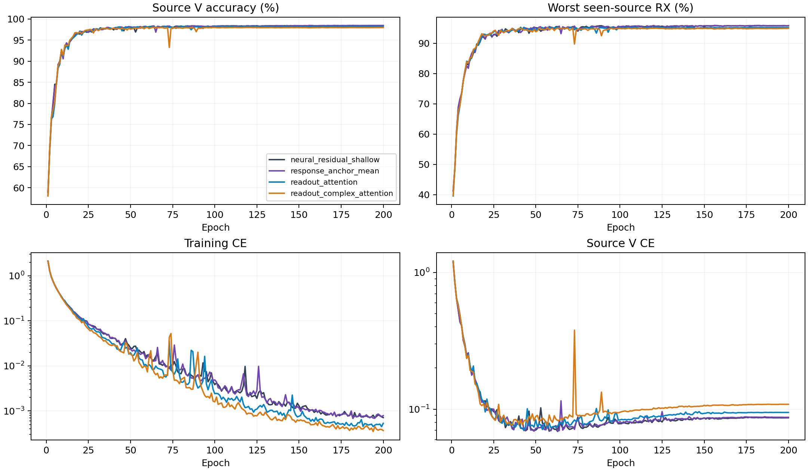

# CVS可学习注意力读出：完整源训练结果

**本轮源实验已完成，新结构未提升性能，整体论文目标未达成。** 本轮8份E200训练与80000步日志审计完成，固定源规则保留既有Anchor。普通注意力和复数混合注意力的源分数为96.6903%和96.4481%，分别比同主干shallow低0.4315±0.4004和0.6736±0.2254个百分点，二者均为0/4个seed胜出。配对SD仅描述同一数据划分下的模型seed变化，不是置信区间。

8个scratch模型完成200轮×50步。源选择由完整16记录独立重算，包含同主干shallow和当前源赢家Anchor，训练策略和单一CE保持不变。以下是源验证指标，不是测试结果。

|结构|源V/%|最差源RX/%|固定源分数/%|相对控制/百分点±配对SD|正提升seed|参数|
|---|---:|---:|---:|---:|---:|---:|
|neural_residual_shallow|98.4426|95.8009|97.1218|+0.0000±0.0000|0/4|220987|
|response_anchor_mean|98.4435|95.8194|97.1315|+0.0097±0.0234|2/4|237147|
|readout_attention|98.2046|95.1759|96.6903|-0.4315±0.4004|0/4|306147|
|readout_complex_attention|97.9796|94.9167|96.4481|-0.6736±0.2254|0/4|310243|

固定规则选中`response_anchor_mean`。保留既有控制，未选候选不访问query，复用已有控制clean完成证据。

|结构|batch1推理/ms|batch128训练/ms|
|---|---:|---:|
|neural_residual_shallow|9.8971|51.4826|
|response_anchor_mean|12.8663|58.7296|
|readout_attention|10.6591|54.4877|
|readout_complex_attention|11.2804|55.3793|

资源在实际RTX3090/FP32环境测量，并行运行可能影响时间。MAC计数包含实际aten卷积（包括功能式复卷积）及矩阵乘法，未计FFT、归一化、门控、池化和逐元素运算；不是总FLOPs。峰值内存与常驻状态保留逐seed值。新模块同样只由CE更新；零出口的首步内部零梯度是初始化性质，不能与训练后失活混同。

## 训练CE与源V CE

固定E200；表中为四个模型seed的均值±样本SD。CE差值先按同seed计算V CE−训练CE，再汇总；不是误差率差。训练CE是50个batch均值的等权平均（49×128+28样本），源V CE是全部27000个验证样本的均值；二者的数据、平均方式和train/eval模式不同。

|结构|E200训练CE|E200源V CE|E200 CE差值|后段训练CE变化|后段源V CE变化|后段CE差值变化|
|---|---:|---:|---:|---:|---:|---:|
|neural_residual_shallow|0.000711±0.000169|0.086423±0.003526|0.085711±0.003457|-0.000176±0.000098|0.000855±0.000636|0.001031±0.000697|
|response_anchor_mean|0.000785±0.000131|0.087126±0.003733|0.086341±0.003705|-0.000170±0.000050|0.000680±0.000165|0.000850±0.000125|
|readout_attention|0.000531±0.000249|0.094599±0.010715|0.094068±0.010861|-0.000121±0.000042|0.000664±0.000477|0.000785±0.000501|
|readout_complex_attention|0.000366±0.000138|0.108483±0.012941|0.108117±0.012992|-0.000090±0.000019|0.001406±0.000749|0.001496±0.000736|

后段变化固定定义为E176–200均值减E151–175均值，按seed配对后汇总；完整E1–200四seed均值/SD见[source_curve_summary.csv](evidence/source_curve_summary.csv)。这些窗口只描述曲线，不重新选择epoch，也不设鲁棒性门槛。

## 两种读出的固定E200配对差异

以下均为complex_attention−attention，同seed配对，单位为百分点。

|指标|均值±配对SD|正差seed|零差seed|
|---|---:|---:|---:|
|score|-0.2421±0.2744|1/4|0/4|
|V|-0.2250±0.1239|0/4|0/4|
|worst_RX|-0.2593±0.4325|1/4|0/4|

四seed共用相同数据，只描述此次源训练差异；小幅均值变化不能单独支持稳定提升或独立clean提升。

## 已有读出遥测

下表只用E200最后一个训练batch的28个样本，分支指标按四seed汇总。输出变化是相对skip输出的逐样本L2范数比均值；投影范数是project权重的Frobenius范数。

|结构/分支|相对输出变化|有效tokens|attention entropy|投影范数|
|---|---:|---:|---:|---:|
|readout_attention/time.readout|0.449966±0.037599|50.218378±1.445381|3.907187±0.026386|1.192576±0.040104|
|readout_attention/behavior.readout|0.602460±0.033081|36.634977±7.319503|3.223186±0.440420|1.506558±0.042920|
|readout_complex_attention/time.readout|0.423924±0.027734|53.688627±2.132928|3.977782±0.039623|1.177605±0.026737|
|readout_complex_attention/behavior.readout|0.627189±0.027853|34.197347±5.794484|3.132600±0.407585|1.645433±0.066566|

这28个样本不能代表全源分布，也不能支持信道变化的因果结论。有效tokens与entropy反映各head在64个时间位置上的分布，不证明head之间的多样性；当前未测量head相似度或信道解耦。

|结构|全200轮梯度均值|E200梯度均值|E151–200梯度均值|
|---|---:|---:|---:|
|readout_attention|0.543254±0.034208|0.032803±0.015456|0.037747±0.006699|
|readout_complex_attention|0.497880±0.034177|0.024181±0.011927|0.030230±0.004707|

梯度使用每个新模型全部200条epoch记录，每条是50个已有step梯度范数的均值，合并time与behavior两分支的新增参数。原collector另行审计每模型10000步；当前离线产物不含原始step数组，未计算step极值或单分支梯度。epoch均值的范围、零值计数和已有步数审计信息保留在逐seed表中；梯度非零仅表示CE更新经过这些参数。

[CE与后段逐seed](evidence/source_learning_by_seed.csv) · [读出配对逐seed](evidence/readout_pairwise_by_seed.csv) · [全部1600条读出梯度epoch均值](evidence/readout_gradient_epochs.csv) · [梯度逐seed摘要](evidence/readout_gradient_by_seed.csv) · [E200分支逐seed](evidence/readout_last_epoch.csv) · [完整分析与口径](evidence/source_learning_analysis.json)。

源V使用已见源RX；四seed不是独立数据集。新增容量是否提高独立clean识别必须由冻结测试证明。没有追加损失、增强、重加权、采样策略、teacher或目标适应。D92的适应三阶段/K×新增类为N/A。

[逐seed](evidence/source_final.csv) · [完整曲线](evidence/source_curves.csv) · [实际新增分支输出](evidence/readout_outputs.csv) · [全部TX/RX/day单元](evidence/source_cells.csv) · [资源](evidence/source_resources.csv) · [80000步审计](evidence/source_completion_validation.json) · [原设计](../../../docs/CVS_NEURAL_READOUT_20261003.md)。

## 负结果解释与测试收尾

训练CE从shallow的0.000711降至0.000531和0.000366，而源V CE从0.086423升至0.094599和0.108483。结合较低源准确率，这与新增容量产生过拟合的解释一致；不能把原因直接归为信道或接收机捷径。两种读出的最后训练batch分支输出相对原skip约0.42至0.63，全部训练轮都有梯度遥测，说明新增分支确实参与优化；这些数据不能证明全源归因、head多样性、TX特异性或信道鲁棒性。

按预登记规则，两种未入选读出均不访问query，条件48行clean实验未激活。独立读回既有44行clean完成状态、预测配置与provenance，352条评分完全未变；其中4个Anchor checkpoint与本次源选择控制逐seed一致。复用Anchor既有clean准确率69.9129%±1.2142%，不产生新的测试证据，也不宣称本轮新增结构获得该结果。

[复用核验](evidence/retained_control_test_verification.json) · [既有完整clean报告](../20261003-phase1-cvs-response-fusion-clean-manysig-m44-r01/report.md) · [本轮判定](evidence/completion_verdict.json)。后续结构决策只允许使用源证据；保留全部负结果，不换seed、延长预算或重跑以筛选成绩。
