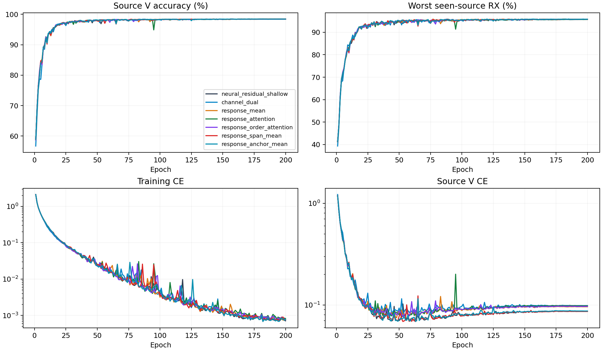

# CVS约束响应融合：完整源训练结果

8个scratch模型完成200轮×50步。源选择由完整28记录独立重算，训练策略和单一CE保持不变。以下是源验证指标，不是测试结果。

|结构|源V/%|最差源RX/%|固定源分数/%|相对双路控制/百分点±配对SD|正提升seed|参数|
|---|---:|---:|---:|---:|---:|---:|
|neural_residual_shallow|98.4426|95.8009|97.1218|-0.0083±0.0488|1/4|220987|
|channel_dual|98.4269|95.8333|97.1301|+0.0000±0.0000|0/4|247387|
|response_mean|98.4380|95.8102|97.1241|-0.0060±0.1105|2/4|237147|
|response_attention|98.3991|95.6898|97.0444|-0.0856±0.0736|1/4|237359|
|response_order_attention|98.4130|95.7639|97.0884|-0.0417±0.0405|1/4|238383|
|response_span_mean|98.4389|95.7685|97.1037|-0.0264±0.0931|2/4|237147|
|response_anchor_mean|98.4435|95.8194|97.1315|+0.0014±0.0497|2/4|237147|

固定规则选中`response_anchor_mean`。后续只对该候选4模型执行预登记clean测试。

|结构|batch1推理/ms|batch128训练/ms|
|---|---:|---:|
|neural_residual_shallow|9.8971|51.4826|
|channel_dual|13.5561|62.3477|
|response_mean|12.8485|57.4377|
|response_attention|13.0363|59.9743|
|response_order_attention|13.5211|66.3668|
|response_span_mean|13.1279|60.6641|
|response_anchor_mean|12.8663|58.7296|

资源在实际RTX3090/FP32环境测量，并行运行可能影响时间。MAC计数包含实际aten卷积（包括功能式复卷积）及矩阵乘法，未计6×6线性求解、FFT、归一化、门控、池化、动态FIR的unfold及逐元素乘加；不是总FLOPs。实际训练与推理耗时包含全部算子。峰值内存与常驻状态保留逐seed值。新模块同样只由CE更新；零出口的首步内部零梯度是初始化性质，不能与训练后失活混同。

源V使用已见源RX；四seed不是独立数据集。新增容量是否提高独立clean识别必须由冻结测试证明。没有追加损失、增强、重加权、采样策略、teacher或目标适应。D92的适应三阶段/K×新增类为N/A。

[逐seed](evidence/source_final.csv) · [完整曲线](evidence/source_curves.csv) · [实际新增分支输出](evidence/response_outputs.csv) · [全部TX/RX/day单元](evidence/source_cells.csv) · [资源](evidence/source_resources.csv) · [80000步审计](evidence/source_completion_validation.json) · [原设计](../../../docs/CVS_RESPONSE_FUSION_DESIGN_20261003.md)。
