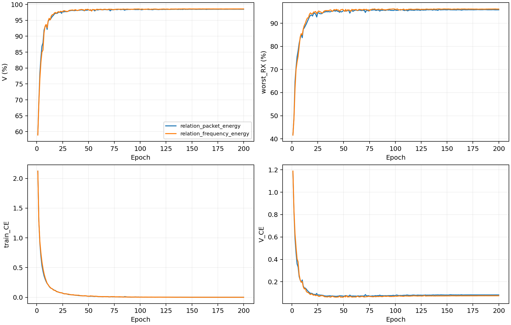

# CVS频点内时间关系：完整源训练分析

8个新模型完成固定E200训练。16条源记录独立复算，包含同主干Shallow和既有Anchor控制；控制仅复用源元数据。以下均为源验证结果。

|结构|源V/%±SD|最差源RX/%±SD|源分数/%±SD|
|---|---:|---:|---:|
|neural_residual_shallow|98.4426±0.1052|95.8009±0.2290|97.1218±0.1631|
|response_anchor_mean|98.4435±0.1120|95.8194±0.2532|97.1315±0.1815|
|relation_packet_energy|98.4787±0.1595|95.8194±0.4286|97.1491±0.2930|
|relation_frequency_energy|98.5731±0.1111|96.1389±0.3684|97.3560±0.2394|

同seed配对差异，单位为百分点；SD为4个模型seed的样本标准差。

|比较|指标|均值±配对SD|正差seed|
|---|---|---:|---:|
|response_anchor_mean−neural_residual_shallow|V|+0.0009±0.0235|1/4|
|response_anchor_mean−neural_residual_shallow|worst_RX|+0.0185±0.0338|2/4|
|response_anchor_mean−neural_residual_shallow|score|+0.0097±0.0234|2/4|
|relation_packet_energy−neural_residual_shallow|V|+0.0361±0.1371|1/4|
|relation_packet_energy−neural_residual_shallow|worst_RX|+0.0185±0.4105|1/4|
|relation_packet_energy−neural_residual_shallow|score|+0.0273±0.2690|1/4|
|relation_frequency_energy−neural_residual_shallow|V|+0.1306±0.0759|4/4|
|relation_frequency_energy−neural_residual_shallow|worst_RX|+0.3380±0.1746|4/4|
|relation_frequency_energy−neural_residual_shallow|score|+0.2343±0.1215|4/4|
|relation_frequency_energy−relation_packet_energy|V|+0.0944±0.1393|3/4|
|relation_frequency_energy−relation_packet_energy|worst_RX|+0.3194±0.4785|3/4|
|relation_frequency_energy−relation_packet_energy|score|+0.2069±0.3067|3/4|

固定源规则选中`relation_frequency_energy`。后续仅该新候选的4个模型进入预登记clean测试，与44条冻结基准同行比较。

曲线覆盖全部1600条新模型epoch记录。E151–175与E176–200均值之差仅描述后段变化，不重选epoch。训练CE为50个batch均值的等权平均（49×128+28），源V CE为27000样本均值，train/eval模式不同；CE差不等于泛化误差率差。控制完整曲线在本次collector中为N/A，未补造。

全源V关系遥测覆盖每模型27000个物理ID、90个TX/RX/day单元，每单元300样本。逐样本标量经独立NumPy复算后汇总；ID为不透明标识，坐标核对范围是存储元数据及跨模型同ID一致性。输出范数比、Q范数与floor比例用于描述分支使用情况，不代表识别增益或物理信道恢复。四seed共用同一数据划分。

理想逐频复增益抵消性质只适用于归一化关系统计且变化前后均未触发绝对/相对floor的频点。公开合成诊断完整保留纳入和排除频点数、全域与合格域误差、有限FIR、TX非线性及RX IQ敏感性。有限窗多径和整网不保证不变。公开诊断不训练、不决定选模。

资源逐seed记录硬件、推理/训练时间、峰值显存和常驻字节数；并行任务可能影响时间。MAC只覆盖统计到的卷积与矩阵乘，不含FFT、归一化及逐元素运算，不等于总FLOPs。控制时间/显存未在本次复测，记N/A。

[逐seed结果](evidence/source_final.csv) · [完整曲线](evidence/source_curves.csv) · [后段变化](evidence/source_learning_by_seed.csv) · [全V单元](evidence/source_relation_cells.csv) · [RX汇总](evidence/source_relation_summary.csv) · [梯度](evidence/source_gradient_by_seed.csv) · [公开物理诊断](evidence/source_public_physics.csv) · [资源](evidence/source_resources.csv)。

单一TX CE、scratch、原数据和训练策略保持不变。是否提升独立clean识别需冻结后测试证明；源V已见RX不能单独证明跨未知信道/接收机泛化。Phase2适应三阶段与K×新增类指标为N/A。

## 完整源遥测的解释

逐频关系出口相对原频率投影输出的逐包范数比，四seed均值为0.4552±0.0837；整包控制为0.5477±0.0985。输出更大并不对应更高源分数，不能以出口范数代替身份识别贡献。逐频结构全V的平均floor触发比例为29.3981%±0.2402%，整包控制为0。严格任意逐频幅度不变性不覆盖触及下限的频点。

E200逐频训练CE为0.000694、源V CE为0.075441；整包为0.000760与0.082726。固定后段窗口中，逐频V CE上升0.000488，训练CE下降0.000164；保留这一趋势，不据此重选checkpoint。源V上的改善与后段CE上升可以同时发生，不能将差异归为已证明的物理解耦。

训练后的公开FIR诊断中，逐频关系在delay2/8/16下的相对变化均值为0.0300/0.1047/0.2370，整包为0.1077/0.1101/0.1140；delay16仍更敏感。整网单位表征距离也没有在所有干预下下降。合成理想增益资格域内的数值误差不超过2.3842e-7，与有限窗多径、实际源floor触发情况分别报告。

[完整源机制汇总](evidence/source_mechanism_summary.json)。这些解释只使用已完整审计的源数据及固定公开诊断，不使用clean成绩。
