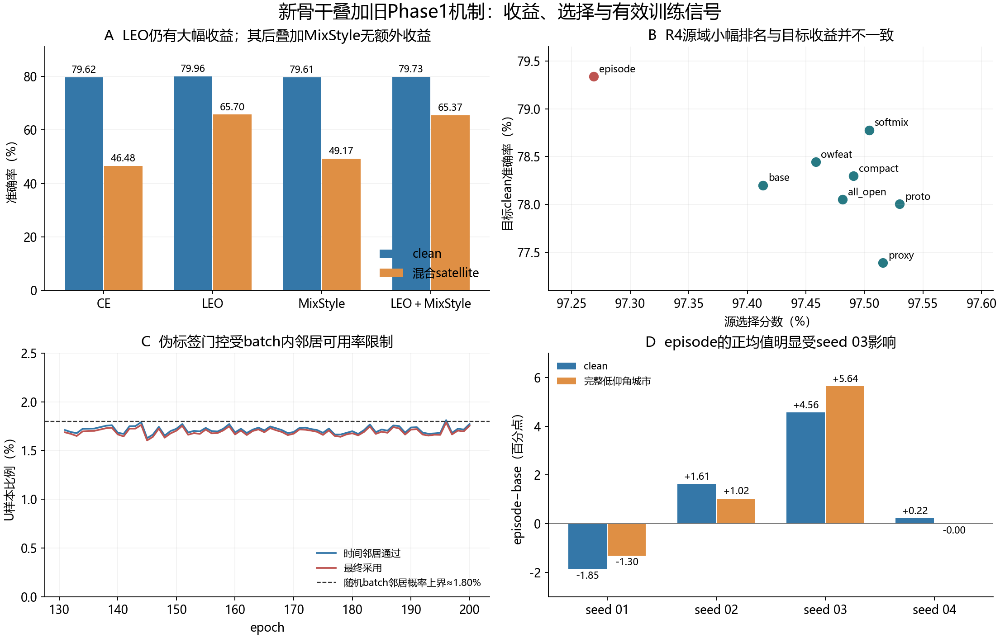

# 新CVS骨干与原Phase1机制的收益变化分析

分析日期：2026-10-08，Asia/Hong_Kong。对象：`reference_response`及R1至R5已有训练与冻结测试；不启动训练、不修改健康进程、不重新选模或追加目标推理。

## 结论

“新网络的CE更强，但旧Phase1机制都不再有效”不符合已有完整结果。更准确的判断是：**LEO增强仍有很大收益；MixStyle的增益在LEO之后消失；旧DG组合存在clean判别与残差信道鲁棒性的取舍；伪标签实际采用率很低；开放世界机制有小幅、波动较大的正负效应。直接把旧训练配方整体接到新骨干上，尚未证明能稳定超过新骨干的简单训练。**

最有证据支持的原因依次为：

1. 源验证仍来自训练见过的接收机，而最终测试是未见接收机。源域分数已高度饱和，细小排名差异不能保证目标域收益。
2. 伪标签的batch内时间邻居门控与随机采样不匹配，约98%的U样本在这一门控被拒绝，额外无标签信号远小于名义数据量。
3. 网络替换改变了身份/域分支的共享关系和特征语义；同名损失、同一数值权重，不再等价于原网络上的正则强度。
4. DG主项较强、部分小项极弱；完整叠加混合了对抗、样本选择、类几何与优化竞争，不能期待线性相加。
5. R1与R2并非只差一个机制：优化步数、学习率、裁剪、标签平滑及原生增强路径均发生变化。

物理身份信息被过度抹除、参考分支绕过MixStyle、梯度方向冲突是有代码或现象支持的解释，但尚无分支贡献/梯度夹角实测，不能宣布为唯一根因。

## 证据覆盖与当前状态

本次完整解析R1的16行及R2至R5已完成80行：共96个模型、19200轮、3712000条完整逐步记录；核对200轮JSONL/CSV与每轮50或222步数量。92条已启动stack行的完整可用epoch快照共17508轮，其中12条运行中R5行额外1508轮；活动行只作截至快照的描述，没有读取未闭合step gzip。完整stdout覆盖和缺项见`log_validation.json`。

对两个已评分批次的全部7840条混淆矩阵记录重新计算Accuracy、Macro-F1、样本数与唯一键，全部一致。该核验复用既有评分产物，不是重新推理，也不声称重新读取9408万条原始预测。

2026-10-08凌晨只读核实：新增136行矩阵中80行完成训练并完成七视图测试；R5另12行仍在训练，快照分别处于96至152轮；R6尚未启动。R1的16行独立完成。本轮全栈、原生完整栈、DAOT×RC4配对与R6删组结论仍缺失。当前不能下“整套Phase1已经失败”或“RC4净增益已成立”的结论。

R1的satellite是三种场景的互斥混合测试：总168000条，其中高仰角55998、中仰角56174、低仰角城市55828。后续80行的七视图是clean及六种完整residual环境，每视图168000条。**不能把R1场景子集与后续完整场景直接相减当成机制净收益。**

原始日志与本次完整解析文件保留于`E:/type10-7/local_artifacts/phase1_transfer_analysis_20261008/`；版本化报告保存精简统计和分析脚本，不复制大体积原始日志。

图A、B为四seed均值，未画置信区间；图C为四seed逐轮均值；图D保留每个seed。所有正式不确定性见配对表，不将图中的均值差当作显著性检验。

## 1. 先把现象分清楚

历史同物理query、四seed的纯CE结果为：native 76.2272%±0.3291%，reference_response 79.6845%±0.9161%，配对提高3.4573±0.5926个百分点。R1重新训练的CE为79.622%，与该水平接近。该架构基准已经暴露，不能称为全新盲测选择；新响应分支也不能独占全部提升，原残差融合本身已达78.4543%。

### R1：增强是否失效

|机制|clean准确率|混合satellite准确率|相对适当对照|
|---|---:|---:|---|
|CE|79.622%|46.482%|同预算基线|
|CE＋LEO|79.960%|65.699%|satellite增加19.218个百分点|
|CE＋MixStyle|79.607%|49.173%|satellite增加2.691个百分点|
|CE＋LEO＋MixStyle|79.731%|65.372%|相对LEO下降0.327个百分点|

LEO的主要贡献是缓解接收扰动，clean上只有0.338个百分点的小幅变化。没有LEO时MixStyle尚有平均收益；已有LEO时，MixStyle的附加收益变为负。satellite交互项`both−LEO−MixStyle＋CE=−3.018±3.380`个百分点，显示明显的非加性趋势，但四seed不能把该交互宣布为稳定总体规律。

### R2至R4：同阶段配对

以下都是准确率百分点。R3的cons/fishr/orth不是孤立开关，它们共同依赖domain；因此分别与domain比较才能看到附加作用。

|对比|clean差值|低仰角城市差值|解释|
|---|---:|---:|---|
|R2 pseudo−ema|−0.454|−0.964|更接近隔离新增伪标签的作用|
|R3 domain−base|−1.425|＋0.544|判别与鲁棒性的取舍；也同时开启U域门控|
|R3 cons−domain|＋0.192|＋0.289|一致性的附加作用较小|
|R3 fishr−domain|＋0.158|＋0.008|强扰动环境几乎无额外均值收益|
|R3 orth−domain|＋0.001|−0.089|未显示有意义的附加收益|
|R3 all_dg−domain|−0.411|−0.412|全部叠加没有超过共同基础项|
|R4 proto−base|−0.196|−0.202|源域小幅提高未转化为目标收益|
|R4 episode−base|＋1.136|＋1.339|平均正向，但seed依赖很强|
|R4 softmix−base|＋0.575|＋0.766|平均正向，尚无稳定性结论|

相对R3 base，domain＋cons在六种residual环境平均提高0.833至1.171个百分点，同时clean下降1.233个百分点。这不是完全没有DG收益，而是收益的场景分配不同。

## 2. 源域选择与最终任务并不等价

当前源选择分数是四seed平均`0.5×V准确率＋0.5×最差源RX准确率`。V来自五个训练源RX的不同物理样本；它满足隔离协议，但仍主要检验同源接收机泛化，不能自动充当未见RX或残差信道压力的可靠代理。

|阶段配置|源V|最差源RX|源选择分数|目标clean|完整低仰角城市|
|---|---:|---:|---:|---:|---:|
|R2 bridge|98.673%|96.245%|97.459%|79.095%|56.121%|
|R2 pseudo|98.688%|96.310%|97.499%|78.256%|55.024%|
|R3 base|98.694%|96.361%|97.528%|78.003%|54.703%|
|R3 domain＋cons|98.616%|96.250%|97.433%|76.770%|55.536%|
|R4 base|98.651%|96.176%|97.413%|78.201%|54.785%|
|R4 proto|98.685%|96.375%|97.530%|78.005%|54.583%|
|R4 episode|98.584%|95.954%|97.269%|79.338%|56.124%|

R2按源规则选pseudo，比bridge只高0.0398个百分点，配对差值SD为0.2691个百分点；比ema只高0.0213个百分点，SD为0.3555个百分点。R4的proto比第二名proxy只高0.0144个百分点，SD为0.1178个百分点。规则执行正确，但“得分第一”和“优势可靠”是两个判断。

顺序搜索每阶段只保留一个源域胜出配置。它探索的是条件路径：先LEO，再pseudo，R3保留base，R4加入proto。它没有穷举“无pseudo时的DG”“不同增强下的open机制”等交互，因此不能称为全局最优机制搜索。四seed源差异及运行随机性还可能放大路径依赖。

这也不是识别性能接近上限：目标clean仍有约20%错误。R1的CE对TX6-15已约99.8%，但TX14-7仅48.7%，TX20-19仅65.5%，说明剩余错误集中在特定身份与接收条件。增加通用正则不一定解决这些具体混淆。

既有目标成绩仅用于解释冻结比较，不用于把episode升为新起点、降低某个权重或改变现行源选择。未来诊断应从这里已经核实的源数据结构和代码路径出发，前瞻登记；不能以更换run名称洗掉目标反馈。

## 3. 伪标签：主要问题是有效覆盖，而非已证实的错误率

R2 pseudo在E181至200的四seed平均：每轮U总数56700，采用963.96个，采用率1.698%；记录的伪标签置信度约0.994。E131开始启用，E1至130不使用伪标签。U标签被隐藏，真实伪标签正确率不可得；高置信度不能代替正确率。

已生效参数为：`pseudo_temporal_gate=true`、`pseudo_temporal_mode=batch_neighbor`、window=2、`u_unlabeled_shuffle=true`、U batch=256。函数按RX/day/equalized分流，在**同一个batch**内同时要求`sig_i`和`base_index`间隔不超过2、预测类别相同且置信度通过；没有邻居就拒绝。

若唯一base_index上下最多各2个候选邻居，则随机无放回batch内至少出现一个的概率满足：

`P(存在邻居) ≤ 4×(256−1)/(56700−1) ≈ 1.799%`。

该上界甚至尚未加入RX/day、置信度和预测一致性限制。实测代表行末轮temporal通过率1.744%，strong通过率99.057%，最终采用率1.732%，与“随机batch很少含物理近邻”直接吻合。不能将被拒绝的98%样本解释为模型认为不可信，也不能说充分利用了9倍无标签数据。

末期原始无标签CE约0.00862，乘`lambda_u=0.16`仅约0.00138；有标签CE约0.133、加权卫星CE约0.216。这里比较的是标量损失，不是梯度贡献；但名义U规模与实际覆盖/训练信号之间的落差已经明确。

R3 domain同时把`pseudo_domain_gate`从false变为true，采用数从约964降至835，约下降13.4%。所以domain对比同时包含“DG目标变化”和“U样本筛选变化”，不能把全部性能差值归给GRL。

可验证的后续方向是检查合法物理邻居与采样器的匹配、或同一物理ID跨epoch预测稳定性。必须保持U标签隐藏，不用TX真值组织伪标签门控，也不能根据当前测试结果直接调低置信阈值。

## 4. 换骨干改变了旧机制的作用对象

`runtime.py`先建立原dual网络，再替换`id_backbone`。原lite_d会让身份与域分支共享`sinc`、`hf`，替换后新身份骨干来自独立的reference_response，域分支继续使用原网络对象，原共享关系被切断。

这有三个后果：

- `L_domain(z_dom,d)`主要训练保留的域分支，不能再通过原共享前端直接塑造新身份前端。
- GRL仍明确接在融合`z_id`上，因而会约束新身份表示；不能把共享关系改变误写为“DG梯度完全没有到达新网络”。
- 正交、prototype和一致性项面对的是新的表示尺度、协方差与判别方向，旧权重无法自动维持相同作用强度。域分支和身份分支还共同进入总梯度裁剪，产生优化上的耦合。

reference_response把公共前导码相对响应投影为残差，加到原身份表示；它含相对频响、质量、相干度、相对CFO和功率比例。该坐标仍混合TX、RX、信道及均衡器作用。源域物理诊断已经明确：局部参考分支消去flat复增益，不代表整网信道不变；原始身份路径仍保留。

因此，更强CE可能更有效地利用了“身份相关、同时也带有接收域信息”的坐标。直接要求身份向量难以预测域，可能压掉其中有用部分。这与clean下降、残差环境改善相符，但要证明“具体哪条身份线索被擦除”，仍需源域分支贡献与梯度诊断。

R3 domain相对base的clean下降主要集中于TX20-15（平均−5.852个百分点，SD13.078）、TX20-19（−2.029）及TX14-7（−1.566）；TX6-15基本不变。低仰角城市的TX8-20提高4.012个百分点且四seed皆正，其余若干类持平或下降。这是类别间收益重新分配，不能只用一个总均值描述为统一改善或全面崩溃。

## 5. 损失强度失配，以及“Fishr”实际测了什么

E181至200四seed、每epoch全部222步的平均加权损失：

|配置/项|加权损失均值|
|---|---:|
|R3 base身份CE|0.13306|
|R3 base卫星CE|0.21681|
|R3 domain身份CE|0.14388|
|R3 domain卫星CE|0.22860|
|R3 domain域CE|0.35593|
|R3 domain对抗CE|0.94221|
|R3 cons一致性项|0.00821|
|R3 fishr项|0.00001111|
|R3 all_dg正交项|0.000820|
|R4 proto原型项|0.001047|
|R4 episode项|0.000319|

DG并非一个均匀生效的整体：域/对抗项很大，Fishr代理非常小。必须强调，标量损失大小不等于参数梯度大小；例如对抗CE接近随机域分类的熵，可以是域混淆的预期现象，不能仅凭loss高判定失败。

实际总梯度提供了另一条证据：末期裁剪前范数从R3 base的2.462升到domain的5.123、all_dg的5.288，裁剪阈值为5。它说明优化尺度明显变化，但epoch均值不能推出每步裁剪比例。日志`grad_clip_active=1`仅表示开启裁剪，不表示该步必然触发，报告不混淆二者。

本项目的`fishr_logit_gradient_variance_loss`使用`softmax(logits)−one_hot(y)`，匹配各域**logit梯度代理**的方差。它不是对全部分类器参数逐样本梯度协方差的原论文实现；也没有直接验证新参考分支参数的跨域梯度一致性。在高置信、低训练错误条件下，这个代理项可能很小，日志与此一致。因此这里只能说“当前权重、当前logit方差代理的移植未显示额外收益”，不能推广成Fishr原方法无效。

原论文可核对：[Fishr](https://arxiv.org/abs/2109.02934)。它研究跨域梯度方差约束；项目代码的代理形式需要独立说明，不能用论文名字替代实现核对。

## 6. MixStyle及物理增强为何不会线性叠加

当前MixStyle只在time_down/t1混合特征统计；相对响应分支直接读取原IQ，绕过这两个插入位置。因此，被混合的时域分支与未混合的物理响应分支可能产生不一致的训练扰动，且网络可以继续依赖未扰动分支。该路径差异是代码事实；是否确实造成旁路依赖尚未测量。

MixStyle原论点是低层特征统计包含域风格；在RFFI中，幅相统计、频响、非线性和相干性也可能承载发射机身份。统计混合不保证只改变接收域而完整保留指纹。[MixStyle原论文](https://arxiv.org/abs/2104.02008)提供方法依据，但并不直接证明射频特征中的身份保持性。

LEO则直接改变接收IQ，因此所有身份路径都能看到扰动。R1中LEO大幅提高卫星性能，与它覆盖真实评估扰动类型的解释一致。已有LEO之后，MixStyle可能重复覆盖部分扰动，或施加额外身份扰动，导致边际收益消失。需要合法源域上的成对表示/分类变化验证，不能仅由负交互推定唯一物理原因。

## 7. 优化配方与预算是必须拆开的因素

|项目|R1纯CE/增强消融|R2至R4原生训练桥接|
|---|---|---|
|每轮更新|50|222|
|总更新|10000|44400|
|学习率|2e−4余弦下降至约1e−6|完整日志为恒定2e−4|
|梯度裁剪|无|总范数阈值5|
|标签平滑|普通CE|0.01|
|训练阶段|200轮同一监督框架|部分组130轮标注＋70轮伪标签阶段|
|原生增强|R1明确的LEO/MixStyle|另保留原生RF调度；实际主视图路径还受concat_active控制|

R2 bridge不是“R1 CE多加一点训练”：它继承LEO、换成原生训练器，并有上述多项改变。每轮222×128个有标签输入，约为R1的4.51倍标注样本曝光；44400/10000=4.44倍优化更新。即使没有U监督，也循环标注loader来满足U定义的步数预算。

R1把200轮用于学习率收敛；R2至R4以相同epoch数长期保持较大学习率，因此固定E200处于不同优化状态。这足以说明不能把R1与R2的全部差异归因于某个正则项，但尚无同训练器的独立LR/曝光量消融，不能直接断言恒定LR是负收益的唯一原因。

原生增强日志中的`aug_p_*`是调度配置。代码在concat激活后跳过主输入的通用augmentor；仅看到参数非零不能声称每一轮每条RF增强都真实作用于主分类输入。R5又进入MUSE桥接和不同执行路径，其已完成RC4行LR确实下降至1e−6。后续跨阶段比较必须继续保留这些差异。

完整曲线还排除了“所有机制都没执行”的解释：R3域/对抗/正交/Fishr加权项从E1出现，cons从E17出现，R4 episode从E20出现，普通伪标签从E131出现。相关源V最佳轮多在训练后半段；R2至R4各组最佳源V均值与最终源V的差通常约0.06至0.19个百分点，没有源验证全面崩溃的证据。目标域只有冻结E200结果，无法据此确定目标退化首次出现在哪一轮，也不能追认某个更早checkpoint更优。

## 8. 稳定性与可声明范围

episode相对R4 base的clean四seed差值为−1.848、＋1.614、＋4.558、＋0.221个百分点。移去第三个seed后，剩余三seed均值约−0.004；低仰角城市移去该seed后约−0.094。该分析仅为敏感性诊断，不剔除该seed，也不重新算正式主结果。

clean配对均值1.136、SD2.688个百分点，按四seed配对t近似得到95%区间约[−3.142,5.414]；低仰角城市约[−3.468,6.145]。只有4个seed，分布假设和多重比较均限制解释；这些区间不是跨接收机总体或未来场景的置信保证。七视图共享物理query及模型，不是七次独立成功重复。

同理，CE/LEO、domain、prototype等正负均值必须区分“本次固定矩阵的描述结果”和“可推广的稳定增益”。基准样本数很大，不能拿数百万相关预测替代四个训练重复，制造过窄误差条。

open-world特征、proxy和episode优化的是类几何/源代理未知等目标。当前七视图只有六类闭集识别，没有真实未知拒识或Phase2少样本注册结果。闭集accuracy不提升不能证明开放世界任务无用；源代理指标也不能代替真实unknown、Phase2的A/B/C或H。当前K、新增类数、适应增益、新旧类H均N/A。

## 9. 下一步应该验证什么

以下是分析后的待验证问题，不是按当前target成绩重排候选或授权启动新实验。当前R5/R6继续原计划，健康进程不变。

|优先问题|已有依据|合法、可证伪的诊断|
|---|---|---|
|伪标签覆盖是否被采样限制|batch邻居代码＋约1.7%实测采用率|只用源物理ID统计同batch邻居可用率，区分无邻居与预测不一致；比较合法的跨epoch同ID稳定性，保持U真值隐藏|
|是否误把训练器差异当机制作用|10000/44400步、余弦/恒定LR、clip及smoothing不同|前瞻固定同骨干同训练器对照，一次只改变一个优化因素；保持所有已有run不变|
|旧域正则是否作用于正确参数|共享前端已切断、新融合坐标加入|在源数据上测每损失对新身份主干/参考分支/域分支的梯度范数与方向、域可预测性及身份margin；不把loss比值当梯度比值|
|源选择能否反映未见RX|V共享训练RX，分数高度饱和|预登记源域留一RX诊断，训练时排除该RX的L/U，使用既有单一V的相应只读统计；不建立V_cal/V_select新角色，不让V更新状态|
|机制是否与骨干交互|新旧网络未形成完整同条件机制矩阵|完成当前R6后仍按缺口判断；真正的骨干×机制交互需旧/新骨干各自CE及同机制的匹配2×2，而非native_full与new_full两个点|
|MixStyle是否扰动身份或被旁路|混合时域层但参考支路读原IQ|源域成对消融/分支贡献诊断，区分身份保持、域变化及旁路依赖；不能从目标退化直接调增强强度|

如果未来必须反复使用当前目标基准探索，应明确改为探索性基准，并另行确定未参与研发的确认集与数据契约；不能把当前结果回流后的后续实验仍标成同一确认协议下的无反馈泛化证明。

## 复现材料

- `source_target_summary.csv`：20组源指标、目标指标、最佳源V及训练时间。
- `epoch_curves.csv.gz`：R2至R5已完成组全部200轮标量曲线。
- `r1_epoch_curves.csv.gz`：R1的3200轮曲线。
- `paired_differences.csv`：同seed完整七视图差值、SD、近似区间与留一敏感性。
- `mechanism_increment_rx_tx.csv`：正确共同基础项上的附加收益，以及RX/TX分层。
- `full_log_coverage.csv`、`loss_activation.csv`、`log_validation.json`、`score_validation.json`：覆盖、实际起效和复算检查。
- `scripts/`：本次只读收集、完整解析与统计脚本；大体积快照保留在本地raw evidence root。

主要既有报告：[R1](../../../20261004-phase1-reference-overlay-r1-manysig-m16-r01/evidence/status_20261006_pm/report.md)、[80行七视图结果](../../../20261007-phase1-reference-completed-sixscene-manysig-m48-r01/evidence/combined80/detailed_results_zh.md)。方法选择与评测条件的重要性也与[DomainBed研究](https://arxiv.org/abs/2007.01434)讨论的问题一致；本报告的具体诊断以本项目代码和日志为依据。

代码定位（Git工作树`code/snapshots/daot_practical_three_20260918_wt`）：`experiments/cvs_phase1_stack/runtime.py`的`installed/build`；`experiments/cvs_phase1_overlay/model.py`的`Phase1IdentityAdapter`；`experiments/adv3b02_xuc/code/SSDG/train_ssdg.py:1580`时间邻居、`:2903`U采样、`:10755`域门控、`:11533`总梯度裁剪；`experiments/adv3b02_xuc/code/cvsrffi/losses.py:4074`Fishr代理；`experiments/adv3b02_xuc/code/model_dual_cvsincnet.py:826`共享前端及`:1096`GRL路径。上述关键文件与R3/R4/R5实际发布提交`d2a1ef36b41827d151e9f7c6927cc3ef9b8e9cb2`无差异；R2实际发布提交为`0c73c904c8331f26254761042516f1ae43ed9c98`。
