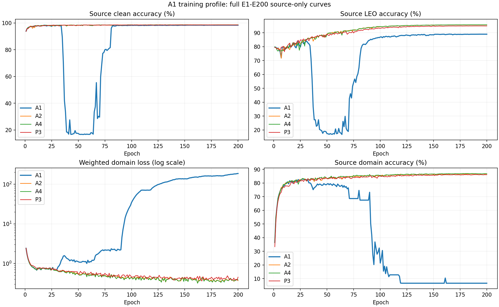

# A1全面分析：clean优势、LEO代价与训练稳定性

分析日期：2026-09-07。状态：ANALYZED，基于已封存的E200结果；本次不重训、不重新评测、不修改默认配置。

A1的clean优势真实存在于已完成测试中，且不是只靠一个接收机抬高平均值。相对同批A4，clean提高3.314个百分点、7个接收机中6个改善，训练时间只多约23分钟。如果clean与LEO等权，A1的描述性综合准确率78.256%高于A4的77.347%和P3的77.930%。因此不能沿用“LEO更高所以综合更好”的判断。

但A1同时有两项未解决风险：LEO下最弱接收机明显退化；训练经历身份识别崩塌后恢复以及域分类支路持续失衡。合理定位是“有价值的clean优先候选和待解释的异常训练案例”，还不是已验证稳定、可默认部署的方法。

## 证据范围

本次重新完整解析A1～A7和P3共1600条E1—E200 JSONL记录，读取对应CSV全部1600行，扫描48份完整训练/评估日志共72440行，核对32份最终场景JSON的计数、E200身份和strict reconstruction，以及224个接收机×场景单元。全部原始字段数值极值和非零轮数在analysis.json；所选诊断曲线的1600行在full_curves.csv。

原始数据目录：`E:/type10-7/local_artifacts/adv3b02_two_batch_report_20260905`。A1有效run为`phase1_adv3b02_daot_stn_a1_a7_manysig_s392005_20260902_r3/ADV3B02_DAOT_STN_A1_MANYSIG_S392005`。本次无远端操作；不把历史进程快照当作当前监控。

以项目现行科学协议为解释边界，并检查历史提交72360e49ceb6a4f2a9e2e1235e5eea6784d07685的训练loss装配：域分类加权项确实进入labeled主目标。本次没有根据target结果进行参数选择或训练修改。

## 1.clean性能的价值有多大

A1最终clean为143382/168000=85.346429%，错误24618条。此处clean是未附加LEO模拟扰动的真实地面接收IQ，仍包含原始接收机/传播效应，不是理想无噪声信号。目标RX全部未用于该轮训练；日期混合包含未见Day0和共享日期，不能把总数都称为严格未见日期泛化。

|对照|对照clean%|A1提升/百分点|A1额外识别正确条数|A1的LEO差值/百分点|
|---|---:|---:|---:|---:|
|A2|82.034|+3.313|5565|-1.262|
|A3|81.743|+3.604|6054|-1.367|
|A4|82.032|+3.314|5568|-1.496|
|A5|81.052|+4.295|7215|-0.989|
|A6|80.746|+4.600|7728|-1.182|
|A7|81.616|+3.730|6267|-1.503|
|P3|83.167|+2.180|3662|-1.528|

A1相对A4将clean错误数减少18.45%，这比“准确率多3.3点”更能表达实际价值。168000条测试给出了明确的该次运行描述，但样本有接收机/日期/发射机相关性，不能把它们当168000次独立训练重复。只有一个seed且无逐样本配对预测，不能据此给出可靠的训练间显著性结论。

## 2.优势是否集中在个别接收机

下表的LEO为同一RX三场景等权均值，RX名称是接收机而非TX类别。

|RX索引/名称|A1 clean%|A4 clean%|clean差值/百分点|A1 LEO%|A4 LEO%|
|---|---:|---:|---:|---:|---:|
|0 / 1-1|87.583|82.579|+5.004|75.860|76.383|
|2 / 14-7|90.496|77.825|+12.671|66.276|62.917|
|5 / 2-1|93.875|92.425|+1.450|82.815|84.103|
|7 / 20-1|74.871|70.133|+4.738|55.306|62.538|
|9 / 7-14|82.754|82.679|+0.075|74.438|71.765|
|10 / 7-7|86.938|90.546|-3.608|72.850|80.232|
|11 / 8-8|80.908|78.037|+2.871|70.612|70.692|

clean在6/7个RX改善；最差clean也由70.133%提高到74.871%。RX2贡献3041条额外正确，占净增5568条的54.62%，所以优势有集中性但不完全依赖它；排除RX2后，其余六个RX总体仍提高约1.755个百分点。RX10是反例，不能写成所有接收机全面改善。

LEO损失尤其集中在RX7和RX10，相对A4分别下降约7.232和7.382个百分点；RX2和RX9的改善抵消了部分损失。因此总体LEO只低1.496点，掩盖了局部7点以上的损失。对有最低接收机服务要求的系统，这比平均值更重要。

## 3.LEO和综合性能如何权衡

|指标|A1|A4|P3|
|---|---:|---:|---:|
|Clean准确率%|85.346|82.032|83.167|
|LEO clear%|72.814|73.492|73.564|
|LEO low-elev%|70.415|72.086|72.162|
|LEO rain%|70.266|72.405|72.353|
|LEO均值%|71.165|72.661|72.693|
|最差LEO场景%|70.266|72.086|72.162|
|最差RX×LEO场景%|54.862|62.008|62.304|
|Clean/LEO各50%的描述性均值%|78.256|77.347|77.930|

A1 clean到LEO均值下降14.181个百分点，A4下降9.371点，P3下降10.473点。这支持“A1对新增LEO扰动更敏感”的观察，不能单凭此证明它利用了哪种伪特征。

为了明确偏好而非制造新官方指标，令解释性效用`S=w*clean+(1-w)*LEO_mean`。按冻结结果，A1超过A4的临界clean权重为31.10%，超过P3为41.21%。这些阈值只说明偏好改变会改变取舍；没有包含尾部、稳定性和费用，也不是任务真实信道占比或新预登记指标。

若把clean和三种LEO当四项各25%，clean权重只有25%；此时A1约74.710%、A4约75.004%、P3约75.312%。这解释了“clean与LEO平衡”为什么必须先说明是两大类等权还是四场景等权。没有依据选一个权重宣称绝对冠军。

## 4.A1实际是什么方法

它从同一ADV3B02 CORE90 checkpoint初始化，再训练200轮（130+70），并非只训练clean，也不是从随机初始化开始。source池90000，L_s=6300、U_s=56700、单一V=27000。学生保留clean与LEO监督主链。

A1增加clean+medium两个fresh EMA教师视图，使用均值聚合；A2增加第三个hard视图；A3再加部署加权鲁棒球面聚合；A4再加局部tangent约束。A1的额外orbit feature和logit损失E21开始非零；tangent、fingerprint目标关闭，nuisance目标权重为0。结构上存在nuisance头且可能导出raw loss，不代表该目标参与优化。orbit prototype配置权重0.20，但200轮原型蒸馏loss全为0；relation关闭。不能把它们解释成A1 clean优势来源。

可以提出的机制假设是：两视图均值目标对原始clean身份信息施加的额外不变性压力较小，可能保留了有益细节；hard视图加入后，LEO稳健性与clean可分性存在取舍。但本次没有同配置A0，且A1发生独特的优化异常，不能证明clean收益来自“两视图”单一机制，更不能把训练崩塌说成有益正则化。

## 5.完整训练曲线揭示的两个异常

图中的准确率全部是source验证曲线，不是target逐epoch表现。target只在最终E200评测；不存在证据称E40 target同样崩塌或某个早期target更优。

|epoch|source clean%|source LEO%|加权域分类loss|source域分类准确率%|总loss|
|---|---:|---:|---:|---:|---:|
|20|97.807|79.920|0.728|81.111|3.666|
|30|98.289|83.711|0.712|82.615|4.248|
|40|18.344|22.662|1.312|77.959|16.490|
|60|16.770|17.569|1.064|79.207|17.940|
|80|81.615|64.821|2.065|74.593|16.463|
|94|98.230|85.720|14.206|20.281|22.589|
|130|98.337|88.380|109.626|6.667|134.355|
|200|98.385|88.954|186.222|6.667|223.211|

第一阶段是身份识别崩塌：最低source clean为E55的16.670%，最低source LEO为E64的16.735%，均接近六类机会水平。它发生在E21开始orbit ramp之后，但先后关系不是充分因果证据；E30仍正常，故不能简单说“开启立刻崩塌”。A2/A4/P3没有同类全曲线断崖。

教师共识也不能单独作为可靠性证明：A1在E56达到99.296%的教师共识率，恰好处于识别接近机会水平的时期。它支持“多个视图可能一致地错”的警示；由于缺乏该时刻预测直方图，不能断言全部预测为某一类，也不能计算教师真实正确率。

第二阶段是域分类支路失衡：加权域loss在E93首次超过10，E127首次超过100，E200达到186.222，占总loss的83.43%。A4对应loss仅0.384、域准确率86.785%；A1域准确率为6.667%，接近15域机会水平。域分类与身份分支上的对抗域目标是不同项，不能把“域准确率低”一概解释成成功去域。尤其有巨大域分类loss时，更应检查分类支路/表征竞争及梯度流，而非宣布学到了理想不变性。尚缺域logit分布、梯度历史与最初异常算子的证据，不能锁定具体根因。

后期source身份准确率相对稳定：最后20轮clean为98.381%～98.411%，LEO为88.830%～88.972%。这支持该单次运行末期指标稳定，不证明域支路正常，也不证明换seed还能恢复。A1有30轮出现非有限梯度batch跳过，单轮最高3.153%；无非有限loss batch跳过，扫描未发现Traceback/OOM等终止错误。终态身份任务有效和全程优化健康必须分别表述。

## 6.训练成本和部署边界

A1本次E200训练墙钟25.030小时，峰值allocated约2.787GiB、reserved约4.565GiB，参数1130809个。A4为24.647小时：A1多0.383小时约23分钟；P3为39.010小时：A1少13.980小时约35.84%。当前三seedA_POINT均值40.485小时、TANGENT47.131小时，A1显著较短，但跨批并发状态不同，不能解释为隔离算法加速比。

25.030小时不含继承的CORE90预训练成本，不是完整从零训练成本。模型参数量与同批其他行相同；训练教师和辅助目标成本不能直接转成部署延迟。尚无统一单样本部署延迟、能耗测量；不能据此宣称A1推理更快。

当前MATCHED_ZERO三seedclean82.560%、LEO72.393%、21.777小时。A1 clean描述性高2.786点，LEO低约1.227点，多约3.253小时。跨批次的LEO模拟seed和覆盖口径不同：早期每场景168000条、评估sat_seed=392005；本轮每physical分配一个LEO场景、三场景合计168000条、sat_seed=2027。因此这只是背景参照，最可信的成本性能比较优先用同批A2/A4。

## 7.当前能下什么结论

- clean优先：A1的高均值、更高clean接收机下界和较低训练成本值得认真保留；此前只按LEO给出综合优先级不充分。
- 目标是LEO弱信道均值或最低接收机表现：A1目前有明确代价，不能把85.346%带到卫星场景宣称同等效果。
- 科学机制：A1是单seed、无A0、带训练异常的冻结结果。两视图保真、优化轨迹变化、去域机制异常均是待区分假设。
- 稳定复现：本次结果不足；未来若另行授权研究，应以source证据预登记验证方案，先解释异常，再考虑同预算多seed，并使用未被当前结果反馈污染的确认安排。不要承诺“修复域头就能保留85.346%同时补齐LEO”。

本次没有逐TX混淆矩阵、逐天/Day0结果、逐样本预测、置信度校准、Phase2适配/注册和unknown数据。已存最终指标只按RX聚合，不能补造这些细节，不能用RX下界代替最差类别准确率。未读取大checkpoint张量或启动补测；已有checkpoint严格重建评估身份可由归档JSON核实。

## 附件与复现

- analysis.json：8行全部数值字段摘要、配置、资源、完整日志标记位置和比较。
- full_curves.csv：8行×200轮所选诊断字段，1600行。
- receiver_details.csv：8行×4场景×7RX，224行含正确数/总数。
- tradeoffs.csv：7组A1配对描述和clean权重临界值。
- training_curves.png：A1/A2/A4/P3全E200曲线。
- 生成入口：Git承载面tools/analyze_a1_profile.py；使用ssr-gpu Python运行，无远端依赖。原始日志/checkpoint不重复打包、不修改。

交付状态和完整提交OID以最终Git远端独立读回为准。
