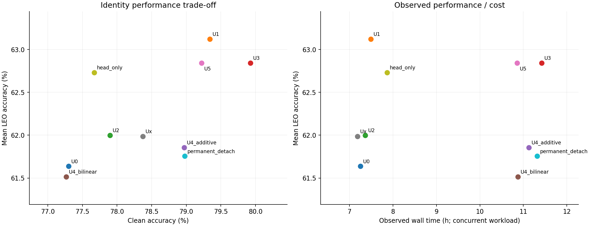
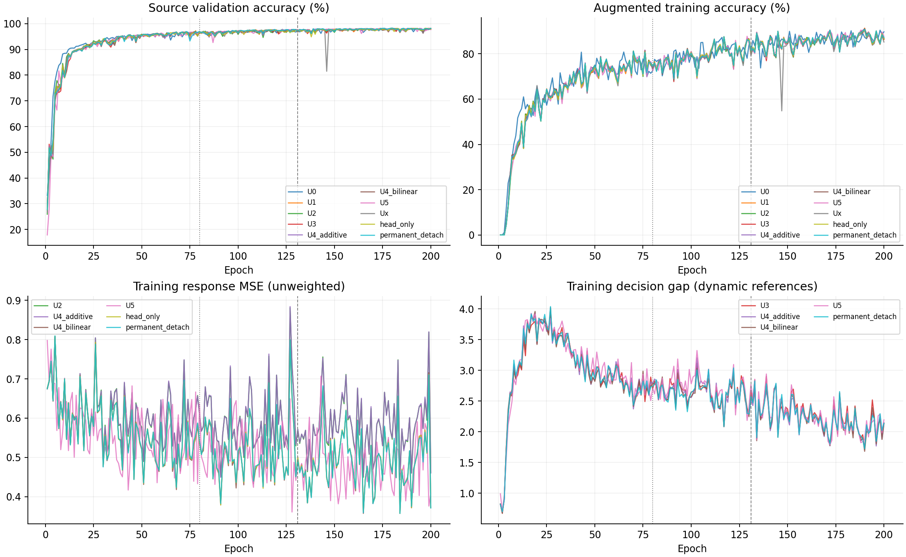

# ADV3B02 CORE90交叉响应：完整实现、验证与十变体实验报告

实验：`core90_cross_response_s392005_20260911_r1`。结果截止：2026-09-11 14:44（UTC+8）。本报告覆盖已提供设计报告的全部实现范围、正式发布版本、十项E200实验、完整日志、四场景独立评分及科学解释。

## 1.结论与阅读范围

本轮完成了完整交叉块、双向供体排除、固定真实统计、加性/低秩双线性响应预测、实际分类裕量保护、逐损失梯度路由、覆盖反馈、状态续跑和部署移除辅助等实现。设计追踪CR01—CR20均有本地验证；正式十项实验完成E200、final checkpoint、四场景预测固定及独立评分。实现验收通过和实验产物完成，不等于科学方案胜出。

在本次seed392005下，U3总体clean最高（79.9268%），U1三LEO均值最高（63.1215%）。U3相对U1改善clean和未知日期最弱RX下限，但LEO总体均值下降0.2803个百分点。响应任务确实进入了主干，双线性预测也确实更好地拟合了源查询统计，但U4_bilinear的身份表现没有因此改善。U5相对U4_bilinear恢复性能，仍未超过U1的总体clean/LEO均值。

完整联合方案当前不能晋级为默认。U4_additive的匹配双因素差值为clean+0.4848、LEO均值+0.1394个百分点，是小幅正的单seed描述；不是显著协同，也不代表超过最强单任务。U4_bilinear与U2的预测器容量不同，不能套用同一公式宣称纯任务协同。

本报告区分五种证据：设计要求、代码实现、本地行为验证、正式运行的实际激活、最终身份性能。可选自相关/IQ/事件统计、交互重加权和增K虽有实现测试，本次正式矩阵并未启用。所有“完整”均限定在已提供设计和本次十变体范围，不包含未提供的前序附件、不包含多seed或Phase2/Phase3实验。

## 2.研究问题与ADV3B02继承边界

研究对象是Phase1地面弱标注跨接收机域泛化。ManySig为地面代理数据，LEO_WEAK为物理启发的信道压力代理，均不是实测在轨数据。核心问题是：在保留ADV3B02身份/域双主干的同时，能否通过可复用TX/RX描述预测真实交叉观测，再用分类裕量保护与覆盖反馈改善身份泛化？

### 2.1为何不用“双分支交互都压零”

完整等权网格的交互为`P×(M)=M−TX行均值−RX列均值＋总均值`。即使两支都输出`[TX信息,RX信息]`，其加性交互仍可为零；因此交互为零不是解耦证据。四元“三角相加预测第四角”也只是交叉差分的代数改写，不作为额外重构创新。

本实现选择不同职责：身份分支维持TX判别；域分支的小型响应读出提供跨TX复用的接收响应；受限预测器解释真实统计。身份全维交互压零单列为Ux反证对照，不混入联合主方案。

### 2.2保留的骨干和基本训练

方法语义恢复自CORE90历史训练快照和技术报告，采用lite_d双主干、身份`feat_joint`、域`feat_imp`及160维输出。保留Sinc/时频/PA特征路径、身份与域分工、CosFace分类、域保留与GRL对抗、FISHR、原型和尾部几何、proxy unknown、soft mixup、source episode及EMA伪标签。实际可训练共享参数按对象身份识别；正式激活报告列出的共享参数是Sinc的`low_hz_`和`band_hz_`。历史文字中的共享前端不能替代实际参数分组。

本次不叠加A1、DAOT、旧ECRS、MUSE、CRRA等后续机制。历史loss文件隔离保留，适配器局部绑定。45个旧顶层loss函数/类中38个与当前版本相同、7个已漂移；恢复了历史three_sigma半径、proxy helper和PrototypeMemoryBank语义，未偷偷修正旧原型项的既存无梯度性质后再称为原基线。

U0是当前合法契约下的匹配方法基线，不能称历史逐位复现：旧快照未独立完整保存模型及公共数据默认文件，训练比例和选模规则也发生了明确协议调整。旧CORE90的`best_joint_safe_ssdg.pth`没有加载，本次所有模型、EMA与原型均从本run建立。

### 2.3当前协议调整

历史launcher的`.10/.70/.20`和`joint_safe`周期测试选模不继承。本次使用L_s/U_s/V=`.07/.63/.30`、source-only、固定E200最终checkpoint；`clean_val_tx`只作源验证遥测。目标RX/day不用于梯度、校准、阈值或checkpoint选择，最终预测固定后独立连接truth。历史分数不能与此次分数直接相减构成方法提升。

## 3.数据契约、预算与评价定义

|项目|本次实际设置|
|---|---|
|数据包|已有`Dataset_WigSig/ManySig.pkl`，equalized记录；未重新采集或生成新的原始数据包|
|模型seed/data_seed|392005/392005，字段独立但本次值相同|
|源RX|1、3、4、6、8|
|源日期|1、2、3|
|未知RX|0、2、5、7、9、10、11|
|未知日期|0|
|类别|6个TX，内部索引0—5|
|源池角色|L_s=6300，U_s=56700，V=27000；物理ID互斥|
|标注率|6300/(6300+56700)=10%；相对整个源池L_s占7%|
|单个TX/RX/day/eq源单元|L_s=70、U_s=630、V=300，预检按逐格可行性核对|
|初始化与选模|scratch-only，空baseline_ckpt，无外部teacher/resume，final-only E200|
|训练预算|200epoch；label130＋pseudo70；clean batch128，每epoch49步，总9800计划步|
|普通学习率|AdamW lr=0.0002、weight_decay=0.0001；其余调度按冻结配置|
|目标场景|clean、leo_clear_weak、leo_low_elev_weak、leo_rain_weak|

源训练角色是真标签可见的L_s与真标签隐藏的U_s。U_s接口返回y=-1，只保留必要物理定位元数据，不把TX真值用于伪标签正确率诊断。V只有一个源验证角色，历史内部字段`ssdg_source_v_select`不代表另拆V_cal/V_select。

每个变体每场景198000条独立物理记录，其中未知日期/已见RX30000、已见日期/未知RX126000、未知日期/未知RX42000，三组互斥。四个场景使用对应物理记录的不同评估视图：每变体792000条预测不等于792000个不同原始物理样本。十模型合计7920000条预测也不是独立训练重复次数。

准确率=正确数/总数×100；Macro-F1为六类F1算术平均；LEO均值为三个等样本量场景准确率的算术平均。弱RX下限在未知RX集合内取最小值，分别报告已见日期和未知日期。不同模型的最弱RX可能不同，表中同时列出RX编号。全部差值以百分点表示。

1480行评分CSV包含多个命名组和别名；不能直接把全部行的总数相加。总体按上述互斥组汇总，逐RX/逐类表是同一批记录的不同切片。所有场景均是六类已注册TX识别，不能据此宣称真实未知类拒识。

## 4.完整实现：从交叉记录到一次优化更新

```text
合法L_s物理记录与TX/RX/day/condition
  →完整TX×RX×K块＋角色轮换＋MixStyle允许来源mask
  →复用原clean/LEO双主干前向
  →身份特征、域特征、实际分类特征
  ├─双向供体读出→加性/双线性真实统计预测→响应梯度路由
  ├─同TX其他RX可靠参照→单侧分类裕量损失
  └─Ux独立对照：身份交互压零
  →保留基线梯度并合成辅助贡献→有限性检查→一次optimizer更新
  →按原时机更新EMA/原型→成功步提交覆盖与历史反馈
```

### 4.1完整交叉块与角色隔离

`schema.py/sampler.py/roles.py`将记录组织为P4×Q4×K2，单块32条、每批4块，维持原128条batch与49步/epoch。K指唯一物理记录，多view不能增加K。缺单元、重复ID、条件冲突或记录不足不允许复制/补零伪造矩形；正式数据未出现块缺失。

TX和RX各拆2＋2：查询为Y_Q×R_Q；TX描述来自Y_Q×R_S，RX描述来自Y_S×R_Q。查询自己的特征不能进入响应预测器。角色在不同step轮换，不为角色重新运行主干。采样候选池上限128，是有界元数据搜索，`candidate_search_complete=false`，不是遍历所有可能矩形的全局最优采样。

同TX不代表同包同步接收。第一版按day/condition比较统计，不做逐点IQ配对重构。MixStyle在前向前限制合法供体来源，避免查询经风格统计间接流入供体；若模型含BatchNorm则固定源统计，当前正式模型报告的需处理BatchNorm层列表为空。U1—U5等启用交叉组织的行共享该隔离，U0保持原组织，因此U1−U0不能只归于一个采样因素。

### 4.2真实统计与源尺度

`statistics.py`从模型RMS归一化之前的接收IQ计算固定8频带FFT能量，以总能量归一后取log；epsilon固定1e-8。每个查询单元按K条独立记录分别计算后求均值。目标stop-gradient，不能用网络中心代替真实观测。

尺度使用固定seed抽取至多1024条合法源训练记录拟合location/scale后冻结，不读取目标数据。自相关lags[1,2,4]、IQ二阶矩和事件窗口统计均已实现测试，但本次target_family=fft；事件统计依赖真实事件ID和窗口，当前不能声称有同步事件证据。

### 4.3双向响应读出与受限预测

`readouts.py`把身份/域160维特征分别线性读出为16维t_y和d_r，再在合法供体上均值聚合。同一TX描述跨查询RX复用，同一RX描述跨查询TX复用，不使用TX/RX编号embedding或单元查表。

加性预测：`mu_hat=b+A_T t_y+A_R d_r`。

双线性预测：`mu_hat=b+A_T t_y+A_R d_r+U[(B_T t_y)⊙(B_R d_r)]`，rank=4，全部组合共享参数。新增辅助参数加性5416、双线性5576；这不是第三套主干。

L_resp是标准化统计空间逐单元/维度均方误差。双重中心化同时记录TX/RX主效应误差、真实/预测交互误差；加性预测交互为零，真实交互不必为零。交互误差重加权实现但本次权重0，不能把诊断量计为额外优化目标。

### 4.4实际分类裕量保护

`decision.py`在同次前向的`aux_id.feat_joint`上调用原分类头`labels=None`，保留部署scale、排除训练标签margin修改。对样本i及所有竞争类b，`m_i,b=logit_y−logit_b`。参考限定同TX/day/condition、其他RX和物理ID、预测正确且裕量为正；每RX至少2条独立有效记录，先RX内均值，再RX间中位数，至少1个合格RX。参考与mask均detach。

`L_dec=mean_valid([m_ref−delta−m_i,b]_+²)`，本次delta=0、lambda_dec=0.01。较弱样本被推动扩大判别裕量，强于参考者不受拉低约束，无可靠参考时返回可微零。决策参照使用整块其他RX，不受响应查询象限限制。

梯度进入真实身份分类路径，可以到达身份前部/共享前端；响应专用门控与0.1上限不限制L_dec。训练特征仍可能含Dropout/MixStyle，因此准确表述是“训练特征上的推理语义分类头裕量”。U3只启用这项新增损失，不训练响应预测器、不做反馈采样或身份交互压零。

### 4.5逐损失梯度、自然开放门与AMP

总任务形式为`L_base+lambda_resp L_resp+lambda_dec L_dec`，Ux则单独使用`L_base+lambda_cross L_cross`。三项lambda配置均为0.01，但必须结合开关判断是否生效。

响应预热时身份读出输入detach，响应贡献只进入辅助头与域专属层。共享参数按对象身份排除，域响应不经过GRL。源验证每epoch取16块，响应MSE/固定源常数MSE≤0.95且连续3次达标后，门锁存开放；开放后不因单次变差自动关闭。加性参照用于机制比较，不是当前门的第二项判据。

开放后仅向`id_backbone.cls_head`范围的身份尾部加入响应梯度；共享/身份前部仍不接收响应贡献。响应身份梯度范数以真实身份监督梯度为参照，上限0.1；参照近零时不给辅助无限放大机会。基线和决策梯度保留，最终一次optimizer.step。

AMP在autograd之前缩放，诊断/裁剪在未缩放口径进行。历史proxy角度链路在fp16下出现持续非有限，适配层改为FP32损失代数，公式和权重未变；该修复同时用于U0与全部变体。失败步不增加成功覆盖/反馈，不将数值失败当性能差而选择性重跑。

### 4.6覆盖、反馈与U5

`coverage.py`记录联合TX对×RX对×day/condition及供体→查询的定向迁移；分别保留成功次数、唯一物理记录和最近步数。不是只统计边缘TX/RX频次。

U1—U4及对照使用均匀候选抽样。U5把历史响应误差、可靠决策缺口与覆盖增益合成评分：可靠性先按噪声折减，各误差clip至10，按记录/view成本归一，加有限K的方差收益项；基础探索epsilon=0.1。实现中覆盖增益也乘可靠性权重，是对原报告方向的显式工程具体化。alpha=beta=1，每20步提交一次，历史按0.8旧＋0.2新均值更新。不预跑候选主干。

本次K菜单只有[2]，cost_views=1对应clean辅助任务；不能声称运行中自适应增加K。概率改变训练分布，没有无偏重要性校正声明。正式末态各行覆盖量饱和相同并不证明采样过程相同；U5的配置、非均匀选择概率及历史记录才是反馈执行证据。

### 4.7续训、部署和失败隔离

`integration.py`保存辅助头、尺度、门、sampler、coverage/history和RNG，配合原模型/EMA/optimizer/scaler/原型/伪标签状态支持确定性续跑。本方法的resume入口检查变体、配置、数据角色和物理文件身份，拒绝未知来源、变体错配或final checkpoint冒充resume。本次正式实验没有使用resume。

辅助模块独立于部署model保存；部署仅加载原身份模型，不要求目标RX供体、不调用统计预测器、不做目标query拟合。部署移除回归证明输出一致，不代表已测星上延迟或能耗。

矩阵生成器只产出argv；dispatcher拥有唯一run、排他目录/锁、实时显存准入和启动预留，第一步source-only scratch checkpoint预检通过才派发行。训练脚本与CWD固定到不可变release，避免误跑远端根目录旧代码。inspector只读核对/proc、完整argv（保留空参数）、GPU与日志。故障不覆盖产物、不自动回退旧权重、不干预其他实验。

## 5.十个变体及可归因比较

|变体|交叉组织|响应预测|决策保护|身份交互压零|反馈|响应身份梯度|
|---|---|---|---|---|---|---|
|U0|关|关|关|关|关|无|
|U1|开|关|关|关|关|无|
|U2|开|加性|关|关|关|自然门后受限|
|U3|开|关|开|关|关|无；有决策梯度|
|U4_additive|开|加性|开|关|关|自然门后受限|
|U4_bilinear|开|双线性|开|关|关|自然门后受限|
|U5|开|双线性|开|关|开|自然门后受限|
|Ux|开|关|关|开|关|无；有交互梯度|
|head_only|开|双线性，仅辅助头|关|关|关|永久无；主干仍做基线训练|
|permanent_detach|开|双线性|开|关|关|永久无；域/辅助仍接响应|

U1−U0估计组织与必要隔离的组合变化；U2−U1、U3−U1、Ux−U1分别观察响应、决策、交互压零；U4_additive−U2−U3＋U1是匹配容量的双因素差值；U4_bilinear−U4_additive包含容量/函数族改变；U5−U4_bilinear观察反馈分布变化；U4_bilinear−permanent_detach观察开放身份响应的作用。相同seed不保证不同CUDA并发、开关和梯度路径具有逐位相同轨迹，单seed差值仅作描述。

## 6.本地验收、修复与正式发布

本地验证覆盖数学恒等式、物理去重/缺角负测、供体扰动隔离、真实分类裕量、逐损失梯度、AMP、严格checkpoint、全部开关到真实CUDA入口、确定性续跑及部署输出。普通pytest最终汇总84通过、13项耗时测试按设计跳过；这些耗时范围另通过独立CUDA/部署脚本完成，不能把84＋后续定点测试简单相加为互不重叠测试数。

实际十变体合成入口各执行2epoch/2次更新，覆盖所需分支；合成测试用宽松响应门仅用于命中开放分支，从未写入正式配置。合成四场景评分使用8条记录、32条预测，不能代替正式性能实验。U0关闭回归的模型/EMA/optimizer/scaler/原型/RNG及121项基础指标零容差一致；U5确定性续跑对完整状态零容差一致。

|发现的问题|修复与证据|正式影响|
|---|---|---|
|当前通用loss与历史B02语义漂移|隔离原loss与适配绑定；loss/梯度/单步回归|全部行使用同一恢复基线|
|历史proxy几何在AMP下持续非有限|保留FP32损失代数；真实U0/U4各15/16有效更新|允许首步scaler回退，不改变科学公式|
|U_s旧路径可读真标签用于诊断|接口y=-1和元数据白名单；禁止pseudo_correct真值统计|正式U_s真值隐藏|
|dispatcher入口/CWD可能指向远端旧代码|固定release CODE路径，相关定点测试|正式argv/CWD独立读回匹配|
|源K可行性只看聚合可能漏day/eq缺格|按TX/RX/day/eq逐格核对与完整块检验|源预检PASS|
|检查器过滤argv内部空字符串|只去掉末尾NUL，重取只读快照|未重启训练，空baseline参数可核对|
|双线性双因素差值存在容量混杂|分析限制纯双因素为U4_additive|不把双线性差分宣传为纯协同|

发布前完成一次独立P0/P1正确性审查及原问题定点复核，无新增确定阻断。source-only真实预检构造随机模型、保存并严格重载checkpoint、比较源样本前向及梯度；预检权重不进入正式训练，未构造目标loader或前向目标IQ。

正式代码提交为`54afc2bce417de321bd639059f8087ab51436f8e`，归档SHA256为`a96d2f2db7f717d823d646c6df73173028e98980a0494d9f5673b7fa58c82f83`，本地/远端一致且远端compile通过。2026-09-11约02:14（UTC+8）启动十行，PID/PPID、release CWD、完整argv、GPU UUID及日志增长均已独立核对。

用户允许本次总训练进程超过2/GPU；本队列每卡最多新增2行，最少6500MiB空闲并计启动预留，不停止其他健康任务。所有行完成后，半小时检查任务core90-3暂停。具体发布命令、环境、路径及逐checkpoint索引见报告后部；历史早期报告中的“未启动/尚无E200”是当时状态，以本报告最终快照为准。

## 7.统计解释规则

本次一套model/data seed、十个变体，不能用198000个测试样本替代独立训练seed。没有多seed置信区间、显著性检验或性能晋级。目标分数仅描述冻结矩阵，不作为此次调参、候选重排、选择性重跑或新一轮启动依据。

既有预测审计逐条核对ID、角色、scene/seed、六类有限logits及覆盖，再读固定truth复算；本次总报告复用该已完成审计，并重新完整解析十项2000轮日志与全部stdout，不再次执行目标模型推理。所有分组计数一致，未将可选机制未启用解释为故障。

后续表中的源响应MSE、身份尺度、决策缺口和覆盖均为机制证据；只有最终身份评分能说明本次识别表现。`auxiliary_step_seconds`从交叉batch到优化提交，包含主训练计算，绝不是纯辅助模块耗时。`forward_calls`是记录的有标签前向计数，不包含整个训练所有teacher/无标签/验证前向。通用resource summary可能不含外置辅助参数，需与activation中的auxiliary_parameters一起报告。


## 8.身份性能与成本概览





图中为固定E200终态，同机并发墙钟不用于隔离效率结论；图和后续全表来自同一份已复核评分。


## 总体准确率

|变体|clean|晴空LEO|低仰角LEO|雨衰LEO|LEO均值|clean−U0|LEO均值−U0|
|---|---:|---:|---:|---:|---:|---:|---:|
|U0|77.3005|62.8434|60.7929|61.2742|61.6369|+0.0000|+0.0000|
|U1|79.3389|64.6960|62.2025|62.4662|63.1215|+2.0384|+1.4847|
|U2|77.8970|63.6975|61.0778|61.2172|61.9975|+0.5965|+0.3606|
|U3|79.9268|64.3197|62.0323|62.1717|62.8412|+2.6263|+1.2044|
|U4_additive|78.9697|62.8864|61.0510|61.6323|61.8566|+1.6692|+0.2197|
|U4_bilinear|77.2657|62.6763|60.6758|61.1884|61.5135|-0.0348|-0.1234|
|U5|79.2192|64.5146|61.8818|62.1323|62.8429|+1.9187|+1.2061|
|Ux|78.3717|63.3652|61.2369|61.3561|61.9860|+1.0712|+0.3492|
|head_only|77.6712|64.3253|61.8672|62.0010|62.7311|+0.3707|+1.0943|
|permanent_detach|78.9763|62.9697|60.9652|61.3308|61.7552|+1.6758|+0.1184|

U0：原基线；U1：完整块采样/交叉前向对照、不加附加任务；U2：响应；U3：决策；U4_additive/U4_bilinear：加性/双线性响应＋决策；U5：双线性联合＋反馈调度；Ux：身份交互；head_only：只训练响应辅助头；permanent_detach：响应对身份永久detach、保留决策。

## 三种泛化子集

### 未知日期、已见RX

|变体|样本数/场景|clean|晴空LEO|低仰角LEO|雨衰LEO|
|---|---:|---:|---:|---:|---:|
|U0|30000|91.6833|77.9367|74.4633|75.5367|
|U1|30000|92.6967|79.2633|75.6433|76.0000|
|U2|30000|92.3600|78.3433|74.5867|74.9100|
|U3|30000|93.6233|79.5533|75.7033|76.4967|
|U4_additive|30000|92.9500|78.1333|74.8433|75.6767|
|U4_bilinear|30000|92.3067|78.7100|75.0567|76.1400|
|U5|30000|93.1100|79.7333|75.5267|76.0700|
|Ux|30000|93.8033|78.2200|74.7233|75.0967|
|head_only|30000|91.9200|77.9867|74.6367|74.9267|
|permanent_detach|30000|93.4033|78.5533|75.4467|76.1000|

### 已见日期、未知RX

|变体|样本数/场景|clean|晴空LEO|低仰角LEO|雨衰LEO|
|---|---:|---:|---:|---:|---:|
|U0|126000|74.9690|60.4206|58.6063|59.0897|
|U1|126000|78.0556|62.5492|60.2905|60.6841|
|U2|126000|76.6833|61.5714|59.1825|59.3690|
|U3|126000|78.2833|62.0190|60.0183|60.1675|
|U4_additive|126000|77.3698|60.7905|59.1952|59.8881|
|U4_bilinear|126000|74.8611|60.1802|58.5413|59.0468|
|U5|126000|77.6802|62.5532|60.2127|60.3579|
|Ux|126000|75.8500|61.0437|59.2659|59.4381|
|head_only|126000|76.1444|62.4905|60.1730|60.4230|
|permanent_detach|126000|77.2063|60.5579|58.7040|59.2000|

### 未知日期、未知RX

|变体|样本数/场景|clean|晴空LEO|低仰角LEO|雨衰LEO|
|---|---:|---:|---:|---:|---:|
|U0|42000|74.0214|59.3310|57.5881|57.6405|
|U1|42000|73.6476|60.7310|58.3381|58.1452|
|U2|42000|71.2071|59.6143|57.1143|56.9810|
|U3|42000|75.0738|60.3405|58.3095|57.9524|
|U4_additive|42000|73.7833|58.2833|56.7667|56.8333|
|U4_bilinear|42000|73.7357|58.7119|56.8071|56.9333|
|U5|42000|73.9143|59.5286|57.1429|57.5000|
|Ux|42000|74.9143|59.7190|57.5167|57.2952|
|head_only|42000|72.0738|60.0714|57.8286|57.5024|
|permanent_detach|42000|73.9810|59.0738|57.4048|57.1738|

## 预登记对照差值

|对比|clean|晴空LEO|低仰角LEO|雨衰LEO|LEO均值|
|---|---:|---:|---:|---:|---:|
|U1−U0：采样/前向对照|+2.0384|+1.8525|+1.4096|+1.1919|+1.4847|
|U2−U1：增加响应任务|-1.4419|-0.9985|-1.1247|-1.2490|-1.1241|
|U3−U1：增加决策任务|+0.5879|-0.3763|-0.1702|-0.2944|-0.2803|
|U4_additive−U2−U3+U1：匹配加性双因素|+0.4848|-0.4348|+0.1434|+0.7096|+0.1394|
|U4_bilinear−U4_additive：改为双线性|-1.7040|-0.2101|-0.3753|-0.4439|-0.3431|
|U5−U4_bilinear：增加反馈调度|+1.9535|+1.8384|+1.2061|+0.9439|+1.3295|
|U4_bilinear−permanent_detach：允许响应进入身份后部|-1.7106|-0.2934|-0.2894|-0.1424|-0.2418|
|Ux−U1：增加身份交互|-0.9672|-1.3308|-0.9657|-1.1101|-1.1355|

上述均为同seed描述性差值，无跨seed置信区间。仅U4_additive−U2−U3+U1是匹配容量的双因素对照；U4_bilinear不能用同一公式声称纯任务协同。即使一个对照差值为正，也不意味着该变体超过最强单任务或采样对照。

## Macro-F1

|变体|clean|晴空LEO|低仰角LEO|雨衰LEO|
|---|---:|---:|---:|---:|
|U0|77.0701|62.7646|60.5385|61.0654|
|U1|78.7139|64.8155|62.3965|62.5774|
|U2|77.3395|63.8825|61.2464|61.2908|
|U3|79.6519|64.5322|62.1917|62.2644|
|U4_additive|78.5112|63.1575|61.2607|61.7782|
|U4_bilinear|76.8635|63.0200|60.9531|61.4125|
|U5|78.8364|65.0157|62.2693|62.4085|
|Ux|77.7118|63.0937|60.8400|60.9015|
|head_only|76.8699|64.5108|62.0953|62.1448|
|permanent_detach|78.5959|63.3159|61.2504|61.5142|

## 弱接收机下限

仅在未知RX集合0/2/5/7/9/10/11内计算；每格为最低准确率及对应RX。已见日期子集每RX18000条，未知日期子集每RX6000条。

### 已见日期

|变体|clean|晴空LEO|低仰角LEO|雨衰LEO|
|---|---:|---:|---:|---:|
|U0|55.8222（RX2）|39.3222（RX2）|39.6833（RX2）|39.8500（RX2）|
|U1|62.1667（RX2）|40.2056（RX7）|39.7167（RX7）|40.2000（RX7）|
|U2|59.5944（RX2）|40.3056（RX7）|40.0500（RX7）|40.3667（RX7）|
|U3|64.7389（RX2）|40.4000（RX7）|40.0500（RX7）|40.3111（RX7）|
|U4_additive|60.5056（RX2）|38.7722（RX7）|38.7889（RX7）|40.0611（RX7）|
|U4_bilinear|56.6889（RX2）|38.4556（RX7）|38.3278（RX7）|39.0500（RX7）|
|U5|61.3278（RX2）|41.1778（RX7）|41.5944（RX7）|42.2278（RX7）|
|Ux|58.2500（RX2）|42.3556（RX7）|42.2333（RX7）|42.4500（RX7）|
|head_only|62.3167（RX2）|38.2278（RX7）|37.8222（RX7）|38.6667（RX7）|
|permanent_detach|58.3778（RX2）|39.3167（RX7）|39.0000（RX7）|39.7444（RX7）|

### 未知日期

|变体|clean|晴空LEO|低仰角LEO|雨衰LEO|
|---|---:|---:|---:|---:|
|U0|59.7833（RX9）|34.4000（RX2）|35.8667（RX2）|36.4000（RX2）|
|U1|52.1167（RX2）|36.3333（RX2）|38.0000（RX2）|37.4667（RX2）|
|U2|54.0833（RX2）|38.6000（RX2）|39.5000（RX2）|39.5833（RX2）|
|U3|61.8167（RX2）|39.8000（RX2）|41.2000（RX2）|40.8333（RX2）|
|U4_additive|51.4500（RX2）|34.3000（RX2）|37.5500（RX2）|37.1833（RX2）|
|U4_bilinear|51.5500（RX2）|33.3333（RX2）|36.9333（RX2）|35.7667（RX2）|
|U5|58.3167（RX2）|38.8333（RX2）|40.5333（RX2）|39.9833（RX2）|
|Ux|61.6167（RX2）|42.4167（RX2）|42.9500（RX2）|42.4000（RX2）|
|head_only|51.8500（RX2）|38.8000（RX2）|39.6333（RX2）|39.1333（RX2）|
|permanent_detach|51.1833（RX2）|34.5667（RX2）|37.4667（RX2）|37.6500（RX2）|

## 全部未知RX明细

### clean，已见日期

|变体|RX0|RX2|RX5|RX7|RX9|RX10|RX11|
|---|---:|---:|---:|---:|---:|---:|---:|
|U0|84.9111|55.8222|86.1222|57.6389|81.7111|80.8222|77.7556|
|U1|82.4278|62.1667|87.7500|69.9167|86.0500|80.6722|77.4056|
|U2|82.4222|59.5944|87.6833|64.8667|87.1556|78.6667|76.3944|
|U3|83.3000|64.7389|87.8944|65.5444|84.0111|83.8667|78.6278|
|U4_additive|85.5500|60.5056|86.5778|66.8556|82.8611|82.8500|76.3889|
|U4_bilinear|83.0833|56.6889|85.6389|62.4556|76.2111|83.9000|76.0500|
|U5|84.6444|61.3278|85.8111|66.8278|78.7500|81.6333|84.7667|
|Ux|81.5000|58.2500|87.2944|65.5667|80.9944|83.0556|74.2889|
|head_only|82.0167|62.3167|87.2889|63.9333|83.9222|76.8167|76.7167|
|permanent_detach|86.5944|58.3778|87.8944|65.3500|84.1722|81.1722|76.8833|

### clean，未知日期

|变体|RX0|RX2|RX5|RX7|RX9|RX10|RX11|
|---|---:|---:|---:|---:|---:|---:|---:|
|U0|66.2833|60.8833|84.6833|87.4667|59.7833|80.2500|78.8000|
|U1|67.8167|52.1167|83.1667|84.1167|72.7000|75.1833|80.4333|
|U2|65.0333|54.0833|74.7833|81.3667|70.3333|74.9500|77.9000|
|U3|67.5000|61.8167|79.8000|89.1167|69.8000|79.0333|78.4500|
|U4_additive|67.8667|51.4500|80.4333|91.0667|67.7000|79.5833|78.3833|
|U4_bilinear|68.0167|51.5500|83.5000|88.1167|64.1333|82.2167|78.6167|
|U5|65.6667|58.3167|84.1000|88.7000|63.3500|78.1667|79.1000|
|Ux|66.7833|61.6167|82.2833|89.2333|71.6333|77.3167|75.5333|
|head_only|67.3167|51.8500|83.7000|76.1333|72.1167|73.3833|80.0167|
|permanent_detach|67.7333|51.1833|84.3833|87.8833|67.3667|80.9000|78.4167|

### LEO晴空弱信道，已见日期

|变体|RX0|RX2|RX5|RX7|RX9|RX10|RX11|
|---|---:|---:|---:|---:|---:|---:|---:|
|U0|70.1500|39.3222|74.9333|43.8389|70.4333|62.7667|61.5000|
|U1|72.4389|46.8833|76.6556|40.2056|73.5222|63.5667|64.5722|
|U2|74.2722|44.5444|73.5722|40.3056|74.0611|59.4667|64.7778|
|U3|75.8222|46.5778|73.4667|40.4000|70.6889|63.5222|63.6556|
|U4_additive|73.4667|46.0722|72.9667|38.7722|69.1944|62.7667|62.2944|
|U4_bilinear|73.7889|43.1944|74.0944|38.4556|67.1833|62.5333|62.0111|
|U5|73.3278|47.2389|73.5944|41.1778|71.9222|62.5611|68.0500|
|Ux|72.3222|44.0556|74.1833|42.3556|71.6056|60.1889|62.5944|
|head_only|73.1056|46.5000|76.7000|38.2278|76.0833|60.3889|66.4278|
|permanent_detach|73.8667|42.7667|73.8444|39.3167|70.1611|60.9611|62.9889|

### LEO晴空弱信道，未知日期

|变体|RX0|RX2|RX5|RX7|RX9|RX10|RX11|
|---|---:|---:|---:|---:|---:|---:|---:|
|U0|60.8833|34.4000|64.8833|62.6500|55.9000|71.2833|65.3167|
|U1|62.8667|36.3333|67.8667|54.4167|63.5333|72.5167|67.5833|
|U2|60.6333|38.6000|62.1167|56.4167|64.0500|70.0667|65.4167|
|U3|62.2833|39.8000|62.6000|54.5167|62.6000|74.4500|66.1333|
|U4_additive|60.6833|34.3000|61.4333|56.0667|58.9500|72.4833|64.0667|
|U4_bilinear|62.4500|33.3333|62.9500|54.6000|59.6000|73.5167|64.5333|
|U5|61.8500|38.8333|61.7167|54.7000|61.7667|72.3333|65.5000|
|Ux|62.1500|42.4167|61.1667|54.8333|63.9167|69.9833|63.5667|
|head_only|61.4167|38.8000|63.8500|53.7000|65.1333|70.1833|67.4167|
|permanent_detach|62.3333|34.5667|63.2667|55.5833|61.1500|71.7333|64.8833|

### LEO低仰角弱信道，已见日期

|变体|RX0|RX2|RX5|RX7|RX9|RX10|RX11|
|---|---:|---:|---:|---:|---:|---:|---:|
|U0|67.4944|39.6833|71.9556|43.6111|68.3722|59.6556|59.4722|
|U1|69.4389|46.4444|73.3333|39.7167|71.0222|60.3833|61.6944|
|U2|70.1889|44.0667|70.4000|40.0500|70.7222|56.8111|62.0389|
|U3|72.2333|46.4000|70.7056|40.0500|68.5278|60.9667|61.2444|
|U4_additive|70.8667|46.4167|70.1556|38.7889|68.0944|60.0667|59.9778|
|U4_bilinear|70.5500|43.4111|71.2778|38.3278|66.5889|59.8500|59.7833|
|U5|69.8889|47.2444|70.5667|41.5944|69.5333|59.1833|63.4778|
|Ux|69.2500|44.2167|70.8611|42.2333|69.7611|58.1333|60.4056|
|head_only|69.7111|46.4000|73.1611|37.8222|73.4444|57.8111|62.8611|
|permanent_detach|70.1611|43.1111|70.6611|39.0000|68.2944|58.1833|61.5167|

### LEO低仰角弱信道，未知日期

|变体|RX0|RX2|RX5|RX7|RX9|RX10|RX11|
|---|---:|---:|---:|---:|---:|---:|---:|
|U0|59.1167|35.8667|62.9333|58.5833|56.9000|66.4500|63.2667|
|U1|59.5167|38.0000|64.0167|52.2333|62.6833|67.0167|64.9000|
|U2|57.8000|39.5000|58.7000|53.0833|62.0833|64.6167|64.0167|
|U3|59.3667|41.2000|58.9167|52.6833|61.8333|69.4667|64.7000|
|U4_additive|58.5000|37.5500|58.7167|53.4333|59.1000|67.7333|62.3333|
|U4_bilinear|60.0500|36.9333|59.6833|51.4000|59.0500|67.8667|62.6667|
|U5|57.3000|40.5333|58.7000|51.8500|60.6833|66.5667|64.3667|
|Ux|59.5000|42.9500|58.0500|52.2500|62.4167|65.4500|62.0000|
|head_only|58.3000|39.6333|60.4333|51.0500|64.2667|65.4333|65.6833|
|permanent_detach|59.6333|37.4667|59.9000|52.7667|61.2000|66.9167|63.9500|

### LEO雨衰弱信道，已见日期

|变体|RX0|RX2|RX5|RX7|RX9|RX10|RX11|
|---|---:|---:|---:|---:|---:|---:|---:|
|U0|66.2333|39.8500|73.4889|44.1111|69.7000|59.7889|60.4556|
|U1|69.6667|46.8611|74.4500|40.2000|71.7500|60.0389|61.8222|
|U2|69.7667|43.9222|71.6000|40.3667|71.0611|56.3833|62.4833|
|U3|71.5111|46.2556|71.6444|40.3111|68.7056|60.6500|62.0944|
|U4_additive|71.1556|46.7500|71.0778|40.0611|69.2333|60.1222|60.8167|
|U4_bilinear|70.7722|43.4944|72.4056|39.0500|67.3056|59.5222|60.7778|
|U5|68.7944|47.2667|71.4778|42.2278|69.4000|59.0444|64.2944|
|Ux|68.7389|44.1444|71.7333|42.4500|69.5444|57.9778|61.4778|
|head_only|69.7056|46.4222|73.9056|38.6667|73.7000|57.4278|63.1333|
|permanent_detach|70.1667|43.5222|72.1222|39.7444|68.9444|57.9167|61.9833|

### LEO雨衰弱信道，未知日期

|变体|RX0|RX2|RX5|RX7|RX9|RX10|RX11|
|---|---:|---:|---:|---:|---:|---:|---:|
|U0|57.1500|36.4000|63.4500|59.7333|55.7167|68.9000|62.1333|
|U1|58.8833|37.4667|64.0667|51.6833|62.4833|68.8333|63.6000|
|U2|56.6000|39.5833|59.6500|52.3167|61.7333|67.4500|61.5333|
|U3|59.0000|40.8333|60.4667|51.8833|60.5333|70.8500|62.1000|
|U4_additive|57.6000|37.1833|60.0500|53.5667|58.7667|69.7667|60.9000|
|U4_bilinear|59.1667|35.7667|61.2667|52.1667|58.7333|70.4000|61.0333|
|U5|58.7167|39.9833|59.3167|53.2000|60.5000|68.6333|62.1500|
|Ux|58.6833|42.4000|58.4667|51.8500|62.3833|67.2500|60.0333|
|head_only|57.4333|39.1333|61.0333|50.1000|63.9333|66.5833|64.3000|
|permanent_detach|57.9667|37.6500|61.1667|52.4500|60.5000|68.6667|61.8167|

## 全部类别明细

每类每场景33000条，TX0–5为内部索引。

### clean

|变体|TX0|TX1|TX2|TX3|TX4|TX5|
|---|---:|---:|---:|---:|---:|---:|
|U0|90.1879|51.0818|62.4667|68.7152|99.6788|91.6727|
|U1|95.7667|40.6576|78.1061|68.5697|97.1939|95.7394|
|U2|96.4000|49.2242|62.7758|66.1182|95.1545|97.7091|
|U3|94.8636|60.5455|65.9545|66.6273|99.1364|92.4333|
|U4_additive|94.1758|41.7818|74.1606|71.3152|98.8030|93.5818|
|U4_bilinear|93.2091|41.9182|67.5121|72.1606|98.4939|90.3000|
|U5|96.5485|66.6212|62.0970|62.5879|99.0515|88.4091|
|Ux|95.9939|50.6000|62.1697|67.3788|98.9182|95.1697|
|head_only|96.7485|34.3182|74.0576|68.8515|95.5212|96.5303|
|permanent_detach|95.2424|48.2333|67.6424|69.6242|99.0606|94.0545|

### LEO晴空弱信道

|变体|TX0|TX1|TX2|TX3|TX4|TX5|
|---|---:|---:|---:|---:|---:|---:|
|U0|49.8636|28.3606|51.2727|69.7727|87.5303|90.2606|
|U1|68.9485|29.6939|58.0727|63.3424|79.6394|88.4788|
|U2|69.8515|33.8303|49.4636|61.3909|72.6030|95.0455|
|U3|63.5818|38.1970|48.5727|62.7182|82.5848|90.2636|
|U4_additive|54.2091|32.4030|54.1455|65.1697|84.7788|86.6121|
|U4_bilinear|56.4818|32.3667|49.1697|67.9515|82.2000|87.8879|
|U5|64.0000|53.5394|48.3818|51.7364|81.1818|88.2485|
|Ux|64.1121|32.8485|44.3212|64.7273|80.4455|93.7364|
|head_only|72.4091|27.3030|56.3061|63.5606|74.1758|92.1970|
|permanent_detach|62.8939|33.0212|48.6970|64.7788|79.5758|88.8515|

### LEO低仰角弱信道

|变体|TX0|TX1|TX2|TX3|TX4|TX5|
|---|---:|---:|---:|---:|---:|---:|
|U0|48.1667|25.9485|48.2121|67.3879|85.1212|89.9212|
|U1|67.0818|27.6727|55.9818|59.5364|74.9333|88.0091|
|U2|68.3485|31.1455|47.1818|57.4636|68.0909|94.2364|
|U3|62.6242|36.7909|46.1515|57.7455|79.5030|89.3788|
|U4_additive|54.1485|30.1939|52.4061|61.1576|82.0939|86.3061|
|U4_bilinear|56.3788|29.8061|46.9727|64.5000|78.8030|87.5939|
|U5|63.8879|51.3576|44.9394|45.4909|77.8727|87.7424|
|Ux|63.3667|31.2697|41.8212|59.8152|77.8121|93.3364|
|head_only|70.8970|25.3091|54.2848|59.1455|70.2606|91.3061|
|permanent_detach|63.9697|30.4879|46.6333|60.5000|75.9273|88.2727|

### LEO雨衰弱信道

|变体|TX0|TX1|TX2|TX3|TX4|TX5|
|---|---:|---:|---:|---:|---:|---:|
|U0|50.0939|26.5515|49.3061|66.4939|84.5515|90.6485|
|U1|68.6212|28.0758|56.3667|58.1909|74.8061|88.7364|
|U2|69.5182|31.7636|47.3515|55.9879|68.1091|94.5727|
|U3|63.9030|37.1758|46.3061|56.3333|79.1667|90.1455|
|U4_additive|56.5455|30.7818|53.1606|60.1364|81.9364|87.2333|
|U4_bilinear|58.4697|30.4061|47.6212|63.6424|78.5424|88.4485|
|U5|65.6182|52.2061|45.1121|43.7364|77.5727|88.5485|
|Ux|64.7939|31.5333|41.9242|58.5242|77.6727|93.6879|
|head_only|72.7061|25.7273|54.6818|57.3667|69.6212|91.9030|
|permanent_detach|65.9818|30.8485|47.1212|59.2424|75.6606|89.1303|

## 成本、全程稳定性与激活

|变体|墙钟小时|峰值allocated GiB|成功更新/9800|未执行更新|响应头梯度步|域响应梯度步|身份响应梯度步|决策梯度步|身份交互梯度步|
|---|---:|---:|---:|---:|---:|---:|---:|---:|---:|
|U0|7.2523|9.5110|9790|10|0|0|0|0|0|
|U1|7.4942|9.5102|9790|10|0|0|0|0|0|
|U2|7.3661|9.7226|9789|11|9789|9789|9497|0|0|
|U3|11.4227|9.5108|9791|9|0|0|0|9764|0|
|U4_additive|11.1260|9.7252|9793|7|9793|9793|9501|9776|0|
|U4_bilinear|10.8765|9.7213|9790|10|9790|9790|9547|9764|0|
|U5|10.8545|9.7203|9792|8|9792|9792|9501|9765|0|
|Ux|7.1850|9.5108|9775|25|0|0|0|0|9775|
|head_only|7.8645|9.5111|9792|8|9792|0|0|0|0|
|permanent_detach|11.3183|9.7234|9793|7|9793|9793|0|9767|0|

墙钟时间受同机并发和评估影响，是本次调度环境观察，不是隔离速度基准；峰值是进程PyTorch allocated，不是整卡总量。全部2000轮、完整stdout均已解析：无Traceback/OOM/非有限loss跳步，少量非有限梯度跳步后仍完成E200。所有交叉响应专用激活报告为ACTIVE_VERIFIED；共享前端及身份前部响应梯度最大值均0。U2/U4_additive/U5从E7、U4_bilinear从E6记录身份响应联合梯度；head_only和permanent_detach的身份响应梯度步数保持0。


## 9.全程训练与源验证曲线





图中每条曲线使用全部200轮，无抽样替代；E80标出卫星辅助CE开始计入，E131为pseudo阶段开始。训练准确率受增强和训练分类头语义影响，不能与clean源验证直接相减解释泛化差距。训练响应MSE和决策缺口的参照/样本随训练变化，不是固定目标测试曲线。


|变体|最终源V准确率|最佳源V准确率（epoch，仅遥测）|label小时|pseudo小时|最低epoch更新比例|
|---|---:|---:|---:|---:|---:|
|U0|97.8333|98.1481（E188）|4.9025|2.2734|0.959184|
|U1|98.0852|98.1815（E197）|4.7923|2.2185|0.979592|
|U2|98.1148|98.1778（E193）|4.5182|2.3735|0.979592|
|U3|97.8259|98.1519（E179）|7.6286|3.3188|0.979592|
|U4_additive|98.0704|98.1667（E179）|7.5140|3.1387|0.979592|
|U4_bilinear|98.2074|98.2407（E180）|8.2004|2.2095|0.979592|
|U5|97.6889|98.3000（E199）|6.9119|3.4758|0.979592|
|Ux|98.0519|98.0593（E193）|4.3531|2.3527|0.959184|
|head_only|97.9333|98.2222（E197）|5.1595|2.2295|0.979592|
|permanent_detach|98.1704|98.2667（E180）|7.9511|2.8984|0.979592|


最佳源V仅描述已有曲线，实际评价始终使用E200，未重新选checkpoint。label/pseudo epoch时间不含全部终态评估/调度开销，不能与端到端墙钟混为同一口径。


Ux有一次明显短暂波动：E145/E146/E147的源V准确率为97.5519/81.5037/97.3111%，训练准确率为89.5408/77.1524/54.7991%，训练loss为6.8021/9.5102/12.3814。三轮非有限loss/梯度跳步均0；源V下一轮恢复，不能写成持续技术故障或全程无波动。身份尺度同期3.5813→3.2437→3.1831，存在共同变化，但不足以把该波动归因于特征收缩；没有为此重训或选另一checkpoint。通用nonfinite_metric_count含未评估指标占位，不能直接视为非有限优化事件。


### 9.1分阶段机制量


|变体|epoch区间|响应MSE|决策缺口|有效决策参照比例|身份尺度|TX间展开|身份交互量|
|---|---|---:|---:|---:|---:|---:|---:|
|U1|E1—20|N/A|N/A|N/A|3.79568|0.01753|2.40332|
|U1|E21—79|N/A|N/A|N/A|3.41570|0.04735|2.34981|
|U1|E80—130|N/A|N/A|N/A|4.40773|0.10160|4.00089|
|U1|E131—200|N/A|N/A|N/A|5.17425|0.15157|5.54816|
|U2|E1—20|0.63553|N/A|N/A|3.76517|0.01705|2.37723|
|U2|E21—79|0.59745|N/A|N/A|3.45043|0.04809|2.41229|
|U2|E80—130|0.59545|N/A|N/A|4.40941|0.10413|4.12471|
|U2|E131—200|0.57975|N/A|N/A|5.20053|0.15387|5.61339|
|U3|E1—20|N/A|2.77684|0.69121|3.93240|0.01899|2.50683|
|U3|E21—79|N/A|3.11136|0.89607|3.86915|0.05904|2.85050|
|U3|E80—130|N/A|2.65536|0.94650|4.67281|0.11031|4.40187|
|U3|E131—200|N/A|2.25427|0.97967|5.50530|0.16415|5.96073|
|U4_additive|E1—20|0.63525|2.82865|0.70033|3.94998|0.01985|2.54166|
|U4_additive|E21—79|0.59735|3.09564|0.89754|3.95214|0.06138|2.92760|
|U4_additive|E80—130|0.59615|2.65033|0.95101|4.77623|0.11290|4.39790|
|U4_additive|E131—200|0.58085|2.20603|0.98059|5.55557|0.16262|5.83313|
|U4_bilinear|E1—20|0.63340|2.80655|0.69675|3.97371|0.02021|2.56140|
|U4_bilinear|E21—79|0.55283|3.08191|0.89755|4.00934|0.06179|2.96021|
|U4_bilinear|E80—130|0.51807|2.62813|0.94734|4.84123|0.11136|4.33734|
|U4_bilinear|E131—200|0.49221|2.21000|0.98152|5.52566|0.15858|5.70831|
|U5|E1—20|0.63316|2.82080|0.69928|3.97840|0.01998|2.58682|
|U5|E21—79|0.54386|3.14654|0.89910|3.97697|0.05941|2.84476|
|U5|E80—130|0.51369|2.73142|0.95271|4.88413|0.11394|4.46811|
|U5|E131—200|0.47944|2.24344|0.98226|5.71499|0.16746|6.03085|
|Ux|E1—20|N/A|N/A|N/A|3.29315|0.01353|1.87121|
|Ux|E21—79|N/A|N/A|N/A|2.89897|0.03042|1.58191|
|Ux|E80—130|N/A|N/A|N/A|3.24325|0.04470|1.81875|
|Ux|E131—200|N/A|N/A|N/A|3.46399|0.05019|1.85734|
|head_only|E1—20|0.63374|N/A|N/A|3.83320|0.01777|2.44494|
|head_only|E21—79|0.55500|N/A|N/A|3.43248|0.04851|2.43027|
|head_only|E80—130|0.52127|N/A|N/A|4.33592|0.09798|3.91860|
|head_only|E131—200|0.49257|N/A|N/A|5.20503|0.14760|5.40233|
|permanent_detach|E1—20|0.63349|2.82698|0.69836|3.92873|0.01928|2.53146|
|permanent_detach|E21—79|0.55529|3.10203|0.89571|3.81733|0.05648|2.75882|
|permanent_detach|E80—130|0.52252|2.62685|0.94604|4.59448|0.10185|4.04092|
|permanent_detach|E131—200|0.49149|2.22703|0.98050|5.27330|0.14293|5.17705|


这些量为区间内epoch均值的平均，N/A表示任务关闭。交互量小不代表TX/RX解耦，身份尺度变化也不能单独替代分类收益。


## 10.响应机制检验：实际使用域描述，但拟合不等于识别


下表为E200固定源验证16块、四种角色共64个查询任务。512次记录读取对应505个不同物理记录，块间允许重复，不应称为512个互异样本。全部行常数MSE=0.538725；统计已按源训练尺度标准化。


|变体|辅助参数|响应MSE|响应/常数|打乱RX描述MSE|更换供体TX MSE|交互MSE|首次实际身份响应梯度epoch|
|---|---:|---:|---:|---:|---:|---:|---|
|U2|5416|0.424838|0.788599|0.728127|0.440247|0.110677|7|
|U4_additive|5416|0.419016|0.777791|0.718873|0.433861|0.110677|7|
|U4_bilinear|5576|0.327406|0.607743|0.897890|0.352718|0.080008|6|
|U5|5576|0.321825|0.597382|0.902784|0.345285|0.082367|7|
|head_only|5576|0.333255|0.618599|0.935397|0.358082|0.078826|N/A：按定义关闭|
|permanent_detach|5576|0.328108|0.609045|0.937043|0.351985|0.075704|N/A：按定义关闭|


打乱RX描述后误差明显增大，支持预测器实际使用域描述；更换供体TX后误差小幅变差，提供有限源条件下的复用证据。U4_bilinear比U4_additive的响应/交互MSE低，但身份clean/LEO却更低，表明辅助统计拟合与身份收益并不等价。head_only在不向主干施加响应梯度时也达到接近的MSE，因此不能仅用拟合改善证明主干更好。


head_only/permanent_detach可以记录源验证门达标，但joint_open还受对照开关约束；实际身份响应梯度必须保持0。U3未做响应源验证，其gate关闭为N/A，而不是未激活故障。门只比较常数参照，当前证据不支持“门同时要求超过加性模型”的说法。


## 11.覆盖反馈的实际执行与限制


|变体|候选数|历史项|联合矩形|定向迁移|唯一L_s记录曝光|epoch平均选择概率最小—最大|
|---|---:|---:|---:|---:|---:|---|
|U1|128|128|450|626|6300|0.00781250—0.00781250|
|U2|128|128|450|626|6300|0.00781250—0.00781250|
|U3|128|128|450|626|6300|0.00781250—0.00781250|
|U4_additive|128|128|450|626|6300|0.00781250—0.00781250|
|U4_bilinear|128|128|450|626|6300|0.00781250—0.00781250|
|U5|128|128|450|626|6300|0.00784684—0.01414397|
|Ux|128|128|450|626|6300|0.00781250—0.00781250|
|head_only|128|128|450|626|6300|0.00781250—0.00781250|
|permanent_detach|128|128|450|626|6300|0.00781250—0.00781250|


选择概率为已选块概率的epoch均值范围，不能解释为全部候选概率的全局最小/最大。均匀行约为1/128；U5按历史改变分布。最终覆盖同为450个联合矩形、626个定向迁移和6300条L_s记录，只证明所记录覆盖达到同一末态，不证明U5更早覆盖或更均衡。当前报告未计算覆盖达成时间，不能添加该收益。


## 12.逐变体科学解释


|变体|本次支持的事实|不能据此声称|
|---|---|---|
|U0|当前契约下的CORE90方法参照，完整E200闭合|历史checkpoint逐位复现|
|U1|总体三LEO均值最高；组织/隔离本身带来明显差异|全部改善仅由单个采样因素造成|
|U2|响应域/身份路径实际激活，源拟合优于常数；总体四场景低于U1|响应监督改善了身份泛化|
|U3|clean最高；比U1的未知日期弱RX下限更高；LEO均值略降|全面优于U1或已证明多seed稳健|
|U4_additive|纯双因素差值clean与LEO均值小幅为正，但性能未超过U1/U3|统计显著的协同或联合胜出|
|U4_bilinear|源响应及交互拟合优于加性，身份表现低于加性及detach对照|保留双线性交互必然利于身份|
|U5|较U4_bilinear恢复clean/LEO；仍低于U1总体表现|反馈调度让完整方案成为最优|
|Ux|身份交互约束实际反传，但总体低于U1|交互压零等于解耦|
|head_only|无需响应主干梯度即可达到较好统计拟合|身份主干因响应任务得到改进|
|permanent_detach|响应身份梯度为0，clean高于U4_bilinear|永远detach在所有条件下最优|


### 12.1U3的弱侧收益


相对U1，U3总体clean+0.5879个百分点，未知日期/未知RX整体clean由73.6476%到75.0738%；该子集最弱RX2的clean由52.1167%到61.8167%，提高9.7个百分点。三种LEO最弱RX2分别提高3.4667、3.2、3.3667个百分点，尽管LEO总体均值下降0.2803个百分点。平均表现与下限存在取舍，不能只按一个总体数决定路线。详细机制和完整600轮重读见[U3专项报告](completed_detail/u3_analysis.md)。


### 12.2当前可识别的缺口


完整矩阵已完成，没有因性能较差停止、重训或调门。未完成的是科学证据：独立训练seed、不依赖当前target反馈的确认、目标未知类与Phase2/Phase3、隔离成本profile、真实卫星验证。模型选择与新实验必须遵守冻结确认集边界；本报告不授权或执行后续训练。


若继续研发，可在合法源侧研究响应拟合与身份梯度方向是否冲突、决策保护在弱RX上的稳定性及循环实现开销，并用独立预登记证据验证。当前数据不支持直接扩大双线性容量、降低梯度门槛或按target结果选择性重跑。


## 13.实现追踪与验证证据


|ID|已实现的要求|验证证据与适用边界|
|---|---|---|
|CR01|双重中心化、交互诊断、补角恒等式|`test_cross_response_math.py`含加性混合反例；不以身份交互为0宣布解耦|
|CR02|P×Q×K真实完整块及物理去重|`test_cross_response_sampling.py`拒绝缺角、重复/冲突物理记录；同记录多view不增加独立覆盖|
|CR03|供体TX/RX与查询双向排除|角色集合负测；配置至少3×3以形成独立2×2查询；主配置4×4×2|
|CR04|共享响应读出，无TX/RX查表|读出形状、供体置换及真实主干响应梯度验证|
|CR05|固定FFT统计、源训练尺度|解析输入、零能量、固定输入长度和冻结尺度测试；实际运行读取归一化前received IQ|
|CR06|自相关、IQ矩、事件统计可选|`test_cross_response_runtime_contract.py`验证真实runtime目标和梯度；事件需真实事件ID及固定窗口，缺失直接拒绝|
|CR07|加性/共享低秩双线性预测|数学与梯度测试；实际CUDA分别跑U4_additive/U4_bilinear|
|CR08|观测/预测交互与可选重加权|双重中心化及交互权重梯度测试；默认interaction_weight=0，属于明确关闭项|
|CR09|身份交互诊断及独立Ux|Ux不混合响应/决策任务；真实CUDA观察到身份交互梯度|
|CR10|真实分类头的无margin决策保护|正且预测正确的其他RX记录生成稳健参照；参照stop-gradient；单侧满足约束时零梯度|
|CR11|仅新增响应和决策两项主损失|逐项权重/开关、loss与梯度测试；Ux为单列反证对照|
|CR12|warmup与受控身份尾部梯度|按参数对象身份排除共享stem；观察到域/辅助/开放后身份梯度，共享前端响应贡献为0；AMP在autograd前缩放|
|CR13|训练辅助可移除，部署无额外输入|辅助ModuleDict单独保存，部署只加载model；输出回归见验证汇总|
|CR14|稀疏矩形及定向迁移覆盖|反向迁移分别计数，失败步不增加成功覆盖；记录真实独立物理样本|
|CR15|可靠性、有限K菜单和失配处理|多候选/高噪声反馈测试；K=2/3预算测试。主配置菜单仅[2]，不宣称默认运行发生增K|
|CR16|历史反馈、探索混合、成本与resume|无候选模型前向；成功步才提交历史；U5确定性续训状态逐值相同。单候选短测不能证明采样分布适应|
|CR17|条件/事件隔离，BN及MixStyle污染防护|同day/condition构块，真实事件隔离；查询扰动通过两层实际MixStyle后不改供体输出；clean/LEO不混用供体|
|CR18|U0—U5、Ux、梯度对照及配对联动|10种真实parser和CUDA入口；联动分析使用实际U4_additive/U4_bilinear名称分别计算，单seed不生成显著性结论|
|CR19|固定源验证与供体更换/打乱|固定随机性和eval状态，换供体TX、打乱RX、常数参照误差；恢复所有RNG和逐模块training状态|
|CR20|身份结果、成本和最终truth-last|四场景固定预测后独立评分；完整性负测和本地合成证据见验证汇总。当时为本地验证；正式结果现已完成，见本报告|


CR01—CR20的本地实现追踪为20项已验证、0项待实现；其中可选能力正式关闭，不计为本次运行已启用。没有给未知多seed/部署科学结论填写“已验证”。


### 13.1代码模块索引


|文件|职责|
|---|---|
|[schema.py](E:/type10-7/code/snapshots/core90_cross_response_20260911_wt/code/cvsrffi/cross_response/schema.py)|物理记录与完整块契约|
|[sampler.py](E:/type10-7/code/snapshots/core90_cross_response_20260911_wt/code/cvsrffi/cross_response/sampler.py)|有界候选、完整块和固定步数|
|[roles.py](E:/type10-7/code/snapshots/core90_cross_response_20260911_wt/code/cvsrffi/cross_response/roles.py)|供体/查询角色与MixStyle mask|
|[statistics.py](E:/type10-7/code/snapshots/core90_cross_response_20260911_wt/code/cvsrffi/cross_response/statistics.py)|固定FFT/自相关/IQ/事件统计与源尺度|
|[readouts.py](E:/type10-7/code/snapshots/core90_cross_response_20260911_wt/code/cvsrffi/cross_response/readouts.py)|共享TX/RX描述读出|
|[predictor.py](E:/type10-7/code/snapshots/core90_cross_response_20260911_wt/code/cvsrffi/cross_response/predictor.py)|加性/低秩双线性预测|
|[tensor_ops.py](E:/type10-7/code/snapshots/core90_cross_response_20260911_wt/code/cvsrffi/cross_response/tensor_ops.py)|双重中心化、交互与响应损失|
|[decision.py](E:/type10-7/code/snapshots/core90_cross_response_20260911_wt/code/cvsrffi/cross_response/decision.py)|单侧跨RX分类裕量保护|
|[training.py](E:/type10-7/code/snapshots/core90_cross_response_20260911_wt/code/cvsrffi/cross_response/training.py)|源门与逐损失梯度路由|
|[integration.py](E:/type10-7/code/snapshots/core90_cross_response_20260911_wt/code/cvsrffi/cross_response/integration.py)|真实训练连接、状态与激活|
|[coverage.py](E:/type10-7/code/snapshots/core90_cross_response_20260911_wt/code/cvsrffi/cross_response/coverage.py)|联合/定向关系覆盖|
|[scheduler.py](E:/type10-7/code/snapshots/core90_cross_response_20260911_wt/code/cvsrffi/cross_response/scheduler.py)|历史可靠性、探索与成本概率|
|[source_eval.py](E:/type10-7/code/snapshots/core90_cross_response_20260911_wt/code/cvsrffi/cross_response/source_eval.py)|固定源验证、供体置换检验|
|[final_scoring.py](E:/type10-7/code/snapshots/core90_cross_response_20260911_wt/code/cvsrffi/cross_response/final_scoring.py)|最终预测完整性与独立评分|
|[config.py](E:/type10-7/code/snapshots/core90_cross_response_20260911_wt/code/cvsrffi/cross_response/config.py)|参数/开关契约|
|[baseline_compat.py](E:/type10-7/code/snapshots/core90_cross_response_20260911_wt/code/cvsrffi/cross_response/baseline_compat.py)|历史损失局部适配|
|[legacy_losses.py](E:/type10-7/code/snapshots/core90_cross_response_20260911_wt/code/cvsrffi/cross_response/legacy_losses.py)|历史B02公式保存|
|[unlabeled.py](E:/type10-7/code/snapshots/core90_cross_response_20260911_wt/code/cvsrffi/cross_response/unlabeled.py)|U_s真标签隐藏|
|[analysis.py](E:/type10-7/code/snapshots/core90_cross_response_20260911_wt/code/cvsrffi/cross_response/analysis.py)|匹配变体与配对差分解释|


集成入口：[train_ssdg.py](E:/type10-7/code/snapshots/core90_cross_response_20260911_wt/code/SSDG/train_ssdg.py)、[model_dual_cvsincnet.py](E:/type10-7/code/snapshots/core90_cross_response_20260911_wt/code/model_dual_cvsincnet.py)、[model.py](E:/type10-7/code/snapshots/core90_cross_response_20260911_wt/code/model.py)；矩阵与发布：[matrix](E:/type10-7/code/snapshots/core90_cross_response_20260911_wt/code/scripts/core90_cross_response_matrix.py)、[dispatcher](E:/type10-7/code/snapshots/core90_cross_response_20260911_wt/code/scripts/run_core90_cross_response_experiment.py)、[inspector](E:/type10-7/code/snapshots/core90_cross_response_20260911_wt/code/scripts/inspect_core90_cross_response_experiment.py)。


### 13.2可复查验证文件


- [设计实施计划](E:/type10-7/code/snapshots/core90_cross_response_20260911_wt/analysis/ADV3B02_CORE90_CROSS_RESPONSE_IMPLEMENTATION_PLAN_20260911.md)

- [基线审计](E:/type10-7/code/snapshots/core90_cross_response_20260911_wt/analysis/CORE90_CROSS_RESPONSE_BASELINE_AUDIT.md)

- [实现验证汇总](E:/type10-7/code/snapshots/core90_cross_response_20260911_wt/analysis/CORE90_CROSS_RESPONSE_IMPLEMENTATION_VERIFICATION_20260911.md)

- [JUnit](E:/type10-7/code/snapshots/core90_cross_response_20260911_wt/analysis/core90_cross_response_verification_20260911/unit_results.xml)

- [十变体CUDA](E:/type10-7/code/snapshots/core90_cross_response_20260911_wt/analysis/core90_cross_response_verification_20260911/matrix.json)

- [AMP](E:/type10-7/code/snapshots/core90_cross_response_20260911_wt/analysis/core90_cross_response_verification_20260911/amp.json)

- [U0关闭回归](E:/type10-7/code/snapshots/core90_cross_response_20260911_wt/analysis/core90_cross_response_verification_20260911/u0_off.json)

- [U5续跑](E:/type10-7/code/snapshots/core90_cross_response_20260911_wt/analysis/core90_cross_response_verification_20260911/resume.json)

- [部署输出](E:/type10-7/code/snapshots/core90_cross_response_20260911_wt/analysis/core90_cross_response_verification_20260911/deployment.json)


## 14.运行版本、命令与checkpoint定位


训练release：`/home/szu2070436088/2510044040/CV-SincNet/releases/core90_cross_response_392005_54afc2bc`。普通用户环境：`/home/szu2070436088/.conda/envs/CVS-RFFI/bin/python`；N607为RTX3090计算节点。本地验证为ssr-gpu CUDA环境。具体版本日志以原始发布/训练文件为准，本报告不把本地PyTorch版本当远端版本。


正式发布命令（历史记录，不应再次执行同run）：


```text
/home/szu2070436088/.conda/envs/CVS-RFFI/bin/python /home/szu2070436088/2510044040/CV-SincNet/releases/core90_cross_response_392005_54afc2bc/code/scripts/run_core90_cross_response_experiment.py --project-root /home/szu2070436088/2510044040/CV-SincNet --run-id core90_cross_response_s392005_20260911_r1 --dataset /home/szu2070436088/2510044040/CV-SincNet/Dataset_WigSig/ManySig.pkl --config /home/szu2070436088/2510044040/CV-SincNet/releases/core90_cross_response_392005_54afc2bc/code/configs/phase1_core90_cross_response_s392005_20260911.json --python /home/szu2070436088/.conda/envs/CVS-RFFI/bin/python --devices GPU-56adac86-77cd-36c9-8770-dbf002650461 GPU-a2d039ff-1792-4222-2b47-140429e10f94 GPU-4fb45b9a-894a-536b-0e0a-09f7c1341562 GPU-7b4bacb3-4901-6845-a414-0dfdfeeade97 GPU-95d925a1-7218-ca7b-adef-164241f4f491 GPU-ef5f59f2-e03e-fe6e-ea6b-3e03afc9b331 GPU-5463e082-259e-537b-603a-01575d45801c GPU-9c4eb614-ca19-a390-aaf4-801f8980b6a9 --seed 392005 --min-free-mib 6500 --new-per-gpu 2 --detach
```


|变体|E200 checkpoint SHA256|远端相对run路径|
|---|---|---|
|U0|`71beb130862e6b54997a036dd273e6a28980f57cf3586cf8a913c041c655cbfe`|`runs/core90_cross_response_s392005_20260911_r1/U0/final_ssdg.pth`|
|U1|`7d676e588b15847020c55cb68fee65cc6b5e73145647001bfb26b149f1d6fad9`|`runs/core90_cross_response_s392005_20260911_r1/U1/final_ssdg.pth`|
|U2|`1245ef252b93859e2091b9e82da3066a7e619ab433585700488df2bf7c044a95`|`runs/core90_cross_response_s392005_20260911_r1/U2/final_ssdg.pth`|
|U3|`d2140fdb3a17a518711c155c02139c672ae6758f0cd0082b36906d9468aca2b9`|`runs/core90_cross_response_s392005_20260911_r1/U3/final_ssdg.pth`|
|U4_additive|`12bb1b6cd692f28e1ee7255beb59a08977c5fba059caa3912a5b3cac4a4c7fbc`|`runs/core90_cross_response_s392005_20260911_r1/U4_additive/final_ssdg.pth`|
|U4_bilinear|`d930e60c2c3ae580c296b68c74a2b0513fb264f064d2fe38795c0081f877cd70`|`runs/core90_cross_response_s392005_20260911_r1/U4_bilinear/final_ssdg.pth`|
|U5|`79ff50b0341885e811bcdf0f9c7bf46be15d16d8573adb9cf57796d13890c458`|`runs/core90_cross_response_s392005_20260911_r1/U5/final_ssdg.pth`|
|Ux|`4bdd2f8536f6469037a6d535762a5ee5532388ea07b18bd2be5671618c5a943c`|`runs/core90_cross_response_s392005_20260911_r1/Ux/final_ssdg.pth`|
|head_only|`26c699d695262420c5986cda987ac60b7b58932a0d908efab85b307cd7016cd5`|`runs/core90_cross_response_s392005_20260911_r1/head_only/final_ssdg.pth`|
|permanent_detach|`6af5e338810978de80a9336bd3b36895d92051c6b6ad6ea739e3a06698be0fab`|`runs/core90_cross_response_s392005_20260911_r1/permanent_detach/final_ssdg.pth`|


远端以上路径相对`/home/szu2070436088/2510044040/CV-SincNet`。大checkpoint和逐条预测保留在原run，报告不复制或覆盖它们。单个文件hash用于定位已有产物，不构建额外审批链。


## 15.完整冻结配置


以下为正式发布配置，包括历史基线有效值、交叉任务默认值及变体覆盖。使用时必须通过variant解析，不能仅看到非零lambda就判断某任务启用。


```json
{
  "schema_version": 1,
  "method": "historical_ADV3B02_CORE90_source_only_scratch",
  "baseline_provenance": {
    "train_snapshot": "phase1_adv3_mechanism32_queue_20260701/train_ssdg.py",
    "launcher": "phase1_adv3_mechanism32_queue_20260701/launch_phase1_adv3_mechanism32_queue_20260701.sh",
    "candidate": "ADV3B02_CORE90_SOFT_E200",
    "reproduction_scope": "method semantics plus current source-only contract; not historical bitwise replication",
    "auxiliary_values_status": "developmental frozen starting values; no performance claim"
  },
  "required_runtime_inputs": [
    "wisig_pkl",
    "wisig_train_rxs",
    "wisig_test_rxs",
    "wisig_train_days",
    "wisig_test_days",
    "output_dir"
  ],
  "baseline_args": {
    "baseline_ckpt": "",
    "from_scratch": true,
    "split_mode": "tx_rx_day_1_7_2",
    "labeled_ratio": 0.07,
    "unlabeled_ratio": 0.63,
    "source_val_ratio": 0.3,
    "pseudo_threshold_mode": "rx_day_quantile",
    "pseudo_quantile": 0.86,
    "tau_conf": 0.0,
    "tau_min": 0.92,
    "tau_max": 0.97,
    "label_epochs": 130,
    "pseudo_epochs": 70,
    "metrics_csv": "",
    "metrics_jsonl": "",
    "epochs": 200,
    "lr": 0.0002,
    "weight_decay": 0.0001,
    "label_smoothing": 0.01,
    "lambda_u": 0.16,
    "lambda_ent": 0.01,
    "lambda_domain": 1,
    "lambda_adv": 0.35,
    "lambda_orth": 0.05,
    "lambda_cons": 0.08,
    "lambda_group_ce": 0.16,
    "group_ce_top_frac": 0.35,
    "group_ce_min_domains": 4,
    "group_ce_mode": "hard",
    "lambda_fishr": 0.04,
    "fishr_min_domains": 4,
    "strong_noise_std": 0.015,
    "use_unlabeled": true,
    "pseudo_domain_gate": true,
    "pseudo_temporal_gate": true,
    "pseudo_temporal_window": 2,
    "pseudo_temporal_min_conf": 0.8,
    "pseudo_strong_agreement": true,
    "use_ema_teacher": true,
    "ema_decay": 0.999,
    "use_sat_consistency": true,
    "sat_train_scenario": "leo_clear_weak",
    "sat_train_scenarios": "leo_clear_weak,leo_low_elev_weak,leo_rain_weak",
    "sat_view_schedule": "1@0.30:leo_clear_weak;41@0.60:leo_low_elev_weak,leo_rain_weak;91@0.80:leo_clear_weak,leo_low_elev_weak,leo_rain_weak",
    "use_concat_sat_channel_aug": true,
    "concat_sat_ce_only": true,
    "concat_sat_ce_weight": 1.0,
    "lambda_sat_cls": 0.68,
    "lambda_sat_cons": 0,
    "sat_cons_start_epoch": 80,
    "best_metric": "clean_val_tx",
    "test_eval_policy": "interval_final",
    "test_eval_start_epoch": 201,
    "test_eval_interval": 0,
    "test_eval_final_window": 0,
    "test_eval_final_interval": 2,
    "enable_joint_safe_guard": false,
    "joint_guard_require_satellite": true,
    "joint_guard_min_strict_udu": 0.0,
    "joint_guard_min_receiver_floor": 0.0,
    "joint_guard_min_sat_mean": 0.0,
    "joint_guard_min_sat_floor": 0.0,
    "joint_guard_min_sat_strict_mean": 0.0,
    "joint_guard_min_sat_strict_floor": 0.0,
    "one_epoch_drop_guard_pp": 2.0,
    "paic_guard_enabled": true,
    "paic_guard_sat_ce_delta": 0.12,
    "paic_guard_grad_delta": 3.0,
    "paic_guard_reliable_drop": 0.01,
    "paic_guard_domain_delta": 0.0,
    "paic_guard_sat_cons_delta": 0.0,
    "paic_guard_block_best": true,
    "paic_guard_cooldown_epochs": 1,
    "paic_guard_sat_scale": 0.75,
    "use_phase2_ground_prototypes": true,
    "use_feature_masks": true,
    "use_txrx_geometry_losses": true,
    "use_tx_rx_balanced_sampler": false,
    "phase1_distribution_audit_only": true,
    "lambda_tx_proto": 0,
    "lambda_rx_proto": 0,
    "lambda_mask_aux": 0,
    "lambda_tx_supcon_masked": 0,
    "lambda_rx_supcon_masked": 0,
    "lambda_txrx_rect": 0,
    "use_proto_memory": true,
    "lambda_proto": 0.0032,
    "proto_momentum": 0.95,
    "proto_margin": 0.15,
    "proto_domain_align_weight": 0.1,
    "proto_push_weight": 0.1,
    "proto_min_count": 2,
    "lambda_open_world_feat": 0.0024,
    "ow_feat_start_epoch": 12,
    "ow_feat_warmup_epochs": 25,
    "ow_feat_radius_deg": 12,
    "ow_feat_inter_margin_deg": 55,
    "ow_feat_sample_margin_deg": 5,
    "ow_feat_domain_align_weight": 0,
    "ow_feat_min_classes": 2,
    "ow_feat_min_samples_per_class": 1,
    "ow_feat_tail_mode": "robust_3sigma",
    "ow_feat_tail_weight": 0.14,
    "ow_feat_cvar_alpha": 0.95,
    "ow_feat_vacuum_weight": 0.4,
    "ow_feat_vacuum_width_deg": 6,
    "ow_feat_vacuum_hard_k": 3,
    "ow_feat_soft_gate": false,
    "ow_feat_gate_floor": 0.25,
    "lambda_zid_compact": 0.032,
    "zid_compact_start_epoch": 8,
    "zid_compact_supcon_weight": 0.3,
    "zid_compact_radius_weight": 0.35,
    "zid_compact_cvar_weight": 0.35,
    "zid_compact_cvar_alpha": 0.95,
    "zid_compact_radius_deg": 40,
    "zid_compact_warmup_epochs": 25,
    "zid_compact_domain_aware": true,
    "lambda_proxy_unknown": 0.0045,
    "proxy_unknown_start_epoch": 45,
    "proxy_unknown_warmup_epochs": 25,
    "proxy_unknown_holdout_tx_per_batch": 1,
    "proxy_unknown_virtual_count": 48,
    "proxy_unknown_virtual_mode": "hard",
    "proxy_unknown_energy_margin": 0.0,
    "proxy_unknown_energy_temperature": 1.0,
    "proxy_unknown_placeholder_weight": 0.0,
    "proxy_unknown_virtual_detach": false,
    "proxy_unknown_vacuum_weight": 0.55,
    "proxy_unknown_vacuum_width_deg": 5,
    "proxy_unknown_vacuum_hard_k": 3,
    "proxy_unknown_vacuum_radius_deg": 40,
    "proxy_unknown_core_quantile": 0.9,
    "proxy_unknown_accept_quantile": 0.85,
    "proxy_unknown_tail_quantile": 0.92,
    "proxy_unknown_overflow_quantile": 0.97,
    "proxy_unknown_vaccept_weight": 1.0,
    "proxy_unknown_core_accept_weight": 0.45,
    "proxy_unknown_component_gate_weight": 0.65,
    "proxy_unknown_tail_quarantine_weight": 0.2,
    "proxy_unknown_source_safe_weight": 0.2,
    "proxy_unknown_vaccept_cvar_alpha": 0.3,
    "proxy_unknown_unknown_margin": 0.08,
    "proxy_unknown_known_margin": 0.05,
    "proxy_unknown_energy_softplus_temperature": 0.04,
    "proxy_unknown_component_temperature_deg": 3.0,
    "proxy_unknown_component_margin_deg": 4.0,
    "proxy_unknown_component_margin_temperature_deg": 3.0,
    "proxy_unknown_shell_width_deg": 4.0,
    "lambda_soft_unknown_mixup": 0.0045,
    "soft_unknown_mixup_start_epoch": 25,
    "soft_unknown_mixup_warmup_epochs": 25,
    "soft_unknown_mixup_count": 24,
    "soft_unknown_mixup_order": 3,
    "soft_unknown_mixup_alpha": 0.5,
    "soft_unknown_mixup_energy_margin": 1.0,
    "soft_unknown_mixup_ce_weight": 0.6,
    "soft_unknown_mixup_energy_weight": 1.0,
    "soft_unknown_mixup_vacuum_weight": 0.35,
    "soft_unknown_mixup_vacuum_width_deg": 6,
    "soft_unknown_mixup_vacuum_hard_k": 3,
    "soft_unknown_mixup_detach": false,
    "lambda_source_episode": 0.0035,
    "source_episode_start_epoch": 20,
    "source_episode_warmup_epochs": 25,
    "source_episode_min_domains": 2,
    "source_episode_radius_cap_deg": 33,
    "source_episode_mixup_weight": 0.75,
    "source_episode_mixup_hard_k": 3,
    "run_id": "",
    "candidate_id": "",
    "base_candidate": "adv3_mechanism32_main",
    "reject_head": false,
    "reject_class_index": -1,
    "lambda_energy_in": 0.0,
    "lambda_energy_out": 0.0,
    "lambda_reject_neg": 0.0,
    "lambda_inter_neg": 0.0,
    "lambda_shell_neg": 0.0,
    "lambda_tail_outward_neg": 0.0,
    "lambda_bridge_neg": 0.0,
    "neg_shell_ratio": 0.0,
    "neg_inter_ratio": 0.0,
    "neg_tail_outward_ratio": 0.0,
    "neg_bridge_ratio": 0.0,
    "energy_in_margin": -10.0,
    "energy_out_margin": 10.0,
    "tail_quarantine": false,
    "tail_core_quantile": 0.8,
    "tail_accept_quantile": 0.92,
    "tail_extreme_quantile": 0.95,
    "tail_soft_ce_weight": 0.25,
    "tail_extreme_ce_weight": 0.05,
    "lambda_tail_cvar": 0.0,
    "lambda_overflow_cap": 0.0,
    "unlabeled_risk_buffer": false,
    "pseudo_known_requires_density": true,
    "pseudo_known_maxprob_min": 0.9,
    "risk_maxprob_min": 0.7,
    "risk_density_percentile": 10.0,
    "risk_geo_margin_min_deg": 2.0,
    "lambda_risk_energy_out": 0.0,
    "phase2_export_prototypes": false,
    "phase2_export_checkpoint": "",
    "phase2_export_feature_key": "z_id",
    "phase2_export_split": "train",
    "phase2_export_max_batches": 0,
    "phase2_fuse_prototypes": true,
    "phase2_fuse_max_components": 6,
    "phase2_fuse_merge_angle_deg": 2.5,
    "phase2_fuse_radius_cap_deg": 15.0,
    "phase2_fuse_tail_abs_deg": 24,
    "phase2_fuse_accept_policy": "local_component",
    "phase2_fuse_accept_radius_key": "p95",
    "phase2_fuse_max_p95_increase_deg": 2.0,
    "phase2_fuse_keep_tail_sentinel": true,
    "phase2_fuse_global_ball_accept": false,
    "freeze_backbone": false,
    "model_size": "M",
    "model_variant": "lite_d",
    "branch_ablation": "no_dac",
    "domain_branch_ablation": "no_stats",
    "domain_enhancer": "rcn_stats",
    "domain_enhancer_strength": 0.35,
    "use_mixstyle": true,
    "mixstyle_p": 0.18,
    "mixstyle_alpha": 0.1,
    "mixstyle_eps": 1e-06,
    "mixstyle_layers": "time_down,t1",
    "mixstyle_use_domain_label": true,
    "mixstyle_mix": "same_tx_crossdomain",
    "mixstyle_strength": 0.7,
    "mixstyle_fallback": "skip",
    "mixstyle_late_start": 110,
    "mixstyle_late_ramp_epochs": 40,
    "mixstyle_late_min_p": 0.05,
    "mixstyle_late_min_strength": 0.32,
    "mixstyle_stop_epoch": 0,
    "stage1_epochs": 16,
    "stage2_epochs": 68,
    "stage3_ramp_epochs": 17,
    "late_stable_start": 0,
    "late_stable_ramp_epochs": 12,
    "use_aug": true,
    "aug_enable_class_signature": false,
    "aug_enable_pa_normal": true,
    "aug_dac_only_apply_anti_shortcut": false,
    "aug_dac_only_apply_channel": false,
    "aug_pa_only_apply_anti_shortcut": false,
    "aug_pa_only_apply_channel": false,
    "aug_dac_pa_apply_anti_shortcut": true,
    "aug_dac_pa_apply_channel": true,
    "aug_scale_min": 0.1,
    "aug_scale_max": 0.35,
    "aug_warmup_epochs": 3,
    "aug_ramp_epochs": 15,
    "aug_ramp_curve": 1.25,
    "aug_p_dac": 0.0,
    "aug_p_pa": 0.14,
    "aug_class_sig_mix": 0.1,
    "aug_p_time_shift": 0.35,
    "aug_max_time_shift": 32,
    "aug_p_amp_scale": 0.45,
    "aug_amp_min": 0.9,
    "aug_amp_max": 1.1,
    "aug_p_phase_rot": 0.45,
    "aug_p_cfo": 0.35,
    "aug_cfo_max": 0.0004,
    "aug_p_phase_noise": 0.3,
    "aug_phase_noise_sigma_max": 0.006,
    "aug_p_awgn": 0.4,
    "aug_snr_min_db": 20.0,
    "aug_snr_max_db": 36.0,
    "aug_p_multipath": 0.18,
    "aug_mp_taps_min": 2,
    "aug_mp_taps_max": 4,
    "aug_mp_delay_max": 4,
    "aug_p_dc_offset": 0.3,
    "aug_dc_offset_max": 0.02,
    "aug_p_bandedge_taper": 0.25,
    "aug_taper_alpha_min": 0.02,
    "aug_taper_alpha_max": 0.1,
    "aug_dac_jitter_max": 0.002,
    "aug_dac_poly_a3": 0.12,
    "aug_dac_poly_a5": 0.03,
    "aug_dac_iq_img_max": 0.04,
    "aug_dac_inter_gain_max": 0.03,
    "aug_dac_inter_off_max": 0.008,
    "aug_dac_inter_skew_max": 0.05,
    "aug_dac_dither": 0.002,
    "aug_dac_inl_warp": 0.03,
    "aug_dac_spur_amp_max": 0.012,
    "aug_dac_slew_max": 0.18,
    "aug_pa_mp_sigma": 0.05,
    "aug_pa_mem_sigma": 0.04,
    "aug_pa_ampm_max": 0.2,
    "aug_pa_iq_img_max": 0.02,
    "amp": true,
    "eval_sat_channel": false,
    "eval_sat_scenarios": "leo_clear_weak,leo_low_elev_weak,leo_rain_weak",
    "sat_eval_max_batches": -1,
    "checkpoint_selection": "final_only",
    "phase1_source_val_selection_only": true,
    "dataset": "wisig",
    "wisig_domain": "rx_day",
    "wisig_equalized": "1",
    "wisig_out_len": 256,
    "batch_size": 128,
    "eval_batch_size": 256,
    "wisig_train_ratio": 0.1,
    "wisig_val_ratio": -1.0,
    "wisig_guard_gap": 8,
    "wisig_split_strategy": "random",
    "wisig_cap_strategy": "random",
    "num_classes": 16,
    "physical_gate_variant": "none",
    "representation_mode": "dual",
    "proxy_unknown_component_radius_mode": "three_sigma",
    "source_episode_radius_mode": "three_sigma",
    "lambda_u_domain": 0.0,
    "lambda_u_adv": 0.0,
    "lambda_u_sat_cons": 0.0,
    "lambda_u_direct_metric_accept": 0.0,
    "lambda_u_quarantine_accept": 0.0,
    "lambda_zid_receiver_invariance": 0.0,
    "lambda_zid_day_invariance": 0.0,
    "lambda_zid_channel_invariance": 0.0,
    "lambda_u_zid_receiver_invariance": 0.0,
    "lambda_u_zid_day_invariance": 0.0,
    "lambda_u_zid_channel_invariance": 0.0,
    "lambda_teacher_clean_kl": 0.0,
    "lambda_teacher_sat_kl": 0.0,
    "lambda_teacher_zid_mse": 0.0,
    "lambda_crra_pair": 0.0,
    "lambda_crra_sat_kl": 0.0,
    "lambda_crra_sat_shell": 0.0,
    "lambda_crra_energy": 0.0,
    "lambda_crra_gate_l1": 0.0,
    "lambda_crra_nuisance": 0.0,
    "lambda_crra_condition_tx_adv": 0.0,
    "lambda_direct_metric_accept": 0.0,
    "id_feature_key": "feat_joint",
    "use_muse_ssdg": false,
    "use_crra": false,
    "sat_anchor_adapter": false,
    "phase1_source_role_protocol": "legacy_l_u_v",
    "source_cal_ratio": 0.0,
    "source_select_ratio": 0.0
  },
  "cross_response": {
    "enabled": false,
    "response_enabled": false,
    "decision_enabled": false,
    "identity_interaction_enabled": false,
    "head_only": false,
    "permanent_detach": false,
    "P": 4,
    "Q": 4,
    "K": 2,
    "view_policy": "clean_only",
    "target_family": "fft",
    "target_dim": 8,
    "statistics_epsilon": 1e-08,
    "readout_dim": 16,
    "predictor_mode": "additive",
    "rank": 4,
    "lambda_resp": 0.01,
    "lambda_dec": 0.01,
    "lambda_cross": 0.01,
    "decision_delta": 0.0,
    "decision_min_records": 2,
    "interaction_weight": 0.0,
    "role_rotation": true,
    "normalization_policy": "frozen_source",
    "mixstyle_role_policy": "donor_only",
    "gradient_stage": "warmup",
    "gradient_cap": 0.1,
    "gate_min_blocks": 16,
    "gate_error_ratio": 0.95,
    "gate_stable_checks": 3,
    "scheduler_mode": "uniform",
    "exploration": 0.1,
    "update_interval": 20,
    "feedback_clip": 10.0,
    "scheduler_alpha": 1.0,
    "scheduler_beta": 1.0,
    "data_seed": 392005,
    "lags": [
      1,
      2,
      4
    ],
    "gate_interval_epochs": 1,
    "source_fit_max_records": 1024,
    "source_eval_max_blocks": 16,
    "k_menu": [
      2
    ],
    "gradient_tail_prefixes": [
      "id_backbone.cls_head"
    ],
    "scheduler_candidate_limit": 128
  },
  "variants": {
    "U0": {},
    "U1": {
      "enabled": true
    },
    "U2": {
      "enabled": true,
      "response_enabled": true
    },
    "U3": {
      "enabled": true,
      "decision_enabled": true
    },
    "U4_additive": {
      "enabled": true,
      "response_enabled": true,
      "decision_enabled": true
    },
    "U4_bilinear": {
      "enabled": true,
      "response_enabled": true,
      "decision_enabled": true,
      "predictor_mode": "bilinear"
    },
    "U5": {
      "enabled": true,
      "response_enabled": true,
      "decision_enabled": true,
      "predictor_mode": "bilinear",
      "scheduler_mode": "feedback"
    },
    "Ux": {
      "enabled": true,
      "identity_interaction_enabled": true
    },
    "head_only": {
      "enabled": true,
      "response_enabled": true,
      "predictor_mode": "bilinear",
      "head_only": true
    },
    "permanent_detach": {
      "enabled": true,
      "response_enabled": true,
      "decision_enabled": true,
      "predictor_mode": "bilinear",
      "permanent_detach": true
    }
  }
}
```


## 16.结果文件与复核方式


- [全部1480组评分CSV](completed_detail/all_scores_long.csv)：计数、总数和准确率，含命名别名。
- [十项完整解析摘要](completed_detail/all_completed_summary.json)：评分、激活、资源和源划分。
- [2000轮曲线CSV](completed_detail/full_report_epoch_curves.csv)：逐epoch指标，未平滑覆盖原值。
- [原三项预测审计](completed_detail/prediction_audit.json)与[其余七项审计](completed_detail/prediction_audit_new7.json)：全量预测复算及混淆矩阵。
- [所有配对差值](completed_detail/all_contrasts.json)。
- [发布记录](publication.json)、[source预检](source_preflight.json)、[启动核对](startup_verification.json)。
- [历史阶段报告](report.md)：保留启动、监控和分批完成快照。
- [报告生成脚本](completed_detail/build_full_report.py)与[报告正文源](completed_detail/full_report_narrative.md)。


本次生成重新完整解析2000轮和全部stdout，检查连续epoch、seed/scratch及评分行数；图、机制表和源曲线均由同一解析数据生成。没有重新运行GPU测试、目标推理或训练。历史数学/运行验证引用已有证据，不冒充本次重跑。
