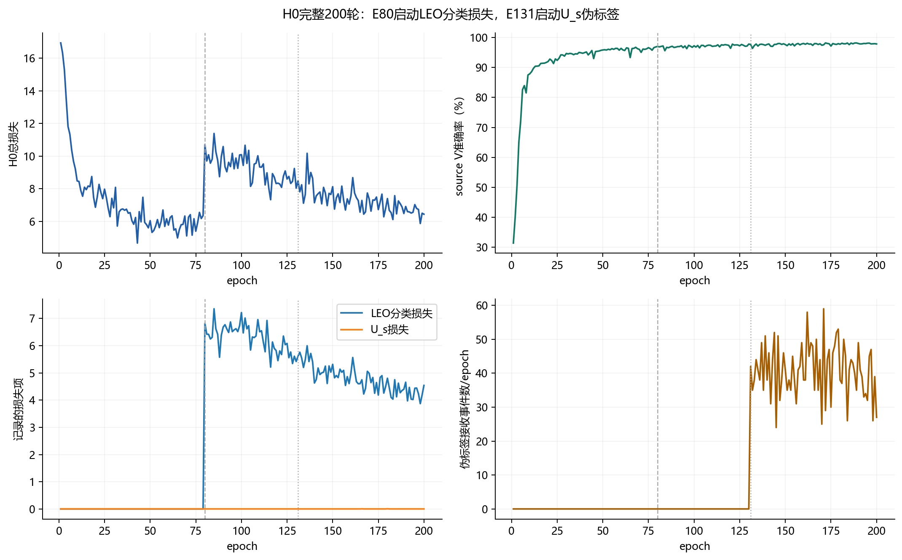
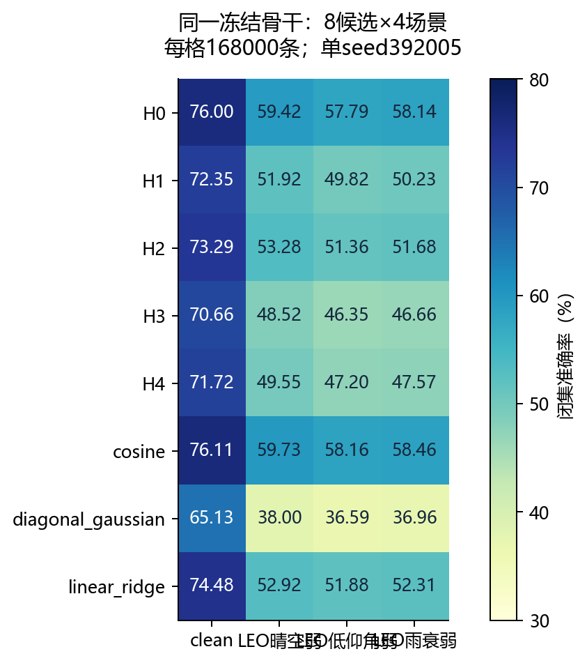
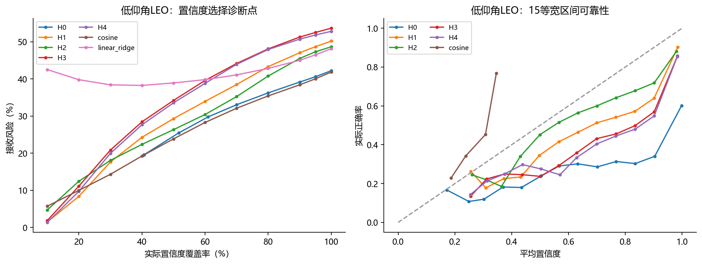
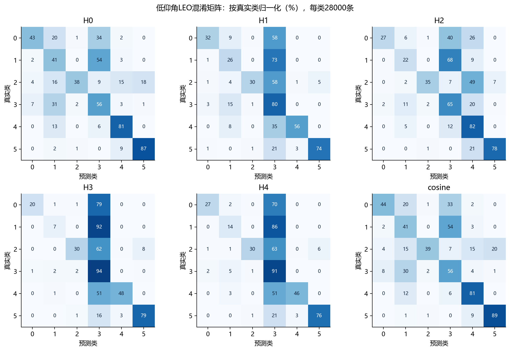

# CORE90部分证据与条件响应头：全面实验报告

实验：core90_evidence_frozen_392005_20260911｜seed=392005｜报告日期：2026-09-11

**完成状态：VERIFIED，8候选×4场景全部预测与独立评分完成。**本报告覆盖方法机制、设计追踪、实际训练激活、数据与checkpoint契约、完整目标指标、分组结果、错误结构、拒识与校准、稳定性和资源。H0完整训练200轮，H1–H4各完成20轮冻结骨干拟合；目标每场景168000条，共32个预测结果。目标数据跨场景重复，不能把5376000条“预测行”当作相互独立样本。

**主要结论：新证据头本轮没有改善闭集跨接收机识别。**H1–H4四场景全部低于H0；低秩H2比对角H1好，但仍明显低于H0；加入条件响应的H3进一步下降，H4恢复部分性能，未超过H2。cosine只取得0.105–0.371个百分点的小幅描述性增益。部分概率校准指标改善，但校准处理不匹配且拒识覆盖率下降，不能据此宣布综合性能提升。

这是固定6类TX的Phase1研究，结论限定于ManySig均衡IQ、当前源/目标接收机划分和合成LEO弱场景。它不是新TX注册或target K-shot实验，也未证明真实发射激励、PA指纹解耦、未知类发现或真实在轨泛化。只有一个训练seed，结果不用于晋级，不回流目标调参、选模或补跑。

[TOC]

## 1.研究问题与已执行范围

原设计希望把“证据是否被观测到”“观测误差有多大”“证据之间是否相关”“状态变化怎样影响类响应”放入统一概率模型，避免把缺失当成零、把相关证据重复累加，或把接收机增益误解释为发射端激励。

本轮执行已接受的第一阶段：按当前数据契约从零训练H0，固定E200骨干，然后在同一特征空间比较H1–H4及三个常规头。骨干冻结隔离了头部效应，也意味着新概率头不能反向改善特征。H5类对专家、480维分块布局、联合训练和目标support注册属于未执行分支；其代码或单元测试存在不等于本轮获得了科学结果。

|候选|本轮实际机制|训练/拟合范围|
|---|---|---|
|H0|原CORE90判别头|完整骨干与原头从零训练200轮，固定E200|
|H1|160维joint证据＋对角类内协方差＋source受控退化观测误差|冻结骨干；20轮；状态响应关闭|
|H2|H1＋rank=4低秩相关协方差|冻结骨干；20轮；状态响应关闭|
|H3|H2＋二维received-IQ状态条件响应＋状态误差传播|冻结骨干；20轮|
|H4|H3＋source support posterior episode训练|冻结骨干；20轮；target前向没有support注册|
|cosine|source类均值方向的余弦分类|同一H0特征，source拟合|
|diagonal_gaussian|常规类条件对角高斯对照|同一H0特征；不同于含观测模型的H1|
|linear_ridge|线性岭回归对照|同一H0特征，source拟合|
|H5|共享反对称类对残差与全局耦合|条件性后续；本轮未启动|

## 2.方法机制、代码路径与数学含义

### 2.0 H0骨干与原训练目标

实际部署是`DualCVSincNetDisentangle`双分支表征，`model_size=M`、`model_variant=lite_d`、`representation_mode=dual`；身份分支读取`feat_joint`，`branch_ablation=no_dac`，域分支`domain_branch_ablation=no_stats`，域增强为`rcn_stats`、强度0.35。源域domain数量15，对应5个source RX×3个source day。新头接在160维身份联合特征上，不能把480维分块设计当成本轮实际输入。

H0保留CORE90的监督TX分类、域分类/对抗、正交与Fishr等约束，以及原型、开放空间、身份紧致、proxy unknown、soft mix、source episode和LEO/伪标签调度；具体权重及起始轮次以配置附件和第4节实际loss为准。后加的其他方法默认被显式关闭。这里的proxy unknown是source训练构造，当前目标固定6类，没有真实未知类别评价。

完整配置附件同时保存历史默认值、历史命令、本次显式协议覆盖及后加功能关闭项。构造优先级为historical defaults→later addon overrides→original command→intentional overrides→实际物理选择器；因此附件中的历史`joint_safe`、0.10/0.70/0.20不能误读为本次有效协议。本次使用scratch、0.07/0.63/0.30、source-only和final_only。`H0_runtime_args.json`只包含部署重建所需的架构参数，不是完整训练超参数清单。

### 2.1观测、缺失与固定缩放

`evidence_observation.py`从骨干aux提取证据。本轮`layout=joint`使用160维`feat_joint`；可选`blocks`拼接`t_emb/f_emb/pa_local`，本轮未用。每块除以固定√块宽，mask变化不会改变保留坐标的数值尺度。缺失坐标由布尔mask定义，不作为实测零送入概率距离。

训练使用0.15随机特征丢弃。对全部32个目标预测张量的复核发现，H1–H4在所有场景、所有168000条样本上都观测到160维。因此本轮验证的是**完整证据目标预测**，并没有目标缺失模式、非随机缺失或缺失强度外推的性能证据。

### 2.2部分高斯、相关性与观测误差

设有效坐标集合为O，类响应为μ_y(e)，总协方差包含正对角项D、低秩项UUᵀ、样本观测误差R(q)和启用时的状态误差传播项。先在O上取协方差子矩阵，再求逆/线性求解；不能先求完整精度矩阵再截取。

```text
C_y,O = [D + U Uᵀ + R(q) + J_y Σ_e J_yᵀ]_(O,O)
r_y,O = z_O - μ_y(e)_O
score_y = -0.5 × (r_y,Oᵀ C_y,O⁻¹ r_y,O + logdet(C_y,O) + |O| log(2π))
```

这是实现的核心概率结构示意；不同消融关闭相应项。`partial_gaussian_head.py`提供部分高斯、正定参数化和低秩求解。H1的rank=0；H2–H4的rank=4。同一信息的相关性通过协方差进入，而不是单独重复计票。技术验收曾对照稠密解和梯度；正式运行中低秩参数非零的证据见第4节。

`evidence_conditions.py`使用L_s受控退化产生误差代理，拟合有上下界的观测方差。其系数冻结，不能让分类CE任意改写质量定义。保存的calibration bias仅作诊断，没有用作预测偏置修正。这里的quality是**source受控退化误差代理**，不是外场真实噪声协方差或实测物理误差界；对非随机缺失也没有识别性保证。

### 2.3条件响应与状态误差传播

`conditional_response.py`用二维received-IQ状态代理驱动类均值：类中心加共享与类特定斜率，状态限制在source覆盖范围，并记录域外状态；通过Jacobian将假定状态误差传播到证据协方差。H1/H2将状态分支作为消融置零；H3/H4开启。

接收IQ的幅度/形态会受到RX、信道和TX共同影响。received proxy不等于发射机功率、输入激励或PA工作点。本轮source探针能够从state预测RX，且高于参考水平，因此不能宣称接收机无关或已辨识物理PA响应。默认状态误差方差是模型设定，不是实测Fisher界。

### 2.4support后验与H4的实际边界

对同类support的部分、异方差观测，条件响应参数用联合高斯条件化形成后验；重复physical ID必须拒绝，多个view不能充当多个shot。query只使用冻结后验进行预测，不更新注册统计。

H4每轮实际执行2952个source episode query，20轮累计59040个query事件。这证明训练路径真正运行，但不是59040个独立新样本。当前Phase1目标入口没有调用target support posterior，故H4结果只检验source episode训练后的冻结头，不检验K-shot注册、未知TX、support覆盖不足或query顺序无关的目标收益。

### 2.5类对诊断与H5

`pairwise_evidence.py`实现类对D²、条件新增证据的Schur补、Fisher适用条件诊断，以及共享反对称残差和全局耦合投影。这些是诊断/建模工具，不保证真实错误率下降。正式run没有保存类对D²、Schur/Fisher数值，H5没有启动；本报告不以技术测试替代正式性能，不构造未测结果。

### 2.6训练目标与source冻结决策

```text
L_head = CE + 0.01 × Gaussian density NLL
         + 0.001 × response parameter regularization
         + 0.1 × support episode CE  [仅H4激活]
```

L_s拟合头及受控退化观测模型；V拟合温度和一致性分组阈值；全部source状态固定后才开始目标预测。决策区分identify、defer、model_mismatch_candidate；后者是模型不匹配候选，不是真实未知类标签。目标所有候选/场景预测固定后，独立scorer才连接truth。H0和三个常规对照没有匹配H1–H4的温度校准流程，NLL/ECE比较是部署系统差异，不能纯归因于高斯结构。

### 2.7原设计逐项追踪：实现、运行与科学证据

|ID|要求|本轮证据与剩余边界|
|---|---|---|
|R01|H0原头/快速推理对照|正式H0＋三常规对照完成；H1–H4非证据参数逐tensor与H0完全相同|
|R02|结构化观测、mask、预处理|代码及训练dropout激活；目标全160维，未测实际缺失泛化|
|R03|正确部分高斯边缘化|稠密参考技术验证；正式全观测高斯路径运行|
|R04|方向性误差、偏置/缺失偏差|source退化观测代理激活；物理误差与非随机缺失未验证|
|R05|低秩相关性|H2–H4末态factor非零；目标效果未超过H0|
|R06|受约束条件响应|H3/H4斜率非零；state仍含RX关联，物理语义未证实|
|R07|状态误差传播|H3/H4训练路径运行；默认状态误差是设定|
|R08|support后验|H4真实source多类episode激活；target K-shot未执行|
|R09|类对/新增证据/Fisher|代码技术验证；本轮没有正式数值诊断产物|
|R10|共享类对专家|H5技术实现；按原计划条件性推迟，未执行|
|R11|损失、校准、歧义与不匹配|source拟合后冻结；目标拒识/风险/覆盖完整评分|
|R12|配置消费、导出与评分|当前Phase1的8×4预测、seals、独立truth-last评分闭合|

历史实现追踪保留在[原追踪文档](E:/type10-7/code/snapshots/core90_evidence_20260911_wt/analysis/core90_evidence_traceability.md)，其“正式科学评估未开展”描述对应发布前时间点。本报告提供完成后的运行与性能证据，不将历史技术验收改写成物理验证。

## 3.实验设计、数据权限与复现条件

|项目|实际设置|
|---|---|
|数据|ManySig.pkl；均衡IQ，6类TX；input_len=256；采样率25MHz，载频2.462GHz|
|source RX|1、3、4、6、8；source day=1、2、3|
|target RX|0、2、5、7、9、10、11；实际target day=0、1、2、3|
|L_s|6300条＝6×5×3×70；用于监督/头拟合|
|U_s|56700条＝6×5×3×630；仅source无标签路径|
|V|27000条＝6×5×3×300；source校准/诊断|
|target|168000条＝6×7×4×1000；每RX24000，每day42000，每TX28000|
|初始化|scratch H0；H1–H4只继承本次同契约H0的冻结骨干|
|固定预算|H0=200轮，batch=128；H1–H4=20轮，batch=64；eval batch=64|
|seed|392005；不混用此前384407或其他历史run结果|
|头优化|AdamW，lr=0.001，weight_decay=0.01；无头部早停或target选模|
|头数据遍历|每轮99批，覆盖6300条L_s；每头1980个优化步|
|正式选择|固定H0 E200；source冻结完成后统一预测，全部预测后独立评分|

source总计90000条按0.07/0.63/0.30划分。target的day0是严格未见日期子集，42000条；day1–3虽日期与source重合，RX仍完全未见。因此总体168000条应称跨RX混合日期测试，不能全部称严格跨RX且跨日期。第7节分别给出两组。

正式checkpoint检查覆盖数据角色、物理ID和继承来源。本轮H0从零初始化，H1–H4继承当前H0，避开旧CORE90曾接触目标的权重。部署状态复核确认所有非证据骨干tensor逐位相同。这证明公平冻结与当前继承关系，不替代对未来checkpoint来源的检查。

当前结果使用同一批物理ID。32份预测全部读入、逐项验证ID集合和顺序与truth一致、score有限、重新计算正确数与原评分匹配。完整物理映射保存在原始data_contract.json，报告附不含长ID列表的metadata；不重复执行数据builder验证。

类别编号0–5的物理TX映射依次为：`14-10`、`14-7`、`20-15`、`20-19`、`6-15`、`8-20`。混淆矩阵和TX分组表均使用该固定顺序。

### 3.1合成LEO场景与物理解释边界

|场景|仰角°|SNR dB|CFO标准差Hz|相位噪声增量标准差范围|K因子dB|衰落/最大延迟采样数/功率衰减/AGC范围|
|---|---|---|---|---|---|---|
|clean|—|原始均衡IQ|—|—|—|不叠加此处LEO代理|
|leo_clear_weak|35–90|22–32|50|0–0.0005|16–24|Rician；delay=2；decay=0.08；AGC±0.2dB|
|leo_low_elev_weak|10–35|16–28|90|0.0001–0.0008|8–18|shadowed Rician；delay=3；decay=0.12；AGC±0.3dB|
|leo_rain_weak|20–80|14–26|70|0.0001–0.0007|10–20|Rician；delay=3；decay=0.10；AGC±0.3dB|

这些是`leo_residual`简化残余信道预设，2 taps；真实路径损耗、大气衰减模型和IQ不平衡开关关闭。“rain”是预设名，不表示已完整模拟物理雨衰链路；没有真实卫星采集或在轨验证。精确参数以发布代码`training_controls.py`与`sat_channel.py`及runtime args为准。

## 4.实际激活、收敛和数值稳定性



图1：完整H0训练轨迹，不以末尾抽样代替全量日志。提供同名SVG用于编辑和出版排版。

H0总损失从16.930914降至6.437092。E79到E80的损失上升伴随LEO分类损失首次非零，是调度切换，不能直接诊断为发散。训练阶段为S1 E1–16、S2 E17–68、S3 E69–130、SSDG pseudo E131–200。source V最高98.203704%@E172，但本轮按预设使用E200，训练记录的E200 V为97.859259%。冻结导出后重新评估V为97.862963%，相差1/27000条；两者是不同评估调用，不混成同一测量，具体数值差异原因未证实。

LEO增强配置在E1即存在，实际LEO分类loss于E80开启（λ=0.68）；卫星一致性loss全200轮为0。U_s loss于E131首次非零，累计处理439040个采样事件、接收2854个伪标签事件，接收率约0.65006%；不是56700条U_s每轮全部有效参与，也不是2854个独立物理样本。E200接收27/6272，U_s loss仅2.066×10⁻⁷：路径激活但利用率较低，不能只凭开关宣称强贡献。

|H0损失项|非零轮数|首次非零epoch|E200值|
|---|---|---|---|
|train_loss_tx_labeled|200|1|1.2611|
|train_loss_domain_labeled|200|1|0.631801|
|train_loss_adv_labeled|200|1|2.66862|
|train_loss_cons_labeled|184|17|0.262466|
|train_loss_orth_labeled|200|1|0.0070545|
|train_loss_fishr_labeled|200|1|0.00225842|
|train_loss_group_ce_labeled|200|1|2.58308|
|train_loss_proto_labeled|200|1|0.212083|
|train_loss_open_world_feat|189|12|0.0682462|
|train_loss_zid_compact|193|8|1.50233|
|train_loss_proxy_unknown|156|45|6.48486|
|train_loss_soft_unknown_mixup|176|25|2.12877|
|train_loss_source_episode|181|20|0.0568528|
|train_loss_sat_cls_labeled|121|80|4.5404|
|train_loss_sat_cons_labeled|0|None|0|
|train_loss_unlabeled|70|131|2.06588e-07|

### 4.1冻结证据头参数与真实路径

|方法|可训练参数|rank|factor平方范数|response斜率平方范数|最终对角方差范围|拟合分钟|
|---|---|---|---|---|---|---|
|H1|1120|0|0|0|0.00305777–0.023999|18.39|
|H2|1760|4|0.271752|0|0.00307047–0.00637633|13.50|
|H3|4000|4|0.0112337|19.1242|0.00306903–0.00583023|17.28|
|H4|4000|4|0.0745353|13.9241|0.00354975–0.00817264|41.47|

|方法|首轮总loss|末轮总loss|末轮CE重建|末轮NLL/批|末轮support CE/批|实际support query事件/20轮|
|---|---|---|---|---|---|---|
|H1|-1.235937|-2.256405|0.066396|-232.280260|0.000000|0|
|H2|-1.308633|-2.378977|0.051026|-243.000461|0.000000|0|
|H3|-1.362519|-2.457167|0.043111|-250.029074|0.000000|0|
|H4|-0.924357|-1.871810|0.059337|-237.560749|4.444513|59040|

原始head history中的`evidence/*`多数为99批的累加值，报告的“/批”除以99；不能把84左右的observed_fraction累加值解释为8400%观测。平均观测约85%，符合0.15训练dropout。总loss允许为负，因为固定尺度的连续高斯密度NLL可以为负；它不是分类NLL，也不等同于非有限异常。H4末轮support CE约4.4445，虽然source完整视图V很高，episode目标仍较难。

逐个部署检查发现H1–H4所有非证据tensor与H0逐位相等。H2相关项、H3/H4响应斜率均非零，支持相应训练路径已更新；但非零参数不自动证明性能贡献。消融结果显示这些结构在本轮跨域条件下仍可能损害识别。

### 4.2异常审计

完整200轮H0、4×20轮head history和全部17份可用日志均已解析。H0非有限loss跳步为0，非有限梯度跳步共10/9800≈0.10204%，发生于E1、6、28、67、108、116、133、146、174，其中E6两次；训练最终完成。日志中未发现Traceback或OOM。未启用诊断及训练期target指标中的null/NaN不作为训练loss异常计数；完整字段审计见附带JSON。没有对报告编写重新运行GPU训练。

## 5.完整目标总体指标与消融解释



图2：8×4闭集准确率总览。提供同名SVG用于编辑和出版排版。

|方法|clean|LEO晴空弱|LEO低仰角弱|LEO雨衰弱|三LEO平均%|
|---|---|---|---|---|---|
|H0|76.002|59.423|57.793|58.135|58.451|
|H1|72.349|51.920|49.818|50.230|50.656|
|H2|73.287|53.281|51.359|51.680|52.107|
|H3|70.660|48.517|46.352|46.664|47.178|
|H4|71.717|49.547|47.201|47.566|48.105|
|cosine|76.107|59.730|58.165|58.460|58.785|
|diagonal_gaussian|65.130|38.004|36.595|36.955|37.185|
|linear_ridge|74.479|52.920|51.877|52.312|52.370|

H2相对H1的改善说明低秩相关结构在当前冻结特征上比纯对角头更合适；H3相对H2下降，说明本轮状态条件响应没有带来泛化优势。H4相对H3恢复部分准确率，但仍未追上H2或H0。这些是相邻消融的观察关联，不能脱离训练目标、优化和状态混杂解释为已确定的因果机制。

H1–H4的source V都接近98%，目标LEO却下降到约46%–53%，表明source拟合充分不能保证目标转移。当前证据不支持增加结构复杂度就会提高跨RX鲁棒性。cosine的增益很小且单seed，不构成可推广的胜出结论。

### 5.1指标定义

闭集准确率=全部样本argmax正确数/N；有效准确率=正确且被接收数/N，拒绝计错；覆盖率=接收数/N；接收风险=接收错误数/接收数。NLL、Brier和15等宽bin ECE对全部样本计算，越低越好。最弱RX与最弱RX×TX都是对应分组的闭集准确率下界，不是置信区间。百分数和百分点明确区分。

### 5.2 clean：全部部署指标

|方法|闭集%|有效%|覆盖%|接收风险%|NLL|Brier|ECE|最弱RX%|最弱RX×TX%|
|---|---|---|---|---|---|---|---|---|---|
|H0|76.002|76.002|100.000|23.998|3.47841|0.46842|0.23187|62.458|1.775|
|H1|72.349|67.740|84.490|19.824|0.88372|0.40169|0.11877|58.900|9.300|
|H2|73.287|68.695|84.210|18.423|0.96843|0.39264|0.10827|59.496|10.075|
|H3|70.660|60.665|74.786|18.882|1.02243|0.41749|0.14418|56.425|9.975|
|H4|71.717|68.697|91.499|24.920|0.87860|0.40949|0.14152|59.288|12.325|
|cosine|76.107|76.107|100.000|23.893|1.27721|0.61040|0.42415|62.771|1.875|
|diagonal_gaussian|65.130|65.130|100.000|34.870|83.28918|0.69585|0.34753|53.725|1.675|
|linear_ridge|74.479|74.479|100.000|25.521|1.35996|0.65262|0.43854|61.158|3.825|

### 5.3 LEO晴空弱：全部部署指标

|方法|闭集%|有效%|覆盖%|接收风险%|NLL|Brier|ECE|最弱RX%|最弱RX×TX%|
|---|---|---|---|---|---|---|---|---|---|
|H0|59.423|59.423|100.000|40.577|5.34635|0.78444|0.38605|40.133|5.275|
|H1|51.920|44.093|67.795|34.961|1.38669|0.63320|0.17021|33.646|1.625|
|H2|53.281|44.151|62.516|29.376|1.41356|0.61322|0.12106|35.713|2.950|
|H3|48.517|31.519|50.551|37.649|1.61132|0.69592|0.23479|35.904|0.775|
|H4|49.547|43.768|85.024|48.522|1.53808|0.69448|0.24495|35.975|1.375|
|cosine|59.730|59.730|100.000|40.270|1.44214|0.68434|0.28072|40.092|3.925|
|diagonal_gaussian|38.004|38.004|100.000|61.996|158.43980|1.23707|0.61804|23.921|0.050|
|linear_ridge|52.920|52.920|100.000|47.080|1.55927|0.73982|0.25695|34.367|4.875|

### 5.4 LEO低仰角弱：全部部署指标

|方法|闭集%|有效%|覆盖%|接收风险%|NLL|Brier|ECE|最弱RX%|最弱RX×TX%|
|---|---|---|---|---|---|---|---|---|---|
|H0|57.793|57.793|100.000|42.207|5.37901|0.81049|0.39800|40.654|3.850|
|H1|49.818|41.131|64.148|35.881|1.43387|0.65030|0.16847|34.038|1.025|
|H2|51.359|40.990|58.201|29.570|1.44244|0.62958|0.11498|36.033|2.175|
|H3|46.352|30.218|48.965|38.286|1.63039|0.71128|0.23296|35.121|0.950|
|H4|47.201|41.731|84.715|50.740|1.58065|0.71455|0.25242|35.521|0.900|
|cosine|58.165|58.165|100.000|41.835|1.46012|0.69223|0.27006|40.592|3.825|
|diagonal_gaussian|36.595|36.595|100.000|63.405|164.39661|1.26557|0.63222|24.758|0.025|
|linear_ridge|51.877|51.877|100.000|48.123|1.56985|0.74432|0.25090|35.400|3.700|

### 5.5 LEO雨衰弱：全部部署指标

|方法|闭集%|有效%|覆盖%|接收风险%|NLL|Brier|ECE|最弱RX%|最弱RX×TX%|
|---|---|---|---|---|---|---|---|---|---|
|H0|58.135|58.135|100.000|41.865|5.32325|0.80388|0.39408|41.450|4.700|
|H1|50.230|41.364|63.940|35.309|1.41576|0.64453|0.16434|34.488|1.075|
|H2|51.680|41.277|58.056|28.902|1.43035|0.62453|0.11144|36.875|2.275|
|H3|46.664|30.433|48.898|37.763|1.62677|0.70840|0.23251|35.838|0.950|
|H4|47.566|42.018|84.991|50.562|1.56953|0.71001|0.24956|36.062|1.100|
|cosine|58.460|58.460|100.000|41.540|1.45731|0.69102|0.27289|41.479|3.700|
|diagonal_gaussian|36.955|36.955|100.000|63.045|162.00954|1.25820|0.62861|25.246|0.075|
|linear_ridge|52.312|52.312|100.000|47.688|1.56496|0.74215|0.25471|36.263|3.925|

## 6.拒识、概率校准与公平覆盖率比较



图3：低仰角LEO的置信度选择与校准诊断。提供同名SVG用于编辑和出版排版。

低仰角LEO中，H2闭集正确86283条；其中接收正确68864、接收错误28913、拒绝正确17419、拒绝错误52804。其有效准确率40.990%、覆盖率58.201%、接收风险29.570%。相比H0的100%覆盖、42.207%风险，风险下降同时移除了大量样本，包括17419条本来可判对的样本。因此不能用29.570%直接宣称优于H0。

下表统一按最大softmax置信度作选择，按相同置信度整组保留，不用truth拆分ties，不对达不到的覆盖率插值。它是**离线置信度诊断策略**，未包含H1–H4原部署的一致性/不匹配门控，不能替代原部署结果，也不将目标阈值回写部署。

|方法|请求50%时实际覆盖%|风险%|请求80%时实际覆盖%|风险%|tie-group右矩形AURC|
|---|---|---|---|---|---|
|H0|51.633|25.437|80.002|36.226|0.275344|
|H1|50.000|29.292|80.000|43.295|0.268598|
|H2|50.000|26.327|80.000|40.755|0.260016|
|H3|50.000|34.188|80.000|48.071|0.306092|
|H4|50.000|33.544|80.000|47.898|0.299546|
|cosine|50.000|23.842|80.000|35.406|0.230342|
|diagonal_gaussian|95.608|63.375|95.608|63.375|0.633757|
|linear_ridge|50.000|38.899|80.000|42.810|0.415888|

在约80%覆盖时，H0风险36.226%，H2为40.755%；cosine为35.406%。H2未显示优于H0的置信度排序能力。常规diagonal_gaussian约95.6%样本softmax饱和为1，不能声称获得50%或80%的可实现覆盖点。AURC使用按tie整组的右矩形积分，数值依赖该明确约定，不宣称无偏风险认证。

H1–H4的温度来自V，H0/常规对照未进行匹配校准，故其NLL/ECE下降包含校准差异；现有目标结果不足以拆分“高斯结构”和“温度校准”的各自贡献。可靠性图的点不按bin样本量加权展示，定量ECE以表格和CSV为准。

## 7.全部RX、日期与TX分组结果

以下全部为闭集准确率（%）；每场景同一168000条。RX×day、RX×TX的完整2784个分组行及其有效准确率、覆盖率、风险和校准指标见[grouped_metrics.csv](data/grouped_metrics.csv)。极低的单RX×TX不能被平均值掩盖。

### clean

**目标接收机**

|方法|[0]|[10]|[11]|[2]|[5]|[7]|[9]|
|---|---|---|---|---|---|---|---|
|H0|81.458|79.813|78.071|62.458|84.017|70.533|75.667|
|H1|79.338|78.550|71.746|58.900|81.229|65.842|70.842|
|H2|80.283|77.317|73.425|59.496|81.738|67.742|73.013|
|H3|77.825|77.454|70.229|56.425|77.713|64.854|70.117|
|H4|78.729|77.796|70.979|59.288|79.846|64.583|70.796|
|cosine|81.463|79.658|78.004|62.771|84.154|70.604|76.096|
|diagonal_gaussian|73.858|75.037|64.879|54.500|72.475|53.725|61.437|
|linear_ridge|79.942|77.975|77.242|61.158|85.008|69.396|70.629|

**日期**

|方法|[1]|[2]|[3]|[0]|
|---|---|---|---|---|
|H0|79.695|72.036|78.124|74.155|
|H1|76.414|67.614|73.548|71.821|
|H2|77.333|68.202|75.229|72.386|
|H3|74.450|65.883|72.000|70.305|
|H4|75.548|66.826|73.302|71.190|
|cosine|79.850|72.212|78.098|74.269|
|diagonal_gaussian|67.824|63.379|65.340|63.979|
|linear_ridge|78.481|69.524|76.929|72.981|

**TX类别**

|方法|[0]|[1]|[2]|[3]|[4]|[5]|
|---|---|---|---|---|---|---|
|H0|89.614|55.246|57.629|64.011|99.854|89.661|
|H1|87.761|46.768|46.707|70.507|99.261|83.093|
|H2|86.521|44.579|53.243|67.993|99.893|87.496|
|H3|82.868|31.386|44.700|78.271|98.811|87.921|
|H4|86.586|39.761|45.586|74.871|98.596|84.900|
|cosine|89.643|55.021|57.857|64.036|99.857|90.229|
|diagonal_gaussian|79.529|46.329|24.654|74.268|94.218|71.786|
|linear_ridge|88.561|50.118|58.325|65.182|99.711|84.975|

|方法|未见RX＋已见day1–3%（126000条）|未见RX＋未见day0%（42000条）|
|---|---|---|
|H0|76.618|74.155|
|H1|72.525|71.821|
|H2|73.588|72.386|
|H3|70.778|70.305|
|H4|71.892|71.190|
|cosine|76.720|74.269|
|diagonal_gaussian|65.514|63.979|
|linear_ridge|74.978|72.981|

### LEO晴空弱

**目标接收机**

|方法|[0]|[10]|[11]|[2]|[5]|[7]|[9]|
|---|---|---|---|---|---|---|---|
|H0|70.533|62.900|61.937|40.133|68.954|44.742|66.763|
|H1|59.229|53.137|54.558|33.646|63.950|38.958|59.958|
|H2|60.975|55.146|55.137|35.713|66.200|38.700|61.096|
|H3|53.758|48.104|49.850|37.029|59.879|35.904|55.096|
|H4|55.233|49.812|50.888|35.975|61.167|37.267|56.488|
|cosine|70.975|63.150|62.171|40.092|69.279|45.029|67.417|
|diagonal_gaussian|44.104|39.325|38.662|23.921|49.025|31.079|39.908|
|linear_ridge|64.700|56.375|56.262|34.367|62.563|40.446|55.729|

**日期**

|方法|[1]|[2]|[3]|[0]|
|---|---|---|---|---|
|H0|60.567|57.624|62.357|57.145|
|H1|55.000|50.224|52.655|49.800|
|H2|54.988|51.836|55.367|50.933|
|H3|50.879|48.238|48.471|46.481|
|H4|52.681|48.929|49.488|47.090|
|cosine|60.952|57.952|62.614|57.402|
|diagonal_gaussian|41.033|37.012|38.860|35.110|
|linear_ridge|55.986|50.248|54.574|50.874|

**TX类别**

|方法|[0]|[1]|[2]|[3]|[4]|[5]|
|---|---|---|---|---|---|---|
|H0|44.168|41.575|39.954|59.279|84.168|87.396|
|H1|34.668|27.143|31.739|80.200|62.975|74.793|
|H2|29.632|23.486|36.343|68.132|83.561|78.532|
|H3|21.357|9.396|30.825|94.332|55.046|80.146|
|H4|29.618|16.396|31.171|91.279|52.586|76.232|
|cosine|45.089|40.961|40.436|58.968|84.446|88.482|
|diagonal_gaussian|14.246|25.246|19.479|85.579|22.771|60.700|
|linear_ridge|47.661|34.896|40.818|61.686|51.357|81.104|

|方法|未见RX＋已见day1–3%（126000条）|未见RX＋未见day0%（42000条）|
|---|---|---|
|H0|60.183|57.145|
|H1|52.626|49.800|
|H2|54.063|50.933|
|H3|49.196|46.481|
|H4|50.366|47.090|
|cosine|60.506|57.402|
|diagonal_gaussian|38.968|35.110|
|linear_ridge|53.602|50.874|

### LEO低仰角弱

**目标接收机**

|方法|[0]|[10]|[11]|[2]|[5]|[7]|[9]|
|---|---|---|---|---|---|---|---|
|H0|67.508|60.117|59.913|40.654|67.046|43.404|65.912|
|H1|56.175|50.012|51.871|34.038|60.850|37.962|57.821|
|H2|58.150|51.696|52.975|36.033|63.554|37.529|59.575|
|H3|51.408|45.388|46.850|36.471|56.592|35.121|52.633|
|H4|52.513|46.642|47.575|35.521|57.842|36.213|54.104|
|cosine|67.904|60.350|60.329|40.592|67.475|43.992|66.513|
|diagonal_gaussian|42.025|37.546|36.838|24.758|46.100|30.192|38.704|
|linear_ridge|61.833|53.979|54.725|35.400|61.212|40.175|55.813|

**日期**

|方法|[1]|[2]|[3]|[0]|
|---|---|---|---|---|
|H0|58.936|56.276|60.352|55.610|
|H1|52.926|48.840|50.295|47.212|
|H2|53.212|50.274|53.071|48.879|
|H3|48.676|46.619|45.957|44.155|
|H4|50.140|47.236|46.679|44.750|
|cosine|59.345|56.702|60.707|55.905|
|diagonal_gaussian|39.514|35.743|37.381|33.740|
|linear_ridge|54.493|49.800|53.310|49.905|

**TX类别**

|方法|[0]|[1]|[2]|[3]|[4]|[5]|
|---|---|---|---|---|---|---|
|H0|42.675|41.346|38.179|56.486|80.636|87.439|
|H1|32.304|25.843|30.229|80.139|56.275|74.121|
|H2|27.004|21.596|34.732|64.850|81.957|78.014|
|H3|19.971|7.457|29.643|94.061|47.557|79.421|
|H4|27.043|13.579|29.600|91.329|45.814|75.843|
|cosine|44.071|40.589|38.736|55.714|81.254|88.625|
|diagonal_gaussian|12.514|23.493|18.400|86.571|17.921|60.668|
|linear_ridge|48.243|35.218|39.314|58.646|48.207|81.632|

|方法|未见RX＋已见day1–3%（126000条）|未见RX＋未见day0%（42000条）|
|---|---|---|
|H0|58.521|55.610|
|H1|50.687|47.212|
|H2|52.186|48.879|
|H3|47.084|44.155|
|H4|48.018|44.750|
|cosine|58.918|55.905|
|diagonal_gaussian|37.546|33.740|
|linear_ridge|52.534|49.905|

### LEO雨衰弱

**目标接收机**

|方法|[0]|[10]|[11]|[2]|[5]|[7]|[9]|
|---|---|---|---|---|---|---|---|
|H0|67.821|60.462|60.513|41.450|66.854|44.296|65.550|
|H1|56.496|51.375|52.183|34.488|60.862|38.271|57.933|
|H2|58.408|52.217|53.300|36.875|63.442|38.221|59.296|
|H3|51.646|46.117|47.275|37.108|56.146|35.838|52.517|
|H4|52.658|47.738|47.987|36.062|57.625|36.913|53.979|
|cosine|68.142|60.733|60.975|41.479|67.108|44.754|66.025|
|diagonal_gaussian|41.808|38.279|37.283|25.246|46.354|30.533|39.183|
|linear_ridge|61.821|54.517|55.521|36.263|61.308|40.829|55.929|

**日期**

|方法|[1]|[2]|[3]|[0]|
|---|---|---|---|---|
|H0|59.110|56.736|60.907|55.788|
|H1|53.045|49.574|50.890|47.410|
|H2|53.290|50.936|53.524|48.969|
|H3|48.871|46.983|46.414|44.386|
|H4|50.414|47.679|47.431|44.740|
|cosine|59.493|57.150|61.167|56.029|
|diagonal_gaussian|39.717|36.657|37.757|33.690|
|linear_ridge|54.762|50.600|53.948|49.940|

**TX类别**

|方法|[0]|[1]|[2]|[3]|[4]|[5]|
|---|---|---|---|---|---|---|
|H0|43.921|41.768|38.146|55.268|81.071|88.636|
|H1|33.250|25.739|30.079|79.979|56.304|76.029|
|H2|27.764|21.514|34.829|63.961|82.396|79.614|
|H3|20.468|7.296|29.446|94.339|47.257|81.175|
|H4|27.854|13.596|29.479|91.425|45.354|77.689|
|cosine|45.275|41.204|38.514|54.546|81.539|89.679|
|diagonal_gaussian|13.250|23.368|18.454|86.514|17.707|62.439|
|linear_ridge|49.711|35.357|38.989|58.186|48.554|83.079|

|方法|未见RX＋已见day1–3%（126000条）|未见RX＋未见day0%（42000条）|
|---|---|---|
|H0|58.917|55.788|
|H1|51.170|47.410|
|H2|52.583|48.969|
|H3|47.423|44.386|
|H4|48.508|44.740|
|cosine|59.270|56.029|
|diagonal_gaussian|38.044|33.690|
|linear_ridge|53.103|49.940|

## 8.逐样本配对变化与错误结构

配对统计对相同物理样本比较：rescue是H0错而候选对；harm是H0对而候选错；净正确变化=rescue−harm。预测改变数还包括“双方都错但错到不同类”，不能等同于rescue＋harm。raw score/margin尺度跨头不同，不作为统一效果量。

### clean相对H0

|方法|rescue数|harm数|净正确变化|准确率差/百分点|
|---|---|---|---|---|
|H1|2561|8698|-6137|-3.653|
|H2|2352|6913|-4561|-2.715|
|H3|4620|13596|-8976|-5.343|
|H4|3969|11169|-7200|-4.286|
|cosine|360|184|176|0.105|
|diagonal_gaussian|3212|21477|-18265|-10.872|
|linear_ridge|1621|4181|-2560|-1.524|

### LEO晴空弱相对H0

|方法|rescue数|harm数|净正确变化|准确率差/百分点|
|---|---|---|---|---|
|H1|6225|18831|-12606|-7.504|
|H2|4659|14978|-10319|-6.142|
|H3|10206|28528|-18322|-10.906|
|H4|9348|25940|-16592|-9.876|
|cosine|928|412|516|0.307|
|diagonal_gaussian|7468|43453|-35985|-21.420|
|linear_ridge|4199|15124|-10925|-6.503|

### LEO低仰角弱相对H0

|方法|rescue数|harm数|净正确变化|准确率差/百分点|
|---|---|---|---|---|
|H1|6947|20345|-13398|-7.975|
|H2|5203|16013|-10810|-6.435|
|H3|10892|30114|-19222|-11.442|
|H4|10082|27877|-17795|-10.592|
|cosine|1214|590|624|0.371|
|diagonal_gaussian|8512|44126|-35614|-21.199|
|linear_ridge|5133|15073|-9940|-5.917|

### LEO雨衰弱相对H0

|方法|rescue数|harm数|净正确变化|准确率差/百分点|
|---|---|---|---|---|
|H1|7258|20539|-13281|-7.905|
|H2|5336|16181|-10845|-6.455|
|H3|11263|30535|-19272|-11.471|
|H4|10457|28213|-17756|-10.569|
|cosine|1109|564|545|0.324|
|diagonal_gaussian|8846|44428|-35582|-21.180|
|linear_ridge|5349|15131|-9782|-5.823|



图4：低仰角LEO的主要混淆模式。提供同名SVG用于编辑和出版排版。

低仰角H2纠正5203条H0错误，却破坏16013条H0正确判断，净减少10810条。错误并非仅是低置信样本拒绝问题：闭集决策本身发生了净损失。全部32个6×6原始计数矩阵见[confusion_matrices.csv](data/confusion_matrices.csv)，图中行归一化仅用于阅读；每格原始计数可独立汇总回整体准确率。

## 9.source校准、状态/质量关联与机制限制

|方法|raw V准确率%|校准后有效%|校准后覆盖%|校准后NLL|校准后ECE|温度|
|---|---|---|---|---|---|---|
|H0|97.863|97.863|100.000|0.24792|0.01951|1.000000|
|H1|98.015|92.593|93.452|0.07379|0.00578|2.478203|
|H2|97.948|94.404|95.148|0.07041|0.00446|1.747627|
|H3|98.096|94.393|95.011|0.07125|0.00488|1.781229|
|H4|98.081|94.207|95.341|0.07145|0.00748|2.512529|

|方法|state→TX%|state→RX%|quality→TX%|quality→RX%|
|---|---|---|---|---|
|H1|16.667|20.000|29.263|44.956|
|H2|16.667|20.000|29.263|44.956|
|H3|25.770|43.978|29.263|44.956|
|H4|25.770|43.978|29.263|44.956|

TX多数类参考16.667%，RX参考20%。H3/H4的state→RX为43.978%，quality→RX为44.956%；两者明显携带采集关联。state→TX约25.770%、quality→TX约29.263%，也不能当作纯外生状态。H1/H2状态探针接近参考值是状态分支被消融置零的结果，不能据此证明原始状态不含RX信息。全观测mask恒定，所以mask探针参考水平没有非随机缺失独立性的证明力。

H1–H4校准包含3个160维质量分组，最低组样本要求20，分位数0.95，置信门槛0.5；H3/H4 source状态域内比例约99.893%。V同时承担校准和这里的诊断，因而这些source风险不是独立留出认证。source覆盖好也不推出target状态分布合规。

## 10.计算成本、运行时序与交付状态

|阶段|实际资源/耗时|解释|
|---|---|---|
|H0完整训练|30877.553秒＝8.577小时；1,049,827可训练参数|含该阶段source评估/报告；epoch合计30827.571秒|
|H0峰值显存|allocated约9.509GiB；reserved约9.939GiB|实际训练峰值；不是启动时显存快照|
|H1–H4拟合|18.39/13.50/17.28/41.47分钟|并行任务；不能相加当墙钟时间|
|head显存|UNKNOWN：没有保存正式head训练峰值|不使用旧synthetic测试显存充当正式结果|
|总流程|约01:46启动，10:21 H0完成，11:04全部source冻结，12:09评分完成|约10小时23分钟；均为2026-09-11香港时间|
|结束状态|ARTIFACTS_COMPLETE；监控automation已暂停|本报告没有重启或调优实验|

|候选|四场景预测分钟|预测产物MiB|
|---|---|---|
|H0|15.76|39.10|
|H1|36.83|60.25|
|H2|35.94|60.25|
|H3|44.77|60.25|
|H4|36.08|60.25|
|cosine|14.76|39.10|
|diagonal_gaussian|14.59|39.10|
|linear_ridge|14.63|39.10|

预测耗时包括IQ读取、逐样本信道变换、批量前向和保存，受共享GPU负载影响，不是独占模型kernel延迟。H4拟合成本最高，而闭集效果低于H2；当前结果不支持其综合成本收益占优。没有正式独占吞吐、延迟分位数或head显存数据。

## 11.科学判定与下一步边界

|问题|当前判定|
|---|---|
|是否完成授权冻结矩阵|是：H0 E200＋H1–H4各20轮，8×4结果闭合|
|方法是否只停留在配置|否：观测模型、相关项、响应斜率、H4 source episode均有实际路径/末态证据|
|是否提升跨RX闭集精度|否：H1–H4全部场景低于H0|
|是否获得更好的校准|部分部署NLL/ECE改善；校准不匹配，不能纯归因于结构|
|是否获得更优选择性识别|当前低仰角等覆盖诊断不支持H2优于H0|
|是否证明物理条件响应/PA解耦|否：received代理仍关联RX/TX，缺少物理标定|
|是否证明缺失证据或target K-shot收益|否：目标全160维，未执行target support注册|
|能否晋级或宣布方法胜出|不能：单seed描述性结果且新头整体退化|

后续设计应优先在source允许的信息上辨别状态混杂、概率尺度、低秩建模及目标不匹配风险，而不是依据本次目标分数继续搜索参数。若另行授权新研究，应预先固定校准匹配的对照、缺失机制、support覆盖诊断和独立多seed评估；新的目标反馈必须遵守项目协议。本报告不启动这些后续实验。

当前最可信的交付是一个已验证执行、可复核失败与收益边界的冻结头对比，而不是已成立的物理机制或性能提升论证。

## 12.数据附件、复核口径与代码索引

|附件|内容|
|---|---|
|[metrics.csv](data/metrics.csv)|32行部署指标、资源和配对补充字段|
|[grouped_metrics.csv](data/grouped_metrics.csv)|2784行RX/day/TX及交叉分组指标|
|[confusion_matrices.csv](data/confusion_matrices.csv)|32×6×6＝1152行原始混淆计数|
|[decision_counts.csv](data/decision_counts.csv)|接收/拒绝与正确/错误四格计数|
|[risk_coverage_points.csv](data/risk_coverage_points.csv)|32×11覆盖率诊断点，含实际覆盖率和阈值|
|[reliability_bins.csv](data/reliability_bins.csv)|32×15校准bin，含样本数|
|[H0_training_history.csv](data/H0_training_history.csv)|完整200轮训练、调度和伪标签记录|
|[head_training_history.csv](data/head_training_history.csv)|4×20轮头训练，原始累加值与批均值|
|[H0_mechanism_activation.csv](data/H0_mechanism_activation.csv)|16项loss首次激活/非零轮数|
|[source_summary.json](data/source_summary.json)|source校准、探针及相关诊断|
|[comprehensive_analysis.json](data/comprehensive_analysis.json)|完整复核、末态参数、异常审计、日期分解和风险数据|
|[H0_runtime_args.json](data/H0_runtime_args.json)|H0部署重建的架构参数子集|
|[core90_evidence_h0_h5.json](data/core90_evidence_h0_h5.json)|完整历史默认、命令、本次协议覆盖和H0–H5配置；按正文优先级解释|
|[data_contract_metadata.json](data/data_contract_metadata.json)|数据schema、物理映射元数据及角色计数|
|[plan.json](data/plan.json)|当前seed、预算与调度计划|
|[commands.jsonl](data/commands.jsonl)|实际阶段命令|
|[summary.json](data/summary.json)|原独立评分的紧凑全量汇总|

原始大文件保留在N607：`/home/szu2070436088/2510044040/CV-SincNet/runs/core90_evidence_frozen_392005_20260911`；本机完整审计缓存：`E:/type10-7/local_artifacts/core90_results_392005`。原comparison.json约587MiB，全部预测张量、truth和日志均已实际读取；报告附件保留紧凑可审阅数据，不将大预测张量重复提交Git。

正式执行代码release：`edca15a6`；此前结果报告提交：`46bbd8fbc467e4176a05d309ac07b47ce3b485c3`。本报告由当前完成产物生成。发布前技术验收144 passed、0 skipped属于既有实现验证，不是本次新增实验样本或新增GPU测试。读者可先核对各confusion对角和、decision四格计数、各分组权重汇总，再对照完整评分。

主要生产代码：

- [evidence_observation.py](E:/type10-7/code/snapshots/core90_evidence_20260911_wt/code/cvsrffi/evidence_observation.py)

- [partial_gaussian_head.py](E:/type10-7/code/snapshots/core90_evidence_20260911_wt/code/cvsrffi/partial_gaussian_head.py)

- [evidence_conditions.py](E:/type10-7/code/snapshots/core90_evidence_20260911_wt/code/cvsrffi/evidence_conditions.py)

- [conditional_response.py](E:/type10-7/code/snapshots/core90_evidence_20260911_wt/code/cvsrffi/conditional_response.py)

- [pairwise_evidence.py](E:/type10-7/code/snapshots/core90_evidence_20260911_wt/code/cvsrffi/pairwise_evidence.py)

- [evidence_head_training.py](E:/type10-7/code/snapshots/core90_evidence_20260911_wt/code/cvsrffi/evidence_head_training.py)

- [evidence_decision.py](E:/type10-7/code/snapshots/core90_evidence_20260911_wt/code/cvsrffi/evidence_decision.py)

实际入口和配置见[实现报告](E:/type10-7/code/snapshots/core90_evidence_20260911_wt/analysis/core90_evidence_implementation_20260911.md)及本目录commands.jsonl。原设计文本与本次范围的对应关系见第2.7节，技术实现、正式运行和科学验证三层证据分别陈述。
