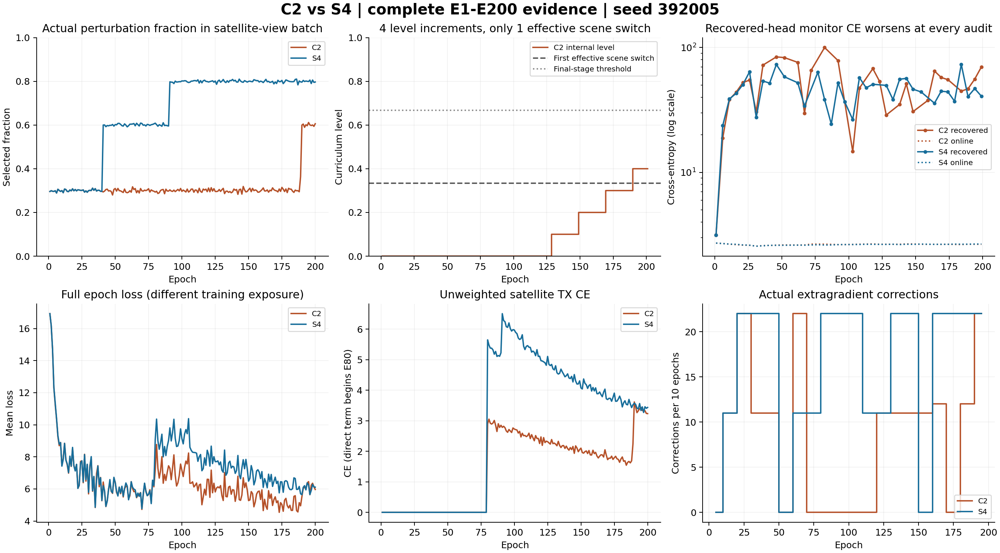
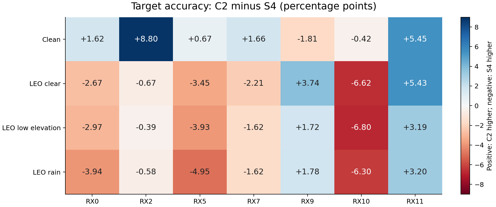

# CORE90方法优化实现、实验与数据综合报告

日期：2026-09-11。范围：修复版训练提交`300ff4a9`、训练seed392005、26行预定矩阵，以及已有25行固定E200目标测试。本文汇总本次已经完成的优化实现与证据，不代表新一轮优化已经执行。

## 1.主要结论与证据范围

本轮实现了普通、交替、extragradient、Heun、Optimistic和head-lookahead求解器，源域恢复审计、选择性追赶/校正、能力课程，以及局部Jacobian诊断和条件隐式头响应。工程验收与正式运行记录表明，多项路径实际执行，但完整设计主线尚未获得完整科学验证。

当前固定25行结果中，B8的目标LEO平均准确率最高，为65.56%，比B0高3.75个百分点；最弱LEO场景×接收机准确率为51.01%，比B0高7.31个百分点。B5的LEO均值65.45%接近B8，低仰角和雨衰单项略高。C2的clean最高，为79.00%，但LEO均值仅62.36%。这些都是单seed描述性比较，不能表述为稳定最优方法或统计显著改进。

C2困难LEO暴露不足已经由动作日志直接证明：直接卫星CE阶段的困难扰动访问仅为S4的10.32%。但是，C2/S4恢复探针全部未改善monitor CE，head追赶均为0；“训练不充分”不是唯一已确立原因，“C2机制优于B8”也没有证据。

本报告不重新读取远端进程，不将旧进度写成实时状态。结果边界以已经下载、固定的产物为准：25行有完整目标结果，B6未包含在本次目标证据中；此前E177记录只是历史快照，不能据此判断它现在仍在训练。C4未纳入26行，因为缺少修复后其他seed的完整donor日程。

证据覆盖分层：25行全部目标评分及分组数据；15行既有完整训练/源域分析；其中B0、B1、B8、S3、S4、C1、C2另有全量深析，共1400条epoch、68600条主更新、218条审计、70285条JSONL记录及全部stdout。不能把7行深析的覆盖声明扩大为25行全部训练轨迹均重新解析。

## 2.方法动机、模型与数据契约

本次要研究的问题是：身份特征学习和域对抗头更新是否失衡；额外计算应该持续施加还是根据源域状态触发；LEO扰动是否应随身份能力推进。设计允许“普通更新足够”“状态控制没有收益”等否定结论。

保留CORE90的lite_d双分支和共享前端，身份表示z_id与域表示z_dom均为160维。正式模型有1,049,827个参数、6个注册TX、15个RX×day域。TX分类头负责身份，adv_head在z_id上形成域对抗；dom_head承担域保留任务。z_dom不是原设计条件融合中的身份响应分支，故未强行添加融合。

|集合/设置|实际内容|使用权限|
|---|---|---|
|数据|WiSig/ManySig地面IQ|LEO叠加为部署压力代理，不是真实在轨验证|
|source RX|1、3、4、6、8|训练与source评估|
|source day|1、2、3|原生domain为5×3=15类|
|L_s|6300条，source全池7%|允许TX监督|
|U_s|56700条，source全池63%|TX标签及对应元数据不进入学习接口|
|V|27000条，source全池30%|本轮最终只读四场景评估，不拟合|
|标注率|6300/(6300+56700)=10%|与相对全池7%不是同一分母|
|target RX|0、2、5、7、9、10、11|固定模型只读推理|
|target day|0、1、2、3|包含与source共享day，不能称全部未见day|
|target规模|每场景168000条，四场景672000条/模型|相同基础IQ的四种view，不是四倍独立样本|
|训练seed|392005|本轮仅一个训练seed|
|split/增强seed|392002|固定划分与测试随机性，不是checkpoint继承|
|初始化与选择|scratch-only、固定final E200|不加载历史成熟基座，不按目标分数选checkpoint|

L/U/V物理ID互斥；source与target接收机互斥。每个目标场景包含每RX24000条、每day42000条、每TX28000条；TX0—TX5是注册类索引，不能直接等同原始物理TX编号，映射以契约文件为准。闭集全部6类argmax测试没有support拟合，也不是Phase2少样本适应、未知拒识或新类注册结果。

checkpoint来源在加载前核查scratch_only、final_only、target_contact=false和source角色。历史CORE90 checkpoint没有用于初始化。当前目标评价已经产生研究者层面的目标接触，未来设计选择仍需记录该历史，不能仅凭checkpoint中的训练接触字段把当前目标集再次当作完全未见确认集。

## 3.实现结构与关键修复

新入口为[train_core90_game.py](../code/SSDG/train_core90_game.py)，核心实现位于`code/cvsrffi/game_tracking/`。历史结构来自Git`766c2ea8`，损失/日程来自历史ADV3B02快照；它是遵守当前数据契约的新实现，不能声称历史逐位复现。

|模块|实现文件|实际职责|
|---|---|---|
|数据与恢复|data.py、config.py、runtime.py|角色隔离、scratch来源、U轮转、恢复契约|
|参数和目标|parameter_roles.py、field.py、step_context.py|共享参数去重、有符号梯度、固定batch与伪标签|
|求解器状态|solvers.py、state.py|预测/校正、参数及AdamW状态回滚、单次持久提交|
|源域审计|source_audit.py、gradient_audit.py、coverage_audit.py|恢复头、独立探针、方向和数据覆盖|
|控制与课程|controller.py、capability.py、curriculum.py、budget.py|新鲜度、确认、冷却、计算预算和增强阶段|
|高阶研究|jacobian_audit.py、response_tracking.py|局部完整目标诊断、最终线性头条件响应|
|实验执行|build_core90_game_matrix.py、dispatch_core90_game.py|明确行配置、GPU UUID与队列派发|

本轮修复直接影响训练的两项缺陷：

1. 旧U loader每epoch从同一位置开始，主L迭代仅消费前49个U batch，大量U长期未用。修复后按连续窗口打乱、跨epoch轮转，不通过隐藏TX分组。正式B0从E131开始前443个U batch覆盖56700条全池，到E140完成一轮；不是仅依赖配置声称覆盖。
2. 旧Optimistic在每个伪标签batch清历史，后期退化为普通更新。现按20步窗口监测伪标签选中比例和类别分布TV，变化超过0.25才重置；状态进入checkpoint。正式B7的E131有47/49次使用历史，整轮9634/9800次使用，修复已实际生效。

其他已交付修复包括U元数据隔离、虚拟BN/optimizer/RNG回滚、EMA提交顺序、恢复状态完整性、一致性进入课程条件、审计新鲜度与确认序列、审计预算准入及GPU UUID绑定。首次远端Torch2.1缺少新版GradScaler造成22行初始化失败，保留失败root后使用兼容工厂重发；该批不混入本报告成绩。修复版发布前相关功能测试107项通过，这是既有验证记录，本次文档汇总没有重新执行GPU训练测试。

## 4.求解器到底改变什么

所有方法以同一CORE90训练目标为基础。设F_t为当前有符号一阶梯度，AdamW包含自身矩状态，下面描述算法操作而非把它简化为SGD等价公式。

- 普通更新：在当前参数计算F_t并正式执行一次AdamW。
- B4交替：在线头先执行2次更新，随后主更新排除已更新的头。B4_fixedk是额外固定头补步后再普通耦合更新，两者头更新语义不同。
- B5完整EG：暂时推进全部相关参数，用同一batch重新求梯度；恢复参数、AdamW矩及step后，以预测点梯度正式更新。
- B6 Heun：同样构造预测点，但正式更新使用原点和预测点梯度平均。当前报告没有B6目标成绩。
- B7 Optimistic：有有效历史时使用2F_t−F_(t−1)，阶段/目标/伪标签问题显著变化时重置。历史使用率高只能证明执行，不保证收益。
- B8 head-lookahead：第一次梯度仅用于临时推进adv_head，编码器保持原位置；在临时头下重新计算耦合梯度，回滚后正式更新一次。它不是在线头永久多走一步，也不是完整EG。每个主更新两次场求值，不能声称只有头变化就没有第二次网络前反向开销。

虚拟步骤固定增强、伪标签及teacher，回滚临时optimizer状态、BN/RNG；正式只提交一次对应持久状态。梯度裁剪上限5。AdamW中的梯度缩放和调整学习率不等价，B3_head_scale因此单列，不能和B3_head_fast合并解释。

## 5.共同参数、实验矩阵和对照意义

普通设置：AdamW、lr=0.0002、weight_decay=0.0001、batch128、每epoch49个完整batch、E200共9800次主更新、AMP=false。基础对抗系数0.35并受阶段调度；卫星TX CE系数0.68，从E80直接启用；EMA=0.999，E131进入伪标签阶段，lambda_u=0.16、lambda_ent=0.01。所有未覆盖参数以resolved_config为准。

固定课程为E1—40晴空/0.30，E41—90低仰角与雨衰/0.60，E91—200三场景/0.80。E80前卫星CE为0，但卫星view仍参与拼接前向并可影响BN，不能称此前增强完全无效。

<!-- MATRIX -->

|行|配置覆盖（其余同普通基础）|目标数据|
|---|---|---|
|B0|`game_no_audit=True`|已有四场景|
|B1|仅源域审计，普通更新|已有四场景|
|B2|`lambda_adv=0.0`|已有四场景|
|B3|`lr=0.0001`|已有四场景|
|B3_lr_high|`lr=0.0004`|已有四场景|
|B3_head_slow|`game_head_lr_ratio=0.5`|已有四场景|
|B3_head_fast|`game_head_lr_ratio=2.0`|已有四场景|
|B3_head_scale|`game_head_scale=separate_head_scale`|已有四场景|
|B3_adv_low|`lambda_adv=0.175`|已有四场景|
|B3_adv_high|`lambda_adv=0.7`|已有四场景|
|B4|`game_solver=alternating`；`game_fixed_head_steps=2`|已有四场景|
|B4_fixedk|`game_fixed_head_steps=2`|已有四场景|
|B5|`game_solver=extragradient`|已有四场景|
|B6|`game_solver=heun`|本报告未纳入|
|B7|`game_solver=optimistic`|已有四场景|
|B8|`game_solver=head_lookahead`|已有四场景|
|S1|`game_control=catchup`|已有四场景|
|S2|`game_control=fixed`|已有四场景|
|S2_random|`game_control=random`|已有四场景|
|S3|`game_control=correction`|已有四场景|
|S4|`game_control=both`|已有四场景|
|C1|`game_curriculum=capability`|已有四场景|
|C2|`game_control=both`；`game_curriculum=capability`|已有四场景|
|C3|`game_control=random`；`game_curriculum=capability`|已有四场景|
|H1|`game_response_tracking=True`|已有四场景|
|J1|`game_jacobian_interval=500`|已有四场景|

<!-- END MATRIX -->

S2/S2_random/C3为预设20%校正比例对照，实际动作受规则约束，不能称严格匹配S3/S4实际计算量。严格C4需要其他seed完整合法donor；该依赖未闭合。矩阵中的方法开关也不等于自然信号必然触发。

### 已完成15行的source V对照

这里是同source接收机V的压力评估，不是目标接收机结果。其余行的source指标未在该15行汇总中统一列出，不以缺失值代替零。

<!-- SOURCE -->

|实验|Clean%|LEO晴空%|LEO低仰角%|LEO雨衰%|LEO均值%|ΔLEO(pp)|训练h|
|---|---|---|---|---|---|---|---|
|B0|98.21|87.96|84.83|84.53|85.77|+0.00|6.36|
|B1|98.13|88.95|84.84|84.33|86.04|+0.27|6.35|
|B2|98.24|89.53|85.64|85.63|86.93|+1.16|6.31|
|B3|97.73|82.42|78.54|78.61|79.86|-5.92|6.53|
|B3_lr_high|98.41|92.64|89.21|89.00|90.28|+4.51|6.54|
|B3_head_slow|98.07|88.81|84.81|84.30|85.97|+0.20|6.62|
|B3_head_fast|98.36|89.88|85.99|85.91|87.26|+1.49|6.62|
|B7|97.68|80.64|76.34|76.27|77.75|-8.02|7.10|
|S1|98.25|88.81|85.56|85.47|86.61|+0.84|5.83|
|S3|98.40|89.76|85.92|85.80|87.16|+1.39|5.87|
|S4|98.34|89.06|85.21|85.52|86.60|+0.82|7.52|
|C1|98.31|85.36|81.61|81.24|82.74|-3.03|6.38|
|C2|98.33|85.66|81.02|80.79|82.49|-3.28|7.47|
|H1|98.29|88.84|84.63|84.51|86.00|+0.22|6.96|
|J1|98.04|88.53|84.80|84.43|85.92|+0.15|7.06|

<!-- END SOURCE -->

## 6.全部25行目标结果

百分数保留两位；Δ为相对同seed B0的百分点。LEO均值为三个场景等权平均；“最弱LEO”严格定义为全部三LEO场景×7个RX中最小准确率，并非先平均再取最小。表格由原始分数重新计算。

<!-- RESULTS -->

|行|Clean%|晴空%|低仰角%|雨衰%|LEO均值%|ΔLEO(pp)|最弱LEO%|Clean宏F1%|
|---|---|---|---|---|---|---|---|---|
|B0|74.36|62.94|61.34|61.13|61.80|0.00|43.70|73.84|
|B1|73.63|64.39|62.16|61.71|62.75|0.95|47.38|72.53|
|B2|77.06|65.28|63.25|62.81|63.78|1.98|46.02|76.95|
|B3|77.17|59.62|58.00|57.81|58.48|-3.32|41.30|76.85|
|B3_lr_high|77.37|65.80|63.97|63.98|64.58|2.78|48.37|76.90|
|B3_head_slow|76.99|63.96|61.96|61.63|62.52|0.71|47.35|77.08|
|B3_head_fast|75.93|65.75|63.56|63.39|64.23|2.43|46.71|75.69|
|B7|76.04|59.32|57.39|57.23|57.98|-3.82|41.88|75.35|
|S1|73.73|61.38|59.70|59.48|60.19|-1.61|40.24|73.32|
|S3|77.26|66.53|64.62|64.16|65.10|3.30|49.03|76.81|
|S4|76.71|65.08|63.22|63.00|63.77|1.97|47.58|75.74|
|C1|78.74|63.42|61.59|61.36|62.12|0.32|45.33|78.65|
|C2|79.00|64.16|61.68|61.22|62.36|0.55|46.92|78.76|
|H1|74.94|65.79|63.63|63.39|64.27|2.47|47.53|74.24|
|J1|78.17|64.38|62.75|62.61|63.25|1.44|46.86|77.94|
|B8|78.52|67.35|64.85|64.47|65.56|3.75|51.01|77.99|
|B3_head_scale|75.06|63.99|62.28|62.09|62.79|0.99|44.34|74.76|
|B3_adv_low|77.34|65.91|63.84|63.53|64.42|2.62|49.13|77.17|
|B3_adv_high|76.28|64.27|62.53|62.31|63.04|1.24|46.11|75.94|
|B4|16.67|16.67|16.67|16.67|16.67|-45.14|16.67|4.76|
|B4_fixedk|77.60|65.44|63.25|62.99|63.89|2.09|46.15|77.14|
|B5|77.29|66.85|64.86|64.63|65.45|3.64|47.06|77.02|
|S2|76.13|65.06|63.44|63.14|63.88|2.08|45.92|75.84|
|S2_random|78.51|65.51|63.46|63.20|64.06|2.26|48.21|78.30|
|C3|77.49|61.60|59.80|59.54|60.31|-1.49|42.90|77.00|

<!-- END RESULTS -->

B8相对B0同时提高clean、LEO均值和最弱LEO组，但不能因此声称已解释因果机制。B3_lr_high在source V上LEO均值90.28%最高，而目标LEO为64.58%，低于B8，体现源接收机压力测试和未见接收机测试不可互换。B2关闭身份对抗后的目标LEO为63.78%，高于B0的61.80%，说明当前对抗配置并非天然有益。B3降低lr与B7均出现LEO下降。

B4四场景均16.67%，其672000条目标预测全部为TX1，source V也为16.67%。这是保存模型的单类塌缩，不是缺样本或评分脚本按错误分母统计；根因尚未确立，不能把全部交替方法判定无效。B4_fixedk仍有63.89%的LEO均值，进一步说明两种更新语义必须分开。

## 7.实际激活、成本与C2/S4机制诊断

<!-- ACTIVATION -->

|行|主更新|场求值|额外头步|审计数|训练h|峰值allocated GiB|
|---|---|---|---|---|---|---|
|C2|9800|9967|0|31|7.468|1.256|
|S4|9800|10119|0|36|7.521|1.256|
|B0|9800|9800|0|0|6.355|1.252|
|B1|9800|9800|0|40|6.355|1.253|
|C1|9800|9800|0|40|6.375|1.253|
|S3|9800|9976|0|31|5.872|1.256|
|B8|9800|19600|0|40|9.803|1.256|

<!-- END ACTIVATION -->

上表采用7行完整深析日志。field计数不包括独立probe的内部优化步，head_steps表示额外提交的在线头步，不能用它代替总训练计算。墙钟受多队列共享GPU和启动时间影响；allocated CUDA只统计进程内张量分配，不是nvidia-smi整进程/整卡占用，也不是部署显存。

H1的40次响应尝试中13次接受、12次monitor拒绝、15次CG预算耗尽；只对最终线性域头作条件近似，不能称全非线性头精确最优反应。J1局部高阶审计20次中13次有效、7次无效，保留ReLU跨区/有限差分失败；不能称全网Jacobian已经验证。S1的在线追赶为0，其结果差异不能归因于追赶效果。

C2/S4均通过角色、有限性与预算等审计valid条件，却分别0/31和0/36次恢复改善monitor CE。截断指标G_lag=0表示没有测到正的恢复收益，不等于对手已最优。以恢复头计算的方向差异仍能触发EG，但其科学含义存在不确定性。

C2仅在step6250、7250、8250、9250将level推至0.1、0.2、0.3、0.4；前三次不改变实际增强，step9251（E189）才切换困难场景，末尾只有549个batch。E80—200的困难扰动访问为42201次，S4为409039次。该差异支持保守课程与clean/LEO取舍的解释，但不能证明延长训练即可超过B8。

控制与课程的2×2对照：固定课程加入控制S4−B1为clean +3.09、LEO +1.02个百分点；能力课程加入控制C2−C1仅+0.25/+0.23；差分中的差分约−2.83/−0.79。本seed没有正协同证据。完整训练轨迹、逐样本配对及控制阈值见附录A。

## 8.科学结论等级与后续工作

|判断|证据等级|解释|
|---|---|---|
|U轮转和Optimistic重置修复生效|已验证|功能测试与正式动作记录一致|
|B8本seed目标LEO表现较好|已验证描述性事实|固定25行中的LEO均值与最弱组最高|
|S4/C2执行了完整按需闭环|仅部分成立|EG实际执行，head追赶为0，探针可靠性未证实|
|C2困难LEO训练暴露不足|已验证|有场景和实际扰动访问计数|
|C2只需更多epoch便优于B8|未验证|没有匹配暴露/成本/多seed对照|
|控制器识别了有害博弈旋转|未验证|方向差异不等于已证实旋转，恢复头质量不足|
|复杂模块优于常规调参|未验证|学习率/对抗强度候选已表现有竞争力|
|真实卫星、未知类、部署延迟改善|未测量|本轮为地面代理闭集四view测试|

下一步首先在合法source侧验证恢复探针的fit轨迹、特征尺度、学习率和跨TX监测表现，将“恢复失败”与“低滞后”分开。随后验证方向信号及同动作次数固定/随机对照；再研究课程离散平台和困难场景暴露匹配。最终用预先冻结方法和独立确认设计评估多seed稳定性。以上是后续建议，不是本次已实现的修复，也未启动新实验。

## 9.版本、产物及复核入口

训练代码`300ff4a9f3789a846312f00c19b44c9dde1f54fa`；训练root为`/home/szu2070436088/2510044040/CV-SincNet/runs/core90_game_392005_300ff4a9/runs`，单行目录`<row>_seed392005`，固定权重`final_ssdg.pth`。三批目标目录为`core90_target15_392005_481b868c`、`core90_target_b8_392005_56c4fb92`、`core90_target_new9_392005_74e95b47`，均在同项目`runs/`下。

三批测试均为固定配置、无适配、预测完成后才独立连接truth；三批完成时间不同，不能称25行同时统一封存。总计100个模型×场景、16800000条目标预测；本报告复用既有预测和评分，不重新生成扰动或回流调参。

- [原实施计划](ADV3B02_CORE90_GAME_TRACKING_IMPLEMENTATION_PLAN_20260911.md)、[实现验收](CORE90_GAME_IMPLEMENTATION_ACCEPTANCE_20260911.md)、[修复版复查与发布](CORE90_GAME_REAUDIT_SEED392005.md)。早期报告中的pending/运行状态是当时快照，最终解释优先参考本报告与后续完成证据。
- [完整目标JSON](evidence/core90_target25_392005_20260911.json)、[8400行分组CSV](evidence/core90_target25_392005_20260911.csv)，含RX×TX与day×TX。
- [7行全日志分析JSON](evidence/core90_c2_s4_full_analysis.json)、[1400条epoch](evidence/core90_c2_s4_epochs.csv)、[218条审计](evidence/core90_c2_s4_audits.csv)、[配对预测与混淆矩阵](evidence/core90_c2_s4_paired_predictions.json)。
- [15行source完整数据报告](CORE90_COMPLETED_RESULTS_392005_20260911.md)。该报告的09:40进度不可替代后续25行目标闭合事实。
- 本综合报告生成器：`code/scripts/build_core90_optimization_report.py`；输入为已封存的JSON和矩阵定义，输出本文、25行摘要CSV和复核JSON。生成后检查25×4场景计数、RX/day/TX加权一致性、LEO均值、UTF-8及本地链接。

## 附录A.C2/S4全量机制、曲线与配对分析

<!-- DEEP -->

### 3.审计与控制器的工作方式

#### 3.1 审计使用的证据

每250个主更新进行一次审计，健康状态可稀疏到500步。每个采集容器取4个样本：domain恢复probe-fit使用3个TX的45个TX×RX×day组、180条样本；probe-monitor使用另外3个TX的45组、180条样本。二者采集组隔离，但均来自主干已经允许训练的L_s，不能称为主干完全未见的验证域。

恢复探针复制在线`adv_head`，冻结编码器特征，用全新AdamW状态、lr=0.02、40步进行拟合，副本不写回在线模型。每4次审计额外训练独立线性/MLP的domain和RX探针。独立身份能力读出使用source前两天拟合、第三天监测，fit240条、monitor120条，另检查跨RX类中心间隔及固定晴空LEO下的特征余弦一致性。

核心指标：`G_lag=max(CE_online−CE_recovered,0)/H(domain_prior)`，`S_domain=max(H(domain_prior)−CE_recovered,0)/H(domain_prior)`；原生先验熵为ln(15)。方向失衡定义为在线头与恢复头对编码器对抗梯度的`1−cosine`。这只是方向差异，不是已证实的博弈旋转量；高阶Jacobian诊断没有在这两行启用。

#### 3.2 何时采取动作

|条件|计划动作|
|---|---|
|滞后较高，且恢复头仍能读出domain，身份/间隔合格|最多3步在线head追赶|
|滞后较低，但在线/恢复对抗方向差异较大|完整耦合extragradient校正|
|信号无效、过期或身份能力不足|普通更新，保持课程|
|状态健康|普通更新，可稀疏审计|

校正不是B8的head-only近似：S4/C2触发时，对整个相关参数状态作隔离AdamW预测，重新计算同一batch/同一增强/同一伪标签下的梯度，恢复原参数和optimizer状态，再正式提交一次。临时BN/RNG/EMA等状态不能重复提交。

阈值在step0、250、500三个源域观测后冻结。两行lag_enter=0.01、lag_exit=0.005、readable_min=0.1、imbalance_enter/exit=0.5/0.3；确认窗口2，冷却250步，信号最多使用10步/10个encoder版本。C2的identity_min=0.51750、margin_min=−0.05916；S4分别0.52125和−0.05039。部分阈值来自早期source校准，但方向失衡0.5/0.3和可读出门槛0.1仍为配置常数，不是全部阈值都从基线波动学得。

### 4.实际激活：两者没有发生head追赶

|完整E200统计|S4|C2|
|---|---:|---:|
|主更新|9800|9800|
|有效性标记通过的审计|36|31|
|普通主更新|9481|9633|
|完整EG校正|319（3.26%）|167（1.70%）|
|请求/提交head追赶|0/0|0/0|
|因等待新审计记录HOLD_CURRICULUM|8926（91.08%）|9021（92.05%）|
|校正首次发生|step750，E16|step750，E16|
|实际失败主更新|0|0|

HOLD_CURRICULUM不代表暂停训练；这些step仍进行普通AdamW主更新。由于审计间隔250/500步、信号仅新鲜10步，控制行为表现为审计后的短窗口动作簇，而非连续覆盖每个batch的状态跟踪。两行均没有预算耗尽导致的主更新中断。

#### 4.1 为什么0次追赶不能被解释为“对手不滞后”

完整67次恢复审计没有一次改善monitor CE：C2为0/31，S4为0/36。C2的`CE_online−CE_recovered`平均−48.76，最小−97.35；S4平均−42.50，最小−70.62。不是微小浮点差异。两行全部G_lag=0、S_domain=0，所以追赶条件始终不成立。

代码的valid=true主要检查角色/覆盖、有限性和40步预算完成，不要求恢复探针真的改善泛化。把负CE差截为0是公式定义，但此处意味着“本次恢复失败，未测出正滞后”，不能推出“在线头已接近可恢复最优头”。独立RX探针后期也多接近20%且CE显著偏大，不能据此宣称RX信息被消除。

进一步地，校正触发的方向差异来自这个monitor性能恶化的恢复头，因此方向信号的科学含义尚未建立。可能涉及恢复lr/特征尺度、40步预算、跨TX迁移或probe过拟合；现有日志没有fit-loss全轨迹，不能在本报告锁定其中一个根因。该问题削弱机制解释，不改变已经封存的目标预测数值，也不自动授权重跑。

### 5.C2的课程：4次状态推进只对应1次实际场景切换

S4固定课程为E1—40：晴空、扰动概率0.30；E41—90：低仰角/雨衰、0.60；E91—200：三场景、0.80。

C2的level映射是三个离散区间：level<1/3对应晴空0.30，1/3≤level<2/3对应低仰角/雨衰0.60，level≥2/3对应三场景0.80。它不是随level连续改变信道参数的课程。

|C2事件step|所在epoch|level变化|下一batch的有效增强变化|
|---:|---:|---|---|
|6250|128|0→0.1|无，仍晴空0.30|
|7250|148|0.1→0.2|无，仍晴空0.30|
|8250|169|0.2→0.3|无，仍晴空0.30|
|9250|189|0.3→0.4|step9251切到低仰角/雨衰0.60|

最终level=0.4，没有到三场景0.80。前9251个batch都选择晴空，之后仅549个batch选择低仰角/雨衰。

课程需要3个新观测连续满足身份、间隔、晴空一致性及低滞后条件，冷却250步，每次加0.1。C2身份进入门槛0.56750、间隔−0.03916、consistency=0.56743，consistency是特征余弦而非分类准确率。29次课程观测中25次hold、4次推进；第一次确认推进E128，早于它的能力达到门槛观测不等于立即升级。

|E80—200直接卫星CE阶段|S4|C2|
|---|---:|---:|
|卫星view槽位|758912|758912|
|实际被信道扰动的样本访问次数|592939|248797|
|实际扰动比例|78.13%|32.78%|
|其中低仰角/雨衰扰动访问次数|409039|42201|

C2在这个阶段的困难LEO扰动访问只有S4的约10.32%。这些是样本访问次数，不是独立IQ数量。这个暴露差异为C2的clean/LEO取舍提供了直接机制线索。

E80前虽然satellite TX CE为0，卫星view仍与clean拼接执行前向，并可能影响共享BN统计。因此不能把E80前的增强分布差异说成完全不影响模型。训练loss曲线在E80附近的跳变是目标项启用及输入难度改变，不能一概判为发散。

### 6.完整训练曲线与伪标签阶段

C2总loss从E1的16.927降至E200的5.967；S4从16.927降至6.112。E79→E80，C2由6.135到7.161，S4由6.216到9.064；与卫星CE启用一致。E80—90平均loss分别7.212和8.873；E131—200分别5.535和6.643。C2面对的卫星view明显更容易，不能以其loss较小推导优化器或特征更优。

两行E131—200均消费439008次U样本访问；C2选中伪标签348243次，S4选中347290次，约79.33%与79.11%，数量接近。U标签隐藏与跨epoch轮转保持一致。本证据不支持把LEO差异首先归因于U采样数量不足。

E200的C2/S4：TX项1.579/1.553，对抗项2.675/2.673，satellite TX CE为3.235/3.437，U CE为0.000209/0.000744。它们是训练目标项而非错误率，包含训练头语义；不能与测试准确率直接互换。

### 7.目标测试：C2保clean，S4更抗LEO

目标RX0、2、5、7、9、10、11，day0—3，6个TX；每场景168000条。两行使用相同基础IQ、预处理、batch256与增强seed392002，均为seed392005的固定E200模型。

|指标|S4|C2|C2−S4（百分点）|
|---|---:|---:|---:|
|clean准确率|76.71%|79.00%|+2.28|
|晴空LEO准确率|65.08%|64.16%|−0.92|
|低仰角LEO准确率|63.23%|61.68%|−1.54|
|雨衰LEO准确率|63.00%|61.22%|−1.77|
|LEO平均准确率|63.77%|62.36%|−1.41|
|clean Macro-F1|75.74%|78.76%|+3.01|
|最弱clean RX准确率|61.78%|70.58%|+8.80|
|最弱LEO场景×RX准确率|47.58%|46.92%|−0.67|

源域V的clean几乎相同：S4为98.344%、C2为98.333%；但V的LEO均值为86.60%与82.49%，说明C2的LEO弱化在source V上已有表现。目标差异不能只解释为一个特定目标接收机异常。

#### 7.1 逐样本配对

|场景|两者都对|仅C2对|仅S4对|两者都错|C2净增正确数|
|---|---:|---:|---:|---:|---:|
|clean|124781|7931|4095|31193|+3836|
|晴空LEO|97065|10728|12276|47931|−1548|
|低仰角LEO|92315|11311|13903|50471|−2592|
|雨衰LEO|91704|11152|14133|51011|−2981|

这证明差异来自固定相同样本上的实际预测变化，但不能将168000个相关窗口当作168000个独立seed。

#### 7.2 接收机差异

clean上，C2在RX2提升8.80个百分点、RX11提升5.45个百分点，但RX9下降1.81、RX10下降0.42。LEO上，C2在RX9和RX11有改善，在RX0、RX2、RX5、RX7、RX10下降；例如RX10的低仰角准确率由69.89%降至63.09%，相差−6.80个百分点。不存在“所有接收机一致改善”。逐day、逐TX和RX×TX详细数据见[累计25行CSV](evidence/core90_target25_392005_20260911.csv)。

### 8.用B1、C1拆分控制与课程效应

|row|选择性控制|能力课程|clean|LEO均值|
|---|---|---|---:|---:|
|B1|关闭|关闭|73.63%|62.75%|
|S4|开启|关闭|76.71%|63.77%|
|C1|关闭|开启|78.74%|62.12%|
|C2|开启|开启|79.00%|62.36%|

- 固定课程下加入控制（S4−B1）：clean +3.09、LEO +1.02个百分点。
- 能力课程下加入控制（C2−C1）：clean +0.25、LEO +0.23个百分点。
- 无控制时加入能力课程（C1−B1）：clean +5.12、LEO −0.63个百分点。
- 有控制时加入能力课程（C2−S4）：clean +2.28、LEO −1.41个百分点。
- 差分中的差分为clean −2.83、LEO −0.79个百分点。本seed没有呈现两模块收益相加的正协同；不能据此作统计显著性结论。

C1与C2的能力课程时间表也不同：C1在E164就达到level0.4，C2要等到E189。课程与控制的交互真实存在，不能将最终差值归因于一个独立不变的模块常数。

S3的LEO均值65.10%高于S4的63.77%，而两者在线追赶都为0；这尤其提醒：不能把S4相对S3的差异称为“增加追赶带来的收益”。B8每步head-lookahead的LEO均值65.56%也高于二者，当前尚未证明自适应机制优于简单求解器。

### 9.成本、部署与科学边界

实际训练墙钟时间：C2为7.468小时，S4为7.522小时；C2约少3.22分钟，只有约0.71%。额外场求值分别167/319，总场求值9967/10119；相比9800次普通更新，理论计数增量1.70%/3.26%。探针审计实测累计42.58/52.13秒。两行峰值allocated CUDA均为1348813824字节，约1.256GiB。

墙钟时间还包含数据与checkpoint等开销，且共享GPU并发状态不同；不能把C2较快或相对B1较慢全部归因于求解器。推理网络及参数结构相同，训练期探针/课程控制器不进入目标预测流程；没有据此单独测量线上吞吐或延迟。

本次没有进行多seed统计，没有证明探针近似最优，没有实证head追赶的收益，没有证明方向差异等于有害旋转，也没有完成严格跨seed replay和同动作成本匹配对照。S2/S2_random/C3仍是预设比例控制；不能用它们直接宣称成本公平的因果优势。

### 10.后续应优先解决什么

以下是由source日志问题形成的建议，不是本次已经实施的改动；不得用本次目标分数选择阈值或重跑。

1. 先验证恢复探针是否可靠。在合法source-fit/monitor上检查40步fit过程、学习率与特征尺度、恢复初始化及跨TX泛化，明确把“恢复失败/不确定”与“滞后低”分开。不能直接把目标得分更好的阈值写回控制器。
2. 再验证校正触发信号。方向差异必须建立在可信恢复头上；在独立source实验中比较信号触发与同动作次数的固定/随机日程，避免把额外计算的收益称为状态识别收益。
3. 明确课程定义。当前level有明显平台区；要研究“平滑限制变化速度”，需单独设计连续强度或更细离散映射，并比较困难增强暴露匹配的对照。未达到条件应保持并诊断，不能强行升级来凑完整课程。
4. 机制验证之后再做多seed。保留本次25行作为已经接触目标的描述性结果，未来模型来源与目标接触历史应显式记录，不能继续当作未见确认集反复选模。

#### 对“是否只是训练不充分，机制本身优于B8”的回答

不能据此下结论。已确认的是C2困难LEO暴露偏少，而非E200没有完成。C2对该暴露不足的原因正是当前课程规则及其观测信号；不能把它作为与机制完全无关的外部因素剥离掉。延长epoch是否能改善、会改善多少、能否超过B8，都没有本次对照证据。

当前B8的LEO均值65.56%、最弱LEO接收机51.01%，C2分别62.36%、46.92%；C2的clean略高，为79.00%对78.52%。可以说C2设计覆盖更全面，但不能说机制已经更优。其恢复探针、追赶分支和选择性校正的科学解释仍有缺口。

要区分这些解释，应在合法source开发中先验证探针，再比较同样困难LEO暴露、同训练预算或同计算预算的B8与C2，并保留原固定对照。匹配epoch只能回答同epoch表现，不能同时保证暴露量和计算量相同；这三种预算需分别说明。本次不据目标结果改参数、不自动加训。

<!-- END DEEP -->

## 附录B.全部25行逐场景、接收机、日期和TX数据

以下数值均为准确率百分数。Macro-F1、最弱TX等保留在完整JSON/CSV，不能通过平均分组F1替代整体Macro-F1。

<!-- GROUPS -->

### clean

#### 接收机

|行|RX0|RX2|RX5|RX7|RX9|RX10|RX11|
|---|---|---|---|---|---|---|---|
|B0|80.00|54.33|86.88|72.93|67.17|83.57|75.66|
|B1|81.11|56.42|85.80|69.35|67.77|80.61|74.33|
|B2|82.93|62.55|87.19|69.95|73.14|87.72|75.97|
|B3|82.06|66.30|86.53|67.43|78.06|81.96|77.84|
|B3_lr_high|76.21|61.74|85.30|73.00|81.82|84.41|79.13|
|B3_head_slow|83.14|63.19|86.02|68.09|72.97|87.43|78.07|
|B3_head_fast|82.59|57.84|86.33|71.70|76.45|85.96|70.66|
|B7|80.37|65.65|84.58|71.37|73.30|78.89|78.15|
|S1|82.32|53.61|85.20|66.71|70.26|84.71|73.30|
|S3|82.28|64.94|86.83|73.44|73.15|82.18|78.00|
|S4|81.23|61.78|86.83|72.67|75.15|83.54|75.78|
|C1|84.33|62.40|88.02|71.61|76.33|83.74|84.77|
|C2|82.85|70.58|87.49|74.33|73.35|83.12|81.24|
|H1|81.72|60.38|85.08|69.48|71.70|83.16|73.08|
|J1|81.87|66.07|87.95|73.30|72.62|83.92|81.50|
|B8|80.98|66.46|87.72|73.01|78.83|82.10|80.56|
|B3_head_scale|79.39|55.99|86.89|71.70|70.02|83.82|77.61|
|B3_adv_low|83.03|64.24|86.72|72.31|72.36|85.46|77.23|
|B3_adv_high|82.90|59.58|86.80|70.18|71.55|85.10|77.81|
|B4|16.67|16.67|16.67|16.67|16.67|16.67|16.67|
|B4_fixedk|82.29|58.57|88.35|72.23|80.02|80.49|81.28|
|B5|83.19|61.49|85.21|70.36|80.86|85.19|74.75|
|S2|82.60|57.84|87.22|69.59|73.68|85.49|76.49|
|S2_random|81.77|65.46|87.21|71.92|77.12|85.64|80.43|
|C3|78.40|60.40|88.61|73.08|77.06|80.92|83.94|

#### 日期

|行|day0|day1|day2|day3|
|---|---|---|---|---|
|B0|71.90|78.31|71.46|75.78|
|B1|71.56|75.90|70.64|76.40|
|B2|74.77|81.57|74.35|77.56|
|B3|75.68|78.52|74.41|80.06|
|B3_lr_high|77.71|81.98|75.15|74.65|
|B3_head_slow|74.55|81.62|74.60|77.17|
|B3_head_fast|74.81|80.47|72.57|75.87|
|B7|74.85|77.25|72.49|79.59|
|S1|72.38|77.97|71.26|73.31|
|S3|74.30|81.22|73.93|79.60|
|S4|74.26|80.19|73.65|78.75|
|C1|74.78|83.10|76.73|80.36|
|C2|76.11|81.92|75.79|82.17|
|H1|72.27|79.45|72.70|75.34|
|J1|75.53|82.65|75.27|79.24|
|B8|75.22|83.30|74.73|80.85|
|B3_head_scale|73.64|80.45|70.65|75.50|
|B3_adv_low|74.55|82.15|74.51|78.14|
|B3_adv_high|73.66|81.47|73.04|76.94|
|B4|16.67|16.67|16.67|16.67|
|B4_fixedk|75.29|82.63|74.16|78.34|
|B5|74.65|80.59|74.62|79.31|
|S2|73.64|80.97|73.21|76.71|
|S2_random|76.16|83.28|73.79|80.80|
|C3|75.31|82.78|72.75|79.10|

#### 注册TX

|行|TX0|TX1|TX2|TX3|TX4|TX5|
|---|---|---|---|---|---|---|
|B0|92.08|40.76|63.82|68.26|99.90|81.37|
|B1|90.05|26.49|69.27|71.58|99.84|84.52|
|B2|87.26|42.59|73.33|72.07|99.84|87.29|
|B3|92.01|47.84|67.95|65.41|98.54|91.27|
|B3_lr_high|93.18|59.61|57.76|57.30|99.87|96.51|
|B3_head_slow|87.77|58.24|66.01|66.32|99.89|83.68|
|B3_head_fast|82.88|33.70|76.13|73.39|99.82|89.67|
|B7|94.26|35.59|73.38|65.25|99.01|88.76|
|S1|87.04|33.58|61.81|72.88|99.80|87.28|
|S3|92.21|38.10|77.08|69.32|99.67|87.19|
|S4|91.77|29.57|74.82|73.95|99.83|90.33|
|C1|93.10|48.67|77.89|64.22|99.30|89.29|
|C2|91.25|49.11|80.11|67.05|99.66|86.79|
|H1|82.57|28.73|78.50|73.32|99.84|86.70|
|J1|94.66|56.62|72.78|60.75|99.86|84.37|
|B8|95.57|42.13|77.80|65.22|99.83|90.59|
|B3_head_scale|90.80|40.07|68.85|68.20|99.85|82.60|
|B3_adv_low|88.75|44.14|76.74|69.59|99.87|84.93|
|B3_adv_high|90.58|39.55|72.40|69.53|99.82|85.78|
|B4|0.00|100.00|0.00|0.00|0.00|0.00|
|B4_fixedk|95.26|47.24|69.78|63.52|99.87|89.96|
|B5|88.71|41.64|73.10|65.54|98.62|96.15|
|S2|90.77|39.71|69.07|70.28|99.84|87.12|
|S2_random|92.66|49.37|72.52|67.87|99.45|89.19|
|C3|97.18|49.04|71.77|59.21|99.42|88.29|

### leo_clear_weak

#### 接收机

|行|RX0|RX2|RX5|RX7|RX9|RX10|RX11|
|---|---|---|---|---|---|---|---|
|B0|74.53|43.70|73.99|49.82|66.37|69.80|62.35|
|B1|74.82|47.91|76.01|50.06|67.45|70.74|63.73|
|B2|75.57|46.21|73.66|50.85|74.02|71.47|65.20|
|B3|69.25|44.21|68.38|42.48|69.88|59.93|63.23|
|B3_lr_high|71.85|48.66|75.78|51.42|71.34|72.06|69.49|
|B3_head_slow|73.88|48.71|73.00|48.55|67.06|70.60|65.92|
|B3_head_fast|75.08|46.92|74.60|51.12|73.29|73.47|65.76|
|B7|69.19|44.53|66.86|42.82|70.44|59.33|62.06|
|S1|73.14|40.24|73.68|46.68|66.90|67.44|61.61|
|S3|75.60|49.08|76.74|53.94|71.43|74.13|64.78|
|S4|75.34|47.58|75.42|50.88|70.42|73.26|62.68|
|C1|71.96|48.30|73.04|46.24|72.01|65.20|67.16|
|C2|72.67|46.92|71.97|48.67|74.16|66.65|68.11|
|H1|75.77|47.84|75.70|52.49|72.62|72.78|63.35|
|J1|76.01|46.86|73.98|50.16|68.71|69.98|64.94|
|B8|76.93|51.82|76.29|53.12|73.91|72.62|66.78|
|B3_head_scale|74.84|44.34|75.91|49.69|67.80|71.62|63.75|
|B3_adv_low|75.30|49.47|74.29|52.51|71.47|72.07|66.25|
|B3_adv_high|74.90|46.11|74.47|50.31|70.00|69.69|64.39|
|B4|16.67|16.67|16.67|16.67|16.67|16.67|16.67|
|B4_fixedk|73.57|46.15|75.30|53.02|72.69|69.14|68.18|
|B5|76.80|47.19|74.72|52.66|74.09|77.00|65.47|
|S2|75.93|45.92|75.61|50.97|70.88|72.51|63.61|
|S2_random|75.28|48.35|75.49|51.30|72.07|71.52|64.58|
|C3|71.33|44.14|71.85|44.03|70.91|63.09|65.87|

#### 日期

|行|day0|day1|day2|day3|
|---|---|---|---|---|
|B0|61.26|64.15|61.85|64.49|
|B1|61.93|65.27|63.00|67.35|
|B2|63.21|67.20|64.03|66.70|
|B3|57.63|60.63|57.87|62.36|
|B3_lr_high|65.54|68.73|64.08|64.86|
|B3_head_slow|61.59|66.19|62.45|65.62|
|B3_head_fast|63.14|67.94|64.67|67.25|
|B7|56.83|60.70|57.90|61.83|
|S1|59.94|61.56|59.84|64.20|
|S3|63.47|68.30|65.64|68.70|
|S4|62.36|66.15|63.94|67.89|
|C1|61.41|66.07|61.35|64.84|
|C2|61.97|66.57|62.66|65.45|
|H1|63.01|67.61|64.80|67.76|
|J1|62.08|66.65|62.78|66.01|
|B8|63.74|70.15|65.72|69.81|
|B3_head_scale|61.49|66.03|62.74|65.70|
|B3_adv_low|63.38|67.53|64.71|68.02|
|B3_adv_high|62.05|66.13|62.91|65.99|
|B4|16.67|16.67|16.67|16.67|
|B4_fixedk|63.44|67.20|63.84|67.26|
|B5|64.73|68.30|65.85|68.51|
|S2|62.94|66.49|63.36|67.46|
|S2_random|63.00|67.12|63.77|68.15|
|C3|59.31|64.95|60.12|62.03|

#### 注册TX

|行|TX0|TX1|TX2|TX3|TX4|TX5|
|---|---|---|---|---|---|---|
|B0|52.52|39.68|49.75|60.32|91.03|84.32|
|B1|72.86|22.12|53.54|59.22|92.50|86.09|
|B2|62.43|36.66|60.22|58.17|83.78|90.45|
|B3|45.23|40.25|50.02|54.67|76.68|90.89|
|B3_lr_high|67.31|47.09|43.53|55.61|89.48|91.80|
|B3_head_slow|64.90|46.04|53.05|51.06|88.87|79.84|
|B3_head_fast|67.17|30.74|63.73|59.60|85.42|87.83|
|B7|49.66|29.58|57.45|56.06|72.08|91.09|
|S1|52.57|29.49|45.75|64.47|88.67|87.35|
|S3|72.92|28.24|65.04|58.23|88.93|85.81|
|S4|58.66|23.63|60.22|69.48|89.18|89.33|
|C1|56.05|50.71|57.81|46.94|80.29|88.69|
|C2|56.49|42.40|61.99|50.85|81.85|91.39|
|H1|66.71|24.96|65.64|61.91|86.15|89.38|
|J1|58.96|46.06|55.66|52.74|89.68|83.18|
|B8|73.32|33.76|63.36|55.27|90.10|88.31|
|B3_head_scale|63.46|35.86|56.99|58.72|87.81|81.11|
|B3_adv_low|61.51|36.64|62.79|59.22|88.94|86.35|
|B3_adv_high|67.32|35.58|54.43|57.07|87.35|83.86|
|B4|0.00|100.00|0.00|0.00|0.00|0.00|
|B4_fixedk|73.78|30.07|54.04|56.90|89.65|88.19|
|B5|63.35|39.34|56.21|58.79|88.28|95.11|
|S2|60.49|32.38|56.93|62.52|90.13|87.91|
|S2_random|63.35|31.48|58.53|62.92|87.66|89.12|
|C3|59.19|42.40|51.14|53.30|78.45|85.13|

### leo_low_elev_weak

#### 接收机

|行|RX0|RX2|RX5|RX7|RX9|RX10|RX11|
|---|---|---|---|---|---|---|---|
|B0|71.70|44.86|72.01|47.83|65.55|66.63|60.76|
|B1|71.08|47.38|73.00|48.83|65.97|67.48|61.36|
|B2|72.16|46.18|71.46|49.21|72.68|67.70|63.36|
|B3|67.02|44.92|66.37|41.30|67.92|57.54|60.96|
|B3_lr_high|69.45|48.48|74.25|50.09|69.96|68.20|67.37|
|B3_head_slow|70.86|48.66|70.51|47.45|66.06|66.92|63.24|
|B3_head_fast|71.26|46.71|72.24|49.51|72.17|69.55|63.50|
|B7|66.24|45.82|64.95|41.88|67.93|56.46|58.46|
|S1|70.29|40.77|71.42|45.38|65.64|63.99|60.44|
|S3|72.12|49.03|74.12|52.16|71.20|70.39|63.30|
|S4|71.70|47.66|73.20|49.12|69.81|69.89|61.20|
|C1|69.23|48.39|70.28|45.60|70.47|62.25|64.91|
|C2|68.73|47.27|69.27|47.50|71.53|63.09|64.39|
|H1|71.98|47.53|72.91|50.57|71.68|68.54|62.21|
|J1|72.95|47.36|71.85|48.99|67.79|66.79|63.50|
|B8|73.16|51.23|73.85|51.01|72.21|68.78|63.70|
|B3_head_scale|71.33|45.00|73.66|48.33|67.25|67.94|62.47|
|B3_adv_low|71.68|49.13|72.21|50.55|70.58|68.53|64.16|
|B3_adv_high|71.50|46.54|72.27|48.51|69.66|66.59|62.65|
|B4|16.67|16.67|16.67|16.67|16.67|16.67|16.67|
|B4_fixedk|69.44|46.48|72.85|51.13|70.97|65.77|66.08|
|B5|74.07|47.68|73.15|49.95|72.31|73.07|63.78|
|S2|72.70|46.33|73.60|50.03|70.25|68.91|62.24|
|S2_random|71.67|48.39|73.39|49.08|71.16|67.92|62.60|
|C3|68.48|44.90|69.43|42.90|69.39|60.32|63.16|

#### 日期

|行|day0|day1|day2|day3|
|---|---|---|---|---|
|B0|59.71|62.25|60.09|63.29|
|B1|60.39|62.38|60.87|64.99|
|B2|61.20|64.62|62.08|65.10|
|B3|55.79|58.99|56.47|60.76|
|B3_lr_high|63.25|66.41|62.36|63.86|
|B3_head_slow|60.04|63.28|60.31|64.19|
|B3_head_fast|61.56|64.80|62.42|65.46|
|B7|55.00|58.46|56.11|59.99|
|S1|58.35|59.60|58.38|62.49|
|S3|62.13|65.64|63.65|67.04|
|S4|61.06|63.78|62.25|65.80|
|C1|60.00|63.62|59.46|63.28|
|C2|59.76|63.41|59.98|63.57|
|H1|61.17|64.74|62.78|65.84|
|J1|60.89|64.17|60.88|65.04|
|B8|61.67|67.16|63.25|67.31|
|B3_head_scale|60.09|63.92|60.77|64.36|
|B3_adv_low|61.57|64.94|62.63|66.20|
|B3_adv_high|60.49|63.85|61.28|64.51|
|B4|16.67|16.67|16.67|16.67|
|B4_fixedk|61.50|64.88|61.61|65.00|
|B5|62.82|66.07|63.67|66.87|
|S2|61.68|64.27|61.81|65.99|
|S2_random|61.16|64.59|61.85|66.23|
|C3|57.59|62.70|58.36|60.54|

#### 注册TX

|行|TX0|TX1|TX2|TX3|TX4|TX5|
|---|---|---|---|---|---|---|
|B0|51.67|39.11|46.67|56.15|89.32|85.09|
|B1|69.92|21.07|50.78|53.08|91.05|87.04|
|B2|59.20|36.50|57.59|54.46|80.88|90.88|
|B3|44.49|39.56|48.24|50.59|74.54|90.61|
|B3_lr_high|63.46|47.15|40.81|52.66|87.58|92.17|
|B3_head_slow|63.28|45.41|50.46|45.55|86.61|80.44|
|B3_head_fast|63.07|30.90|61.30|55.79|82.19|88.12|
|B7|49.35|27.03|55.19|50.92|71.20|90.65|
|S1|51.10|29.08|42.71|61.37|86.40|87.57|
|S3|71.94|27.88|62.41|52.65|86.50|86.33|
|S4|57.42|22.31|57.76|65.21|86.98|89.66|
|C1|56.46|49.95|56.27|42.01|76.60|88.24|
|C2|53.55|42.15|59.50|44.41|79.16|91.32|
|H1|65.59|23.73|62.94|56.77|83.00|89.75|
|J1|57.56|45.71|53.37|48.36|87.69|83.78|
|B8|71.42|31.61|60.16|50.41|87.55|87.95|
|B3_head_scale|63.30|35.34|54.15|53.62|85.83|81.45|
|B3_adv_low|59.51|35.20|60.19|54.39|86.73|87.00|
|B3_adv_high|66.53|35.31|51.32|52.61|84.84|84.57|
|B4|0.00|100.00|0.00|0.00|0.00|0.00|
|B4_fixedk|73.18|28.94|52.06|50.12|87.23|87.95|
|B5|60.13|39.44|53.65|55.54|85.16|95.23|
|S2|59.58|31.00|55.07|58.91|87.82|88.25|
|S2_random|61.46|29.87|55.32|59.46|85.19|89.46|
|C3|59.22|41.58|48.35|49.26|75.55|84.83|

### leo_rain_weak

#### 接收机

|行|RX0|RX2|RX5|RX7|RX9|RX10|RX11|
|---|---|---|---|---|---|---|---|
|B0|70.62|45.04|71.90|47.93|65.08|66.28|61.09|
|B1|69.86|47.48|72.85|48.69|65.13|66.61|61.32|
|B2|70.74|46.02|71.13|48.98|71.85|67.33|63.65|
|B3|66.12|45.60|65.67|41.33|67.18|57.53|61.25|
|B3_lr_high|68.57|48.37|74.30|50.41|70.00|67.89|68.28|
|B3_head_slow|69.25|48.66|70.57|47.35|65.33|66.83|63.44|
|B3_head_fast|70.35|47.09|72.16|49.77|71.41|69.18|63.79|
|B7|65.04|46.62|64.55|42.05|67.00|56.77|58.55|
|S1|69.31|41.16|71.43|45.00|65.26|63.43|60.77|
|S3|70.80|49.35|74.02|52.27|69.75|69.85|63.08|
|S4|71.23|48.00|73.16|48.80|69.25|69.17|61.39|
|C1|67.99|49.04|70.08|45.33|69.82|62.18|65.12|
|C2|67.29|47.42|68.21|47.18|71.03|62.87|64.58|
|H1|71.28|47.70|72.45|50.82|70.90|68.10|62.45|
|J1|72.18|47.71|71.35|49.30|67.21|66.97|63.56|
|B8|71.94|51.15|73.39|51.12|71.19|68.50|63.96|
|B3_head_scale|70.43|45.38|73.72|48.07|66.81|67.42|62.84|
|B3_adv_low|70.33|49.18|71.72|50.61|70.15|68.34|64.36|
|B3_adv_high|70.55|46.62|71.87|48.84|68.68|66.63|63.01|
|B4|16.67|16.67|16.67|16.67|16.67|16.67|16.67|
|B4_fixedk|68.32|47.17|72.88|51.30|69.95|65.90|65.44|
|B5|72.95|47.06|72.97|50.19|72.02|72.39|64.83|
|S2|71.72|46.45|73.51|49.58|69.67|68.62|62.45|
|S2_random|71.00|48.21|73.23|49.15|70.40|67.45|62.99|
|C3|67.10|45.12|68.91|43.00|68.79|60.20|63.68|

#### 日期

|行|day0|day1|day2|day3|
|---|---|---|---|---|
|B0|59.37|62.83|59.75|62.58|
|B1|59.82|62.73|60.34|63.93|
|B2|60.84|65.11|61.39|63.92|
|B3|55.54|59.22|56.18|60.30|
|B3_lr_high|63.43|66.95|62.04|63.48|
|B3_head_slow|59.60|63.67|60.04|63.22|
|B3_head_fast|61.27|65.65|62.06|64.59|
|B7|54.93|58.58|55.88|59.51|
|S1|57.99|60.23|57.85|61.86|
|S3|61.61|66.12|62.89|66.02|
|S4|60.60|64.28|61.82|65.30|
|C1|59.41|64.01|59.48|62.56|
|C2|59.51|63.54|59.72|62.13|
|H1|60.97|65.30|62.51|64.76|
|J1|60.46|64.84|60.77|64.38|
|B8|61.34|67.16|63.06|66.31|
|B3_head_scale|59.80|64.51|60.39|63.67|
|B3_adv_low|61.22|65.26|62.42|65.20|
|B3_adv_high|60.21|64.27|60.95|63.82|
|B4|16.67|16.67|16.67|16.67|
|B4_fixedk|60.97|65.20|61.10|64.70|
|B5|62.59|66.55|63.36|66.02|
|S2|61.12|64.85|61.35|65.26|
|S2_random|60.90|65.00|61.49|65.43|
|C3|57.33|63.02|58.04|59.78|

#### 注册TX

|行|TX0|TX1|TX2|TX3|TX4|TX5|
|---|---|---|---|---|---|---|
|B0|53.77|38.10|46.62|53.57|89.25|85.49|
|B1|71.67|20.08|50.58|49.94|90.61|87.35|
|B2|60.76|35.52|57.07|51.67|80.73|91.12|
|B3|47.05|38.69|47.91|47.85|74.45|90.91|
|B3_lr_high|65.23|46.17|41.34|50.97|87.73|92.42|
|B3_head_slow|65.10|44.59|51.01|41.94|86.32|80.84|
|B3_head_fast|65.04|29.77|61.60|53.29|82.10|88.57|
|B7|52.12|26.76|55.23|47.65|70.99|90.61|
|S1|53.46|28.09|42.44|58.96|86.01|87.93|
|S3|73.73|27.32|62.20|48.93|86.16|86.61|
|S4|59.11|21.71|57.32|63.23|86.83|89.79|
|C1|59.11|49.12|56.67|38.13|76.38|88.78|
|C2|55.77|40.98|59.52|40.73|78.63|91.71|
|H1|67.52|22.86|62.77|54.18|82.92|90.08|
|J1|59.94|44.75|53.75|44.98|87.69|84.55|
|B8|73.23|30.54|60.11|47.01|87.43|88.46|
|B3_head_scale|65.36|34.60|54.23|50.83|85.55|82.00|
|B3_adv_low|61.14|34.38|60.15|51.44|86.63|87.41|
|B3_adv_high|68.61|34.32|51.51|49.40|85.00|85.04|
|B4|0.00|100.00|0.00|0.00|0.00|0.00|
|B4_fixedk|75.19|28.28|52.05|47.21|87.08|88.15|
|B5|62.21|38.20|53.09|53.83|85.20|95.24|
|S2|61.27|30.00|54.69|56.45|87.82|88.63|
|S2_random|63.91|28.65|55.39|56.45|85.14|89.68|
|C3|61.60|40.13|48.59|46.00|75.50|85.43|

<!-- END GROUPS -->
