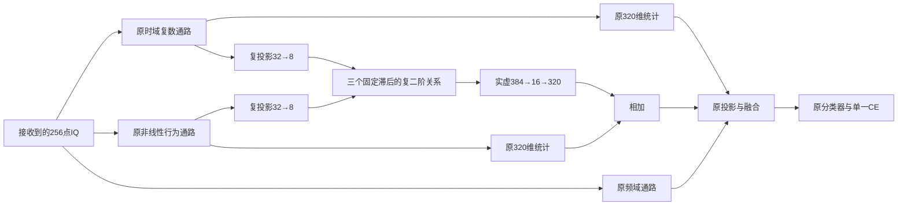

# Phase1跨通路复相关读出设计

本轮研究问题是：在原分类交叉熵和训练流程下，把时域通路与非线性行为通路的关系显式交给网络，是否能提高源域识别和冻结后的跨接收机表现？设计已经实现，但性能提升与论文贡献尚未成立。

## 源证据与研究动机

设计只使用源码及源域证据：[前轮源训练](../automation_reports/CV-SincNet/20261003-phase1-cvs-neural-readout-identity-manysig-m8-r01/evidence/source_learning_analysis.json)、[冻结读出归因](../automation_reports/CV-SincNet/20261003-diagnostic-cvs-readout-attribution-source-manysig-m8-r01/evidence/mechanism_verdict.json)。新注意力读出降低了训练CE，却提高源V CE并降低源选择分数；关闭行为增量导致24.48或36.25个百分点的准确率下降。这个现象支持共同适应和分支依赖，不证明新增分支只学了接收机，也不证明限制容量必然更好。

原时域、行为读出分别汇总各自特征，之后才融合。即使两个单独读出保持不变，两条通路之间的相位关系仍可变化。因此，本轮直接学习池化前的跨路径关系，并把增量限制在16维线性子空间。此约束是结构假设，不是对泛化的保证；性能优先，参数减少本身不构成晋级依据。

## 已实现结构

基座为从零初始化的`neural_residual_shallow`。原时域、频域、行为通路、320维统计读出、160维最终表征和余弦分类器都保留。两个候选都没有加载历史权重。

设投影后的复特征为`A,B∈C^(8×64)`，分别来自time与behavior。固定滞后`l∈{0,4,8}`，共同使用`T={8,…,63}`。所有滞后都有56对样本，方向固定为`A(t-l) conj(B(t))`。

每个滞后分别计算：

\[
P^A_{i,l}=\frac1{56}\sum_{t\in T}|A_i(t-l)|^2,
\quad P^B_j=\frac1{56}\sum_{t\in T}|B_j(t)|^2,
\quad M_{ij,l}=\frac1{56}\sum_{t\in T}A_i(t-l)\overline{B_j(t)}.
\]

`crosspath_gram`使用整条投影通路的平均通道能量作分母：

\[
G_{ij,l}=\frac{M_{ij,l}}{8\sqrt{\max(\bar P^A_l,\epsilon)\max(\bar P^B,\epsilon)}}.
\]

`crosspath_coherence`仅将分母换成对应投影通道的能量：

\[
C_{ij,l}=\frac{M_{ij,l}}{8\sqrt{\max(P^A_{i,l},\epsilon)\max(P^B_j,\epsilon)}},\qquad\epsilon=10^{-6}.
\]

实现先把两个因子分别归一化，再做复矩阵乘法，避免零能量下平方根反传奇异。两者都是未中心化二阶矩，不称为中心化协方差。三个矩阵实虚部共384维，依次通过无偏置、无激活的`384→16→320`；末层权重初始化为零，其余投影随机初始化且两候选配对。输出加到原behavior统计，time统计不变。新增参数12288，总参数233275。新模块初始化隔离随机数状态，使同seed初始函数与自己的scratch Shallow完全相等。

## 能证明的性质与不能推导的结论

- 对两路共同的常数相位旋转，复交叉矩保持不变。既有全网共同相位性质仍需数值验证。
- 当变换前后能量都高于数值下界时，coherence统计对每个投影通道的正幅度缩放不变；Gram对整条投影通路的正幅度缩放不变。触及下界时不主张精确增益不变性。
- 两种统计在每个滞后的Frobenius范数均不超过1（浮点误差除外）。这只约束关系统计，不约束后续可学习投影的输出大小。
- 低秩出口的线性映射秩至多16；不等于整个网络或数据表征只有16维。
- 特征通道不是物理频率通道。投影后的正增益不变性不能推出输入IQ经过任意多径、接收机频响、CFO或接收机非线性后的不变性；也不消除两路独立的相位差。
- time和behavior继承不同的padding、卷积历史及整包RMS。三个滞后描述固定特征网格上的关系，不能说它们完成了物理同步。统一56对没有消除原网络的边缘影响。
- 原skip完整保留只保证接线和初始函数，不保证训练后的原路径独立可用，也不保证避免共同适应。
- 单独改变一条feature路径的常数相位，可让原独立统计不变而跨路径关系改变。这是局部表示能力的反例，不是实际TX可识别性或真实信道鲁棒性的证明。

## 与已有工作的区别及尚未证明的新颖性

双通路外积池化和二阶特征学习已有成熟研究，不能把“复相关/双线性池化”本身当成新发明。[Bilinear CNN Models for Fine-Grained Visual Recognition](https://www.cv-foundation.org/openaccess/content_iccv_2015/html/Lin_Bilinear_CNN_Models_ICCV_2015_paper.html)给出了可端到端训练的双通路池化外积表示。本轮要检验的是：复数等变的时域与非线性行为通路、固定有限滞后、两种归一化和低秩关系出口，在既定RFF协议下是否形成有用组合。

RFF已有多尺度与注意力融合研究，例如[Fine-Grained Radio Frequency Fingerprint Recognition Network Based on Attention Mechanism](https://pmc.ncbi.nlm.nih.gov/articles/PMC10814318/)；因此“增加融合模块”同样不自动构成论文创新。后续论文需要区分可证明的结构性质、匹配训练消融、冻结测试结果与已有方法，并补充具体相关工作对比；当前不作首创声明。

仓库旧`coherence`处理单通道时间增量，旧`crossphase`使用同一路内固定锚通道相关并替换位置功率，旧`moment`处理IQ多项式中心化，前轮注意力仍是两路独立池化。本轮明确计算两路之间的关系，并保留原统计。

## 冻结实验设计

新run为`20261003-phase1-cvs-crosspath-relation-identity-manysig-m8-r01`：两种结构各4个model seed，共8份scratch E200训练。两者仅归一化分母不同，其他新旧参数初始化配对，固定lag、瓶颈和出口，不扫描这些超参数。

仍用6300条L、56700条未使用U及27000条V；split392005，原4个model/loader seed，batch128不丢尾批，E200×50步，AdamW、原余弦LR、FP32/TF32关闭。无增强、额外loss、teacher、EMA、采样或权重改变、分阶段训练和目标域适配。

固定源比较包含8个新结果、4个Shallow和4个当前源赢家Anchor。旧结果只读取合规源元数据，不继承权重。按四seed平均`0.5×V准确率+0.5×最差源RX准确率`选择，性能完全并列后才看成本。新候选胜出才执行预登记的4份新clean预测并复用44份既有对照；否则核实复用选中控制的原冻结测试。测试结果不得用于调整本结构、重排候选或选择性重跑。

该矩阵能比较归一化效应和整块结构相对Shallow的变化，但不能独立排除新增容量解释，也不能单独分离各lag或低秩约束的效应。这些限制不能靠冻结关闭分支的诊断替代重训消融。源V仍属于已见接收机，不能把源改进写成未见域泛化。

实现：[model.py](../experiments/cvs_crosspath_relation_identity/model.py)。实验实际配置、启动和结果以[原run登记](../automation_reports/CV-SincNet/20261003-phase1-cvs-crosspath-relation-identity-manysig-m8-r01/report.md)为准。

## 执行结果

8份scratch E200训练、80000步日志审计和完整曲线分析完成。Gram与coherence的固定源分数分别为96.9111%和96.9491%，相对同主干Shallow下降0.2106±0.1123和0.1727±0.1513个百分点，均为0/4个seed胜出。配对SD描述固定数据划分下的模型seed差异，不是置信区间。源规则保留Anchor。

新分支持续收到CE梯度，E200最后28个训练样本上的关系出口相对skip约为5.43%和5.05%，因此不能把负结果直接解释为分支未执行；这些局部幅度也不能代表全源贡献。训练CE为0.000700和0.000686，与Shallow的0.000711接近，源V CE却从0.086423升至0.096787和0.095973。曲线与源准确率共同支持过拟合的描述，但没有识别信道/RX捷径这一因果机制。coherence比Gram平均高0.0380个百分点，仍未超过基准，不能据此宣称信道鲁棒。本轮只检验所实现的有限滞后跨路径关系结构，不能否定所有关系建模，也不能证明纯CE架构创新不可行。

[完整实验报告](../automation_reports/CV-SincNet/20261003-phase1-cvs-crosspath-relation-identity-manysig-m8-r01/report.md)。冻结后核验复用Anchor既有clean证据；未激活新候选测试。纯架构提升和论文结论仍未建立。
