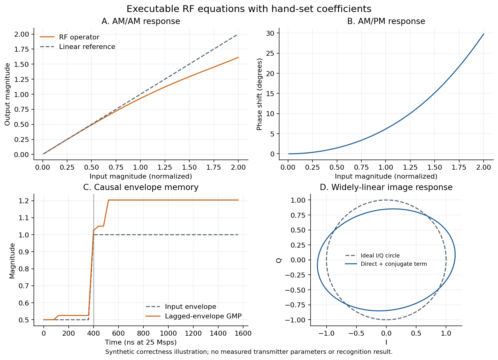
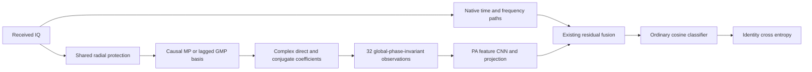

# CVS 的射频物理算子：前瞻假设与验证边界

记录时间：2026-10-02。本设计来自用户“真正的 RFF physics aware”要求、当前源代码与射频行为模型；记录时 simplex 源选择已完成，simplex clean 尚未发布。任何本轮或历史目标评分均不是本设计、候选排序或预算的输入。沿用身份骨干、普通 CE、无输入/信道增强、同物理划分、clean-only；性能优先，参数成本次要。

## 数据与物理含义

实际输入是 ManySig equalized=1 的 256 点 IQ，逐包 RMS 归一化。WiSig 原论文说明：25 Msps 捕获 → 20 Msps 重采样、L-STF 同步和 CFO 校正 → L-LTF 信道估计及 MMSE 均衡 → CFO 加回 → 25 Msps 重采样。因此保留频偏，均衡不等于去除接收机硬件。当前配置 25 MHz 与公开生成流程一致。这里只研究已经处理的接收信号，不把它当作 PA 已知输入/输出对。[WiSig 原论文，III、IV-B](https://arxiv.org/html/2112.15363)

观测链仍是 `x = R_rx(H * T_tx(s)) + n`。单包未知信道/接收机下，仅凭 CE 不能保证把发射机、接收机、信道分别辨识。已知 WiFi 前导码有进一步研究价值，但本轮不引入参考重建、query 拟合、数据变体或跨包统计。

## 当前差距

现有 PA lift 使用奇数阶记忆多项式，随后对 I/Q 独立裁剪并进入不受约束的实数卷积。非线性基具有物理来源，但独立裁剪破坏全局相位等变性，实数卷积不保证复数乘法结构或因果记忆。相位增量与等角分类头分别改善表征/分类几何，不能单凭名称称为硬件辨识。

## 本轮固定候选

以原 residual_fusion 的时间、频率、融合和普通余弦分类头为共同框架，从零训练；只替换 PA 提取链。保留旧框架的 scratch 初始化，不加载旧权重。两候选均为 8 个复数滤波通道，输出 32 个物理观测通道，再用相同宽度的实数卷积和 PA 投影处理。实数卷积只作用在已经构造的相位不变观测上。

- `rf_mp`：阶数 p∈{1,3,5}，延迟 m∈{0,1,2,3}，12 个对齐包络基。
- `rf_gmp`：保留上述 12 个基，再加 p∈{3,5}、m∈{0,1,2,3}、包络滞后 r∈{1,2} 的 16 个交叉记忆基，总 28 个。仅使用过去/当前样本，不加入未来项。

径向保护 `z=x·min(1,4/sqrt(|x|²+eps))` 对 I/Q 使用相同系数。基为

`φ[p,m,r](n)=z[n−m]·|z[n−m−r]|^(p−1)/2^(p−1)`。

固定阶数缩放只是改善量纲/数值条件，可由系数吸收。m、r 是离散延迟，25 Msps 下每点 40 ns；最大延迟 5 点。截断阶数和 200 ns 记忆范围是本轮假设，不声称覆盖真实 PA 全部热记忆。对齐 MP 与滞后 GMP 的物理依据见 [Morgan 等，IEEE TSP 2006](https://doi.org/10.1109/TSP.2006.879264)。

共享可训练复数系数形成 `D=Σaφ` 与 `V=Σbφ*`，合成算子 `D+V` 对应截断的广义线性非线性滤波。系数实部/虚部允许幅度与相位响应；共轭项对应 IQ 镜像的行为模型。[Korpi 等，II-A](https://arxiv.org/html/1402.6083)

不在 D、V 之间插入实数 ReLU、独立 I/Q 偏置或普通混合卷积。全局旋转 x→e^(jθ)x 下，D→e^(jθ)D、V→e^(−jθ)V。分类分支使用逐时刻 `log(1+|D|²)`、`log(1+|V|²)`、`Re(DV)/sqrt((|D|²+eps)(|V|²+eps))` 与对应虚部，共 4×8 通道。观测严格全局相位不变，归一化乘积模长≤1。边界补零，历史窗口不环绕。

这是一种受射频行为模型约束的特征算子，**不是已识别的某台发射机 PA/IQ 参数**：输入是 received IQ，系数由所有源类共享并经 CE 学习；真实 TX/RX IQ 串联及 PA 更高阶交叉项未完整覆盖。整体 CVS 保留普通时间/频率路径，不能推导整体网络相位不变，更不能推导 CFO、任意多径或接收机不变。

## 应交付的物理验证

使用与真实数据完全分离的合成输入，验证：手工指定系数的 AM/AM 与 AM/PM 映射、过去样本对记忆响应的贡献、直接/共轭广义线性输出、旋转等变/观测不变、未来扰动不影响过去输出、边界零填充、零及弱信号有限导数、不同 batch 划分结果一致、CE 向物理系数真实反传。合成变换只用于算子正确性检查，正式训练无增强。

正式预算固定为 2 候选×4 model seed、E200×50、同 source L/V，四 seed 最终源 V 与最差源 RX 的等权均值最高优先；性能完全并列后才比较成本。完整源日志和独立 P0/P1 审查后冻结一个候选，默认只测该候选的 4 个 clean 预测，与原 20 个固定对照同物理 query 独立 truth-last 评分。所有负结果保留，测试不回流调参/重排/选择性重跑。物理性质通过与识别收益提升必须分别给证据，未测量结果记 N/A。

第一轮的可证目标是“可执行、受约束的 RF 算子”，最终目标仍是更好的跨接收机识别。若算子约束成立而性能下降，该候选不晋级；不能用物理名称或参数减少替代性能证据。

## 已实现的算子与示例

以下说明实现结果，未改变上面的前瞻候选、预算或源选择规则。图中系数手工设置，输入为独立合成信号；未加载训练权重、未读取真实 IQ。AM/AM、AM/PM 与直接/共轭解析式的最大数值差分别在 2.49e−16 与 1.12e−16 以内（float64）。这些图是方程执行示例，不是实测发射机参数或识别结果。

因果性保证到 RF 算子输出；后续卷积、归一化与池化处理整包，不保证在线因果推理。相位不变性保证在 32 通道物理观测处；普通时间/频率路径仍保留，因此不能把整个模型描述为相位或 CFO 不变。
