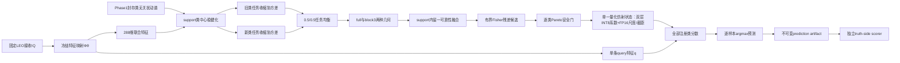
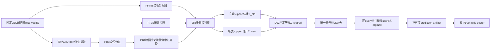

# RTB-IDR（D92）方法原理、机制、输入输出、资源需求与论文复现方法对比报告

日期：2026-07-27

修订：v7，补充逐式符号、维度和运算说明

证据状态：`EVIDENCE_BOUND_TECHNICAL_REPORT`

D92实验状态：`COMPLETED_DIAGNOSTIC_NEGATIVE_NOT_PROMOTABLE`

## 摘要

D92是一种面向CVS Stage2-C的完整support-only少样本类增量判别方法。它以冻结Phase1部署bundle、固定LEO接收IQ和旧/新类标注support为输入，依次完成288维联合特征提取、类无关扰动谱建模、support类中心稳健化、旧/新任务自动收缩协方差估计、full/block双几何可靠性融合、有界Fisher残差安全选择和统一仿射头编译。它不是重新训练Phase1主干的端到端网络，但完整覆盖Phase2从合法输入到全注册类预测artifact的状态构造与推理闭环。

本文建议将完整方法命名为**RTB-IDR**，英文全称为**Robust Task-Balanced Incremental Discriminant Registration**，中文名为**稳健任务均衡增量判别注册方法**。“Robust”对应扰动谱与Cauchy稳健中心，“Task-Balanced”对应旧/新任务固定等权协方差，“Incremental Discriminant Registration”对应新类注册、共享判别几何和统一全注册类仿射头。D92继续作为实验与代码编号。

D92对旧类任务和新类任务分别估计协方差，并固定合成为

$$
\boldsymbol{\Sigma}_{\mathrm{bal}}
=
\frac{1}{2}\boldsymbol{\Sigma}_{\mathrm{o}}
+
\frac{1}{2}\boldsymbol{\Sigma}_{\mathrm{n}}.
$$

**本式符号说明：**\(\boldsymbol{\Sigma}_{\mathrm{bal}}\)是旧/新任务均衡共享协方差；\(\boldsymbol{\Sigma}_{\mathrm{o}}\)和\(\boldsymbol{\Sigma}_{\mathrm{n}}\)分别是旧类任务与新类任务内部估计的协方差；下标\(\mathrm{bal}\)、\(\mathrm{o}\)、\(\mathrm{n}\)分别表示balanced、old和new；系数\(1/2\)表示两个任务固定等权。

全部旧类与新类仍由同一个等先验LDA仿射头竞争。D92不读取query真值、query的old/new角色、query批次类别数、类别配额或跨query关系，也不根据receiver、LEO场景、seed、新类数或具体TX标识切换公式。

D92同时处理三类困难：跨接收机和LEO弱信道造成的support中心扰动、高维小样本协方差不适定，以及新类数量增加造成的旧/新任务统计失衡。完整125稳定性screen显示，D92在K10/new20上相对其严格matched control把注册后旧类准确率提高2.622个百分点、最低旧类准确率提高4.600个百分点、遗忘降低2.622个百分点，但新类准确率下降0.653个百分点；K1因无法辨识类内扰动而进入保守回退分支。D92证明了“扰动稳健中心+任务均衡判别几何”能缓解大规模注册下的旧类遗忘，但当前实例没有同时解决新类性能、K1适配和绝对准确率，因此不能晋级。

与论文复现方法相比，D92同时承担旧类域适应和新类注册；MRIOR-SDA、DADDA-SDA、ProtoNet CDA只承担Stage2-B闭集旧类域适应，不能直接与D92注册后的`H_old_new`比较。CSIL、MoPC-HR和Orthogonal Incremental SEI承担类增量任务，但其原论文允许base/source训练、历史统计或原生增量流程，数据权限和模型生命周期不同。项目中已有同LEO条件的复现结果可以描述性比较，但只有数据哈希、seed、support/query和候选空间完全匹配时才能称为严格paired comparison。

资源上，RTB-IDR属于“低频注册较重、长期推理很轻”的方法。K10完整状态构造按现有审计约为11.15–11.74GMAC等价上界；26类最终头采用双层残差INT8系数、FP16块尺度/截距和FP32对角metric，其核心数组约16.11KiB，不保存FP32系数sidecar，分类部分为7,488MAC/query。算法架构适合“偶发注册、大量推理”的星上工作模式，但当前Python、NumPy、PyTorch和scikit-learn研究实现没有目标星载处理器上的WCET、峰值RAM、能耗、热和容错证据，不能直接视为飞行软件。

## 1.阅读约定：把D92视为完整方法

本报告从这一节开始，不再按“D92相对D81或D62增加了什么”组织方法。这里的D92指实验中实际执行的完整Phase2分类方法：

> D92是一种面向跨接收机少样本类增量RFFI的support-only稳健判别方法。它从固定LEO接收IQ提取身份、频谱和射频统计特征，利用Phase1封存的类无关扰动谱稳健化每个注册类的support中心，分别估计旧类任务与新类任务的收缩协方差，以固定等权方式形成共享判别几何，再通过support内交叉拟合选择full/block几何和有界Fisher残差，最终编译成一个面对全部注册类的等先验仿射分类器。

D92可以依赖冻结的Phase1编码器，就像线性探测、原型网络或LDA可以依赖预训练特征提取器一样。这不妨碍将D92作为一套完整的Phase2方法讲解。方法的完整性由以下闭环定义：

1.明确合法输入；
2.从IQ到特征的确定性映射；
3.仅由support构造预测状态；
4.对任意单条query输出全部注册类分数与唯一预测；
5.预测封存后再由独立scorer计算指标。

历史开发编号只用于定位代码，不参与方法定义。换言之，下面先回答“D92本身是什么、为什么成立、怎样运行”，最后才说明各模块在仓库中的实现文件。

## 2.问题定义

### 2.1 接收观测模型

对发射机类别\(y\)、接收机/信道域\(d\)和待发送基带信号\(s\)，接收IQ写为

$$
\mathbf{x}
=
\mathcal{R}_{d}
\left(
\mathcal{H}_{d} * \mathcal{T}_{y}(\mathbf{s})
\right)
+\mathbf{n},
$$

其中：

- \(\mathcal{T}_{y}\)表示发射机\(y\)的硬件非理想响应，是身份信息的主要来源；
- \(\mathcal{H}_{d}\)表示传播与星地弱信道；
- \(\mathcal{R}_{d}\)表示目标接收机前端和链路响应；
- \(\mathbf{n}\)表示加性噪声；
- \(\mathbf{x}\)是Phase2实际可读取的固定接收IQ。

D92不尝试从\(\mathbf{x}\)恢复clean IQ，也不估计真实信道\(\mathcal{H}_{d}\)。它直接在固定接收观测上构造对接收机扰动更稳健的少样本判别几何。

### 2.2 类别集合

旧类与新类集合分别记为

$$
\mathcal{Y}_{\mathrm{o}}
=
\{1,\ldots,C_{\mathrm{o}}\},
\qquad
\mathcal{Y}_{\mathrm{n}}
=
\{C_{\mathrm{o}}+1,\ldots,C_{\mathrm{o}}+C_{\mathrm{n}}\}.
$$

**式中各符号的含义：**

- \(\mathcal Y_{\mathrm o}\)：旧类标签集合；花体\(\mathcal Y\)表示集合，下标\(\mathrm o\)表示old。
- \(\mathcal Y_{\mathrm n}\)：新类标签集合；下标\(\mathrm n\)表示new。
- \(C_{\mathrm o}\)和\(C_{\mathrm n}\)：旧类数量和新类数量。
- \(\{1,\ldots,C_{\mathrm o}\}\)：从1到\(C_{\mathrm o}\)的全部整数标签。
- \(\{C_{\mathrm o}+1,\ldots,C_{\mathrm o}+C_{\mathrm n}\}\)：紧接旧类编号之后的新类整数标签。
- \(c\)：后文用于表示任意一个类别标签的索引。

全部已注册类别为

$$
\mathcal{Y}
=
\mathcal{Y}_{\mathrm{o}}\cup\mathcal{Y}_{\mathrm{n}},
\qquad
C=C_{\mathrm{o}}+C_{\mathrm{n}}.
$$

**式中各符号和运算的含义：**

- \(\mathcal Y\)：完成当前阶段注册后，分类器需要同时竞争的全部类别集合。
- \(\cup\)：集合并运算，把旧类集合与新类集合合并；两个集合按协议互不重叠。
- \(C\)：全部已注册类别数量。
- \(C=C_{\mathrm o}+C_{\mathrm n}\)：总类别数等于旧类数与新类数之和。

当前正式矩阵固定

$$
C_{\mathrm{o}}=6,
\qquad
C_{\mathrm{n}}\in\{5,10,20\},
\qquad
C\in\{11,16,26\}.
$$

**式中各符号的含义：**

- \(C_{\mathrm o}=6\)：正式矩阵始终包含6个旧类。
- \(C_{\mathrm n}\in\{5,10,20\}\)：每个实验slice分别注册5、10或20个新类；符号\(\in\)表示“属于该候选集合”。
- \(C\in\{11,16,26\}\)：对应总类别数分别为\(6+5\)、\(6+10\)和\(6+20\)。

“旧”和“新”只描述类别是否在Phase1出现过。D92不会在query推理时读取query的真实old/new角色。

### 2.3 Support与query

每类有\(K\)个物理上独立的标注support样本：

$$
\mathcal{S}_{c}
=
\left\{
(\mathbf{x}_{c,k},c)
\right\}_{k=1}^{K},
\qquad
c\in\mathcal{Y}.
$$

**式中各符号的含义：**

- \(\mathcal S_c\)：类别\(c\)的support集合。
- \(\mathbf x_{c,k}\)：类别\(c\)的第\(k\)个固定接收IQ样本。
- \(c\)：该support样本的可见类别标签，同时也是类别索引。
- \(k\)：类内shot索引，从1到\(K\)。
- \(K\)：每个类别可用的独立物理support样本数。
- \(\{(\mathbf x_{c,k},c)\}_{k=1}^{K}\)：把该类别的K个“样本—标签”有序记录收集成集合。
- \(c\in\mathcal Y\)：每个已注册类别都按相同规则构造support集合。

完整support集合为

$$
\mathcal{S}
=
\bigcup_{c\in\mathcal{Y}}\mathcal{S}_{c},
\qquad
N_{\mathrm{s}}=CK.
$$

**式中各符号和运算的含义：**

- \(\mathcal S\)：全部已注册类别support的总集合。
- \(\bigcup_{c\in\mathcal Y}\)：遍历所有类别\(c\)，对各\(\mathcal S_c\)执行集合并。
- \(N_{\mathrm s}\)：总support样本数。
- \(C\)：注册类别总数；\(K\)：每类shot数。
- \(N_{\mathrm s}=CK\)：在每类都恰有\(K\)个support时，总样本数为类别数乘每类样本数。

query集合写为

$$
\mathcal{Q}
=
\{\mathbf{x}^{(q)}_j\}_{j=1}^{N_{\mathrm{q}}}.
$$

**式中各符号的含义：**

- \(\mathcal Q\)：只用于最终测试的query集合。
- \(\mathbf x_j^{(q)}\)：第\(j\)个query的固定接收IQ；上标\((q)\)表示query，不是指数。
- \(j\)：query样本索引。
- \(N_{\mathrm q}\)：query样本总数。
- 本式没有写出query标签，因为预测器不能读取query真值；标签只由独立scorer在预测artifact形成后连接。

构造D92状态时只能访问\(\mathcal{S}\)及其标签。query真值、query类别配额、真实old/new角色和query批次类别构成均不可见。

### 2.4 D92学习的映射

D92要从合法输入构造参数状态

$$
\Theta_{\mathrm{D92}}
=
\mathcal{A}
\left(
\mathcal{B}_{\mathrm{P1}},
\mathcal{S},
\Gamma
\right),
$$

**式中各符号的含义：**

- \(\Theta_{\mathrm{D92}}\)：注册完成后可供query推理使用的D92状态，包括最终仿射系数、截距、量化尺度和必要元数据。
- \(\mathcal A(\cdot)\)：D92的support-only状态构造算法。
- \(\mathcal B_{\mathrm{P1}}\)：在任何target访问前封存的不可变Phase1部署bundle。
- \(\mathcal S\)：当前row合法可见的带标签support集合。
- \(\Gamma\)：不依赖当前support/query内容的锁定算法配置。
- 等号表示\(\Theta_{\mathrm{D92}}\)完全由这三类合法输入构造，不包含query真值或clean/source运行时输入。

对每个query，D92执行

$$
\widehat{y}_j
=
\arg\max_{c\in\mathcal{Y}}
s_c\!\left(\mathbf{x}^{(q)}_j;\Theta_{\mathrm{D92}}\right).
$$

**式中各符号和运算的含义：**

- \(\widehat y_j\)：模型对第\(j\)个query输出的预测类别；帽号表示估计值而非真值。
- \(\arg\max\)：返回使后续分数最大的类别索引。
- \(c\in\mathcal Y\)：候选范围是全部已注册类别，而不是预先知道的old或new子集。
- \(s_c(\cdot)\)：类别\(c\)的判别分数函数，分数越大表示模型越倾向类别\(c\)。
- \(\mathbf x_j^{(q)}\)：第\(j\)个query接收IQ。
- 分号后的\(\Theta_{\mathrm{D92}}\)：计算分数时使用的已注册D92状态。
- \(j\)：query索引；\(c\)：候选类别索引。

这是逐样本、全注册类、单次\(\arg\max\)决策，不存在先判断old/new角色再进入不同分类器的过程。

## 3.符号、维度与含义

本报告采用“全局符号表+逐式就地说明”两层结构。下表便于统一检索；后文每个独立公式块下方仍重复给出该式涉及的变量、上下标、维度、算子和固定常数。核心特征映射使用逐项清单；连续推导和数值例子使用模块内完整符号说明，因此读者不需要返回本节才能读懂公式。

### 3.1 集合和计数符号

|符号|类型或取值|含义|
|---|---:|---|
|\(\mathcal{Y}_{\mathrm{o}}\)|类别集合|Phase1已见、Phase2需要适应的旧类|
|\(\mathcal{Y}_{\mathrm{n}}\)|类别集合|Phase1未见、Phase2需要注册的新类|
|\(\mathcal{Y}\)|类别集合|全部已注册类|
|\(C_{\mathrm{o}}\)|正整数|旧类数量，当前为6|
|\(C_{\mathrm{n}}\)|正整数|新类数量，当前为5、10或20|
|\(C\)|正整数|注册类总数，\(C=C_{\mathrm{o}}+C_{\mathrm{n}}\)|
|\(K\)|正整数|每类独立物理support样本数|
|\(N_{\mathrm{s}}\)|正整数|support总数，\(N_{\mathrm{s}}=CK\)|
|\(N_{\mathrm{q}}\)|正整数|query总数|
|\(\mathcal{S}_c\)|样本集合|类别\(c\)的K-shot support|
|\(\mathcal{S}\)|样本集合|所有注册类的support|
|\(\mathcal{Q}\)|样本集合|只用于测试的query|

### 3.2 观测和特征符号

|符号|维度|含义|
|---|---:|---|
|\(\mathbf{x}\)|\(2\times L\)或等价复数长度\(L\)|固定接收IQ|
|\(\Phi_{\theta}\)|映射|冻结的Phase1特征提取器及确定性接收后特征计算|
|\(E_{\theta}\)|映射|冻结编码器的160维身份特征映射|
|\(\mathcal{N}_{\varepsilon}\)|映射|带\(\varepsilon\)下界保护的行二范数归一化|
|\(\varepsilon\)|\(10^{-8}\)|FFT/RF描述和行归一化的数值保护常数|
|\(\mathbf{z}\)|\(p=288\)|D92联合特征|
|\(\mathbf{f}^{\mathrm{id}}\)|160|归一化前的编码器身份特征|
|\(\mathbf{f}^{\mathrm{fft}}\)|96|均值删除并归一化后的FFT描述|
|\(\mathbf{f}^{\mathrm{rf}}\)|32|归一化后的RF统计描述|
|\(\mathbf{f}^{\mathrm{aux}}\)|128|FFT96与RF32拼接后共同归一化的辅助特征|
|\(\mathbf{z}^{\mathrm{id}}\)|160|冻结编码器产生的身份表征|
|\(\mathbf{z}^{\mathrm{fft}}\)|96|由同一接收IQ计算的FFT特征|
|\(\mathbf{z}^{\mathrm{rf}}\)|32|由同一接收IQ计算的射频统计特征|
|\(\widetilde{\mathbf{z}}\)|288|经过类中心稳健化后的support特征|
|\(\mathbf{q}\)|288|query联合特征|
|\(p\)|288|总特征维数|
|\(p_{\mathrm{id}},p_{\mathrm{fft}},p_{\mathrm{rf}}\)|160、96、32|三个特征块的维数|

### 3.3 扰动谱和稳健中心符号

|符号|维度|含义|
|---|---:|---|
|\(\mathbf{G}\)|\(160\times160\)|Phase1封存的类无关地面扰动协方差|
|\(\sigma_{\mathrm{q}}^2\)|标量|int8量化噪声底|
|\(\mathbf{G}_{+}\)|\(160\times160\)|去除量化噪声底后的对称扰动矩阵|
|\(\lambda_j\)|标量|扰动矩阵第\(j\)个正特征值|
|\(\mathbf{u}_j\)|160|对应的单位特征向量|
|\(\mathbf{U}\)|\(160\times r\)|保留的扰动基|
|\(\rho_j\)|标量|第\(j\)个扰动方向的归一化谱权重|
|\(r_{\mathrm{eff}}\)|标量|participation-ratio有效秩|
|\(r\)|正整数|实际保留秩，\(r=\lceil r_{\mathrm{eff}}\rceil\)|
|\(\bar{\mathbf{z}}^{\mathrm{id}}_c\)|160|类别\(c\)的普通support均值|
|\(\mathbf{e}_{c,k}\)|160|support样本相对类均值的残差|
|\(E_{c,k}\)|标量|样本在地面扰动谱上的加权能量|
|\(\tau_c\)|标量|类别\(c\)的平均扰动能量尺度|
|\(a_{c,k}\)|标量|未归一化Cauchy权重|
|\(\omega_{c,k}\)|标量|归一化Cauchy权重|
|\(\mathbf{m}^{\mathrm{rob}}_c\)|160|类别\(c\)的稳健身份中心|
|\(\boldsymbol{\delta}_c\)|160|普通中心到稳健中心的平移量|

### 3.4 协方差与分类头符号

|符号|维度|含义|
|---|---:|---|
|\(\boldsymbol{\mu}_c\)|288|稳健化后类别\(c\)的联合特征均值|
|\(\mathbf{D}_c\)|\(288\times288\)|类别\(c\)逐维support标准差组成的对角矩阵|
|\(\mathbf{u}_{c,k}\)|288|类别\(c\)第\(k\)个support的标准化残差|
|\(\mathbf{S}_c\)|\(288\times288\)|类别\(c\)的经验协方差|
|\(\mathbf{S}^{(u)}_c\)|\(288\times288\)|标准化坐标中的经验协方差|
|\(\alpha_c\)|\([0,1]\)|类别\(c\)由Ledoit–Wolf自动估计的收缩强度|
|\(\zeta_c\)|标量|标准化经验协方差的平均特征方差|
|\(\widehat{\boldsymbol{\Sigma}}_c^{\mathrm{LW}}\)|\(288\times288\)|类别\(c\)的自动收缩协方差|
|\(\boldsymbol{\Sigma}_{\mathrm{o}}\)|\(288\times288\)|旧类任务内等先验协方差|
|\(\boldsymbol{\Sigma}_{\mathrm{n}}\)|\(288\times288\)|新类任务内等先验协方差|
|\(\boldsymbol{\Sigma}_{\mathrm{bal}}\)|\(288\times288\)|旧/新任务固定等权共享协方差|
|\(\boldsymbol{\Sigma}_{\mathrm{full}}\)|\(288\times288\)|保留全部块内和块间关系的协方差|
|\(\boldsymbol{\Sigma}_{\mathrm{blk}}\)|\(288\times288\)|只保留160/96/32三个对角块的协方差|
|\(\pi_c\)|标量|类别先验，固定为\(1/C\)|
|\(\mathbf{w}_c\)|288|类别\(c\)的仿射系数|
|\(b_c\)|标量|类别\(c\)的仿射截距|
|\(\mathbf{W}\)|\(C\times288\)|全部类别系数组成的矩阵|
|\(\mathbf{b}\)|\(C\)|全部类别截距向量|
|\(s_c(\mathbf{q})\)|标量|query属于类别\(c\)的判别分数|

### 3.5 融合和安全门符号

|符号|维度|含义|
|---|---:|---|
|\(r_h\)|标量|几何分支\(h\)的support类中心化logit RMS|
|\(r_h^{(R)}\)|标量|Fisher残差分支\(h\)的support类中心化logit RMS|
|\(\ell_{c,h}^{\mathrm{LOO}}\)|标量|分支\(h\)在类别\(c\)上的support内留一交叉熵|
|\(\eta_{c,h}\)|标量|类别\(c\)对分支\(h\)的可靠性权重|
|\(\ell_{c,h}^{(R,\mathrm{LOO})}\)|标量|Fisher残差分支\(h\)在类别\(c\)上的留一交叉熵|
|\(\eta_{c,h}^{(R)}\)|标量|类别\(c\)对Fisher残差分支\(h\)的可靠性权重|
|\(\mathbf{V}\)|\(288\times r_F\)|类均值矩阵的右奇异方向|
|\(\beta_j,\nu_j\)|标量|第\(j\)个方向的类间能量和类内能量|
|\(\gamma_j\)|\([0,1]\)|第\(j\)个方向的有界Fisher增益|
|\(\mathbf{A}\)|\(288\times288\)|identity-primary Fisher残差变换|
|\(TP_c,FP_c\)|非负整数|support交叉拟合中的类别真阳性和假阳性计数|
|\(g_c\)|\(\{0,1\}\)|类别\(c\)是否通过残差行替换安全门|

### 3.6 通用数学记号

|记号|意义|
|---|---|
|\(\mathbb{R}^{m\times n}\)|\(m\)行\(n\)列实矩阵空间|
|\(\mathbf{I}_p\)|\(p\times p\)单位矩阵|
|\(\mathbf{0}\)|与上下文维度一致的全零向量或矩阵|
|\(\mathbf{1}\)|与上下文维度一致的全一向量|
|\((\cdot)^{\mathsf T}\)|转置|
|\((\cdot)^{-1}\)|矩阵逆；实现中优先用线性方程求解代替显式求逆|
|\(\operatorname{tr}(\cdot)\)|矩阵迹，即对角元素之和|
|\(\operatorname{diag}(\cdot)\)|由向量构造对角矩阵，或按给定矩阵块构造块对角矩阵|
|\(\lVert\cdot\rVert_2\)|向量二范数|
|\(\arg\max\)、\(\arg\min\)|使目标函数达到最大值或最小值的类别索引|
|\(\mathbb{1}[\cdot]\)|指示函数；条件成立为1，否则为0|
|\(\mathcal{N}(\boldsymbol{\mu},\boldsymbol{\Sigma})\)|均值为\(\boldsymbol{\mu}\)、协方差为\(\boldsymbol{\Sigma}\)的高斯分布|
|\(\lceil a\rceil\)|不小于\(a\)的最小整数|
|\(\lambda_{\min}(\mathbf{A})\)|矩阵\(\mathbf{A}\)的最小特征值|
|\(\operatorname{softmax}\)|把有限实数向量归一化为和为1的正权重|

## 4.D92完整处理流程



这条流水线有两个时间阶段：

- 状态构造阶段：读取Phase1 bundle和当前row的support，生成\((\mathbf{W},\mathbf{b})\)；
- 推理阶段：每条query只做一次特征提取和一次全注册类仿射打分，不更新任何状态。

### 4.1贯穿六个模块的例子

为了让没有CVS、RFFI或LDA背景的读者看清每一步，下面用一个贯穿示例解释维度和数据流。示例采用：

$$
C_{\mathrm{o}}=6,
\qquad
C_{\mathrm{n}}=5,
\qquad
C=11,
\qquad
K=10.
$$

**本式符号说明：**\(C_{\mathrm o}\)、\(C_{\mathrm n}\)、\(C\)分别是旧类数、新类数和总类数；\(K\)是每类support数，\(N_{\mathrm s}=CK\)是support总数；\(\mathbf x\in\mathbb C^L\)是长度为\(L\)的复IQ向量，\(x_t=I_t+\mathrm jQ_t\)把第\(t\)个采样写成I/Q形式；\(\mathbf Z\in\mathbb R^{N_{\mathrm s}\times288}\)是全部support的288维特征矩阵。

这表示系统已经认识6个旧发射机，现在要注册5个新发射机；每个类别有10条带标签support IQ。support总数为

$$
N_{\mathrm{s}}
=
CK
=
11\times10
=
110.
$$

**本式符号说明：**\(C_{\mathrm o}\)、\(C_{\mathrm n}\)、\(C\)分别是旧类数、新类数和总类数；\(K\)是每类support数，\(N_{\mathrm s}=CK\)是support总数；\(\mathbf x\in\mathbb C^L\)是长度为\(L\)的复IQ向量，\(x_t=I_t+\mathrm jQ_t\)把第\(t\)个采样写成I/Q形式；\(\mathbf Z\in\mathbb R^{N_{\mathrm s}\times288}\)是全部support的288维特征矩阵。

一条IQ不是一张图片，而是一串复数基带采样：

$$
\mathbf{x}
=
\left[
x_0,x_1,\ldots,x_{L-1}
\right]^{\mathsf T}
\in
\mathbb{C}^{L},
$$

其中

$$
x_t=I_t+\mathrm{j}Q_t.
$$

**本式符号说明：**\(C_{\mathrm o}\)、\(C_{\mathrm n}\)、\(C\)分别是旧类数、新类数和总类数；\(K\)是每类support数，\(N_{\mathrm s}=CK\)是support总数；\(\mathbf x\in\mathbb C^L\)是长度为\(L\)的复IQ向量，\(x_t=I_t+\mathrm jQ_t\)把第\(t\)个采样写成I/Q形式；\(\mathbf Z\in\mathbb R^{N_{\mathrm s}\times288}\)是全部support的288维特征矩阵。

\(I_t\)和\(Q_t\)分别是同相、正交分量。模块一把每条IQ变成288维向量，所以110条support形成

$$
\mathbf{Z}
\in
\mathbb{R}^{110\times288}.
$$

**本式符号说明：**\(C_{\mathrm o}\)、\(C_{\mathrm n}\)、\(C\)分别是旧类数、新类数和总类数；\(K\)是每类support数，\(N_{\mathrm s}=CK\)是support总数；\(\mathbf x\in\mathbb C^L\)是长度为\(L\)的复IQ向量，\(x_t=I_t+\mathrm jQ_t\)把第\(t\)个采样写成I/Q形式；\(\mathbf Z\in\mathbb R^{N_{\mathrm s}\times288}\)是全部support的288维特征矩阵。

后续模块不再直接操作原始IQ，而是在\(\mathbf{Z}\)及其标签上完成中心估计、协方差估计、判别头构造和support内部安全选择。

|模块|读入什么|主要计算|产生什么|
|---|---|---|---|
|模块一|固定received IQ、冻结编码器|神经网络前向、FFT、统计量、归一化|每个样本的288维特征|
|模块二|身份特征、类标签、封存扰动谱|均值、残差投影、Cauchy加权|稳健化support特征|
|模块三|稳健化特征、old/new注册表|收缩协方差、任务等权、full/block结构|两种共享协方差|
|模块四|类均值、共享协方差|线性方程求解、等先验LDA|full和block仿射头|
|模块五|两个头、support标签|K折留一、交叉熵、可靠性加权|基础融合头|
|模块六|类均值、类内残差、基础融合头|SVD、Fisher增益、逐类Pareto门|最终单一量化仿射状态|

这六个模块只在support状态构造阶段运行。query到来后不会重新计算support协方差、LOO权重或Fisher安全门。

## 5.模块一：从固定接收IQ到288维联合特征

### 5.0本模块在做什么

模块一解决的问题是：原始IQ是一串随时间变化的复数采样，不能直接交给后面的协方差与LDA计算；系统需要把每条长度为\(L\)、物理含义复杂的IQ压缩成固定长度的实数向量。

可以把这一过程理解为“从三个角度描述同一个无线电片段”：

1.冻结编码器回答“这条波形像哪个发射机”；
2.FFT96回答“能量在频率轴上如何分布”；
3.RF32回答“幅度、相位、矩和短时相关性是什么样”。

本模块的输入输出为：

|项目|数学对象|形状|是否学习|
|---|---|---:|---|
|输入IQ|\(\mathbf{x}\)|\(L\)个复数采样|否，固定received IQ|
|身份特征|\(\mathbf{f}^{\mathrm{id}}\)|160|冻结编码器前向|
|频谱特征|\(\mathbf{f}^{\mathrm{fft}}\)|96|确定性计算|
|射频统计|\(\mathbf{f}^{\mathrm{rf}}\)|32|确定性计算|
|输出特征|\(\mathbf{z}\)|288|按固定规则拼接归一化|

逐条样本的计算顺序是：

```text
received IQ
  ├─冻结编码器前向→160维身份特征
  ├─中心化/Hann窗/FFT/插值→96维频谱特征
  └─幅度、相位、矩、自相关等统计→32维RF特征
          ↓
FFT96与RF32拼成128维辅助块并归一化
          ↓
身份块单独归一化
          ↓
辅助块乘固定权重4
          ↓
拼成288维并再次归一化
```

如果身份块和辅助块都非零，两者在拼接前的范数均为1。乘权并最终归一化前，拼接向量范数为

$$
\sqrt{1^2+4^2}
=
\sqrt{17}.
$$

**本式符号说明：**

- 第一个1：单独归一化后的160维身份特征块范数。
- 数字4：128维辅助特征块的固定几何权重。
- \(\sqrt{1^2+4^2}\)：两个正交拼接块加权后的整体\(L_2\)范数。
- \(\sqrt{17}\)：外层归一化前完整288维拼接向量的范数。
- 这里的辅助特征块记为\(\mathbf f^{\mathrm{aux}}\)。它由FFT96和RF32拼接后共同归一化得到：

  \[
  \mathbf f^{\mathrm{aux}}
  =
  \mathcal N_\varepsilon
  \left(
  \begin{bmatrix}
  \mathbf f^{\mathrm{fft}}\\
  \mathbf f^{\mathrm{rf}}
  \end{bmatrix}
  \right)
  \in\mathbb R^{128}.
  \]

  其中，\(\mathbf f^{\mathrm{fft}}\in\mathbb R^{96}\)是FFT频谱描述，\(\mathbf f^{\mathrm{rf}}\in\mathbb R^{32}\)是RF统计描述，\(128=96+32\)，\(\mathcal N_\varepsilon\)是带数值保护的\(L_2\)归一化。

所以最终身份块范数为

$$
\frac{1}{\sqrt{17}},
$$

**本式符号说明：**

- 分子1：身份块在进入最终拼接前已经单独归一化为单位范数。
- 分母\(\sqrt{17}\)：身份块和四倍辅助块拼接后的总范数。
- \(1/\sqrt{17}\approx0.2425\)：最终288维向量完成外层归一化后，身份块所占的块范数。

辅助块范数为

$$
\frac{4}{\sqrt{17}}.
$$

**本式符号说明：**

- 分子4：辅助块\(\mathbf f^{\mathrm{aux}}\)在最终拼接前乘以固定权重4。
- 分母\(\sqrt{17}\)：加权身份块与辅助块的拼接总范数。
- \(4/\sqrt{17}\approx0.9701\)：最终288维向量完成外层归一化后，整个辅助块所占的块范数。
- 该值描述128维辅助块整体，不表示其中每个FFT或RF坐标都等于\(4/\sqrt{17}\)。

这说明固定权重4不是“把辅助特征简单放大四倍后就结束”，而是在最终单位球面上规定两个大块的相对几何。权重不由当前query或测试准确率决定。

### 5.1 特征映射

定义带数值保护的行归一化

$$
\mathcal{N}_{\varepsilon}(\mathbf{v})
=
\frac{
\mathbf{v}
}{
\max
\left(
\lVert\mathbf{v}\rVert_2,\varepsilon
\right)
},
\qquad
\varepsilon=10^{-8}.
$$

**式中各符号的含义：**

- \(\mathbf{v}\)：等待归一化的任意实数特征向量；粗体表示它含有多个坐标，不是一个标量。
- \(\mathcal{N}_{\varepsilon}(\cdot)\)：带数值保护的\(L_2\)归一化算子；输出方向与输入相同，正常情况下输出向量的\(L_2\)范数为1。
- \(\lVert\mathbf{v}\rVert_2=\sqrt{\sum_jv_j^2}\)：向量\(\mathbf{v}\)的欧氏范数，也就是所有坐标平方和的平方根。
- \(v_j\)：\(\mathbf{v}\)的第\(j\)个坐标；下标\(j\)只用于遍历向量维度。
- \(\max(a,b)\)：取标量\(a\)和\(b\)中较大的一个。
- \(\varepsilon\)：防止除零和极小分母的数值保护常数；当前固定为\(10^{-8}\)，不从support或query学习。
- \(10^{-8}\)：十的负八次方，即\(0.00000001\)。

对任意固定接收IQ\(\mathbf{x}\)，冻结编码器首先产生160维身份特征

$$
\mathbf{f}^{\mathrm{id}}
=
E_{\theta}(\mathbf{x})
\in\mathbb{R}^{160}.
$$

**式中各符号的含义：**

- \(\mathbf{x}\)：一个物理样本经过唯一一次LEO弱信道叠加后封存的固定接收IQ；它是本式的输入。
- \(E_{\theta}(\cdot)\)：冻结的ADV3B02身份编码器；只执行前向特征提取，不在Stage2更新参数。
- \(\theta\)：编码器在Phase1训练后封存的参数集合；Stage2-A/B/C均不通过support或query修改它。
- \(\mathbf{f}^{\mathrm{id}}\)：编码器输出的身份特征向量；上标\(\mathrm{id}\)表示identity。
- \(\mathbb{R}^{160}\)：160维实数向量空间；因此\(\mathbf{f}^{\mathrm{id}}\)包含160个实数坐标。
- \(160\)：身份特征块的固定维数，不是样本数、类别数或K-shot中的\(K\)。

对同一IQ计算FFT96和RF32原始描述

$$
\mathbf{f}^{\mathrm{fft}}
\in\mathbb{R}^{96},
\qquad
\mathbf{f}^{\mathrm{rf}}
\in\mathbb{R}^{32}.
$$

**式中各符号的含义：**

- \(\mathbf{f}^{\mathrm{fft}}\)：由同一个固定接收IQ计算的96维FFT对数幅度谱描述；上标\(\mathrm{fft}\)表示频域特征。
- \(\mathbf{f}^{\mathrm{rf}}\)：由同一个固定接收IQ计算的32维射频统计描述；上标\(\mathrm{rf}\)表示radio-frequency statistics。
- \(\mathbb{R}^{96}\)：96维实数向量空间；FFT96最终保留96个频谱坐标。
- \(\mathbb{R}^{32}\)：32维实数向量空间；RF32最终保留32个统计坐标。
- 两个向量都由\(\mathbf{x}\)确定性计算，不产生第二份物理观测，也不增加K-shot计数。

辅助块先拼接并整体归一化：

$$
\mathbf{f}^{\mathrm{aux}}
=
\mathcal{N}_{\varepsilon}
\left(
\begin{bmatrix}
\mathbf{f}^{\mathrm{fft}}\\
\mathbf{f}^{\mathrm{rf}}
\end{bmatrix}
\right)
\in\mathbb{R}^{128}.
$$

**式中各符号和运算的含义：**

- \(\mathbf{f}^{\mathrm{aux}}\)：FFT96与RF32组成的辅助特征块；上标\(\mathrm{aux}\)表示auxiliary。
- \(\begin{bmatrix}\mathbf{f}^{\mathrm{fft}};\mathbf{f}^{\mathrm{rf}}\end{bmatrix}\)：沿坐标轴进行纵向拼接；先放96个FFT坐标，再放32个RF坐标，不执行加法或平均。
- \(128=96+32\)：辅助块总维数。
- \(\mathcal{N}_{\varepsilon}\)：前面定义的带保护\(L_2\)归一化；它对拼接后的整个128维向量统一归一化，而不是分别改变FFT96和RF32的方向。
- \(\varepsilon=10^{-8}\)：归一化分母的保护常数。
- \(\mathbb{R}^{128}\)：128维实数向量空间。

当前锁定几何把辅助块乘以固定权重4，再与归一化身份块拼接，最后对288维向量整体归一化：

$$
\mathbf{z}
=
\Phi_{\theta}(\mathbf{x})
=
\mathcal{N}_{\varepsilon}
\left(
\begin{bmatrix}
\mathcal{N}_{\varepsilon}
\left(
\mathbf{f}^{\mathrm{id}}
\right)\\
4\mathbf{f}^{\mathrm{aux}}
\end{bmatrix}
\right)
\in\mathbb{R}^{288},
$$

**式中各符号和运算的含义：**

- \(\mathbf{z}\)：D92实际送入稳健中心、协方差估计和LDA分类头的最终联合特征。
- \(\Phi_{\theta}(\cdot)\)：从固定接收IQ到288维联合特征的完整确定性映射；它包含冻结身份编码、FFT96、RF32、块拼接、固定缩放和两级归一化。
- \(\mathbf{x}\)：唯一固定的接收IQ输入。
- \(\theta\)：冻结身份编码器参数；下标\(\theta\)说明\(\Phi\)内部调用\(E_{\theta}\)，不表示整个FFT/RF流程都含可训练参数。
- \(\mathcal{N}_{\varepsilon}(\mathbf{f}^{\mathrm{id}})\)：先把160维身份块单独归一化，使其进入外层拼接前的范数为1。
- \(\mathbf{f}^{\mathrm{aux}}\)：已经由FFT96和RF32拼接并归一化的128维辅助块。
- \(4\mathbf{f}^{\mathrm{aux}}\)：把辅助块的每个坐标乘以固定标量4；此处的4是预先锁定的几何权重，不是类别数、K-shot数或根据query选择的参数。
- \(\begin{bmatrix}\mathcal{N}_{\varepsilon}(\mathbf{f}^{\mathrm{id}});4\mathbf{f}^{\mathrm{aux}}\end{bmatrix}\)：将160维身份块与128维加权辅助块纵向拼接。
- 外层\(\mathcal{N}_{\varepsilon}\)：对完整288维拼接向量再次做\(L_2\)归一化，得到单位范数联合特征。
- \(288=160+128=160+96+32\)：最终联合特征维数。
- \(\mathbb{R}^{288}\)：288维实数向量空间。

最终块切片仍记为

$$
\mathbf{z}^{\mathrm{id}}\in\mathbb{R}^{160},
\qquad
\mathbf{z}^{\mathrm{fft}}\in\mathbb{R}^{96},
\qquad
\mathbf{z}^{\mathrm{rf}}\in\mathbb{R}^{32}.
$$

**式中各符号的含义：**

- \(\mathbf{z}^{\mathrm{id}}\)：最终联合特征\(\mathbf{z}\)的前160个坐标，对应归一化后身份块。
- \(\mathbf{z}^{\mathrm{fft}}\)：\(\mathbf{z}\)中随后96个坐标，对应经过辅助块归一化、固定权重4和外层归一化共同缩放后的FFT部分。
- \(\mathbf{z}^{\mathrm{rf}}\)：\(\mathbf{z}\)中最后32个坐标，对应经过相同辅助块和外层处理后的RF统计部分。
- 上标\(\mathrm{id}\)、\(\mathrm{fft}\)和\(\mathrm{rf}\)只标记坐标来源，不表示三个独立物理观测。
- \(\mathbb{R}^{160}\)、\(\mathbb{R}^{96}\)和\(\mathbb{R}^{32}\)分别给出三个切片的实数维度。

因此，“160+96+32”描述的是最终向量的块边界，不表示三个块未经缩放直接裸拼接。固定权重4是当前部署几何的一部分，不由query或125结果按row选择。

### 5.2 FFT96如何计算

把两通道IQ写成复数序列

$$
u_t=I_t+\mathrm{j}Q_t,
\qquad
t=1,\ldots,L.
$$

**式中各符号的含义：**

- \(u_t\)：固定接收IQ在第\(t\)个采样时刻的复数样本。
- \(I_t\)和\(Q_t\)：第\(t\)个样本的同相分量和正交分量，二者都是实数。
- \(\mathrm{j}\)：虚数单位，满足\(\mathrm{j}^2=-1\)。
- \(t\)：时域采样点索引，从1依次取到\(L\)。
- \(L\)：单条IQ记录包含的复采样点总数。

先去除复均值并做RMS归一化：

$$
u_t^{(0)}
=
\frac{
u_t-\bar{u}
}{
\max
\left(
\sqrt{
\frac{1}{L}
\sum_{t=1}^{L}
\left|
u_t-\bar{u}
\right|^2
},
\varepsilon
\right)
}.
$$

**式中各符号和运算的含义：**

- \(u_t^{(0)}\)：去除复均值并完成RMS归一化后的第\(t\)个复IQ样本；上标\((0)\)表示FFT预处理状态，不表示零次幂。
- \(\bar u=L^{-1}\sum_{t=1}^{L}u_t\)：整条IQ记录的复数样本均值。
- \(u_t-\bar u\)：去除直流分量后的复数样本。
- \(|u_t-\bar u|\)：复数样本的幅值。
- \(\sum_{t=1}^{L}\)：对全部\(L\)个采样点求和。
- 根号内的平均平方幅值：去均值IQ的平均功率；其平方根是RMS幅值。
- \(\max(\cdot,\varepsilon)\)：保证归一化分母不小于\(\varepsilon=10^{-8}\)。

施加Hann窗\(h_t\)，计算中心化频谱

$$
U_k
=
\operatorname{fftshift}
\left[
\operatorname{FFT}
\left(
u_t^{(0)}h_t
\right)
\right]_k.
$$

**式中各符号和运算的含义：**

- \(h_t\)：长度为\(L\)的Hann窗在第\(t\)个采样点的窗值，用于减小有限长度截断造成的频谱泄漏。
- \(u_t^{(0)}h_t\)：加窗后的复IQ序列。
- \(\operatorname{FFT}(\cdot)\)：离散快速傅里叶变换，把长度\(L\)的时域序列变换到频域。
- \(\operatorname{fftshift}(\cdot)\)：把零频分量移动到频谱中央。
- \(U_k\)：移频后频谱的第\(k\)个复数频点。
- \(k\)：频率bin索引，不是K-shot中的大写\(K\)。
- \([\cdot]_k\)：从完整频谱向量中取出第\(k\)个坐标。

取对数幅度

$$
v_k
=
\log
\left(
1+\left|U_k\right|
\right),
$$

**式中各符号和运算的含义：**

- \(v_k\)：第\(k\)个频点经过对数压缩后的实数幅度。
- \(U_k\)：上一式得到的第\(k\)个复数频谱系数。
- \(|U_k|\)：频谱系数的幅值，不包含复相位。
- \(\log(\cdot)\)：自然对数。
- 常数1：保证当\(|U_k|=0\)时对数输入仍为1，从而得到有限值0。

然后在归一化频率轴上用线性插值重采样到96点，得到\(\mathbf{r}^{\mathrm{fft}}\in\mathbb{R}^{96}\)。最后删除96维均值并归一化：

$$
\mathbf{f}^{\mathrm{fft}}
=
\mathcal{N}_{\varepsilon}
\left(
\mathbf{r}^{\mathrm{fft}}
-
\frac{
\mathbf{1}^{\mathsf T}\mathbf{r}^{\mathrm{fft}}
}{96}
\mathbf{1}
\right).
$$

**式中各符号和运算的含义：**

- \(\mathbf{r}^{\mathrm{fft}}\)：把原始对数幅度频谱沿频率轴线性插值到96点后得到的实数向量。
- \(\mathbf1\in\mathbb R^{96}\)：96维全一向量。
- \(\mathbf1^{\mathsf T}\mathbf r^{\mathrm{fft}}\)：96个频谱坐标之和。
- \((\mathbf1^{\mathsf T}\mathbf r^{\mathrm{fft}})/96\)：96个频谱坐标的算术平均值。
- 平均值乘\(\mathbf1\)：把同一个平均值复制到96个坐标。
- 括号内的减法：删除FFT96的公共均值，只保留相对频谱形状。
- \(\mathcal N_\varepsilon\)：对去均值后的96维向量做带数值保护的\(L_2\)归一化。
- \(\mathbf f^{\mathrm{fft}}\)：最终FFT96特征。
- 上标\({\mathsf T}\)：矩阵或向量转置。

这条路径对同一固定IQ只执行一次，不重新叠加LEO信道。

### 5.3 RF32如何计算

RF32先对复IQ做RMS增益归一化，再构造32个统计量：

|编号|统计量|数量|
|---:|---|---:|
|1–2|\(I,Q\)均值|2|
|3–4|\(I,Q\)标准差|2|
|5|\(I/Q\)相关系数|1|
|6–7|幅度均值、标准差|2|
|8–12|幅度10%、25%、50%、75%、90%分位数|5|
|13|最大幅度|1|
|14–15|幅度偏度、峰度|2|
|16–18|二阶复中心矩的实部、虚部、模|3|
|19–20|三阶复中心矩的实部、虚部|2|
|21–23|四阶复中心矩的实部、虚部、模|3|
|24–31|lag为1、2、4、8的复自相关实部和虚部|8|
|32|幅度lag-1归一化自相关|1|

设上述统计组成\(\mathbf{r}^{\mathrm{rf}}\in\mathbb{R}^{32}\)，最终

$$
\mathbf{f}^{\mathrm{rf}}
=
\mathcal{N}_{\varepsilon}
\left(
\mathbf{r}^{\mathrm{rf}}
\right).
$$

**式中各符号和运算的含义：**

- \(\mathbf r^{\mathrm{rf}}\in\mathbb R^{32}\)：归一化前的32维射频统计向量，其固定坐标顺序已列在上表。
- \(\mathcal N_\varepsilon\)：带\(\varepsilon=10^{-8}\)分母保护的\(L_2\)归一化。
- \(\mathbf f^{\mathrm{rf}}\in\mathbb R^{32}\)：归一化后的RF32输出。
- 上标\(\mathrm{rf}\)：表示射频统计来源，不表示另一个接收机或另一次信道观测。
- 本式的归一化删除整体尺度，但不会消除32个统计量之间的相关性或冗余。

RF32对整体增益具有归一化不变性，但仍保留IQ不平衡、幅度分布、高阶矩和短时相关结构。

### 5.4 为什么组合三种特征

160维身份表征承担主要类别区分；96维FFT描述频域形态；32维RF统计提供低维射频结构。D92同时保留两种假设：

1.三个块之间的相关性有判别价值，对应full协方差；
2.块间相关性在少样本下不稳定，对应block3协方差。

方法不会事先断言哪种假设永远正确，而是使用support内交叉拟合为每个类别分配可靠性权重。

## 6.模块二：类无关扰动谱与support稳健中心

### 6.0本模块在做什么

同一发射机的K条support并不会完全重合。接收机响应、信道和噪声会把个别样本推向异常方向。如果直接取算术平均，这些样本会拖动类别中心。

模块二不是删除样本，也不是修改标签，而是回答两个问题：

1.某条support偏离本类平均值多少？
2.它的偏离是否沿着Phase1已经确认的“易受域扰动方向”？

若答案都是“是”，该样本在计算类中心时获得较小权重。

输入与输出为：

|项目|形状|作用|
|---|---:|---|
|当前类身份support|\(K\times160\)|计算普通中心和样本残差|
|扰动基\(\mathbf{U}\)|\(160\times r\)|描述容易发生域变化的方向|
|谱权重\(\boldsymbol{\rho}\)|\(r\)|表示各扰动方向的重要程度|
|Cauchy权重\(\boldsymbol{\omega}_c\)|\(K\)|决定每条support对稳健中心的贡献|
|平移量\(\boldsymbol{\delta}_c\)|160|把普通类中心移动到稳健类中心|
|输出support|\(K\times288\)|只平移身份块，FFT/RF保持不变|

完整计算链为：

```text
Phase1封存聚合扰动协方差G
    ↓去除量化噪声底并对称化
正谱特征分解→扰动基U和谱权重ρ
    ↓
当前类别K条身份特征→普通均值
    ↓
每条样本减均值→残差
    ↓投影到U
每条样本的扰动能量E
    ↓Cauchy函数
样本权重ω
    ↓加权平均
稳健中心
    ↓
所有本类support统一平移同一个δ
```

一个仅用于解释权重的三样本例子如下。假设某类三个support的扰动能量为

$$
E_1=0.1,
\qquad
E_2=0.2,
\qquad
E_3=1.2.
$$

**本式符号说明：**\(c\)是类别索引，\(k\)是类内shot索引，\(K\)是每类support数；\(\mathbf z^{\mathrm{id}}_{c,k}\)是身份块，\(\bar{\mathbf z}^{\mathrm{id}}_c\)是普通类均值，\(\mathbf e_{c,k}\)是类内残差；\(\mathbf G\)是封存扰动协方差，\(\sigma_q^2\)是量化噪声底，\(\mathbf G_+\)是去噪对称矩阵，\(\lambda_j,\mathbf u_j\)是第\(j\)个特征值和单位特征向量，\(r_{\mathrm{eff}},r\)是有效秩和保留秩，\(\mathbf U\)是扰动基，\(\rho_j\)是谱权重；\(\mathbf h_{c,k}\)、\(E_{c,k}\)、\(\tau_c\)分别是投影、扰动能量和类内能量尺度，\(a_{c,k}\)、\(\omega_{c,k}\)是未归一化和归一化Cauchy权重，\(\mathbf m_c^{\mathrm{rob}}\)、\(\boldsymbol\delta_c\)、\(\widetilde{\mathbf z}_{c,k}\)是稳健中心、中心平移和稳健化联合特征。

类别能量尺度为

$$
\tau
=
\frac{0.1+0.2+1.2}{3}
=
0.5.
$$

**本式符号说明：**\(c\)是类别索引，\(k\)是类内shot索引，\(K\)是每类support数；\(\mathbf z^{\mathrm{id}}_{c,k}\)是身份块，\(\bar{\mathbf z}^{\mathrm{id}}_c\)是普通类均值，\(\mathbf e_{c,k}\)是类内残差；\(\mathbf G\)是封存扰动协方差，\(\sigma_q^2\)是量化噪声底，\(\mathbf G_+\)是去噪对称矩阵，\(\lambda_j,\mathbf u_j\)是第\(j\)个特征值和单位特征向量，\(r_{\mathrm{eff}},r\)是有效秩和保留秩，\(\mathbf U\)是扰动基，\(\rho_j\)是谱权重；\(\mathbf h_{c,k}\)、\(E_{c,k}\)、\(\tau_c\)分别是投影、扰动能量和类内能量尺度，\(a_{c,k}\)、\(\omega_{c,k}\)是未归一化和归一化Cauchy权重，\(\mathbf m_c^{\mathrm{rob}}\)、\(\boldsymbol\delta_c\)、\(\widetilde{\mathbf z}_{c,k}\)是稳健中心、中心平移和稳健化联合特征。

未归一化Cauchy权重为

$$
a_1
=
\frac{1}{1+0.1/0.5}
\approx0.833,
$$

**本式符号说明：**\(c\)是类别索引，\(k\)是类内shot索引，\(K\)是每类support数；\(\mathbf z^{\mathrm{id}}_{c,k}\)是身份块，\(\bar{\mathbf z}^{\mathrm{id}}_c\)是普通类均值，\(\mathbf e_{c,k}\)是类内残差；\(\mathbf G\)是封存扰动协方差，\(\sigma_q^2\)是量化噪声底，\(\mathbf G_+\)是去噪对称矩阵，\(\lambda_j,\mathbf u_j\)是第\(j\)个特征值和单位特征向量，\(r_{\mathrm{eff}},r\)是有效秩和保留秩，\(\mathbf U\)是扰动基，\(\rho_j\)是谱权重；\(\mathbf h_{c,k}\)、\(E_{c,k}\)、\(\tau_c\)分别是投影、扰动能量和类内能量尺度，\(a_{c,k}\)、\(\omega_{c,k}\)是未归一化和归一化Cauchy权重，\(\mathbf m_c^{\mathrm{rob}}\)、\(\boldsymbol\delta_c\)、\(\widetilde{\mathbf z}_{c,k}\)是稳健中心、中心平移和稳健化联合特征。

$$
a_2
=
\frac{1}{1+0.2/0.5}
\approx0.714,
$$

**本式符号说明：**\(c\)是类别索引，\(k\)是类内shot索引，\(K\)是每类support数；\(\mathbf z^{\mathrm{id}}_{c,k}\)是身份块，\(\bar{\mathbf z}^{\mathrm{id}}_c\)是普通类均值，\(\mathbf e_{c,k}\)是类内残差；\(\mathbf G\)是封存扰动协方差，\(\sigma_q^2\)是量化噪声底，\(\mathbf G_+\)是去噪对称矩阵，\(\lambda_j,\mathbf u_j\)是第\(j\)个特征值和单位特征向量，\(r_{\mathrm{eff}},r\)是有效秩和保留秩，\(\mathbf U\)是扰动基，\(\rho_j\)是谱权重；\(\mathbf h_{c,k}\)、\(E_{c,k}\)、\(\tau_c\)分别是投影、扰动能量和类内能量尺度，\(a_{c,k}\)、\(\omega_{c,k}\)是未归一化和归一化Cauchy权重，\(\mathbf m_c^{\mathrm{rob}}\)、\(\boldsymbol\delta_c\)、\(\widetilde{\mathbf z}_{c,k}\)是稳健中心、中心平移和稳健化联合特征。

$$
a_3
=
\frac{1}{1+1.2/0.5}
\approx0.294.
$$

**本式符号说明：**\(c\)是类别索引，\(k\)是类内shot索引，\(K\)是每类support数；\(\mathbf z^{\mathrm{id}}_{c,k}\)是身份块，\(\bar{\mathbf z}^{\mathrm{id}}_c\)是普通类均值，\(\mathbf e_{c,k}\)是类内残差；\(\mathbf G\)是封存扰动协方差，\(\sigma_q^2\)是量化噪声底，\(\mathbf G_+\)是去噪对称矩阵，\(\lambda_j,\mathbf u_j\)是第\(j\)个特征值和单位特征向量，\(r_{\mathrm{eff}},r\)是有效秩和保留秩，\(\mathbf U\)是扰动基，\(\rho_j\)是谱权重；\(\mathbf h_{c,k}\)、\(E_{c,k}\)、\(\tau_c\)分别是投影、扰动能量和类内能量尺度，\(a_{c,k}\)、\(\omega_{c,k}\)是未归一化和归一化Cauchy权重，\(\mathbf m_c^{\mathrm{rob}}\)、\(\boldsymbol\delta_c\)、\(\widetilde{\mathbf z}_{c,k}\)是稳健中心、中心平移和稳健化联合特征。

归一化后约为

$$
\boldsymbol{\omega}
\approx
\left[
0.452,\ 0.388,\ 0.160
\right].
$$

**本式符号说明：**\(c\)是类别索引，\(k\)是类内shot索引，\(K\)是每类support数；\(\mathbf z^{\mathrm{id}}_{c,k}\)是身份块，\(\bar{\mathbf z}^{\mathrm{id}}_c\)是普通类均值，\(\mathbf e_{c,k}\)是类内残差；\(\mathbf G\)是封存扰动协方差，\(\sigma_q^2\)是量化噪声底，\(\mathbf G_+\)是去噪对称矩阵，\(\lambda_j,\mathbf u_j\)是第\(j\)个特征值和单位特征向量，\(r_{\mathrm{eff}},r\)是有效秩和保留秩，\(\mathbf U\)是扰动基，\(\rho_j\)是谱权重；\(\mathbf h_{c,k}\)、\(E_{c,k}\)、\(\tau_c\)分别是投影、扰动能量和类内能量尺度，\(a_{c,k}\)、\(\omega_{c,k}\)是未归一化和归一化Cauchy权重，\(\mathbf m_c^{\mathrm{rob}}\)、\(\boldsymbol\delta_c\)、\(\widetilde{\mathbf z}_{c,k}\)是稳健中心、中心平移和稳健化联合特征。

第三条样本没有被删除，但它对中心的贡献从普通平均的\(1/3\)降至约0.160。这个例子只解释Cauchy机制，不是某个正式实验row的真实能量。

### 6.1 从封存聚合知识构造扰动基

Phase1 bundle提供类无关的160维聚合扰动协方差\(\mathbf{G}\)和量化噪声底\(\sigma_{\mathrm{q}}^2\)。先计算

$$
\mathbf{G}_{+}
=
\frac{\mathbf{G}+\mathbf{G}^{\mathsf T}}{2}
-\sigma_{\mathrm{q}}^2\mathbf{I}_{160}.
$$

**本式符号说明：**\(c\)是类别索引，\(k\)是类内shot索引，\(K\)是每类support数；\(\mathbf z^{\mathrm{id}}_{c,k}\)是身份块，\(\bar{\mathbf z}^{\mathrm{id}}_c\)是普通类均值，\(\mathbf e_{c,k}\)是类内残差；\(\mathbf G\)是封存扰动协方差，\(\sigma_q^2\)是量化噪声底，\(\mathbf G_+\)是去噪对称矩阵，\(\lambda_j,\mathbf u_j\)是第\(j\)个特征值和单位特征向量，\(r_{\mathrm{eff}},r\)是有效秩和保留秩，\(\mathbf U\)是扰动基，\(\rho_j\)是谱权重；\(\mathbf h_{c,k}\)、\(E_{c,k}\)、\(\tau_c\)分别是投影、扰动能量和类内能量尺度，\(a_{c,k}\)、\(\omega_{c,k}\)是未归一化和归一化Cauchy权重，\(\mathbf m_c^{\mathrm{rob}}\)、\(\boldsymbol\delta_c\)、\(\widetilde{\mathbf z}_{c,k}\)是稳健中心、中心平移和稳健化联合特征。

对\(\mathbf{G}_{+}\)做特征分解：

$$
\mathbf{G}_{+}\mathbf{u}_j
=
\lambda_j\mathbf{u}_j.
$$

**本式符号说明：**\(c\)是类别索引，\(k\)是类内shot索引，\(K\)是每类support数；\(\mathbf z^{\mathrm{id}}_{c,k}\)是身份块，\(\bar{\mathbf z}^{\mathrm{id}}_c\)是普通类均值，\(\mathbf e_{c,k}\)是类内残差；\(\mathbf G\)是封存扰动协方差，\(\sigma_q^2\)是量化噪声底，\(\mathbf G_+\)是去噪对称矩阵，\(\lambda_j,\mathbf u_j\)是第\(j\)个特征值和单位特征向量，\(r_{\mathrm{eff}},r\)是有效秩和保留秩，\(\mathbf U\)是扰动基，\(\rho_j\)是谱权重；\(\mathbf h_{c,k}\)、\(E_{c,k}\)、\(\tau_c\)分别是投影、扰动能量和类内能量尺度，\(a_{c,k}\)、\(\omega_{c,k}\)是未归一化和归一化Cauchy权重，\(\mathbf m_c^{\mathrm{rob}}\)、\(\boldsymbol\delta_c\)、\(\widetilde{\mathbf z}_{c,k}\)是稳健中心、中心平移和稳健化联合特征。

只保留数值上为正的特征值。正谱的participation-ratio有效秩为

$$
r_{\mathrm{eff}}
=
\frac{
\left(\sum_{j:\lambda_j>0}\lambda_j\right)^2
}{
\sum_{j:\lambda_j>0}\lambda_j^2
}.
$$

**本式符号说明：**\(c\)是类别索引，\(k\)是类内shot索引，\(K\)是每类support数；\(\mathbf z^{\mathrm{id}}_{c,k}\)是身份块，\(\bar{\mathbf z}^{\mathrm{id}}_c\)是普通类均值，\(\mathbf e_{c,k}\)是类内残差；\(\mathbf G\)是封存扰动协方差，\(\sigma_q^2\)是量化噪声底，\(\mathbf G_+\)是去噪对称矩阵，\(\lambda_j,\mathbf u_j\)是第\(j\)个特征值和单位特征向量，\(r_{\mathrm{eff}},r\)是有效秩和保留秩，\(\mathbf U\)是扰动基，\(\rho_j\)是谱权重；\(\mathbf h_{c,k}\)、\(E_{c,k}\)、\(\tau_c\)分别是投影、扰动能量和类内能量尺度，\(a_{c,k}\)、\(\omega_{c,k}\)是未归一化和归一化Cauchy权重，\(\mathbf m_c^{\mathrm{rob}}\)、\(\boldsymbol\delta_c\)、\(\widetilde{\mathbf z}_{c,k}\)是稳健中心、中心平移和稳健化联合特征。

实际保留秩不经target扫描，而固定为

$$
r
=
\left\lceil r_{\mathrm{eff}}\right\rceil.
$$

**本式符号说明：**\(c\)是类别索引，\(k\)是类内shot索引，\(K\)是每类support数；\(\mathbf z^{\mathrm{id}}_{c,k}\)是身份块，\(\bar{\mathbf z}^{\mathrm{id}}_c\)是普通类均值，\(\mathbf e_{c,k}\)是类内残差；\(\mathbf G\)是封存扰动协方差，\(\sigma_q^2\)是量化噪声底，\(\mathbf G_+\)是去噪对称矩阵，\(\lambda_j,\mathbf u_j\)是第\(j\)个特征值和单位特征向量，\(r_{\mathrm{eff}},r\)是有效秩和保留秩，\(\mathbf U\)是扰动基，\(\rho_j\)是谱权重；\(\mathbf h_{c,k}\)、\(E_{c,k}\)、\(\tau_c\)分别是投影、扰动能量和类内能量尺度，\(a_{c,k}\)、\(\omega_{c,k}\)是未归一化和归一化Cauchy权重，\(\mathbf m_c^{\mathrm{rob}}\)、\(\boldsymbol\delta_c\)、\(\widetilde{\mathbf z}_{c,k}\)是稳健中心、中心平移和稳健化联合特征。

取最大的\(r\)个正特征方向构成

$$
\mathbf{U}
=
\begin{bmatrix}
\mathbf{u}_1&\cdots&\mathbf{u}_r
\end{bmatrix}
\in\mathbb{R}^{160\times r},
$$

**本式符号说明：**\(c\)是类别索引，\(k\)是类内shot索引，\(K\)是每类support数；\(\mathbf z^{\mathrm{id}}_{c,k}\)是身份块，\(\bar{\mathbf z}^{\mathrm{id}}_c\)是普通类均值，\(\mathbf e_{c,k}\)是类内残差；\(\mathbf G\)是封存扰动协方差，\(\sigma_q^2\)是量化噪声底，\(\mathbf G_+\)是去噪对称矩阵，\(\lambda_j,\mathbf u_j\)是第\(j\)个特征值和单位特征向量，\(r_{\mathrm{eff}},r\)是有效秩和保留秩，\(\mathbf U\)是扰动基，\(\rho_j\)是谱权重；\(\mathbf h_{c,k}\)、\(E_{c,k}\)、\(\tau_c\)分别是投影、扰动能量和类内能量尺度，\(a_{c,k}\)、\(\omega_{c,k}\)是未归一化和归一化Cauchy权重，\(\mathbf m_c^{\mathrm{rob}}\)、\(\boldsymbol\delta_c\)、\(\widetilde{\mathbf z}_{c,k}\)是稳健中心、中心平移和稳健化联合特征。

对应归一化谱权重为

$$
\rho_j
=
\frac{\lambda_j}{\sum_{\ell=1}^{r}\lambda_\ell},
\qquad
\sum_{j=1}^{r}\rho_j=1.
$$

**本式符号说明：**\(c\)是类别索引，\(k\)是类内shot索引，\(K\)是每类support数；\(\mathbf z^{\mathrm{id}}_{c,k}\)是身份块，\(\bar{\mathbf z}^{\mathrm{id}}_c\)是普通类均值，\(\mathbf e_{c,k}\)是类内残差；\(\mathbf G\)是封存扰动协方差，\(\sigma_q^2\)是量化噪声底，\(\mathbf G_+\)是去噪对称矩阵，\(\lambda_j,\mathbf u_j\)是第\(j\)个特征值和单位特征向量，\(r_{\mathrm{eff}},r\)是有效秩和保留秩，\(\mathbf U\)是扰动基，\(\rho_j\)是谱权重；\(\mathbf h_{c,k}\)、\(E_{c,k}\)、\(\tau_c\)分别是投影、扰动能量和类内能量尺度，\(a_{c,k}\)、\(\omega_{c,k}\)是未归一化和归一化Cauchy权重，\(\mathbf m_c^{\mathrm{rob}}\)、\(\boldsymbol\delta_c\)、\(\widetilde{\mathbf z}_{c,k}\)是稳健中心、中心平移和稳健化联合特征。

\(\mathbf{U}\)只表达“哪些身份特征方向容易受地面域变化影响”，不包含某个旧类的prototype、样本feature或类别得分。

### 6.2 普通类中心与残差

对类别\(c\)的160维身份support：

$$
\left\{
\mathbf{z}^{\mathrm{id}}_{c,k}
\right\}_{k=1}^{K},
$$

**本式符号说明：**\(c\)是类别索引，\(k\)是类内shot索引，\(K\)是每类support数；\(\mathbf z^{\mathrm{id}}_{c,k}\)是身份块，\(\bar{\mathbf z}^{\mathrm{id}}_c\)是普通类均值，\(\mathbf e_{c,k}\)是类内残差；\(\mathbf G\)是封存扰动协方差，\(\sigma_q^2\)是量化噪声底，\(\mathbf G_+\)是去噪对称矩阵，\(\lambda_j,\mathbf u_j\)是第\(j\)个特征值和单位特征向量，\(r_{\mathrm{eff}},r\)是有效秩和保留秩，\(\mathbf U\)是扰动基，\(\rho_j\)是谱权重；\(\mathbf h_{c,k}\)、\(E_{c,k}\)、\(\tau_c\)分别是投影、扰动能量和类内能量尺度，\(a_{c,k}\)、\(\omega_{c,k}\)是未归一化和归一化Cauchy权重，\(\mathbf m_c^{\mathrm{rob}}\)、\(\boldsymbol\delta_c\)、\(\widetilde{\mathbf z}_{c,k}\)是稳健中心、中心平移和稳健化联合特征。

普通均值为

$$
\bar{\mathbf{z}}^{\mathrm{id}}_c
=
\frac{1}{K}
\sum_{k=1}^{K}
\mathbf{z}^{\mathrm{id}}_{c,k},
$$

**本式符号说明：**\(c\)是类别索引，\(k\)是类内shot索引，\(K\)是每类support数；\(\mathbf z^{\mathrm{id}}_{c,k}\)是身份块，\(\bar{\mathbf z}^{\mathrm{id}}_c\)是普通类均值，\(\mathbf e_{c,k}\)是类内残差；\(\mathbf G\)是封存扰动协方差，\(\sigma_q^2\)是量化噪声底，\(\mathbf G_+\)是去噪对称矩阵，\(\lambda_j,\mathbf u_j\)是第\(j\)个特征值和单位特征向量，\(r_{\mathrm{eff}},r\)是有效秩和保留秩，\(\mathbf U\)是扰动基，\(\rho_j\)是谱权重；\(\mathbf h_{c,k}\)、\(E_{c,k}\)、\(\tau_c\)分别是投影、扰动能量和类内能量尺度，\(a_{c,k}\)、\(\omega_{c,k}\)是未归一化和归一化Cauchy权重，\(\mathbf m_c^{\mathrm{rob}}\)、\(\boldsymbol\delta_c\)、\(\widetilde{\mathbf z}_{c,k}\)是稳健中心、中心平移和稳健化联合特征。

样本残差为

$$
\mathbf{e}_{c,k}
=
\mathbf{z}^{\mathrm{id}}_{c,k}
-\bar{\mathbf{z}}^{\mathrm{id}}_c.
$$

**本式符号说明：**\(c\)是类别索引，\(k\)是类内shot索引，\(K\)是每类support数；\(\mathbf z^{\mathrm{id}}_{c,k}\)是身份块，\(\bar{\mathbf z}^{\mathrm{id}}_c\)是普通类均值，\(\mathbf e_{c,k}\)是类内残差；\(\mathbf G\)是封存扰动协方差，\(\sigma_q^2\)是量化噪声底，\(\mathbf G_+\)是去噪对称矩阵，\(\lambda_j,\mathbf u_j\)是第\(j\)个特征值和单位特征向量，\(r_{\mathrm{eff}},r\)是有效秩和保留秩，\(\mathbf U\)是扰动基，\(\rho_j\)是谱权重；\(\mathbf h_{c,k}\)、\(E_{c,k}\)、\(\tau_c\)分别是投影、扰动能量和类内能量尺度，\(a_{c,k}\)、\(\omega_{c,k}\)是未归一化和归一化Cauchy权重，\(\mathbf m_c^{\mathrm{rob}}\)、\(\boldsymbol\delta_c\)、\(\widetilde{\mathbf z}_{c,k}\)是稳健中心、中心平移和稳健化联合特征。

### 6.3 地面扰动谱能量

将残差投影到扰动基：

$$
\mathbf{h}_{c,k}
=
\mathbf{U}^{\mathsf T}\mathbf{e}_{c,k}
\in\mathbb{R}^{r}.
$$

**本式符号说明：**\(c\)是类别索引，\(k\)是类内shot索引，\(K\)是每类support数；\(\mathbf z^{\mathrm{id}}_{c,k}\)是身份块，\(\bar{\mathbf z}^{\mathrm{id}}_c\)是普通类均值，\(\mathbf e_{c,k}\)是类内残差；\(\mathbf G\)是封存扰动协方差，\(\sigma_q^2\)是量化噪声底，\(\mathbf G_+\)是去噪对称矩阵，\(\lambda_j,\mathbf u_j\)是第\(j\)个特征值和单位特征向量，\(r_{\mathrm{eff}},r\)是有效秩和保留秩，\(\mathbf U\)是扰动基，\(\rho_j\)是谱权重；\(\mathbf h_{c,k}\)、\(E_{c,k}\)、\(\tau_c\)分别是投影、扰动能量和类内能量尺度，\(a_{c,k}\)、\(\omega_{c,k}\)是未归一化和归一化Cauchy权重，\(\mathbf m_c^{\mathrm{rob}}\)、\(\boldsymbol\delta_c\)、\(\widetilde{\mathbf z}_{c,k}\)是稳健中心、中心平移和稳健化联合特征。

样本的加权扰动能量定义为

$$
E_{c,k}
=
\sum_{j=1}^{r}
\rho_j h_{c,k,j}^{2}.
$$

**本式符号说明：**\(c\)是类别索引，\(k\)是类内shot索引，\(K\)是每类support数；\(\mathbf z^{\mathrm{id}}_{c,k}\)是身份块，\(\bar{\mathbf z}^{\mathrm{id}}_c\)是普通类均值，\(\mathbf e_{c,k}\)是类内残差；\(\mathbf G\)是封存扰动协方差，\(\sigma_q^2\)是量化噪声底，\(\mathbf G_+\)是去噪对称矩阵，\(\lambda_j,\mathbf u_j\)是第\(j\)个特征值和单位特征向量，\(r_{\mathrm{eff}},r\)是有效秩和保留秩，\(\mathbf U\)是扰动基，\(\rho_j\)是谱权重；\(\mathbf h_{c,k}\)、\(E_{c,k}\)、\(\tau_c\)分别是投影、扰动能量和类内能量尺度，\(a_{c,k}\)、\(\omega_{c,k}\)是未归一化和归一化Cauchy权重，\(\mathbf m_c^{\mathrm{rob}}\)、\(\boldsymbol\delta_c\)、\(\widetilde{\mathbf z}_{c,k}\)是稳健中心、中心平移和稳健化联合特征。

类别内能量尺度为

$$
\tau_c
=
\frac{1}{K}
\sum_{k=1}^{K}
E_{c,k}.
$$

**本式符号说明：**\(c\)是类别索引，\(k\)是类内shot索引，\(K\)是每类support数；\(\mathbf z^{\mathrm{id}}_{c,k}\)是身份块，\(\bar{\mathbf z}^{\mathrm{id}}_c\)是普通类均值，\(\mathbf e_{c,k}\)是类内残差；\(\mathbf G\)是封存扰动协方差，\(\sigma_q^2\)是量化噪声底，\(\mathbf G_+\)是去噪对称矩阵，\(\lambda_j,\mathbf u_j\)是第\(j\)个特征值和单位特征向量，\(r_{\mathrm{eff}},r\)是有效秩和保留秩，\(\mathbf U\)是扰动基，\(\rho_j\)是谱权重；\(\mathbf h_{c,k}\)、\(E_{c,k}\)、\(\tau_c\)分别是投影、扰动能量和类内能量尺度，\(a_{c,k}\)、\(\omega_{c,k}\)是未归一化和归一化Cauchy权重，\(\mathbf m_c^{\mathrm{rob}}\)、\(\boldsymbol\delta_c\)、\(\widetilde{\mathbf z}_{c,k}\)是稳健中心、中心平移和稳健化联合特征。

\(E_{c,k}\)越大，表示该support样本相对本类中心的偏移越集中在已知扰动方向上。

### 6.4 一步Cauchy权重

当\(K>2\)且\(\tau_c\)非退化时，未归一化权重为

$$
a_{c,k}
=
\frac{1}{
1+E_{c,k}/\tau_c
}.
$$

**本式符号说明：**\(c\)是类别索引，\(k\)是类内shot索引，\(K\)是每类support数；\(\mathbf z^{\mathrm{id}}_{c,k}\)是身份块，\(\bar{\mathbf z}^{\mathrm{id}}_c\)是普通类均值，\(\mathbf e_{c,k}\)是类内残差；\(\mathbf G\)是封存扰动协方差，\(\sigma_q^2\)是量化噪声底，\(\mathbf G_+\)是去噪对称矩阵，\(\lambda_j,\mathbf u_j\)是第\(j\)个特征值和单位特征向量，\(r_{\mathrm{eff}},r\)是有效秩和保留秩，\(\mathbf U\)是扰动基，\(\rho_j\)是谱权重；\(\mathbf h_{c,k}\)、\(E_{c,k}\)、\(\tau_c\)分别是投影、扰动能量和类内能量尺度，\(a_{c,k}\)、\(\omega_{c,k}\)是未归一化和归一化Cauchy权重，\(\mathbf m_c^{\mathrm{rob}}\)、\(\boldsymbol\delta_c\)、\(\widetilde{\mathbf z}_{c,k}\)是稳健中心、中心平移和稳健化联合特征。

归一化后

$$
\omega_{c,k}
=
\frac{a_{c,k}}{
\sum_{\ell=1}^{K}a_{c,\ell}
},
\qquad
\sum_{k=1}^{K}\omega_{c,k}=1.
$$

**本式符号说明：**\(c\)是类别索引，\(k\)是类内shot索引，\(K\)是每类support数；\(\mathbf z^{\mathrm{id}}_{c,k}\)是身份块，\(\bar{\mathbf z}^{\mathrm{id}}_c\)是普通类均值，\(\mathbf e_{c,k}\)是类内残差；\(\mathbf G\)是封存扰动协方差，\(\sigma_q^2\)是量化噪声底，\(\mathbf G_+\)是去噪对称矩阵，\(\lambda_j,\mathbf u_j\)是第\(j\)个特征值和单位特征向量，\(r_{\mathrm{eff}},r\)是有效秩和保留秩，\(\mathbf U\)是扰动基，\(\rho_j\)是谱权重；\(\mathbf h_{c,k}\)、\(E_{c,k}\)、\(\tau_c\)分别是投影、扰动能量和类内能量尺度，\(a_{c,k}\)、\(\omega_{c,k}\)是未归一化和归一化Cauchy权重，\(\mathbf m_c^{\mathrm{rob}}\)、\(\boldsymbol\delta_c\)、\(\widetilde{\mathbf z}_{c,k}\)是稳健中心、中心平移和稳健化联合特征。

稳健身份中心为

$$
\mathbf{m}^{\mathrm{rob}}_c
=
\sum_{k=1}^{K}
\omega_{c,k}
\mathbf{z}^{\mathrm{id}}_{c,k}.
$$

**本式符号说明：**\(c\)是类别索引，\(k\)是类内shot索引，\(K\)是每类support数；\(\mathbf z^{\mathrm{id}}_{c,k}\)是身份块，\(\bar{\mathbf z}^{\mathrm{id}}_c\)是普通类均值，\(\mathbf e_{c,k}\)是类内残差；\(\mathbf G\)是封存扰动协方差，\(\sigma_q^2\)是量化噪声底，\(\mathbf G_+\)是去噪对称矩阵，\(\lambda_j,\mathbf u_j\)是第\(j\)个特征值和单位特征向量，\(r_{\mathrm{eff}},r\)是有效秩和保留秩，\(\mathbf U\)是扰动基，\(\rho_j\)是谱权重；\(\mathbf h_{c,k}\)、\(E_{c,k}\)、\(\tau_c\)分别是投影、扰动能量和类内能量尺度，\(a_{c,k}\)、\(\omega_{c,k}\)是未归一化和归一化Cauchy权重，\(\mathbf m_c^{\mathrm{rob}}\)、\(\boldsymbol\delta_c\)、\(\widetilde{\mathbf z}_{c,k}\)是稳健中心、中心平移和稳健化联合特征。

类中心平移量为

$$
\boldsymbol{\delta}_c
=
\mathbf{m}^{\mathrm{rob}}_c
-\bar{\mathbf{z}}^{\mathrm{id}}_c.
$$

**本式符号说明：**\(c\)是类别索引，\(k\)是类内shot索引，\(K\)是每类support数；\(\mathbf z^{\mathrm{id}}_{c,k}\)是身份块，\(\bar{\mathbf z}^{\mathrm{id}}_c\)是普通类均值，\(\mathbf e_{c,k}\)是类内残差；\(\mathbf G\)是封存扰动协方差，\(\sigma_q^2\)是量化噪声底，\(\mathbf G_+\)是去噪对称矩阵，\(\lambda_j,\mathbf u_j\)是第\(j\)个特征值和单位特征向量，\(r_{\mathrm{eff}},r\)是有效秩和保留秩，\(\mathbf U\)是扰动基，\(\rho_j\)是谱权重；\(\mathbf h_{c,k}\)、\(E_{c,k}\)、\(\tau_c\)分别是投影、扰动能量和类内能量尺度，\(a_{c,k}\)、\(\omega_{c,k}\)是未归一化和归一化Cauchy权重，\(\mathbf m_c^{\mathrm{rob}}\)、\(\boldsymbol\delta_c\)、\(\widetilde{\mathbf z}_{c,k}\)是稳健中心、中心平移和稳健化联合特征。

最终只平移本类所有support的身份特征块：

$$
\widetilde{\mathbf{z}}_{c,k}
=
\begin{bmatrix}
\mathbf{z}^{\mathrm{id}}_{c,k}
+\boldsymbol{\delta}_c\\
\mathbf{z}^{\mathrm{fft}}_{c,k}\\
\mathbf{z}^{\mathrm{rf}}_{c,k}
\end{bmatrix}.
$$

**本式符号说明：**\(c\)是类别索引，\(k\)是类内shot索引，\(K\)是每类support数；\(\mathbf z^{\mathrm{id}}_{c,k}\)是身份块，\(\bar{\mathbf z}^{\mathrm{id}}_c\)是普通类均值，\(\mathbf e_{c,k}\)是类内残差；\(\mathbf G\)是封存扰动协方差，\(\sigma_q^2\)是量化噪声底，\(\mathbf G_+\)是去噪对称矩阵，\(\lambda_j,\mathbf u_j\)是第\(j\)个特征值和单位特征向量，\(r_{\mathrm{eff}},r\)是有效秩和保留秩，\(\mathbf U\)是扰动基，\(\rho_j\)是谱权重；\(\mathbf h_{c,k}\)、\(E_{c,k}\)、\(\tau_c\)分别是投影、扰动能量和类内能量尺度，\(a_{c,k}\)、\(\omega_{c,k}\)是未归一化和归一化Cauchy权重，\(\mathbf m_c^{\mathrm{rob}}\)、\(\boldsymbol\delta_c\)、\(\widetilde{\mathbf z}_{c,k}\)是稳健中心、中心平移和稳健化联合特征。

### 6.5 为什么只平移类中心

平移后类别均值变为稳健中心，但类内残差严格不变：

$$
\widetilde{\mathbf{z}}^{\mathrm{id}}_{c,k}
-\mathbf{m}^{\mathrm{rob}}_c
=
\mathbf{z}^{\mathrm{id}}_{c,k}
-\bar{\mathbf{z}}^{\mathrm{id}}_c.
$$

**本式符号说明：**\(c\)是类别索引，\(k\)是类内shot索引，\(K\)是每类support数；\(\mathbf z^{\mathrm{id}}_{c,k}\)是身份块，\(\bar{\mathbf z}^{\mathrm{id}}_c\)是普通类均值，\(\mathbf e_{c,k}\)是类内残差；\(\mathbf G\)是封存扰动协方差，\(\sigma_q^2\)是量化噪声底，\(\mathbf G_+\)是去噪对称矩阵，\(\lambda_j,\mathbf u_j\)是第\(j\)个特征值和单位特征向量，\(r_{\mathrm{eff}},r\)是有效秩和保留秩，\(\mathbf U\)是扰动基，\(\rho_j\)是谱权重；\(\mathbf h_{c,k}\)、\(E_{c,k}\)、\(\tau_c\)分别是投影、扰动能量和类内能量尺度，\(a_{c,k}\)、\(\omega_{c,k}\)是未归一化和归一化Cauchy权重，\(\mathbf m_c^{\mathrm{rob}}\)、\(\boldsymbol\delta_c\)、\(\widetilde{\mathbf z}_{c,k}\)是稳健中心、中心平移和稳健化联合特征。

因此，该步骤不会人为压缩或扩张类内散布，也不会修改FFT96和RF32。它只改变“类别位于特征空间的什么位置”，不改变“类别内部样本如何围绕中心分布”。

### 6.6 小K回退

当\(K\leq2\)时，D92固定

$$
\boldsymbol{\delta}_c=\mathbf{0},
\qquad
\widetilde{\mathbf{z}}_{c,k}=\mathbf{z}_{c,k}.
$$

**本式符号说明：**\(c\)是类别索引，\(k\)是类内shot索引，\(K\)是每类support数；\(\mathbf z^{\mathrm{id}}_{c,k}\)是身份块，\(\bar{\mathbf z}^{\mathrm{id}}_c\)是普通类均值，\(\mathbf e_{c,k}\)是类内残差；\(\mathbf G\)是封存扰动协方差，\(\sigma_q^2\)是量化噪声底，\(\mathbf G_+\)是去噪对称矩阵，\(\lambda_j,\mathbf u_j\)是第\(j\)个特征值和单位特征向量，\(r_{\mathrm{eff}},r\)是有效秩和保留秩，\(\mathbf U\)是扰动基，\(\rho_j\)是谱权重；\(\mathbf h_{c,k}\)、\(E_{c,k}\)、\(\tau_c\)分别是投影、扰动能量和类内能量尺度，\(a_{c,k}\)、\(\omega_{c,k}\)是未归一化和归一化Cauchy权重，\(\mathbf m_c^{\mathrm{rob}}\)、\(\boldsymbol\delta_c\)、\(\widetilde{\mathbf z}_{c,k}\)是稳健中心、中心平移和稳健化联合特征。

原因不是计算失败，而是1或2个样本不足以稳定区分“身份中心偏移”和“类内扰动离群”。D92宁可保持恒等映射，也不从极少support制造伪稳健性。

## 7.模块三：旧/新任务均衡的自动收缩协方差

### 7.0本模块在做什么

类中心只能回答“每个类别大致在哪里”，不能回答“类别云团朝哪些方向展开”。协方差矩阵描述的正是云团的形状：

$$
\Sigma_{ij}>0
$$

**本式符号说明：**\(c,k\)是类别与shot索引，\(K\)是每类样本数，\(p=288\)是特征维数；\(\widetilde{\mathbf z}_{c,k}\)是稳健化support，\(\boldsymbol\mu_c\)是类均值，\(\mathbf D_c\)是逐维标准差对角矩阵，\(\mathbf u_{c,k}\)是标准化残差，\(\mathbf S_c^{(u)}\)是标准化经验协方差，\(\alpha_c\)是自动收缩强度，\(\zeta_c\)是平均方差，\(\mathbf I_p\)是单位矩阵，\(\widehat{\boldsymbol\Sigma}_c^{\mathrm{LW}}\)是类内Ledoit–Wolf协方差；\(\boldsymbol\Sigma_{\mathrm o}\)、\(\boldsymbol\Sigma_{\mathrm n}\)、\(\boldsymbol\Sigma_{\mathrm{bal}}\)是旧任务、新任务和等权共享协方差，\(\boldsymbol\Sigma_{\mathrm{full}}\)、\(\boldsymbol\Sigma_{\mathrm{blk}}\)是full与三块结构，\(\lambda_{\min}\)是最小特征值。

表示第\(i\)维和第\(j\)维倾向同向变化；

$$
\Sigma_{ij}<0
$$

**本式符号说明：**\(c,k\)是类别与shot索引，\(K\)是每类样本数，\(p=288\)是特征维数；\(\widetilde{\mathbf z}_{c,k}\)是稳健化support，\(\boldsymbol\mu_c\)是类均值，\(\mathbf D_c\)是逐维标准差对角矩阵，\(\mathbf u_{c,k}\)是标准化残差，\(\mathbf S_c^{(u)}\)是标准化经验协方差，\(\alpha_c\)是自动收缩强度，\(\zeta_c\)是平均方差，\(\mathbf I_p\)是单位矩阵，\(\widehat{\boldsymbol\Sigma}_c^{\mathrm{LW}}\)是类内Ledoit–Wolf协方差；\(\boldsymbol\Sigma_{\mathrm o}\)、\(\boldsymbol\Sigma_{\mathrm n}\)、\(\boldsymbol\Sigma_{\mathrm{bal}}\)是旧任务、新任务和等权共享协方差，\(\boldsymbol\Sigma_{\mathrm{full}}\)、\(\boldsymbol\Sigma_{\mathrm{blk}}\)是full与三块结构，\(\lambda_{\min}\)是最小特征值。

表示两维倾向反向变化；

$$
\Sigma_{ij}\approx0
$$

**本式符号说明：**\(c,k\)是类别与shot索引，\(K\)是每类样本数，\(p=288\)是特征维数；\(\widetilde{\mathbf z}_{c,k}\)是稳健化support，\(\boldsymbol\mu_c\)是类均值，\(\mathbf D_c\)是逐维标准差对角矩阵，\(\mathbf u_{c,k}\)是标准化残差，\(\mathbf S_c^{(u)}\)是标准化经验协方差，\(\alpha_c\)是自动收缩强度，\(\zeta_c\)是平均方差，\(\mathbf I_p\)是单位矩阵，\(\widehat{\boldsymbol\Sigma}_c^{\mathrm{LW}}\)是类内Ledoit–Wolf协方差；\(\boldsymbol\Sigma_{\mathrm o}\)、\(\boldsymbol\Sigma_{\mathrm n}\)、\(\boldsymbol\Sigma_{\mathrm{bal}}\)是旧任务、新任务和等权共享协方差，\(\boldsymbol\Sigma_{\mathrm{full}}\)、\(\boldsymbol\Sigma_{\mathrm{blk}}\)是full与三块结构，\(\lambda_{\min}\)是最小特征值。

表示当前统计中没有明显线性联动。

模块三需要在两个困难下估计共享几何：

- \(p=288\)远大于每类\(K\)，普通经验协方差不可逆；
- 旧类只有6个，新类最多20个，直接混合会让新类任务凭数量占据主导。

本模块的输入输出为：

|项目|形状|含义|
|---|---:|---|
|稳健化support矩阵|\(CK\times288\)|模块二输出|
|类别均值矩阵|\(C\times288\)|每类一个中心|
|旧类任务协方差|\(288\times288\)|6个旧类等权汇总|
|新类任务协方差|\(288\times288\)|全部新类等权汇总|
|平衡协方差|\(288\times288\)|旧、新任务各占50%|
|full结构|\(288\times288\)|保留全部块间相关性|
|block3结构|160/96/32三个块|删除跨块相关性|

计算顺序是：

```text
每类support→类均值和类内残差
    ↓
自动收缩：经验协方差向球形矩阵收缩
    ↓
旧类内部等权平均→Σ_old
新类内部等权平均→Σ_new
    ↓
固定0.5/0.5→Σ_bal
    ├─保留全部元素→Σ_full
    └─仅保留三个对角块→Σ_block
    ↓
对称化与正定性检查
```

“收缩”的直觉是：少量support给出的非对角相关性可能很不可靠，因此不完全相信经验协方差，而是在经验矩阵和稳定的球形矩阵之间折中。若数据充分且相关性稳定，\(\alpha\)较小；若数据极少或协方差噪声大，\(\alpha\)增大。

任务均衡可以用new20说明。若直接对26个类别等权平均，旧类任务总权重为

$$
\frac{6}{26}
\approx
23.08\%,
$$

**本式符号说明：**\(c,k\)是类别与shot索引，\(K\)是每类样本数，\(p=288\)是特征维数；\(\widetilde{\mathbf z}_{c,k}\)是稳健化support，\(\boldsymbol\mu_c\)是类均值，\(\mathbf D_c\)是逐维标准差对角矩阵，\(\mathbf u_{c,k}\)是标准化残差，\(\mathbf S_c^{(u)}\)是标准化经验协方差，\(\alpha_c\)是自动收缩强度，\(\zeta_c\)是平均方差，\(\mathbf I_p\)是单位矩阵，\(\widehat{\boldsymbol\Sigma}_c^{\mathrm{LW}}\)是类内Ledoit–Wolf协方差；\(\boldsymbol\Sigma_{\mathrm o}\)、\(\boldsymbol\Sigma_{\mathrm n}\)、\(\boldsymbol\Sigma_{\mathrm{bal}}\)是旧任务、新任务和等权共享协方差，\(\boldsymbol\Sigma_{\mathrm{full}}\)、\(\boldsymbol\Sigma_{\mathrm{blk}}\)是full与三块结构，\(\lambda_{\min}\)是最小特征值。

新类任务总权重为

$$
\frac{20}{26}
\approx
76.92\%.
$$

**本式符号说明：**\(c,k\)是类别与shot索引，\(K\)是每类样本数，\(p=288\)是特征维数；\(\widetilde{\mathbf z}_{c,k}\)是稳健化support，\(\boldsymbol\mu_c\)是类均值，\(\mathbf D_c\)是逐维标准差对角矩阵，\(\mathbf u_{c,k}\)是标准化残差，\(\mathbf S_c^{(u)}\)是标准化经验协方差，\(\alpha_c\)是自动收缩强度，\(\zeta_c\)是平均方差，\(\mathbf I_p\)是单位矩阵，\(\widehat{\boldsymbol\Sigma}_c^{\mathrm{LW}}\)是类内Ledoit–Wolf协方差；\(\boldsymbol\Sigma_{\mathrm o}\)、\(\boldsymbol\Sigma_{\mathrm n}\)、\(\boldsymbol\Sigma_{\mathrm{bal}}\)是旧任务、新任务和等权共享协方差，\(\boldsymbol\Sigma_{\mathrm{full}}\)、\(\boldsymbol\Sigma_{\mathrm{blk}}\)是full与三块结构，\(\lambda_{\min}\)是最小特征值。

D92先在任务内部平均，再令

$$
\boldsymbol{\Sigma}_{\mathrm{bal}}
=
0.5\boldsymbol{\Sigma}_{\mathrm{o}}
+
0.5\boldsymbol{\Sigma}_{\mathrm{n}},
$$

**本式符号说明：**\(c,k\)是类别与shot索引，\(K\)是每类样本数，\(p=288\)是特征维数；\(\widetilde{\mathbf z}_{c,k}\)是稳健化support，\(\boldsymbol\mu_c\)是类均值，\(\mathbf D_c\)是逐维标准差对角矩阵，\(\mathbf u_{c,k}\)是标准化残差，\(\mathbf S_c^{(u)}\)是标准化经验协方差，\(\alpha_c\)是自动收缩强度，\(\zeta_c\)是平均方差，\(\mathbf I_p\)是单位矩阵，\(\widehat{\boldsymbol\Sigma}_c^{\mathrm{LW}}\)是类内Ledoit–Wolf协方差；\(\boldsymbol\Sigma_{\mathrm o}\)、\(\boldsymbol\Sigma_{\mathrm n}\)、\(\boldsymbol\Sigma_{\mathrm{bal}}\)是旧任务、新任务和等权共享协方差，\(\boldsymbol\Sigma_{\mathrm{full}}\)、\(\boldsymbol\Sigma_{\mathrm{blk}}\)是full与三块结构，\(\lambda_{\min}\)是最小特征值。

所以新增类别只改变新类任务内部估计，不会把旧类任务的总统计权重继续压低。

这些协方差矩阵是注册阶段的中间量。模块四把它们编译成判别系数后，query预测不需要重新读取或长期保存\(\boldsymbol{\Sigma}_{\mathrm{o}}\)、\(\boldsymbol{\Sigma}_{\mathrm{n}}\)、\(\boldsymbol{\Sigma}_{\mathrm{full}}\)和\(\boldsymbol{\Sigma}_{\mathrm{blk}}\)。

### 7.1 稳健化后的类别均值

对全部注册类统一计算

$$
\boldsymbol{\mu}_c
=
\frac{1}{K}
\sum_{k=1}^{K}
\widetilde{\mathbf{z}}_{c,k}
\in\mathbb{R}^{288}.
$$

**本式符号说明：**\(c,k\)是类别与shot索引，\(K\)是每类样本数，\(p=288\)是特征维数；\(\widetilde{\mathbf z}_{c,k}\)是稳健化support，\(\boldsymbol\mu_c\)是类均值，\(\mathbf D_c\)是逐维标准差对角矩阵，\(\mathbf u_{c,k}\)是标准化残差，\(\mathbf S_c^{(u)}\)是标准化经验协方差，\(\alpha_c\)是自动收缩强度，\(\zeta_c\)是平均方差，\(\mathbf I_p\)是单位矩阵，\(\widehat{\boldsymbol\Sigma}_c^{\mathrm{LW}}\)是类内Ledoit–Wolf协方差；\(\boldsymbol\Sigma_{\mathrm o}\)、\(\boldsymbol\Sigma_{\mathrm n}\)、\(\boldsymbol\Sigma_{\mathrm{bal}}\)是旧任务、新任务和等权共享协方差，\(\boldsymbol\Sigma_{\mathrm{full}}\)、\(\boldsymbol\Sigma_{\mathrm{blk}}\)是full与三块结构，\(\lambda_{\min}\)是最小特征值。

旧类和新类使用同一均值公式。方法中不存在某个具体TX的专属中心规则。

### 7.2 为什么不能直接使用经验协方差

在\(p=288\)而\(K\in\{1,5,10\}\)时，单类经验协方差秩最多为\(K-1\)，必然远低于288。直接求逆会奇异或对support扰动极端敏感。D92对每个类别使用Ledoit–Wolf自动收缩，再在任务内等先验汇总。

### 7.3 类内标准化Ledoit–Wolf协方差

对类别\(c\)，令\(\mathbf{D}_c\)为逐维support标准差组成的对角矩阵，并定义标准化残差

$$
\mathbf{u}_{c,k}
=
\mathbf{D}_c^{-1}
\left(
\widetilde{\mathbf{z}}_{c,k}
-\boldsymbol{\mu}_c
\right).
$$

**本式符号说明：**\(c,k\)是类别与shot索引，\(K\)是每类样本数，\(p=288\)是特征维数；\(\widetilde{\mathbf z}_{c,k}\)是稳健化support，\(\boldsymbol\mu_c\)是类均值，\(\mathbf D_c\)是逐维标准差对角矩阵，\(\mathbf u_{c,k}\)是标准化残差，\(\mathbf S_c^{(u)}\)是标准化经验协方差，\(\alpha_c\)是自动收缩强度，\(\zeta_c\)是平均方差，\(\mathbf I_p\)是单位矩阵，\(\widehat{\boldsymbol\Sigma}_c^{\mathrm{LW}}\)是类内Ledoit–Wolf协方差；\(\boldsymbol\Sigma_{\mathrm o}\)、\(\boldsymbol\Sigma_{\mathrm n}\)、\(\boldsymbol\Sigma_{\mathrm{bal}}\)是旧任务、新任务和等权共享协方差，\(\boldsymbol\Sigma_{\mathrm{full}}\)、\(\boldsymbol\Sigma_{\mathrm{blk}}\)是full与三块结构，\(\lambda_{\min}\)是最小特征值。

标准化空间中的经验协方差为

$$
\mathbf{S}^{(u)}_c
=
\frac{1}{K}
\sum_{k=1}^{K}
\mathbf{u}_{c,k}\mathbf{u}_{c,k}^{\mathsf T}.
$$

**本式符号说明：**\(c,k\)是类别与shot索引，\(K\)是每类样本数，\(p=288\)是特征维数；\(\widetilde{\mathbf z}_{c,k}\)是稳健化support，\(\boldsymbol\mu_c\)是类均值，\(\mathbf D_c\)是逐维标准差对角矩阵，\(\mathbf u_{c,k}\)是标准化残差，\(\mathbf S_c^{(u)}\)是标准化经验协方差，\(\alpha_c\)是自动收缩强度，\(\zeta_c\)是平均方差，\(\mathbf I_p\)是单位矩阵，\(\widehat{\boldsymbol\Sigma}_c^{\mathrm{LW}}\)是类内Ledoit–Wolf协方差；\(\boldsymbol\Sigma_{\mathrm o}\)、\(\boldsymbol\Sigma_{\mathrm n}\)、\(\boldsymbol\Sigma_{\mathrm{bal}}\)是旧任务、新任务和等权共享协方差，\(\boldsymbol\Sigma_{\mathrm{full}}\)、\(\boldsymbol\Sigma_{\mathrm{blk}}\)是full与三块结构，\(\lambda_{\min}\)是最小特征值。

Ledoit–Wolf估计器自动确定\(\alpha_c\in[0,1]\)，形成

$$
\widehat{\boldsymbol{\Sigma}}^{(u)}_c
=
(1-\alpha_c)\mathbf{S}^{(u)}_c
+\alpha_c\zeta_c\mathbf{I}_{p},
$$

其中

$$
\zeta_c
=
\frac{\operatorname{tr}
\left(\mathbf{S}^{(u)}_c\right)}{p}.
$$

**本式符号说明：**\(c,k\)是类别与shot索引，\(K\)是每类样本数，\(p=288\)是特征维数；\(\widetilde{\mathbf z}_{c,k}\)是稳健化support，\(\boldsymbol\mu_c\)是类均值，\(\mathbf D_c\)是逐维标准差对角矩阵，\(\mathbf u_{c,k}\)是标准化残差，\(\mathbf S_c^{(u)}\)是标准化经验协方差，\(\alpha_c\)是自动收缩强度，\(\zeta_c\)是平均方差，\(\mathbf I_p\)是单位矩阵，\(\widehat{\boldsymbol\Sigma}_c^{\mathrm{LW}}\)是类内Ledoit–Wolf协方差；\(\boldsymbol\Sigma_{\mathrm o}\)、\(\boldsymbol\Sigma_{\mathrm n}\)、\(\boldsymbol\Sigma_{\mathrm{bal}}\)是旧任务、新任务和等权共享协方差，\(\boldsymbol\Sigma_{\mathrm{full}}\)、\(\boldsymbol\Sigma_{\mathrm{blk}}\)是full与三块结构，\(\lambda_{\min}\)是最小特征值。

再恢复原始特征尺度：

$$
\widehat{\boldsymbol{\Sigma}}^{\mathrm{LW}}_c
=
\mathbf{D}_c
\widehat{\boldsymbol{\Sigma}}^{(u)}_c
\mathbf{D}_c.
$$

**本式符号说明：**\(c,k\)是类别与shot索引，\(K\)是每类样本数，\(p=288\)是特征维数；\(\widetilde{\mathbf z}_{c,k}\)是稳健化support，\(\boldsymbol\mu_c\)是类均值，\(\mathbf D_c\)是逐维标准差对角矩阵，\(\mathbf u_{c,k}\)是标准化残差，\(\mathbf S_c^{(u)}\)是标准化经验协方差，\(\alpha_c\)是自动收缩强度，\(\zeta_c\)是平均方差，\(\mathbf I_p\)是单位矩阵，\(\widehat{\boldsymbol\Sigma}_c^{\mathrm{LW}}\)是类内Ledoit–Wolf协方差；\(\boldsymbol\Sigma_{\mathrm o}\)、\(\boldsymbol\Sigma_{\mathrm n}\)、\(\boldsymbol\Sigma_{\mathrm{bal}}\)是旧任务、新任务和等权共享协方差，\(\boldsymbol\Sigma_{\mathrm{full}}\)、\(\boldsymbol\Sigma_{\mathrm{blk}}\)是full与三块结构，\(\lambda_{\min}\)是最小特征值。

这与当前实现中`StandardScaler→ledoit_wolf→rescale`的`shrinkage="auto"`语义一致。这里的\(\alpha_c\)由当前类support的协方差估计问题自动确定，不通过query结果或125矩阵扫描选择。

### 7.4 任务内等先验协方差

旧类任务协方差为

$$
\boldsymbol{\Sigma}_{\mathrm{o}}
=
\frac{1}{C_{\mathrm{o}}}
\sum_{c\in\mathcal{Y}_{\mathrm{o}}}
\widehat{\boldsymbol{\Sigma}}^{\mathrm{LW}}_c.
$$

**本式符号说明：**\(c,k\)是类别与shot索引，\(K\)是每类样本数，\(p=288\)是特征维数；\(\widetilde{\mathbf z}_{c,k}\)是稳健化support，\(\boldsymbol\mu_c\)是类均值，\(\mathbf D_c\)是逐维标准差对角矩阵，\(\mathbf u_{c,k}\)是标准化残差，\(\mathbf S_c^{(u)}\)是标准化经验协方差，\(\alpha_c\)是自动收缩强度，\(\zeta_c\)是平均方差，\(\mathbf I_p\)是单位矩阵，\(\widehat{\boldsymbol\Sigma}_c^{\mathrm{LW}}\)是类内Ledoit–Wolf协方差；\(\boldsymbol\Sigma_{\mathrm o}\)、\(\boldsymbol\Sigma_{\mathrm n}\)、\(\boldsymbol\Sigma_{\mathrm{bal}}\)是旧任务、新任务和等权共享协方差，\(\boldsymbol\Sigma_{\mathrm{full}}\)、\(\boldsymbol\Sigma_{\mathrm{blk}}\)是full与三块结构，\(\lambda_{\min}\)是最小特征值。

新类任务协方差为

$$
\boldsymbol{\Sigma}_{\mathrm{n}}
=
\frac{1}{C_{\mathrm{n}}}
\sum_{c\in\mathcal{Y}_{\mathrm{n}}}
\widehat{\boldsymbol{\Sigma}}^{\mathrm{LW}}_c.
$$

**本式符号说明：**\(c,k\)是类别与shot索引，\(K\)是每类样本数，\(p=288\)是特征维数；\(\widetilde{\mathbf z}_{c,k}\)是稳健化support，\(\boldsymbol\mu_c\)是类均值，\(\mathbf D_c\)是逐维标准差对角矩阵，\(\mathbf u_{c,k}\)是标准化残差，\(\mathbf S_c^{(u)}\)是标准化经验协方差，\(\alpha_c\)是自动收缩强度，\(\zeta_c\)是平均方差，\(\mathbf I_p\)是单位矩阵，\(\widehat{\boldsymbol\Sigma}_c^{\mathrm{LW}}\)是类内Ledoit–Wolf协方差；\(\boldsymbol\Sigma_{\mathrm o}\)、\(\boldsymbol\Sigma_{\mathrm n}\)、\(\boldsymbol\Sigma_{\mathrm{bal}}\)是旧任务、新任务和等权共享协方差，\(\boldsymbol\Sigma_{\mathrm{full}}\)、\(\boldsymbol\Sigma_{\mathrm{blk}}\)是full与三块结构，\(\lambda_{\min}\)是最小特征值。

先在各任务内部进行类别等权汇总，意味着旧类任务的统计权重不会随着新类数量从5增加到20而被自动稀释。

### 7.5 固定任务均衡

D92的核心共享协方差为

$$
\boxed{
\boldsymbol{\Sigma}_{\mathrm{bal}}
=
\frac{1}{2}
\boldsymbol{\Sigma}_{\mathrm{o}}
+
\frac{1}{2}
\boldsymbol{\Sigma}_{\mathrm{n}}
}
$$

**本式符号说明：**\(c,k\)是类别与shot索引，\(K\)是每类样本数，\(p=288\)是特征维数；\(\widetilde{\mathbf z}_{c,k}\)是稳健化support，\(\boldsymbol\mu_c\)是类均值，\(\mathbf D_c\)是逐维标准差对角矩阵，\(\mathbf u_{c,k}\)是标准化残差，\(\mathbf S_c^{(u)}\)是标准化经验协方差，\(\alpha_c\)是自动收缩强度，\(\zeta_c\)是平均方差，\(\mathbf I_p\)是单位矩阵，\(\widehat{\boldsymbol\Sigma}_c^{\mathrm{LW}}\)是类内Ledoit–Wolf协方差；\(\boldsymbol\Sigma_{\mathrm o}\)、\(\boldsymbol\Sigma_{\mathrm n}\)、\(\boldsymbol\Sigma_{\mathrm{bal}}\)是旧任务、新任务和等权共享协方差，\(\boldsymbol\Sigma_{\mathrm{full}}\)、\(\boldsymbol\Sigma_{\mathrm{blk}}\)是full与三块结构，\(\lambda_{\min}\)是最小特征值。

更一般地，若直接把全部类别混在一起等先验估计，则旧类任务总权重为\(C_{\mathrm{o}}/C\)，新类任务总权重为\(C_{\mathrm{n}}/C\)。当\(C_{\mathrm{o}}=6,C_{\mathrm{n}}=20\)时，旧类任务只占

$$
\frac{6}{26}\approx23.08\%.
$$

**本式符号说明：**\(c,k\)是类别与shot索引，\(K\)是每类样本数，\(p=288\)是特征维数；\(\widetilde{\mathbf z}_{c,k}\)是稳健化support，\(\boldsymbol\mu_c\)是类均值，\(\mathbf D_c\)是逐维标准差对角矩阵，\(\mathbf u_{c,k}\)是标准化残差，\(\mathbf S_c^{(u)}\)是标准化经验协方差，\(\alpha_c\)是自动收缩强度，\(\zeta_c\)是平均方差，\(\mathbf I_p\)是单位矩阵，\(\widehat{\boldsymbol\Sigma}_c^{\mathrm{LW}}\)是类内Ledoit–Wolf协方差；\(\boldsymbol\Sigma_{\mathrm o}\)、\(\boldsymbol\Sigma_{\mathrm n}\)、\(\boldsymbol\Sigma_{\mathrm{bal}}\)是旧任务、新任务和等权共享协方差，\(\boldsymbol\Sigma_{\mathrm{full}}\)、\(\boldsymbol\Sigma_{\mathrm{blk}}\)是full与三块结构，\(\lambda_{\min}\)是最小特征值。

D92把两个任务的总权重固定为50%和50%，而不是让类别数量决定任务重要性。这一等权是方法定义，不是从query准确率拟合的超参数。

### 7.6 Full与block3两种结构

full结构直接使用

$$
\boldsymbol{\Sigma}_{\mathrm{full}}
=
\boldsymbol{\Sigma}_{\mathrm{bal}}.
$$

**本式符号说明：**\(c,k\)是类别与shot索引，\(K\)是每类样本数，\(p=288\)是特征维数；\(\widetilde{\mathbf z}_{c,k}\)是稳健化support，\(\boldsymbol\mu_c\)是类均值，\(\mathbf D_c\)是逐维标准差对角矩阵，\(\mathbf u_{c,k}\)是标准化残差，\(\mathbf S_c^{(u)}\)是标准化经验协方差，\(\alpha_c\)是自动收缩强度，\(\zeta_c\)是平均方差，\(\mathbf I_p\)是单位矩阵，\(\widehat{\boldsymbol\Sigma}_c^{\mathrm{LW}}\)是类内Ledoit–Wolf协方差；\(\boldsymbol\Sigma_{\mathrm o}\)、\(\boldsymbol\Sigma_{\mathrm n}\)、\(\boldsymbol\Sigma_{\mathrm{bal}}\)是旧任务、新任务和等权共享协方差，\(\boldsymbol\Sigma_{\mathrm{full}}\)、\(\boldsymbol\Sigma_{\mathrm{blk}}\)是full与三块结构，\(\lambda_{\min}\)是最小特征值。

block3结构使用投影算子\(\mathcal{P}_{\mathrm{blk}}\)，只保留三个特征块内部的协方差：

$$
\boldsymbol{\Sigma}_{\mathrm{blk}}
=
\mathcal{P}_{\mathrm{blk}}
\left(
\boldsymbol{\Sigma}_{\mathrm{bal}}
\right)
=
\begin{bmatrix}
\boldsymbol{\Sigma}_{\mathrm{id}}&\mathbf{0}&\mathbf{0}\\
\mathbf{0}&\boldsymbol{\Sigma}_{\mathrm{fft}}&\mathbf{0}\\
\mathbf{0}&\mathbf{0}&\boldsymbol{\Sigma}_{\mathrm{rf}}
\end{bmatrix}.
$$

**本式符号说明：**\(c,k\)是类别与shot索引，\(K\)是每类样本数，\(p=288\)是特征维数；\(\widetilde{\mathbf z}_{c,k}\)是稳健化support，\(\boldsymbol\mu_c\)是类均值，\(\mathbf D_c\)是逐维标准差对角矩阵，\(\mathbf u_{c,k}\)是标准化残差，\(\mathbf S_c^{(u)}\)是标准化经验协方差，\(\alpha_c\)是自动收缩强度，\(\zeta_c\)是平均方差，\(\mathbf I_p\)是单位矩阵，\(\widehat{\boldsymbol\Sigma}_c^{\mathrm{LW}}\)是类内Ledoit–Wolf协方差；\(\boldsymbol\Sigma_{\mathrm o}\)、\(\boldsymbol\Sigma_{\mathrm n}\)、\(\boldsymbol\Sigma_{\mathrm{bal}}\)是旧任务、新任务和等权共享协方差，\(\boldsymbol\Sigma_{\mathrm{full}}\)、\(\boldsymbol\Sigma_{\mathrm{blk}}\)是full与三块结构，\(\lambda_{\min}\)是最小特征值。

两种结构分别表达“相信跨块相关性”和“只相信块内相关性”。D92保留两者，随后由support内证据按类别融合。

### 7.7 正定性门禁

数值实现再次对称化：

$$
\boldsymbol{\Sigma}
\leftarrow
\frac{
\boldsymbol{\Sigma}
+\boldsymbol{\Sigma}^{\mathsf T}
}{2}.
$$

**本式符号说明：**\(c,k\)是类别与shot索引，\(K\)是每类样本数，\(p=288\)是特征维数；\(\widetilde{\mathbf z}_{c,k}\)是稳健化support，\(\boldsymbol\mu_c\)是类均值，\(\mathbf D_c\)是逐维标准差对角矩阵，\(\mathbf u_{c,k}\)是标准化残差，\(\mathbf S_c^{(u)}\)是标准化经验协方差，\(\alpha_c\)是自动收缩强度，\(\zeta_c\)是平均方差，\(\mathbf I_p\)是单位矩阵，\(\widehat{\boldsymbol\Sigma}_c^{\mathrm{LW}}\)是类内Ledoit–Wolf协方差；\(\boldsymbol\Sigma_{\mathrm o}\)、\(\boldsymbol\Sigma_{\mathrm n}\)、\(\boldsymbol\Sigma_{\mathrm{bal}}\)是旧任务、新任务和等权共享协方差，\(\boldsymbol\Sigma_{\mathrm{full}}\)、\(\boldsymbol\Sigma_{\mathrm{blk}}\)是full与三块结构，\(\lambda_{\min}\)是最小特征值。

若最小特征值不满足

$$
\lambda_{\min}
\left(
\boldsymbol{\Sigma}
\right)>0,
$$

**本式符号说明：**\(c,k\)是类别与shot索引，\(K\)是每类样本数，\(p=288\)是特征维数；\(\widetilde{\mathbf z}_{c,k}\)是稳健化support，\(\boldsymbol\mu_c\)是类均值，\(\mathbf D_c\)是逐维标准差对角矩阵，\(\mathbf u_{c,k}\)是标准化残差，\(\mathbf S_c^{(u)}\)是标准化经验协方差，\(\alpha_c\)是自动收缩强度，\(\zeta_c\)是平均方差，\(\mathbf I_p\)是单位矩阵，\(\widehat{\boldsymbol\Sigma}_c^{\mathrm{LW}}\)是类内Ledoit–Wolf协方差；\(\boldsymbol\Sigma_{\mathrm o}\)、\(\boldsymbol\Sigma_{\mathrm n}\)、\(\boldsymbol\Sigma_{\mathrm{bal}}\)是旧任务、新任务和等权共享协方差，\(\boldsymbol\Sigma_{\mathrm{full}}\)、\(\boldsymbol\Sigma_{\mathrm{blk}}\)是full与三块结构，\(\lambda_{\min}\)是最小特征值。

则当前fit失败闭合，不使用伪逆悄悄改变方法语义。

## 8.模块四：等先验LDA仿射头

### 8.0本模块在做什么

模块三得到的是“如何衡量特征空间中的方向”，模块四把这个几何转换成可直接分类的直线或超平面。

最简单的最近中心分类使用欧氏距离：

$$
\lVert\mathbf{q}-\boldsymbol{\mu}_c\rVert_2^2.
$$

**本式符号说明：**\(\mathbf q\)是query特征，\(c\)是候选类别，\(\boldsymbol\mu_c\)是类均值，\(\boldsymbol\Sigma\)是共享协方差，\((\cdot)^{-1}\)表示逆或等价线性求解；\(p(\mathbf z\mid y=c)\)是类条件密度，\(\mathcal N\)是高斯分布，\(\pi_c=1/C\)是等类别先验；\(\mathbf w_c,b_c\)是类别仿射系数和截距，\(s_c\)是判别分数，\(\mathbf W\)是所有类别系数矩阵，\(\mathbf M\)是类均值矩阵；横线量\(\bar{\mathbf w},\bar b\)是跨类平均，\(\arg\max\)返回最大分数类别。

它把所有方向看成同样可靠。LDA使用协方差修正距离：

$$
\left(
\mathbf{q}-\boldsymbol{\mu}_c
\right)^{\mathsf T}
\boldsymbol{\Sigma}^{-1}
\left(
\mathbf{q}-\boldsymbol{\mu}_c
\right),
$$

**本式符号说明：**\(\mathbf q\)是query特征，\(c\)是候选类别，\(\boldsymbol\mu_c\)是类均值，\(\boldsymbol\Sigma\)是共享协方差，\((\cdot)^{-1}\)表示逆或等价线性求解；\(p(\mathbf z\mid y=c)\)是类条件密度，\(\mathcal N\)是高斯分布，\(\pi_c=1/C\)是等类别先验；\(\mathbf w_c,b_c\)是类别仿射系数和截距，\(s_c\)是判别分数，\(\mathbf W\)是所有类别系数矩阵，\(\mathbf M\)是类均值矩阵；横线量\(\bar{\mathbf w},\bar b\)是跨类平均，\(\arg\max\)返回最大分数类别。

变化剧烈、噪声大的方向会被\(\boldsymbol{\Sigma}^{-1}\)减弱，稳定方向会获得更高判别作用。

本模块输入输出为：

|输入或输出|形状|含义|
|---|---:|---|
|类别均值\(\mathbf{M}\)|\(C\times288\)|每个类别的位置|
|共享协方差\(\boldsymbol{\Sigma}\)|\(288\times288\)|特征空间的共同形状|
|系数\(\mathbf{W}\)|\(C\times288\)|每类一条线性判别行|
|截距\(\mathbf{b}\)|\(C\)|每类的常数修正|
|support/query分数|\(N\times C\)|每行对全部注册类的分数|

计算过程是：

```text
类均值M+共享协方差Σ
    ↓一次矩阵分解/线性求解
同时求出C个类别方向W
    ↓
由均值、W和等先验计算截距b
    ↓
删除所有类别共享的仿射项
    ↓
得到不改变argmax但更适合融合的线性头
```

一个二维例子可以展示协方差如何改变权重。设两个类别均值为

$$
\boldsymbol{\mu}_1
=
\begin{bmatrix}
1\\0
\end{bmatrix},
\qquad
\boldsymbol{\mu}_2
=
\begin{bmatrix}
0\\1
\end{bmatrix},
$$

**本式符号说明：**\(\mathbf q\)是query特征，\(c\)是候选类别，\(\boldsymbol\mu_c\)是类均值，\(\boldsymbol\Sigma\)是共享协方差，\((\cdot)^{-1}\)表示逆或等价线性求解；\(p(\mathbf z\mid y=c)\)是类条件密度，\(\mathcal N\)是高斯分布，\(\pi_c=1/C\)是等类别先验；\(\mathbf w_c,b_c\)是类别仿射系数和截距，\(s_c\)是判别分数，\(\mathbf W\)是所有类别系数矩阵，\(\mathbf M\)是类均值矩阵；横线量\(\bar{\mathbf w},\bar b\)是跨类平均，\(\arg\max\)返回最大分数类别。

共享协方差为

$$
\boldsymbol{\Sigma}
=
\begin{bmatrix}
2&0\\
0&1
\end{bmatrix}.
$$

**本式符号说明：**\(\mathbf q\)是query特征，\(c\)是候选类别，\(\boldsymbol\mu_c\)是类均值，\(\boldsymbol\Sigma\)是共享协方差，\((\cdot)^{-1}\)表示逆或等价线性求解；\(p(\mathbf z\mid y=c)\)是类条件密度，\(\mathcal N\)是高斯分布，\(\pi_c=1/C\)是等类别先验；\(\mathbf w_c,b_c\)是类别仿射系数和截距，\(s_c\)是判别分数，\(\mathbf W\)是所有类别系数矩阵，\(\mathbf M\)是类均值矩阵；横线量\(\bar{\mathbf w},\bar b\)是跨类平均，\(\arg\max\)返回最大分数类别。

第一维方差是2，说明它比第二维更不稳定。逆协方差为

$$
\boldsymbol{\Sigma}^{-1}
=
\begin{bmatrix}
1/2&0\\
0&1
\end{bmatrix},
$$

**本式符号说明：**\(\mathbf q\)是query特征，\(c\)是候选类别，\(\boldsymbol\mu_c\)是类均值，\(\boldsymbol\Sigma\)是共享协方差，\((\cdot)^{-1}\)表示逆或等价线性求解；\(p(\mathbf z\mid y=c)\)是类条件密度，\(\mathcal N\)是高斯分布，\(\pi_c=1/C\)是等类别先验；\(\mathbf w_c,b_c\)是类别仿射系数和截距，\(s_c\)是判别分数，\(\mathbf W\)是所有类别系数矩阵，\(\mathbf M\)是类均值矩阵；横线量\(\bar{\mathbf w},\bar b\)是跨类平均，\(\arg\max\)返回最大分数类别。

所以

$$
\mathbf{w}_1
=
\begin{bmatrix}
1/2\\0
\end{bmatrix},
\qquad
\mathbf{w}_2
=
\begin{bmatrix}
0\\1
\end{bmatrix}.
$$

**本式符号说明：**\(\mathbf q\)是query特征，\(c\)是候选类别，\(\boldsymbol\mu_c\)是类均值，\(\boldsymbol\Sigma\)是共享协方差，\((\cdot)^{-1}\)表示逆或等价线性求解；\(p(\mathbf z\mid y=c)\)是类条件密度，\(\mathcal N\)是高斯分布，\(\pi_c=1/C\)是等类别先验；\(\mathbf w_c,b_c\)是类别仿射系数和截距，\(s_c\)是判别分数，\(\mathbf W\)是所有类别系数矩阵，\(\mathbf M\)是类均值矩阵；横线量\(\bar{\mathbf w},\bar b\)是跨类平均，\(\arg\max\)返回最大分数类别。

第一维的判别贡献被减半。这就是“用协方差把高波动方向降权”的含义。实际D92在288维空间中一次求出全部\(C\)个\(\mathbf{w}_c\)，不会为每条query重新求逆。

### 8.1 高斯共享协方差假设

D92把每个注册类建模为共享协方差、不同均值的高斯分布：

$$
p(\mathbf{z}\mid y=c)
=
\mathcal{N}
\left(
\boldsymbol{\mu}_c,
\boldsymbol{\Sigma}
\right).
$$

**本式符号说明：**\(\mathbf q\)是query特征，\(c\)是候选类别，\(\boldsymbol\mu_c\)是类均值，\(\boldsymbol\Sigma\)是共享协方差，\((\cdot)^{-1}\)表示逆或等价线性求解；\(p(\mathbf z\mid y=c)\)是类条件密度，\(\mathcal N\)是高斯分布，\(\pi_c=1/C\)是等类别先验；\(\mathbf w_c,b_c\)是类别仿射系数和截距，\(s_c\)是判别分数，\(\mathbf W\)是所有类别系数矩阵，\(\mathbf M\)是类均值矩阵；横线量\(\bar{\mathbf w},\bar b\)是跨类平均，\(\arg\max\)返回最大分数类别。

所有类别先验固定为

$$
\pi_c
=
\frac{1}{C}.
$$

**本式符号说明：**\(\mathbf q\)是query特征，\(c\)是候选类别，\(\boldsymbol\mu_c\)是类均值，\(\boldsymbol\Sigma\)是共享协方差，\((\cdot)^{-1}\)表示逆或等价线性求解；\(p(\mathbf z\mid y=c)\)是类条件密度，\(\mathcal N\)是高斯分布，\(\pi_c=1/C\)是等类别先验；\(\mathbf w_c,b_c\)是类别仿射系数和截距，\(s_c\)是判别分数，\(\mathbf W\)是所有类别系数矩阵，\(\mathbf M\)是类均值矩阵；横线量\(\bar{\mathbf w},\bar b\)是跨类平均，\(\arg\max\)返回最大分数类别。

等先验避免support数量、历史类别频率或真实query类别比例改变决策边界。

### 8.2 从高斯判别函数到线性分数

忽略对全部类别相同的项后，类别\(c\)的判别函数为

$$
s_c(\mathbf{q})
=
\mathbf{q}^{\mathsf T}
\boldsymbol{\Sigma}^{-1}
\boldsymbol{\mu}_c
-
\frac{1}{2}
\boldsymbol{\mu}_c^{\mathsf T}
\boldsymbol{\Sigma}^{-1}
\boldsymbol{\mu}_c
+
\log\pi_c.
$$

**本式符号说明：**\(\mathbf q\)是query特征，\(c\)是候选类别，\(\boldsymbol\mu_c\)是类均值，\(\boldsymbol\Sigma\)是共享协方差，\((\cdot)^{-1}\)表示逆或等价线性求解；\(p(\mathbf z\mid y=c)\)是类条件密度，\(\mathcal N\)是高斯分布，\(\pi_c=1/C\)是等类别先验；\(\mathbf w_c,b_c\)是类别仿射系数和截距，\(s_c\)是判别分数，\(\mathbf W\)是所有类别系数矩阵，\(\mathbf M\)是类均值矩阵；横线量\(\bar{\mathbf w},\bar b\)是跨类平均，\(\arg\max\)返回最大分数类别。

定义

$$
\mathbf{w}_c
=
\boldsymbol{\Sigma}^{-1}
\boldsymbol{\mu}_c,
$$

**本式符号说明：**\(\mathbf q\)是query特征，\(c\)是候选类别，\(\boldsymbol\mu_c\)是类均值，\(\boldsymbol\Sigma\)是共享协方差，\((\cdot)^{-1}\)表示逆或等价线性求解；\(p(\mathbf z\mid y=c)\)是类条件密度，\(\mathcal N\)是高斯分布，\(\pi_c=1/C\)是等类别先验；\(\mathbf w_c,b_c\)是类别仿射系数和截距，\(s_c\)是判别分数，\(\mathbf W\)是所有类别系数矩阵，\(\mathbf M\)是类均值矩阵；横线量\(\bar{\mathbf w},\bar b\)是跨类平均，\(\arg\max\)返回最大分数类别。

$$
b_c
=
-
\frac{1}{2}
\boldsymbol{\mu}_c^{\mathsf T}
\boldsymbol{\Sigma}^{-1}
\boldsymbol{\mu}_c
+
\log\pi_c,
$$

**本式符号说明：**\(\mathbf q\)是query特征，\(c\)是候选类别，\(\boldsymbol\mu_c\)是类均值，\(\boldsymbol\Sigma\)是共享协方差，\((\cdot)^{-1}\)表示逆或等价线性求解；\(p(\mathbf z\mid y=c)\)是类条件密度，\(\mathcal N\)是高斯分布，\(\pi_c=1/C\)是等类别先验；\(\mathbf w_c,b_c\)是类别仿射系数和截距，\(s_c\)是判别分数，\(\mathbf W\)是所有类别系数矩阵，\(\mathbf M\)是类均值矩阵；横线量\(\bar{\mathbf w},\bar b\)是跨类平均，\(\arg\max\)返回最大分数类别。

即可写成

$$
s_c(\mathbf{q})
=
\mathbf{q}^{\mathsf T}\mathbf{w}_c+b_c.
$$

**本式符号说明：**\(\mathbf q\)是query特征，\(c\)是候选类别，\(\boldsymbol\mu_c\)是类均值，\(\boldsymbol\Sigma\)是共享协方差，\((\cdot)^{-1}\)表示逆或等价线性求解；\(p(\mathbf z\mid y=c)\)是类条件密度，\(\mathcal N\)是高斯分布，\(\pi_c=1/C\)是等类别先验；\(\mathbf w_c,b_c\)是类别仿射系数和截距，\(s_c\)是判别分数，\(\mathbf W\)是所有类别系数矩阵，\(\mathbf M\)是类均值矩阵；横线量\(\bar{\mathbf w},\bar b\)是跨类平均，\(\arg\max\)返回最大分数类别。

实现不显式计算\(\boldsymbol{\Sigma}^{-1}\)，而是求解线性方程

$$
\boldsymbol{\Sigma}\mathbf{W}^{\mathsf T}
=
\mathbf{M}^{\mathsf T},
$$

其中

$$
\mathbf{M}
=
\begin{bmatrix}
\boldsymbol{\mu}_1^{\mathsf T}\\
\vdots\\
\boldsymbol{\mu}_C^{\mathsf T}
\end{bmatrix}.
$$

**本式符号说明：**\(\mathbf q\)是query特征，\(c\)是候选类别，\(\boldsymbol\mu_c\)是类均值，\(\boldsymbol\Sigma\)是共享协方差，\((\cdot)^{-1}\)表示逆或等价线性求解；\(p(\mathbf z\mid y=c)\)是类条件密度，\(\mathcal N\)是高斯分布，\(\pi_c=1/C\)是等类别先验；\(\mathbf w_c,b_c\)是类别仿射系数和截距，\(s_c\)是判别分数，\(\mathbf W\)是所有类别系数矩阵，\(\mathbf M\)是类均值矩阵；横线量\(\bar{\mathbf w},\bar b\)是跨类平均，\(\arg\max\)返回最大分数类别。

直接求解通常比先形成逆矩阵再相乘更稳定。

### 8.3 删除类别公共仿射项

若对所有类别分数同时减去同一个关于query的函数，\(\arg\max\)不变。D92在FP64中执行

$$
\bar{\mathbf{w}}
=
\frac{1}{C}\sum_{c=1}^{C}\mathbf{w}_c,
\qquad
\bar{b}
=
\frac{1}{C}\sum_{c=1}^{C}b_c,
$$

**本式符号说明：**\(\mathbf q\)是query特征，\(c\)是候选类别，\(\boldsymbol\mu_c\)是类均值，\(\boldsymbol\Sigma\)是共享协方差，\((\cdot)^{-1}\)表示逆或等价线性求解；\(p(\mathbf z\mid y=c)\)是类条件密度，\(\mathcal N\)是高斯分布，\(\pi_c=1/C\)是等类别先验；\(\mathbf w_c,b_c\)是类别仿射系数和截距，\(s_c\)是判别分数，\(\mathbf W\)是所有类别系数矩阵，\(\mathbf M\)是类均值矩阵；横线量\(\bar{\mathbf w},\bar b\)是跨类平均，\(\arg\max\)返回最大分数类别。

$$
\mathbf{w}_c
\leftarrow
\mathbf{w}_c-\bar{\mathbf{w}},
\qquad
b_c
\leftarrow
b_c-\bar{b}.
$$

**本式符号说明：**\(\mathbf q\)是query特征，\(c\)是候选类别，\(\boldsymbol\mu_c\)是类均值，\(\boldsymbol\Sigma\)是共享协方差，\((\cdot)^{-1}\)表示逆或等价线性求解；\(p(\mathbf z\mid y=c)\)是类条件密度，\(\mathcal N\)是高斯分布，\(\pi_c=1/C\)是等类别先验；\(\mathbf w_c,b_c\)是类别仿射系数和截距，\(s_c\)是判别分数，\(\mathbf W\)是所有类别系数矩阵，\(\mathbf M\)是类均值矩阵；横线量\(\bar{\mathbf w},\bar b\)是跨类平均，\(\arg\max\)返回最大分数类别。

因为

$$
\arg\max_c
\left[
\mathbf{q}^{\mathsf T}\mathbf{w}_c+b_c
\right]
=
\arg\max_c
\left[
\mathbf{q}^{\mathsf T}
\left(\mathbf{w}_c-\bar{\mathbf{w}}\right)
+b_c-\bar{b}
\right],
$$

**本式符号说明：**\(\mathbf q\)是query特征，\(c\)是候选类别，\(\boldsymbol\mu_c\)是类均值，\(\boldsymbol\Sigma\)是共享协方差，\((\cdot)^{-1}\)表示逆或等价线性求解；\(p(\mathbf z\mid y=c)\)是类条件密度，\(\mathcal N\)是高斯分布，\(\pi_c=1/C\)是等类别先验；\(\mathbf w_c,b_c\)是类别仿射系数和截距，\(s_c\)是判别分数，\(\mathbf W\)是所有类别系数矩阵，\(\mathbf M\)是类均值矩阵；横线量\(\bar{\mathbf w},\bar b\)是跨类平均，\(\arg\max\)返回最大分数类别。

这一操作不改变FP64理论决策，却消除了任意score gauge，便于不同几何分支稳定融合。

## 9.模块五：双几何可靠性融合

### 9.0本模块在做什么

模块三和模块四产生两个分类器：

- full头相信身份、FFT、RF三个块之间的相关性；
- block3头只相信各块内部相关性。

full表达力更强，但少样本时更容易把偶然跨块相关性当成规律；block3更保守，但可能丢掉真实的联合信息。D92不对全部类别使用同一个全局开关，而是用support内部留一预测为每个类别分别计算可靠性。

输入输出为：

|项目|形状|含义|
|---|---:|---|
|full头|\(C\times288,C\)|完整协方差产生的系数和截距|
|block3头|\(C\times288,C\)|块对角协方差产生的系数和截距|
|LOO分数|\(K\times C\times C\)|每折、每个真实类、对全部候选类的分数|
|可靠性权重|\(C\times2\)|每类对full/block的信任程度|
|基础融合头|\(C\times288,C\)|按类别融合后的单一头|

以\(K=5\)为例，每一折从所有类别各拿出一条support作为held：

```text
第1折：每类第1条held，其余4条/类重新拟合
第2折：每类第2条held，其余4条/类重新拟合
……
第5折：每类第5条held，其余4条/类重新拟合
```

这不是把query拿来调权重，而是让每条support轮流扮演一次“当前模型没见过的小验证样本”。

假设某一类别在\(K=5\)折上的平均交叉熵为

$$
\ell_{\mathrm{full}}=0.20,
\qquad
\ell_{\mathrm{blk}}=0.35.
$$

**本式符号说明：**\(h\in\{\mathrm{full},\mathrm{blk}\}\)是几何分支，\(i,c,j\)分别是support、目标类别和求和类别索引；\(s_{i,c}^{(h)}\)是分支logit，\(\widetilde s_{i,c}^{(h)}\)是跨类中心化logit，\(r_h\)是其RMS尺度；\(t\)是shot秩，\(\mathcal H_t\)是第\(t\)秩留出集合，\(\mathcal S_{-t}\)是训练子集；\(\ell_{c,h}^{\mathrm{LOO}}\)是类别级留一交叉熵，\(\eta_{c,h}\)是由负交叉熵softmax得到的分支权重，\(K\)控制证据强度；\(\mathbf w_c^{(0)},b_c^{(0)}\)是融合后的基线仿射行。

两个未归一化证据为

$$
\exp(-5\times0.20)
=
\exp(-1)
\approx0.368,
$$

**本式符号说明：**\(h\in\{\mathrm{full},\mathrm{blk}\}\)是几何分支，\(i,c,j\)分别是support、目标类别和求和类别索引；\(s_{i,c}^{(h)}\)是分支logit，\(\widetilde s_{i,c}^{(h)}\)是跨类中心化logit，\(r_h\)是其RMS尺度；\(t\)是shot秩，\(\mathcal H_t\)是第\(t\)秩留出集合，\(\mathcal S_{-t}\)是训练子集；\(\ell_{c,h}^{\mathrm{LOO}}\)是类别级留一交叉熵，\(\eta_{c,h}\)是由负交叉熵softmax得到的分支权重，\(K\)控制证据强度；\(\mathbf w_c^{(0)},b_c^{(0)}\)是融合后的基线仿射行。

$$
\exp(-5\times0.35)
=
\exp(-1.75)
\approx0.174.
$$

**本式符号说明：**\(h\in\{\mathrm{full},\mathrm{blk}\}\)是几何分支，\(i,c,j\)分别是support、目标类别和求和类别索引；\(s_{i,c}^{(h)}\)是分支logit，\(\widetilde s_{i,c}^{(h)}\)是跨类中心化logit，\(r_h\)是其RMS尺度；\(t\)是shot秩，\(\mathcal H_t\)是第\(t\)秩留出集合，\(\mathcal S_{-t}\)是训练子集；\(\ell_{c,h}^{\mathrm{LOO}}\)是类别级留一交叉熵，\(\eta_{c,h}\)是由负交叉熵softmax得到的分支权重，\(K\)控制证据强度；\(\mathbf w_c^{(0)},b_c^{(0)}\)是融合后的基线仿射行。

归一化后：

$$
\eta_{\mathrm{full}}
\approx
\frac{0.368}{0.368+0.174}
\approx0.679,
$$

**本式符号说明：**\(h\in\{\mathrm{full},\mathrm{blk}\}\)是几何分支，\(i,c,j\)分别是support、目标类别和求和类别索引；\(s_{i,c}^{(h)}\)是分支logit，\(\widetilde s_{i,c}^{(h)}\)是跨类中心化logit，\(r_h\)是其RMS尺度；\(t\)是shot秩，\(\mathcal H_t\)是第\(t\)秩留出集合，\(\mathcal S_{-t}\)是训练子集；\(\ell_{c,h}^{\mathrm{LOO}}\)是类别级留一交叉熵，\(\eta_{c,h}\)是由负交叉熵softmax得到的分支权重，\(K\)控制证据强度；\(\mathbf w_c^{(0)},b_c^{(0)}\)是融合后的基线仿射行。

$$
\eta_{\mathrm{blk}}
\approx0.321.
$$

**本式符号说明：**\(h\in\{\mathrm{full},\mathrm{blk}\}\)是几何分支，\(i,c,j\)分别是support、目标类别和求和类别索引；\(s_{i,c}^{(h)}\)是分支logit，\(\widetilde s_{i,c}^{(h)}\)是跨类中心化logit，\(r_h\)是其RMS尺度；\(t\)是shot秩，\(\mathcal H_t\)是第\(t\)秩留出集合，\(\mathcal S_{-t}\)是训练子集；\(\ell_{c,h}^{\mathrm{LOO}}\)是类别级留一交叉熵，\(\eta_{c,h}\)是由负交叉熵softmax得到的分支权重，\(K\)控制证据强度；\(\mathbf w_c^{(0)},b_c^{(0)}\)是融合后的基线仿射行。

于是该类别的最终判别行约有67.9%来自full，32.1%来自block3。另一类别可能得到相反权重，因此这是逐类别融合，不是全局模型选择。这个数值例子只用于解释公式。

### 9.1 为什么需要融合

full分支利用跨块相关性，表达力更强；block3分支忽略跨块相关性，方差更低。少样本下不存在一个对所有类别都最优的固定选择，因此D92用support内部交叉拟合估计每个类别更信任哪个分支。

### 9.2 分支分数尺度归一化

对分支\(h\in\{\mathrm{full},\mathrm{blk}\}\)，support行\(i\)对类别\(c\)的分数为

$$
s_{i,c}^{(h)}
=
\mathbf{z}_i^{\mathsf T}
\mathbf{w}_{c}^{(h)}
+b_c^{(h)}.
$$

**本式符号说明：**\(h\in\{\mathrm{full},\mathrm{blk}\}\)是几何分支，\(i,c,j\)分别是support、目标类别和求和类别索引；\(s_{i,c}^{(h)}\)是分支logit，\(\widetilde s_{i,c}^{(h)}\)是跨类中心化logit，\(r_h\)是其RMS尺度；\(t\)是shot秩，\(\mathcal H_t\)是第\(t\)秩留出集合，\(\mathcal S_{-t}\)是训练子集；\(\ell_{c,h}^{\mathrm{LOO}}\)是类别级留一交叉熵，\(\eta_{c,h}\)是由负交叉熵softmax得到的分支权重，\(K\)控制证据强度；\(\mathbf w_c^{(0)},b_c^{(0)}\)是融合后的基线仿射行。

先对每一行删除类别均值：

$$
\widetilde{s}_{i,c}^{(h)}
=
s_{i,c}^{(h)}
-
\frac{1}{C}
\sum_{j=1}^{C}s_{i,j}^{(h)}.
$$

**本式符号说明：**\(h\in\{\mathrm{full},\mathrm{blk}\}\)是几何分支，\(i,c,j\)分别是support、目标类别和求和类别索引；\(s_{i,c}^{(h)}\)是分支logit，\(\widetilde s_{i,c}^{(h)}\)是跨类中心化logit，\(r_h\)是其RMS尺度；\(t\)是shot秩，\(\mathcal H_t\)是第\(t\)秩留出集合，\(\mathcal S_{-t}\)是训练子集；\(\ell_{c,h}^{\mathrm{LOO}}\)是类别级留一交叉熵，\(\eta_{c,h}\)是由负交叉熵softmax得到的分支权重，\(K\)控制证据强度；\(\mathbf w_c^{(0)},b_c^{(0)}\)是融合后的基线仿射行。

分支RMS尺度为

$$
r_h
=
\sqrt{
\frac{1}{N_{\mathrm{s}}C}
\sum_{i=1}^{N_{\mathrm{s}}}
\sum_{c=1}^{C}
\left(
\widetilde{s}_{i,c}^{(h)}
\right)^2
}.
$$

**本式符号说明：**\(h\in\{\mathrm{full},\mathrm{blk}\}\)是几何分支，\(i,c,j\)分别是support、目标类别和求和类别索引；\(s_{i,c}^{(h)}\)是分支logit，\(\widetilde s_{i,c}^{(h)}\)是跨类中心化logit，\(r_h\)是其RMS尺度；\(t\)是shot秩，\(\mathcal H_t\)是第\(t\)秩留出集合，\(\mathcal S_{-t}\)是训练子集；\(\ell_{c,h}^{\mathrm{LOO}}\)是类别级留一交叉熵，\(\eta_{c,h}\)是由负交叉熵softmax得到的分支权重，\(K\)控制证据强度；\(\mathbf w_c^{(0)},b_c^{(0)}\)是融合后的基线仿射行。

后续使用\(s_{i,c}^{(h)}/r_h\)，防止某个分支仅因logit绝对尺度更大而获得更高权重。

### 9.3 Support内按shot秩留一

将每类第\(t\)个support组成第\(t\)折held集合：

$$
\mathcal{H}_t
=
\left\{
(c,t):c\in\mathcal{Y}
\right\},
\qquad
t=1,\ldots,K.
$$

**本式符号说明：**\(h\in\{\mathrm{full},\mathrm{blk}\}\)是几何分支，\(i,c,j\)分别是support、目标类别和求和类别索引；\(s_{i,c}^{(h)}\)是分支logit，\(\widetilde s_{i,c}^{(h)}\)是跨类中心化logit，\(r_h\)是其RMS尺度；\(t\)是shot秩，\(\mathcal H_t\)是第\(t\)秩留出集合，\(\mathcal S_{-t}\)是训练子集；\(\ell_{c,h}^{\mathrm{LOO}}\)是类别级留一交叉熵，\(\eta_{c,h}\)是由负交叉熵softmax得到的分支权重，\(K\)控制证据强度；\(\mathbf w_c^{(0)},b_c^{(0)}\)是融合后的基线仿射行。

第\(t\)折训练集合为

$$
\mathcal{S}_{-t}
=
\mathcal{S}\setminus\mathcal{H}_t.
$$

**本式符号说明：**\(h\in\{\mathrm{full},\mathrm{blk}\}\)是几何分支，\(i,c,j\)分别是support、目标类别和求和类别索引；\(s_{i,c}^{(h)}\)是分支logit，\(\widetilde s_{i,c}^{(h)}\)是跨类中心化logit，\(r_h\)是其RMS尺度；\(t\)是shot秩，\(\mathcal H_t\)是第\(t\)秩留出集合，\(\mathcal S_{-t}\)是训练子集；\(\ell_{c,h}^{\mathrm{LOO}}\)是类别级留一交叉熵，\(\eta_{c,h}\)是由负交叉熵softmax得到的分支权重，\(K\)控制证据强度；\(\mathbf w_c^{(0)},b_c^{(0)}\)是融合后的基线仿射行。

每一折都只用\(\mathcal{S}_{-t}\)重新计算稳健中心、协方差和仿射头，然后预测\(\mathcal{H}_t\)。每个support样本恰好作为held样本一次。

### 9.4 类别级交叉熵证据

对类别\(c\)和分支\(h\)，留一交叉熵记为

$$
\ell_{c,h}^{\mathrm{LOO}}
=
-
\frac{1}{K}
\sum_{t=1}^{K}
\log
\frac{
\exp
\left(
s_{c,t,c}^{(h)}/r_h
\right)
}{
\sum_{j=1}^{C}
\exp
\left(
s_{c,t,j}^{(h)}/r_h
\right)
}.
$$

**本式符号说明：**\(h\in\{\mathrm{full},\mathrm{blk}\}\)是几何分支，\(i,c,j\)分别是support、目标类别和求和类别索引；\(s_{i,c}^{(h)}\)是分支logit，\(\widetilde s_{i,c}^{(h)}\)是跨类中心化logit，\(r_h\)是其RMS尺度；\(t\)是shot秩，\(\mathcal H_t\)是第\(t\)秩留出集合，\(\mathcal S_{-t}\)是训练子集；\(\ell_{c,h}^{\mathrm{LOO}}\)是类别级留一交叉熵，\(\eta_{c,h}\)是由负交叉熵softmax得到的分支权重，\(K\)控制证据强度；\(\mathbf w_c^{(0)},b_c^{(0)}\)是融合后的基线仿射行。

把\(-K\ell_{c,h}^{\mathrm{LOO}}\)解释为类别\(c\)在分支\(h\)上的对数证据，可靠性权重为

$$
\eta_{c,h}
=
\frac{
\exp
\left(
-K\ell_{c,h}^{\mathrm{LOO}}
\right)
}{
\sum_{h'}
\exp
\left(
-K\ell_{c,h'}^{\mathrm{LOO}}
\right)
}.
$$

**本式符号说明：**\(h\in\{\mathrm{full},\mathrm{blk}\}\)是几何分支，\(i,c,j\)分别是support、目标类别和求和类别索引；\(s_{i,c}^{(h)}\)是分支logit，\(\widetilde s_{i,c}^{(h)}\)是跨类中心化logit，\(r_h\)是其RMS尺度；\(t\)是shot秩，\(\mathcal H_t\)是第\(t\)秩留出集合，\(\mathcal S_{-t}\)是训练子集；\(\ell_{c,h}^{\mathrm{LOO}}\)是类别级留一交叉熵，\(\eta_{c,h}\)是由负交叉熵softmax得到的分支权重，\(K\)控制证据强度；\(\mathbf w_c^{(0)},b_c^{(0)}\)是融合后的基线仿射行。

因此

$$
\eta_{c,\mathrm{full}}
+\eta_{c,\mathrm{blk}}
=1.
$$

**本式符号说明：**\(h\in\{\mathrm{full},\mathrm{blk}\}\)是几何分支，\(i,c,j\)分别是support、目标类别和求和类别索引；\(s_{i,c}^{(h)}\)是分支logit，\(\widetilde s_{i,c}^{(h)}\)是跨类中心化logit，\(r_h\)是其RMS尺度；\(t\)是shot秩，\(\mathcal H_t\)是第\(t\)秩留出集合，\(\mathcal S_{-t}\)是训练子集；\(\ell_{c,h}^{\mathrm{LOO}}\)是类别级留一交叉熵，\(\eta_{c,h}\)是由负交叉熵softmax得到的分支权重，\(K\)控制证据强度；\(\mathbf w_c^{(0)},b_c^{(0)}\)是融合后的基线仿射行。

### 9.5 类别级仿射融合

基础融合头为

$$
\mathbf{w}^{(0)}_c
=
\eta_{c,\mathrm{full}}
\frac{\mathbf{w}^{(\mathrm{full})}_c}{r_{\mathrm{full}}}
+
\eta_{c,\mathrm{blk}}
\frac{\mathbf{w}^{(\mathrm{blk})}_c}{r_{\mathrm{blk}}},
$$

**本式符号说明：**\(h\in\{\mathrm{full},\mathrm{blk}\}\)是几何分支，\(i,c,j\)分别是support、目标类别和求和类别索引；\(s_{i,c}^{(h)}\)是分支logit，\(\widetilde s_{i,c}^{(h)}\)是跨类中心化logit，\(r_h\)是其RMS尺度；\(t\)是shot秩，\(\mathcal H_t\)是第\(t\)秩留出集合，\(\mathcal S_{-t}\)是训练子集；\(\ell_{c,h}^{\mathrm{LOO}}\)是类别级留一交叉熵，\(\eta_{c,h}\)是由负交叉熵softmax得到的分支权重，\(K\)控制证据强度；\(\mathbf w_c^{(0)},b_c^{(0)}\)是融合后的基线仿射行。

$$
b^{(0)}_c
=
\eta_{c,\mathrm{full}}
\frac{b^{(\mathrm{full})}_c}{r_{\mathrm{full}}}
+
\eta_{c,\mathrm{blk}}
\frac{b^{(\mathrm{blk})}_c}{r_{\mathrm{blk}}}.
$$

**本式符号说明：**\(h\in\{\mathrm{full},\mathrm{blk}\}\)是几何分支，\(i,c,j\)分别是support、目标类别和求和类别索引；\(s_{i,c}^{(h)}\)是分支logit，\(\widetilde s_{i,c}^{(h)}\)是跨类中心化logit，\(r_h\)是其RMS尺度；\(t\)是shot秩，\(\mathcal H_t\)是第\(t\)秩留出集合，\(\mathcal S_{-t}\)是训练子集；\(\ell_{c,h}^{\mathrm{LOO}}\)是类别级留一交叉熵，\(\eta_{c,h}\)是由负交叉熵softmax得到的分支权重，\(K\)控制证据强度；\(\mathbf w_c^{(0)},b_c^{(0)}\)是融合后的基线仿射行。

融合权重只来自当前row的support留一结果；它不读取outer held、query或truth-side指标。

## 10.模块六：有界Fisher残差与逐类安全门

### 10.0本模块在做什么

前五个模块已经得到可工作的基础融合头。模块六不推翻这个头，而是构造一个“有界增强候选”，只增强类间分离明显、类内波动较小的方向，然后用support内部证据判断是否接受。

它包含三层保护：

1.Fisher增益限制在\([0,1]\)，任何方向最多从1倍增强到2倍；
2.逐类候选必须做到真阳性不下降、假阳性不增加，并至少严格改善一项；
3.所有通过的类别行一起替换后还要再次联合检查，否则全部回滚。

输入输出为：

|项目|形状|作用|
|---|---:|---|
|中心化类均值矩阵|\(C\times288\)|寻找类别之间真正分开的方向|
|类内残差|\(CK\times288\)|判断这些方向是否稳定|
|Fisher方向|\(288\times r_F\)|类均值张成的有效子空间|
|增益\(\boldsymbol{\gamma}\)|\(r_F\)|每个方向的有界增强强度|
|基础/残差候选头|各\(C\times288,C\)|安全门的两个候选|
|最终门值\(\mathbf{g}\)|\(C\)个0/1|决定每个类别采用哪一行|

计算链为：

```text
全部类均值减去总均值
    ↓SVD
得到最多C-1个类间方向
    ↓
每个方向分别计算类间能量β和类内能量ν
    ↓
γ=β/(β+ν)
    ↓
A=I+V diag(γ)Vᵀ
    ↓
把A乘进判别行，形成残差候选头
    ↓
重新做support LOO与full/block可靠性融合
    ↓
逐类TP/FP Pareto检查
    ↓
联合原子检查
    ↓
输出基础行或残差行组成的单一最终头
```

Fisher增益可以直接解释。若某方向

$$
\beta=0.09,
\qquad
\nu=0.01,
$$

**本式符号说明：**\(\boldsymbol\mu_c\)和\(\bar{\boldsymbol\mu}\)是类均值与跨类均值，\(\mathbf M_0\)是中心化类均值矩阵；\(\mathbf L\mathbf S\mathbf V^{\mathsf T}\)是其SVD，\(\mathbf v_j\)是第\(j\)个右奇异方向，\(r_F\)是保留Fisher秩；\(\beta_j,\nu_j,\gamma_j\)是该方向的类间能量、类内能量和有界增益，\(\mathbf A\)是残差变换；上标\((R)\)表示应用该变换后的候选，\(TP_c,FP_c\)是真阳性和假阳性计数，\(g_c\in\{0,1\}\)是逐类门，\(\mathbb1[\cdot]\)是指示函数，\(\land,\lor\)分别是逻辑与和逻辑或，\((*)\)表示最终选中的仿射行。

则

$$
\gamma
=
\frac{0.09}{0.09+0.01}
=
0.9.
$$

**本式符号说明：**\(\boldsymbol\mu_c\)和\(\bar{\boldsymbol\mu}\)是类均值与跨类均值，\(\mathbf M_0\)是中心化类均值矩阵；\(\mathbf L\mathbf S\mathbf V^{\mathsf T}\)是其SVD，\(\mathbf v_j\)是第\(j\)个右奇异方向，\(r_F\)是保留Fisher秩；\(\beta_j,\nu_j,\gamma_j\)是该方向的类间能量、类内能量和有界增益，\(\mathbf A\)是残差变换；上标\((R)\)表示应用该变换后的候选，\(TP_c,FP_c\)是真阳性和假阳性计数，\(g_c\in\{0,1\}\)是逐类门，\(\mathbb1[\cdot]\)是指示函数，\(\land,\lor\)分别是逻辑与和逻辑或，\((*)\)表示最终选中的仿射行。

该方向在\(\mathbf{A}\)中的尺度为

$$
1+\gamma=1.9.
$$

**本式符号说明：**\(\boldsymbol\mu_c\)和\(\bar{\boldsymbol\mu}\)是类均值与跨类均值，\(\mathbf M_0\)是中心化类均值矩阵；\(\mathbf L\mathbf S\mathbf V^{\mathsf T}\)是其SVD，\(\mathbf v_j\)是第\(j\)个右奇异方向，\(r_F\)是保留Fisher秩；\(\beta_j,\nu_j,\gamma_j\)是该方向的类间能量、类内能量和有界增益，\(\mathbf A\)是残差变换；上标\((R)\)表示应用该变换后的候选，\(TP_c,FP_c\)是真阳性和假阳性计数，\(g_c\in\{0,1\}\)是逐类门，\(\mathbb1[\cdot]\)是指示函数，\(\land,\lor\)分别是逻辑与和逻辑或，\((*)\)表示最终选中的仿射行。

它的类间差异大、类内噪声小，所以接近最大增强。若另一方向

$$
\beta=0.02,
\qquad
\nu=0.18,
$$

**本式符号说明：**\(\boldsymbol\mu_c\)和\(\bar{\boldsymbol\mu}\)是类均值与跨类均值，\(\mathbf M_0\)是中心化类均值矩阵；\(\mathbf L\mathbf S\mathbf V^{\mathsf T}\)是其SVD，\(\mathbf v_j\)是第\(j\)个右奇异方向，\(r_F\)是保留Fisher秩；\(\beta_j,\nu_j,\gamma_j\)是该方向的类间能量、类内能量和有界增益，\(\mathbf A\)是残差变换；上标\((R)\)表示应用该变换后的候选，\(TP_c,FP_c\)是真阳性和假阳性计数，\(g_c\in\{0,1\}\)是逐类门，\(\mathbb1[\cdot]\)是指示函数，\(\land,\lor\)分别是逻辑与和逻辑或，\((*)\)表示最终选中的仿射行。

则

$$
\gamma=0.1,
\qquad
1+\gamma=1.1.
$$

**本式符号说明：**\(\boldsymbol\mu_c\)和\(\bar{\boldsymbol\mu}\)是类均值与跨类均值，\(\mathbf M_0\)是中心化类均值矩阵；\(\mathbf L\mathbf S\mathbf V^{\mathsf T}\)是其SVD，\(\mathbf v_j\)是第\(j\)个右奇异方向，\(r_F\)是保留Fisher秩；\(\beta_j,\nu_j,\gamma_j\)是该方向的类间能量、类内能量和有界增益，\(\mathbf A\)是残差变换；上标\((R)\)表示应用该变换后的候选，\(TP_c,FP_c\)是真阳性和假阳性计数，\(g_c\in\{0,1\}\)是逐类门，\(\mathbb1[\cdot]\)是指示函数，\(\land,\lor\)分别是逻辑与和逻辑或，\((*)\)表示最终选中的仿射行。

该方向主要反映类内波动，只得到轻微增强。

安全门的直觉例子如下：

|基础头\((TP,FP)\)|残差候选\((TP,FP)\)|逐类决定|原因|
|---|---|---|---|
|\((4,1)\)|\((5,1)\)|接受|TP增加，FP不变|
|\((4,1)\)|\((4,0)\)|接受|TP不变，FP减少|
|\((4,1)\)|\((5,2)\)|拒绝|虽然TP增加，但FP也增加|
|\((4,1)\)|\((4,1)\)|拒绝|没有任何严格改善|

逐类接受仍不是最终结果，因为替换某个类别行会改变其他类别的argmax竞争。只有所有候选行同时替换后仍满足每类TP不降、FP不增，D92才提交这组替换。

### 10.1 类均值子空间

将全部类均值中心化：

$$
\mathbf{M}_{0}
=
\begin{bmatrix}
\left(\boldsymbol{\mu}_1-\bar{\boldsymbol{\mu}}\right)^{\mathsf T}\\
\vdots\\
\left(\boldsymbol{\mu}_C-\bar{\boldsymbol{\mu}}\right)^{\mathsf T}
\end{bmatrix},
$$

其中

$$
\bar{\boldsymbol{\mu}}
=
\frac{1}{C}
\sum_{c=1}^{C}
\boldsymbol{\mu}_c.
$$

**本式符号说明：**\(\boldsymbol\mu_c\)和\(\bar{\boldsymbol\mu}\)是类均值与跨类均值，\(\mathbf M_0\)是中心化类均值矩阵；\(\mathbf L\mathbf S\mathbf V^{\mathsf T}\)是其SVD，\(\mathbf v_j\)是第\(j\)个右奇异方向，\(r_F\)是保留Fisher秩；\(\beta_j,\nu_j,\gamma_j\)是该方向的类间能量、类内能量和有界增益，\(\mathbf A\)是残差变换；上标\((R)\)表示应用该变换后的候选，\(TP_c,FP_c\)是真阳性和假阳性计数，\(g_c\in\{0,1\}\)是逐类门，\(\mathbb1[\cdot]\)是指示函数，\(\land,\lor\)分别是逻辑与和逻辑或，\((*)\)表示最终选中的仿射行。

对\(\mathbf{M}_0\)做SVD：

$$
\mathbf{M}_0
=
\mathbf{L}
\mathbf{S}
\mathbf{V}^{\mathsf T}.
$$

**本式符号说明：**\(\boldsymbol\mu_c\)和\(\bar{\boldsymbol\mu}\)是类均值与跨类均值，\(\mathbf M_0\)是中心化类均值矩阵；\(\mathbf L\mathbf S\mathbf V^{\mathsf T}\)是其SVD，\(\mathbf v_j\)是第\(j\)个右奇异方向，\(r_F\)是保留Fisher秩；\(\beta_j,\nu_j,\gamma_j\)是该方向的类间能量、类内能量和有界增益，\(\mathbf A\)是残差变换；上标\((R)\)表示应用该变换后的候选，\(TP_c,FP_c\)是真阳性和假阳性计数，\(g_c\in\{0,1\}\)是逐类门，\(\mathbb1[\cdot]\)是指示函数，\(\land,\lor\)分别是逻辑与和逻辑或，\((*)\)表示最终选中的仿射行。

保留机器精度判定为非零的\(r_F\leq C-1\)个右奇异方向：

$$
\mathbf{V}_{r_F}
=
\begin{bmatrix}
\mathbf{v}_1&\cdots&\mathbf{v}_{r_F}
\end{bmatrix}.
$$

**本式符号说明：**\(\boldsymbol\mu_c\)和\(\bar{\boldsymbol\mu}\)是类均值与跨类均值，\(\mathbf M_0\)是中心化类均值矩阵；\(\mathbf L\mathbf S\mathbf V^{\mathsf T}\)是其SVD，\(\mathbf v_j\)是第\(j\)个右奇异方向，\(r_F\)是保留Fisher秩；\(\beta_j,\nu_j,\gamma_j\)是该方向的类间能量、类内能量和有界增益，\(\mathbf A\)是残差变换；上标\((R)\)表示应用该变换后的候选，\(TP_c,FP_c\)是真阳性和假阳性计数，\(g_c\in\{0,1\}\)是逐类门，\(\mathbb1[\cdot]\)是指示函数，\(\land,\lor\)分别是逻辑与和逻辑或，\((*)\)表示最终选中的仿射行。

### 10.2 类间能量、类内能量与有界增益

第\(j\)个方向的类间能量为

$$
\beta_j
=
\frac{1}{C}
\sum_{c=1}^{C}
\left[
\left(
\boldsymbol{\mu}_c-\bar{\boldsymbol{\mu}}
\right)^{\mathsf T}
\mathbf{v}_j
\right]^2.
$$

**本式符号说明：**\(\boldsymbol\mu_c\)和\(\bar{\boldsymbol\mu}\)是类均值与跨类均值，\(\mathbf M_0\)是中心化类均值矩阵；\(\mathbf L\mathbf S\mathbf V^{\mathsf T}\)是其SVD，\(\mathbf v_j\)是第\(j\)个右奇异方向，\(r_F\)是保留Fisher秩；\(\beta_j,\nu_j,\gamma_j\)是该方向的类间能量、类内能量和有界增益，\(\mathbf A\)是残差变换；上标\((R)\)表示应用该变换后的候选，\(TP_c,FP_c\)是真阳性和假阳性计数，\(g_c\in\{0,1\}\)是逐类门，\(\mathbb1[\cdot]\)是指示函数，\(\land,\lor\)分别是逻辑与和逻辑或，\((*)\)表示最终选中的仿射行。

类内能量为

$$
\nu_j
=
\frac{1}{CK}
\sum_{c=1}^{C}
\sum_{k=1}^{K}
\left[
\left(
\widetilde{\mathbf{z}}_{c,k}-\boldsymbol{\mu}_c
\right)^{\mathsf T}
\mathbf{v}_j
\right]^2.
$$

**本式符号说明：**\(\boldsymbol\mu_c\)和\(\bar{\boldsymbol\mu}\)是类均值与跨类均值，\(\mathbf M_0\)是中心化类均值矩阵；\(\mathbf L\mathbf S\mathbf V^{\mathsf T}\)是其SVD，\(\mathbf v_j\)是第\(j\)个右奇异方向，\(r_F\)是保留Fisher秩；\(\beta_j,\nu_j,\gamma_j\)是该方向的类间能量、类内能量和有界增益，\(\mathbf A\)是残差变换；上标\((R)\)表示应用该变换后的候选，\(TP_c,FP_c\)是真阳性和假阳性计数，\(g_c\in\{0,1\}\)是逐类门，\(\mathbb1[\cdot]\)是指示函数，\(\land,\lor\)分别是逻辑与和逻辑或，\((*)\)表示最终选中的仿射行。

Fisher增益定义为

$$
\gamma_j
=
\frac{\beta_j}{\beta_j+\nu_j},
\qquad
0\leq\gamma_j\leq1.
$$

**本式符号说明：**\(\boldsymbol\mu_c\)和\(\bar{\boldsymbol\mu}\)是类均值与跨类均值，\(\mathbf M_0\)是中心化类均值矩阵；\(\mathbf L\mathbf S\mathbf V^{\mathsf T}\)是其SVD，\(\mathbf v_j\)是第\(j\)个右奇异方向，\(r_F\)是保留Fisher秩；\(\beta_j,\nu_j,\gamma_j\)是该方向的类间能量、类内能量和有界增益，\(\mathbf A\)是残差变换；上标\((R)\)表示应用该变换后的候选，\(TP_c,FP_c\)是真阳性和假阳性计数，\(g_c\in\{0,1\}\)是逐类门，\(\mathbb1[\cdot]\)是指示函数，\(\land,\lor\)分别是逻辑与和逻辑或，\((*)\)表示最终选中的仿射行。

构造identity-primary变换

$$
\mathbf{A}
=
\mathbf{I}_{p}
+
\mathbf{V}_{r_F}
\operatorname{diag}
\left(
\gamma_1,\ldots,\gamma_{r_F}
\right)
\mathbf{V}_{r_F}^{\mathsf T}.
$$

**本式符号说明：**\(\boldsymbol\mu_c\)和\(\bar{\boldsymbol\mu}\)是类均值与跨类均值，\(\mathbf M_0\)是中心化类均值矩阵；\(\mathbf L\mathbf S\mathbf V^{\mathsf T}\)是其SVD，\(\mathbf v_j\)是第\(j\)个右奇异方向，\(r_F\)是保留Fisher秩；\(\beta_j,\nu_j,\gamma_j\)是该方向的类间能量、类内能量和有界增益，\(\mathbf A\)是残差变换；上标\((R)\)表示应用该变换后的候选，\(TP_c,FP_c\)是真阳性和假阳性计数，\(g_c\in\{0,1\}\)是逐类门，\(\mathbb1[\cdot]\)是指示函数，\(\land,\lor\)分别是逻辑与和逻辑或，\((*)\)表示最终选中的仿射行。

\(\mathbf{A}\)的特征值位于\([1,2]\)，所以它只增强类间相对稳定的方向，不会删除原始坐标或无限放大某个方向。

### 10.3 将残差变换编译进仿射头

对几何分支\(h\in\{\mathrm{full},\mathrm{blk}\}\)，若query先变换为

$$
\mathbf{q}'^{\mathsf T}
=
\mathbf{q}^{\mathsf T}\mathbf{A},
$$

**本式符号说明：**\(\boldsymbol\mu_c\)和\(\bar{\boldsymbol\mu}\)是类均值与跨类均值，\(\mathbf M_0\)是中心化类均值矩阵；\(\mathbf L\mathbf S\mathbf V^{\mathsf T}\)是其SVD，\(\mathbf v_j\)是第\(j\)个右奇异方向，\(r_F\)是保留Fisher秩；\(\beta_j,\nu_j,\gamma_j\)是该方向的类间能量、类内能量和有界增益，\(\mathbf A\)是残差变换；上标\((R)\)表示应用该变换后的候选，\(TP_c,FP_c\)是真阳性和假阳性计数，\(g_c\in\{0,1\}\)是逐类门，\(\mathbb1[\cdot]\)是指示函数，\(\land,\lor\)分别是逻辑与和逻辑或，\((*)\)表示最终选中的仿射行。

再使用该分支的基础头打分，则

$$
\mathbf{q}^{\mathsf T}
\mathbf{A}
\mathbf{w}^{(h)}_c
+b^{(h)}_c
=
\mathbf{q}^{\mathsf T}
\mathbf{w}^{(R,h)}_c
+b^{(h)}_c,
$$

其中列向量形式为

$$
\mathbf{w}^{(R,h)}_c
=
\mathbf{A}\mathbf{w}^{(h)}_c,
$$

**本式符号说明：**\(\boldsymbol\mu_c\)和\(\bar{\boldsymbol\mu}\)是类均值与跨类均值，\(\mathbf M_0\)是中心化类均值矩阵；\(\mathbf L\mathbf S\mathbf V^{\mathsf T}\)是其SVD，\(\mathbf v_j\)是第\(j\)个右奇异方向，\(r_F\)是保留Fisher秩；\(\beta_j,\nu_j,\gamma_j\)是该方向的类间能量、类内能量和有界增益，\(\mathbf A\)是残差变换；上标\((R)\)表示应用该变换后的候选，\(TP_c,FP_c\)是真阳性和假阳性计数，\(g_c\in\{0,1\}\)是逐类门，\(\mathbb1[\cdot]\)是指示函数，\(\land,\lor\)分别是逻辑与和逻辑或，\((*)\)表示最终选中的仿射行。

矩阵行向量形式为

$$
\mathbf{W}^{(R,h)}
=
\mathbf{W}^{(h)}
\mathbf{A}^{\mathsf T}.
$$

**本式符号说明：**\(\boldsymbol\mu_c\)和\(\bar{\boldsymbol\mu}\)是类均值与跨类均值，\(\mathbf M_0\)是中心化类均值矩阵；\(\mathbf L\mathbf S\mathbf V^{\mathsf T}\)是其SVD，\(\mathbf v_j\)是第\(j\)个右奇异方向，\(r_F\)是保留Fisher秩；\(\beta_j,\nu_j,\gamma_j\)是该方向的类间能量、类内能量和有界增益，\(\mathbf A\)是残差变换；上标\((R)\)表示应用该变换后的候选，\(TP_c,FP_c\)是真阳性和假阳性计数，\(g_c\in\{0,1\}\)是逐类门，\(\mathbb1[\cdot]\)是指示函数，\(\land,\lor\)分别是逻辑与和逻辑或，\((*)\)表示最终选中的仿射行。

残差候选不会直接沿用基础分支的融合权重。D92在相同support留一划分上重新计算残差分支交叉熵

$$
\ell_{c,h}^{(R,\mathrm{LOO})},
$$

**本式符号说明：**\(\boldsymbol\mu_c\)和\(\bar{\boldsymbol\mu}\)是类均值与跨类均值，\(\mathbf M_0\)是中心化类均值矩阵；\(\mathbf L\mathbf S\mathbf V^{\mathsf T}\)是其SVD，\(\mathbf v_j\)是第\(j\)个右奇异方向，\(r_F\)是保留Fisher秩；\(\beta_j,\nu_j,\gamma_j\)是该方向的类间能量、类内能量和有界增益，\(\mathbf A\)是残差变换；上标\((R)\)表示应用该变换后的候选，\(TP_c,FP_c\)是真阳性和假阳性计数，\(g_c\in\{0,1\}\)是逐类门，\(\mathbb1[\cdot]\)是指示函数，\(\land,\lor\)分别是逻辑与和逻辑或，\((*)\)表示最终选中的仿射行。

再得到残差分支权重

$$
\eta_{c,h}^{(R)}
=
\frac{
\exp
\left(
-K\ell_{c,h}^{(R,\mathrm{LOO})}
\right)
}{
\sum_{h'}
\exp
\left(
-K\ell_{c,h'}^{(R,\mathrm{LOO})}
\right)
}.
$$

**本式符号说明：**\(\boldsymbol\mu_c\)和\(\bar{\boldsymbol\mu}\)是类均值与跨类均值，\(\mathbf M_0\)是中心化类均值矩阵；\(\mathbf L\mathbf S\mathbf V^{\mathsf T}\)是其SVD，\(\mathbf v_j\)是第\(j\)个右奇异方向，\(r_F\)是保留Fisher秩；\(\beta_j,\nu_j,\gamma_j\)是该方向的类间能量、类内能量和有界增益，\(\mathbf A\)是残差变换；上标\((R)\)表示应用该变换后的候选，\(TP_c,FP_c\)是真阳性和假阳性计数，\(g_c\in\{0,1\}\)是逐类门，\(\mathbb1[\cdot]\)是指示函数，\(\land,\lor\)分别是逻辑与和逻辑或，\((*)\)表示最终选中的仿射行。

令\(r_h^{(R)}\)为残差分支的support类中心化logit RMS，完整残差候选行为

$$
\mathbf{w}^{(R)}_c
=
\sum_h
\eta_{c,h}^{(R)}
\frac{
\mathbf{w}^{(R,h)}_c
}{
r_h^{(R)}
},
$$

**本式符号说明：**\(\boldsymbol\mu_c\)和\(\bar{\boldsymbol\mu}\)是类均值与跨类均值，\(\mathbf M_0\)是中心化类均值矩阵；\(\mathbf L\mathbf S\mathbf V^{\mathsf T}\)是其SVD，\(\mathbf v_j\)是第\(j\)个右奇异方向，\(r_F\)是保留Fisher秩；\(\beta_j,\nu_j,\gamma_j\)是该方向的类间能量、类内能量和有界增益，\(\mathbf A\)是残差变换；上标\((R)\)表示应用该变换后的候选，\(TP_c,FP_c\)是真阳性和假阳性计数，\(g_c\in\{0,1\}\)是逐类门，\(\mathbb1[\cdot]\)是指示函数，\(\land,\lor\)分别是逻辑与和逻辑或，\((*)\)表示最终选中的仿射行。

$$
b^{(R)}_c
=
\sum_h
\eta_{c,h}^{(R)}
\frac{
b^{(h)}_c
}{
r_h^{(R)}
}.
$$

**本式符号说明：**\(\boldsymbol\mu_c\)和\(\bar{\boldsymbol\mu}\)是类均值与跨类均值，\(\mathbf M_0\)是中心化类均值矩阵；\(\mathbf L\mathbf S\mathbf V^{\mathsf T}\)是其SVD，\(\mathbf v_j\)是第\(j\)个右奇异方向，\(r_F\)是保留Fisher秩；\(\beta_j,\nu_j,\gamma_j\)是该方向的类间能量、类内能量和有界增益，\(\mathbf A\)是残差变换；上标\((R)\)表示应用该变换后的候选，\(TP_c,FP_c\)是真阳性和假阳性计数，\(g_c\in\{0,1\}\)是逐类门，\(\mathbb1[\cdot]\)是指示函数，\(\land,\lor\)分别是逻辑与和逻辑或，\((*)\)表示最终选中的仿射行。

因此，基础候选与Fisher残差候选各自拥有support校准后的full/block融合权重。变换和融合全部编译进仿射行，部署时仍然只保留最终一个头，不需要保存第二套query特征变换网络。

### 10.4 逐类Pareto安全门

在相同support留一折上，分别得到基础头分数与Fisher残差头分数。对类别\(c\)，基础头真阳性和假阳性计数记为

$$
TP_c^{(0)},\qquad FP_c^{(0)}.
$$

**本式符号说明：**\(\boldsymbol\mu_c\)和\(\bar{\boldsymbol\mu}\)是类均值与跨类均值，\(\mathbf M_0\)是中心化类均值矩阵；\(\mathbf L\mathbf S\mathbf V^{\mathsf T}\)是其SVD，\(\mathbf v_j\)是第\(j\)个右奇异方向，\(r_F\)是保留Fisher秩；\(\beta_j,\nu_j,\gamma_j\)是该方向的类间能量、类内能量和有界增益，\(\mathbf A\)是残差变换；上标\((R)\)表示应用该变换后的候选，\(TP_c,FP_c\)是真阳性和假阳性计数，\(g_c\in\{0,1\}\)是逐类门，\(\mathbb1[\cdot]\)是指示函数，\(\land,\lor\)分别是逻辑与和逻辑或，\((*)\)表示最终选中的仿射行。

只替换类别\(c\)这一行后，计数记为

$$
TP_c^{(R)},\qquad FP_c^{(R)}.
$$

**本式符号说明：**\(\boldsymbol\mu_c\)和\(\bar{\boldsymbol\mu}\)是类均值与跨类均值，\(\mathbf M_0\)是中心化类均值矩阵；\(\mathbf L\mathbf S\mathbf V^{\mathsf T}\)是其SVD，\(\mathbf v_j\)是第\(j\)个右奇异方向，\(r_F\)是保留Fisher秩；\(\beta_j,\nu_j,\gamma_j\)是该方向的类间能量、类内能量和有界增益，\(\mathbf A\)是残差变换；上标\((R)\)表示应用该变换后的候选，\(TP_c,FP_c\)是真阳性和假阳性计数，\(g_c\in\{0,1\}\)是逐类门，\(\mathbb1[\cdot]\)是指示函数，\(\land,\lor\)分别是逻辑与和逻辑或，\((*)\)表示最终选中的仿射行。

类别\(c\)的初始接受条件为

$$
g_c^{\mathrm{init}}
=
\mathbb{1}
\left[
TP_c^{(R)}\geq TP_c^{(0)}
\;\land\;
FP_c^{(R)}\leq FP_c^{(0)}
\;\land\;
\left[
\left(
TP_c^{(R)}>TP_c^{(0)}
\right)
\lor
\left(
FP_c^{(R)}<FP_c^{(0)}
\right)
\right]
\right].
$$

**本式符号说明：**\(\boldsymbol\mu_c\)和\(\bar{\boldsymbol\mu}\)是类均值与跨类均值，\(\mathbf M_0\)是中心化类均值矩阵；\(\mathbf L\mathbf S\mathbf V^{\mathsf T}\)是其SVD，\(\mathbf v_j\)是第\(j\)个右奇异方向，\(r_F\)是保留Fisher秩；\(\beta_j,\nu_j,\gamma_j\)是该方向的类间能量、类内能量和有界增益，\(\mathbf A\)是残差变换；上标\((R)\)表示应用该变换后的候选，\(TP_c,FP_c\)是真阳性和假阳性计数，\(g_c\in\{0,1\}\)是逐类门，\(\mathbb1[\cdot]\)是指示函数，\(\land,\lor\)分别是逻辑与和逻辑或，\((*)\)表示最终选中的仿射行。

上式用逻辑“与”连接三个条件；写成文字就是：真阳性不下降、假阳性不增加，并且至少一项严格改善。

### 10.5 原子联合检查

多个类别分别安全，不代表同时替换后仍安全。D92把所有初始通过的行同时替换，再检查

$$
TP_c^{\mathrm{joint}}
\geq
TP_c^{(0)},
\qquad
FP_c^{\mathrm{joint}}
\leq
FP_c^{(0)},
\qquad
\forall c\in\mathcal{Y}.
$$

**本式符号说明：**\(\boldsymbol\mu_c\)和\(\bar{\boldsymbol\mu}\)是类均值与跨类均值，\(\mathbf M_0\)是中心化类均值矩阵；\(\mathbf L\mathbf S\mathbf V^{\mathsf T}\)是其SVD，\(\mathbf v_j\)是第\(j\)个右奇异方向，\(r_F\)是保留Fisher秩；\(\beta_j,\nu_j,\gamma_j\)是该方向的类间能量、类内能量和有界增益，\(\mathbf A\)是残差变换；上标\((R)\)表示应用该变换后的候选，\(TP_c,FP_c\)是真阳性和假阳性计数，\(g_c\in\{0,1\}\)是逐类门，\(\mathbb1[\cdot]\)是指示函数，\(\land,\lor\)分别是逻辑与和逻辑或，\((*)\)表示最终选中的仿射行。

若任一类别违反条件，则全部Fisher残差行原子回滚：

$$
g_c=0,\qquad\forall c.
$$

**本式符号说明：**\(\boldsymbol\mu_c\)和\(\bar{\boldsymbol\mu}\)是类均值与跨类均值，\(\mathbf M_0\)是中心化类均值矩阵；\(\mathbf L\mathbf S\mathbf V^{\mathsf T}\)是其SVD，\(\mathbf v_j\)是第\(j\)个右奇异方向，\(r_F\)是保留Fisher秩；\(\beta_j,\nu_j,\gamma_j\)是该方向的类间能量、类内能量和有界增益，\(\mathbf A\)是残差变换；上标\((R)\)表示应用该变换后的候选，\(TP_c,FP_c\)是真阳性和假阳性计数，\(g_c\in\{0,1\}\)是逐类门，\(\mathbb1[\cdot]\)是指示函数，\(\land,\lor\)分别是逻辑与和逻辑或，\((*)\)表示最终选中的仿射行。

若联合检查通过，则

$$
g_c=g_c^{\mathrm{init}}.
$$

**本式符号说明：**\(\boldsymbol\mu_c\)和\(\bar{\boldsymbol\mu}\)是类均值与跨类均值，\(\mathbf M_0\)是中心化类均值矩阵；\(\mathbf L\mathbf S\mathbf V^{\mathsf T}\)是其SVD，\(\mathbf v_j\)是第\(j\)个右奇异方向，\(r_F\)是保留Fisher秩；\(\beta_j,\nu_j,\gamma_j\)是该方向的类间能量、类内能量和有界增益，\(\mathbf A\)是残差变换；上标\((R)\)表示应用该变换后的候选，\(TP_c,FP_c\)是真阳性和假阳性计数，\(g_c\in\{0,1\}\)是逐类门，\(\mathbb1[\cdot]\)是指示函数，\(\land,\lor\)分别是逻辑与和逻辑或，\((*)\)表示最终选中的仿射行。

最终分类头逐类取

$$
\mathbf{w}^{(*)}_c
=
\begin{cases}
\mathbf{w}^{(R)}_c,&g_c=1,\\
\mathbf{w}^{(0)}_c,&g_c=0,
\end{cases}
$$

**本式符号说明：**\(\boldsymbol\mu_c\)和\(\bar{\boldsymbol\mu}\)是类均值与跨类均值，\(\mathbf M_0\)是中心化类均值矩阵；\(\mathbf L\mathbf S\mathbf V^{\mathsf T}\)是其SVD，\(\mathbf v_j\)是第\(j\)个右奇异方向，\(r_F\)是保留Fisher秩；\(\beta_j,\nu_j,\gamma_j\)是该方向的类间能量、类内能量和有界增益，\(\mathbf A\)是残差变换；上标\((R)\)表示应用该变换后的候选，\(TP_c,FP_c\)是真阳性和假阳性计数，\(g_c\in\{0,1\}\)是逐类门，\(\mathbb1[\cdot]\)是指示函数，\(\land,\lor\)分别是逻辑与和逻辑或，\((*)\)表示最终选中的仿射行。

$$
b^{(*)}_c
=
\begin{cases}
b^{(R)}_c,&g_c=1,\\
b^{(0)}_c,&g_c=0.
\end{cases}
$$

**本式符号说明：**\(\boldsymbol\mu_c\)和\(\bar{\boldsymbol\mu}\)是类均值与跨类均值，\(\mathbf M_0\)是中心化类均值矩阵；\(\mathbf L\mathbf S\mathbf V^{\mathsf T}\)是其SVD，\(\mathbf v_j\)是第\(j\)个右奇异方向，\(r_F\)是保留Fisher秩；\(\beta_j,\nu_j,\gamma_j\)是该方向的类间能量、类内能量和有界增益，\(\mathbf A\)是残差变换；上标\((R)\)表示应用该变换后的候选，\(TP_c,FP_c\)是真阳性和假阳性计数，\(g_c\in\{0,1\}\)是逐类门，\(\mathbb1[\cdot]\)是指示函数，\(\land,\lor\)分别是逻辑与和逻辑或，\((*)\)表示最终选中的仿射行。

随后再次删除类别公共仿射项并统一转换为FP32。

这里的FP32是最终数学系数进入状态编译器前的内部边界。正式状态随后按照第13.6节执行双层残差INT8系数量化、FP16块尺度和FP16截距封存；协方差、SVD矩阵、LOO中间头和未采用的候选行不会进入常驻query状态。

## 11.状态构造算法

### 11.1 算法伪代码

```text
输入：
  不可变Phase1 bundle B_P1
  每个注册类K个标注support S
  旧类集合Y_o、新类集合Y_n
  固定配置Γ

输出：
  单一仿射状态Θ_D92=(W,b,classes,audit)

1. 对每个support IQ计算288维联合特征z。
2. 从B_P1读取类无关扰动协方差和量化噪声底。
3. 构造正扰动谱U及谱权重ρ。
4. 对每个类别：
   4.1 计算普通身份中心；
   4.2 计算每个support的扰动谱能量；
   4.3 K>2时计算Cauchy权重和稳健中心；
   4.4 只平移z_id160，保持FFT96、RF32及类内残差不变。
5. 分别在旧类组和新类组内：
   5.1 为每类估计自动收缩协方差；
   5.2 按类别等先验平均，得到Σ_o和Σ_n。
6. 固定计算Σ_bal=0.5Σ_o+0.5Σ_n。
7. 分别构造full和block3协方差。
8. 对两个协方差分支求解等先验LDA仿射头。
9. 用support内按shot秩留一交叉熵，为每个类别融合两个分支。
10. 从类均值子空间构造有界Fisher残差头。
11. 用相同support交叉拟合证据执行逐类Pareto门和原子联合检查。
12. 得到最终逐类仿射行，删除类别公共项并转换为FP32。
13. 输出W、b、注册类顺序和完整审计记录。
```

### 11.2 激活与回退条件

|条件|稳健中心|旧/新均衡协方差|Fisher残差安全门|最终行为|
|---|---|---|---|---|
|只有旧类，\(C=C_{\mathrm{o}}\)|按K决定|不激活，因为没有新类任务|按既有支持证据|形成注册前旧类状态|
|已注册新类且\(K>2\)|激活|激活|激活|完整D92|
|已注册新类且\(K=1\)|恒等|回退|回退|极少样本保守状态|
|已注册新类且\(K=2\)|恒等|回退|回退|极少样本保守状态|
|任一协方差非有限或非正定|—|失败闭合|—|不发布预测状态|
|残差逐类条件通过但联合不安全|有效|有效|全部回滚|保留基础融合头|

## 12.Query推理与最终输出

### 12.1 单条query推理

对query IQ\(\mathbf{x}^{(q)}\)，先计算

$$
\mathbf{q}
=
\Phi_{\theta}
\left(
\mathbf{x}^{(q)}
\right)
\in\mathbb{R}^{288}.
$$

**本式符号说明：**\(\mathbf x^{(q)}\)是单条query IQ，\(\Phi_\theta\)是冻结特征映射，\(\mathbf q\in\mathbb R^{288}\)是query特征，\(\mathbf W,\mathbf b\)是最终全类仿射头，\(\mathbf s\in\mathbb R^C\)是\(C\)类分数，\(\widehat y\)是最大分数类别；\(A_{\mathrm{old}}^{\mathrm{before}}\)、\(A_{\mathrm{old}}^{\mathrm{after}}\)、\(A_{\mathrm{new}}\)分别是注册前旧类、注册后旧类和已注册新类准确率，\(H_{\mathrm{old,new}}\)是调和均值，\(F\)是遗忘，\(A_c^{\mathrm{after}}\)是类别\(c\)注册后准确率。

然后一次性计算全部注册类分数：

$$
\mathbf{s}(\mathbf{q})
=
\mathbf{W}\mathbf{q}
+\mathbf{b}
\in\mathbb{R}^{C}.
$$

**本式符号说明：**\(\mathbf x^{(q)}\)是单条query IQ，\(\Phi_\theta\)是冻结特征映射，\(\mathbf q\in\mathbb R^{288}\)是query特征，\(\mathbf W,\mathbf b\)是最终全类仿射头，\(\mathbf s\in\mathbb R^C\)是\(C\)类分数，\(\widehat y\)是最大分数类别；\(A_{\mathrm{old}}^{\mathrm{before}}\)、\(A_{\mathrm{old}}^{\mathrm{after}}\)、\(A_{\mathrm{new}}\)分别是注册前旧类、注册后旧类和已注册新类准确率，\(H_{\mathrm{old,new}}\)是调和均值，\(F\)是遗忘，\(A_c^{\mathrm{after}}\)是类别\(c\)注册后准确率。

预测为

$$
\widehat{y}
=
\arg\max_{c\in\mathcal{Y}}
s_c(\mathbf{q}).
$$

**本式符号说明：**\(\mathbf x^{(q)}\)是单条query IQ，\(\Phi_\theta\)是冻结特征映射，\(\mathbf q\in\mathbb R^{288}\)是query特征，\(\mathbf W,\mathbf b\)是最终全类仿射头，\(\mathbf s\in\mathbb R^C\)是\(C\)类分数，\(\widehat y\)是最大分数类别；\(A_{\mathrm{old}}^{\mathrm{before}}\)、\(A_{\mathrm{old}}^{\mathrm{after}}\)、\(A_{\mathrm{new}}\)分别是注册前旧类、注册后旧类和已注册新类准确率，\(H_{\mathrm{old,new}}\)是调和均值，\(F\)是遗忘，\(A_c^{\mathrm{after}}\)是类别\(c\)注册后准确率。

query不会被类中心平移，因为类中心平移已经编译进由support拟合的判别头。query也不会参与重新估计\(\boldsymbol{\Sigma}_{\mathrm{o}}\)、\(\boldsymbol{\Sigma}_{\mathrm{n}}\)、融合权重或安全门。

### 12.2 核心函数接口

当前核心拟合接口接收：

|输入|形状|含义|
|---|---:|---|
|`transformed`|\([CK,288]\)|当前fit范围内的support联合特征|
|`targets`|\([CK]\)|连续本地类别索引|
|`class_count`|标量|当前注册类数量\(C\)|
|`k_shot`|标量|每类support数量\(K\)|
|`arm`|枚举|`full`或`block3_centered`|

返回：

|输出|形状|含义|
|---|---:|---|
|`coefficient`|\([C,288]\)|FP32仿射系数\(\mathbf{W}\)|
|`intercept`|\([C]\)|FP32截距\(\mathbf{b}\)|
|`audit`|字典|状态、权重、谱、正定性、回退和访问边界证据|

### 12.3 系统级输出

D92完整流水线输出：

1.注册类有序表；
2.最终仿射状态\((\mathbf{W},\mathbf{b})\)；
3.每条query对全部注册类的分数向量；
4.每条query的唯一预测标签；
5.不可覆盖prediction artifact；
6.predictor receipt、执行receipt和score哈希；
7.独立scorer生成的旧类、新类、调和均值、floor、遗忘和逐类结果。

### 12.4 指标公式

注册前旧类准确率记为

$$
A_{\mathrm{old}}^{\mathrm{before}}.
$$

**本式符号说明：**\(\mathbf x^{(q)}\)是单条query IQ，\(\Phi_\theta\)是冻结特征映射，\(\mathbf q\in\mathbb R^{288}\)是query特征，\(\mathbf W,\mathbf b\)是最终全类仿射头，\(\mathbf s\in\mathbb R^C\)是\(C\)类分数，\(\widehat y\)是最大分数类别；\(A_{\mathrm{old}}^{\mathrm{before}}\)、\(A_{\mathrm{old}}^{\mathrm{after}}\)、\(A_{\mathrm{new}}\)分别是注册前旧类、注册后旧类和已注册新类准确率，\(H_{\mathrm{old,new}}\)是调和均值，\(F\)是遗忘，\(A_c^{\mathrm{after}}\)是类别\(c\)注册后准确率。

注册后在同一批旧类query上的准确率记为

$$
A_{\mathrm{old}}^{\mathrm{after}}.
$$

**本式符号说明：**\(\mathbf x^{(q)}\)是单条query IQ，\(\Phi_\theta\)是冻结特征映射，\(\mathbf q\in\mathbb R^{288}\)是query特征，\(\mathbf W,\mathbf b\)是最终全类仿射头，\(\mathbf s\in\mathbb R^C\)是\(C\)类分数，\(\widehat y\)是最大分数类别；\(A_{\mathrm{old}}^{\mathrm{before}}\)、\(A_{\mathrm{old}}^{\mathrm{after}}\)、\(A_{\mathrm{new}}\)分别是注册前旧类、注册后旧类和已注册新类准确率，\(H_{\mathrm{old,new}}\)是调和均值，\(F\)是遗忘，\(A_c^{\mathrm{after}}\)是类别\(c\)注册后准确率。

新类准确率记为

$$
A_{\mathrm{new}}.
$$

**本式符号说明：**\(\mathbf x^{(q)}\)是单条query IQ，\(\Phi_\theta\)是冻结特征映射，\(\mathbf q\in\mathbb R^{288}\)是query特征，\(\mathbf W,\mathbf b\)是最终全类仿射头，\(\mathbf s\in\mathbb R^C\)是\(C\)类分数，\(\widehat y\)是最大分数类别；\(A_{\mathrm{old}}^{\mathrm{before}}\)、\(A_{\mathrm{old}}^{\mathrm{after}}\)、\(A_{\mathrm{new}}\)分别是注册前旧类、注册后旧类和已注册新类准确率，\(H_{\mathrm{old,new}}\)是调和均值，\(F\)是遗忘，\(A_c^{\mathrm{after}}\)是类别\(c\)注册后准确率。

旧新调和均值为

$$
H_{\mathrm{old,new}}
=
\frac{
2A_{\mathrm{old}}^{\mathrm{after}}A_{\mathrm{new}}
}{
A_{\mathrm{old}}^{\mathrm{after}}+A_{\mathrm{new}}
}.
$$

**本式符号说明：**\(\mathbf x^{(q)}\)是单条query IQ，\(\Phi_\theta\)是冻结特征映射，\(\mathbf q\in\mathbb R^{288}\)是query特征，\(\mathbf W,\mathbf b\)是最终全类仿射头，\(\mathbf s\in\mathbb R^C\)是\(C\)类分数，\(\widehat y\)是最大分数类别；\(A_{\mathrm{old}}^{\mathrm{before}}\)、\(A_{\mathrm{old}}^{\mathrm{after}}\)、\(A_{\mathrm{new}}\)分别是注册前旧类、注册后旧类和已注册新类准确率，\(H_{\mathrm{old,new}}\)是调和均值，\(F\)是遗忘，\(A_c^{\mathrm{after}}\)是类别\(c\)注册后准确率。

遗忘定义为

$$
F
=
A_{\mathrm{old}}^{\mathrm{before}}
-
A_{\mathrm{old}}^{\mathrm{after}}.
$$

**本式符号说明：**\(\mathbf x^{(q)}\)是单条query IQ，\(\Phi_\theta\)是冻结特征映射，\(\mathbf q\in\mathbb R^{288}\)是query特征，\(\mathbf W,\mathbf b\)是最终全类仿射头，\(\mathbf s\in\mathbb R^C\)是\(C\)类分数，\(\widehat y\)是最大分数类别；\(A_{\mathrm{old}}^{\mathrm{before}}\)、\(A_{\mathrm{old}}^{\mathrm{after}}\)、\(A_{\mathrm{new}}\)分别是注册前旧类、注册后旧类和已注册新类准确率，\(H_{\mathrm{old,new}}\)是调和均值，\(F\)是遗忘，\(A_c^{\mathrm{after}}\)是类别\(c\)注册后准确率。

旧类floor为

$$
A_{\mathrm{old}}^{\min}
=
\min_{c\in\mathcal{Y}_{\mathrm{o}}}
A_c^{\mathrm{after}}.
$$

**本式符号说明：**\(\mathbf x^{(q)}\)是单条query IQ，\(\Phi_\theta\)是冻结特征映射，\(\mathbf q\in\mathbb R^{288}\)是query特征，\(\mathbf W,\mathbf b\)是最终全类仿射头，\(\mathbf s\in\mathbb R^C\)是\(C\)类分数，\(\widehat y\)是最大分数类别；\(A_{\mathrm{old}}^{\mathrm{before}}\)、\(A_{\mathrm{old}}^{\mathrm{after}}\)、\(A_{\mathrm{new}}\)分别是注册前旧类、注册后旧类和已注册新类准确率，\(H_{\mathrm{old,new}}\)是调和均值，\(F\)是遗忘，\(A_c^{\mathrm{after}}\)是类别\(c\)注册后准确率。

这些指标必须来自同一row和同一最终状态，不能把不同候选的最大值拼接成一个结果。

## 13.计算量、存储量与资源需求

### 13.1必须分开计算的四种开销

判断D92是否“轻量”时，不能只看最终线性头，也不能把一次注册成本重复计入每条query。下面分别核算：

1.地面Phase1训练开销：训练冻结主干和制作只读bundle，完全离线，不属于星上Stage2实时开销；
2.support特征提取开销：每次收到合法K-shot support时，对每个IQ运行冻结主干、FFT96和RF32；
3.support状态构造开销：旧类metric适配、稳健中心、full/block协方差、LOO可靠性和Fisher安全门；
4.query推理开销：对单条query提取特征，再执行最终统一仿射头。

设联合特征维数为

$$
p=160+96+32=288,
$$

**本式符号说明：**\(L\)是IQ长度，\(p=288\)是特征维数，\(C\)是类别数，\(K\)是每类shot数，\(n\)和\(c\)分别是一次拟合使用的样本数和类别数；\(\mathcal O(\cdot)\)表示渐近复杂度，\(T_{\mathrm{enc}},T_{\mathrm{feat}}\)是编码器和完整特征时间，\(\mathcal M\)表示MAC计数，\(N_{\mathrm{fit}}\)是LDA拟合次数；\(B\)表示字节数，KiB和MiB分别按\(2^{10}\)和\(2^{20}\)字节计；\(\mathbf w,\mathbf q,s\)是浮点权重、INT8码和尺度，\(\odot\)是逐元素乘法，\(\mathbf W,\mathbf z,\mathbf b\)是分类矩阵、特征和截距；MAC是一次乘加，FLOP是一次浮点基本运算。

旧类数为

$$
C_{\mathrm{o}}=6,
$$

**本式符号说明：**\(L\)是IQ长度，\(p=288\)是特征维数，\(C\)是类别数，\(K\)是每类shot数，\(n\)和\(c\)分别是一次拟合使用的样本数和类别数；\(\mathcal O(\cdot)\)表示渐近复杂度，\(T_{\mathrm{enc}},T_{\mathrm{feat}}\)是编码器和完整特征时间，\(\mathcal M\)表示MAC计数，\(N_{\mathrm{fit}}\)是LDA拟合次数；\(B\)表示字节数，KiB和MiB分别按\(2^{10}\)和\(2^{20}\)字节计；\(\mathbf w,\mathbf q,s\)是浮点权重、INT8码和尺度，\(\odot\)是逐元素乘法，\(\mathbf W,\mathbf z,\mathbf b\)是分类矩阵、特征和截距；MAC是一次乘加，FLOP是一次浮点基本运算。

注册后总类数为

$$
C=C_{\mathrm{o}}+C_{\mathrm{n}}\in\{11,16,26\},
$$

**本式符号说明：**\(L\)是IQ长度，\(p=288\)是特征维数，\(C\)是类别数，\(K\)是每类shot数，\(n\)和\(c\)分别是一次拟合使用的样本数和类别数；\(\mathcal O(\cdot)\)表示渐近复杂度，\(T_{\mathrm{enc}},T_{\mathrm{feat}}\)是编码器和完整特征时间，\(\mathcal M\)表示MAC计数，\(N_{\mathrm{fit}}\)是LDA拟合次数；\(B\)表示字节数，KiB和MiB分别按\(2^{10}\)和\(2^{20}\)字节计；\(\mathbf w,\mathbf q,s\)是浮点权重、INT8码和尺度，\(\odot\)是逐元素乘法，\(\mathbf W,\mathbf z,\mathbf b\)是分类矩阵、特征和截距；MAC是一次乘加，FLOP是一次浮点基本运算。

每类support数为\(K\)，单条IQ长度为\(L\)。

### 13.2单条IQ的特征提取成本

FFT96的主要时间复杂度为

$$
\mathcal{O}(L\log L),
$$

**本式符号说明：**\(L\)是IQ长度，\(p=288\)是特征维数，\(C\)是类别数，\(K\)是每类shot数，\(n\)和\(c\)分别是一次拟合使用的样本数和类别数；\(\mathcal O(\cdot)\)表示渐近复杂度，\(T_{\mathrm{enc}},T_{\mathrm{feat}}\)是编码器和完整特征时间，\(\mathcal M\)表示MAC计数，\(N_{\mathrm{fit}}\)是LDA拟合次数；\(B\)表示字节数，KiB和MiB分别按\(2^{10}\)和\(2^{20}\)字节计；\(\mathbf w,\mathbf q,s\)是浮点权重、INT8码和尺度，\(\odot\)是逐元素乘法，\(\mathbf W,\mathbf z,\mathbf b\)是分类矩阵、特征和截距；MAC是一次乘加，FLOP是一次浮点基本运算。

RF32中的矩、自相关和基础统计为\(\mathcal{O}(L)\)，分位数实现还包含选择或排序成本。冻结ADV3B02主干需要一次神经网络前向传播。因而单条IQ的完整特征代价可写为

$$
T_{\mathrm{feat}}(L)
=
T_{\mathrm{enc}}(L)
+
\mathcal{O}(L\log L)
+
\mathcal{O}(L).
$$

**本式符号说明：**\(L\)是IQ长度，\(p=288\)是特征维数，\(C\)是类别数，\(K\)是每类shot数，\(n\)和\(c\)分别是一次拟合使用的样本数和类别数；\(\mathcal O(\cdot)\)表示渐近复杂度，\(T_{\mathrm{enc}},T_{\mathrm{feat}}\)是编码器和完整特征时间，\(\mathcal M\)表示MAC计数，\(N_{\mathrm{fit}}\)是LDA拟合次数；\(B\)表示字节数，KiB和MiB分别按\(2^{10}\)和\(2^{20}\)字节计；\(\mathbf w,\mathbf q,s\)是浮点权重、INT8码和尺度，\(\odot\)是逐元素乘法，\(\mathbf W,\mathbf z,\mathbf b\)是分类矩阵、特征和截距；MAC是一次乘加，FLOP是一次浮点基本运算。

项目D31在N607上的交叉运行记录显示，每个场景110条样本的主干提取时间为3946/344/349ms，FFT约22/16/16ms，RF约41/41/41ms。第一组主干时间包含明显的初始化或冷启动效应；这些数字来自服务器而非星载处理器，只能说明在现有实现中主干通常比FFT96/RF32更值得优先优化，不能当作星上时延。

### 13.3单次LDA分量拟合的复杂度

现有资源审计把一次\(n\)行、\(c\)类、\(p\)维的收缩LDA拟合估为

$$
\mathcal{M}_{\mathrm{LDA}}(n,c)
=
np^2+p^3+cp^2.
$$

其中：

- \(np^2\)对应协方差统计；
- \(p^3\)对应稠密矩阵分解、求解或谱运算；
- \(cp^2\)对应全部类别判别行的构造。

单次full协方差拟合因此是

$$
\mathcal{O}(CKp^2+p^3).
$$

**本式符号说明：**\(L\)是IQ长度，\(p=288\)是特征维数，\(C\)是类别数，\(K\)是每类shot数，\(n\)和\(c\)分别是一次拟合使用的样本数和类别数；\(\mathcal O(\cdot)\)表示渐近复杂度，\(T_{\mathrm{enc}},T_{\mathrm{feat}}\)是编码器和完整特征时间，\(\mathcal M\)表示MAC计数，\(N_{\mathrm{fit}}\)是LDA拟合次数；\(B\)表示字节数，KiB和MiB分别按\(2^{10}\)和\(2^{20}\)字节计；\(\mathbf w,\mathbf q,s\)是浮点权重、INT8码和尺度，\(\odot\)是逐元素乘法，\(\mathbf W,\mathbf z,\mathbf b\)是分类矩阵、特征和截距；MAC是一次乘加，FLOP是一次浮点基本运算。

理想的block3实现可把主要立方项降为

$$
\mathcal{O}
\left(
160^3+96^3+32^3
\right),
$$

**本式符号说明：**\(L\)是IQ长度，\(p=288\)是特征维数，\(C\)是类别数，\(K\)是每类shot数，\(n\)和\(c\)分别是一次拟合使用的样本数和类别数；\(\mathcal O(\cdot)\)表示渐近复杂度，\(T_{\mathrm{enc}},T_{\mathrm{feat}}\)是编码器和完整特征时间，\(\mathcal M\)表示MAC计数，\(N_{\mathrm{fit}}\)是LDA拟合次数；\(B\)表示字节数，KiB和MiB分别按\(2^{10}\)和\(2^{20}\)字节计；\(\mathbf w,\mathbf q,s\)是浮点权重、INT8码和尺度，\(\odot\)是逐元素乘法，\(\mathbf W,\mathbf z,\mathbf b\)是分类矩阵、特征和截距；MAC是一次乘加，FLOP是一次浮点基本运算。

但当前研究实现先形成完整\(288\times288\)矩阵，再将跨块元素置零，所以不能把理想block3节省量直接当成当前实现的实测RAM或时延。

### 13.4为什么D92的注册构造并不轻

D92不是只拟合一次协方差。full和block3两个分量都要做主拟合及support内LOO拟合；Fisher残差安全门还要重新构造交叉拟合证据。对\(K>2\)，现有审计中的闭式分量拟合总数为

$$
N_{\mathrm{fit}}
=
\underbrace{(4+4K)}_{\text{基础full/block主拟合与LOO}}
+
\underbrace{4(K+1)}_{\text{Fisher安全门附加拟合}}
=
8(K+1).
$$

**本式符号说明：**\(L\)是IQ长度，\(p=288\)是特征维数，\(C\)是类别数，\(K\)是每类shot数，\(n\)和\(c\)分别是一次拟合使用的样本数和类别数；\(\mathcal O(\cdot)\)表示渐近复杂度，\(T_{\mathrm{enc}},T_{\mathrm{feat}}\)是编码器和完整特征时间，\(\mathcal M\)表示MAC计数，\(N_{\mathrm{fit}}\)是LDA拟合次数；\(B\)表示字节数，KiB和MiB分别按\(2^{10}\)和\(2^{20}\)字节计；\(\mathbf w,\mathbf q,s\)是浮点权重、INT8码和尺度，\(\odot\)是逐元素乘法，\(\mathbf W,\mathbf z,\mathbf b\)是分类矩阵、特征和截距；MAC是一次乘加，FLOP是一次浮点基本运算。

因此在\(K=10\)时，

$$
N_{\mathrm{fit}}=88.
$$

**本式符号说明：**\(L\)是IQ长度，\(p=288\)是特征维数，\(C\)是类别数，\(K\)是每类shot数，\(n\)和\(c\)分别是一次拟合使用的样本数和类别数；\(\mathcal O(\cdot)\)表示渐近复杂度，\(T_{\mathrm{enc}},T_{\mathrm{feat}}\)是编码器和完整特征时间，\(\mathcal M\)表示MAC计数，\(N_{\mathrm{fit}}\)是LDA拟合次数；\(B\)表示字节数，KiB和MiB分别按\(2^{10}\)和\(2^{20}\)字节计；\(\mathbf w,\mathbf q,s\)是浮点权重、INT8码和尺度，\(\odot\)是逐元素乘法，\(\mathbf W,\mathbf z,\mathbf b\)是分类矩阵、特征和截距；MAC是一次乘加，FLOP是一次浮点基本运算。

旧类对角metric还有20个full-batch优化步。该部分在\(K=10\)、\(C_{\mathrm{o}}=6\)时的审计估计为

$$
\mathcal{M}_{\mathrm{metric}}
=
3p\times20\times(KC_{\mathrm{o}})\times C_{\mathrm{o}}
=
6{,}220{,}800.
$$

**本式符号说明：**\(L\)是IQ长度，\(p=288\)是特征维数，\(C\)是类别数，\(K\)是每类shot数，\(n\)和\(c\)分别是一次拟合使用的样本数和类别数；\(\mathcal O(\cdot)\)表示渐近复杂度，\(T_{\mathrm{enc}},T_{\mathrm{feat}}\)是编码器和完整特征时间，\(\mathcal M\)表示MAC计数，\(N_{\mathrm{fit}}\)是LDA拟合次数；\(B\)表示字节数，KiB和MiB分别按\(2^{10}\)和\(2^{20}\)字节计；\(\mathbf w,\mathbf q,s\)是浮点权重、INT8码和尺度，\(\odot\)是逐元素乘法，\(\mathbf W,\mathbf z,\mathbf b\)是分类矩阵、特征和截距；MAC是一次乘加，FLOP是一次浮点基本运算。

完整K10注册审计如下。这里的“GMAC等价上界”包含`8p^3`形式的Fisher稠密代数上界；它用于统一保守资源清单，不等于某一具体BLAS、CPU或FPGA实现的实测硬件MAC数。

|注册后类数\(C\)|闭式分量拟合数|旧类metric MAC|LDA拟合MAC|可靠性MAC|Fisher稠密代数上界|合计MAC等价上界|
|---:|---:|---:|---:|---:|---:|---:|
|11|88|6.22M|2.728G|9.95M|8.409G|11.153G|
|16|88|6.22M|2.912G|18.50M|8.409G|11.346G|
|26|88|6.22M|3.281G|45.11M|8.409G|11.741G|

这张表给出的结论很明确：D92的主要计算压力不在最终分类，而在K折交叉拟合、288维稠密线性代数和Fisher候选审计。它没有反向传播整个主干，也不需要数百个神经网络适配epoch，但不能归类为“几乎零计算的prototype更新”。

### 13.5注册期间的临时内存

一个FP64 full协方差矩阵需要

$$
288^2\times8
=
663{,}552\ \mathrm{B}
=
648\ \mathrm{KiB}.
$$

**本式符号说明：**\(L\)是IQ长度，\(p=288\)是特征维数，\(C\)是类别数，\(K\)是每类shot数，\(n\)和\(c\)分别是一次拟合使用的样本数和类别数；\(\mathcal O(\cdot)\)表示渐近复杂度，\(T_{\mathrm{enc}},T_{\mathrm{feat}}\)是编码器和完整特征时间，\(\mathcal M\)表示MAC计数，\(N_{\mathrm{fit}}\)是LDA拟合次数；\(B\)表示字节数，KiB和MiB分别按\(2^{10}\)和\(2^{20}\)字节计；\(\mathbf w,\mathbf q,s\)是浮点权重、INT8码和尺度，\(\odot\)是逐元素乘法，\(\mathbf W,\mathbf z,\mathbf b\)是分类矩阵、特征和截距；MAC是一次乘加，FLOP是一次浮点基本运算。

仅旧类协方差、新类协方差和平衡协方差三份矩阵的理论数据区就达到

$$
3\times648\ \mathrm{KiB}
=
1.898\ \mathrm{MiB}.
$$

**本式符号说明：**\(L\)是IQ长度，\(p=288\)是特征维数，\(C\)是类别数，\(K\)是每类shot数，\(n\)和\(c\)分别是一次拟合使用的样本数和类别数；\(\mathcal O(\cdot)\)表示渐近复杂度，\(T_{\mathrm{enc}},T_{\mathrm{feat}}\)是编码器和完整特征时间，\(\mathcal M\)表示MAC计数，\(N_{\mathrm{fit}}\)是LDA拟合次数；\(B\)表示字节数，KiB和MiB分别按\(2^{10}\)和\(2^{20}\)字节计；\(\mathbf w,\mathbf q,s\)是浮点权重、INT8码和尺度，\(\odot\)是逐元素乘法，\(\mathbf W,\mathbf z,\mathbf b\)是分类矩阵、特征和截距；MAC是一次乘加，FLOP是一次浮点基本运算。

理想block3仅保存三个对角块时，一份FP64矩阵的数据区为

$$
\left(
160^2+96^2+32^2
\right)\times8
=
280\ \mathrm{KiB}.
$$

**本式符号说明：**\(L\)是IQ长度，\(p=288\)是特征维数，\(C\)是类别数，\(K\)是每类shot数，\(n\)和\(c\)分别是一次拟合使用的样本数和类别数；\(\mathcal O(\cdot)\)表示渐近复杂度，\(T_{\mathrm{enc}},T_{\mathrm{feat}}\)是编码器和完整特征时间，\(\mathcal M\)表示MAC计数，\(N_{\mathrm{fit}}\)是LDA拟合次数；\(B\)表示字节数，KiB和MiB分别按\(2^{10}\)和\(2^{20}\)字节计；\(\mathbf w,\mathbf q,s\)是浮点权重、INT8码和尺度，\(\odot\)是逐元素乘法，\(\mathbf W,\mathbf z,\mathbf b\)是分类矩阵、特征和截距；MAC是一次乘加，FLOP是一次浮点基本运算。

当前NumPy、scikit-learn实现还会产生样本副本、中心矩阵、特征值、线性求解工作区、LOO头和Python对象。因此1.898MiB不是完整峰值RAM，只是三个主要full矩阵的数据区下界。现有D92完整125结果没有提供星载硬件上的峰值RSS、最坏工作区或能耗测量，报告不能声称“注册只需约2MiB内存”。

### 13.6D92确实包含量化压缩

D92内部首先以FP32形成最终仿射系数，但正式状态不会长期保存这份FP32系数。当前编译器对每个类别、每个160/96/32维块执行两级残差量化：

$$
\boldsymbol{w}_{c,b}
\approx
s^{(1)}_{c,b}\boldsymbol{q}^{(1)}_{c,b}
+
s^{(2)}_{c,b}\boldsymbol{q}^{(2)}_{c,b},
$$

其中

$$
\boldsymbol{q}^{(1)}_{c,b},
\boldsymbol{q}^{(2)}_{c,b}
\in
\{-127,\ldots,127\}^{p_b}
$$

**本式符号说明：**\(L\)是IQ长度，\(p=288\)是特征维数，\(C\)是类别数，\(K\)是每类shot数，\(n\)和\(c\)分别是一次拟合使用的样本数和类别数；\(\mathcal O(\cdot)\)表示渐近复杂度，\(T_{\mathrm{enc}},T_{\mathrm{feat}}\)是编码器和完整特征时间，\(\mathcal M\)表示MAC计数，\(N_{\mathrm{fit}}\)是LDA拟合次数；\(B\)表示字节数，KiB和MiB分别按\(2^{10}\)和\(2^{20}\)字节计；\(\mathbf w,\mathbf q,s\)是浮点权重、INT8码和尺度，\(\odot\)是逐元素乘法，\(\mathbf W,\mathbf z,\mathbf b\)是分类矩阵、特征和截距；MAC是一次乘加，FLOP是一次浮点基本运算。

均为INT8编码，\(s^{(1)}_{c,b}\)和\(s^{(2)}_{c,b}\)是FP16块尺度。第一层编码原系数，第二层继续编码第一层的量化残差：

$$
\boldsymbol{r}_{c,b}
=
\boldsymbol{w}_{c,b}
-
s^{(1)}_{c,b}\boldsymbol{q}^{(1)}_{c,b}.
$$

**本式符号说明：**\(L\)是IQ长度，\(p=288\)是特征维数，\(C\)是类别数，\(K\)是每类shot数，\(n\)和\(c\)分别是一次拟合使用的样本数和类别数；\(\mathcal O(\cdot)\)表示渐近复杂度，\(T_{\mathrm{enc}},T_{\mathrm{feat}}\)是编码器和完整特征时间，\(\mathcal M\)表示MAC计数，\(N_{\mathrm{fit}}\)是LDA拟合次数；\(B\)表示字节数，KiB和MiB分别按\(2^{10}\)和\(2^{20}\)字节计；\(\mathbf w,\mathbf q,s\)是浮点权重、INT8码和尺度，\(\odot\)是逐元素乘法，\(\mathbf W,\mathbf z,\mathbf b\)是分类矩阵、特征和截距；MAC是一次乘加，FLOP是一次浮点基本运算。

截距使用FP16，旧类metric的288维`log_diag`使用FP32。正式INT8状态中的`coef_fp32`和`intercept_fp32`是空数组，因此不存在可用于正式预测的FP32系数sidecar。Phase1 bundle中还包含只读INT8地面聚合知识；它属于D92稳健中心的输入，不是target分类头本身。

量化仿射行的数据区为

$$
B_{\mathrm{affine,int8}}
=
\underbrace{2Cp}_{\text{两套INT8系数}}
+
\underbrace{2\times C\times3\times2}_{\text{两套FP16块尺度}}
+
\underbrace{2C}_{\text{FP16截距}}
=
2Cp+14C.
$$

**本式符号说明：**\(L\)是IQ长度，\(p=288\)是特征维数，\(C\)是类别数，\(K\)是每类shot数，\(n\)和\(c\)分别是一次拟合使用的样本数和类别数；\(\mathcal O(\cdot)\)表示渐近复杂度，\(T_{\mathrm{enc}},T_{\mathrm{feat}}\)是编码器和完整特征时间，\(\mathcal M\)表示MAC计数，\(N_{\mathrm{fit}}\)是LDA拟合次数；\(B\)表示字节数，KiB和MiB分别按\(2^{10}\)和\(2^{20}\)字节计；\(\mathbf w,\mathbf q,s\)是浮点权重、INT8码和尺度，\(\odot\)是逐元素乘法，\(\mathbf W,\mathbf z,\mathbf b\)是分类矩阵、特征和截距；MAC是一次乘加，FLOP是一次浮点基本运算。

加入FP32对角metric后，正式核心数组为

$$
B_{\mathrm{core,int8}}
=
4p+2Cp+14C.
$$

**本式符号说明：**\(L\)是IQ长度，\(p=288\)是特征维数，\(C\)是类别数，\(K\)是每类shot数，\(n\)和\(c\)分别是一次拟合使用的样本数和类别数；\(\mathcal O(\cdot)\)表示渐近复杂度，\(T_{\mathrm{enc}},T_{\mathrm{feat}}\)是编码器和完整特征时间，\(\mathcal M\)表示MAC计数，\(N_{\mathrm{fit}}\)是LDA拟合次数；\(B\)表示字节数，KiB和MiB分别按\(2^{10}\)和\(2^{20}\)字节计；\(\mathbf w,\mathbf q,s\)是浮点权重、INT8码和尺度，\(\odot\)是逐元素乘法，\(\mathbf W,\mathbf z,\mathbf b\)是分类矩阵、特征和截距；MAC是一次乘加，FLOP是一次浮点基本运算。

|状态|类数\(C\)|未压缩FP32仿射头|量化仿射行|含FP32 metric的正式核心数组|
|---|---:|---:|---:|---:|
|注册前旧类头|6|6.77KiB|3.46KiB|4.58KiB|
|new5后|11|12.42KiB|6.34KiB|7.46KiB|
|new10后|16|18.06KiB|9.22KiB|10.34KiB|
|new20后|26|29.35KiB|14.98KiB|16.11KiB|

对\(C=26\)，量化仿射行相对FP32仿射头减少

$$
1-\frac{15{,}340}{30{,}056}
\approx
48.96\%
$$

**本式符号说明：**\(L\)是IQ长度，\(p=288\)是特征维数，\(C\)是类别数，\(K\)是每类shot数，\(n\)和\(c\)分别是一次拟合使用的样本数和类别数；\(\mathcal O(\cdot)\)表示渐近复杂度，\(T_{\mathrm{enc}},T_{\mathrm{feat}}\)是编码器和完整特征时间，\(\mathcal M\)表示MAC计数，\(N_{\mathrm{fit}}\)是LDA拟合次数；\(B\)表示字节数，KiB和MiB分别按\(2^{10}\)和\(2^{20}\)字节计；\(\mathbf w,\mathbf q,s\)是浮点权重、INT8码和尺度，\(\odot\)是逐元素乘法，\(\mathbf W,\mathbf z,\mathbf b\)是分类矩阵、特征和截距；MAC是一次乘加，FLOP是一次浮点基本运算。

的数据区。它不是普通的“每个权重一个INT8”四倍压缩，因为D92为每个权重保存两层INT8编码以降低量化误差；其系数主体接近2B/weight，而不是1B/weight。表中还不含类注册JSON、版本、哈希和receipt元数据。

### 13.7量化压缩不等于当前实现已经获得INT8计算加速

当前NumPy推理先按

$$
\widehat{\boldsymbol{W}}
=
\boldsymbol{S}^{(1)}\odot\boldsymbol{Q}^{(1)}
+
\boldsymbol{S}^{(2)}\odot\boldsymbol{Q}^{(2)}
$$

**本式符号说明：**\(L\)是IQ长度，\(p=288\)是特征维数，\(C\)是类别数，\(K\)是每类shot数，\(n\)和\(c\)分别是一次拟合使用的样本数和类别数；\(\mathcal O(\cdot)\)表示渐近复杂度，\(T_{\mathrm{enc}},T_{\mathrm{feat}}\)是编码器和完整特征时间，\(\mathcal M\)表示MAC计数，\(N_{\mathrm{fit}}\)是LDA拟合次数；\(B\)表示字节数，KiB和MiB分别按\(2^{10}\)和\(2^{20}\)字节计；\(\mathbf w,\mathbf q,s\)是浮点权重、INT8码和尺度，\(\odot\)是逐元素乘法，\(\mathbf W,\mathbf z,\mathbf b\)是分类矩阵、特征和截距；MAC是一次乘加，FLOP是一次浮点基本运算。

把两层INT8系数解码为FP32，再进行矩阵乘法。因此当前实现已经获得**常驻存储压缩**，但没有证明端到端使用整数乘加，也不能把INT8 Tensor Core、DSP或NPU的理论吞吐直接记为D92实测加速。

### 13.8单query分类头计算

最终编译头的最低必要计算为

$$
\mathbf{s}
=
\boldsymbol{W}\mathbf{z}
+
\boldsymbol{b},
$$

**本式符号说明：**\(L\)是IQ长度，\(p=288\)是特征维数，\(C\)是类别数，\(K\)是每类shot数，\(n\)和\(c\)分别是一次拟合使用的样本数和类别数；\(\mathcal O(\cdot)\)表示渐近复杂度，\(T_{\mathrm{enc}},T_{\mathrm{feat}}\)是编码器和完整特征时间，\(\mathcal M\)表示MAC计数，\(N_{\mathrm{fit}}\)是LDA拟合次数；\(B\)表示字节数，KiB和MiB分别按\(2^{10}\)和\(2^{20}\)字节计；\(\mathbf w,\mathbf q,s\)是浮点权重、INT8码和尺度，\(\odot\)是逐元素乘法，\(\mathbf W,\mathbf z,\mathbf b\)是分类矩阵、特征和截距；MAC是一次乘加，FLOP是一次浮点基本运算。

即约

$$
\mathcal{M}_{\mathrm{head}}=Cp
$$

**本式符号说明：**\(L\)是IQ长度，\(p=288\)是特征维数，\(C\)是类别数，\(K\)是每类shot数，\(n\)和\(c\)分别是一次拟合使用的样本数和类别数；\(\mathcal O(\cdot)\)表示渐近复杂度，\(T_{\mathrm{enc}},T_{\mathrm{feat}}\)是编码器和完整特征时间，\(\mathcal M\)表示MAC计数，\(N_{\mathrm{fit}}\)是LDA拟合次数；\(B\)表示字节数，KiB和MiB分别按\(2^{10}\)和\(2^{20}\)字节计；\(\mathbf w,\mathbf q,s\)是浮点权重、INT8码和尺度，\(\odot\)是逐元素乘法，\(\mathbf W,\mathbf z,\mathbf b\)是分类矩阵、特征和截距；MAC是一次乘加，FLOP是一次浮点基本运算。

次乘加，再进行\(C\)项偏置与argmax。

|注册后类数\(C\)|编译头MAC/query|现有保守审计口径\(p+2pC\)|
|---:|---:|---:|
|11|3,168|6,624|
|16|4,608|9,504|
|26|7,488|15,264|

第二列是解码后单一仿射头的实际代数下界；第三列保留现有研究流水线对特征变换和双分量路径的保守清单口径。量化改变权重存储格式，不改变点积的元素数量；完成整数融合内核后，应根据生成的算子图重新计算INT8 MAC、解码操作和内存访问，不能混用两种口径。

### 13.9端到端query不能只报7,488MAC

单条query的完整计算为

$$
\mathcal{M}_{\mathrm{query,total}}
=
\mathcal{M}_{\mathrm{encoder}}
+
\mathcal{M}_{\mathrm{FFT96}}
+
\mathcal{M}_{\mathrm{RF32}}
+
Cp.
$$

**本式符号说明：**\(L\)是IQ长度，\(p=288\)是特征维数，\(C\)是类别数，\(K\)是每类shot数，\(n\)和\(c\)分别是一次拟合使用的样本数和类别数；\(\mathcal O(\cdot)\)表示渐近复杂度，\(T_{\mathrm{enc}},T_{\mathrm{feat}}\)是编码器和完整特征时间，\(\mathcal M\)表示MAC计数，\(N_{\mathrm{fit}}\)是LDA拟合次数；\(B\)表示字节数，KiB和MiB分别按\(2^{10}\)和\(2^{20}\)字节计；\(\mathbf w,\mathbf q,s\)是浮点权重、INT8码和尺度，\(\odot\)是逐元素乘法，\(\mathbf W,\mathbf z,\mathbf b\)是分类矩阵、特征和截距；MAC是一次乘加，FLOP是一次浮点基本运算。

7,488MAC只描述26类线性头，不包含冻结ADV3B02主干，也不包含IQ预处理、FFT和射频统计。若主干没有量化或硬件加速，端到端延迟、显存/内存和功耗仍可能由主干决定。

### 13.10资源需求结论

|阶段|计算压力|内存压力|GPU是否必需|执行频率|
|---|---|---|---|---|
|地面Phase1训练|高|高|训练时通常需要|部署前一次或少量更新|
|support特征提取|中至高，取决于主干|中|不必需，但可加速|每次注册批次|
|D92状态构造|中至高；K10审计约11.15–11.74GMAC等价上界|至少数MiB工作区，实际峰值待测|算法上不必需|低频、事件触发|
|最终量化仿射状态|很低|正式核心数组4.58–16.11KiB，另加注册元数据|不需要|每条query|
|端到端query|由冻结主干主导|由主干激活和运行时决定|取决于时延目标|高频|

D92准确的资源画像是“低频注册较重、长期推理很轻”。若任务要求每秒反复用新support重建状态，它不合适；若每个接收机或任务周期只注册一次，随后处理大量query，昂贵构造成本可以被长期摊薄。

### 13.11MAC是什么

MAC是**multiply–accumulate**的缩写，中文通常译为“乘加运算”。一次MAC完成

$$
a
\leftarrow
a+xw,
$$

**本式符号说明：**\(L\)是IQ长度，\(p=288\)是特征维数，\(C\)是类别数，\(K\)是每类shot数，\(n\)和\(c\)分别是一次拟合使用的样本数和类别数；\(\mathcal O(\cdot)\)表示渐近复杂度，\(T_{\mathrm{enc}},T_{\mathrm{feat}}\)是编码器和完整特征时间，\(\mathcal M\)表示MAC计数，\(N_{\mathrm{fit}}\)是LDA拟合次数；\(B\)表示字节数，KiB和MiB分别按\(2^{10}\)和\(2^{20}\)字节计；\(\mathbf w,\mathbf q,s\)是浮点权重、INT8码和尺度，\(\odot\)是逐元素乘法，\(\mathbf W,\mathbf z,\mathbf b\)是分类矩阵、特征和截距；MAC是一次乘加，FLOP是一次浮点基本运算。

即一次乘法和一次累加。长度为\(p\)的点积

$$
y
=
\sum_{j=1}^{p}w_jx_j
$$

**本式符号说明：**\(L\)是IQ长度，\(p=288\)是特征维数，\(C\)是类别数，\(K\)是每类shot数，\(n\)和\(c\)分别是一次拟合使用的样本数和类别数；\(\mathcal O(\cdot)\)表示渐近复杂度，\(T_{\mathrm{enc}},T_{\mathrm{feat}}\)是编码器和完整特征时间，\(\mathcal M\)表示MAC计数，\(N_{\mathrm{fit}}\)是LDA拟合次数；\(B\)表示字节数，KiB和MiB分别按\(2^{10}\)和\(2^{20}\)字节计；\(\mathbf w,\mathbf q,s\)是浮点权重、INT8码和尺度，\(\odot\)是逐元素乘法，\(\mathbf W,\mathbf z,\mathbf b\)是分类矩阵、特征和截距；MAC是一次乘加，FLOP是一次浮点基本运算。

通常记为\(p\)MAC；严格展开时是\(p\)次乘法和\(p-1\)次加法，但神经网络资源审计通常把每个“乘法并累加到部分和”的过程计为一次MAC。

单位换算采用十进制：

$$
1\ \mathrm{MMAC}
=
10^6\ \mathrm{MAC},
\qquad
1\ \mathrm{GMAC}
=
10^9\ \mathrm{MAC}.
$$

**本式符号说明：**\(L\)是IQ长度，\(p=288\)是特征维数，\(C\)是类别数，\(K\)是每类shot数，\(n\)和\(c\)分别是一次拟合使用的样本数和类别数；\(\mathcal O(\cdot)\)表示渐近复杂度，\(T_{\mathrm{enc}},T_{\mathrm{feat}}\)是编码器和完整特征时间，\(\mathcal M\)表示MAC计数，\(N_{\mathrm{fit}}\)是LDA拟合次数；\(B\)表示字节数，KiB和MiB分别按\(2^{10}\)和\(2^{20}\)字节计；\(\mathbf w,\mathbf q,s\)是浮点权重、INT8码和尺度，\(\odot\)是逐元素乘法，\(\mathbf W,\mathbf z,\mathbf b\)是分类矩阵、特征和截距；MAC是一次乘加，FLOP是一次浮点基本运算。

MAC与FLOP的常见关系为

$$
1\ \mathrm{MAC}
\approx
2\ \mathrm{FLOP},
$$

**本式符号说明：**\(L\)是IQ长度，\(p=288\)是特征维数，\(C\)是类别数，\(K\)是每类shot数，\(n\)和\(c\)分别是一次拟合使用的样本数和类别数；\(\mathcal O(\cdot)\)表示渐近复杂度，\(T_{\mathrm{enc}},T_{\mathrm{feat}}\)是编码器和完整特征时间，\(\mathcal M\)表示MAC计数，\(N_{\mathrm{fit}}\)是LDA拟合次数；\(B\)表示字节数，KiB和MiB分别按\(2^{10}\)和\(2^{20}\)字节计；\(\mathbf w,\mathbf q,s\)是浮点权重、INT8码和尺度，\(\odot\)是逐元素乘法，\(\mathbf W,\mathbf z,\mathbf b\)是分类矩阵、特征和截距；MAC是一次乘加，FLOP是一次浮点基本运算。

因为乘法和加法各算一次浮点操作。因此11.741GMAC大致对应23.482GFLOP的算术计数。这个换算只是计数约定：支持FMA的处理器可能用一条指令完成一次乘加，但一条指令可以含多个SIMD lane，也可能跨多个周期执行。

MAC不是时间、功率或能量单位。相同MAC数在不同硬件上会产生不同结果，原因包括：

- FP64、FP32、FP16和INT8 MAC的吞吐和能耗不同；
- 权重与激活是否命中片上缓存会改变内存访问成本；
- 矩阵尺寸是否适合SIMD、Tensor Core、DSP或FPGA阵列会改变利用率；
- 解码、归一化、指数、排序、分支和数据搬运不一定计入MAC；
- FFT蝶形、特征值分解、Cholesky和线性求解不能只用普通稠密点积MAC精确描述。

本报告中的11.15–11.74GMAC是**MAC等价上界**。其中Fisher部分按\(8p^3\)把稠密代数折算为统一审计量，适合比较算法规模，不是处理器性能计数器实测的乘加次数。若要判断是否能在星上实时执行，仍需报告：

$$
T_{\mathrm{latency}},
\quad
E_{\mathrm{update}},
\quad
P_{\mathrm{query}},
\quad
B_{\mathrm{peak}},
$$

**本式符号说明：**\(L\)是IQ长度，\(p=288\)是特征维数，\(C\)是类别数，\(K\)是每类shot数，\(n\)和\(c\)分别是一次拟合使用的样本数和类别数；\(\mathcal O(\cdot)\)表示渐近复杂度，\(T_{\mathrm{enc}},T_{\mathrm{feat}}\)是编码器和完整特征时间，\(\mathcal M\)表示MAC计数，\(N_{\mathrm{fit}}\)是LDA拟合次数；\(B\)表示字节数，KiB和MiB分别按\(2^{10}\)和\(2^{20}\)字节计；\(\mathbf w,\mathbf q,s\)是浮点权重、INT8码和尺度，\(\odot\)是逐元素乘法，\(\mathbf W,\mathbf z,\mathbf b\)是分类矩阵、特征和截距；MAC是一次乘加，FLOP是一次浮点基本运算。

即注册时延、单次更新能量、持续query功率和峰值内存。

### 13.12只谈计算量时，D92是否更轻

结论是：**不能把D92整体称为比所有对比方法更轻；D92只有query分类头明确轻，完整注册构造并不轻。**

|方法|support/注册计算|query分类计算|只谈计算量的判断|
|---|---|---|---|
|ProtoNet CDA|求类均值，约\(\mathcal{O}(CKd)\)|C个prototype距离，约\(\mathcal{O}(Cd)\)|注册明显轻于D92；query与线性头同阶|
|单qKNN|几乎只需保存support特征|约\(\mathcal{O}(CKd)\)|注册明显轻于D92；K10 query重于D92|
|adapter qKNN|少量adapter梯度步+保存support|adapter前向+\(\mathcal{O}(CKd)\)|通常比完整D92注册简单，但取决于adapter步数|
|Orthogonal Incremental|追加正交权重时较轻；若校准训练则上升|约\(\mathcal{O}(Cd)\)|简化版本注册轻于D92，query同阶|
|D92|K10约88次分量拟合，11.15–11.74GMAC等价上界|解码后约\(Cp\)，最大7,488MAC|注册偏重；query头很轻|
|MRIOR-SDA|域critic和适配网络的多轮前向/反向|适配后神经网络前向|生命周期通常比D92复杂，但缺少同口径MAC，不能宣布D92必然更低|
|DADDA-SDA|ResNet18多尺度前向/反向+MMD/LMMD|ResNet18前向|通常属于高计算适配；与D92没有同口径硬件计数|
|CSIL|扩展网络、KD、EWC增量训练|扩展网络前向|更新通常重于D92的闭式头构造，但当前不能给出严格倍率|
|MoPC-HR|增量训练、增强、prototype correction和层次正则|神经网络前向|更新通常较重；无同硬件MAC闭合|

若所有方法共享同一个冻结编码器，只比较分类阶段，则D92在K10时比暴力qKNN更轻；与ProtoNet或普通线性/余弦头处于同一\(\mathcal{O}(Cd)\)数量级。若比较support注册，ProtoNet、单qKNN和简化Orthogonal Incremental更轻。若比较MRIOR、DADDA、CSIL和MoPC-HR，D92避免整网多轮反向传播，结构上更适合低频边缘更新，但11G量级上界使我们不能在缺少相同backbone、迭代数和硬件计数时宣称绝对计算量一定更小。

### 13.13现有证据尚缺什么

当前证据足以给出公式复杂度、审计MAC等价上界和逻辑状态大小，但还没有以下星载硬件数据：

- 指定CPU、DSP、FPGA或NPU上的平均时延、P95时延和最坏执行时间；
- 完整D92注册的峰值RSS、栈/堆上界和内存碎片；
- 单次注册能量、持续query功耗和热稳态；
- FP32、FP16、定点实现的数值一致性与最小特征值安全余量；
- 主干、FFT96/RF32和仿射头的端到端吞吐；
- 辐射翻转、掉电中断、状态原子更新及回滚验证。

所以，现阶段可以评价算法结构是否适合星上工程化，不能把N607上的研究运行等同于星载部署认证。

## 14.协议机制：D92明确不做什么

D92的合法性不是“结果看起来合理”，而是由输入和状态更新边界决定：

|禁止信息或操作|D92处理|
|---|---|
|Phase2读取clean/raw/source样本|禁止|
|读取样本级source feature或source replay|禁止|
|用query真值选择协方差、权重或安全门|禁止|
|先知道query是old还是new再选择头|禁止|
|利用真实query类别数量或类别配额|禁止|
|跨query做Hungarian、OT或全局重排|禁止|
|按具体TX ID设置阈值或专属公式|禁止|
|按receiver、scene或seed选择分支|禁止|
|从125矩阵扫描0.5/0.5任务权重|禁止|
|预测后用scorer结果回流重跑|禁止|

D92允许support标签影响类中心、协方差、LOO可靠性和安全门，因为这些都属于Stage2-C合法注册信息。它不允许任何query信息影响这些状态。

## 15.实现名称映射：仅用于代码审计

完整D92在仓库中由多个经过独立审计的模块组合而成。下面的历史编号只回答“代码在哪里”，不表示D92的方法定义必须按历史顺序理解。

|D92方法模块|代码中的实现来源|
|---|---|
|类无关扰动谱与Cauchy稳健中心|`stage2_d81_ground_nuisance_cauchy_center.py`|
|旧/新任务均衡协方差|`stage2_d92_registration_balanced_covariance.py`|
|full/block结构与公共仿射项删除|D43相关结构化协方差实现|
|support内LOO可靠性融合|D45/D46相关实现|
|identity-primary Fisher残差|D61相关实现|
|逐类Pareto行替换与原子安全门|D62相关实现|
|完整D92装配|`probe_d92_registration_balanced_covariance.py`|
|全query闭环|`stage2_d92_query_evaluation.py`|

从科学方法角度看，这些模块共同构成D92；从软件工程角度看，保留历史模块边界便于复用测试、追踪哈希和审计每个不变量。

## 16.实验系统定位补充

### 16.1 D92要处理的科学问题

CVS的Phase2场景是：Phase1已经学习并封存旧发射机知识；部署到未见target receiver后，系统只得到该接收机上的固定LEO弱信道received IQ、K-shot已标注support和只读deployment bundle。Stage2-B用旧类support适应接收机域，Stage2-C再注册新类，随后每条query独立面对全部已注册类。

设旧类集合为`Y_old`，新类集合为`Y_new`，D92实验中的旧类数固定为6，新类数为5、10或20。困难来自三个因素：

1.接收机与LEO信道改变了特征分布，Phase1旧类头不能直接代表target域。
2.把新类加入候选空间后，旧类与新类共享同一决策空间，旧类会被新类侵入。
3.注册类数增大时，新类support行数远多于旧类support行数；若直接对全部support汇总协方差，任务权重会随新类数变化。

D92完整方法同时使用扰动谱稳健中心、少样本收缩判别和旧/新任务均衡。任务均衡协方差模块直接处理第三个问题；稳健中心模块处理第一类support中心扰动；统一全注册类头与安全门处理第二类竞争风险。D92不显式反演信道，也不把地面旧类prototype直接作为query分类锚。

### 16.2 D92在完整系统中的位置



图中从冻结特征、稳健中心、任务均衡协方差、双几何融合到单一仿射状态和artifact发布，合起来才是本报告定义的完整D92。ADV3B02负责提供冻结表征；其余模块属于D92的Phase2状态构造和推理闭环。代码保留D81、D43、D62等历史文件名，只是实现复用关系，不改变这里的完整方法定义。

## 17.实现接口补充

### 17.1 系统级输入

|输入|内容|是否更新|用途|
|---|---|---|---|
|Phase1 deployment bundle|冻结ADV3B02 checkpoint及与其联合封存的只读int8地面聚合知识|否|提取身份表征；为D92稳健中心模块提供类无关扰动谱|
|Phase2 capsule|`p2_min_v1`、`VALIDATED_ONCE`的固定received IQ|否|唯一合法target物理观测|
|旧类support|6个旧类、每类K个互不重复物理样本及标签|只形成target适配状态|估计旧类中心和\(\boldsymbol{\Sigma}_{\mathrm{o}}\)|
|新类support|5、10或20个新类、每类K个互不重复物理样本及标签|追加注册状态|估计新类中心和\(\boldsymbol{\Sigma}_{\mathrm{n}}\)|
|注册表|已注册类别顺序、旧类前缀和新类后缀|由合法enrollment定义|划分两个任务协方差组|
|算法锁|固定0.5/0.5权重、full/block结构、回退规则|否|防止按query或测试结果调参|
|query IQ|当前query的一份固定received IQ|否|只用于单样本前向和打分|

这里的“旧类前缀/新类后缀”来自合法注册生命周期，不是query角色Oracle。预测器知道哪些类别已经在Phase1存在、哪些类别刚刚由support注册，但不知道当前query究竟来自旧类还是新类。

### 17.2 核心函数输入

D92核心协方差函数接收：

```text
transformed: [C×K, 288]的support特征矩阵
targets:     [C×K]的连续类索引
class_count: C∈{6,11,16,26}
k_shot:      K≥1
arm:         full或block3_centered
```

288维特征的块边界为160/96/32，实际锁定构造为

$$
\mathbf{z}
=
\mathcal{N}_{\varepsilon}
\left(
\left[
\mathcal{N}_{\varepsilon}
\left(
\mathbf{f}^{\mathrm{id}}
\right);
4\mathcal{N}_{\varepsilon}
\left(
\left[
\mathbf{f}^{\mathrm{fft}};
\mathbf{f}^{\mathrm{rf}}
\right]
\right)
\right]
\right).
$$

**本式符号说明：**\(\mathbf f^{\mathrm{id}}\)、\(\mathbf f^{\mathrm{fft}}\)、\(\mathbf f^{\mathrm{rf}}\)是160、96、32维特征，\(\mathcal N_\varepsilon\)是带保护归一化，分号表示纵向拼接，常数4是辅助块权重，\(\mathbf z\)是288维联合输出。

`block3_centered`只保留三个块各自的协方差，块间协方差置零；`full`保留完整\(288\times288\)协方差。完整状态构造会在full、block、outer和held support范围内多次调用D92拟合器，任何query行都不进入这些fit。

### 17.3 核心函数输出

核心函数输出：

```text
coefficient: [C,288]的LDA仿射系数
intercept:   [C]的LDA截距
audit:       方法状态、权重、协方差谱、回退与访问边界记录
```

流水线随后把仿射头编译为部署状态，并输出：

- 每条query对全部已注册类的score；
- `argmax`预测类别；
- 不可覆盖的prediction artifact；
- predictor receipt、执行receipt和score哈希；
- truth-side scorer生成的旧类、新类、调和均值、floor、遗忘和逐类指标。

算法函数返回的FP32系数不等于最终允许长期保存FP32 sidecar。完整D92流水线继续执行量化和状态封存；最终预测先封存，真值只在独立scorer侧连接。

## 18.稳健中心实现背景

### 18.1 稳健中心模块为何进入D92

当前实现从84个int8地面域×类聚合cell中构造类内去中心的跨域质心漂移谱。它不读取raw IQ、单样本feature、ground类别分数、单样本半径或count。对每个target类，D92在当前fit可见support上计算样本沿地面扰动谱的能量，并用一步Cauchy权重形成稳健中心：

$$
a_{c,k}
=
\frac{1}{1+E_{c,k}/\tau_c},
\qquad
\mathbf{m}^{\mathrm{rob}}_c
=
\frac{
\sum_{k=1}^{K}a_{c,k}\mathbf{z}_{c,k}^{\mathrm{id}}
}{
\sum_{k=1}^{K}a_{c,k}
}.
$$

**本式符号说明：**\(c,k,K\)是类别、shot索引和每类shot数，\(E_{c,k}\)是扰动谱能量，\(\tau_c\)是类平均能量，\(a_{c,k}\)是Cauchy可靠性，\(\mathbf z_{c,k}^{\mathrm{id}}\)是身份特征，\(\mathbf m_c^{\mathrm{rob}}\)是加权稳健中心。

随后只平移该类support的`z160`中心，保持类内残差和target协方差不变，`FFT96/RF32`不变。这个设计让地面知识只影响“哪些target support更可靠”，不直接把ground旧类原型塞入query分数。

这套稳健中心是实验中D92完整状态构造的一部分。代码沿用了早期模块文件名，但方法解释不把它视为外部基线或可忽略前置步骤。

### 18.2 K1为何没有稳健中心和任务均衡增益

K1时每类只有一个物理support样本：

- 类内没有足够样本差异，Cauchy可靠性权重无法稳定区分样本；
- 类内残差不足，不能稳定估计\(\boldsymbol{\Sigma}_{\mathrm{o}}\)和\(\boldsymbol{\Sigma}_{\mathrm{n}}\)；
- 代码因此进入D92定义的保守回退分支，而不是伪造协方差或使用query补样本。

这不是实现漏跑，而是方法定义的可识别性边界。

## 19.D92核心公式速查

### 19.1 类中心

对每个注册类\(c\)，用当前fit可见的K-shot support计算：

$$
\boldsymbol{\mu}_c
=
\frac{1}{K}
\sum_{k=1}^{K}
\widetilde{\mathbf{z}}_{c,k}.
$$

**本式符号说明：**\(c,k,K\)是类别、shot索引和每类shot数，\(\widetilde{\mathbf z}_{c,k}\)是稳健化support，\(\boldsymbol\mu_c\)是类均值；\(\boldsymbol\Sigma_{\mathrm o}\)、\(\boldsymbol\Sigma_{\mathrm n}\)、\(\boldsymbol\Sigma_{\mathrm{bal}}\)、\(\boldsymbol\Sigma_{\mathrm{blk}}\)是旧、新、均衡和块对角协方差；\(\pi_c\)是等先验，\(\mathbf w_c,b_c\)是仿射行，\(s_c(\mathbf q)\)是query分数，\(\widehat y\)是预测；\(\mathbf1\)是全一向量，跨类均值删除不改变argmax。

这里的\(\widetilde{\mathbf{z}}_{c,k}\)已经经过D92稳健中心模块处理。旧类与新类使用相同的类中心公式。

### 19.2 任务内auto-shrinkage协方差

对旧类集合和新类集合分别拟合等先验、`lsqr`求解器语义的auto-shrinkage LDA协方差：

$$
\boldsymbol{\Sigma}_{\mathrm{o}}
=
\operatorname{AutoShrinkageCov}
\left(
\{\widetilde{\mathbf{z}}_{c,k}:c\in\mathcal{Y}_{\mathrm{o}}\}
\right),
$$

**本式符号说明：**\(c,k,K\)是类别、shot索引和每类shot数，\(\widetilde{\mathbf z}_{c,k}\)是稳健化support，\(\boldsymbol\mu_c\)是类均值；\(\boldsymbol\Sigma_{\mathrm o}\)、\(\boldsymbol\Sigma_{\mathrm n}\)、\(\boldsymbol\Sigma_{\mathrm{bal}}\)、\(\boldsymbol\Sigma_{\mathrm{blk}}\)是旧、新、均衡和块对角协方差；\(\pi_c\)是等先验，\(\mathbf w_c,b_c\)是仿射行，\(s_c(\mathbf q)\)是query分数，\(\widehat y\)是预测；\(\mathbf1\)是全一向量，跨类均值删除不改变argmax。

$$
\boldsymbol{\Sigma}_{\mathrm{n}}
=
\operatorname{AutoShrinkageCov}
\left(
\{\widetilde{\mathbf{z}}_{c,k}:c\in\mathcal{Y}_{\mathrm{n}}\}
\right).
$$

**本式符号说明：**\(c,k,K\)是类别、shot索引和每类shot数，\(\widetilde{\mathbf z}_{c,k}\)是稳健化support，\(\boldsymbol\mu_c\)是类均值；\(\boldsymbol\Sigma_{\mathrm o}\)、\(\boldsymbol\Sigma_{\mathrm n}\)、\(\boldsymbol\Sigma_{\mathrm{bal}}\)、\(\boldsymbol\Sigma_{\mathrm{blk}}\)是旧、新、均衡和块对角协方差；\(\pi_c\)是等先验，\(\mathbf w_c,b_c\)是仿射行，\(s_c(\mathbf q)\)是query分数，\(\widehat y\)是预测；\(\mathbf1\)是全一向量，跨类均值删除不改变argmax。

auto-shrinkage的作用是把高维小样本协方差向更稳定的结构收缩，降低288维、少样本条件下的奇异风险。两组协方差先独立估计，因此新类数量增加不会直接把旧类任务在协方差统计中的权重压低。

### 19.3 固定任务均衡

$$
\boldsymbol{\Sigma}_{\mathrm{bal}}
=
\frac{1}{2}\boldsymbol{\Sigma}_{\mathrm{o}}
+
\frac{1}{2}\boldsymbol{\Sigma}_{\mathrm{n}}.
$$

**本式符号说明：**\(c,k,K\)是类别、shot索引和每类shot数，\(\widetilde{\mathbf z}_{c,k}\)是稳健化support，\(\boldsymbol\mu_c\)是类均值；\(\boldsymbol\Sigma_{\mathrm o}\)、\(\boldsymbol\Sigma_{\mathrm n}\)、\(\boldsymbol\Sigma_{\mathrm{bal}}\)、\(\boldsymbol\Sigma_{\mathrm{blk}}\)是旧、新、均衡和块对角协方差；\(\pi_c\)是等先验，\(\mathbf w_c,b_c\)是仿射行，\(s_c(\mathbf q)\)是query分数，\(\widehat y\)是预测；\(\mathbf1\)是全一向量，跨类均值删除不改变argmax。

0.5/0.5不是从query性能选出的最优权重，也不随新类数、receiver或场景变化。它来自项目对Stage2-B旧类适应与Stage2-C新类注册“同等优先”的方法锁。实验明确记录：

```text
d92_weight_scan_count = 0
d92_hyperparameter_scan_count = 0
d92_query_rows_used = 0
```

若使用`block3_centered`：

$$
\boldsymbol{\Sigma}_{\mathrm{blk}}
=
\operatorname{diag}
\left(
\boldsymbol{\Sigma}_{\mathrm{id}},
\boldsymbol{\Sigma}_{\mathrm{fft}},
\boldsymbol{\Sigma}_{\mathrm{rf}}
\right).
$$

**本式符号说明：**\(c,k,K\)是类别、shot索引和每类shot数，\(\widetilde{\mathbf z}_{c,k}\)是稳健化support，\(\boldsymbol\mu_c\)是类均值；\(\boldsymbol\Sigma_{\mathrm o}\)、\(\boldsymbol\Sigma_{\mathrm n}\)、\(\boldsymbol\Sigma_{\mathrm{bal}}\)、\(\boldsymbol\Sigma_{\mathrm{blk}}\)是旧、新、均衡和块对角协方差；\(\pi_c\)是等先验，\(\mathbf w_c,b_c\)是仿射行，\(s_c(\mathbf q)\)是query分数，\(\widehat y\)是预测；\(\mathbf1\)是全一向量，跨类均值删除不改变argmax。

若使用`full`，则保留三个特征块之间的交叉协方差。

### 19.4 统一等先验LDA头

所有注册类共享同一\(\boldsymbol{\Sigma}_{\mathrm{bal}}\)，类别先验固定为

$$
\pi_c=\frac{1}{C}.
$$

**本式符号说明：**\(c,k,K\)是类别、shot索引和每类shot数，\(\widetilde{\mathbf z}_{c,k}\)是稳健化support，\(\boldsymbol\mu_c\)是类均值；\(\boldsymbol\Sigma_{\mathrm o}\)、\(\boldsymbol\Sigma_{\mathrm n}\)、\(\boldsymbol\Sigma_{\mathrm{bal}}\)、\(\boldsymbol\Sigma_{\mathrm{blk}}\)是旧、新、均衡和块对角协方差；\(\pi_c\)是等先验，\(\mathbf w_c,b_c\)是仿射行，\(s_c(\mathbf q)\)是query分数，\(\widehat y\)是预测；\(\mathbf1\)是全一向量，跨类均值删除不改变argmax。

LDA仿射头为：

$$
\mathbf{w}_c
=
\boldsymbol{\Sigma}_{\mathrm{bal}}^{-1}
\boldsymbol{\mu}_c,
$$

**本式符号说明：**\(c,k,K\)是类别、shot索引和每类shot数，\(\widetilde{\mathbf z}_{c,k}\)是稳健化support，\(\boldsymbol\mu_c\)是类均值；\(\boldsymbol\Sigma_{\mathrm o}\)、\(\boldsymbol\Sigma_{\mathrm n}\)、\(\boldsymbol\Sigma_{\mathrm{bal}}\)、\(\boldsymbol\Sigma_{\mathrm{blk}}\)是旧、新、均衡和块对角协方差；\(\pi_c\)是等先验，\(\mathbf w_c,b_c\)是仿射行，\(s_c(\mathbf q)\)是query分数，\(\widehat y\)是预测；\(\mathbf1\)是全一向量，跨类均值删除不改变argmax。

$$
b_c
=
-
\frac{1}{2}
\boldsymbol{\mu}_c^{\mathsf T}
\boldsymbol{\Sigma}_{\mathrm{bal}}^{-1}
\boldsymbol{\mu}_c
+
\log\pi_c,
$$

**本式符号说明：**\(c,k,K\)是类别、shot索引和每类shot数，\(\widetilde{\mathbf z}_{c,k}\)是稳健化support，\(\boldsymbol\mu_c\)是类均值；\(\boldsymbol\Sigma_{\mathrm o}\)、\(\boldsymbol\Sigma_{\mathrm n}\)、\(\boldsymbol\Sigma_{\mathrm{bal}}\)、\(\boldsymbol\Sigma_{\mathrm{blk}}\)是旧、新、均衡和块对角协方差；\(\pi_c\)是等先验，\(\mathbf w_c,b_c\)是仿射行，\(s_c(\mathbf q)\)是query分数，\(\widehat y\)是预测；\(\mathbf1\)是全一向量，跨类均值删除不改变argmax。

$$
s_c(\mathbf{q})
=
\mathbf{q}^{\mathsf T}\mathbf{w}_c+b_c,
\qquad
\widehat{y}(\mathbf{q})
=
\arg\max_c s_c(\mathbf{q}).
$$

**本式符号说明：**\(c,k,K\)是类别、shot索引和每类shot数，\(\widetilde{\mathbf z}_{c,k}\)是稳健化support，\(\boldsymbol\mu_c\)是类均值；\(\boldsymbol\Sigma_{\mathrm o}\)、\(\boldsymbol\Sigma_{\mathrm n}\)、\(\boldsymbol\Sigma_{\mathrm{bal}}\)、\(\boldsymbol\Sigma_{\mathrm{blk}}\)是旧、新、均衡和块对角协方差；\(\pi_c\)是等先验，\(\mathbf w_c,b_c\)是仿射行，\(s_c(\mathbf q)\)是query分数，\(\widehat y\)是预测；\(\mathbf1\)是全一向量，跨类均值删除不改变argmax。

“任务均衡”只发生在协方差构造阶段。最终没有旧类头和新类头两个分支，也没有先判断query角色再分类。旧类和新类对同一query做一次全注册类竞争。

### 19.5 数值闭合

D92在FP64中删除所有类别共有的仿射项：

$$
\mathbf{W}
\leftarrow
\mathbf{W}
-
\frac{1}{C}
\mathbf{1}\mathbf{1}^{\mathsf T}\mathbf{W},
\qquad
\mathbf{b}
\leftarrow
\mathbf{b}
-
\frac{1}{C}
\mathbf{1}\mathbf{1}^{\mathsf T}\mathbf{b}.
$$

**本式符号说明：**\(c,k,K\)是类别、shot索引和每类shot数，\(\widetilde{\mathbf z}_{c,k}\)是稳健化support，\(\boldsymbol\mu_c\)是类均值；\(\boldsymbol\Sigma_{\mathrm o}\)、\(\boldsymbol\Sigma_{\mathrm n}\)、\(\boldsymbol\Sigma_{\mathrm{bal}}\)、\(\boldsymbol\Sigma_{\mathrm{blk}}\)是旧、新、均衡和块对角协方差；\(\pi_c\)是等先验，\(\mathbf w_c,b_c\)是仿射行，\(s_c(\mathbf q)\)是query分数，\(\widehat y\)是预测；\(\mathbf1\)是全一向量，跨类均值删除不改变argmax。

再跨越FP32边界，使后续再次中心化近似幂等。初始实现曾在一个125矩阵row触发近边界中心漂移；修复后完整重跑。retry1又发现注册前block组件误用了任务均衡协方差，导致注册前状态不再与matched control逐值一致；retry2修复为“无新类任务或K1/K2时进入锁定回退分支，只有注册后且K>2启用旧/新任务均衡”，并重新执行完整125。最终性能只采用retry2。

## 20.训练、适配与推理过程补充

### 20.1 Phase1

1.在source receivers上训练ADV3B02。
2.在任何target访问前封存checkpoint和合规int8地面聚合知识。
3.Phase2不更新地面组件，也不回读source样本。

### 20.2 注册前旧类状态

1.读取6个旧类的K-shot target support。
2.从固定received IQ提取带固定辅助权重4和整体归一化的288维联合特征。
3.执行D92类内稳健中心模块。
4.构建注册前旧类头。
5.由于`class_count=6`且尚不存在新类任务，任务均衡协方差分支不激活；代码审计状态记为`before_exact_d81`。

这是D92生命周期中的注册前状态，不是另一个待与D92拼接的方法。为了建立严格matched control，当前实现保证该状态的系数和截距与实验对照头逐值一致。

### 20.3 Stage2-C：注册新类

1.追加新类K-shot support和标签。
2.在所有当前fit可见support上重新计算类中心。
3.旧类和新类分别估计auto-shrinkage协方差。
4.固定按\(0.5/0.5\)合成\(\boldsymbol{\Sigma}_{\mathrm{bal}}\)。
5.为全部旧类和新类计算统一LDA行。
6.经过full/block、outer/held安全组件与既有编译流程形成单一部署状态。
7.状态锁定后才打开query。

### 20.4 Query推理

1.对当前query的一份固定received IQ做一次允许的特征计算。
2.用单一仿射头计算全部注册类score。
3.直接`argmax`，不执行query-query图、Hungarian、quota、全局重排或角色路由。
4.原子发布prediction。
5.独立scorer按opaque query ID连接truth。

## 21.完整125实验设计

|维度|取值|
|---|---|
|target receiver|`20-1`,`3-19`,`7-14`,`7-7`,`8-8`|
|seed|`713102`至`713106`|
|slice|K10/new5、K10/new10、K10/new20、K5/new20、K1/new20|
|LEO场景|`leo_clear_weak`,`leo_low_elev_weak`,`leo_rain_weak`|
|旧类数|6|
|job数|5×5×5=125|
|场景单元|375|
|权威运行|retry2，125/125完成，0失败|

每个slice的D81/D92结果是25个receiver×seed matched row均值，每个row内部覆盖三个LEO场景。为避免把阶段编号和注册前后状态混为一谈，本报告使用以下明确名称：

- `S2A-old`：Stage2-A零target标签、零target support条件下，冻结ADV3B02直接部署的旧类准确率；
- `S2B-old（注册前）`：Stage2-B读取旧类K-shot support并完成旧类适配后的旧类准确率，也是进入Stage2-C新类注册之前的旧类状态；原始artifact字段名为`B-old`；
- `S2C-old（注册后）`：Stage2-C完成新类注册后，在全体已注册旧类与新类联合竞争条件下的旧类准确率；原始artifact字段名为`A-old`；
- `Min-old`：row级最低旧类准确率；
- `New`：Stage2-C已注册新类准确率；
- `H`：Stage2-C旧类与新类准确率的调和均值；
- `F=S2B-old-S2C-old`：从Stage2-B旧类适配状态到Stage2-C新类注册状态的旧类遗忘。

主表中的`S2A-old=75.21%`来自现有直接ADV3B02 Stage2-A矩阵，是实测值而非由`S2B-old`反推。该参考矩阵使用相同5个target receiver和5个seed规模，但seed为`713101–713105`；D92矩阵为`713102–713106`。D92 retry2的同矩阵汇总字段明确记录`direct_adv3b02_status=MISSING_NOT_RUN`，因此该列只能标作**非paired参考**，不得用于计算D81与D92的paired差值、置信区间或显著性。

## 22.D92与严格matched control的结果

本节表中的`D81`是实验记录沿用的matched control名称。它与完整D92共享冻结特征、稳健中心、双几何融合、安全门、数据切片、support/query和seed；唯一受控差异是注册后是否启用旧/新任务均衡协方差。因此，本节用于隔离任务均衡协方差的因果贡献，不用于定义D92本身。

|切片|方法|S2A-old（非paired参考）|S2B-old（注册前）|S2C-old（注册后）|Min-old|New|H|F|
|---|---|---:|---:|---:|---:|---:|---:|---:|
|K1/new20|D81|75.21%†|68.144%|44.033%|14.200%|27.150%|33.410%|24.111pp|
|K1/new20|D92|75.21%†|68.144%|44.033%|14.200%|27.150%|33.410%|24.111pp|
|K5/new20|D81|75.21%†|81.267%|61.400%|30.800%|59.293%|60.035%|19.867pp|
|K5/new20|D92|75.21%†|81.267%|63.711%|33.200%|58.883%|60.955%|17.556pp|
|K10/new5|D81|75.21%†|86.111%|76.322%|50.667%|73.613%|74.606%|9.789pp|
|K10/new5|D92|75.21%†|86.111%|76.189%|49.800%|74.133%|74.803%|9.922pp|
|K10/new10|D81|75.21%†|86.111%|71.533%|42.267%|66.693%|68.815%|14.578pp|
|K10/new10|D92|75.21%†|86.111%|72.533%|44.200%|66.353%|69.106%|13.578pp|
|K10/new20|D81|75.21%†|86.111%|68.711%|38.067%|68.803%|68.591%|17.400pp|
|K10/new20|D92|75.21%†|86.111%|71.333%|42.667%|68.150%|69.555%|14.778pp|

†`75.21%`是Stage2-A直接ADV3B02的描述性实测参考。它不属于D92 retry2的125行matched artifact，重复列出是因为Stage2-A不读取K-shot support，也不执行新类注册；不能把它解释为每个D81/D92 row都完成了Stage2-A配对测量。

### 22.1 Paired变化

|切片|ΔS2C-old|ΔMin-old|ΔNew|ΔH|ΔF|
|---|---:|---:|---:|---:|---:|
|K1/new20|0.000pp|0.000pp|0.000pp|0.000pp|0.000pp|
|K5/new20|+2.311pp|+2.400pp|-0.410pp|+0.920pp|-2.311pp|
|K10/new5|-0.133pp|-0.867pp|+0.520pp|+0.197pp|+0.133pp|
|K10/new10|+1.000pp|+1.933pp|-0.340pp|+0.291pp|-1.000pp|
|K10/new20|+2.622pp|+4.600pp|-0.653pp|+0.964pp|-2.622pp|

K5/new20、K10/new10和K10/new20的旧类/遗忘改善具有稳定paired信号，但都伴随新类下降。K10/new5则相反：新类略升，旧类和floor略降。固定等权没有让一个任务在所有注册规模上同时占优。

### 22.2 Receiver与场景

- K10/new20的5个receiver旧类准确率均提高，但`3-19`在D92后仍只有`A-old=57.44%`、`Min-old=25.67%`、`New=49.10%`。
- `leo_clear_weak`,`leo_low_elev_weak`,`leo_rain_weak`上的K10/new20旧类分别提高2.00、2.77和3.10个百分点。
- 三个场景的新类分别下降0.72、0.59和0.65个百分点。

这排除了“改善只来自单一receiver或单一LEO场景”的解释，也说明新类代价同样具有跨场景一致性。

## 23.Role-Oracle诊断告诉了什么

另有一个特许D92 Role-Oracle实验。它在同一次fresh run、同一support、同一状态和同一score matrix上，同时计算：

- 正式无Oracle：对全部注册类直接argmax；
- Role-Oracle上限：已知当前query属于old还是new后，只在对应角色的类别内argmax。

该实验永久标记为`LICENSED_ORACLE_UPPER_BOUND_NON_PROMOTABLE`。它不能用于方法晋级，但能定位跨角色竞争损失。

|切片|无Oracle A-old|Oracle A-old|无Oracle New|Oracle New|无Oracle H|Oracle H|
|---|---:|---:|---:|---:|---:|---:|
|K10/new5|76.19%|83.62%|74.13%|84.75%|75.15%|84.18%|
|K10/new20|71.33%|83.31%|68.15%|71.43%|69.71%|76.91%|
|K1/new20|44.03%|68.14%|27.15%|31.02%|33.59%|42.63%|

K10/new20中Oracle把旧类提高约11.98个百分点，而新类只提高约3.28个百分点，说明D92的大规模注册瓶颈主要是新类侵入旧类，而不只是角色内部旧类彼此混淆。K1/new20中旧类Oracle结果恰好回到注册前旧类准确率68.14%，表明24.11个百分点遗忘几乎都来自把新类加入统一候选空间后的跨角色竞争。合法方法必须在不知道query角色的情况下解决这个问题，不能把Oracle上限当作可部署方案。

## 24.与域适应论文复现方法的对比

### 24.1 为什么域适应方法不能直接与D92的Stage2-C结果排名

MRIOR、DADDA和ProtoNet CDA在本项目对比中识别的都是6个target-old类。它们回答“已知旧类在新接收机上如何适应”，不回答“加入5/10/20个新类后如何同时保持旧类并识别新类”。因此：

- 可将它们的`old_acc`与D92注册前`B-old`作Stage2-B描述性比较；
- 不能将MRIOR的`old_acc`与D92注册后`H_old_new`比较；
- 不能因MRIOR的K20 old准确率高，就说它解决了D92的新类注册；
- D92注册后旧类下降也不能简单解释为域适应比MRIOR差，因为D92多承担了全注册类竞争。

### 24.2 MRIOR-SDA

原论文《Mitigating Receiver Impact on Radio Frequency Fingerprint Identification via Domain Adaptation》把跨接收机RFFI定义为闭集无监督域适应：输入是有标签source receiver样本和无标签target receiver样本，机制由全局域对齐和自适应伪标签组成。项目中的`MRIOR-SDA`是CVS监督K-shot适配版本，不是作者给出的正式简称：它共享ADV3B02 checkpoint，保留GAD和Donsker–Varadhan KL方向；合法target support真标签进入target CE，真标签优先于CPL伪标签；没有额外无标签target训练池时关闭CPL并单列消融。

MRIOR的Donsker–Varadhan域差异估计可写为

$$
\widehat{D}_{\mathrm{DV}}
=
\frac{1}{n_{\mathrm{s}}}
\sum_{i=1}^{n_{\mathrm{s}}}
T_{\psi}
\left(
E_{\theta}(\mathbf{x}^{\mathrm{s}}_i)
\right)
-
\log
\left[
\frac{1}{n_{\mathrm{t}}}
\sum_{j=1}^{n_{\mathrm{t}}}
\exp
\left(
T_{\psi}
\left(
E_{\theta}(\mathbf{x}^{\mathrm{t}}_j)
\right)
\right)
\right].
$$

其中\(E_{\theta}\)是特征提取器，\(T_{\psi}\)是域critic，\(n_{\mathrm{s}},n_{\mathrm{t}}\)分别是source和target批大小。critic增大该差异估计，特征提取器减小它，从而形成

$$
\min_{\theta,C}
\max_{\psi}
\left[
\mathcal{L}_{\mathrm{cls}}
+
\lambda_{\mathrm{DV}}
\widehat{D}_{\mathrm{DV}}
\right].
$$

**本式符号说明：**MRIOR式中的\(E_\theta\)是特征编码器，\(T_\psi\)是参数\(\psi\)的域统计网络，\(\mathbf x_i^{\mathrm s},\mathbf x_j^{\mathrm t}\)是source与target样本，\(n_{\mathrm s},n_{\mathrm t}\)是样本数，\(\widehat D_{\mathrm{DV}}\)是DV域差异估计，\(\mathcal L\)是损失，\(\lambda,\mu\)是固定权重；DADDA式中的MMD/LMMD是全局/局部均值嵌入差异；ProtoNet式中的\(\mathbf p_c\)是类原型，\(d\)是距离，\(K\)是shot数。

项目监督K-shot版本的分类项采用

$$
\mathcal{L}_{\mathrm{cls}}
=
\mu\mathcal{L}_{\mathrm{s}}
+
(1-\mu)\mathcal{L}_{\mathrm{t}},
$$

其中\(\mathcal{L}_{\mathrm{t}}\)优先使用合法target support真标签；原论文的CPL则使用目标伪标签置信度和类别频率动态阈值。MRIOR最终输出的是旧类闭集分类器参数，不输出新类注册表。

MRIOR-SDA通过梯度改变特征提取/分类状态，适合旧类闭集接收机域适应。D92的区别是：

|维度|D92|MRIOR-SDA|
|---|---|---|
|任务|Stage2-B旧类适应+Stage2-C新类注册|Stage2-B旧类闭集适应|
|target标签|旧类和新类K-shot support标签|旧类K-shot support标签|
|source运行时访问|禁止；只读bundle例外|项目matched版共享checkpoint；原论文训练需source数据|
|核心机制|扰动谱稳健中心+任务均衡协方差+双几何安全融合+统一LDA|域对齐critic+target CE/伪标签|
|更新方式|support-only闭式统计、交叉拟合选择和仿射编译|梯度训练|
|新类输出|支持|不支持|
|query决策|逐样本全注册类argmax|逐样本旧类闭集分类|

### 24.3 DADDA-SDA

DADDA原论文《Cross-Receiver Radio Frequency Fingerprint Identification Based on Domain Adaptation With Dynamic Distribution Alignment》同样是闭集UDA。它使用ResNet18提取全局特征，以MMD对齐全局分布；多尺度模块提取局部/子域特征，以LMMD进行类条件对齐；动态因子

$$
\alpha_{\mathrm{DADDA}}
=
\frac{
d_{\mathrm{MMD}}
}{
d_{\mathrm{MMD}}+d_{\mathrm{LMMD}}
}.
$$

**本式符号说明：**MRIOR式中的\(E_\theta\)是特征编码器，\(T_\psi\)是参数\(\psi\)的域统计网络，\(\mathbf x_i^{\mathrm s},\mathbf x_j^{\mathrm t}\)是source与target样本，\(n_{\mathrm s},n_{\mathrm t}\)是样本数，\(\widehat D_{\mathrm{DV}}\)是DV域差异估计，\(\mathcal L\)是损失，\(\lambda,\mu\)是固定权重；DADDA式中的MMD/LMMD是全局/局部均值嵌入差异；ProtoNet式中的\(\mathbf p_c\)是类原型，\(d\)是距离，\(K\)是shot数。

调节全局与局部对齐权重。项目中的DADDA-SDA加入target support CE，LMMD对support使用真实标签；若另加无标签target池，必须作为半监督扩展单列。

DADDA的总目标为

$$
\mathcal{L}_{\mathrm{DADDA}}
=
\mathcal{L}_{\mathrm{CE}}
+
\lambda
\left[
\left(
1-\alpha_{\mathrm{DADDA}}
\right)
\mathcal{L}_{\mathrm{MMD}}
+
\alpha_{\mathrm{DADDA}}
\mathcal{L}_{\mathrm{LMMD}}
\right].
$$

**本式符号说明：**MRIOR式中的\(E_\theta\)是特征编码器，\(T_\psi\)是参数\(\psi\)的域统计网络，\(\mathbf x_i^{\mathrm s},\mathbf x_j^{\mathrm t}\)是source与target样本，\(n_{\mathrm s},n_{\mathrm t}\)是样本数，\(\widehat D_{\mathrm{DV}}\)是DV域差异估计，\(\mathcal L\)是损失，\(\lambda,\mu\)是固定权重；DADDA式中的MMD/LMMD是全局/局部均值嵌入差异；ProtoNet式中的\(\mathbf p_c\)是类原型，\(d\)是距离，\(K\)是shot数。

MMD对齐source/target全局均值嵌入，LMMD按类别或伪类别对齐局部分布。动态因子接近0时更依赖全局对齐，接近1时更依赖类条件对齐。项目版本的输出是更新后的旧类特征提取器和分类器。

DADDA-SDA比D92更像“学习域不变特征”；D92则假定冻结表征已基本可用，主要校正少样本注册头的几何与旧新任务权重。DADDA不设计新类追加、旧类遗忘或全注册类竞争，因此不能替代D92的Stage2-C评价。

### 24.4 ProtoNet CDA

ProtoNet CDA用每类support均值形成prototype：

$$
\mathbf{p}_c
=
\frac{1}{K}
\sum_{k=1}^{K}
E_{\theta}
\left(
\mathbf{x}_{c,k}
\right).
$$

**本式符号说明：**MRIOR式中的\(E_\theta\)是特征编码器，\(T_\psi\)是参数\(\psi\)的域统计网络，\(\mathbf x_i^{\mathrm s},\mathbf x_j^{\mathrm t}\)是source与target样本，\(n_{\mathrm s},n_{\mathrm t}\)是样本数，\(\widehat D_{\mathrm{DV}}\)是DV域差异估计，\(\mathcal L\)是损失，\(\lambda,\mu\)是固定权重；DADDA式中的MMD/LMMD是全局/局部均值嵌入差异；ProtoNet式中的\(\mathbf p_c\)是类原型，\(d\)是距离，\(K\)是shot数。

query通过距离分类：

$$
\widehat{y}
=
\arg\min_c
d
\left(
E_{\theta}(\mathbf{x}^{(q)}),
\mathbf{p}_c
\right).
$$

**本式符号说明：**MRIOR式中的\(E_\theta\)是特征编码器，\(T_\psi\)是参数\(\psi\)的域统计网络，\(\mathbf x_i^{\mathrm s},\mathbf x_j^{\mathrm t}\)是source与target样本，\(n_{\mathrm s},n_{\mathrm t}\)是样本数，\(\widehat D_{\mathrm{DV}}\)是DV域差异估计，\(\mathcal L\)是损失，\(\lambda,\mu\)是固定权重；DADDA式中的MMD/LMMD是全局/局部均值嵌入差异；ProtoNet式中的\(\mathbf p_c\)是类原型，\(d\)是距离，\(K\)是shot数。

它不对query反传。欧氏距离相当于各维同尺度、球形类分布；D92则由support估计共享Mahalanobis几何：

$$
d_{\mathrm{D92}}^2
\left(
\mathbf{q},\boldsymbol{\mu}_c
\right)
=
\left(
\mathbf{q}-\boldsymbol{\mu}_c
\right)^{\mathsf T}
\boldsymbol{\Sigma}_{\mathrm{bal}}^{-1}
\left(
\mathbf{q}-\boldsymbol{\mu}_c
\right).
$$

**本式符号说明：**MRIOR式中的\(E_\theta\)是特征编码器，\(T_\psi\)是参数\(\psi\)的域统计网络，\(\mathbf x_i^{\mathrm s},\mathbf x_j^{\mathrm t}\)是source与target样本，\(n_{\mathrm s},n_{\mathrm t}\)是样本数，\(\widehat D_{\mathrm{DV}}\)是DV域差异估计，\(\mathcal L\)是损失，\(\lambda,\mu\)是固定权重；DADDA式中的MMD/LMMD是全局/局部均值嵌入差异；ProtoNet式中的\(\mathbf p_c\)是类原型，\(d\)是距离，\(K\)是shot数。

ProtoNet CDA在现行比较中只覆盖旧类Stage2-B；D92在Stage2-C同时容纳旧类和新类。

### 24.5 Stage2-B描述性数值

下表中的域适应矩阵使用5个receiver、5个seed`713101–713105`；D92使用`713102–713106`，两者seed集合错开1个，当前报告也没有完成跨矩阵artifact哈希配对。因此只能看趋势，不能计算paired显著性或宣布严格胜负。

|K|直接ADV3B02 old|MRIOR-SDA old|DADDA-SDA old|ProtoNet CDA old|D92注册前B-old|
|---:|---:|---:|---:|---:|---:|
|1|75.21%|69.88%|72.58%|59.47%|68.144%|
|5|75.21%|79.17%|76.74%|70.28%|81.267%|
|10|75.21%|84.50%|79.36%|70.86%|86.111%|

趋势上，D92的注册前旧类状态在K5和K10高于三个论文适配头，MRIOR-SDA在K1高于D92。注册前尚无新类任务，所以这部分结果不能归因于任务均衡协方差；它反映的是完整D92在旧类support上的稳健状态构造。域适应论文结果证明的是不同Stage2-B适配管线的效果，不是D92内部组件的严格消融。

## 25.与类增量论文复现方法的机制对比

### 25.1 CSIL

CSIL论文《Class-Incremental Learning for Wireless Device Identification in IoT》使用zero-bias cosine fingerprint层，通过通道扩展为新类增加表示容量，并用块状mask隔离新旧fingerprint；优化目标包含CE、知识蒸馏和EWC。它的核心思想是“扩展网络容量并限制旧知识更新”，而D92不扩展encoder，而是用稳健support统计、任务均衡判别几何和交叉拟合安全选择构造增量状态。

项目复现中的zero-bias类别分数为

$$
s_c^{\mathrm{CSIL}}(\mathbf{z})
=
5
\frac{
\mathbf{z}^{\mathsf T}\mathbf{v}_c
}{
\lVert\mathbf{z}\rVert_2
\lVert\mathbf{v}_c\rVert_2
}
+5,
$$

其中\(\mathbf{v}_c\)是类别fingerprint方向。增量阶段总损失为

$$
\mathcal{L}_{\mathrm{CSIL}}
=
\mathcal{L}_{\mathrm{CE}}
+
\lambda_{\mathrm{KD}}
\mathcal{L}_{\mathrm{KD}}
+
\lambda_{\mathrm{EWC}}
\sum_j
F_j
\left(
\theta_j-\theta_j^{\mathrm{old}}
\right)^2.
$$

**本式符号说明：**\(c,i,j,N\)是类别或样本索引与类别总数；CSIL式中的\(\mathbf v_c\)是类别指纹，CE/KD/EWC是交叉熵、蒸馏和弹性权重保持项，\(F_j\)是Fisher重要性；MoPC式中的\(\mathbf p_c^{(t)}\)、\(\mathbf P\)、\(\boldsymbol\Delta\)、\(\mathbf S\)是阶段\(t\)原型、原型矩阵、漂移和相似度映射，\(\alpha_p,\beta,\lambda_\ell\)是权重；Orthogonal式中的\(\mathbf t_i\)是单位目标向量；qKNN式中的\(\mathcal N_q(\mathbf q)\)是近邻集合，\(d\)是距离，\(\kappa\)是距离核，\(\mathbf p_c\)是类原型，\(\lambda_p\)是原型项权重。

\(F_j\)表示旧任务对参数\(\theta_j\)的重要性估计；mask控制哪些新旧通道可以更新。CSIL输出扩展后的可训练网络和新增fingerprint权重，而不是闭式统计头。

|维度|D92|CSIL|
|---|---|---|
|旧知识保护|协方差任务均衡，旧类不冻结|扩展通道、mask、KD、EWC|
|新类学习|新类support中心进入统一LDA|为新类扩展fingerprint/通道并训练|
|模型更新|轻量闭式头|梯度增量训练|
|历史样本|主方法禁止source回放|论文原生base/增量流程按自身权限运行|
|主要风险|新类仍侵入旧类；K1无效|新类训练可覆盖旧决策边界；small-K可能零步|

### 25.2 MoPC-HR

MoPC-HR全名为《Non-Exemplar Class-Incremental Learning via Prototype Correction and Hierarchical Regularization for Specific Emitter Identification》。它维护类prototype，用动量prototype correction调整旧类中心，通过高斯prototype augmentation生成特征级训练样本，并以层次正则控制旧类、新类及其关系。论文默认prototype动量为0.97、噪声标准差为0.05，base和增量阶段各20epoch。

MoPC-HR和D92都不要求保存旧类raw exemplar，但侧重点不同：

MoPC-HR首先计算类别prototype：

$$
\mathbf{p}_c^{(t)}
=
\frac{1}{n_c}
\sum_{i:y_i=c}
f_{\theta_t}(\mathbf{x}_i).
$$

**本式符号说明：**\(c,i,j,N\)是类别或样本索引与类别总数；CSIL式中的\(\mathbf v_c\)是类别指纹，CE/KD/EWC是交叉熵、蒸馏和弹性权重保持项，\(F_j\)是Fisher重要性；MoPC式中的\(\mathbf p_c^{(t)}\)、\(\mathbf P\)、\(\boldsymbol\Delta\)、\(\mathbf S\)是阶段\(t\)原型、原型矩阵、漂移和相似度映射，\(\alpha_p,\beta,\lambda_\ell\)是权重；Orthogonal式中的\(\mathbf t_i\)是单位目标向量；qKNN式中的\(\mathcal N_q(\mathbf q)\)是近邻集合，\(d\)是距离，\(\kappa\)是距离核，\(\mathbf p_c\)是类原型，\(\lambda_p\)是原型项权重。

新模型相对旧模型在新类prototype上的变化为

$$
\boldsymbol{\Delta}_{\mathrm{n}}
=
\mathbf{P}_{\mathrm{n}}^{(t)}
-
\mathbf{P}_{\mathrm{n}}^{(t-1)}.
$$

**本式符号说明：**\(c,i,j,N\)是类别或样本索引与类别总数；CSIL式中的\(\mathbf v_c\)是类别指纹，CE/KD/EWC是交叉熵、蒸馏和弹性权重保持项，\(F_j\)是Fisher重要性；MoPC式中的\(\mathbf p_c^{(t)}\)、\(\mathbf P\)、\(\boldsymbol\Delta\)、\(\mathbf S\)是阶段\(t\)原型、原型矩阵、漂移和相似度映射，\(\alpha_p,\beta,\lambda_\ell\)是权重；Orthogonal式中的\(\mathbf t_i\)是单位目标向量；qKNN式中的\(\mathcal N_q(\mathbf q)\)是近邻集合，\(d\)是距离，\(\kappa\)是距离核，\(\mathbf p_c\)是类原型，\(\lambda_p\)是原型项权重。

以旧prototype和旧模型新类prototype的余弦相似度矩阵\(\mathbf{S}\)传播这一变化：

$$
\widehat{\boldsymbol{\Delta}}_{\mathrm{o}}
=
\mathbf{S}\boldsymbol{\Delta}_{\mathrm{n}},
$$

**本式符号说明：**\(c,i,j,N\)是类别或样本索引与类别总数；CSIL式中的\(\mathbf v_c\)是类别指纹，CE/KD/EWC是交叉熵、蒸馏和弹性权重保持项，\(F_j\)是Fisher重要性；MoPC式中的\(\mathbf p_c^{(t)}\)、\(\mathbf P\)、\(\boldsymbol\Delta\)、\(\mathbf S\)是阶段\(t\)原型、原型矩阵、漂移和相似度映射，\(\alpha_p,\beta,\lambda_\ell\)是权重；Orthogonal式中的\(\mathbf t_i\)是单位目标向量；qKNN式中的\(\mathcal N_q(\mathbf q)\)是近邻集合，\(d\)是距离，\(\kappa\)是距离核，\(\mathbf p_c\)是类原型，\(\lambda_p\)是原型项权重。

当前复现按论文路径使用动量修正

$$
\mathbf{P}_{\mathrm{o}}^{\mathrm{corr}}
=
\alpha_{\mathrm{p}}
\mathbf{P}_{\mathrm{o}}
+
\left(
1-\alpha_{\mathrm{p}}
\right)
\widehat{\boldsymbol{\Delta}}_{\mathrm{o}},
\qquad
\alpha_{\mathrm{p}}=0.97.
$$

**本式符号说明：**\(c,i,j,N\)是类别或样本索引与类别总数；CSIL式中的\(\mathbf v_c\)是类别指纹，CE/KD/EWC是交叉熵、蒸馏和弹性权重保持项，\(F_j\)是Fisher重要性；MoPC式中的\(\mathbf p_c^{(t)}\)、\(\mathbf P\)、\(\boldsymbol\Delta\)、\(\mathbf S\)是阶段\(t\)原型、原型矩阵、漂移和相似度映射，\(\alpha_p,\beta,\lambda_\ell\)是权重；Orthogonal式中的\(\mathbf t_i\)是单位目标向量；qKNN式中的\(\mathcal N_q(\mathbf q)\)是近邻集合，\(d\)是距离，\(\kappa\)是距离核，\(\mathbf p_c\)是类原型，\(\lambda_p\)是原型项权重。

prototype增强为

$$
\widetilde{\mathbf{p}}_c
=
\mathbf{p}_c+\boldsymbol{\epsilon},
\qquad
\boldsymbol{\epsilon}
\sim
\mathcal{N}
\left(
\mathbf{0},0.05^2\mathbf{I}
\right).
$$

**本式符号说明：**\(c,i,j,N\)是类别或样本索引与类别总数；CSIL式中的\(\mathbf v_c\)是类别指纹，CE/KD/EWC是交叉熵、蒸馏和弹性权重保持项，\(F_j\)是Fisher重要性；MoPC式中的\(\mathbf p_c^{(t)}\)、\(\mathbf P\)、\(\boldsymbol\Delta\)、\(\mathbf S\)是阶段\(t\)原型、原型矩阵、漂移和相似度映射，\(\alpha_p,\beta,\lambda_\ell\)是权重；Orthogonal式中的\(\mathbf t_i\)是单位目标向量；qKNN式中的\(\mathcal N_q(\mathbf q)\)是近邻集合，\(d\)是距离，\(\kappa\)是距离核，\(\mathbf p_c\)是类原型，\(\lambda_p\)是原型项权重。

增量目标为

$$
\mathcal{L}_{\mathrm{MoPC}}
=
\mathcal{L}_{\mathrm{CE,current}}
+
\mathcal{L}_{\mathrm{CE,proto}}
+
\beta
\sum_{\ell}
\lambda_{\ell}
\left\lVert
\boldsymbol{\theta}_{\ell}^{(t)}
-
\boldsymbol{\theta}_{\ell}^{(t-1)}
\right\rVert_2^2.
$$

**本式符号说明：**\(c,i,j,N\)是类别或样本索引与类别总数；CSIL式中的\(\mathbf v_c\)是类别指纹，CE/KD/EWC是交叉熵、蒸馏和弹性权重保持项，\(F_j\)是Fisher重要性；MoPC式中的\(\mathbf p_c^{(t)}\)、\(\mathbf P\)、\(\boldsymbol\Delta\)、\(\mathbf S\)是阶段\(t\)原型、原型矩阵、漂移和相似度映射，\(\alpha_p,\beta,\lambda_\ell\)是权重；Orthogonal式中的\(\mathbf t_i\)是单位目标向量；qKNN式中的\(\mathcal N_q(\mathbf q)\)是近邻集合，\(d\)是距离，\(\kappa\)是距离核，\(\mathbf p_c\)是类原型，\(\lambda_p\)是原型项权重。

层级系数\(\lambda_{\ell}\)随网络层位置递减。MoPC-HR输出增量训练后的网络、修正旧prototype和新prototype。

- D92重新平衡两个任务的协方差统计；
- MoPC-HR显式移动旧prototype并在特征空间增强prototype；
- D92最终只有统一线性判别头；
- MoPC-HR执行增量梯度训练，在CVS大域偏移下容易出现“新类学得越多，旧类遗忘越强”的权衡。

### 25.3 Orthogonal Incremental SEI

正交空间约束FSCIL-SEI在base阶段预留相互分离的伪目标方向，并联合使用交叉熵、自监督对比和类中心分离损失；增量阶段冻结encoder，用新类support均值初始化新权重，再用边际竞争与prototype对齐做校准。它试图在Phase1就为未来类“留空间”，D92则不假设未来新类方向已预留，而是在Phase2由当前合法support完整构造稳健中心、判别几何和统一分类状态。

当伪目标数\(N\leq d+1\)时，规则单纯形方向满足

$$
\lVert\mathbf{t}_i\rVert_2=1,
\qquad
\mathbf{t}_i^{\mathsf T}\mathbf{t}_j
=
-
\frac{1}{N-1},
\quad i\neq j.
$$

**本式符号说明：**\(c,i,j,N\)是类别或样本索引与类别总数；CSIL式中的\(\mathbf v_c\)是类别指纹，CE/KD/EWC是交叉熵、蒸馏和弹性权重保持项，\(F_j\)是Fisher重要性；MoPC式中的\(\mathbf p_c^{(t)}\)、\(\mathbf P\)、\(\boldsymbol\Delta\)、\(\mathbf S\)是阶段\(t\)原型、原型矩阵、漂移和相似度映射，\(\alpha_p,\beta,\lambda_\ell\)是权重；Orthogonal式中的\(\mathbf t_i\)是单位目标向量；qKNN式中的\(\mathcal N_q(\mathbf q)\)是近邻集合，\(d\)是距离，\(\kappa\)是距离核，\(\mathbf p_c\)是类原型，\(\lambda_p\)是原型项权重。

base阶段目标概括为

$$
\mathcal{L}_{\mathrm{base}}
=
\mathcal{L}_{\mathrm{ce}}
+
\mathcal{L}_{\mathrm{s}}
+
\mathcal{L}_{\mathrm{c}},
$$

**本式符号说明：**\(c,i,j,N\)是类别或样本索引与类别总数；CSIL式中的\(\mathbf v_c\)是类别指纹，CE/KD/EWC是交叉熵、蒸馏和弹性权重保持项，\(F_j\)是Fisher重要性；MoPC式中的\(\mathbf p_c^{(t)}\)、\(\mathbf P\)、\(\boldsymbol\Delta\)、\(\mathbf S\)是阶段\(t\)原型、原型矩阵、漂移和相似度映射，\(\alpha_p,\beta,\lambda_\ell\)是权重；Orthogonal式中的\(\mathbf t_i\)是单位目标向量；qKNN式中的\(\mathcal N_q(\mathbf q)\)是近邻集合，\(d\)是距离，\(\kappa\)是距离核，\(\mathbf p_c\)是类原型，\(\lambda_p\)是原型项权重。

分别对应伪目标交叉熵、监督锚点对比和类中心分离。增量校准为

$$
\mathcal{L}_{\mathrm{inc}}
=
\mathcal{L}_{\mathrm{margin}}
+
\lambda_{\mathrm{a}}
\mathcal{L}_{\mathrm{align}}.
$$

**本式符号说明：**\(c,i,j,N\)是类别或样本索引与类别总数；CSIL式中的\(\mathbf v_c\)是类别指纹，CE/KD/EWC是交叉熵、蒸馏和弹性权重保持项，\(F_j\)是Fisher重要性；MoPC式中的\(\mathbf p_c^{(t)}\)、\(\mathbf P\)、\(\boldsymbol\Delta\)、\(\mathbf S\)是阶段\(t\)原型、原型矩阵、漂移和相似度映射，\(\alpha_p,\beta,\lambda_\ell\)是权重；Orthogonal式中的\(\mathbf t_i\)是单位目标向量；qKNN式中的\(\mathcal N_q(\mathbf q)\)是近邻集合，\(d\)是距离，\(\kappa\)是距离核，\(\mathbf p_c\)是类原型，\(\lambda_p\)是原型项权重。

\(\mathcal{L}_{\mathrm{margin}}\)惩罚新类权重对旧类或其他新类的困难竞争，\(\mathcal{L}_{\mathrm{align}}\)使新权重靠近support prototype。输出是冻结encoder加扩展并校准后的分类器权重。

这一方法的潜在优势是K1仍可利用预留方向；D92在K1必然回退。代价是正交方法对base类顺序、伪目标容量、论文数据和完整base训练高度敏感。项目中的ManyTx代理正式结果仍存在论文数据源、真实TX顺序和未公开网络细节差距。

### 25.4 qKNN路线

项目中的合法非dense qKNN不是外部论文复现，但它是重要的类增量参照。单qKNN头将support本身作为局部记忆，结合prototype和距离进行逐样本分类；adapter版本进一步学习轻量特征变换。D92使用参数化共享协方差头，不保存逐support邻居图。

令\(\mathcal{N}_{q}(\mathbf{q})\)为query的\(q\)个最近support，带距离权重的类别得分可抽象为

$$
s_c^{\mathrm{qKNN}}(\mathbf{q})
=
\sum_{i\in\mathcal{N}_{q}(\mathbf{q})}
\mathbb{1}[y_i=c]
\kappa
\left(
d(\mathbf{q},\mathbf{z}_i)
\right)
+
\lambda_{\mathrm{p}}
\kappa
\left(
d(\mathbf{q},\mathbf{p}_c)
\right),
$$

其中\(\kappa(\cdot)\)是随距离减小而增大的核权重，\(\mathbf{p}_c\)是类别prototype。最终预测为

$$
\widehat{y}
=
\arg\max_c
s_c^{\mathrm{qKNN}}(\mathbf{q}).
$$

**本式符号说明：**\(c,i,j,N\)是类别或样本索引与类别总数；CSIL式中的\(\mathbf v_c\)是类别指纹，CE/KD/EWC是交叉熵、蒸馏和弹性权重保持项，\(F_j\)是Fisher重要性；MoPC式中的\(\mathbf p_c^{(t)}\)、\(\mathbf P\)、\(\boldsymbol\Delta\)、\(\mathbf S\)是阶段\(t\)原型、原型矩阵、漂移和相似度映射，\(\alpha_p,\beta,\lambda_\ell\)是权重；Orthogonal式中的\(\mathbf t_i\)是单位目标向量；qKNN式中的\(\mathcal N_q(\mathbf q)\)是近邻集合，\(d\)是距离，\(\kappa\)是距离核，\(\mathbf p_c\)是类原型，\(\lambda_p\)是原型项权重。

它依靠局部support记忆处理非高斯边界；D92把support压缩为共享协方差和仿射行，query成本与每类support数量无关。

|维度|D92|单qKNN/adapter qKNN|
|---|---|---|
|决策形式|统一LDA仿射头|邻居、prototype及轻量融合|
|support状态|统计量和头参数|量化support/邻居状态|
|K1|严格回退，无D92增益|仍可使用单个邻居|
|注册类增加|协方差任务均衡|局部邻居竞争，需跨角色校准|
|query-query图|无|合法版本无；历史dense版本有，仅诊断|

## 26.类增量论文复现的数值对比

### 26.1 官方流程LEO完整矩阵与D92共同slice

CSIL和MoPC-HR官方仓库核心复现完成了5receiver×5seed×4K×4新类规模×2方法=800cell、2400个LEO场景row。其seed为`713101–713105`，D92为`713102–713106`；两者base训练、状态构造和方法权限也不同。因此下表是共同K/new切片上的描述性对照，不是严格paired结果。

|切片|方法|old-before|old-after|seen-new|H|forgetting|
|---|---|---:|---:|---:|---:|---:|
|K1/new20|D92|68.144%|44.033%|27.150%|33.410%|24.111pp|
|K1/new20|CSIL官方流程|42.833%|42.833%|0.000%|0.000%|0.000pp|
|K1/new20|MoPC-HR官方流程|45.322%|40.722%|1.363%|2.603%|4.600pp|
|K5/new20|D92|81.267%|63.711%|58.883%|60.955%|17.556pp|
|K5/new20|CSIL官方流程|42.833%|0.200%|5.557%|0.316%|42.633pp|
|K5/new20|MoPC-HR官方流程|45.322%|13.511%|17.433%|14.309%|31.811pp|
|K10/new5|D92|86.111%|76.189%|74.133%|74.803%|9.922pp|
|K10/new5|CSIL官方流程|42.833%|0.689%|20.413%|1.264%|42.144pp|
|K10/new5|MoPC-HR官方流程|45.322%|9.322%|49.547%|14.947%|36.000pp|
|K10/new10|D92|86.111%|72.533%|66.353%|69.106%|13.578pp|
|K10/new10|CSIL官方流程|42.833%|0.000%|10.460%|0.000%|42.833pp|
|K10/new10|MoPC-HR官方流程|45.322%|9.500%|32.900%|13.770%|35.822pp|
|K10/new20|D92|86.111%|71.333%|68.150%|69.555%|14.778pp|
|K10/new20|CSIL官方流程|42.833%|38.222%|1.660%|2.979%|4.611pp|
|K10/new20|MoPC-HR官方流程|45.322%|7.611%|25.187%|10.695%|37.711pp|

D92在这些共同slice上的H明显更高，但不能把差距全部归因于“D92算法优于论文算法”。CSIL/MoPC-HR流程在自己的base训练后得到的`old-before`仅约42.8%和45.3%，而D92在冻结ADV3B02表征和自身注册前状态构造下于K10达到86.1%；表征质量、模型生命周期、训练权限和CVS接口适配共同影响结果。

更可靠的结论是：

1.D92在当前ADV3B02主线中保持了更强的旧类target基础。
2.CSIL官方语义在small-K固定batch下存在大量零步cell；K1结果不能证明其方法对LEO不敏感。
3.MoPC-HR能学到更多新类，但随K和新类训练增强，旧类遗忘明显增加。
4.两种论文方法在CVS的“LEO弱信道+大量同时新类+统一旧新竞争”条件下都出现严重旧新失衡。

### 26.2 旧的统一Stage2-C矩阵

另一批统一Stage2-C矩阵固定只有2个新类，逐K的`H_old_new`如下：

|方法|K1|K5|K10|任务边界|
|---|---:|---:|---:|---|
|CSIL|16.23%|18.05%|17.69%|论文原生管线适配|
|MoPC-HR|14.70%|24.17%|30.93%|论文原生管线适配|
|Orthogonal Incremental|9.88%|6.84%|7.73%|论文机制复现管线|
|单qKNN+FFT96|49.49%|66.02%|71.70%|严格ADV3B02、1-view、无训练adapter|
|qKNN E20|58.03%|74.29%|79.97%|严格ADV3B02、轻量adapter|

D92没有new2切片，不能填入这张表做严格排名。D92的K10/new5 H为74.803%，与qKNN E20的K10/new2 H=79.97%难度不同；新类数从2增至5会改变候选空间、遗忘和跨角色混淆，不能用5.17个百分点差值宣布qKNN优于D92。

### 26.3 最新CVS接口适配诊断

2026-07-24的CSIL/MoPC-HR v3接口适配实验进一步说明：

- CSIL修复fingerprint mask后，新类确实进入训练，但旧类准确率几乎归零，暴露的是新类覆盖旧决策边界，而不是代码空跑。
- MoPC-HR small-K接口适配与严格官方基线的H差异很小，低性能主要来自方法在“25个新类+LEO弱信道+极少样本”下的能力边界。
- MoPC-HR按5类×5阶段顺序到达的诊断比同时注册更容易累计覆盖旧类，不能把顺序诊断冒充官方同时注册结果。

这些结果支持D92对“旧新任务均衡”的关注，但也说明仅平衡协方差不足以解决全部跨角色冲突。

## 27.公平比较矩阵

|方法|原始任务|项目对比任务|source/base访问|target标签|支持新类注册|旧类保护机制|严格可与D92 paired？|
|---|---|---|---|---|---|---|---|
|D92|CVS Stage2-B/C|同原始任务|只读bundle，禁止source样本|旧类+新类K-shot|是|扰动谱稳健中心+任务均衡收缩协方差+双几何与Fisher安全融合|与matched control是；与论文方法当前否|
|MRIOR-SDA|闭集UDA|Stage2-B监督K-shot改造|原论文需有标签source；项目版共享checkpoint|旧类support|否|域对齐与伪标签|否，只可Stage2-B描述比较|
|DADDA-SDA|闭集UDA|Stage2-B监督K-shot改造|原论文需source/target配对batch|旧类support|否|MMD/LMMD动态对齐|否，只可Stage2-B描述比较|
|ProtoNet CDA|闭集few-shot DA|Stage2-B|checkpoint+support|旧类support|当前比较未注册新类|prototype|否，只可Stage2-B描述比较|
|CSIL|类增量WDI|CVS类增量适配|按论文完整base/source流程|新类训练标签|是|通道扩展、mask、KD、EWC|当前否|
|MoPC-HR|非exemplar类增量SEI|CVS类增量适配|按论文完整base/source流程|新类训练标签|是|prototype correction+层次正则|当前否|
|Orthogonal Incremental|FSCIL-SEI|CVS类增量适配|完整base训练|新类K-shot|是|预留正交方向+权重校准|当前否|
|qKNN E20|项目轻量类增量|统一Stage2-C|checkpoint+support|旧类+新类K-shot|是|局部邻居+轻量adapter|只有相同new数与manifest时可paired|

### 27.1计算、存储与星上适用性对比

论文方法没有在同一星载处理器、同一IQ长度、同一主干和同一软件栈下给出统一时延/能耗，因而下表比较的是算法生命周期和渐近资源，而不是伪造的跨论文毫秒排名。对共享冻结主干的方法，表中的“query头”不包含共同的编码器前向开销。

|方法|support/增量更新机制|更新计算与工作内存|常驻增量状态|query端额外计算|星上在线更新判断|
|---|---|---|---|---|---|
|D92|20步旧类对角metric+88次K10闭式分量拟合+LOO/Fisher安全门|中至高；K10为11.15–11.74GMAC等价上界，FP64稠密矩阵工作区|双层残差INT8系数+FP16尺度/截距+FP32 metric；C=26核心数组16.11KiB|解码后编译头\(Cp\)；C=26时7,488MAC|有条件适合：低频异步注册、长期高频推理|
|MRIOR-SDA|域critic、目标监督/伪标签和特征/分类器梯度适配|高；多轮前向、反向、优化器状态和target/source批次；原论文运行时还需要source|适配后的网络参数，训练时还需critic与优化器|适配后仍需神经网络前向|不宜在弱算力星上频繁更新；适合地面训练或高算力平台|
|DADDA-SDA|ResNet18多尺度特征、MMD/LMMD和分类损失反向更新|高；多尺度激活、核距离和优化器状态占用明显|适配后的网络参数|ResNet18前向与分类头|与MRIOR类似，在线更新资源高|
|ProtoNet CDA|support编码后按类求均值|低；约\(\mathcal{O}(CKd)\)，无梯度、无协方差求解|prototype为\(\mathcal{O}(Cd)\)|到C个prototype的距离为\(\mathcal{O}(Cd)\)|最适合资源受限快速注册，但表达能力弱于共享协方差判别头|
|CSIL|通道扩展、mask、KD和EWC增量训练|很高；新旧网络/教师状态、梯度、Fisher或重要性信息|扩展网络+旧模型或正则状态|扩展后的网络前向|当前原论文式在线训练不适合低功耗星载CPU|
|MoPC-HR|prototype correction、增强和层次正则的增量训练|高；需要多轮梯度更新、旧/当前模型与prototype|模型参数+prototype+正则状态|神经网络前向|比纯prototype重，适合离线或较强边缘计算平台|
|Orthogonal Incremental|冻结或弱更新编码器，追加正交类权重并校准|低至中；若只追加prototype很低，校准优化会增加成本|类权重约\(\mathcal{O}(Cd)\)|线性或余弦头\(\mathcal{O}(Cd)\)|有条件适合，通常比CSIL/MoPC-HR更接近星载需求|
|单qKNN|保存全部support特征，query逐邻居比较|很低；几乎没有训练|样本库为\(\mathcal{O}(CKd)\)，随K和类数线性增长|暴力检索为\(\mathcal{O}(CKd)\)|小K、小C时适合；长期增类后内存与query计算持续增长|
|adapter qKNN E20|qKNN样本库+轻量adapter优化|中；增加有限梯度步和adapter状态|support库+adapter|特征变换+邻居检索|介于单qKNN与D92之间，需控制训练步和样本库上限|

以项目中的identity-only单qKNN为例，\(d=160\)、\(K=10\)。其FP16样本库存储和暴力点积近似为

$$
B_{\mathrm{qKNN}}
=
2CKd,
\qquad
\mathcal{M}_{\mathrm{qKNN}}
\approx
CKd.
$$

**本式符号说明：**\(B_{\mathrm{qKNN}}\)是qKNN状态字节数，\(\mathcal M_{\mathrm{qKNN}}\)是每query近似MAC数，\(C\)是类别数，\(K\)是每类support数，\(d\)是特征维数，系数2表示FP16每坐标2字节；\(160\)是identity维数，\(288\)是D92联合维数，比例式比较两种状态随K增长的相对规模。

当\(C=11\)时，qKNN需要35,200B样本状态和17,600次点积MAC，而D92的11类正式核心数组约7.46KiB、分类头为3,168MAC；当\(C=26\)时，qKNN约需81.25KiB和41,600MAC，D92正式核心数组约16.11KiB、分类头为7,488MAC。query计算比值约为

$$
\frac{K\times160}{288}
=
5.56.
$$

**本式符号说明：**\(B_{\mathrm{qKNN}}\)是qKNN状态字节数，\(\mathcal M_{\mathrm{qKNN}}\)是每query近似MAC数，\(C\)是类别数，\(K\)是每类support数，\(d\)是特征维数，系数2表示FP16每坐标2字节；\(160\)是identity维数，\(288\)是D92联合维数，比例式比较两种状态随K增长的相对规模。

因此qKNN注册明显更便宜，D92则在大量后续query上用一次较重的状态编译换取约5.56倍更低的分类头计算和不随K增长的量化常驻头。当前D92的量化主要降低存储；NumPy路径仍先解码到FP32，不能把5.56倍query MAC差值继续乘以INT8硬件加速倍率。若使用288维qKNN或加入adapter，qKNN的状态与query开销还会增加。

### 27.2D92是否适合星上部署

结论分为两个层次：

**算法架构层面：有条件适合。**D92符合星载增量识别的一种合理工作模式：地面完成主干训练，星上只在收到一批可信K-shot support后低频重建状态，随后用小型统一头长期逐query推理。它没有query-query图、全局重分配、source replay或整网持续训练，最终头小且计算固定。

**当前研究实现层面：尚不具备直接上星条件。**当前路径依赖Python、NumPy、PyTorch和scikit-learn，注册阶段使用FP64协方差、特征值分解和稠密求解，还没有目标星载处理器上的最坏时延、能耗、峰值内存、定点一致性和容错证据。把现有脚本复制到星载Linux环境只能称为演示，不是飞行软件。

推荐的星上执行方式是：

1.将冻结主干、FFT96/RF32和最终仿射头分别编译为确定性算子；
2.把support注册安排在通信空闲或任务切换窗口，不阻塞高优先级query链路；
3.保留“当前已验证头”和“候选新头”两份小状态，注册完成、数值检查和校验和通过后再原子切换；
4.将full/block协方差按块流式计算，避免当前完整矩阵副本和Python对象峰值；
5.用Cholesky或带抖动的对称正定求解替换通用求逆路径，并规定最小特征值、条件数和失败回滚门；
6.保留现有双层INT8系数和FP16尺度/截距的正式封存，进一步评估融合解码与整数乘加内核；任何改变量化层数、尺度粒度或累加精度的版本都必须重新验证125矩阵和数值闭合；
7.若星载CPU无法承担K10完整交叉拟合，可在不读取query的前提下研究“地面预编译交叉拟合规则+星上简化注册”，但简化版必须作为新方法独立验证，不能沿用D92结果；
8.为类表、权重、bundle版本和协议receipt增加CRC/哈希、双备份和掉电恢复。

部署判定可以概括为：

|部署部件|当前判断|原因|
|---|---|---|
|D92最终量化仿射状态|适合|C=26时核心数组约16.11KiB、7,488MAC/query；当前实现为量化存储、FP32解码计算|
|FFT96/RF32|较适合|计算规则固定、无训练，适合DSP/FPGA优化|
|冻结ADV3B02主干|有条件适合|需量化、算子支持和目标硬件端到端测试|
|完整K10 D92注册器|有条件适合但偏重|约88次分量拟合和11G量级审计上界，适合低频后台任务|
|当前Python/scikit-learn实现|不适合直接上星|动态运行时、FP64稠密代数和未界定峰值资源|
|飞行级D92系统|尚未证明|缺少WCET、能耗、热、辐射容错和故障恢复验证|

## 28.D92的优势

1.协议边界清楚。D92 fit只读取support和只读bundle，query完全不进入适配。
2.没有query角色Oracle。最终只有一个全注册类头。
3.没有按receiver、场景、seed、新类数或TX标识调参。
4.任务权重不随新类数量自然漂移。旧类只有6类、新类可达20类时，旧任务仍保留50%协方差权重。
5.状态和query计算轻。D92把稳健中心、双几何选择和Fisher安全门全部编译进单一仿射状态，不引入query-query图。
6.完整125证据显示大注册规模旧类、floor和遗忘改善跨receiver、跨场景存在。
7.数值闭合经过两次缺陷修复和完整重跑，最终注册前状态与锁定matched control逐值一致。

## 29.D92的局限

### 29.1 K1结构性无效

没有类内残差就不能估计任务协方差。D92在K1仍能输出保守分类状态，但稳健中心、旧/新均衡协方差和Fisher残差等区别性模块不激活。

### 29.2 仍以新类退化换取旧类改善

K5/new20、K10/new10和K10/new20都出现旧类改善、新类下降。固定0.5/0.5平衡的是协方差估计权，不保证score分布、prototype半径或logit标尺自动平衡。

### 29.3 没有显式ground→LEO域变换

D92的扰动谱模块只用地面聚合知识做support可靠性加权和类中心平移。它没有学习显式的ground到target共享变换，也没有让地面旧类知识成为K1可用的弱先验。

### 29.4 共享协方差表达能力有限

全部类共享一份\(\boldsymbol{\Sigma}_{\mathrm{bal}}\)，无法表示各类半径、各类不确定度和局部非线性边界。旧类与新类在同一接收机上仍可能具有不同尺度和多模态结构。

### 29.5 Role-Oracle差距仍大

K10/new20的无Oracle H比Role-Oracle低7.20个百分点，旧类准确率低11.98个百分点。合法跨角色校准仍是主要未解问题。

### 29.6 绝对性能门全部失败

K10/new20的`A-old=71.333%`、`Min-old=42.667%`、`New=68.150%`，远低于项目目标92%、88%和86%。完成125不等于达到可推广性能。

### 29.7尚无飞行级资源证据

现有实验在N607服务器和研究软件栈上完成，没有在目标星载CPU、DSP、FPGA或NPU上报告完整注册器的WCET、峰值RAM、单次注册能量、持续推理功耗、热稳态或辐射容错。D92的轻量结论只适用于最终仿射头；完整系统仍需单独完成硬件剖析与飞行软件工程化。

## 30.如何正确使用D92

D92适合：

- 作为D81之后的注册协方差消融；
- 检验大规模新类注册时旧任务是否被support数量淹没；
- 作为统一线性头、逐query部署的轻量参考；
- 为后续跨角色校准或类无关域变换提供基线。

D92不适合：

- 声称解决了K1域适应；
- 用Role-Oracle结果代表部署性能；
- 用单一K10/new20旧类提升掩盖新类下降；
- 与MRIOR的Stage2-B old准确率直接比较H；
- 与new2的qKNN或不同seed的论文矩阵做paired显著性结论；
- 把WiSig/ManySig+LEO模拟结果表述为真实在轨验证。

## 31.后续方法建议

下一步不应继续扫描\(\boldsymbol{\Sigma}_{\mathrm{o}}/\boldsymbol{\Sigma}_{\mathrm{n}}\)权重。D92已经回答了权重平衡的方向性问题，继续用query性能寻找0.4/0.6或0.6/0.4会破坏方法锁，也难以解决K1和跨角色标尺。

更有信息价值的路线是：

1.从Phase1合规int8地面聚合知识中学习类无关ground→LEO变化结构。
2.用target-old support标定共享域变换，但不让旧类身份直接压制新类。
3.让target-new support在同一变换空间独立注册。
4.用所有类相同公式估计support半径、不确定度和校准强度。
5.在support-held代理上同时约束old、新类、floor和遗忘，冻结后才打开query。
6.为K1设计可识别的弱先验或单样本不确定度机制，而不是伪造协方差。
7.继续保留单一全注册类决策，禁止role Oracle、quota和query批次重排。

## 32.结论

D92是一套从固定接收IQ到不可变预测artifact的完整Phase2方法。它用冻结表征生成288维联合特征，以类无关扰动谱和Cauchy权重稳健化support中心，以Ledoit–Wolf收缩解决高维小样本协方差不适定，以旧/新任务固定等权抑制类别数量造成的任务偏置，再用full/block留一可靠性融合和有界Fisher安全门把状态编译为单一等先验仿射分类器。完整125实验确认：新类规模较大时，这套方法能稳定减轻旧类遗忘并提高旧类floor；代价是新类准确率小幅下降，K1进入保守回退，绝对性能仍远低于目标。

MRIOR-SDA和DADDA-SDA擅长闭集接收机域适应，但不承担新类注册；CSIL、MoPC-HR和Orthogonal Incremental承担类增量任务，却采用不同的base训练、增量更新和数据权限。现有复现结果表明，D92在当前ADV3B02+LEO弱信道主线上保持了更好的旧新联合性能，但尚不能用严格paired统计宣布普遍优于所有论文方法。当前最准确的定性是：

> D92是一种协议合法、技术闭合、具有稳定遗忘改善信号但未达到推广门槛的support-only跨接收机少样本类增量方法。

资源结论同样不能简化成“轻量”二字：K10注册器包含约88次分量拟合和11G量级审计上界，弱算力平台不适合高频重建；最终量化核心数组只有7.46–16.11KiB，分类头为3,168–7,488MAC/query。与MRIOR、DADDA、CSIL和MoPC-HR的多轮梯度更新相比，D92更接近星上低频后台注册；与ProtoNet、单qKNN相比，它牺牲注册简洁性换取固定大小、低query成本的参数化判别头。当前量化已经压缩常驻状态，但NumPy实现仍解码为FP32后计算，没有证明整数算子加速。现阶段最准确的部署判断是：**算法架构有条件适合星上，最终头适合星上，完整注册器需要工程化，当前研究实现不具备直接上星条件。**

## 33.证据来源

### 本地权威材料

- `项目.md`
- `automation_reports/CV-SincNet/d92_registration_balanced_125_20260720/report.md`
- `code/cvsrffi/stage2_d92_registration_balanced_covariance.py`
- `code/cvsrffi/stage2_d92_query_evaluation.py`
- `code/scripts/probe_d92_registration_balanced_covariance.py`
- `code/cvsrffi/stage2_d42_unified_shrinkage_lda.py`
- `code/scripts/probe_d45_inner_loo_reliability_fusion.py`
- `code/scripts/probe_d46_classwise_loo_reliability_fusion.py`
- `code/scripts/probe_d61_identity_primary_fisher_residual.py`
- `code/scripts/probe_d62_crossfitted_fisher_row_splice.py`
- `analysis/d81_ground_nuisance_cauchy_center_traceability_20260720.md`
- `automation_reports/CV-SincNet/d81_comprehensive_125_20260720/report.md`
- `automation_reports/CV-SincNet/d31_all_registered_suffix_20260718/report.md`
- `automation_reports/CV-SincNet/d92_role_oracle_licensed_125_20260721/report.md`
- `automation_reports/CV-SincNet/kshot_da_ci_qknn_comparison_20260715/report.md`
- `automation_reports/CV-SincNet/adv3b02_officialrepo_csil_mopc_20260723_v1/report.md`
- `automation_reports/CV-SincNet/adv3b02_csil_mopc_cvs_adapter_opt_20260724_v3/report.md`
- `paper_reproduction/CSIL/paper_checklist.md`
- `paper_reproduction/mopc_hr_non_exemplar_cil_sei/README.md`
- `paper_reproduction/orthogonal_incremental_sei/paper_checklist.md`
- `paper_reproduction/dadda/paper_checklist.md`

### 原论文

1.L. Yang, Q. Li, X. Ren, Y. Fang, and S. Wang, “Mitigating Receiver Impact on Radio Frequency Fingerprint Identification via Domain Adaptation,” *IEEE Internet of Things Journal*, vol. 11, no. 13, pp. 24024–24034, 2024, doi:`10.1109/JIOT.2024.3389491`.
2.J. Feng, S. Fang, and Y. Fan, “Cross-Receiver Radio Frequency Fingerprint Identification Based on Domain Adaptation With Dynamic Distribution Alignment,” *IEEE Internet of Things Journal*, vol. 12, no. 16, pp. 33202–33214, 2025, doi:`10.1109/JIOT.2025.3573713`.
3.“Class-Incremental Learning for Wireless Device Identification in IoT,”*IEEE Internet of Things Journal*,2021,doi:`10.1109/JIOT.2021.3078407`.
4.D. Li, Z. Chen, M. Shao, X. Chen, S. Hong, J. Qi, and H. Sun, “Non-Exemplar Class-Incremental Learning via Prototype Correction and Hierarchical Regularization for Specific Emitter Identification,” *IEEE Transactions on Intelligent Transportation Systems*, vol. 26, no. 8, pp. 12632–12646, 2025, doi:`10.1109/TITS.2025.3559174`.
5.L. Sun, R. Xue, H. Zha, Y. Lin, and W. Wang, “正交空间约束的特定辐射源小样本类增量识别方法/Few-Shot Class-Incremental Learning for Specific Emitter Identification with Orthogonal Space Constraints,” *通信学报*，论文复现以本地PDF和清单记录的版本为准。
