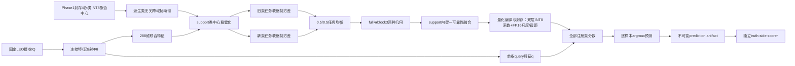
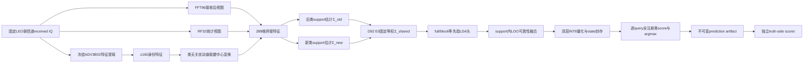

# D92 E0方法原理、机制、输入输出、资源需求与论文复现方法对比报告

日期：2026-07-27

修订：v9，统一使用D92 E0方法名并按实际执行路径重整全文

证据状态：`EVIDENCE_BOUND_TECHNICAL_REPORT`

D92 E0实验状态：`SCREENING_COMPLETE_NOT_FRESH_CONFIRMED_NOT_PROMOTABLE`

## 摘要

D92 E0是一种面向CVS Stage2-C的support-only少样本类增量判别方法。它以冻结Phase1 deployment bundle、固定LEO接收IQ和旧/新类标注support为输入，依次完成288维联合特征提取、类无关扰动谱建模、support类中心稳健化、旧/新任务自动收缩协方差估计、full/block双几何可靠性融合，以及量化仿射头编译与封存。它不重新训练Phase1主干，但完整覆盖Phase2从合法输入到全注册类预测artifact的状态构造与逐query推理闭环。

D92 E0对旧类任务和新类任务分别估计协方差，并固定合成为

$$
\boldsymbol{\Sigma}_{\mathrm{bal}}
=
\frac{1}{2}\boldsymbol{\Sigma}_{\mathrm{o}}
+
\frac{1}{2}\boldsymbol{\Sigma}_{\mathrm{n}}.
$$

**本式符号说明：**\(\boldsymbol{\Sigma}_{\mathrm{bal}}\)是旧/新任务均衡共享协方差；\(\boldsymbol{\Sigma}_{\mathrm{o}}\)和\(\boldsymbol{\Sigma}_{\mathrm{n}}\)分别是旧类任务与新类任务内部估计的协方差；下标\(\mathrm{bal}\)、\(\mathrm{o}\)、\(\mathrm{n}\)分别表示balanced、old和new；系数\(1/2\)表示两个任务固定等权。

全部旧类与新类仍由同一个等先验LDA仿射头竞争。D92 E0不读取query真值、query的old/new角色、query批次类别数、类别配额或跨query关系，也不根据receiver、LEO场景、seed、新类数或具体TX标识切换公式。

D92 E0同时处理三类困难：跨接收机和LEO弱信道造成的support中心扰动、高维小样本协方差不适定，以及新类数量增加造成的旧/新任务统计失衡。当前screen覆盖75个identity和225个场景单位，注册后旧类准确率、已注册新类准确率、调和均值和最低旧类准确率的均值分别为58.79%、53.43%、55.27%和27.33%。这些结果是screening证据，不是fresh confirmation，也没有达到方法晋级或星上部署声明门槛。

与论文复现方法相比，D92 E0同时承担旧类域适应和新类注册；MRIOR-SDA、DADDA-SDA、ProtoNet CDA只承担Stage2-B闭集旧类域适应，不能直接与D92 E0注册后的`H_old_new`比较。CSIL、MoPC-HR和Orthogonal Incremental SEI承担类增量任务，但其原论文允许base/source训练、历史统计或原生增量流程，数据权限和模型生命周期不同。项目中已有同LEO条件的复现结果可以描述性比较，但只有数据哈希、seed、support/query和候选空间完全匹配时才能称为严格paired comparison。

资源上，D92 E0属于“低频注册较重、长期推理很轻”的方法。K10状态构造包含44次闭式分量拟合；最终26类头采用双层残差INT8系数、FP16块尺度与截距以及FP32对角metric，核心数组约16.11KiB，分类部分为7,488MAC/query。现有证据尚未给出目标星载处理器上的独立WCET、峰值RAM、能耗、热和容错测量，因此这些分析只能用于算法级资源评估。

## 1.方法定义与阅读约定

本报告统一使用方法名D92 E0。其定义如下：

> D92 E0是一种面向跨接收机少样本类增量RFFI的support-only稳健判别方法。它从固定LEO接收IQ提取身份、频谱和射频统计特征，从Phase1封存的域×类INT8聚合中心派生类无关扰动谱并据此稳健化每个注册类的support中心，分别估计旧类任务与新类任务的收缩协方差，以固定等权方式形成共享判别几何，再通过support内交叉拟合选择full/block几何，最后把融合结果量化编译成一个面对全部注册类的等先验仿射分类器。

D92 E0依赖冻结的Phase1编码器，Phase2只构造增量判别状态。方法闭环包括：

1.明确合法输入；
2.从IQ到特征的确定性映射；
3.仅由support构造预测状态；
4.对任意单条query输出全部注册类分数与唯一预测；
5.预测封存后再由独立scorer计算指标。

后文只解释D92 E0实际执行的计算，不展开其他内部方法或未进入该执行链的模块。

## 2.问题定义

### 2.1 接收观测模型

对发射机类别\(y\)、接收机/信道域\(d\)和待发送基带信号\(s\)，接收IQ写为

$$
\mathbf{x}
=
\mathcal{R}_{d}
\left(
\mathcal{H}_{d} * \mathcal{T}_{y}(\mathbf{s})
\right)
+\mathbf{n},
$$

**本式符号说明：**

- \(\mathcal{T}_{y}\)表示发射机\(y\)的硬件非理想响应，是身份信息的主要来源；
- \(\mathcal{H}_{d}\)表示传播与星地弱信道；
- \(\mathcal{R}_{d}\)表示目标接收机前端和链路响应；
- \(\mathbf{n}\)表示加性噪声；
- \(\mathbf{x}\)是Phase2实际可读取的固定接收IQ。

D92 E0不尝试从\(\mathbf{x}\)恢复clean IQ，也不估计真实信道\(\mathcal{H}_{d}\)。它直接在固定接收观测上构造对接收机扰动更稳健的少样本判别几何。

### 2.2 类别集合

旧类与新类集合分别记为

$$
\mathcal{Y}_{\mathrm{o}}
=
\{1,\ldots,C_{\mathrm{o}}\},
\qquad
\mathcal{Y}_{\mathrm{n}}
=
\{C_{\mathrm{o}}+1,\ldots,C_{\mathrm{o}}+C_{\mathrm{n}}\}.
$$

**式中各符号的含义：**

- \(\mathcal Y_{\mathrm o}\)：旧类标签集合；花体\(\mathcal Y\)表示集合，下标\(\mathrm o\)表示old。
- \(\mathcal Y_{\mathrm n}\)：新类标签集合；下标\(\mathrm n\)表示new。
- \(C_{\mathrm o}\)和\(C_{\mathrm n}\)：旧类数量和新类数量。
- \(\{1,\ldots,C_{\mathrm o}\}\)：从1到\(C_{\mathrm o}\)的全部整数标签。
- \(\{C_{\mathrm o}+1,\ldots,C_{\mathrm o}+C_{\mathrm n}\}\)：紧接旧类编号之后的新类整数标签。
- \(c\)：后文用于表示任意一个类别标签的索引。

全部已注册类别为

$$
\mathcal{Y}
=
\mathcal{Y}_{\mathrm{o}}\cup\mathcal{Y}_{\mathrm{n}},
\qquad
C=C_{\mathrm{o}}+C_{\mathrm{n}}.
$$

**式中各符号和运算的含义：**

- \(\mathcal Y\)：完成当前阶段注册后，分类器需要同时竞争的全部类别集合。
- \(\cup\)：集合并运算，把旧类集合与新类集合合并；两个集合按协议互不重叠。
- \(C\)：全部已注册类别数量。
- \(C=C_{\mathrm o}+C_{\mathrm n}\)：总类别数等于旧类数与新类数之和。

当前正式矩阵固定

$$
C_{\mathrm{o}}=6,
\qquad
C_{\mathrm{n}}\in\{5,10,20\},
\qquad
C\in\{11,16,26\}.
$$

**式中各符号的含义：**

- \(C_{\mathrm o}=6\)：正式矩阵始终包含6个旧类。
- \(C_{\mathrm n}\in\{5,10,20\}\)：每个实验slice分别注册5、10或20个新类；符号\(\in\)表示“属于该候选集合”。
- \(C\in\{11,16,26\}\)：对应总类别数分别为\(6+5\)、\(6+10\)和\(6+20\)。

“旧”和“新”只描述类别是否在Phase1出现过。D92 E0不会在query推理时读取query的真实old/new角色。

### 2.3 Support与query

每类有\(K\)个物理上独立的标注support样本：

$$
\mathcal{S}_{c}
=
\left\{
(\mathbf{x}_{c,k},c)
\right\}_{k=1}^{K},
\qquad
c\in\mathcal{Y}.
$$

**式中各符号的含义：**

- \(\mathcal S_c\)：类别\(c\)的support集合。
- \(\mathbf x_{c,k}\)：类别\(c\)的第\(k\)个固定接收IQ样本。
- \(c\)：该support样本的可见类别标签，同时也是类别索引。
- \(k\)：类内shot索引，从1到\(K\)。
- \(K\)：每个类别可用的独立物理support样本数。
- \(\{(\mathbf x_{c,k},c)\}_{k=1}^{K}\)：把该类别的K个“样本—标签”有序记录收集成集合。
- \(c\in\mathcal Y\)：每个已注册类别都按相同规则构造support集合。

完整support集合为

$$
\mathcal{S}
=
\bigcup_{c\in\mathcal{Y}}\mathcal{S}_{c},
\qquad
N_{\mathrm{s}}=CK.
$$

**式中各符号和运算的含义：**

- \(\mathcal S\)：全部已注册类别support的总集合。
- \(\bigcup_{c\in\mathcal Y}\)：遍历所有类别\(c\)，对各\(\mathcal S_c\)执行集合并。
- \(N_{\mathrm s}\)：总support样本数。
- \(C\)：注册类别总数；\(K\)：每类shot数。
- \(N_{\mathrm s}=CK\)：在每类都恰有\(K\)个support时，总样本数为类别数乘每类样本数。

query集合写为

$$
\mathcal{Q}
=
\{\mathbf{x}^{(q)}_j\}_{j=1}^{N_{\mathrm{q}}}.
$$

**式中各符号的含义：**

- \(\mathcal Q\)：只用于最终测试的query集合。
- \(\mathbf x_j^{(q)}\)：第\(j\)个query的固定接收IQ；上标\((q)\)表示query，不是指数。
- \(j\)：query样本索引。
- \(N_{\mathrm q}\)：query样本总数。
- 本式没有写出query标签，因为预测器不能读取query真值；标签只由独立scorer在预测artifact形成后连接。

构造D92 E0状态时只能访问\(\mathcal{S}\)及其标签。query真值、query类别配额、真实old/new角色和query批次类别构成均不可见。

### 2.4 D92 E0学习的映射

D92 E0要从合法输入构造参数状态

$$
\Theta_{\mathrm{D92 E0}}
=
\mathcal{A}
\left(
\mathcal{B}_{\mathrm{P1}},
\mathcal{S},
\Gamma
\right),
$$

**式中各符号的含义：**

- \(\Theta_{\mathrm{D92 E0}}\)：注册完成后可供query推理使用的D92 E0状态，包括最终仿射系数、截距、量化尺度和必要元数据。
- \(\mathcal A(\cdot)\)：D92 E0的support-only状态构造算法。
- \(\mathcal B_{\mathrm{P1}}\)：在任何target访问前封存的不可变Phase1部署bundle。
- \(\mathcal S\)：当前row合法可见的带标签support集合。
- \(\Gamma\)：不依赖当前support/query内容的锁定算法配置。
- 等号表示\(\Theta_{\mathrm{D92 E0}}\)完全由这三类合法输入构造，不包含query真值或clean/source运行时输入。

对每个query，D92 E0执行

$$
\widehat{y}_j
=
\arg\max_{c\in\mathcal{Y}}
s_c\!\left(\mathbf{x}^{(q)}_j;\Theta_{\mathrm{D92 E0}}\right).
$$

**式中各符号和运算的含义：**

- \(\widehat y_j\)：模型对第\(j\)个query输出的预测类别；帽号表示估计值而非真值。
- \(\arg\max\)：返回使后续分数最大的类别索引。
- \(c\in\mathcal Y\)：候选范围是全部已注册类别，而不是预先知道的old或new子集。
- \(s_c(\cdot)\)：类别\(c\)的判别分数函数，分数越大表示模型越倾向类别\(c\)。
- \(\mathbf x_j^{(q)}\)：第\(j\)个query接收IQ。
- 分号后的\(\Theta_{\mathrm{D92 E0}}\)：计算分数时使用的已注册D92 E0状态。
- \(j\)：query索引；\(c\)：候选类别索引。

这是逐样本、全注册类、单次\(\arg\max\)决策，不存在先判断old/new角色再进入不同分类器的过程。

## 3.符号、维度与含义

本报告采用“全局符号表+逐式就地说明”两层结构。下表便于统一检索；后文每个独立公式块下方仍重复给出该式涉及的变量、上下标、维度、算子和固定常数。核心特征映射使用逐项清单；连续推导和数值例子使用模块内完整符号说明，因此读者不需要返回本节才能读懂公式。

### 3.1 集合和计数符号

|符号|类型或取值|含义|
|---|---:|---|
|\(\mathcal{Y}_{\mathrm{o}}\)|类别集合|Phase1已见、Phase2需要适应的旧类|
|\(\mathcal{Y}_{\mathrm{n}}\)|类别集合|Phase1未见、Phase2需要注册的新类|
|\(\mathcal{Y}\)|类别集合|全部已注册类|
|\(C_{\mathrm{o}}\)|正整数|旧类数量，当前为6|
|\(C_{\mathrm{n}}\)|正整数|新类数量，当前为5、10或20|
|\(C\)|正整数|注册类总数，\(C=C_{\mathrm{o}}+C_{\mathrm{n}}\)|
|\(K\)|正整数|每类独立物理support样本数|
|\(N_{\mathrm{s}}\)|正整数|support总数，\(N_{\mathrm{s}}=CK\)|
|\(N_{\mathrm{q}}\)|正整数|query总数|
|\(\mathcal{S}_c\)|样本集合|类别\(c\)的K-shot support|
|\(\mathcal{S}\)|样本集合|所有注册类的support|
|\(\mathcal{Q}\)|样本集合|只用于测试的query|

### 3.2 观测和特征符号

|符号|维度|含义|
|---|---:|---|
|\(\mathbf{x}\)|\(2\times L\)或等价复数长度\(L\)|固定接收IQ|
|\(\Phi_{\theta}\)|映射|冻结的Phase1特征提取器及确定性接收后特征计算|
|\(E_{\theta}\)|映射|冻结编码器的160维身份特征映射|
|\(\mathcal{N}_{\varepsilon}\)|映射|带\(\varepsilon\)下界保护的行二范数归一化|
|\(\varepsilon\)|\(10^{-8}\)|FFT/RF描述和行归一化的数值保护常数|
|\(\mathbf{z}\)|\(p=288\)|D92 E0联合特征|
|\(\mathbf{f}^{\mathrm{id}}\)|160|归一化前的编码器身份特征|
|\(\mathbf{f}^{\mathrm{fft}}\)|96|均值删除并归一化后的FFT描述|
|\(\mathbf{f}^{\mathrm{rf}}\)|32|归一化后的RF统计描述|
|\(\mathbf{f}^{\mathrm{aux}}\)|128|FFT96与RF32拼接后共同归一化的辅助特征|
|\(\mathbf{z}^{\mathrm{id}}\)|160|冻结编码器产生的身份表征|
|\(\mathbf{z}^{\mathrm{fft}}\)|96|由同一接收IQ计算的FFT特征|
|\(\mathbf{z}^{\mathrm{rf}}\)|32|由同一接收IQ计算的射频统计特征|
|\(\widetilde{\mathbf{z}}\)|288|经过类中心稳健化后的support特征|
|\(\mathbf{q}\)|288|query联合特征|
|\(p\)|288|总特征维数|
|\(p_{\mathrm{id}},p_{\mathrm{fft}},p_{\mathrm{rf}}\)|160、96、32|三个特征块的维数|

### 3.3 扰动谱和稳健中心符号

|符号|维度|含义|
|---|---:|---|
|\(\mathbf{G}\)|\(160\times160\)|D92 E0从Phase1域×类INT8聚合中心派生的类无关地面扰动协方差|
|\(\sigma_{\mathrm{q}}^2\)|标量|由有效FP16量化尺度派生的INT8量化噪声底|
|\(\mathbf{G}_{+}\)|\(160\times160\)|去除量化噪声底后的对称扰动矩阵|
|\(\lambda_j\)|标量|扰动矩阵第\(j\)个正特征值|
|\(\mathbf{u}_j\)|160|对应的单位特征向量|
|\(\mathbf{U}\)|\(160\times r\)|保留的扰动基|
|\(\rho_j\)|标量|第\(j\)个扰动方向的归一化谱权重|
|\(r_{\mathrm{eff}}\)|标量|participation-ratio有效秩|
|\(r\)|正整数|实际保留秩，\(r=\lceil r_{\mathrm{eff}}\rceil\)|
|\(\bar{\mathbf{z}}^{\mathrm{id}}_c\)|160|类别\(c\)的普通support均值|
|\(\mathbf{e}_{c,k}\)|160|support样本相对类均值的残差|
|\(E_{c,k}\)|标量|样本在地面扰动谱上的加权能量|
|\(\tau_c\)|标量|类别\(c\)的平均扰动能量尺度|
|\(a_{c,k}\)|标量|未归一化Cauchy权重|
|\(\omega_{c,k}\)|标量|归一化Cauchy权重|
|\(\mathbf{m}^{\mathrm{rob}}_c\)|160|类别\(c\)的稳健身份中心|
|\(\boldsymbol{\delta}_c\)|160|普通中心到稳健中心的平移量|

### 3.4 协方差与分类头符号

|符号|维度|含义|
|---|---:|---|
|\(\boldsymbol{\mu}_c\)|288|稳健化后类别\(c\)的联合特征均值|
|\(\mathbf{D}_c\)|\(288\times288\)|类别\(c\)逐维support标准差组成的对角矩阵|
|\(\mathbf{u}_{c,k}\)|288|类别\(c\)第\(k\)个support的标准化残差|
|\(\mathbf{S}_c\)|\(288\times288\)|类别\(c\)的经验协方差|
|\(\mathbf{S}^{(u)}_c\)|\(288\times288\)|标准化坐标中的经验协方差|
|\(\alpha_c\)|\([0,1]\)|类别\(c\)由Ledoit–Wolf自动估计的收缩强度|
|\(\zeta_c\)|标量|标准化经验协方差的平均特征方差|
|\(\widehat{\boldsymbol{\Sigma}}_c^{\mathrm{LW}}\)|\(288\times288\)|类别\(c\)的自动收缩协方差|
|\(\boldsymbol{\Sigma}_{\mathrm{o}}\)|\(288\times288\)|旧类任务内等先验协方差|
|\(\boldsymbol{\Sigma}_{\mathrm{n}}\)|\(288\times288\)|新类任务内等先验协方差|
|\(\boldsymbol{\Sigma}_{\mathrm{bal}}\)|\(288\times288\)|旧/新任务固定等权共享协方差|
|\(\boldsymbol{\Sigma}_{\mathrm{full}}\)|\(288\times288\)|保留全部块内和块间关系的协方差|
|\(\boldsymbol{\Sigma}_{\mathrm{blk}}\)|\(288\times288\)|只保留160/96/32三个对角块的协方差|
|\(\pi_c\)|标量|类别先验，固定为\(1/C\)|
|\(\mathbf{w}_c\)|288|类别\(c\)的仿射系数|
|\(b_c\)|标量|类别\(c\)的仿射截距|
|\(\mathbf{W}\)|\(C\times288\)|全部类别系数组成的矩阵|
|\(\mathbf{b}\)|\(C\)|全部类别截距向量|
|\(s_c(\mathbf{q})\)|标量|query属于类别\(c\)的判别分数|

### 3.5 融合、量化和封存符号

|符号|维度|含义|
|---|---:|---|
|\(r_h\)|标量|几何分支\(h\)的support类中心化logit RMS|
|\(\ell_{c,h}^{\mathrm{LOO}}\)|标量|分支\(h\)在类别\(c\)上的support内留一交叉熵|
|\(\eta_{c,h}\)|标量|类别\(c\)对分支\(h\)的可靠性权重|
|\(\mathbf w_c^{(0)},b_c^{(0)}\)|288维向量、标量|full/block可靠性融合后的类别\(c\)基础仿射行|
|\(q_{c,j}\)|INT8标量|类别\(c\)在第\(j\)维的量化权重整数|
|\(s_{c,g}\)|FP16标量|类别\(c\)、量化组\(g\)的解码尺度|
|\(\Delta\mathbf q_c\)|INT8向量|类别\(c\)相对共享基线的第二层量化残差|
|\(\widehat{\mathbf W},\widehat{\mathbf b}\)|\(C\times288,C\)|由正式量化state解码得到的部署仿射系数和截距|
|\(\mathcal S_{\mathrm{E0}}\)|结构化状态|类别顺序、量化头、metric、配置身份和审计字段组成的不可变E0预测状态|

### 3.6 通用数学记号

|记号|意义|
|---|---|
|\(\mathbb{R}^{m\times n}\)|\(m\)行\(n\)列实矩阵空间|
|\(\mathbf{I}_p\)|\(p\times p\)单位矩阵|
|\(\mathbf{0}\)|与上下文维度一致的全零向量或矩阵|
|\(\mathbf{1}\)|与上下文维度一致的全一向量|
|\((\cdot)^{\mathsf T}\)|转置|
|\((\cdot)^{-1}\)|矩阵逆；实现中优先用线性方程求解代替显式求逆|
|\(\operatorname{tr}(\cdot)\)|矩阵迹，即对角元素之和|
|\(\operatorname{diag}(\cdot)\)|由向量构造对角矩阵，或按给定矩阵块构造块对角矩阵|
|\(\lVert\cdot\rVert_2\)|向量二范数|
|\(\arg\max\)、\(\arg\min\)|使目标函数达到最大值或最小值的类别索引|
|\(\mathbb{1}[\cdot]\)|指示函数；条件成立为1，否则为0|
|\(\mathcal{N}(\boldsymbol{\mu},\boldsymbol{\Sigma})\)|均值为\(\boldsymbol{\mu}\)、协方差为\(\boldsymbol{\Sigma}\)的高斯分布|
|\(\lceil a\rceil\)|不小于\(a\)的最小整数|
|\(\lambda_{\min}(\mathbf{A})\)|矩阵\(\mathbf{A}\)的最小特征值|
|\(\operatorname{softmax}\)|把有限实数向量归一化为和为1的正权重|

## 4.D92 E0完整处理流程



这条流水线有两个时间阶段：

- 状态构造阶段：读取Phase1 bundle和当前row的support，生成\((\mathbf{W},\mathbf{b})\)；
- 推理阶段：每条query只做一次特征提取和一次全注册类仿射打分，不更新任何状态。

### 4.1贯穿六个模块的例子

为了让没有CVS、RFFI或LDA背景的读者看清每一步，下面用一个贯穿示例解释维度和数据流。示例采用：

$$
C_{\mathrm{o}}=6,
\qquad
C_{\mathrm{n}}=5,
\qquad
C=11,
\qquad
K=10.
$$

**本式符号说明：**\(C_{\mathrm o}\)、\(C_{\mathrm n}\)、\(C\)分别是旧类数、新类数和总类数；\(K\)是每类support数，\(N_{\mathrm s}=CK\)是support总数；\(\mathbf x\in\mathbb C^L\)是长度为\(L\)的复IQ向量，\(x_t=I_t+\mathrm jQ_t\)把第\(t\)个采样写成I/Q形式；\(\mathbf Z\in\mathbb R^{N_{\mathrm s}\times288}\)是全部support的288维特征矩阵。

这表示系统已经认识6个旧发射机，现在要注册5个新发射机；每个类别有10条带标签support IQ。support总数为

$$
N_{\mathrm{s}}
=
CK
=
11\times10
=
110.
$$

**本式符号说明：**\(C_{\mathrm o}\)、\(C_{\mathrm n}\)、\(C\)分别是旧类数、新类数和总类数；\(K\)是每类support数，\(N_{\mathrm s}=CK\)是support总数；\(\mathbf x\in\mathbb C^L\)是长度为\(L\)的复IQ向量，\(x_t=I_t+\mathrm jQ_t\)把第\(t\)个采样写成I/Q形式；\(\mathbf Z\in\mathbb R^{N_{\mathrm s}\times288}\)是全部support的288维特征矩阵。

一条IQ不是一张图片，而是一串复数基带采样：

$$
\mathbf{x}
=
\left[
x_0,x_1,\ldots,x_{L-1}
\right]^{\mathsf T}
\in
\mathbb{C}^{L},
$$

其中

$$
x_t=I_t+\mathrm{j}Q_t.
$$

**本式符号说明：**\(C_{\mathrm o}\)、\(C_{\mathrm n}\)、\(C\)分别是旧类数、新类数和总类数；\(K\)是每类support数，\(N_{\mathrm s}=CK\)是support总数；\(\mathbf x\in\mathbb C^L\)是长度为\(L\)的复IQ向量，\(x_t=I_t+\mathrm jQ_t\)把第\(t\)个采样写成I/Q形式；\(\mathbf Z\in\mathbb R^{N_{\mathrm s}\times288}\)是全部support的288维特征矩阵。

\(I_t\)和\(Q_t\)分别是同相、正交分量。模块一把每条IQ变成288维向量，所以110条support形成

$$
\mathbf{Z}
\in
\mathbb{R}^{110\times288}.
$$

**本式符号说明：**\(C_{\mathrm o}\)、\(C_{\mathrm n}\)、\(C\)分别是旧类数、新类数和总类数；\(K\)是每类support数，\(N_{\mathrm s}=CK\)是support总数；\(\mathbf x\in\mathbb C^L\)是长度为\(L\)的复IQ向量，\(x_t=I_t+\mathrm jQ_t\)把第\(t\)个采样写成I/Q形式；\(\mathbf Z\in\mathbb R^{N_{\mathrm s}\times288}\)是全部support的288维特征矩阵。

后续模块不再直接操作原始IQ，而是在\(\mathbf{Z}\)及其标签上完成中心估计、协方差估计、判别头构造和support内部可靠性融合。

|模块|读入什么|主要计算|产生什么|
|---|---|---|---|
|模块一|固定received IQ、冻结编码器|神经网络前向、FFT、统计量、归一化|每个样本的288维特征|
|模块二|身份特征、类标签、封存扰动谱|均值、残差投影、Cauchy加权|稳健化support特征|
|模块三|稳健化特征、old/new注册表|收缩协方差、任务等权、full/block结构|两种共享协方差|
|模块四|类均值、共享协方差|线性方程求解、等先验LDA|full和block仿射头|
|模块五|两个头、support标签|K折留一、交叉熵、可靠性加权|基础融合头|
|模块六|基础融合头、类别顺序、量化配置|删除公共项、双层INT8量化、FP16尺度/截距编译、审计封存|最终单一量化仿射状态|

这六个活动模块只在support状态构造阶段运行。query到来后不会重新计算support协方差或LOO权重，而是直接使用封存的量化仿射状态完成逐样本分类。

### 4.2 Phase1 deployment bundle详细构成

#### 4.2.1 bundle是什么

Phase1 deployment bundle是地面训练结束后、任何target数据到达前冻结的部署知识集合。它不是训练数据压缩包，也不是旧类样本库。对D92 E0而言，这个逻辑bundle由三部分组成：

|组成部分|当前实际内容|作用|Phase2是否可更新|
|---|---|---|---|
|冻结身份特征运行时|与Phase1 checkpoint绑定的TorchScript特征编码器及特征schema|把固定received IQ映射为160维身份特征|否|
|INT8域×类聚合中心组件|每个有效地面域、每个Phase1旧类的一条160维INT8聚合中心及FP16尺度|派生类无关跨域扰动谱，辅助判断target support可靠性|否|
|完整性与权限元数据|checkpoint、源聚合artifact、类别表、域表、组件文件的SHA256及schema、allowlist、provenance和eligibility字段|防止组件错配、替换或夹带禁止成员|否|

“逻辑bundle”不要求所有内容物理上位于同一个文件。当前代码路径从已封存的enrollment package加载冻结特征运行时，并通过独立的组件目录和manifest哈希加载INT8域×类中心。二者必须由checkpoint哈希、特征schema、类别注册表和完整性记录绑定，方法语义上共同构成一个不可变Phase1 deployment bundle。

#### 4.2.2 冻结身份特征运行时

冻结运行时实现映射

$$
\mathbf f^{\mathrm{id}}
=
E_{\theta}(\mathbf x)
\in\mathbb R^{160}.
$$

**本式符号说明：**\(\mathbf x\)是单条固定received IQ；\(E_\theta\)是参数\(\theta\)已冻结的Phase1身份编码器；\(\mathbf f^{\mathrm{id}}\)是160维身份特征。Phase2只执行前向推理，不更新\(\theta\)。

运行时至少通过以下身份字段与实验row绑定：

|字段|含义|
|---|---|
|`phase1_checkpoint_sha256`|Phase1 checkpoint内容身份|
|`feature_runtime_sha256`|实际部署特征运行时内容身份|
|`feature_schema`|当前为`ADV3B02:z_id:unit_l2:160:v1`，规定特征名称、归一化和维度|
|`method_lock_sha256`|D92 E0方法锁及固定配置身份|

冻结运行时承担“从IQ提取身份表征”的作用。它不携带target support统计量，不保存target新类知识，也不会因Stage2-B适应或Stage2-C注册而改变。

#### 4.2.3 INT8域×类聚合中心组件

当前组件schema为

```text
phase1_int8_domain_class_centroids_v1
```

设Phase1共有\(D_{\mathrm g}\)个地面接收机域和\(C_{\mathrm o}\)个旧类别。组件的主要数组为：

|数组|数据类型与形状|每个元素表示什么|
|---|---:|---|
|`domain_class_q`|INT8，\(D_{\mathrm g}\times C_{\mathrm o}\times160\)|每个有效域×类聚合中心的160维量化码|
|`domain_class_scale`|FP16，\(D_{\mathrm g}\times C_{\mathrm o}\)|每个域×类中心独立使用的对称量化尺度|
|`domain_class_mask`|UINT8，\(D_{\mathrm g}\times C_{\mathrm o}\)|该域×类中心是否有效；有效为1，无效为0|
|`domain_registry`|INT16，\(D_{\mathrm g}\)|地面域注册顺序|
|`class_registry`|字符串，\(C_{\mathrm o}\)|Phase1旧类handle及其固定顺序|
|`feature_schema`|字符串标量|中心所属的特征空间和维度|

因此，对一个具体旧类别\(c\)，bundle不是只保存一条“全地面平均原型”，而是最多保存\(D_{\mathrm g}\)条域条件中心：

$$
\left\{
\mathbf q_{d,c},\,s_{d,c},\,m_{d,c}
\right\}_{d=1}^{D_{\mathrm g}}.
$$

**本式符号说明：**\(c\)是旧类别索引；\(d\)是地面域索引；\(\mathbf q_{d,c}\in\{-127,\ldots,127\}^{160}\)是INT8中心码；\(s_{d,c}>0\)是FP16尺度；\(m_{d,c}\in\{0,1\}\)是有效掩码；\(D_{\mathrm g}\)是地面域总数。

每个有效域×类中心在Phase1由至少2个互不重复的地面物理样本聚合。若构建中心时该单元包含\(n_{d,c}\)条身份特征，则未量化中心可写为

$$
\mathbf p_{d,c}
=
\frac{1}{n_{d,c}}
\sum_{i=1}^{n_{d,c}}
\mathbf z^{\mathrm{id}}_{d,c,i},
\qquad
n_{d,c}\geq2.
$$

**本式符号说明：**\(\mathbf p_{d,c}\in\mathbb R^{160}\)是地面域\(d\)、旧类别\(c\)的聚合中心；\(\mathbf z^{\mathrm{id}}_{d,c,i}\)是参与聚合的第\(i\)条Phase1身份特征；\(n_{d,c}\)是构建时的成员数。成员数只用于构建门禁，不写入当前INT8组件。

这意味着Phase2不能知道哪些样本参与了中心，也不能从bundle恢复样本集合。

#### 4.2.4 中心如何量化

每个域×类中心独立计算对称量化尺度：

$$
s_{d,c}
=
\frac{
\max_{1\leq j\leq160}
\left|p_{d,c,j}\right|
}{127}.
$$

**本式符号说明：**\(p_{d,c,j}\)是\(\mathbf p_{d,c}\)的第\(j\)个坐标；\(j\)是特征维索引；\(s_{d,c}\)是该160维中心共享的量化尺度；127是有符号INT8对称量化采用的最大正整数码。

量化码为

$$
q_{d,c,j}
=
\operatorname{clip}
\left(
\operatorname{round}
\left(
\frac{p_{d,c,j}}{s_{d,c}}
\right),
-127,\,
127
\right).
$$

**本式符号说明：**\(q_{d,c,j}\)是第\(j\)个INT8码；\(\operatorname{round}\)表示舍入到最近整数；\(\operatorname{clip}(v,-127,127)\)把数值限制在对称INT8有效范围内；当前格式禁止使用\(-128\)。

Phase2使用时只做反量化：

$$
\widehat{\mathbf p}_{d,c}
=
s_{d,c}\mathbf q_{d,c}.
$$

**本式符号说明：**\(\widehat{\mathbf p}_{d,c}\in\mathbb R^{160}\)是反量化后的近似域×类中心；\(\mathbf q_{d,c}\)是INT8码向量；\(s_{d,c}\)是对应FP16尺度。帽号表示它是量化恢复值，不等于原始FP32中心的逐bit副本。

若某个有效中心恰好是全零向量，构建器使用\(s_{d,c}=1\)作为防止除零的回退尺度，并令\(\mathbf q_{d,c}=\mathbf0\)。这一回退不会把零中心改成非零中心。

只计算三个主数组的稠密存储量时，每个域×类单元需要160字节INT8码、2字节FP16尺度和1字节UINT8掩码，因此

$$
B_{\mathrm{main}}
=
D_{\mathrm g}C_{\mathrm o}
\left(
160+2+1
\right)
=
163D_{\mathrm g}C_{\mathrm o}
\ \text{bytes}.
$$

**本式符号说明：**\(B_{\mathrm{main}}\)是三个主数组未考虑容器压缩时的字节数；\(D_{\mathrm g}\)是地面域数；\(C_{\mathrm o}\)是Phase1旧类数；160来自每个中心的160个INT8坐标；2是一个FP16尺度的字节数；1是一个UINT8掩码的字节数。该式不包含类别字符串、域注册表、feature schema、manifest和NPZ容器开销。由于主数组采用稠密布局，无效单元也占数组位置，掩码只说明该位置能否使用。

#### 4.2.5 每个类别实际包含什么

当前D92 E0的每个Phase1旧类包含以下知识：

1. 一个稳定的`class_handle`，用于绑定类别顺序；
2. 在每个有效地面域上的一条160维INT8聚合中心；
3. 每条域条件中心对应的一个FP16尺度；
4. 每个域条件中心是否存在的一个掩码位。

以下内容不按类别保存：

- 原始IQ或clean IQ；
- 单样本160维feature；
-训练样本ID、文件路径或成员清单；
- 当前中心的精确成员数；
- 样本级logit、source replay或source cache；
- 全精度中心sidecar；
- target support、target query或Phase2新类信息；
- 可直接用于query分类的地面旧类分数。

Stage2-C中的新类在Phase1从未出现，因此bundle中没有新类中心。新类知识只能由当前target receiver上的合法K-shot support注册。

#### 4.2.6 D92 E0如何使用这些中心

D92 E0不把反量化地面中心直接作为旧类分类原型。它先对同一个旧类别在不同地面域上的中心做跨域中心化：

$$
\bar{\mathbf p}_c
=
\frac{1}{D_c}
\sum_{d:m_{d,c}=1}
\widehat{\mathbf p}_{d,c},
$$

$$
\mathbf r_{d,c}
=
\widehat{\mathbf p}_{d,c}
-\bar{\mathbf p}_c.
$$

**本式符号说明：**\(D_c=\sum_d m_{d,c}\)是旧类别\(c\)拥有的有效地面域数；\(\bar{\mathbf p}_c\)是该类别跨地面域的平均中心；\(\mathbf r_{d,c}\)是域\(d\)中心相对该类别平均中心的偏移。第一式计算同类跨域平均，第二式删除类别中心。

随后把所有旧类别的同类跨域偏移汇总为

$$
\mathbf G_{\mathrm{raw}}
=
\frac{1}{
C_{\mathrm o}(D_{\mathrm g}-1)
}
\sum_{c=1}^{C_{\mathrm o}}
\sum_{d=1}^{D_{\mathrm g}}
\mathbf r_{d,c}\mathbf r_{d,c}^{\mathsf T}.
$$

**本式符号说明：**\(\mathbf G_{\mathrm{raw}}\in\mathbb R^{160\times160}\)是类无关跨域中心漂移协方差；\(C_{\mathrm o}\)是旧类数；\(D_{\mathrm g}\)是参与统计的完整地面域数；\(\mathbf r_{d,c}\mathbf r_{d,c}^{\mathsf T}\)是160维偏移向量的外积。当前实现要求参与计算的域提供完整类别网格，并至少有2个完整地面域。

量化噪声底近似为

$$
\sigma_{\mathrm q}^{2}
=
\frac{1}{12}
\operatorname{mean}_{d,c}
\left(
s_{d,c}^{2}
\right),
$$

并构造

$$
\mathbf G
=
\mathbf G_{\mathrm{raw}}
+
\sigma_{\mathrm q}^{2}\mathbf I_{160}.
$$

**本式符号说明：**\(\sigma_{\mathrm q}^{2}\)是由有效域×类量化尺度估计的平均均匀量化噪声方差；\(1/12\)来自均匀量化误差模型；\(\mathbf I_{160}\)是160维单位矩阵；\(\mathbf G\)是加入各向同性量化噪声底后的对称正定协方差输入。

因此，\(\mathbf G\)不是bundle中的独立数组。bundle实际封存的是\(\mathbf q_{d,c}\)、\(s_{d,c}\)、\(m_{d,c}\)及注册表；D92 E0在注册状态构造开始时从这些不可变内容派生\(\mathbf G\)和\(\sigma_{\mathrm q}^{2}\)。模块二随后移除量化噪声底并提取正谱扰动方向。

跨域中心化完成后，具体类别中心不进入D92 E0最终query打分。D92 E0只保留类无关的扰动方向和谱权重，用来判断当前target support的类内偏移是否沿着已知域扰动方向。由此，地面知识影响“support中心如何稳健估计”，不直接替代target旧类support，也不预置新类分类行。

#### 4.2.7 bundle的输入、输出与生命周期

|阶段|输入|输出|是否接触target|
|---|---|---|---|
|Phase1地面训练|source IQ、旧类标签、地面域标签|冻结checkpoint和特征运行时|否|
|Phase1离线聚合|冻结编码器产生的旧类身份特征、域标签|域×类FP32聚合中心|否|
|Phase1量化封存|FP32中心、有效掩码、类别表、域表|INT8中心、FP16尺度、manifest和哈希|否|
|Stage2加载|冻结运行时、INT8组件、合法target support|身份特征、类无关扰动谱和注册状态|是，仅合法support|
|Query推理|冻结运行时、已冻结D92 E0仿射状态、单条query IQ|全部注册类分数和预测类别|是，但query不更新bundle或状态|

bundle的生命周期原则是：

1. 在任何target访问前构建并封存；
2. 与Phase1 checkpoint和类别/域注册表绑定；
3. Stage2只读，不允许更新中心、尺度、掩码或manifest；
4. bundle变化只改变`bundle_id`，不改变已经验证的固定received IQ；
5. query及其真值永远不能用于选择、修正或重建bundle。

## 5.模块一：从固定接收IQ到288维联合特征

### 5.0本模块在做什么

模块一解决的问题是：原始IQ是一串随时间变化的复数采样，不能直接交给后面的协方差与LDA计算；系统需要把每条长度为\(L\)、物理含义复杂的IQ压缩成固定长度的实数向量。

可以把这一过程理解为“从三个角度描述同一个无线电片段”：

1.冻结编码器回答“这条波形像哪个发射机”；
2.FFT96回答“能量在频率轴上如何分布”；
3.RF32回答“幅度、相位、矩和短时相关性是什么样”。

本模块的输入输出为：

|项目|数学对象|形状|是否学习|
|---|---|---:|---|
|输入IQ|\(\mathbf{x}\)|\(L\)个复数采样|否，固定received IQ|
|身份特征|\(\mathbf{f}^{\mathrm{id}}\)|160|冻结编码器前向|
|频谱特征|\(\mathbf{f}^{\mathrm{fft}}\)|96|确定性计算|
|射频统计|\(\mathbf{f}^{\mathrm{rf}}\)|32|确定性计算|
|输出特征|\(\mathbf{z}\)|288|按固定规则拼接归一化|

逐条样本的计算顺序是：

```text
received IQ
  ├─冻结编码器前向→160维身份特征
  ├─中心化/Hann窗/FFT/插值→96维频谱特征
  └─幅度、相位、矩、自相关等统计→32维RF特征
          ↓
FFT96与RF32拼成128维辅助块并归一化
          ↓
身份块单独归一化
          ↓
辅助块乘固定权重4
          ↓
拼成288维并再次归一化
```

#### 5.0.1范数是什么

范数是把一个向量映射为非负标量的“长度函数”。D92 E0使用的是\(L_2\)范数，也称欧氏范数。对\(d\)维实向量

$$
\mathbf v=
\begin{bmatrix}
v_1&v_2&\cdots&v_d
\end{bmatrix}^{\mathsf T},
\qquad
\lVert\mathbf v\rVert_2
=
\sqrt{\sum_{i=1}^{d}v_i^2}.
$$

**本式符号说明：**

- \(\mathbf v\)：含\(d\)个实数坐标的向量。
- \(v_i\)：\(\mathbf v\)的第\(i\)个坐标。
- \(i\)：坐标索引，从1取到\(d\)。
- \(d\)：向量维数。
- \(\sum_{i=1}^{d}v_i^2\)：全部坐标平方之和。
- \(\lVert\mathbf v\rVert_2\)：向量\(\mathbf v\)的\(L_2\)范数。
- 上标\({\mathsf T}\)：转置；它把横向书写的坐标变成列向量。

例如二维向量\([3,4]^{\mathsf T}\)的长度为\(\sqrt{3^2+4^2}=5\)。这就是二维平面中的勾股定理；\(L_2\)范数把同一规则推广到160维、128维和288维空间。范数不表示维数，也不表示向量有多少个样本。160维向量可以具有范数1、10或0；维数回答“有多少个坐标”，范数回答“这些坐标合起来有多大”。

#### 5.0.2为什么先把两个块归一化

记归一化身份块和辅助块为

$$
\mathbf a
=
\mathcal N_\varepsilon
\left(
\mathbf f^{\mathrm{id}}
\right),
\qquad
\mathbf b
=
\mathbf f^{\mathrm{aux}}.
$$

**本式符号说明：**

- \(\mathbf a\in\mathbb R^{160}\)：归一化后的身份特征块。
- \(\mathbf b\in\mathbb R^{128}\)：已经归一化的辅助特征块。
- \(\mathbf f^{\mathrm{id}}\)：归一化前的160维冻结编码器特征。
- \(\mathbf f^{\mathrm{aux}}\)：FFT96和RF32拼接后共同归一化得到的128维辅助特征。
- \(\mathcal N_\varepsilon\)：带\(\varepsilon\)保护的\(L_2\)归一化。
- 如果两个输入块都不是零向量，则\(\lVert\mathbf a\rVert_2=\lVert\mathbf b\rVert_2=1\)。

先分别归一化有两个目的。第一，消除原始数值尺度：编码器特征可能天然比FFT/RF统计大很多，反之亦然；不归一化时，数值更大的块会在没有明确设计依据的情况下支配距离和内积。第二，使权重4具有明确含义：它控制的是两个单位范数块之间的相对几何权重，而不是补偿某次运行中偶然出现的特征幅值。

#### 5.0.3为什么拼接后的范数是\(\sqrt{17}\)

乘权但尚未执行最终归一化的联合向量记为

$$
\mathbf y
=
\begin{bmatrix}
\mathbf a\\
4\mathbf b
\end{bmatrix}
\in\mathbb R^{288}.
$$

**本式符号说明：**

- \(\mathbf y\)：外层归一化前的288维加权拼接向量。
- \(\mathbf a\)：160维单位范数身份块。
- \(\mathbf b\)：128维单位范数辅助块。
- \(4\mathbf b\)：辅助块的每个坐标都乘以固定权重4，因此其块范数由1变为4。
- 方括号中的上下排列表示纵向拼接，不表示\(\mathbf a+4\mathbf b\)；两者维数不同，不能直接逐坐标相加。
- \(288=160+128\)：拼接后的总维数。

按照\(L_2\)范数定义，

$$
\begin{aligned}
\lVert\mathbf y\rVert_2^2
&=
\mathbf y^{\mathsf T}\mathbf y\\
&=
\mathbf a^{\mathsf T}\mathbf a
+
(4\mathbf b)^{\mathsf T}(4\mathbf b)\\
&=
\lVert\mathbf a\rVert_2^2
+
16\lVert\mathbf b\rVert_2^2.
\end{aligned}
$$

**本式符号说明：**

- \(\lVert\mathbf y\rVert_2^2\)：联合向量范数的平方。
- \(\mathbf y^{\mathsf T}\mathbf y\)：向量与自身的内积，等于所有288个坐标的平方和。
- \(\mathbf a^{\mathsf T}\mathbf a=\lVert\mathbf a\rVert_2^2\)：身份块160个坐标的平方和。
- \((4\mathbf b)^{\mathsf T}(4\mathbf b)=16\mathbf b^{\mathsf T}\mathbf b\)：标量4在平方范数中变成\(4^2=16\)。
- 式中没有\(2\mathbf a^{\mathsf T}\mathbf b\)交叉项，因为这里执行的是坐标拼接，不是同维向量相加；\(\mathbf a\)占前160个坐标，\(\mathbf b\)占后128个坐标。

“两个块正交”在这里是**拼接坐标空间意义上的正交**：身份块嵌入为\([\mathbf a;\mathbf0]\)，辅助块嵌入为\([\mathbf0;4\mathbf b]\)，二者内积恒为0。这不意味着身份信息和FFT/RF信息在统计学上独立，也不意味着两块没有重复信息。

由于两个块在正常非零情况下都已归一化为单位范数，

$$
\sqrt{1^2+4^2}
=
\sqrt{17}.
$$

**本式符号说明：**

- 第一个1：单独归一化后的160维身份特征块范数。
- 数字4：128维辅助特征块的固定几何权重。
- \(\sqrt{1^2+4^2}\)：两个正交拼接块加权后的整体\(L_2\)范数。
- \(\sqrt{17}\)：外层归一化前完整288维拼接向量的范数。
- 这里的辅助特征块记为\(\mathbf f^{\mathrm{aux}}\)。它由FFT96和RF32拼接后共同归一化得到：

  \[
  \mathbf f^{\mathrm{aux}}
  =
  \mathcal N_\varepsilon
  \left(
  \begin{bmatrix}
  \mathbf f^{\mathrm{fft}}\\
  \mathbf f^{\mathrm{rf}}
  \end{bmatrix}
  \right)
  \in\mathbb R^{128}.
  \]

  其中，\(\mathbf f^{\mathrm{fft}}\in\mathbb R^{96}\)是FFT频谱描述，\(\mathbf f^{\mathrm{rf}}\in\mathbb R^{32}\)是RF统计描述，\(128=96+32\)，\(\mathcal N_\varepsilon\)是带数值保护的\(L_2\)归一化。

#### 5.0.4最终归一化做了什么

最终联合特征为

$$
\mathbf z
=
\frac{\mathbf y}{\lVert\mathbf y\rVert_2}
=
\begin{bmatrix}
\mathbf a/\sqrt{17}\\
4\mathbf b/\sqrt{17}
\end{bmatrix},
\qquad
\lVert\mathbf z\rVert_2=1.
$$

**本式符号说明：**

- \(\mathbf z\)：最终送入D92 E0分类几何的288维联合特征。
- \(\mathbf y\)：外层归一化前的加权拼接向量。
- \(\lVert\mathbf y\rVert_2=\sqrt{17}\)：正常非零条件下的归一化分母。
- \(\mathbf a/\sqrt{17}\)：最终联合向量中的身份块。
- \(4\mathbf b/\sqrt{17}\)：最终联合向量中的辅助块。
- \(\lVert\mathbf z\rVert_2=1\)：归一化后的完整联合向量具有单位长度。

所以最终身份块范数为

$$
\frac{1}{\sqrt{17}},
$$

**本式符号说明：**

- 分子1：身份块在进入最终拼接前已经单独归一化为单位范数。
- 分母\(\sqrt{17}\)：身份块和四倍辅助块拼接后的总范数。
- \(1/\sqrt{17}\approx0.2425\)：最终288维向量完成外层归一化后，身份块所占的块范数。

辅助块范数为

$$
\frac{4}{\sqrt{17}}.
$$

**本式符号说明：**

- 分子4：辅助块\(\mathbf f^{\mathrm{aux}}\)在最终拼接前乘以固定权重4。
- 分母\(\sqrt{17}\)：加权身份块与辅助块的拼接总范数。
- \(4/\sqrt{17}\approx0.9701\)：最终288维向量完成外层归一化后，整个辅助块所占的块范数。
- 该值描述128维辅助块整体，不表示其中每个FFT或RF坐标都等于\(4/\sqrt{17}\)。

若用平方范数表示两个块在归一化向量中的“几何能量”，身份块和辅助块的比例分别为

$$
\frac{1}{17}\approx5.88\%,
\qquad
\frac{16}{17}\approx94.12\%.
$$

**本式符号说明：**

- \(1/17\)：身份块范数平方\((1/\sqrt{17})^2\)。
- \(16/17\)：辅助块范数平方\((4/\sqrt{17})^2\)。
- 两个比例之和为1，对应完整向量\(\mathbf z\)的平方范数。
- 这些比例描述输入联合特征的块几何，不是分类准确率、概率或可直接解释为模型贡献率的因果比例。

对两条样本的归一化块\((\mathbf a,\mathbf b)\)和\((\mathbf a',\mathbf b')\)，联合特征内积为

$$
\mathbf z^{\mathsf T}\mathbf z'
=
\frac{1}{17}\mathbf a^{\mathsf T}\mathbf a'
+
\frac{16}{17}\mathbf b^{\mathsf T}\mathbf b'.
$$

**本式符号说明：**

- \(\mathbf z,\mathbf z'\)：两条不同IQ样本的最终联合特征。
- \(\mathbf a,\mathbf a'\)：两条样本各自的归一化身份块。
- \(\mathbf b,\mathbf b'\)：两条样本各自的归一化辅助块。
- \(\mathbf a^{\mathsf T}\mathbf a'\)和\(\mathbf b^{\mathsf T}\mathbf b'\)：两个块内部的余弦相似性，因为每个块的范数均为1。
- 系数\(1/17\)和\(16/17\)：固定权重4经过平方后在原始内积几何中形成的相对系数。

这说明固定权重4不是“把辅助特征简单放大四倍后就结束”，而是在最终单位球面上规定两个大块的相对几何。在未经后续协方差校正的内积或余弦几何中，辅助块相似性的系数是身份块的16倍。不过，D92 E0后续还会估计full/block协方差并构造LDA仿射头，因此94.12%不能直接解释为“最终预测的94.12%来自辅助特征”。权重不由当前query或测试准确率决定。

最后，以上\(\sqrt{17}\)推导有一个明确前提：身份块和辅助块都不是零向量，归一化后范数才各为1。如果某个输入块为零或其原始范数小于数值保护常数\(\varepsilon\)，\(\mathcal N_\varepsilon\)不会把它强行变成单位向量，此时应按该样本的实际块范数计算，不能直接使用\(\sqrt{17}\)。

#### 5.0.5一条IQ、一个特征向量和一个support矩阵

模块一每读取一条固定接收IQ，只输出一条288维特征，不会因为同时计算身份、FFT和RF描述就把K增加为3。若注册后共有\(C\)个类别、每类K条support，则模块一重复前向\(CK\)次，形成

$$
\mathbf Z
=
\begin{bmatrix}
\Phi_\theta(\mathbf x_{1,1})^{\mathsf T}\\
\vdots\\
\Phi_\theta(\mathbf x_{C,K})^{\mathsf T}
\end{bmatrix}
\in\mathbb R^{CK\times288}.
$$

**本式符号说明：**\(\mathbf x_{c,k}\)是类别\(c\)的第\(k\)条固定接收IQ；\(\Phi_\theta\)是完整特征映射；\(\mathbf Z\)是全部注册support的特征矩阵；\(CK\)是矩阵行数，每行对应一个独立物理support；288是列数，每列对应一个特征坐标。后续模块二到六处理的是这张矩阵及其标签，不再直接处理时域IQ。

权重4不是由\(\sqrt{17}\)反推出来的；逻辑顺序恰好相反：先把4作为锁定的特征几何超参数，再由两个单位范数块推出总范数\(\sqrt{1^2+4^2}=\sqrt{17}\)。因此4是方法设定，不是某条support实时计算的统计量，也不由query决定。报告只能把它表述为冻结实现采用的固定值；若要主张“4是最优值”，必须另有只使用合法开发证据的消融或预注册选择记录，当前公式本身不能证明最优性。

### 5.1 特征映射

定义带数值保护的行归一化

$$
\mathcal{N}_{\varepsilon}(\mathbf{v})
=
\frac{
\mathbf{v}
}{
\max
\left(
\lVert\mathbf{v}\rVert_2,\varepsilon
\right)
},
\qquad
\varepsilon=10^{-8}.
$$

**式中各符号的含义：**

- \(\mathbf{v}\)：等待归一化的任意实数特征向量；粗体表示它含有多个坐标，不是一个标量。
- \(\mathcal{N}_{\varepsilon}(\cdot)\)：带数值保护的\(L_2\)归一化算子；输出方向与输入相同，正常情况下输出向量的\(L_2\)范数为1。
- \(\lVert\mathbf{v}\rVert_2=\sqrt{\sum_jv_j^2}\)：向量\(\mathbf{v}\)的欧氏范数，也就是所有坐标平方和的平方根。
- \(v_j\)：\(\mathbf{v}\)的第\(j\)个坐标；下标\(j\)只用于遍历向量维度。
- \(\max(a,b)\)：取标量\(a\)和\(b\)中较大的一个。
- \(\varepsilon\)：防止除零和极小分母的数值保护常数；当前固定为\(10^{-8}\)，不从support或query学习。
- \(10^{-8}\)：十的负八次方，即\(0.00000001\)。

对任意固定接收IQ\(\mathbf{x}\)，冻结编码器首先产生160维身份特征

$$
\mathbf{f}^{\mathrm{id}}
=
E_{\theta}(\mathbf{x})
\in\mathbb{R}^{160}.
$$

**式中各符号的含义：**

- \(\mathbf{x}\)：一个物理样本经过唯一一次LEO弱信道叠加后封存的固定接收IQ；它是本式的输入。
- \(E_{\theta}(\cdot)\)：冻结的ADV3B02身份编码器；只执行前向特征提取，不在Stage2更新参数。
- \(\theta\)：编码器在Phase1训练后封存的参数集合；Stage2-A/B/C均不通过support或query修改它。
- \(\mathbf{f}^{\mathrm{id}}\)：编码器输出的身份特征向量；上标\(\mathrm{id}\)表示identity。
- \(\mathbb{R}^{160}\)：160维实数向量空间；因此\(\mathbf{f}^{\mathrm{id}}\)包含160个实数坐标。
- \(160\)：身份特征块的固定维数，不是样本数、类别数或K-shot中的\(K\)。

对同一IQ计算FFT96和RF32原始描述

$$
\mathbf{f}^{\mathrm{fft}}
\in\mathbb{R}^{96},
\qquad
\mathbf{f}^{\mathrm{rf}}
\in\mathbb{R}^{32}.
$$

**式中各符号的含义：**

- \(\mathbf{f}^{\mathrm{fft}}\)：由同一个固定接收IQ计算的96维FFT对数幅度谱描述；上标\(\mathrm{fft}\)表示频域特征。
- \(\mathbf{f}^{\mathrm{rf}}\)：由同一个固定接收IQ计算的32维射频统计描述；上标\(\mathrm{rf}\)表示radio-frequency statistics。
- \(\mathbb{R}^{96}\)：96维实数向量空间；FFT96最终保留96个频谱坐标。
- \(\mathbb{R}^{32}\)：32维实数向量空间；RF32最终保留32个统计坐标。
- 两个向量都由\(\mathbf{x}\)确定性计算，不产生第二份物理观测，也不增加K-shot计数。

辅助块先拼接并整体归一化：

$$
\mathbf{f}^{\mathrm{aux}}
=
\mathcal{N}_{\varepsilon}
\left(
\begin{bmatrix}
\mathbf{f}^{\mathrm{fft}}\\
\mathbf{f}^{\mathrm{rf}}
\end{bmatrix}
\right)
\in\mathbb{R}^{128}.
$$

**式中各符号和运算的含义：**

- \(\mathbf{f}^{\mathrm{aux}}\)：FFT96与RF32组成的辅助特征块；上标\(\mathrm{aux}\)表示auxiliary。
- \(\begin{bmatrix}\mathbf{f}^{\mathrm{fft}};\mathbf{f}^{\mathrm{rf}}\end{bmatrix}\)：沿坐标轴进行纵向拼接；先放96个FFT坐标，再放32个RF坐标，不执行加法或平均。
- \(128=96+32\)：辅助块总维数。
- \(\mathcal{N}_{\varepsilon}\)：前面定义的带保护\(L_2\)归一化；它对拼接后的整个128维向量统一归一化，而不是分别改变FFT96和RF32的方向。
- \(\varepsilon=10^{-8}\)：归一化分母的保护常数。
- \(\mathbb{R}^{128}\)：128维实数向量空间。

### 5.1.1 128维辅助特征的组成与生成过程

128维辅助块不是冻结特征提取器的“后128个神经元”，也不是第二个可训练编码器。它由同一条固定received IQ通过两条确定性、无反向传播的信号处理路径生成：FFT96提供96维频域形状描述，RF32提供32维时域与射频统计描述。两条路径共享同一个物理输入\(\mathbf{x}\)，不重新叠加LEO信道，不产生第二个received IQ，也不增加K-shot中的物理样本数。

|辅助分支|维数|输入与主要步骤|主要描述内容|
|---|---:|---|---|
|FFT96|\(96\)|复IQ去均值与RMS归一化→Hann窗→FFT与fftshift→对数幅度→频率轴线性插值到96点→去均值与\(L_2\)归一化|频谱包络、带内相对形状、旁瓣与谐波/谱结构|
|RF32|\(32\)|复IQ RMS增益归一化→I/Q统计、幅度分布、高阶复中心矩、复自相关与幅度自相关→固定顺序拼接→\(L_2\)归一化|IQ不平衡、幅度分布、非高斯性、非线性记忆和短时相关结构|
|辅助块|\(128=96+32\)|FFT96与RF32纵向拼接→对整个128维向量统一\(L_2\)归一化|把频域形状和射频统计放入同一个辅助坐标块|

FFT96的96个坐标不是96个独立的IQ观测，而是同一条IQ频谱经过固定重采样后的96个频率位置。其处理链可写为

$$
\mathbf{x}
\longrightarrow
u_t=I_t+\mathrm{j}Q_t
\longrightarrow
u_t^{(0)}
\longrightarrow
\operatorname{fftshift}\!\left(\operatorname{FFT}(u_t^{(0)}h_t)\right)
\longrightarrow
\log(1+|U_k|)
\longrightarrow
\operatorname{Interp}_{96}
\longrightarrow
\mathbf{f}^{\mathrm{fft}}.
$$

其中，去均值和RMS归一化降低直流分量与整体增益的影响；Hann窗降低有限长度截断造成的频谱泄漏；fftshift把零频移到中心；\(\log(1+|U_k|)\)压缩强谱峰的动态范围；线性插值把不同原始长度或频率网格的谱描述统一到96个坐标。最后对96维频谱向量去除公共均值并做\(L_2\)归一化，因此FFT96主要保留相对频谱形状，而不是绝对接收功率。

RF32不是一个32维神经网络输出，而是32个按固定顺序排列的标量统计量。其维度构成为

|统计组|维数|具体坐标|
|---|---:|---|
|I/Q位置与尺度|5|\(I\)均值、\(Q\)均值、\(I\)标准差、\(Q\)标准差、\(I/Q\)相关系数|
|幅度分布|10|幅度均值、标准差、10%、25%、50%、75%、90%分位数、最大值、偏度、峰度|
|高阶复结构|8|二阶复中心矩的实部/虚部/模，三阶复中心矩的实部/虚部，四阶复中心矩的实部/虚部/模|
|短时相关|9|复自相关lag\(=1,2,4,8\)的实部与虚部共8维，幅度lag\(=1\)归一化自相关1维|
|合计|32|5+10+8+9|

为说明RF32的统计对象，令RMS增益归一化后的复序列为\(\widetilde u_t=\widetilde I_t+\mathrm{j}\widetilde Q_t\)，幅度为\(A_t=|\widetilde u_t|\)，复中心矩为

$$
\mu_m^{\mathrm{c}}
=
\frac{1}{L}
\sum_{t=1}^{L}
\left(\widetilde u_t-\overline{\widetilde u}\right)^m,
\qquad
m\in\{2,3,4\}.
$$

RF32从\(\widetilde I_t,\widetilde Q_t\)计算位置、尺度和相关系数，从\(A_t\)计算分位数、偏度和峰度，从\(\mu_m^{\mathrm{c}}\)提取指定的实部、虚部和模，并按固定lag计算复自相关。这样，RF32不只描述“信号有多强”，还描述I/Q两路是否失衡、幅度是否偏斜或厚尾、波形是否存在高阶非线性，以及相邻采样之间是否存在短时记忆。统计量完成固定顺序拼接后，再统一进行\(\mathcal{N}_{\varepsilon}\)归一化。

因此，D92的288维向量应按以下顺序理解：

$$
\underbrace{160\text{维}}_{\text{冻结编码器身份表征}}
\;+\;
\underbrace{96\text{维}}_{\text{同一IQ的频谱形状}}
\;+\;
\underbrace{32\text{维}}_{\text{同一IQ的射频统计}}
\;=\;
288\text{维联合特征}.
$$

辅助块先整体归一化，再乘以锁定的几何系数4，最后与单位范数身份块拼接并进行一次288维整体归一化。因此，后续使用的\(\mathbf z^{\mathrm{fft}}\)和\(\mathbf z^{\mathrm{rf}}\)已经包含辅助块归一化、系数4和外层归一化的共同缩放，不等于未经处理的原始FFT或RF统计量。模块二的扰动谱稳健中心只平移160维身份块，不平移FFT96和RF32；这三块随后共同进入协方差估计、full/block判别头和最终仿射分类器。

当前锁定几何把辅助块乘以固定权重4，再与归一化身份块拼接，最后对288维向量整体归一化：

$$
\mathbf{z}
=
\Phi_{\theta}(\mathbf{x})
=
\mathcal{N}_{\varepsilon}
\left(
\begin{bmatrix}
\mathcal{N}_{\varepsilon}
\left(
\mathbf{f}^{\mathrm{id}}
\right)\\
4\mathbf{f}^{\mathrm{aux}}
\end{bmatrix}
\right)
\in\mathbb{R}^{288},
$$

**式中各符号和运算的含义：**

- \(\mathbf{z}\)：D92 E0实际送入稳健中心、协方差估计和LDA分类头的最终联合特征。
- \(\Phi_{\theta}(\cdot)\)：从固定接收IQ到288维联合特征的完整确定性映射；它包含冻结身份编码、FFT96、RF32、块拼接、固定缩放和两级归一化。
- \(\mathbf{x}\)：唯一固定的接收IQ输入。
- \(\theta\)：冻结身份编码器参数；下标\(\theta\)说明\(\Phi\)内部调用\(E_{\theta}\)，不表示整个FFT/RF流程都含可训练参数。
- \(\mathcal{N}_{\varepsilon}(\mathbf{f}^{\mathrm{id}})\)：先把160维身份块单独归一化，使其进入外层拼接前的范数为1。
- \(\mathbf{f}^{\mathrm{aux}}\)：已经由FFT96和RF32拼接并归一化的128维辅助块。
- \(4\mathbf{f}^{\mathrm{aux}}\)：把辅助块的每个坐标乘以固定标量4；此处的4是预先锁定的几何权重，不是类别数、K-shot数或根据query选择的参数。
- \(\begin{bmatrix}\mathcal{N}_{\varepsilon}(\mathbf{f}^{\mathrm{id}});4\mathbf{f}^{\mathrm{aux}}\end{bmatrix}\)：将160维身份块与128维加权辅助块纵向拼接。
- 外层\(\mathcal{N}_{\varepsilon}\)：对完整288维拼接向量再次做\(L_2\)归一化，得到单位范数联合特征。
- \(288=160+128=160+96+32\)：最终联合特征维数。
- \(\mathbb{R}^{288}\)：288维实数向量空间。

最终块切片仍记为

$$
\mathbf{z}^{\mathrm{id}}\in\mathbb{R}^{160},
\qquad
\mathbf{z}^{\mathrm{fft}}\in\mathbb{R}^{96},
\qquad
\mathbf{z}^{\mathrm{rf}}\in\mathbb{R}^{32}.
$$

**式中各符号的含义：**

- \(\mathbf{z}^{\mathrm{id}}\)：最终联合特征\(\mathbf{z}\)的前160个坐标，对应归一化后身份块。
- \(\mathbf{z}^{\mathrm{fft}}\)：\(\mathbf{z}\)中随后96个坐标，对应经过辅助块归一化、固定权重4和外层归一化共同缩放后的FFT部分。
- \(\mathbf{z}^{\mathrm{rf}}\)：\(\mathbf{z}\)中最后32个坐标，对应经过相同辅助块和外层处理后的RF统计部分。
- 上标\(\mathrm{id}\)、\(\mathrm{fft}\)和\(\mathrm{rf}\)只标记坐标来源，不表示三个独立物理观测。
- \(\mathbb{R}^{160}\)、\(\mathbb{R}^{96}\)和\(\mathbb{R}^{32}\)分别给出三个切片的实数维度。

因此，“160+96+32”描述的是最终向量的块边界，不表示三个块未经缩放直接裸拼接。固定权重4是当前部署几何的一部分，不由query或125结果按row选择。

### 5.2 FFT96如何计算

把两通道IQ写成复数序列

$$
u_t=I_t+\mathrm{j}Q_t,
\qquad
t=1,\ldots,L.
$$

**式中各符号的含义：**

- \(u_t\)：固定接收IQ在第\(t\)个采样时刻的复数样本。
- \(I_t\)和\(Q_t\)：第\(t\)个样本的同相分量和正交分量，二者都是实数。
- \(\mathrm{j}\)：虚数单位，满足\(\mathrm{j}^2=-1\)。
- \(t\)：时域采样点索引，从1依次取到\(L\)。
- \(L\)：单条IQ记录包含的复采样点总数。

先去除复均值并做RMS归一化：

$$
u_t^{(0)}
=
\frac{
u_t-\bar{u}
}{
\max
\left(
\sqrt{
\frac{1}{L}
\sum_{t=1}^{L}
\left|
u_t-\bar{u}
\right|^2
},
\varepsilon
\right)
}.
$$

**式中各符号和运算的含义：**

- \(u_t^{(0)}\)：去除复均值并完成RMS归一化后的第\(t\)个复IQ样本；上标\((0)\)表示FFT预处理状态，不表示零次幂。
- \(\bar u=L^{-1}\sum_{t=1}^{L}u_t\)：整条IQ记录的复数样本均值。
- \(u_t-\bar u\)：去除直流分量后的复数样本。
- \(|u_t-\bar u|\)：复数样本的幅值。
- \(\sum_{t=1}^{L}\)：对全部\(L\)个采样点求和。
- 根号内的平均平方幅值：去均值IQ的平均功率；其平方根是RMS幅值。
- \(\max(\cdot,\varepsilon)\)：保证归一化分母不小于\(\varepsilon=10^{-8}\)。

施加Hann窗\(h_t\)，计算中心化频谱

$$
U_k
=
\operatorname{fftshift}
\left[
\operatorname{FFT}
\left(
u_t^{(0)}h_t
\right)
\right]_k.
$$

**式中各符号和运算的含义：**

- \(h_t\)：长度为\(L\)的Hann窗在第\(t\)个采样点的窗值，用于减小有限长度截断造成的频谱泄漏。
- \(u_t^{(0)}h_t\)：加窗后的复IQ序列。
- \(\operatorname{FFT}(\cdot)\)：离散快速傅里叶变换，把长度\(L\)的时域序列变换到频域。
- \(\operatorname{fftshift}(\cdot)\)：把零频分量移动到频谱中央。
- \(U_k\)：移频后频谱的第\(k\)个复数频点。
- \(k\)：频率bin索引，不是K-shot中的大写\(K\)。
- \([\cdot]_k\)：从完整频谱向量中取出第\(k\)个坐标。

取对数幅度

$$
v_k
=
\log
\left(
1+\left|U_k\right|
\right),
$$

**式中各符号和运算的含义：**

- \(v_k\)：第\(k\)个频点经过对数压缩后的实数幅度。
- \(U_k\)：上一式得到的第\(k\)个复数频谱系数。
- \(|U_k|\)：频谱系数的幅值，不包含复相位。
- \(\log(\cdot)\)：自然对数。
- 常数1：保证当\(|U_k|=0\)时对数输入仍为1，从而得到有限值0。

然后在归一化频率轴上用线性插值重采样到96点，得到\(\mathbf{r}^{\mathrm{fft}}\in\mathbb{R}^{96}\)。最后删除96维均值并归一化：

$$
\mathbf{f}^{\mathrm{fft}}
=
\mathcal{N}_{\varepsilon}
\left(
\mathbf{r}^{\mathrm{fft}}
-
\frac{
\mathbf{1}^{\mathsf T}\mathbf{r}^{\mathrm{fft}}
}{96}
\mathbf{1}
\right).
$$

**式中各符号和运算的含义：**

- \(\mathbf{r}^{\mathrm{fft}}\)：把原始对数幅度频谱沿频率轴线性插值到96点后得到的实数向量。
- \(\mathbf1\in\mathbb R^{96}\)：96维全一向量。
- \(\mathbf1^{\mathsf T}\mathbf r^{\mathrm{fft}}\)：96个频谱坐标之和。
- \((\mathbf1^{\mathsf T}\mathbf r^{\mathrm{fft}})/96\)：96个频谱坐标的算术平均值。
- 平均值乘\(\mathbf1\)：把同一个平均值复制到96个坐标。
- 括号内的减法：删除FFT96的公共均值，只保留相对频谱形状。
- \(\mathcal N_\varepsilon\)：对去均值后的96维向量做带数值保护的\(L_2\)归一化。
- \(\mathbf f^{\mathrm{fft}}\)：最终FFT96特征。
- 上标\({\mathsf T}\)：矩阵或向量转置。

这条路径对同一固定IQ只执行一次，不重新叠加LEO信道。

### 5.3 RF32如何计算

RF32先对复IQ做RMS增益归一化，再构造32个统计量：

|编号|统计量|数量|
|---:|---|---:|
|1–2|\(I,Q\)均值|2|
|3–4|\(I,Q\)标准差|2|
|5|\(I/Q\)相关系数|1|
|6–7|幅度均值、标准差|2|
|8–12|幅度10%、25%、50%、75%、90%分位数|5|
|13|最大幅度|1|
|14–15|幅度偏度、峰度|2|
|16–18|二阶复中心矩的实部、虚部、模|3|
|19–20|三阶复中心矩的实部、虚部|2|
|21–23|四阶复中心矩的实部、虚部、模|3|
|24–31|lag为1、2、4、8的复自相关实部和虚部|8|
|32|幅度lag-1归一化自相关|1|

设上述统计组成\(\mathbf{r}^{\mathrm{rf}}\in\mathbb{R}^{32}\)，最终

$$
\mathbf{f}^{\mathrm{rf}}
=
\mathcal{N}_{\varepsilon}
\left(
\mathbf{r}^{\mathrm{rf}}
\right).
$$

**式中各符号和运算的含义：**

- \(\mathbf r^{\mathrm{rf}}\in\mathbb R^{32}\)：归一化前的32维射频统计向量，其固定坐标顺序已列在上表。
- \(\mathcal N_\varepsilon\)：带\(\varepsilon=10^{-8}\)分母保护的\(L_2\)归一化。
- \(\mathbf f^{\mathrm{rf}}\in\mathbb R^{32}\)：归一化后的RF32输出。
- 上标\(\mathrm{rf}\)：表示射频统计来源，不表示另一个接收机或另一次信道观测。
- 本式的归一化删除整体尺度，但不会消除32个统计量之间的相关性或冗余。

RF32对整体增益具有归一化不变性，但仍保留IQ不平衡、幅度分布、高阶矩和短时相关结构。

### 5.4 为什么组合三种特征

160维身份表征承担主要类别区分；96维FFT描述频域形态；32维RF统计提供低维射频结构。D92 E0同时保留两种假设：

1.三个块之间的相关性有判别价值，对应full协方差；
2.块间相关性在少样本下不稳定，对应block3协方差。

方法不会事先断言哪种假设永远正确，而是使用support内交叉拟合为每个类别分配可靠性权重。

## 6.模块二：类无关扰动谱与support稳健中心

### 6.0本模块在做什么

同一发射机的K条support并不会完全重合。接收机响应、信道和噪声会把个别样本推向异常方向。如果直接取算术平均，这些样本会拖动类别中心。

模块二不是删除样本，也不是修改标签，而是回答两个问题：

1.某条support偏离本类平均值多少？
2.它的偏离是否沿着Phase1已经确认的“易受域扰动方向”？

若答案都是“是”，该样本在计算类中心时获得较小权重。

从接收观测的物理解释看，较大的扰动能量表示该support相对本类普通中心的偏移更集中在Phase1从跨域中心漂移中识别出的方向上，因此可将其理解为该样本受到接收机响应、LEO信道和噪声等域因素影响更显著。在稳健估计发射机类别中心时，这类样本提供的相对可靠身份中心约束较弱，所以获得较低的Cauchy权重。较小的扰动能量表示样本沿这些已知域扰动方向的偏移较弱，更适合作为发射机身份中心的参考，因而获得较高权重。

这里“保留的发射机身份信息相对少”是对中心估计可靠性的直观解释，不是说高能量support不含发射机身份信息，也不是对身份信息量或分类正确概率的直接测量。高能量support仍然保留在support集合中，只是在稳健中心构造中降低影响；该规则判断的是域扰动方向上的可靠性，而不是删除样本或修改标签。

输入与输出为：

|项目|形状|作用|
|---|---:|---|
|当前类身份support|\(K\times160\)|计算普通中心和样本残差|
|扰动基\(\mathbf{U}\)|\(160\times r\)|描述容易发生域变化的方向|
|谱权重\(\boldsymbol{\rho}\)|\(r\)|表示各扰动方向的重要程度|
|Cauchy权重\(\boldsymbol{\omega}_c\)|\(K\)|决定每条support对稳健中心的贡献|
|平移量\(\boldsymbol{\delta}_c\)|160|把普通类中心移动到稳健类中心|
|输出support|\(K\times288\)|只平移身份块，FFT/RF保持不变|

完整计算链为：

```text
Phase1封存域×类INT8聚合中心q、尺度s和有效掩码m
    ↓反量化、按类别跨域中心化并汇总
派生聚合扰动协方差G和量化噪声底σq²
    ↓对称化并去除量化噪声底
正谱特征分解→扰动基U和谱权重ρ
    ↓
当前类别K条身份特征→普通均值
    ↓
每条样本减均值→残差
    ↓投影到U
每条样本的扰动能量E
    ↓Cauchy函数
样本权重ω
    ↓加权平均
稳健中心
    ↓
所有本类support统一平移同一个δ
```

一个仅用于解释权重的三样本例子如下。假设某类三个support的扰动能量为

$$
E_1=0.1,
\qquad
E_2=0.2,
\qquad
E_3=1.2.
$$

**本式符号说明：**\(E_i\)表示第\(i\)条support样本的扰动能量；\(i\in\{1,2,3\}\)是该示例中的样本序号。数值\(0.1、0.2、1.2\)是为解释权重变化而设定的示例值，不是正式实验测量值。扰动能量越大，表示该样本越明显地偏向易受域扰动的方向。

类别能量尺度为

$$
\tau
=
\frac{0.1+0.2+1.2}{3}
=
0.5.
$$

**本式符号说明：**\(\tau\)是这个三样本示例的类内能量尺度；\(0.1、0.2、1.2\)分别是\(E_1、E_2、E_3\)；分母3是样本数。这里用三条能量的算术平均得到\(\tau=0.5\)，它提供判断单条样本能量相对大小的参照尺度。

未归一化Cauchy权重为

$$
a_1
=
\frac{1}{1+0.1/0.5}
\approx0.833,
$$

**本式符号说明：**\(a_1\)是第一条support的未归一化Cauchy可靠性权重；\(0.1=E_1\)是第一条support的扰动能量；\(0.5=\tau\)是类内能量尺度。比值\(E_1/\tau=0.2\)较小，因此\(a_1\approx0.833\)，说明第一条样本相对可靠。

$$
a_2
=
\frac{1}{1+0.2/0.5}
\approx0.714,
$$

**本式符号说明：**\(a_2\)是第二条support的未归一化Cauchy可靠性权重；\(0.2=E_2\)是第二条support的扰动能量；\(0.5=\tau\)是同一类别的能量尺度。由于\(E_2/\tau=0.4\)，得到\(a_2\approx0.714\)。

$$
a_3
=
\frac{1}{1+1.2/0.5}
\approx0.294.
$$

**本式符号说明：**\(a_3\)是第三条support的未归一化Cauchy可靠性权重；\(1.2=E_3\)是第三条support的扰动能量；\(0.5=\tau\)是类内能量尺度。由于\(E_3/\tau=2.4\)明显较大，权重降为\(a_3\approx0.294\)，但样本没有被删除。

归一化后约为

$$
\boldsymbol{\omega}
\approx
\left[
0.452,\ 0.388,\ 0.160
\right].
$$

**本式符号说明：**\(\boldsymbol\omega=[\omega_1,\omega_2,\omega_3]\)是三条support的归一化权重向量；\(\omega_i=a_i/(a_1+a_2+a_3)\)，因此三个分量之和为1。数值\(0.452、0.388、0.160\)分别表示三条样本对稳健类中心的相对贡献。

第三条样本没有被删除，但它对中心的贡献从普通平均的\(1/3\)降至约0.160。这个例子只解释Cauchy机制，不是某个正式实验row的真实能量。

#### 6.0.1本模块处理的不是地面原型分类

Phase1知识和当前target support在模块二中扮演完全不同的角色：

|来源|提供什么|不提供什么|
|---|---|---|
|Phase1 bundle|类无关扰动方向\(\mathbf U\)及方向权重\(\boldsymbol\rho\)|不提供当前旧类或新类的target中心，不直接参与类别匹配|
|当前target support|每个注册类别的普通中心、类内残差、稳健权重和稳健中心|不修改Phase1 bundle，不增加新的地面知识|

对某类别\(c\)，模块一给出K条身份特征\(\mathbf z_{c,k}^{\mathrm{id}}\in\mathbb R^{160}\)。模块二先计算普通中心\(\bar{\mathbf z}_c^{\mathrm{id}}\)，再把每条类内残差投影到扰动基：

$$
\mathbf h_{c,k}
=
\mathbf U^{\mathsf T}
\left(
\mathbf z_{c,k}^{\mathrm{id}}
-\bar{\mathbf z}_c^{\mathrm{id}}
\right)
\in\mathbb R^r.
$$

**本式符号说明：**\(\mathbf h_{c,k}\)是第\(k\)条support在r个地面扰动方向上的投影坐标；\(\mathbf U\in\mathbb R^{160\times r}\)的每一列是一个单位扰动方向；\(\mathbf z_{c,k}^{\mathrm{id}}-\bar{\mathbf z}_c^{\mathrm{id}}\)是该support相对本类普通中心的160维残差；上标\(\mathsf T\)表示转置。投影只回答残差沿哪些扰动方向展开，不判断样本属于哪个类别。

这一步体现“地面知识提供坐标系，target support提供当前位置”。旧类和新类都使用相同的\(\mathbf U\)、\(\boldsymbol\rho\)和Cauchy公式；地面聚合中心不会被当作旧类support，也不会与新类support计算距离。最终输出仍有\(CK\)行，每条输入support都有一条对应输出，标签和样本数均不改变。

### 6.1 从封存聚合知识构造扰动基

Phase1 bundle直接提供的是域×类INT8聚合中心\(\mathbf q_{d,c}\)、FP16尺度\(s_{d,c}\)、有效掩码\(m_{d,c}\)及类别和域注册表，不直接保存协方差矩阵。D92 E0按4.2.6节的过程反量化中心、删除类别中心并汇总跨域残差，由此在注册状态构造时派生160维聚合扰动协方差\(\mathbf G\)和量化噪声底\(\sigma_{\mathrm q}^{2}\)。随后计算

$$
\mathbf{G}_{+}
=
\frac{\mathbf{G}+\mathbf{G}^{\mathsf T}}{2}
-\sigma_{\mathrm{q}}^2\mathbf{I}_{160}.
$$

**本式符号说明：**\(\mathbf G\in\mathbb R^{160\times160}\)是D92 E0从Phase1域×类INT8聚合中心派生的身份特征扰动协方差，而不是bundle中直接封存的数组；\(\mathbf G^{\mathsf T}\)是其转置；\((\mathbf G+\mathbf G^{\mathsf T})/2\)将数值上可能略不对称的矩阵对称化；\(\sigma_{\mathrm q}^{2}\)是从有效量化尺度派生的平均量化噪声方差；\(\mathbf I_{160}\)是160维单位矩阵；\(\mathbf G_+\)是去除各向同性量化噪声底后的对称扰动矩阵。

对\(\mathbf{G}_{+}\)做特征分解：

$$
\mathbf{G}_{+}\mathbf{u}_j
=
\lambda_j\mathbf{u}_j.
$$

**本式符号说明：**\(\mathbf u_j\in\mathbb R^{160}\)是\(\mathbf G_+\)的第\(j\)个单位特征向量，表示一个扰动方向；\(\lambda_j\)是对应特征值，表示该方向上的扰动方差强度；\(j\)是特征方向索引。只保留\(\lambda_j>0\)的方向。

只保留数值上为正的特征值。正谱的participation-ratio有效秩为

$$
r_{\mathrm{eff}}
=
\frac{
\left(\sum_{j:\lambda_j>0}\lambda_j\right)^2
}{
\sum_{j:\lambda_j>0}\lambda_j^2
}.
$$

**本式符号说明：**\(r_{\mathrm{eff}}\)是扰动谱的有效秩；\(\lambda_j>0\)是正特征值；\(\sum_{j:\lambda_j>0}\)表示只对正特征值求和。若能量集中在少数方向，\(r_{\mathrm{eff}}\)较小；若能量较均匀地分布在多个方向，\(r_{\mathrm{eff}}\)较大。

实际保留秩不经target扫描，而固定为

$$
r
=
\left\lceil r_{\mathrm{eff}}\right\rceil.
$$

**本式符号说明：**\(r\)是实际保留的扰动方向数；\(r_{\mathrm{eff}}\)是上一式得到的非整数有效秩；\(\lceil\cdot\rceil\)表示向上取整。

取最大的\(r\)个正特征方向构成

$$
\mathbf{U}
=
\begin{bmatrix}
\mathbf{u}_1&\cdots&\mathbf{u}_r
\end{bmatrix}
\in\mathbb{R}^{160\times r},
$$

**本式符号说明：**\(\mathbf U\)是扰动基矩阵；它的第\(j\)列是单位扰动方向\(\mathbf u_j\)；\(r\)是保留方向数；\(\mathbb R^{160\times r}\)表示\(\mathbf U\)有160行、\(r\)列。

对应归一化谱权重为

$$
\rho_j
=
\frac{\lambda_j}{\sum_{\ell=1}^{r}\lambda_\ell},
\qquad
\sum_{j=1}^{r}\rho_j=1.
$$

**本式符号说明：**\(\rho_j\)是第\(j\)个扰动方向的归一化谱权重；\(\lambda_j\)是该方向的特征值；\(\ell\)是分母中的求和索引；\(r\)是保留方向数。所有\(\rho_j\)之和为1。

\(\mathbf{U}\)只表达“哪些身份特征方向容易受地面域变化影响”，不包含某个旧类的prototype、样本feature或类别得分。

### 6.2 普通类中心与残差

对类别\(c\)的160维身份support：

$$
\left\{
\mathbf{z}^{\mathrm{id}}_{c,k}
\right\}_{k=1}^{K},
$$

**本式符号说明：**\(c\)是类别索引；\(k\in\{1,\ldots,K\}\)是类内support索引；\(K\)是该类support数量；\(\mathbf z^{\mathrm{id}}_{c,k}\in\mathbb R^{160}\)是类别\(c\)第\(k\)条support的身份特征块；花括号表示该类全部身份support构成的集合。

普通均值为

$$
\bar{\mathbf{z}}^{\mathrm{id}}_c
=
\frac{1}{K}
\sum_{k=1}^{K}
\mathbf{z}^{\mathrm{id}}_{c,k},
$$

**本式符号说明：**\(\bar{\mathbf z}^{\mathrm{id}}_c\)是类别\(c\)的普通身份中心；\(\mathbf z^{\mathrm{id}}_{c,k}\)是第\(k\)条身份support；\(K\)是该类support总数；\(\sum_{k=1}^{K}\)表示对全部类内support求和。

样本残差为

$$
\mathbf{e}_{c,k}
=
\mathbf{z}^{\mathrm{id}}_{c,k}
-\bar{\mathbf{z}}^{\mathrm{id}}_c.
$$

**本式符号说明：**\(\mathbf e_{c,k}\in\mathbb R^{160}\)是第\(k\)条support相对本类普通中心的残差；\(\mathbf z^{\mathrm{id}}_{c,k}\)是该support的身份特征；\(\bar{\mathbf z}^{\mathrm{id}}_c\)是类别\(c\)的普通身份中心。

### 6.3 地面扰动谱能量

将残差投影到扰动基：

$$
\mathbf{h}_{c,k}
=
\mathbf{U}^{\mathsf T}\mathbf{e}_{c,k}
\in\mathbb{R}^{r}.
$$

**本式符号说明：**\(\mathbf h_{c,k}\in\mathbb R^r\)是残差在\(r\)个扰动方向上的投影坐标；\(\mathbf U^{\mathsf T}\)是扰动基矩阵的转置；\(\mathbf e_{c,k}\in\mathbb R^{160}\)是类内残差；\(h_{c,k,j}\)表示\(\mathbf h_{c,k}\)的第\(j\)个分量。

样本的加权扰动能量定义为

$$
E_{c,k}
=
\sum_{j=1}^{r}
\rho_j h_{c,k,j}^{2}.
$$

**本式符号说明：**\(E_{c,k}\geq0\)是类别\(c\)第\(k\)条support的扰动谱能量；\(h_{c,k,j}\)是该样本在第\(j\)个扰动方向上的投影；\(\rho_j\)是该方向的谱权重；\(r\)是保留方向数。平方保证正、负投影都按偏离幅度计入能量。

类别内能量尺度为

$$
\tau_c
=
\frac{1}{K}
\sum_{k=1}^{K}
E_{c,k}.
$$

**本式符号说明：**\(\tau_c\)是类别\(c\)的平均扰动能量，用作该类内部的自适应参照尺度；\(E_{c,k}\)是第\(k\)条support的扰动能量；\(K\)是该类support数量。

\(E_{c,k}\)越大，表示该support样本相对本类中心的偏移越集中在已知扰动方向上。

### 6.4 一步Cauchy权重

当\(K>2\)且\(\tau_c\)非退化时，未归一化权重为

$$
a_{c,k}
=
\frac{1}{
1+E_{c,k}/\tau_c
}.
$$

**本式符号说明：**\(a_{c,k}\in(0,1]\)是未归一化Cauchy可靠性权重；\(E_{c,k}\)是单条support的扰动能量；\(\tau_c\)是本类平均扰动能量。比值\(E_{c,k}/\tau_c\)越大，\(a_{c,k}\)越小。

归一化后

$$
\omega_{c,k}
=
\frac{a_{c,k}}{
\sum_{\ell=1}^{K}a_{c,\ell}
},
\qquad
\sum_{k=1}^{K}\omega_{c,k}=1.
$$

**本式符号说明：**\(\omega_{c,k}\)是归一化后的第\(k\)条support权重；\(a_{c,k}\)是其未归一化可靠性；\(\ell\)是分母中的类内求和索引；\(K\)是support数量。归一化后同一类别的全部\(\omega_{c,k}\)之和为1。

稳健身份中心为

$$
\mathbf{m}^{\mathrm{rob}}_c
=
\sum_{k=1}^{K}
\omega_{c,k}
\mathbf{z}^{\mathrm{id}}_{c,k}.
$$

**本式符号说明：**\(\mathbf m_c^{\mathrm{rob}}\in\mathbb R^{160}\)是类别\(c\)的稳健身份中心；\(\omega_{c,k}\)是第\(k\)条support的归一化权重；\(\mathbf z^{\mathrm{id}}_{c,k}\)是对应身份特征；\(K\)是support数量。

类中心平移量为

$$
\boldsymbol{\delta}_c
=
\mathbf{m}^{\mathrm{rob}}_c
-\bar{\mathbf{z}}^{\mathrm{id}}_c.
$$

**本式符号说明：**\(\boldsymbol\delta_c\in\mathbb R^{160}\)是类别\(c\)的中心平移量；\(\mathbf m_c^{\mathrm{rob}}\)是稳健身份中心；\(\bar{\mathbf z}^{\mathrm{id}}_c\)是普通身份中心。该差向量给出普通中心应移动的方向和距离。

最终只平移本类所有support的身份特征块：

$$
\widetilde{\mathbf{z}}_{c,k}
=
\begin{bmatrix}
\mathbf{z}^{\mathrm{id}}_{c,k}
+\boldsymbol{\delta}_c\\
\mathbf{z}^{\mathrm{fft}}_{c,k}\\
\mathbf{z}^{\mathrm{rf}}_{c,k}
\end{bmatrix}.
$$

**本式符号说明：**\(\widetilde{\mathbf z}_{c,k}\in\mathbb R^{288}\)是稳健化后的联合support；\(\mathbf z^{\mathrm{id}}_{c,k}\)、\(\mathbf z^{\mathrm{fft}}_{c,k}\)、\(\mathbf z^{\mathrm{rf}}_{c,k}\)分别是160、96、32维特征块；\(\boldsymbol\delta_c\)只加到身份块；方括号表示纵向拼接。

### 6.5 为什么只平移类中心

平移后类别均值变为稳健中心，但类内残差严格不变：

$$
\widetilde{\mathbf{z}}^{\mathrm{id}}_{c,k}
-\mathbf{m}^{\mathrm{rob}}_c
=
\mathbf{z}^{\mathrm{id}}_{c,k}
-\bar{\mathbf{z}}^{\mathrm{id}}_c.
$$

**本式符号说明：**\(\widetilde{\mathbf z}^{\mathrm{id}}_{c,k}=\mathbf z^{\mathrm{id}}_{c,k}+\boldsymbol\delta_c\)是平移后的身份特征；\(\mathbf m_c^{\mathrm{rob}}\)是平移后的稳健中心；右侧是原身份特征相对普通中心的残差。等式表明同类样本统一平移不会改变类内残差结构。

因此，该步骤不会人为压缩或扩张类内散布，也不会修改FFT96和RF32。它只改变“类别位于特征空间的什么位置”，不改变“类别内部样本如何围绕中心分布”。

### 6.6 小K回退

当\(K\leq2\)时，D92 E0固定

$$
\boldsymbol{\delta}_c=\mathbf{0},
\qquad
\widetilde{\mathbf{z}}_{c,k}=\mathbf{z}_{c,k}.
$$

**本式符号说明：**\(\boldsymbol\delta_c=\mathbf0\)表示类别\(c\)不执行中心平移；\(\mathbf z_{c,k}\)是原始288维联合support；\(\widetilde{\mathbf z}_{c,k}\)是稳健化输出。小K回退时二者完全相同。

原因不是计算失败，而是1或2个样本不足以稳定区分“身份中心偏移”和“类内扰动离群”。D92 E0宁可保持恒等映射，也不从极少support制造伪稳健性。

## 7.模块三：旧/新任务均衡的自动收缩协方差

### 7.0本模块在做什么

类中心只能回答“每个类别大致在哪里”，不能回答“类别云团朝哪些方向展开”。协方差矩阵描述的正是云团的形状。设随机特征向量为\(\mathbf Z\in\mathbb R^{288}\)，第\(i\)维和第\(j\)维的协方差定义为

$$
\Sigma_{ij}
:=
\operatorname{Cov}(Z_i,Z_j)
=
\mathbb E
\left[
\left(Z_i-\mu_i\right)
\left(Z_j-\mu_j\right)
\right].
$$

**本式符号说明：**\(\boldsymbol\Sigma\in\mathbb R^{288\times288}\)是协方差矩阵；\(\Sigma_{ij}\)是其第\(i\)行、第\(j\)列元素；\(Z_i,Z_j\)是随机特征向量的第\(i\)、第\(j\)维；\(\mu_i=\mathbb E[Z_i]\)和\(\mu_j=\mathbb E[Z_j]\)是两维各自的均值；\(Z_i-\mu_i\)和\(Z_j-\mu_j\)是相对各自均值的偏离；\(\mathbb E[\cdot]\)表示对样本总体取平均；\(i,j\in\{1,\ldots,288\}\)是特征维索引。

符号解释来自偏离量乘积\((Z_i-\mu_i)(Z_j-\mu_j)\)，而不是来自两个原始特征值本身：

|第\(i\)维相对\(\mu_i\)的位置|第\(j\)维相对\(\mu_j\)的位置|偏离量乘积|对\(\Sigma_{ij}\)的贡献|
|---|---|---:|---|
|高于均值|高于均值|正|正贡献|
|低于均值|低于均值|正|正贡献|
|高于均值|低于均值|负|负贡献|
|低于均值|高于均值|负|负贡献|

如果同号偏离产生的正乘积在样本平均中占优势，则\(\Sigma_{ij}>0\)；如果异号偏离产生的负乘积占优势，则\(\Sigma_{ij}<0\)。因此，更准确的表述是

$$
\begin{aligned}
\Sigma_{ij}>0
&\quad\Longrightarrow\quad
\text{两维相对各自均值倾向同号偏离},\\
\Sigma_{ij}<0
&\quad\Longrightarrow\quad
\text{两维相对各自均值倾向异号偏离},\\
\Sigma_{ij}\approx0
&\quad\Longrightarrow\quad
\text{当前统计中没有明显的线性协变}.
\end{aligned}
$$

**本式符号说明：**上述正负号解释只针对\(i\ne j\)的非对角协方差；“同号偏离”指两维同时高于各自均值或同时低于各自均值；“异号偏离”指一维高于自身均值、另一维低于自身均值；近似号\(\approx\)表示有限样本估计接近0，而不是数学上严格等于0。对角元素\(\Sigma_{ii}=\operatorname{Var}(Z_i)\)是第\(i\)维方差，理论上满足\(\Sigma_{ii}\geq0\)。

例如，两维的中心化观测分别为

$$
\begin{aligned}
\mathbf d_i&=[2,\ 1,\ -1,\ -2],\\
\mathbf d_j&=[3,\ 1,\ -2,\ -1].
\end{aligned}
$$

**本式符号说明：**\(\mathbf d_i\)和\(\mathbf d_j\)分别收集四个样本在第\(i\)、第\(j\)维上减去各自样本均值后的偏离；方括号中的四个元素对应同一顺序的四个样本。

逐样本乘积为

$$
\mathbf d_i\odot\mathbf d_j
=
[6,\ 1,\ 2,\ 2],
$$

**本式符号说明：**\(\odot\)表示逐元素乘法；结果中的四项全部为正，平均值也为正，因此该例的样本协方差为正。如果把\(\mathbf d_j\)整体改为\([{-3},\ {-1},\ 2,\ 1]\)，四个乘积全部为负，样本协方差相应为负。

这里的“同向”不是时间序列意义上的“两个原始数值同步上升”，更不表示一维导致另一维变化。它只表示在当前样本总体中，两维相对各自均值的偏离具有正线性协变。协方差接近0也不等于统计独立：正负乘积可能恰好抵消，两个变量还可能存在协方差无法描述的非线性关系。例如对关于0对称的\(Z_i\)，令\(Z_j=Z_i^2\)，两者显然存在确定关系，但\(\operatorname{Cov}(Z_i,Z_i^2)\)仍可能为0。

协方差的绝对大小还受单位和尺度影响。比较不同特征对的线性关联强弱时，应使用无量纲相关系数

$$
\rho_{ij}
:=
\frac{\Sigma_{ij}}
{\sqrt{\Sigma_{ii}\Sigma_{jj}}},
\qquad
-1\leq\rho_{ij}\leq1,
\qquad
\Sigma_{ii}>0,\ \Sigma_{jj}>0.
$$

**本式符号说明：**\(\rho_{ij}\)是第\(i\)、第\(j\)维的Pearson相关系数；\(\Sigma_{ij}\)是两维协方差；\(\Sigma_{ii}\)和\(\Sigma_{jj}\)是两维方差；平方根分母等于两维标准差之积。只有两维方差均大于0时该式才有定义；此时相关系数保留协方差的正负方向，同时消除特征单位和尺度的影响。

在D92 E0中还必须区分原始经验协方差与最终共享协方差：

1.单类Ledoit–Wolf收缩把经验矩阵与球形目标混合。球形目标的非对角元素为0，所以收缩会把经验非对角协方差向0减弱，而不会把“接近0”解释为独立。

2.旧类任务协方差和新类任务协方差分别由多类结果等权汇总，最终再按固定\(0.5/0.5\)混合。某个最终元素\((\Sigma_{\mathrm{bal}})_{ij}\)可能由多个正、负类内协方差相互抵消，因此它描述的是共享判别几何中的净线性协变，不是每一个类别都具有相同关系。

3.full分支保留三个特征块之间的估计协方差；block3分支把identity160、FFT96和RF32之间的跨块元素人为置零。这个0表示“该分支选择不使用跨块线性耦合”，不能作为三个特征块在真实数据中统计独立的证据。

#### 7.0.1不是对一条288维向量“内部求协方差”

“随机特征向量”\(\mathbf Z\)是总体层面的数学对象；一条实际support特征只是它的一次观测。模块三不能只凭一条288维向量得到可靠的\(288\times288\)协方差，而是把同一类别的\(K\)条support作为\(K\)次观测。对类别\(c\)，模块一和模块二的计算链为

$$
\mathbf{x}^{\mathrm{recv}}_{c,k}
\xrightarrow{\ \Phi_\theta\ }
\mathbf z_{c,k}
\xrightarrow{\ \text{模块二}\ }
\widetilde{\mathbf z}_{c,k}
\in\mathbb R^{288}.
$$

**本式符号说明：**\(c\)是类别索引；\(k\in\{1,\ldots,K\}\)是类别\(c\)内的shot索引；\(\mathbf x^{\mathrm{recv}}_{c,k}\)是固定接收IQ；\(\Phi_\theta\)是冻结的模块一特征映射；\(\mathbf z_{c,k}\)是模块一产生的288维联合特征；\(\widetilde{\mathbf z}_{c,k}\)是模块二进行类中心稳健平移后的288维support特征；箭头表示数据依次经过对应模块，而不是增加新的物理样本。

将类别\(c\)的\(K\)条输出按行堆叠为

$$
\widetilde{\mathbf Z}_c
=
\begin{bmatrix}
\widetilde{\mathbf z}_{c,1}^{\mathsf T}\\
\widetilde{\mathbf z}_{c,2}^{\mathsf T}\\
\vdots\\
\widetilde{\mathbf z}_{c,K}^{\mathsf T}
\end{bmatrix}
\in\mathbb R^{K\times288}.
$$

**本式符号说明：**\(\widetilde{\mathbf Z}_c\)是类别\(c\)的support特征矩阵；每一行对应一条独立物理support经过模块一、模块二后的特征；每一列对应一个特征维；上标\(\mathsf T\)把列向量写成矩阵中的一行；\(K\)是该类support数；288是identity160、FFT96和RF32拼接后的总维数。

先计算类均值，再构造中心化残差矩阵：

$$
\boldsymbol\mu_c
=
\frac{1}{K}
\sum_{k=1}^{K}
\widetilde{\mathbf z}_{c,k},
\qquad
\mathbf R_c
=
\widetilde{\mathbf Z}_c
-\mathbf1_K\boldsymbol\mu_c^{\mathsf T}
\in\mathbb R^{K\times288}.
$$

**本式符号说明：**\(\boldsymbol\mu_c\in\mathbb R^{288}\)是类别\(c\)的support均值；\(\mathbf1_K\in\mathbb R^K\)是全部元素为1的列向量；\(\mathbf1_K\boldsymbol\mu_c^{\mathsf T}\)把同一个类均值复制成\(K\)行；\(\mathbf R_c\)是中心化残差矩阵；其第\(k\)行等于\((\widetilde{\mathbf z}_{c,k}-\boldsymbol\mu_c)^{\mathsf T}\)。

未经收缩的类内经验协方差可写为

$$
\mathbf S_c
=
\frac{1}{K}
\mathbf R_c^{\mathsf T}\mathbf R_c
=
\frac{1}{K}
\sum_{k=1}^{K}
\left(
\widetilde{\mathbf z}_{c,k}-\boldsymbol\mu_c
\right)
\left(
\widetilde{\mathbf z}_{c,k}-\boldsymbol\mu_c
\right)^{\mathsf T}
\in\mathbb R^{288\times288}.
$$

**本式符号说明：**\(\mathbf S_c\)是类别\(c\)的经验类内协方差；\(\mathbf R_c^{\mathsf T}\mathbf R_c\)对\(K\)条残差的维间乘积进行汇总；每个残差外积都是\(288\times288\)矩阵；矩阵第\(i,j\)项是第\(i\)、第\(j\)维中心化偏离乘积的样本平均。这里写\(1/K\)以匹配后续估计器的最大似然尺度；若使用无偏样本协方差会写成\(1/(K-1)\)，但这不改变“按样本行估计维间协变”的含义。

因此，288维描述的是“每条样本有多少个特征”，\(K\)描述的是“有多少次观测”。协方差矩阵研究的是288个特征列在\(K\)条support行上的联合变化，不是把一条向量的第1维到第288维当作288个同类样本。

#### 7.0.2旧类、新类和Phase1知识各自从哪里进入

模块三中“旧”和“新”指注册任务分组，不表示使用两种不同来源的特征：

|对象|模块三实际使用的内容|是否作为协方差样本行|容易混淆但不正确的理解|
|---|---|---:|---|
|旧类|6个目标域旧类各自的\(K\)-shot support，经模块一和模块二得到\(\widetilde{\mathbf z}_{c,k}\)|是|不是Phase1地面压缩原型|
|新类|本次已注册新类各自的\(K\)-shot support，经同一模块一和模块二得到\(\widetilde{\mathbf z}_{c,k}\)|是|不是query，也不是由旧类合成的特征|
|Phase1 bundle|类无关的160维扰动基与相关谱统计，供模块二估计稳健中心平移|否|不会作为“旧类样本”拼进模块三|
|query|只在注册完成后进行独立预测|否|不参与均值、协方差、收缩强度或任务权重估计|

设旧类集合和已注册新类集合分别为

$$
\mathcal Y_{\mathrm o}
=
\{0,1,\ldots,5\},
\qquad
\mathcal Y_{\mathrm n}
=
\{6,7,\ldots,C-1\}.
$$

**本式符号说明：**\(\mathcal Y_{\mathrm o}\)是6个目标域旧类的索引集合；\(\mathcal Y_{\mathrm n}\)是本次注册后全部新类的索引集合；\(C\)是注册后的类别总数；数字0至5、6至\(C-1\)是当前锁定注册表中的位置索引，不是由类别身份内容决定的特殊公式。

实现分别把两组target support交给等类别先验的自动收缩LDA协方差估计器：

$$
\boldsymbol\Sigma_{\mathrm o}
=
\frac{1}{C_{\mathrm o}}
\sum_{c\in\mathcal Y_{\mathrm o}}
\widehat{\boldsymbol\Sigma}^{\mathrm{LW}}_c,
\qquad
\boldsymbol\Sigma_{\mathrm n}
=
\frac{1}{C_{\mathrm n}}
\sum_{c\in\mathcal Y_{\mathrm n}}
\widehat{\boldsymbol\Sigma}^{\mathrm{LW}}_c.
$$

**本式符号说明：**\(C_{\mathrm o}=|\mathcal Y_{\mathrm o}|=6\)是旧类数；\(C_{\mathrm n}=|\mathcal Y_{\mathrm n}|=C-6\)是已注册新类数；\(\widehat{\boldsymbol\Sigma}^{\mathrm{LW}}_c\)是类别\(c\)经自动收缩后的类内协方差；\(\boldsymbol\Sigma_{\mathrm o}\)和\(\boldsymbol\Sigma_{\mathrm n}\)分别是旧类任务、新类任务内部按类别等权汇总的矩阵。实现通过两次`LinearDiscriminantAnalysis(solver="lsqr", shrinkage="auto", priors=等类别先验)`拟合实现这一语义。

模块二对类别\(c\)的所有support施加同一个中心平移\(\boldsymbol\delta_c\)，即

$$
\widetilde{\mathbf z}_{c,k}
=
\mathbf z_{c,k}
+\boldsymbol\delta_c.
$$

**本式符号说明：**\(\mathbf z_{c,k}\)是模块一输出；\(\boldsymbol\delta_c\in\mathbb R^{288}\)是模块二对类别\(c\)统一施加的平移，其中当前实现只修改前160维identity块；\(\widetilde{\mathbf z}_{c,k}\)是模块二输出。因为同一类别的每条support加的是同一个向量，类均值也平移同样的量。

所以类内残差满足

$$
\widetilde{\mathbf z}_{c,k}
-\widetilde{\boldsymbol\mu}_c
=
\mathbf z_{c,k}
-\boldsymbol\mu_c,
$$

**本式符号说明：**\(\widetilde{\boldsymbol\mu}_c\)是平移后的类均值；\(\boldsymbol\mu_c\)是平移前的类均值；等式表明统一平移会改变类别中心的位置，但不会改变该类各support相对中心的残差。因此模块三在程序上读取模块二输出，而单类类内协方差在精确数学上与平移前相同；模块二影响后续分类头的类中心项，却不会凭空制造新的类内散布。

D92 E0任务均衡协方差只有在“已经注册新类且\(K>2\)”时启用。注册前只有6个旧类，或者\(K\in\{1,2\}\)时，当前实现精确回退到注册前旧类分类头，不构造旧/新\(0.5/0.5\)平衡协方差。因此K1结果不能被解释成“用一条向量成功估计了288维协方差”。

模块三需要在两个困难下估计共享几何：

- \(p=288\)远大于每类\(K\)，普通经验协方差不可逆；
- 旧类只有6个，新类最多20个，直接混合会让新类任务凭数量占据主导。

本模块的输入输出为：

|项目|形状|含义|
|---|---:|---|
|稳健化support矩阵|\(CK\times288\)|模块二输出|
|类别均值矩阵|\(C\times288\)|每类一个中心|
|旧类任务协方差|\(288\times288\)|6个旧类等权汇总|
|新类任务协方差|\(288\times288\)|全部新类等权汇总|
|平衡协方差|\(288\times288\)|旧、新任务各占50%|
|full结构|\(288\times288\)|保留全部块间相关性|
|block3结构|160/96/32三个块|删除跨块相关性|

计算顺序是：

```text
每类support→类均值和类内残差
    ↓
自动收缩：经验协方差向球形矩阵收缩
    ↓
旧类内部等权平均→Σ_old
新类内部等权平均→Σ_new
    ↓
固定0.5/0.5→Σ_bal
    ├─保留全部元素→Σ_full
    └─仅保留三个对角块→Σ_block
    ↓
对称化与正定性检查
```

“收缩”的直觉是：少量support给出的非对角相关性可能很不可靠，因此不完全相信经验协方差，而是在经验矩阵和稳定的球形矩阵之间折中。若数据充分且相关性稳定，\(\alpha\)较小；若数据极少或协方差噪声大，\(\alpha\)增大。

任务均衡可以用new20说明。若直接对26个类别等权平均，旧类任务总权重为

$$
\frac{6}{26}
\approx
23.08\%,
$$

**本式符号说明：**6是旧类数量；20是新类数量；26是注册后的总类别数；\(6/26\)是直接按全部26类等权汇总时旧类任务获得的总权重；百分号表示将该比例乘以100%。

新类任务总权重为

$$
\frac{20}{26}
\approx
76.92\%.
$$

**本式符号说明：**20是新类数量；26是注册后的总类别数；\(20/26\)是直接按全部26类等权汇总时新类任务获得的总权重；该比例约为76.92%。

D92 E0先在任务内部平均，再令

$$
\boldsymbol{\Sigma}_{\mathrm{bal}}
=
0.5\boldsymbol{\Sigma}_{\mathrm{o}}
+
0.5\boldsymbol{\Sigma}_{\mathrm{n}},
$$

**本式符号说明：**\(\boldsymbol\Sigma_{\mathrm o}\)是旧类任务内部等权汇总得到的协方差；\(\boldsymbol\Sigma_{\mathrm n}\)是新类任务内部等权汇总得到的协方差；\(\boldsymbol\Sigma_{\mathrm{bal}}\)是两项各占0.5权重的任务均衡协方差。三个矩阵的形状均为\(288\times288\)。

所以新增类别只改变新类任务内部估计，不会把旧类任务的总统计权重继续压低。

这些协方差矩阵是注册阶段的中间量。模块四把它们编译成判别系数后，query预测不需要重新读取或长期保存\(\boldsymbol{\Sigma}_{\mathrm{o}}\)、\(\boldsymbol{\Sigma}_{\mathrm{n}}\)、\(\boldsymbol{\Sigma}_{\mathrm{full}}\)和\(\boldsymbol{\Sigma}_{\mathrm{blk}}\)。

### 7.1 稳健化后的类别均值

对全部注册类统一计算

$$
\boldsymbol{\mu}_c
=
\frac{1}{K}
\sum_{k=1}^{K}
\widetilde{\mathbf{z}}_{c,k}
\in\mathbb{R}^{288}.
$$

**本式符号说明：**\(c\)是类别索引；\(k\)是类别\(c\)内的shot索引；\(K\)是该类support样本数；\(\widetilde{\mathbf z}_{c,k}\in\mathbb R^{288}\)是模块二输出的第\(k\)条稳健化support特征；\(\boldsymbol\mu_c\in\mathbb R^{288}\)是类别\(c\)的support均值。

旧类和新类使用同一均值公式。方法中不存在某个具体TX的专属中心规则。

### 7.2 为什么不能直接使用经验协方差

在\(p=288\)而\(K\in\{1,5,10\}\)时，单类经验协方差秩最多为\(K-1\)，必然远低于288。直接求逆会奇异或对support扰动极端敏感。D92 E0对每个类别使用Ledoit–Wolf自动收缩，再在任务内等先验汇总。

### 7.3 类内标准化Ledoit–Wolf协方差

对类别\(c\)，令\(\mathbf{D}_c\)为逐维support标准差组成的对角矩阵，并定义标准化残差

$$
\mathbf{u}_{c,k}
=
\mathbf{D}_c^{-1}
\left(
\widetilde{\mathbf{z}}_{c,k}
-\boldsymbol{\mu}_c
\right).
$$

**本式符号说明：**\(\widetilde{\mathbf z}_{c,k}-\boldsymbol\mu_c\)是第\(k\)条support相对类均值的288维残差；\(\mathbf D_c\in\mathbb R^{288\times288}\)是类别\(c\)各维support标准差构成的对角矩阵；\(\mathbf D_c^{-1}\)执行逐维尺度标准化；\(\mathbf u_{c,k}\in\mathbb R^{288}\)是标准化后的类内残差。

标准化空间中的经验协方差为

$$
\mathbf{S}^{(u)}_c
=
\frac{1}{K}
\sum_{k=1}^{K}
\mathbf{u}_{c,k}\mathbf{u}_{c,k}^{\mathsf T}.
$$

**本式符号说明：**\(\mathbf S_c^{(u)}\in\mathbb R^{288\times288}\)是类别\(c\)在标准化空间中的经验协方差；\(K\)是该类support数；\(\mathbf u_{c,k}\mathbf u_{c,k}^{\mathsf T}\)是第\(k\)条标准化残差的外积；上标\(\mathsf T\)表示转置。

Ledoit–Wolf估计器自动确定\(\alpha_c\in[0,1]\)，形成

$$
\widehat{\boldsymbol{\Sigma}}^{(u)}_c
=
(1-\alpha_c)\mathbf{S}^{(u)}_c
+\alpha_c\zeta_c\mathbf{I}_{p},
$$

其中

$$
\zeta_c
=
\frac{\operatorname{tr}
\left(\mathbf{S}^{(u)}_c\right)}{p}.
$$

**本式符号说明：**\(\widehat{\boldsymbol\Sigma}^{(u)}_c\)是收缩后的标准化类内协方差；\(\alpha_c\in[0,1]\)是Ledoit–Wolf估计器从类别\(c\)的support自动确定的收缩强度；\(\mathbf S_c^{(u)}\)是经验协方差；\(\mathbf I_p\)是\(p=288\)维单位矩阵；\(\operatorname{tr}(\cdot)\)是矩阵迹；\(\zeta_c=\operatorname{tr}(\mathbf S_c^{(u)})/p\)是经验协方差的平均对角方差，也是球形收缩目标的尺度。

#### 7.3.1“球形目标”到底是什么

球形目标指上式中的

$$
\mathbf T_c
=
\zeta_c\mathbf I_p.
$$

**本式符号说明：**\(\mathbf T_c\in\mathbb R^{p\times p}\)是类别\(c\)在标准化空间中的收缩目标；\(\zeta_c\)是所有特征维经验方差的平均值；\(\mathbf I_p\)是\(p=288\)维单位矩阵；因此\(\mathbf T_c\)的全部对角元素都等于\(\zeta_c\)，全部非对角元素都等于0。

它既不是一个类别中心，也不是一条“球形原型”，更不是额外生成的support。它是一张结构非常简单的候选协方差矩阵，表达的保守假设是：当support太少、无法可靠估计复杂方向关系时，暂时让所有标准化特征方向具有相同方差，并把维间协方差收回到0。

“球形”来自协方差的几何解释。对以\(\boldsymbol\mu_c\)为中心的特征向量\(\mathbf z\)，等马氏距离边界为

$$
\left(
\mathbf z-\boldsymbol\mu_c
\right)^{\mathsf T}
\mathbf T_c^{-1}
\left(
\mathbf z-\boldsymbol\mu_c
\right)
=
r^2.
$$

**本式符号说明：**\(\mathbf z\in\mathbb R^p\)是标准化空间中的特征向量；\(\boldsymbol\mu_c\in\mathbb R^p\)是类别中心；\(\mathbf T_c^{-1}\)是球形目标的逆矩阵；\(r\geq0\)是固定的马氏半径；满足等式的点组成一个等距离边界。

代入\(\mathbf T_c=\zeta_c\mathbf I_p\)可得

$$
\left\|
\mathbf z-\boldsymbol\mu_c
\right\|_2^2
=
\zeta_c r^2.
$$

**本式符号说明：**\(\|\cdot\|_2\)是欧氏\(L_2\)范数；\(\|\mathbf z-\boldsymbol\mu_c\|_2^2\)是特征点到类中心的欧氏距离平方；\(\zeta_c r^2\)是固定常数。所有到中心欧氏距离相同的点形成球面，所以\(\zeta_c\mathbf I_p\)称为球形或各向同性目标。二维时它是圆，三维时是球，288维时是超球面。

\(\zeta_c\)不是随意设定的常数，而是用经验协方差的平均方差计算：

$$
\operatorname{tr}(\mathbf T_c)
=
\operatorname{tr}(\mathbf S_c^{(u)}).
$$

**本式符号说明：**\(\operatorname{tr}(\cdot)\)表示矩阵对角元素之和；\(\operatorname{tr}(\mathbf T_c)=p\zeta_c\)；由\(\zeta_c=\operatorname{tr}(\mathbf S_c^{(u)})/p\)可知，球形目标与经验协方差具有相同的总方差。收缩因此主要简化方向结构，而不是任意放大或缩小总体能量。

收缩强度\(\alpha_c\)控制“相信数据”和“相信保守目标”的程度：

|收缩强度|结果|含义|
|---:|---|---|
|\(\alpha_c=0\)|\(\widehat{\boldsymbol\Sigma}^{(u)}_c=\mathbf S_c^{(u)}\)|完全使用经验协方差|
|\(0<\alpha_c<1\)|经验矩阵与球形目标加权混合|保留较可信结构，同时削弱高噪声相关性|
|\(\alpha_c=1\)|\(\widehat{\boldsymbol\Sigma}^{(u)}_c=\zeta_c\mathbf I_p\)|完全采用各向同性结构|

在D92 E0中\(p=288\)，而每类最多只有10条support，中心化经验协方差的秩最多为\(K-1\leq9\)。这意味着至少279个方向无法由经验矩阵提供非零方差信息，矩阵必然奇异。只要\(\zeta_c>0\)且\(\alpha_c>0\)，球形项就向所有方向补入正方差，使求解更稳定。它的作用是降低有限样本估计误差，并不宣称真实类别云团一定是球形，也不宣称各特征在真实总体中独立。

再恢复原始特征尺度：

$$
\widehat{\boldsymbol{\Sigma}}^{\mathrm{LW}}_c
=
\mathbf{D}_c
\widehat{\boldsymbol{\Sigma}}^{(u)}_c
\mathbf{D}_c.
$$

**本式符号说明：**\(\widehat{\boldsymbol\Sigma}^{\mathrm{LW}}_c\in\mathbb R^{288\times288}\)是恢复到原始联合特征尺度后的类别\(c\)协方差；\(\widehat{\boldsymbol\Sigma}^{(u)}_c\)是标准化空间中的Ledoit–Wolf估计；左右两侧的\(\mathbf D_c\)分别恢复行方向和列方向的特征尺度。

严格来说，“球形”只描述标准化空间中的\(\zeta_c\mathbf I_p\)。恢复原始特征尺度后，这一目标对应

$$
\mathbf D_c
\left(
\zeta_c\mathbf I_p
\right)
\mathbf D_c
=
\zeta_c\mathbf D_c^2.
$$

**本式符号说明：**\(\mathbf D_c\)是逐维标准差对角矩阵；\(\mathbf D_c^2\)是各维方差组成的对角矩阵；\(\zeta_c\mathbf D_c^2\)在原始尺度中仍没有非对角协方差，但不同维的对角方差可以不同。因此它在原始单位下通常是轴对齐椭球，而不再是欧氏意义上的球。

这与当前实现中`StandardScaler→ledoit_wolf→rescale`的`shrinkage="auto"`语义一致。这里的\(\alpha_c\)由当前类support的协方差估计问题自动确定，不通过query结果或125矩阵扫描选择。

### 7.4 任务内等先验协方差

旧类任务协方差为

$$
\boldsymbol{\Sigma}_{\mathrm{o}}
=
\frac{1}{C_{\mathrm{o}}}
\sum_{c\in\mathcal{Y}_{\mathrm{o}}}
\widehat{\boldsymbol{\Sigma}}^{\mathrm{LW}}_c.
$$

**本式符号说明：**\(\mathcal Y_{\mathrm o}\)是旧类集合；\(C_{\mathrm o}=|\mathcal Y_{\mathrm o}|\)是旧类数；\(\widehat{\boldsymbol\Sigma}^{\mathrm{LW}}_c\)是旧类\(c\)的类内收缩协方差；\(\boldsymbol\Sigma_{\mathrm o}\)是对所有旧类等权平均得到的旧类任务协方差。

新类任务协方差为

$$
\boldsymbol{\Sigma}_{\mathrm{n}}
=
\frac{1}{C_{\mathrm{n}}}
\sum_{c\in\mathcal{Y}_{\mathrm{n}}}
\widehat{\boldsymbol{\Sigma}}^{\mathrm{LW}}_c.
$$

**本式符号说明：**\(\mathcal Y_{\mathrm n}\)是已注册新类集合；\(C_{\mathrm n}=|\mathcal Y_{\mathrm n}|\)是新类数；\(\widehat{\boldsymbol\Sigma}^{\mathrm{LW}}_c\)是新类\(c\)的类内收缩协方差；\(\boldsymbol\Sigma_{\mathrm n}\)是对所有新类等权平均得到的新类任务协方差。

先在各任务内部进行类别等权汇总，意味着旧类任务的统计权重不会随着新类数量从5增加到20而被自动稀释。

### 7.5 固定任务均衡

D92 E0的核心共享协方差为

$$
\boxed{
\boldsymbol{\Sigma}_{\mathrm{bal}}
=
\frac{1}{2}
\boldsymbol{\Sigma}_{\mathrm{o}}
+
\frac{1}{2}
\boldsymbol{\Sigma}_{\mathrm{n}}
}
$$

**本式符号说明：**\(\boldsymbol\Sigma_{\mathrm{bal}}\)是任务均衡共享协方差；\(\boldsymbol\Sigma_{\mathrm o}\)和\(\boldsymbol\Sigma_{\mathrm n}\)分别是旧类任务与新类任务协方差；两个系数\(1/2\)把旧、新任务总权重固定为50%和50%，不随两侧类别数改变。

更一般地，若直接把全部类别混在一起等先验估计，则旧类任务总权重为\(C_{\mathrm{o}}/C\)，新类任务总权重为\(C_{\mathrm{n}}/C\)。当\(C_{\mathrm{o}}=6,C_{\mathrm{n}}=20\)时，旧类任务只占

$$
\frac{6}{26}\approx23.08\%.
$$

**本式符号说明：**6和20分别是旧类数与新类数；26是注册类总数；\(6/26\)是如果绕过任务均衡、直接按26个类别等权平均时旧类任务仅能获得的总权重。

D92 E0把两个任务的总权重固定为50%和50%，而不是让类别数量决定任务重要性。这一等权是方法定义，不是从query准确率拟合的超参数。

### 7.6 Full与block3两种结构

full结构直接使用

$$
\boldsymbol{\Sigma}_{\mathrm{full}}
=
\boldsymbol{\Sigma}_{\mathrm{bal}}.
$$

**本式符号说明：**\(\boldsymbol\Sigma_{\mathrm{full}}\)是保留全部块内和跨块协方差的full候选；\(\boldsymbol\Sigma_{\mathrm{bal}}\)是任务均衡共享协方差。此候选不删除任何矩阵元素。

block3结构使用投影算子\(\mathcal{P}_{\mathrm{blk}}\)，只保留三个特征块内部的协方差：

$$
\boldsymbol{\Sigma}_{\mathrm{blk}}
=
\mathcal{P}_{\mathrm{blk}}
\left(
\boldsymbol{\Sigma}_{\mathrm{bal}}
\right)
=
\begin{bmatrix}
\boldsymbol{\Sigma}_{\mathrm{id}}&\mathbf{0}&\mathbf{0}\\
\mathbf{0}&\boldsymbol{\Sigma}_{\mathrm{fft}}&\mathbf{0}\\
\mathbf{0}&\mathbf{0}&\boldsymbol{\Sigma}_{\mathrm{rf}}
\end{bmatrix}.
$$

**本式符号说明：**\(\mathcal P_{\mathrm{blk}}(\cdot)\)是block3投影算子；\(\boldsymbol\Sigma_{\mathrm{blk}}\)是投影后的块对角候选；\(\boldsymbol\Sigma_{\mathrm{id}}\in\mathbb R^{160\times160}\)、\(\boldsymbol\Sigma_{\mathrm{fft}}\in\mathbb R^{96\times96}\)、\(\boldsymbol\Sigma_{\mathrm{rf}}\in\mathbb R^{32\times32}\)分别是身份、FFT和RF块内协方差；\(\mathbf0\)表示被置零的跨块协方差。

两种结构分别表达“相信跨块相关性”和“只相信块内相关性”。D92 E0保留两者，随后由support内证据按类别融合。

### 7.7 正定性门禁

数值实现再次对称化：

$$
\boldsymbol{\Sigma}
\leftarrow
\frac{
\boldsymbol{\Sigma}
+\boldsymbol{\Sigma}^{\mathsf T}
}{2}.
$$

**本式符号说明：**\(\boldsymbol\Sigma\)代表当前待检查的full或block3协方差；\(\boldsymbol\Sigma^{\mathsf T}\)是其转置；赋值箭头\(\leftarrow\)表示用对称化结果覆盖当前矩阵。该操作消除浮点计算造成的微小非对称误差。

若最小特征值不满足

$$
\lambda_{\min}
\left(
\boldsymbol{\Sigma}
\right)>0,
$$

**本式符号说明：**\(\lambda_{\min}(\boldsymbol\Sigma)\)是协方差矩阵\(\boldsymbol\Sigma\)的最小特征值；条件\(\lambda_{\min}>0\)表示矩阵正定，从而可以稳定地进行LDA线性求解。若条件不成立，当前fit按门禁失败闭合。

则当前fit失败闭合，不使用伪逆悄悄改变方法语义。

## 8.模块四：等先验LDA仿射头

### 8.0本模块在做什么

模块三得到的是“如何衡量特征空间中的方向”，模块四把这个几何转换成可直接分类的直线或超平面。

最简单的最近中心分类使用欧氏距离：

$$
\lVert\mathbf{q}-\boldsymbol{\mu}_c\rVert_2^2.
$$

**本式符号说明：**\(\mathbf q\in\mathbb R^{288}\)是单条query的联合特征；\(\boldsymbol\mu_c\in\mathbb R^{288}\)是候选类别\(c\)的support均值；\(\mathbf q-\boldsymbol\mu_c\)是query到类中心的差向量；\(\lVert\cdot\rVert_2^2\)表示欧氏范数平方。

它把所有方向看成同样可靠。LDA使用协方差修正距离：

$$
\left(
\mathbf{q}-\boldsymbol{\mu}_c
\right)^{\mathsf T}
\boldsymbol{\Sigma}^{-1}
\left(
\mathbf{q}-\boldsymbol{\mu}_c
\right),
$$

**本式符号说明：**\(\boldsymbol\Sigma\in\mathbb R^{288\times288}\)是所有注册类共享的协方差；\(\boldsymbol\Sigma^{-1}\)是对应精度矩阵；上标\(\mathsf T\)表示转置。整个二次型是query到类别\(c\)中心的马氏距离平方，高方差方向受到较小权重。

变化剧烈、噪声大的方向会被\(\boldsymbol{\Sigma}^{-1}\)减弱，稳定方向会获得更高判别作用。

本模块输入输出为：

|输入或输出|形状|含义|
|---|---:|---|
|类别均值\(\mathbf{M}\)|\(C\times288\)|每个类别的位置|
|共享协方差\(\boldsymbol{\Sigma}\)|\(288\times288\)|特征空间的共同形状|
|系数\(\mathbf{W}\)|\(C\times288\)|每类一条线性判别行|
|截距\(\mathbf{b}\)|\(C\)|每类的常数修正|
|support/query分数|\(N\times C\)|每行对全部注册类的分数|

计算过程是：

```text
类均值M+共享协方差Σ
    ↓一次矩阵分解/线性求解
同时求出C个类别方向W
    ↓
由均值、W和等先验计算截距b
    ↓
删除所有类别共享的仿射项
    ↓
得到不改变argmax但更适合融合的线性头
```

一个二维例子可以展示协方差如何改变权重。设两个类别均值为

$$
\boldsymbol{\mu}_1
=
\begin{bmatrix}
1\\0
\end{bmatrix},
\qquad
\boldsymbol{\mu}_2
=
\begin{bmatrix}
0\\1
\end{bmatrix},
$$

**本式符号说明：**\(\boldsymbol\mu_1=[1,0]^{\mathsf T}\)和\(\boldsymbol\mu_2=[0,1]^{\mathsf T}\)是二维示例中类别1和类别2的均值；两个坐标分别代表示例特征的第一维和第二维。

共享协方差为

$$
\boldsymbol{\Sigma}
=
\begin{bmatrix}
2&0\\
0&1
\end{bmatrix}.
$$

**本式符号说明：**\(\boldsymbol\Sigma\in\mathbb R^{2\times2}\)是二维示例的共享协方差；对角元素2和1分别是第一维和第二维的方差；非对角元素为0，表示该示例不设置两维间线性协方差。

第一维方差是2，说明它比第二维更不稳定。逆协方差为

$$
\boldsymbol{\Sigma}^{-1}
=
\begin{bmatrix}
1/2&0\\
0&1
\end{bmatrix},
$$

**本式符号说明：**\(\boldsymbol\Sigma^{-1}\)是上述对角协方差的逆；第一维精度为\(1/2\)，第二维精度为1，因此第一维在马氏几何中的权重只有第二维的一半。

所以

$$
\mathbf{w}_1
=
\begin{bmatrix}
1/2\\0
\end{bmatrix},
\qquad
\mathbf{w}_2
=
\begin{bmatrix}
0\\1
\end{bmatrix}.
$$

**本式符号说明：**\(\mathbf w_1=\boldsymbol\Sigma^{-1}\boldsymbol\mu_1\)和\(\mathbf w_2=\boldsymbol\Sigma^{-1}\boldsymbol\mu_2\)是两个类别的线性判别方向；第一维系数由1变为\(1/2\)，体现共享协方差对高波动方向的降权。

第一维的判别贡献被减半。这就是“用协方差把高波动方向降权”的含义。实际D92 E0在288维空间中一次求出全部\(C\)个\(\mathbf{w}_c\)，不会为每条query重新求逆。

#### 8.0.1从“距离”到“每类一个分数”

LDA并不是为每条query训练一次模型。注册阶段先用support把每个类别的均值与共享协方差编译成仿射参数：

$$
\mathbf W
\in\mathbb R^{C\times288},
\qquad
\mathbf b
\in\mathbb R^C.
$$

**本式符号说明：**\(\mathbf W\)是分类权重矩阵，每一行对应一个注册类别；\(\mathbf b\)是截距向量，每个类别对应一个标量；\(C\)是注册类总数；288是联合特征维数。“编译”表示把均值和协方差的计算结果转换成query端可直接使用的常量。

对一条query特征\(\mathbf q\in\mathbb R^{288}\)，一次矩阵—向量乘法即可得到全部类别分数：

$$
\mathbf s(\mathbf q)
=
\mathbf W\mathbf q+\mathbf b
\in\mathbb R^C,
\qquad
\widehat y
=
\operatorname*{arg\,max}_{c\in\mathcal Y}
s_c(\mathbf q).
$$

**本式符号说明：**\(\mathbf s(\mathbf q)\)是长度为\(C\)的logit向量；\(s_c(\mathbf q)\)是类别\(c\)的分数；\(\mathcal Y\)是全部注册类别集合；\(\operatorname*{arg\,max}\)返回分数最大的类别索引；\(\widehat y\)是最终预测标签。这里所有旧类和新类同时竞争，不先判断query属于旧任务还是新任务。

实现使用线性方程求解

$$
\boldsymbol\Sigma
\mathbf W^{\mathsf T}
=
\mathbf M^{\mathsf T},
$$

**本式符号说明：**\(\boldsymbol\Sigma\in\mathbb R^{288\times288}\)是共享协方差；\(\mathbf M\in\mathbb R^{C\times288}\)是类均值矩阵；\(\mathbf W^{\mathsf T}\in\mathbb R^{288\times C}\)同时包含C个待求判别方向。数值实现直接求解该线性系统，不需要显式形成\(\boldsymbol\Sigma^{-1}\)；数学上结果等价于\(\mathbf W=\mathbf M\boldsymbol\Sigma^{-1}\)，但直接求解通常更稳定。

模块四的重计算发生在注册阶段：新增类别改变类均值集合，也会通过模块三改变共享协方差，所以必须重新编译头。编译完成后，单条query只执行特征提取、仿射打分和argmax，不再进行协方差估计或矩阵分解。

### 8.1 高斯共享协方差假设

D92 E0把每个注册类建模为共享协方差、不同均值的高斯分布：

$$
p(\mathbf{z}\mid y=c)
=
\mathcal{N}
\left(
\boldsymbol{\mu}_c,
\boldsymbol{\Sigma}
\right).
$$

**本式符号说明：**\(p(\mathbf z\mid y=c)\)是类别标签为\(c\)时特征\(\mathbf z\)的条件密度；\(\mathcal N(\boldsymbol\mu_c,\boldsymbol\Sigma)\)表示均值为\(\boldsymbol\mu_c\)、协方差为\(\boldsymbol\Sigma\)的多元高斯分布。各类别均值不同，但共享同一个协方差。

所有类别先验固定为

$$
\pi_c
=
\frac{1}{C}.
$$

**本式符号说明：**\(\pi_c=P(y=c)\)是类别\(c\)的先验概率；\(C\)是当前已注册类别总数；\(1/C\)表示每个类别采用完全相同的先验，不读取真实query类别比例。

等先验避免support数量、历史类别频率或真实query类别比例改变决策边界。

### 8.2 从高斯判别函数到线性分数

忽略对全部类别相同的项后，类别\(c\)的判别函数为

$$
s_c(\mathbf{q})
=
\mathbf{q}^{\mathsf T}
\boldsymbol{\Sigma}^{-1}
\boldsymbol{\mu}_c
-
\frac{1}{2}
\boldsymbol{\mu}_c^{\mathsf T}
\boldsymbol{\Sigma}^{-1}
\boldsymbol{\mu}_c
+
\log\pi_c.
$$

**本式符号说明：**\(s_c(\mathbf q)\)是query对类别\(c\)的LDA判别分数；第一项是query与协方差校正类方向的匹配度；第二项是类中心自身的二次范数惩罚；\(\log\pi_c\)是对数类别先验。对全部类别相同的query二次项已被消去。

定义

$$
\mathbf{w}_c
=
\boldsymbol{\Sigma}^{-1}
\boldsymbol{\mu}_c,
$$

**本式符号说明：**\(\mathbf w_c\in\mathbb R^{288}\)是类别\(c\)的线性系数；\(\boldsymbol\mu_c\)是该类均值；\(\boldsymbol\Sigma^{-1}\)按共享协方差对类均值方向进行白化加权。实现通过线性方程求解得到\(\mathbf w_c\)，不显式形成逆矩阵。

$$
b_c
=
-
\frac{1}{2}
\boldsymbol{\mu}_c^{\mathsf T}
\boldsymbol{\Sigma}^{-1}
\boldsymbol{\mu}_c
+
\log\pi_c,
$$

**本式符号说明：**\(b_c\)是类别\(c\)的标量截距；\(\boldsymbol\mu_c^{\mathsf T}\boldsymbol\Sigma^{-1}\boldsymbol\mu_c\)是类中心在共享马氏几何中的平方长度；\(-1/2\)给出高斯判别的中心惩罚；\(\log\pi_c\)加入类别先验。

即可写成

$$
s_c(\mathbf{q})
=
\mathbf{q}^{\mathsf T}\mathbf{w}_c+b_c.
$$

**本式符号说明：**\(\mathbf q^{\mathsf T}\mathbf w_c\)是query与类别线性系数的内积；\(b_c\)是截距；两者之和\(s_c(\mathbf q)\)是用于全类竞争的仿射分数。

实现不显式计算\(\boldsymbol{\Sigma}^{-1}\)，而是求解线性方程

$$
\boldsymbol{\Sigma}\mathbf{W}^{\mathsf T}
=
\mathbf{M}^{\mathsf T},
$$

**本式符号说明：**\(\boldsymbol\Sigma\in\mathbb R^{288\times288}\)是共享协方差；\(\mathbf W\in\mathbb R^{C\times288}\)由全部类别的线性系数行组成；\(\mathbf M\in\mathbb R^{C\times288}\)由全部类别均值行组成；\(C\)是注册类总数。一次多右端线性求解同时得到全部\(C\)个类别方向。

其中

$$
\mathbf{M}
=
\begin{bmatrix}
\boldsymbol{\mu}_1^{\mathsf T}\\
\vdots\\
\boldsymbol{\mu}_C^{\mathsf T}
\end{bmatrix}.
$$

**本式符号说明：**\(\mathbf M\)是类均值矩阵；第\(c\)行是\(\boldsymbol\mu_c^{\mathsf T}\)；省略号\(\vdots\)表示按相同方式堆叠类别2至类别\(C-1\)的均值；最终形状为\(C\times288\)。

直接求解通常比先形成逆矩阵再相乘更稳定。

### 8.3 删除类别公共仿射项

若对所有类别分数同时减去同一个关于query的函数，\(\arg\max\)不变。D92 E0在FP64中执行

$$
\bar{\mathbf{w}}
=
\frac{1}{C}\sum_{c=1}^{C}\mathbf{w}_c,
\qquad
\bar{b}
=
\frac{1}{C}\sum_{c=1}^{C}b_c,
$$

**本式符号说明：**\(\bar{\mathbf w}\)是全部\(C\)个类别系数的逐坐标平均；\(\bar b\)是全部类别截距的平均；求和索引\(c\)遍历所有注册类。这两个量构成所有类别共享的仿射项。

$$
\mathbf{w}_c
\leftarrow
\mathbf{w}_c-\bar{\mathbf{w}},
\qquad
b_c
\leftarrow
b_c-\bar{b}.
$$

**本式符号说明：**赋值箭头表示用中心化结果覆盖原系数；每个\(\mathbf w_c\)减去公共向量\(\bar{\mathbf w}\)，每个\(b_c\)减去公共标量\(\bar b\)。所有类别都减去相同项，因此类别间分数差保持不变。

因为

$$
\arg\max_c
\left[
\mathbf{q}^{\mathsf T}\mathbf{w}_c+b_c
\right]
=
\arg\max_c
\left[
\mathbf{q}^{\mathsf T}
\left(\mathbf{w}_c-\bar{\mathbf{w}}\right)
+b_c-\bar{b}
\right],
$$

**本式符号说明：**\(\arg\max_c\)返回分数最大的类别索引；右式相对左式统一减去\(\mathbf q^{\mathsf T}\bar{\mathbf w}+\bar b\)，该项与类别\(c\)无关，所以两个\(\arg\max\)严格相同。

这一操作不改变FP64理论决策，却消除了任意score gauge，便于不同几何分支稳定融合。

## 9.模块五：双几何可靠性融合

### 9.0本模块在做什么

模块三和模块四产生两个分类器：

- full头相信身份、FFT、RF三个块之间的相关性；
- block3头只相信各块内部相关性。

full表达力更强，但少样本时更容易把偶然跨块相关性当成规律；block3更保守，但可能丢掉真实的联合信息。D92 E0不对全部类别使用同一个全局开关，而是用support内部留一预测为每个类别分别计算可靠性。

输入输出为：

|项目|形状|含义|
|---|---:|---|
|full头|\(C\times288,C\)|完整协方差产生的系数和截距|
|block3头|\(C\times288,C\)|块对角协方差产生的系数和截距|
|LOO分数|\(K\times C\times C\)|每折、每个真实类、对全部候选类的分数|
|可靠性权重|\(C\times2\)|每类对full/block的信任程度|
|基础融合头|\(C\times288,C\)|按类别融合后的单一头|

以\(K=5\)为例，每一折从所有类别各拿出一条support作为held：

```text
第1折：每类第1条held，其余4条/类重新拟合
第2折：每类第2条held，其余4条/类重新拟合
……
第5折：每类第5条held，其余4条/类重新拟合
```

这不是把query拿来调权重，而是让每条support轮流扮演一次“当前模型没见过的小验证样本”。

假设某一类别在\(K=5\)折上的平均交叉熵为

$$
\ell_{\mathrm{full}}=0.20,
\qquad
\ell_{\mathrm{blk}}=0.35.
$$

**本式符号说明：**\(\ell_{\mathrm{full}}=0.20\)和\(\ell_{\mathrm{blk}}=0.35\)分别是同一示例类别在full、block3分支上的平均留一交叉熵；数值越小，表示该分支在未参与本折拟合的support上给真实类别分配的概率越高。0.20和0.35只是说明融合机制的示例值，不是正式实验结果。

两个未归一化证据为

$$
\exp(-5\times0.20)
=
\exp(-1)
\approx0.368,
$$

**本式符号说明：**5是该示例的shot数\(K\)；0.20是full分支的平均留一交叉熵；乘积\(5\times0.20\)把平均损失还原为5个held样本的总负对数似然；\(\exp(-1)\)把对数证据转换为正的未归一化证据，约为0.368。

$$
\exp(-5\times0.35)
=
\exp(-1.75)
\approx0.174.
$$

**本式符号说明：**5仍是shot数\(K\)；0.35是block3分支的平均留一交叉熵；\(\exp(-1.75)\)是该分支的未归一化证据，约为0.174。因为0.35大于0.20，block3证据小于full证据。

归一化后：

$$
\eta_{\mathrm{full}}
\approx
\frac{0.368}{0.368+0.174}
\approx0.679,
$$

**本式符号说明：**\(\eta_{\mathrm{full}}\)是该示例类别分配给full分支的归一化可靠性权重；分子0.368是full证据；分母\(0.368+0.174\)是两个分支证据之和；归一化后约为0.679。

$$
\eta_{\mathrm{blk}}
\approx0.321.
$$

**本式符号说明：**\(\eta_{\mathrm{blk}}\)是同一示例类别分配给block3分支的可靠性权重；它等于\(0.174/(0.368+0.174)\approx0.321\)，并与\(\eta_{\mathrm{full}}\)之和为1。

于是该类别的最终判别行约有67.9%来自full，32.1%来自block3。另一类别可能得到相反权重，因此这是逐类别融合，不是全局模型选择。这个数值例子只用于解释公式。

#### 9.0.1一次完整LOO到底重算什么

以\(C=11\)、\(K=5\)为例，完整support共有55条。第\(t\)折从11个类别各留出第\(t\)条，共11条held；剩余44条用于重建本折状态。每一折都必须重新执行与support有关的步骤：

1.用每类剩余4条support重算模块二稳健中心；
2.用本折拟合集重算full与block3协方差；
3.分别重编译两个LDA仿射头；
4.让11条held同时面对全部11个注册类别竞争；
5.记录每条held在两个分支中的全类别logit与真实类交叉熵。

五折结束后，每条support恰好被真正留出一次。这里不能只“从已经用全量support拟合的头中删除一条分数”，因为那样held样本仍通过均值、协方差和融合状态间接泄漏进模型。LOO的计算量较大，正是因为每折重新构造完整注册状态。

类别级权重不表示“类别\(c\)的query已被提前识别”。它只表示最终仿射矩阵的第\(c\)行在注册期由full和block3两条候选行如何组合。query到达时，系统仍一次计算全部C行；只有argmax之后才产生预测类别。

当\(K=1\)时，留出唯一support会使每个类别没有剩余拟合样本，LOO不可定义；\(K=2\)虽然形式上可留一，但每折只剩单样本/类，无法稳定支撑D92 E0的自动收缩协方差和后续可靠性链。当前锁定D92 E0因此在\(K\leq2\)时执行精确回退，而不是用训练内分数伪装成留一证据。小K回退属于方法边界，不代表query可以用于补足验证样本。

### 9.1 为什么需要融合

full分支利用跨块相关性，表达力更强；block3分支忽略跨块相关性，方差更低。少样本下不存在一个对所有类别都最优的固定选择，因此D92 E0用support内部交叉拟合估计每个类别更信任哪个分支。

### 9.2 分支分数尺度归一化

对分支\(h\in\{\mathrm{full},\mathrm{blk}\}\)，support行\(i\)对类别\(c\)的分数为

$$
s_{i,c}^{(h)}
=
\mathbf{z}_i^{\mathsf T}
\mathbf{w}_{c}^{(h)}
+b_c^{(h)}.
$$

**本式符号说明：**\(s_{i,c}^{(h)}\)是分支\(h\)对第\(i\)条support属于类别\(c\)给出的未归一化分数，也称logit；\(\mathbf z_i\in\mathbb R^{288}\)是该support的联合特征；\(\mathbf w_c^{(h)}\in\mathbb R^{288}\)是类别\(c\)在分支\(h\)中的权重；\(b_c^{(h)}\)是对应截距；内积\(\mathbf z_i^{\mathsf T}\mathbf w_c^{(h)}\)衡量特征与该类别判别方向的匹配程度。

先对每一行删除类别均值：

$$
\widetilde{s}_{i,c}^{(h)}
=
s_{i,c}^{(h)}
-
\frac{1}{C}
\sum_{j=1}^{C}s_{i,j}^{(h)}.
$$

**本式符号说明：**\(\widetilde s_{i,c}^{(h)}\)是中心化后的logit；\(s_{i,c}^{(h)}\)是原始logit；\(C\)是注册类别总数；\(j\)遍历全部候选类别；\(C^{-1}\sum_js_{i,j}^{(h)}\)是同一support在该分支上全部类别logit的平均值。对所有类别减去同一个值不改变argmax，只删除没有分类作用的公共偏移。

分支RMS尺度为

$$
r_h
=
\sqrt{
\frac{1}{N_{\mathrm{s}}C}
\sum_{i=1}^{N_{\mathrm{s}}}
\sum_{c=1}^{C}
\left(
\widetilde{s}_{i,c}^{(h)}
\right)^2
}.
$$

**本式符号说明：**\(r_h\)是分支\(h\)的logit均方根尺度；\(N_{\mathrm s}=CK\)是support总行数；\(C\)是候选类别数；\(\widetilde s_{i,c}^{(h)}\)是中心化logit。先对全部support和类别的平方logit求平均，再开平方，得到该分支典型的分数幅度；实现还使用数值下限避免除零。

后续使用\(s_{i,c}^{(h)}/r_h\)，防止某个分支仅因logit绝对尺度更大而获得更高权重。

### 9.3 Support内按shot秩留一

将每类第\(t\)个support组成第\(t\)折held集合：

$$
\mathcal{H}_t
=
\left\{
(c,t):c\in\mathcal{Y}
\right\},
\qquad
t=1,\ldots,K.
$$

**本式符号说明：**\(\mathcal H_t\)是第\(t\)个held集合；它从每个注册类别各取第\(t\)条物理support，因此包含\(C\)条样本；\((c,t)\)表示类别\(c\)的第\(t\)条support；\(\mathcal Y\)是全部注册类别集合；\(t=1,\ldots,K\)产生K个互不重叠的held集合。

第\(t\)折训练集合为

$$
\mathcal{S}_{-t}
=
\mathcal{S}\setminus\mathcal{H}_t.
$$

**本式符号说明：**\(\mathcal S\)是当前row的完整target support集合；\(\mathcal S_{-t}\)是删除第\(t\)折held集合后的拟合集；集合差号\(\setminus\)表示“从左侧集合中去掉右侧集合”。当每类原有K条support时，\(\mathcal S_{-t}\)对每类保留\(K-1\)条。

每一折都只用\(\mathcal{S}_{-t}\)重新计算稳健中心、协方差和仿射头，然后预测\(\mathcal{H}_t\)。每个support样本恰好作为held样本一次。

### 9.4 类别级交叉熵证据

对类别\(c\)和分支\(h\)，留一交叉熵记为

$$
\ell_{c,h}^{\mathrm{LOO}}
=
-
\frac{1}{K}
\sum_{t=1}^{K}
\log
\frac{
\exp
\left(
s_{c,t,c}^{(h)}/r_h
\right)
}{
\sum_{j=1}^{C}
\exp
\left(
s_{c,t,j}^{(h)}/r_h
\right)
}.
$$

**本式符号说明：**\(\ell_{c,h}^{\mathrm{LOO}}\)是类别\(c\)在分支\(h\)上的平均留一交叉熵；\(t\)遍历K个held折；\(s_{c,t,j}^{(h)}\)是第\(t\)折未参与拟合的类别\(c\)样本对候选类\(j\)的logit；\(r_h\)是分支尺度；分子使用真实类别\(c\)的指数分数，分母对全部\(C\)个注册类求和，因此分式是该held样本的softmax真实类概率；负对数越小越好。

把\(-K\ell_{c,h}^{\mathrm{LOO}}\)解释为类别\(c\)在分支\(h\)上的对数证据，可靠性权重为

$$
\eta_{c,h}
=
\frac{
\exp
\left(
-K\ell_{c,h}^{\mathrm{LOO}}
\right)
}{
\sum_{h'}
\exp
\left(
-K\ell_{c,h'}^{\mathrm{LOO}}
\right)
}.
$$

**本式符号说明：**\(\eta_{c,h}\in(0,1)\)是类别\(c\)分配给分支\(h\)的可靠性权重；\(-K\ell_{c,h}^{\mathrm{LOO}}\)是K条held样本的总对数证据；\(h'\)遍历full和block3两个分支；分母对两个正证据归一化。较小留一损失对应较大\(\eta_{c,h}\)，但只要数值有限，任何分支权重都不会凭此公式变成负数。

因此

$$
\eta_{c,\mathrm{full}}
+\eta_{c,\mathrm{blk}}
=1.
$$

**本式符号说明：**\(\eta_{c,\mathrm{full}}\)和\(\eta_{c,\mathrm{blk}}\)是同一类别对两个几何分支的归一化权重；二者之和为1意味着融合是凸组合。这个等式对每个类别分别成立，不要求不同类别具有相同权重。

### 9.5 类别级仿射融合

基础融合头为

$$
\mathbf{w}^{(0)}_c
=
\eta_{c,\mathrm{full}}
\frac{\mathbf{w}^{(\mathrm{full})}_c}{r_{\mathrm{full}}}
+
\eta_{c,\mathrm{blk}}
\frac{\mathbf{w}^{(\mathrm{blk})}_c}{r_{\mathrm{blk}}},
$$

**本式符号说明：**\(\mathbf w_c^{(0)}\in\mathbb R^{288}\)是类别\(c\)融合后的基础权重；\(\mathbf w_c^{(\mathrm{full})}\)和\(\mathbf w_c^{(\mathrm{blk})}\)来自两个LDA分支；\(r_{\mathrm{full}}\)和\(r_{\mathrm{blk}}\)先把两个分支换到可比较的logit尺度；\(\eta_{c,\mathrm{full}}\)和\(\eta_{c,\mathrm{blk}}\)再按该类别的留一可靠性加权。上标\((0)\)表示模块六残差增强之前的基线头。

$$
b^{(0)}_c
=
\eta_{c,\mathrm{full}}
\frac{b^{(\mathrm{full})}_c}{r_{\mathrm{full}}}
+
\eta_{c,\mathrm{blk}}
\frac{b^{(\mathrm{blk})}_c}{r_{\mathrm{blk}}}.
$$

**本式符号说明：**\(b_c^{(0)}\)是类别\(c\)融合后的基础截距；\(b_c^{(\mathrm{full})}\)和\(b_c^{(\mathrm{blk})}\)是两个分支的截距；它们必须分别除以与对应权重相同的\(r_h\)，再使用同一组\(\eta_{c,h}\)融合。这样得到的\((\mathbf w_c^{(0)},b_c^{(0)})\)仍是一条完整一致的仿射判别行。

融合权重只来自当前row的support留一结果；它不读取outer held、query或truth-side指标。

## 10.模块六：量化编译与不可变状态封存

### 10.0本模块在做什么

前五个模块已经产生每个注册类的一条基础融合仿射行

$$
\left(\mathbf w_c^{(0)},b_c^{(0)}\right),
\qquad
c\in\{1,\ldots,C\}.
$$

**本式符号说明：**\(c\)是注册类别索引；\(C\)是注册类总数；\(\mathbf w_c^{(0)}\in\mathbb R^{288}\)是类别\(c\)经过full/block可靠性融合后的浮点参考权重；\(b_c^{(0)}\in\mathbb R\)是对应截距；上标\((0)\)表示量化前参考头。

D92 E0的第六个模块完成三件事：

1.删除不影响\(\arg\max\)的类别公共项并固定类别顺序；
2.把浮点参考头编译为双层残差INT8系数、FP16尺度和FP16截距；
3.把量化头、旧类metric、类别表、配置身份和数值审计封存为不可变预测状态。

输入输出为：

|项目|形状或类型|作用|
|---|---:|---|
|浮点参考权重\(\mathbf W^{(0)}\)|\(C\times288\)|量化前的全注册类判别系数|
|浮点参考截距\(\mathbf b^{(0)}\)|\(C\)|量化前的全注册类截距|
|类别顺序|长度\(C\)的不可变列表|把输出行与匿名类别handle一一绑定|
|旧类对角metric|160维FP32向量|复现注册前旧类适配状态|
|两层INT8系数|两组\(C\times288\)整数阵列|压缩主要权重和第一层未表达的残差|
|FP16尺度与截距|按类、按组尺度和长度\(C\)截距|解码INT8权重并保留偏置|
|\(\mathcal S_{\mathrm{E0}}\)|结构化不可变状态|query预测唯一允许读取的D92 E0状态|

### 10.1双层残差INT8权重量化

设量化前某一类别权重的第\(j\)个坐标为\(w_{c,j}\)。第一层按量化组\(g(j)\)选择正尺度\(s_{c,g(j)}^{(1)}\)，并计算

$$
q_{c,j}^{(1)}
=
\operatorname{clip}
\left(
\operatorname{round}
\left(
\frac{w_{c,j}}{s_{c,g(j)}^{(1)}}
\right),
-127,
127
\right).
$$

**本式符号说明：**\(w_{c,j}\)是类别\(c\)第\(j\)维浮点权重；\(g(j)\)返回第\(j\)维所属量化组；\(s_{c,g(j)}^{(1)}>0\)是第一层FP16尺度；\(\operatorname{round}\)表示舍入到最近整数；\(\operatorname{clip}(\cdot,-127,127)\)把结果限制在对称INT8有效区间；\(q_{c,j}^{(1)}\)是第一层INT8整数。

第一层解码值与残差分别为

$$
\widehat w_{c,j}^{(1)}
=
s_{c,g(j)}^{(1)}q_{c,j}^{(1)},
\qquad
e_{c,j}
=
w_{c,j}-\widehat w_{c,j}^{(1)}.
$$

**本式符号说明：**\(\widehat w_{c,j}^{(1)}\)是第一层解码近似；\(e_{c,j}\)是原始浮点权重未被第一层表示的残差。第一层负责主要幅值，第二层只编码剩余误差。

第二层用独立尺度\(s_{c,g(j)}^{(2)}\)量化残差：

$$
q_{c,j}^{(2)}
=
\operatorname{clip}
\left(
\operatorname{round}
\left(
\frac{e_{c,j}}{s_{c,g(j)}^{(2)}}
\right),
-127,
127
\right),
$$

$$
\widehat w_{c,j}
=
s_{c,g(j)}^{(1)}q_{c,j}^{(1)}
+
s_{c,g(j)}^{(2)}q_{c,j}^{(2)}.
$$

**本式符号说明：**\(q_{c,j}^{(2)}\)是第二层INT8残差整数；\(s_{c,g(j)}^{(2)}\)是第二层FP16尺度；\(\widehat w_{c,j}\)是正式状态解码后的最终权重。双层结构不是把位宽改为INT16，而是用两组INT8整数和两组尺度相加逼近一个浮点系数。

对全部类别和维度执行该过程后，得到正式解码矩阵\(\widehat{\mathbf W}\in\mathbb R^{C\times288}\)。截距以FP16封存并在推理时解码为\(\widehat{\mathbf b}\)。量化的首要目的是真实压缩常驻状态；当前NumPy路径仍把权重解码成FP32再做乘加，不能据此声称已经获得原生INT8算力加速。

### 10.2不可变状态的构成

D92 E0最终提交的状态抽象为

$$
\mathcal S_{\mathrm{E0}}
=
\left(
\mathcal C,
\mathbf Q^{(1)},
\mathbf Q^{(2)},
\mathbf S^{(1)},
\mathbf S^{(2)},
\widehat{\mathbf b},
\mathbf m_{\mathrm o},
\mathcal A
\right).
$$

**本式符号说明：**\(\mathcal S_{\mathrm{E0}}\)是不可变D92 E0预测状态；\(\mathcal C\)是有序类别handle表；\(\mathbf Q^{(1)}\)和\(\mathbf Q^{(2)}\)是两层INT8权重；\(\mathbf S^{(1)}\)和\(\mathbf S^{(2)}\)是对应FP16尺度；\(\widehat{\mathbf b}\)是FP16封存的截距；\(\mathbf m_{\mathrm o}\in\mathbb R^{160}\)是旧类适配使用的FP32对角metric；\(\mathcal A\)是配置、输入绑定、数值闭合和量化审计字段。

状态中不保存全部历史support IQ、query样本、query真值、query角色、FP32系数sidecar或跨query重分配状态。

### 10.3量化前后预测语义

对固定query特征\(\mathbf q\in\mathbb R^{288}\)，正式量化解码分数为

$$
s_c^{\mathrm q}(\mathbf q)
=
\mathbf q^{\mathsf T}\widehat{\mathbf w}_c
+\widehat b_c,
\qquad
\widehat y
=
\arg\max_{c\in\mathcal C}s_c^{\mathrm q}(\mathbf q).
$$

**本式符号说明：**\(s_c^{\mathrm q}\)是正式量化state对类别\(c\)的分数；\(\widehat{\mathbf w}_c\)和\(\widehat b_c\)是量化解码行；\(\mathcal C\)是全部注册类集合；\(\widehat y\)是单条query的唯一预测。\(\arg\max\)只在当前样本的全部注册类之间进行，不读取同批其他query，也不使用old/new角色Oracle。

## 11.状态构造算法

### 11.1 算法伪代码

```text
输入：
  不可变Phase1 bundle B_P1
  每个注册类K个标注support S
  旧类集合Y_o、新类集合Y_n
  固定配置Γ

输出：
  单一量化仿射状态Θ_D92_E0=(Q1,Q2,scales,b,metric,classes,audit)

1. 对每个support IQ计算288维联合特征z。
2. 从B_P1读取类无关扰动协方差和量化噪声底。
3. 构造正扰动谱U及谱权重ρ。
4. 对每个类别：
   4.1 计算普通身份中心；
   4.2 计算每个support的扰动谱能量；
   4.3 K>2时计算Cauchy权重和稳健中心；
   4.4 只平移z_id160，保持FFT96、RF32及类内残差不变。
5. 分别在旧类组和新类组内：
   5.1 为每类估计自动收缩协方差；
   5.2 按类别等先验平均，得到Σ_o和Σ_n。
6. 固定计算Σ_bal=0.5Σ_o+0.5Σ_n。
7. 分别构造full和block3协方差。
8. 对两个协方差分支求解等先验LDA仿射头。
9. 用support内按shot秩留一交叉熵，为每个类别融合两个分支。
10. 删除类别公共项，把融合头编译为双层INT8系数、FP16尺度/截距和FP32旧类metric。
11. 输出量化state、注册类顺序、配置身份和完整审计记录。
```

### 11.2 激活与回退条件

|条件|稳健中心|旧/新均衡协方差|最终行为|
|---|---|---|---|
|只有旧类，\(C=C_{\mathrm{o}}\)|按K决定|不激活，因为没有新类任务|形成`DA1_REG0`旧类状态|
|已注册新类且\(K>2\)|激活|激活|形成完整`DA1_REG1`状态|
|已注册新类且\(K=1\)|恒等|回退|形成极少样本保守状态|
|已注册新类且\(K=2\)|恒等|回退|形成极少样本保守状态|
|任一协方差非有限或非正定|—|失败闭合|不发布预测状态|
|量化state非有限、越界或绑定失败|有效|有效|拒绝发布候选state|

### 11.3新类是逐个计算，还是整批一起计算

简短答案是：**当前D92 E0在状态级采用整批注册；批内先逐类计算局部统计，再把全部新类和全部旧类一起重编译成一个分类状态。**它不是“把新类1注册并冻结，再把新类2接到后面”的流式追加算法，也不是把所有新类support混在一起、忽略类别标签地计算一个中心。

设本次注册的新类数为\(N\)，则

$$
C
=
C_{\mathrm o}+N,
\qquad
C_{\mathrm o}=6.
$$

**本式符号说明：**\(C_{\mathrm o}=6\)是目标域旧类数；\(N\)是本次一起注册的新类数；\(C\)是注册完成后的总类别数。当前正式实验使用\(N\in\{5,10,20\}\)，所以\(C\in\{11,16,26\}\)。

#### 11.3.1第一层：每条support分别提取特征

每个新类都有K条互不重复的物理support。类别\(n\)的第\(k\)条固定接收IQ先独立经过模块一：

$$
\mathbf z_{n,k}
=
\Phi_\theta
\left(
\mathbf x^{\mathrm{recv}}_{n,k}
\right)
\in\mathbb R^{288}.
$$

**本式符号说明：**\(n\in\{1,\ldots,N\}\)是本批新类的局部索引；\(k\in\{1,\ldots,K\}\)是类内shot索引；\(\mathbf x^{\mathrm{recv}}_{n,k}\)是一条固定LEO弱信道接收IQ；\(\Phi_\theta\)是冻结的288维特征映射；\(\mathbf z_{n,k}\)是一条support对应的一条联合特征。该步可以逐条执行或并行组成batch执行，两种调度不改变数学结果。

本批新类特征矩阵为

$$
\mathbf Z_{\mathrm n}
\in
\mathbb R^{NK\times288}.
$$

**本式符号说明：**\(\mathbf Z_{\mathrm n}\)把N个新类、每类K条support按行堆叠；\(NK\)是新类support总数；288是每条support的特征维数。矩阵必须同时携带标签，算法不会把来自不同新类的行当成同一个类别。

#### 11.3.2第二层：稳健中心和类内协方差按类分别计算

模块二按类别循环。对每个新类\(n\)，它只读取该类的K条support，分别计算普通中心、扰动能量、Cauchy权重和稳健中心：

$$
\widetilde{\boldsymbol\mu}_n
=
\sum_{k=1}^{K}
\omega_{n,k}
\mathbf z_{n,k}^{\mathrm{id}}.
$$

**本式符号说明：**\(\widetilde{\boldsymbol\mu}_n\in\mathbb R^{160}\)是新类\(n\)的稳健identity中心；\(\omega_{n,k}\)是该类第\(k\)条support的归一化Cauchy权重，满足\(\sum_k\omega_{n,k}=1\)；\(\mathbf z_{n,k}^{\mathrm{id}}\in\mathbb R^{160}\)是联合特征的identity部分。新类\(n\)的权重不会使用其他新类的support计算。

模块三同样先形成每个类别自己的收缩类内协方差：

$$
\widehat{\boldsymbol\Sigma}^{\mathrm{LW}}_n
\in
\mathbb R^{288\times288},
\qquad
n=1,\ldots,N.
$$

**本式符号说明：**\(\widehat{\boldsymbol\Sigma}^{\mathrm{LW}}_n\)是新类\(n\)用本类K条稳健化support估计的Ledoit–Wolf收缩协方差；上标\(\mathrm{LW}\)表示Ledoit–Wolf；N个新类产生N张类内协方差。它们使用同一公式，但数值由各类自己的support决定。

所以，“新类逐个计算”在这一层是正确的：类中心、Cauchy权重、类内残差和单类收缩协方差都具有清晰的类别边界。程序可以用循环逐类算，也可以把等价运算向量化；关键不是CPU/GPU调度，而是每类统计不与其他类的样本直接混成一个中心。

#### 11.3.3第三层：全部新类一起构造新任务协方差

逐类统计完成后，D92 E0把本批N个新类的收缩协方差按类别等权平均：

$$
\boldsymbol\Sigma_{\mathrm n}^{(N)}
=
\frac{1}{N}
\sum_{n=1}^{N}
\widehat{\boldsymbol\Sigma}^{\mathrm{LW}}_n.
$$

**本式符号说明：**\(\boldsymbol\Sigma_{\mathrm n}^{(N)}\)是包含N个新类时的新任务共享协方差；\(1/N\)使每个新类在新任务内部权重相同；\(\widehat{\boldsymbol\Sigma}^{\mathrm{LW}}_n\)是第\(n\)个新类的类内收缩协方差。这里汇总的是“类内云团形状”，不是把N个类中心之间的距离当作类内方差。

旧类任务协方差仍由6个目标域旧类support计算。随后固定执行

$$
\boldsymbol\Sigma_{\mathrm{bal}}^{(N)}
=
\frac{1}{2}
\boldsymbol\Sigma_{\mathrm o}
+
\frac{1}{2}
\boldsymbol\Sigma_{\mathrm n}^{(N)}.
$$

**本式符号说明：**\(\boldsymbol\Sigma_{\mathrm o}\)是6个旧类内部等权汇总的旧任务协方差；\(\boldsymbol\Sigma_{\mathrm n}^{(N)}\)是N个新类内部等权汇总的新任务协方差；\(\boldsymbol\Sigma_{\mathrm{bal}}^{(N)}\)是注册后的任务均衡共享协方差。无论N为5、10还是20，旧任务和新任务的总权重始终各为0.5。

这意味着单个类别在共享协方差中的显式平均权重为

$$
w_{\mathrm{old,class}}
=
\frac{0.5}{6},
\qquad
w_{\mathrm{new,class}}
=
\frac{0.5}{N}.
$$

**本式符号说明：**\(w_{\mathrm{old,class}}\)是每个旧类协方差对平衡矩阵的权重，恒为\(1/12\approx8.33\%\)；\(w_{\mathrm{new,class}}\)是每个新类协方差的权重。new5时每个新类为10%，new10时为5%，new20时为2.5%。这里的权重只描述共享协方差平均，不是最终类别先验或预测概率。

#### 11.3.4第四层：全部旧类和新类联合重编译分类头

将6个旧类均值与N个新类均值按注册顺序组成

$$
\mathbf M^{(N)}
=
\begin{bmatrix}
\boldsymbol\mu_{1}^{\mathsf T}\\
\vdots\\
\boldsymbol\mu_{6+N}^{\mathsf T}
\end{bmatrix}
\in
\mathbb R^{(6+N)\times288}.
$$

**本式符号说明：**\(\mathbf M^{(N)}\)是注册后全部类别的均值矩阵；前6行对应旧类，后N行对应新类；\(\boldsymbol\mu_c\in\mathbb R^{288}\)是类别\(c\)的稳健化support均值；上标\(\mathsf T\)把列向量写成矩阵的一行。

D92 E0使用同一张平衡协方差同时求解全部类别判别行：

$$
\boldsymbol\Sigma_{\mathrm{bal}}^{(N)}
\left(
\mathbf W^{(N)}
\right)^{\mathsf T}
=
\left(
\mathbf M^{(N)}
\right)^{\mathsf T}.
$$

**本式符号说明：**\(\mathbf W^{(N)}\in\mathbb R^{(6+N)\times288}\)是注册后的全类LDA权重矩阵；每一行对应一个旧类或新类；该线性系统一次求出全部\(6+N\)个判别方向。因为共享协方差随整批新类变化，旧类判别行也需要重新计算，不能只在旧头后面机械追加N行。

随后模块五的LOO和模块六的状态编译也按全部\(6+N\)类联合执行：

- 每个LOO折从每个旧类和每个新类各留出一条support；
- held support必须面对全部\(6+N\)类竞争；
- 每个类别的full/block可靠性权重在全部注册类竞争下确定；
- 量化state一次性封存全部旧类与新类行，并与统一类别顺序绑定。

所以，“整批一起计算”在这一层也是正确的。协方差汇总、LDA竞争、LOO可靠性和量化state都是全局耦合的；增加一个新类不只产生该类自身的一行，还会改变所有类别共享的判别几何。因此D92 E0不是局部追加分类器。

#### 11.3.5以new5、K5为例的完整尺寸变化

若注册5个新类、每类5条support，则

|步骤|计算对象|尺寸或数量|
|---|---|---:|
|旧类support|6类×5条|30条|
|新类support|5类×5条|25条|
|联合support|11类×5条|55条，即\(55\times288\)|
|稳健中心|逐类计算|11个中心|
|单类收缩协方差|逐类计算|11张\(288\times288\)矩阵|
|旧任务协方差|6类等权汇总|1张\(288\times288\)矩阵|
|新任务协方差|5类等权汇总|1张\(288\times288\)矩阵|
|full/block3头|全11类联合求解|各\(11\times288\)权重和11个截距|
|LOO|5折|每折留出11条、用44条重建|
|最终部署头|全类单一状态|\(11\times288\)权重和11个截距|

第1个新类的局部中心和类内协方差可以先算；但只要本次注册批次定义为new5，正式状态必须等5个新类的support全部进入后，按5类共同构造\(\boldsymbol\Sigma_{\mathrm n}^{(5)}\)、11类LDA头、LOO融合权重和最终量化state。中途得到的“旧类+第1个新类”状态不是当前new5实验的正式输出。

#### 11.3.6单个新类注册的数学可行性与实现边界

若只注册一个新类，数学上可令\(N=1\)：

$$
\boldsymbol\Sigma_{\mathrm n}^{(1)}
=
\widehat{\boldsymbol\Sigma}^{\mathrm{LW}}_1,
\qquad
C=7.
$$

**本式符号说明：**\(\boldsymbol\Sigma_{\mathrm n}^{(1)}\)就是唯一新类的收缩类内协方差；\(\widehat{\boldsymbol\Sigma}^{\mathrm{LW}}_1\)由该类K条support估计；注册后共有6个旧类和1个新类。只要\(K>2\)，公式在数学上成立。

但当前冻结D92 E0实现把合法总类别数锁定为

$$
C
\in
\{6,\ 11,\ 16,\ 26\},
$$

**本式符号说明：**6表示注册前旧类状态；11、16、26分别对应new5、new10和new20。代码不接受\(C=7\)，因此当前D92 E0没有经过锁定实现和正式矩阵验证的new1模式。要支持单类到达，必须作为新的方法版本放宽注册表、补充测试和重新建立证据，不能仅凭通用公式宣称现有实现已经支持。

#### 11.3.7如果新类按时间一个个到达，能否递推更新

只看新任务协方差平均，理论上可保存充分统计并递推：

$$
\boldsymbol\Sigma_{\mathrm n}^{(m+1)}
=
\frac{m}{m+1}
\boldsymbol\Sigma_{\mathrm n}^{(m)}
+
\frac{1}{m+1}
\widehat{\boldsymbol\Sigma}^{\mathrm{LW}}_{m+1}.
$$

**本式符号说明：**\(m\)是已经注册的新类数；\(\boldsymbol\Sigma_{\mathrm n}^{(m)}\)是前m个新类的等权平均协方差；\(\widehat{\boldsymbol\Sigma}^{\mathrm{LW}}_{m+1}\)是新到达类别的收缩协方差；递推式与重新计算\((m+1)^{-1}\sum_{n=1}^{m+1}\widehat{\boldsymbol\Sigma}^{\mathrm{LW}}_n\)等价。

这条递推只节省“新任务协方差求平均”本身，不能让现有D92 E0变成局部追加算法。加入第\(m+1\)类后，平衡协方差、全部LDA行、LOO分支可靠性和量化state都会变化。当前冻结实现没有把单类到达定义为原位追加；它从当前完整support注册表重新构造状态。

因此，若部署需求是“新类随到随注册”，合理的工程扩展是缓存不变的旧类统计和每个已注册新类的充分统计，同时在每次加入新类后联合重编译最终头；不能只计算新类原型并把一行追加到旧头后面。这样的流式版本尚不是本报告所验证的D92 E0正式实现。

## 12.Query推理与最终输出

### 12.1 单条query推理

对query IQ\(\mathbf{x}^{(q)}\)，先计算

$$
\mathbf{q}
=
\Phi_{\theta}
\left(
\mathbf{x}^{(q)}
\right)
\in\mathbb{R}^{288}.
$$

**本式符号说明：**\(\mathbf x^{(q)}\)是单条query IQ，\(\Phi_\theta\)是冻结特征映射，\(\mathbf q\in\mathbb R^{288}\)是query特征，\(\mathbf W,\mathbf b\)是最终全类仿射头，\(\mathbf s\in\mathbb R^C\)是\(C\)类分数，\(\widehat y\)是最大分数类别；\(A_{\mathrm{old}}^{\mathrm{before}}\)、\(A_{\mathrm{old}}^{\mathrm{after}}\)、\(A_{\mathrm{new}}\)分别是注册前旧类、注册后旧类和已注册新类准确率，\(H_{\mathrm{old,new}}\)是调和均值，\(F\)是遗忘，\(A_c^{\mathrm{after}}\)是类别\(c\)注册后准确率。

然后一次性计算全部注册类分数：

$$
\mathbf{s}(\mathbf{q})
=
\mathbf{W}\mathbf{q}
+\mathbf{b}
\in\mathbb{R}^{C}.
$$

**本式符号说明：**\(\mathbf x^{(q)}\)是单条query IQ，\(\Phi_\theta\)是冻结特征映射，\(\mathbf q\in\mathbb R^{288}\)是query特征，\(\mathbf W,\mathbf b\)是最终全类仿射头，\(\mathbf s\in\mathbb R^C\)是\(C\)类分数，\(\widehat y\)是最大分数类别；\(A_{\mathrm{old}}^{\mathrm{before}}\)、\(A_{\mathrm{old}}^{\mathrm{after}}\)、\(A_{\mathrm{new}}\)分别是注册前旧类、注册后旧类和已注册新类准确率，\(H_{\mathrm{old,new}}\)是调和均值，\(F\)是遗忘，\(A_c^{\mathrm{after}}\)是类别\(c\)注册后准确率。

预测为

$$
\widehat{y}
=
\arg\max_{c\in\mathcal{Y}}
s_c(\mathbf{q}).
$$

**本式符号说明：**\(\mathbf x^{(q)}\)是单条query IQ，\(\Phi_\theta\)是冻结特征映射，\(\mathbf q\in\mathbb R^{288}\)是query特征，\(\mathbf W,\mathbf b\)是最终全类仿射头，\(\mathbf s\in\mathbb R^C\)是\(C\)类分数，\(\widehat y\)是最大分数类别；\(A_{\mathrm{old}}^{\mathrm{before}}\)、\(A_{\mathrm{old}}^{\mathrm{after}}\)、\(A_{\mathrm{new}}\)分别是注册前旧类、注册后旧类和已注册新类准确率，\(H_{\mathrm{old,new}}\)是调和均值，\(F\)是遗忘，\(A_c^{\mathrm{after}}\)是类别\(c\)注册后准确率。

query不会被类中心平移，因为类中心平移已经编译进由support拟合的判别头。query也不会参与重新估计\(\boldsymbol{\Sigma}_{\mathrm{o}}\)、\(\boldsymbol{\Sigma}_{\mathrm{n}}\)、融合权重或量化state。

### 12.2 核心函数接口

当前核心拟合接口接收：

|输入|形状|含义|
|---|---:|---|
|`transformed`|\([CK,288]\)|当前fit范围内的support联合特征|
|`targets`|\([CK]\)|连续本地类别索引|
|`class_count`|标量|当前注册类数量\(C\)|
|`k_shot`|标量|每类support数量\(K\)|
|`arm`|枚举|`full`或`block3_centered`|

返回：

|输出|形状|含义|
|---|---:|---|
|`coefficient`|\([C,288]\)|FP32仿射系数\(\mathbf{W}\)|
|`intercept`|\([C]\)|FP32截距\(\mathbf{b}\)|
|`audit`|字典|状态、权重、谱、正定性、回退和访问边界证据|

### 12.3 系统级输出

D92 E0完整流水线输出：

1.注册类有序表；
2.最终仿射状态\((\mathbf{W},\mathbf{b})\)；
3.每条query对全部注册类的分数向量；
4.每条query的唯一预测标签；
5.不可覆盖prediction artifact；
6.predictor receipt、执行receipt和score哈希；
7.独立scorer生成的旧类、新类、调和均值、floor、遗忘和逐类结果。

### 12.4 指标公式

注册前旧类准确率记为

$$
A_{\mathrm{old}}^{\mathrm{before}}.
$$

**本式符号说明：**\(\mathbf x^{(q)}\)是单条query IQ，\(\Phi_\theta\)是冻结特征映射，\(\mathbf q\in\mathbb R^{288}\)是query特征，\(\mathbf W,\mathbf b\)是最终全类仿射头，\(\mathbf s\in\mathbb R^C\)是\(C\)类分数，\(\widehat y\)是最大分数类别；\(A_{\mathrm{old}}^{\mathrm{before}}\)、\(A_{\mathrm{old}}^{\mathrm{after}}\)、\(A_{\mathrm{new}}\)分别是注册前旧类、注册后旧类和已注册新类准确率，\(H_{\mathrm{old,new}}\)是调和均值，\(F\)是遗忘，\(A_c^{\mathrm{after}}\)是类别\(c\)注册后准确率。

注册后在同一批旧类query上的准确率记为

$$
A_{\mathrm{old}}^{\mathrm{after}}.
$$

**本式符号说明：**\(\mathbf x^{(q)}\)是单条query IQ，\(\Phi_\theta\)是冻结特征映射，\(\mathbf q\in\mathbb R^{288}\)是query特征，\(\mathbf W,\mathbf b\)是最终全类仿射头，\(\mathbf s\in\mathbb R^C\)是\(C\)类分数，\(\widehat y\)是最大分数类别；\(A_{\mathrm{old}}^{\mathrm{before}}\)、\(A_{\mathrm{old}}^{\mathrm{after}}\)、\(A_{\mathrm{new}}\)分别是注册前旧类、注册后旧类和已注册新类准确率，\(H_{\mathrm{old,new}}\)是调和均值，\(F\)是遗忘，\(A_c^{\mathrm{after}}\)是类别\(c\)注册后准确率。

新类准确率记为

$$
A_{\mathrm{new}}.
$$

**本式符号说明：**\(\mathbf x^{(q)}\)是单条query IQ，\(\Phi_\theta\)是冻结特征映射，\(\mathbf q\in\mathbb R^{288}\)是query特征，\(\mathbf W,\mathbf b\)是最终全类仿射头，\(\mathbf s\in\mathbb R^C\)是\(C\)类分数，\(\widehat y\)是最大分数类别；\(A_{\mathrm{old}}^{\mathrm{before}}\)、\(A_{\mathrm{old}}^{\mathrm{after}}\)、\(A_{\mathrm{new}}\)分别是注册前旧类、注册后旧类和已注册新类准确率，\(H_{\mathrm{old,new}}\)是调和均值，\(F\)是遗忘，\(A_c^{\mathrm{after}}\)是类别\(c\)注册后准确率。

旧新调和均值为

$$
H_{\mathrm{old,new}}
=
\frac{
2A_{\mathrm{old}}^{\mathrm{after}}A_{\mathrm{new}}
}{
A_{\mathrm{old}}^{\mathrm{after}}+A_{\mathrm{new}}
}.
$$

**本式符号说明：**\(\mathbf x^{(q)}\)是单条query IQ，\(\Phi_\theta\)是冻结特征映射，\(\mathbf q\in\mathbb R^{288}\)是query特征，\(\mathbf W,\mathbf b\)是最终全类仿射头，\(\mathbf s\in\mathbb R^C\)是\(C\)类分数，\(\widehat y\)是最大分数类别；\(A_{\mathrm{old}}^{\mathrm{before}}\)、\(A_{\mathrm{old}}^{\mathrm{after}}\)、\(A_{\mathrm{new}}\)分别是注册前旧类、注册后旧类和已注册新类准确率，\(H_{\mathrm{old,new}}\)是调和均值，\(F\)是遗忘，\(A_c^{\mathrm{after}}\)是类别\(c\)注册后准确率。

遗忘定义为

$$
F
=
A_{\mathrm{old}}^{\mathrm{before}}
-
A_{\mathrm{old}}^{\mathrm{after}}.
$$

**本式符号说明：**\(\mathbf x^{(q)}\)是单条query IQ，\(\Phi_\theta\)是冻结特征映射，\(\mathbf q\in\mathbb R^{288}\)是query特征，\(\mathbf W,\mathbf b\)是最终全类仿射头，\(\mathbf s\in\mathbb R^C\)是\(C\)类分数，\(\widehat y\)是最大分数类别；\(A_{\mathrm{old}}^{\mathrm{before}}\)、\(A_{\mathrm{old}}^{\mathrm{after}}\)、\(A_{\mathrm{new}}\)分别是注册前旧类、注册后旧类和已注册新类准确率，\(H_{\mathrm{old,new}}\)是调和均值，\(F\)是遗忘，\(A_c^{\mathrm{after}}\)是类别\(c\)注册后准确率。

旧类floor为

$$
A_{\mathrm{old}}^{\min}
=
\min_{c\in\mathcal{Y}_{\mathrm{o}}}
A_c^{\mathrm{after}}.
$$

**本式符号说明：**\(\mathbf x^{(q)}\)是单条query IQ，\(\Phi_\theta\)是冻结特征映射，\(\mathbf q\in\mathbb R^{288}\)是query特征，\(\mathbf W,\mathbf b\)是最终全类仿射头，\(\mathbf s\in\mathbb R^C\)是\(C\)类分数，\(\widehat y\)是最大分数类别；\(A_{\mathrm{old}}^{\mathrm{before}}\)、\(A_{\mathrm{old}}^{\mathrm{after}}\)、\(A_{\mathrm{new}}\)分别是注册前旧类、注册后旧类和已注册新类准确率，\(H_{\mathrm{old,new}}\)是调和均值，\(F\)是遗忘，\(A_c^{\mathrm{after}}\)是类别\(c\)注册后准确率。

这些指标必须来自同一row和同一最终状态，不能把不同候选的最大值拼接成一个结果。

## 13.计算量、存储量与资源需求

### 13.1必须分开计算的四种开销

判断D92 E0是否“轻量”时，不能只看最终线性头，也不能把一次注册成本重复计入每条query。下面分别核算：

1.地面Phase1训练开销：训练冻结主干和制作只读bundle，完全离线，不属于星上Stage2实时开销；
2.support特征提取开销：每次收到合法K-shot support时，对每个IQ运行冻结主干、FFT96和RF32；
3.support状态构造开销：旧类metric适配、稳健中心、full/block协方差、LOO可靠性和量化编译；
4.query推理开销：对单条query提取特征，再执行最终统一仿射头。

设联合特征维数为

$$
p=160+96+32=288,
$$

**本式符号说明：**\(p\)是D92 E0联合特征维数；160、96和32分别对应冻结编码器身份特征、FFT频谱描述和RF统计描述的维数；三块纵向拼接后得到\(p=288\)。

旧类数为

$$
C_{\mathrm{o}}=6,
$$

**本式符号说明：**\(C_{\mathrm o}\)是注册前旧类别数；现行D92 E0协议固定有6个旧类，因此\(C_{\mathrm o}=6\)不是由算法估计得到的量。

注册后总类数为

$$
C=C_{\mathrm{o}}+C_{\mathrm{n}}\in\{11,16,26\},
$$

**本式符号说明：**\(C_{\mathrm n}\)是本次追加的新类别数；\(C=C_{\mathrm o}+C_{\mathrm n}\)是注册后参与统一竞争的总类别数。new5、new10和new20分别对应\(C=11,16,26\)。

每类support数为\(K\)，单条IQ长度为\(L\)。

### 13.2单条IQ的特征提取成本

FFT96的主要时间复杂度为

$$
\mathcal{O}(L\log L),
$$

**本式符号说明：**\(L\)是单条复数IQ序列长度；\(\log L\)来自FFT的分治层数；\(\mathcal O(\cdot)\)描述输入规模增大时的渐近运算增长，不是某块硬件的实测时延或精确MAC数。

RF32中的矩、自相关和基础统计为\(\mathcal{O}(L)\)，分位数实现还包含选择或排序成本。冻结ADV3B02主干需要一次神经网络前向传播。因而单条IQ的完整特征代价可写为

$$
T_{\mathrm{feat}}(L)
=
T_{\mathrm{enc}}(L)
+
\mathcal{O}(L\log L)
+
\mathcal{O}(L).
$$

**本式符号说明：**\(T_{\mathrm{feat}}(L)\)是单条IQ的完整特征提取时间；\(T_{\mathrm{enc}}(L)\)是冻结神经编码器前向时间；\(\mathcal O(L\log L)\)和\(\mathcal O(L)\)分别表示FFT96和RF32的主要渐近成本。三项常数系数及并行效率与具体实现有关。

N607交叉运行记录显示，每个场景110条样本的主干提取时间为3946/344/349ms，FFT约22/16/16ms，RF约41/41/41ms。第一组主干时间包含明显的初始化或冷启动效应；这些数字来自服务器而非星载处理器，只能说明在现有实现中主干通常比FFT96/RF32更值得优先优化，不能当作星上时延。

### 13.3单次LDA分量拟合的复杂度

现有资源审计把一次\(n\)行、\(c\)类、\(p\)维的收缩LDA拟合估为

$$
\mathcal{M}_{\mathrm{LDA}}(n,c)
=
np^2+p^3+cp^2.
$$

**本式符号说明：**\(\mathcal M_{\mathrm{LDA}}(n,c)\)是一次收缩LDA拟合的MAC等价审计量；\(n\)是该次拟合的样本数；\(c\)是参与拟合的类别数；\(p=288\)是特征维数。该式是统一比较规模的保守代数模型，不是对scikit-learn调用逐指令计数。

其中：

- \(np^2\)对应协方差统计；
- \(p^3\)对应稠密矩阵分解、求解或谱运算；
- \(cp^2\)对应全部类别判别行的构造。

单次full协方差拟合因此是

$$
\mathcal{O}(CKp^2+p^3).
$$

**本式符号说明：**\(C\)是总类别数，\(K\)是每类support数，所以样本总数近似为\(CK\)；\(p\)是特征维数。\(CKp^2\)描述协方差统计随样本数线性增长，\(p^3\)描述稠密分解或求解的立方成本。

理想的block3实现可把主要立方项降为

$$
\mathcal{O}
\left(
160^3+96^3+32^3
\right),
$$

**本式符号说明：**160、96和32是identity、FFT和RF三个协方差块的维数；三个立方项分别表示独立分解这三个块的成本。该式只适用于真正按块存储和求解的理想实现，不代表当前先建\(288\times288\)矩阵再清零跨块元素的实现成本。

但当前研究实现先形成完整\(288\times288\)矩阵，再将跨块元素置零，所以不能把理想block3节省量直接当成当前实现的实测RAM或时延。

### 13.4为什么D92 E0的注册构造并不轻

D92 E0不是只拟合一次协方差。full和block3两个分量都要执行主拟合及support内LOO拟合。对\(K>2\)，闭式分量拟合总数为

$$
N_{\mathrm{fit}}
=
\underbrace{(4+4K)}_{\text{full/block主拟合与LOO}}
=
4(K+1).
$$

**本式符号说明：**\(N_{\mathrm{fit}}\)是一次D92 E0注册中执行的闭式LDA分量拟合次数；\(K\)是每类shot数；常数4和\(4K\)分别来自full/block融合链的主拟合组件与K个按shot秩留一组件。该计数只适用于当前\(K>2\)路径。

因此在\(K=10\)时，

$$
N_{\mathrm{fit}}=44.
$$

**本式符号说明：**把\(K=10\)代入\(4(K+1)\)得到\(N_{\mathrm{fit}}=44\)。它表示一次完整K10 E0注册内的分量拟合总次数，不是新增一个类别单独固定执行44次。

#### 13.4.1多个新类不会使总计算量按类别数简单倍增

设一次注册包含N个新类，则一次联合拟合使用

$$
n
=
(6+N)K,
\qquad
c
=
6+N.
$$

**本式符号说明：**\(n\)是该次拟合读取的support行数；\(c\)是参与竞争的类别数；6是旧类数；N是新类数；K是每类support数。增加一个新类会增加K条特征行和一个类别输出行。

代入第13.3节的保守模型，一次LDA分量拟合约为

$$
\mathcal M_{\mathrm{LDA}}(N,K)
=
(6+N)Kp^2
+
p^3
+
(6+N)p^2.
$$

**本式符号说明：**\(p=288\)是特征维数；第一项是全部support的协方差统计；第二项是288维稠密分解或求解；第三项是全部类别判别行构造。N增加时第一、第三项近似线性增长，但\(p^3\)项不会因为新类数翻倍而重复翻倍。

在K保持不变时，从\(N_1\)个新类增加到\(N_2\)个新类，每次分量拟合的增量近似为

$$
\Delta\mathcal M_{\mathrm{LDA}}
\approx
\left(
N_2-N_1
\right)
\left(
K+1
\right)
p^2.
$$

**本式符号说明：**\(N_2-N_1\)是新增类别数；每个新增类别带来K条support协方差统计和1条判别行构造，因此出现\(K+1\)；\(p^2\)是每条样本或每类行相关的二维矩阵规模。该式是比较规模的近似，不是逐指令计数。

当前D92 E0在\(K>2\)路径上的分量拟合次数

$$
N_{\mathrm{fit}}
=
4(K+1)
$$

由K决定，不直接由N决定。new5、new10和new20在同一个K下执行相同数量的outer/held组件拟合，但后两者的每次拟合包含更多support行和更多类别行，所以单次拟合更重。

例如K5时：

|注册批次|总类别数\(C\)|support总数\(CK\)|当前闭式分量拟合次数|
|---|---:|---:|---:|
|new5|11|55|24|
|new10|16|80|24|
|new20|26|130|24|

因此，从new5变成new10并不是把整套注册计算简单乘2，从new5变成new20也不是简单乘4。特征提取、类内统计和类别行构造随新增support近似线性增加；288维矩阵分解、LOO折数与若干固定开销不会按N同比增加。实际时延还取决于矩阵库、并行批处理、缓存和硬件利用率，必须通过目标部署实现测量。

旧类对角metric还有20个full-batch优化步。该部分在\(K=10\)、\(C_{\mathrm{o}}=6\)时的审计估计为

$$
\mathcal{M}_{\mathrm{metric}}
=
3p\times20\times(KC_{\mathrm{o}})\times C_{\mathrm{o}}
=
6{,}220{,}800.
$$

**本式符号说明：**\(\mathcal M_{\mathrm{metric}}\)是旧类对角metric的审计MAC数；\(3p\)是每个样本—类别对的保守乘加系数；20是固定优化步数；\(KC_{\mathrm o}\)是旧类support总数；末项\(C_{\mathrm o}\)表示对6个旧类打分。代入\(p=288,K=10,C_{\mathrm o}=6\)得到6,220,800MAC。

K10的派生审计如下。该审计用于统一比较算法规模，不等于某一具体BLAS、CPU或FPGA实现的实测硬件MAC数。

|注册后类数\(C\)|闭式分量拟合数|旧类metric MAC|LDA拟合MAC|可靠性MAC|合计MAC等价上界|
|---:|---:|---:|---:|---:|---:|
|11|44|6.22M|1.364G|4.98M|约1.375G|
|16|44|6.22M|1.456G|9.25M|约1.471G|
|26|44|6.22M|1.641G|22.56M|约1.670G|

D92 E0的K10注册审计约为1.38–1.67GMAC等价量级，主要压力来自K折交叉拟合和288维收缩协方差/LDA稠密代数。它没有反向传播整个主干，也不需要数百个神经网络适配epoch，但仍不能归类为“几乎零计算的prototype更新”。表内值是从冻结执行链派生的保守审计，不是目标硬件实测。

### 13.5注册期间的临时内存

一个FP64 full协方差矩阵需要

$$
288^2\times8
=
663{,}552\ \mathrm{B}
=
648\ \mathrm{KiB}.
$$

**本式符号说明：**\(288^2\)是full协方差矩阵的元素数；FP64每个元素占8B；B表示字节，KiB按\(2^{10}\)B换算。因此单个矩阵的纯数据区为663,552B，即648KiB，不含数组头和求解工作区。

仅旧类协方差、新类协方差和平衡协方差三份矩阵的理论数据区就达到

$$
3\times648\ \mathrm{KiB}
=
1.898\ \mathrm{MiB}.
$$

**本式符号说明：**系数3对应同时保留旧类、新类和平衡协方差三个full矩阵；MiB按\(2^{20}\)B换算。1.898MiB只是三个数组数据区之和，不是注册过程峰值RAM。

理想block3仅保存三个对角块时，一份FP64矩阵的数据区为

$$
\left(
160^2+96^2+32^2
\right)\times8
=
280\ \mathrm{KiB}.
$$

**本式符号说明：**\(160^2+96^2+32^2\)是三个对角块的元素总数；乘以8得到FP64字节数；换算结果为280KiB。该值是理想紧凑块存储的数据区，当前full矩阵清零实现并未实现这一内存节省。

当前NumPy、scikit-learn实现还会产生样本副本、中心矩阵、特征值、线性求解工作区、LOO头和Python对象。因此1.898MiB不是完整峰值RAM，只是三个主要full矩阵的数据区下界。现有D92 E0 screen没有提供星载硬件上的峰值RSS、最坏工作区或能耗测量，报告不能声称“注册只需约2MiB内存”。

### 13.6D92 E0确实包含量化压缩

D92 E0内部首先以FP32形成最终仿射系数，但正式状态不会长期保存这份FP32系数。当前编译器对每个类别、每个160/96/32维块执行两级残差量化：

$$
\boldsymbol{w}_{c,b}
\approx
s^{(1)}_{c,b}\boldsymbol{q}^{(1)}_{c,b}
+
s^{(2)}_{c,b}\boldsymbol{q}^{(2)}_{c,b},
$$

其中

$$
\boldsymbol{q}^{(1)}_{c,b},
\boldsymbol{q}^{(2)}_{c,b}
\in
\{-127,\ldots,127\}^{p_b}
$$

**本式符号说明：**\(\mathbf w_{c,b}\in\mathbb R^{p_b}\)是类别\(c\)在特征块\(b\)上的浮点权重；\(\mathbf q_{c,b}^{(1)}\)和\(\mathbf q_{c,b}^{(2)}\)是两层长度为\(p_b\)的INT8码；\(s_{c,b}^{(1)}\)和\(s_{c,b}^{(2)}\)是对应FP16尺度；\(\{-127,\ldots,127\}^{p_b}\)表示每个码元素取有符号8位量化范围，且不使用\(-128\)。

均为INT8编码，\(s^{(1)}_{c,b}\)和\(s^{(2)}_{c,b}\)是FP16块尺度。第一层编码原系数，第二层继续编码第一层的量化残差：

$$
\boldsymbol{r}_{c,b}
=
\boldsymbol{w}_{c,b}
-
s^{(1)}_{c,b}\boldsymbol{q}^{(1)}_{c,b}.
$$

**本式符号说明：**\(\mathbf r_{c,b}\)是第一层反量化后尚未表示的残差；\(\mathbf w_{c,b}\)是原浮点块权重；\(s_{c,b}^{(1)}\mathbf q_{c,b}^{(1)}\)是第一层重建值。第二层INT8专门量化\(\mathbf r_{c,b}\)，从而降低单层INT8误差。

截距使用FP16，旧类metric的288维`log_diag`使用FP32。正式INT8状态中的`coef_fp32`和`intercept_fp32`是空数组，因此不存在可用于正式预测的FP32系数sidecar。Phase1 bundle中还包含只读INT8地面聚合知识；它属于D92 E0稳健中心的输入，不是target分类头本身。

量化仿射行的数据区为

$$
B_{\mathrm{affine,int8}}
=
\underbrace{2Cp}_{\text{两套INT8系数}}
+
\underbrace{2\times C\times3\times2}_{\text{两套FP16块尺度}}
+
\underbrace{2C}_{\text{FP16截距}}
=
2Cp+14C.
$$

**本式符号说明：**\(B_{\mathrm{affine,int8}}\)是量化仿射头的数据区字节数；\(2Cp\)来自两套INT8系数；每类3个块、2层、每尺度2B，共\(12C\)B；FP16截距再占\(2C\)B，因此总计\(2Cp+14C\)B。

加入FP32对角metric后，正式核心数组为

$$
B_{\mathrm{core,int8}}
=
4p+2Cp+14C.
$$

**本式符号说明：**\(B_{\mathrm{core,int8}}\)是正式核心数组的数据区大小；新增的\(4p\)是长度\(p\)的FP32旧类对角metric，每元素4B；其余\(2Cp+14C\)是量化仿射头。该式不包含JSON、哈希、版本和receipt等元数据。

|状态|类数\(C\)|未压缩FP32仿射头|量化仿射行|含FP32 metric的正式核心数组|
|---|---:|---:|---:|---:|
|注册前旧类头|6|6.77KiB|3.46KiB|4.58KiB|
|new5后|11|12.42KiB|6.34KiB|7.46KiB|
|new10后|16|18.06KiB|9.22KiB|10.34KiB|
|new20后|26|29.35KiB|14.98KiB|16.11KiB|

对\(C=26\)，量化仿射行相对FP32仿射头减少

$$
1-\frac{15{,}340}{30{,}056}
\approx
48.96\%
$$

**本式符号说明：**15,340B是\(C=26,p=288\)时两层INT8仿射行、FP16尺度和FP16截距之和；30,056B是同形状FP32权重加FP32截距；\(1-\text{量化大小}/\text{FP32大小}\)给出48.96%的数据区缩减率。

的数据区。它不是普通的“每个权重一个INT8”四倍压缩，因为D92 E0为每个权重保存两层INT8编码以降低量化误差；其系数主体接近2B/weight，而不是1B/weight。表中还不含类注册JSON、版本、哈希和receipt元数据。

### 13.7量化压缩不等于当前实现已经获得INT8计算加速

当前NumPy推理先按

$$
\widehat{\boldsymbol{W}}
=
\boldsymbol{S}^{(1)}\odot\boldsymbol{Q}^{(1)}
+
\boldsymbol{S}^{(2)}\odot\boldsymbol{Q}^{(2)}
$$

**本式符号说明：**\(\widehat{\mathbf W}\)是运行时重建的FP32分类矩阵；\(\mathbf Q^{(1)},\mathbf Q^{(2)}\)是两层INT8系数；\(\mathbf S^{(1)},\mathbf S^{(2)}\)是按类别和块广播的FP16尺度；\(\odot\)表示逐元素乘法。该式说明当前实现先解码，再做浮点点积。

把两层INT8系数解码为FP32，再进行矩阵乘法。因此当前实现已经获得**常驻存储压缩**，但没有证明端到端使用整数乘加，也不能把INT8 Tensor Core、DSP或NPU的理论吞吐直接记为D92 E0实测加速。

### 13.8单query分类头计算

最终编译头的最低必要计算为

$$
\mathbf{s}
=
\boldsymbol{W}\mathbf{z}
+
\boldsymbol{b},
$$

**本式符号说明：**\(\mathbf W\in\mathbb R^{C\times p}\)是解码后的最终分类矩阵；\(\mathbf z\in\mathbb R^p\)是单条query特征；\(\mathbf b\in\mathbb R^C\)是截距；\(\mathbf s\in\mathbb R^C\)包含全部注册类分数。

即约

$$
\mathcal{M}_{\mathrm{head}}=Cp
$$

**本式符号说明：**\(\mathcal M_{\mathrm{head}}\)是单query仿射头的乘加数；每个类别需要长度\(p\)的点积，共有\(C\)个类别，因此为\(Cp\)MAC。该值不含\(C\)次偏置加法、argmax、权重解码和特征提取。

次乘加，再进行\(C\)项偏置与argmax。

|注册后类数\(C\)|编译头MAC/query|现有保守审计口径\(p+2pC\)|
|---:|---:|---:|
|11|3,168|6,624|
|16|4,608|9,504|
|26|7,488|15,264|

第二列是解码后单一仿射头的实际代数下界；第三列保留现有研究流水线对特征变换和双分量路径的保守清单口径。量化改变权重存储格式，不改变点积的元素数量；完成整数融合内核后，应根据生成的算子图重新计算INT8 MAC、解码操作和内存访问，不能混用两种口径。

### 13.9端到端query不能只报7,488MAC

单条query的完整计算为

$$
\mathcal{M}_{\mathrm{query,total}}
=
\mathcal{M}_{\mathrm{encoder}}
+
\mathcal{M}_{\mathrm{FFT96}}
+
\mathcal{M}_{\mathrm{RF32}}
+
Cp.
$$

**本式符号说明：**\(\mathcal M_{\mathrm{query,total}}\)是单query端到端MAC总量；\(\mathcal M_{\mathrm{encoder}}\)、\(\mathcal M_{\mathrm{FFT96}}\)和\(\mathcal M_{\mathrm{RF32}}\)分别是冻结编码器、FFT描述和RF统计的成本；\(Cp\)才是D92 E0最终分类头成本。

7,488MAC只描述26类线性头，不包含冻结ADV3B02主干，也不包含IQ预处理、FFT和射频统计。若主干没有量化或硬件加速，端到端延迟、显存/内存和功耗仍可能由主干决定。

### 13.10资源需求结论

|阶段|计算压力|内存压力|GPU是否必需|执行频率|
|---|---|---|---|---|
|地面Phase1训练|高|高|训练时通常需要|部署前一次或少量更新|
|support特征提取|中至高，取决于主干|中|不必需，但可加速|每次注册批次|
|D92 E0状态构造|中等；K10派生审计约1.38–1.67GMAC等价上界|至少数MiB工作区，实际峰值待测|算法上不必需|低频、事件触发|
|最终量化仿射状态|很低|正式核心数组4.58–16.11KiB，另加注册元数据|不需要|每条query|
|端到端query|由冻结主干主导|由主干激活和运行时决定|取决于时延目标|高频|

D92 E0准确的资源画像是“低频注册较重、长期推理很轻”。若任务要求每秒反复用新support重建状态，它不合适；若每个接收机或任务周期只注册一次，随后处理大量query，昂贵构造成本可以被长期摊薄。

### 13.11MAC是什么

MAC是**multiply–accumulate**的缩写，中文通常译为“乘加运算”。一次MAC完成

$$
a
\leftarrow
a+xw,
$$

**本式符号说明：**\(x\)是输入标量，\(w\)是权重标量，\(xw\)是一次乘法结果，\(a\)是已有部分和；箭头表示把\(a+xw\)写回累加器\(a\)。这一“乘并累加”过程计为1MAC。

即一次乘法和一次累加。长度为\(p\)的点积

$$
y
=
\sum_{j=1}^{p}w_jx_j
$$

**本式符号说明：**\(y\)是点积输出；\(j\)是坐标索引；\(p\)是向量长度；\(w_j\)和\(x_j\)是第\(j\)个权重和输入。按常用审计约定，该长度\(p\)的点积记为\(p\)MAC。

通常记为\(p\)MAC；严格展开时是\(p\)次乘法和\(p-1\)次加法，但神经网络资源审计通常把每个“乘法并累加到部分和”的过程计为一次MAC。

单位换算采用十进制：

$$
1\ \mathrm{MMAC}
=
10^6\ \mathrm{MAC},
\qquad
1\ \mathrm{GMAC}
=
10^9\ \mathrm{MAC}.
$$

**本式符号说明：**MMAC表示million MAC，按十进制等于\(10^6\)次乘加；GMAC表示giga MAC，等于\(10^9\)次乘加。它们是运算次数单位，不是MiB/GiB那样的二进制容量单位。

MAC与FLOP的常见关系为

$$
1\ \mathrm{MAC}
\approx
2\ \mathrm{FLOP},
$$

**本式符号说明：**FLOP表示一次浮点基本操作；按“乘法1FLOP、加法1FLOP”的常见口径，1MAC约等于2FLOP。近似号表示这是计数约定，不能据此推断指令数、周期数或能耗。

因为乘法和加法各算一次浮点操作。因此D92 E0在\(C=26,K=10\)时约1.670GMAC的派生上界大致对应3.340GFLOP的算术计数。这个换算只是计数约定：支持FMA的处理器可能用一条指令完成一次乘加，但一条指令可以含多个SIMD lane，也可能跨多个周期执行。

MAC不是时间、功率或能量单位。相同MAC数在不同硬件上会产生不同结果，原因包括：

- FP64、FP32、FP16和INT8 MAC的吞吐和能耗不同；
- 权重与激活是否命中片上缓存会改变内存访问成本；
- 矩阵尺寸是否适合SIMD、Tensor Core、DSP或FPGA阵列会改变利用率；
- 解码、归一化、指数、排序、分支和数据搬运不一定计入MAC；
- FFT蝶形、特征值分解、Cholesky和线性求解不能只用普通稠密点积MAC精确描述。

本报告中的1.38–1.67GMAC是**D92 E0派生MAC等价上界**，适合比较算法规模，但仍不是处理器性能计数器实测的乘加次数。若要判断是否能在星上实时执行，仍需报告：

$$
T_{\mathrm{latency}},
\quad
E_{\mathrm{update}},
\quad
P_{\mathrm{query}},
\quad
B_{\mathrm{peak}},
$$

**本式符号说明：**\(T_{\mathrm{latency}}\)是一次注册的实测时延；\(E_{\mathrm{update}}\)是一次状态更新消耗的能量；\(P_{\mathrm{query}}\)是持续query工作时的功率；\(B_{\mathrm{peak}}\)是注册过程峰值内存。这四项都必须在目标硬件上测量，不能由MAC数直接推出。

即注册时延、单次更新能量、持续query功率和峰值内存。

### 13.12只谈计算量时，D92 E0是否更轻

结论是：**不能把D92 E0整体称为比所有对比方法更轻；D92 E0只有query分类头明确轻，完整注册构造并不轻。**

|方法|support/注册计算|query分类计算|只谈计算量的判断|
|---|---|---|---|
|ProtoNet CDA|求类均值，约\(\mathcal{O}(CKd)\)|C个prototype距离，约\(\mathcal{O}(Cd)\)|注册明显轻于D92 E0；query与线性头同阶|
|单qKNN|几乎只需保存support特征|约\(\mathcal{O}(CKd)\)|注册明显轻于D92 E0；K10 query重于D92 E0|
|adapter qKNN|少量adapter梯度步+保存support|adapter前向+\(\mathcal{O}(CKd)\)|通常比D92 E0注册简单，但取决于adapter步数|
|Orthogonal Incremental|追加正交权重时较轻；若校准训练则上升|约\(\mathcal{O}(Cd)\)|简化版本注册轻于D92 E0，query同阶|
|D92 E0|K10约44次分量拟合，1.38–1.67GMAC派生等价上界|解码后约\(Cp\)，最大7,488MAC|注册重于prototype；query头很轻|
|MRIOR-SDA|域critic和适配网络的多轮前向/反向|适配后神经网络前向|生命周期通常比D92 E0复杂，但缺少同口径MAC，不能宣布D92 E0必然更低|
|DADDA-SDA|ResNet18多尺度前向/反向+MMD/LMMD|ResNet18前向|通常属于高计算适配；与D92 E0没有同口径硬件计数|
|CSIL|扩展网络、KD、EWC增量训练|扩展网络前向|更新通常重于D92 E0的闭式头构造，但当前不能给出严格倍率|
|MoPC-HR|增量训练、增强、prototype correction和层次正则|神经网络前向|更新通常较重；无同硬件MAC闭合|

若所有方法共享同一个冻结编码器，只比较分类阶段，则D92 E0在K10时比暴力qKNN更轻；与ProtoNet或普通线性/余弦头处于同一\(\mathcal{O}(Cd)\)数量级。若比较support注册，ProtoNet、单qKNN和简化Orthogonal Incremental更轻。若比较MRIOR、DADDA、CSIL和MoPC-HR，D92 E0避免整网多轮反向传播，结构上更适合低频边缘更新；但1.38–1.67GMAC仍是派生代数审计，缺少相同backbone、迭代数和硬件计数时不能宣称绝对时延或能耗一定更低。

### 13.13现有证据尚缺什么

当前证据足以给出公式复杂度、审计MAC等价上界和逻辑状态大小，但还没有以下星载硬件数据：

- 指定CPU、DSP、FPGA或NPU上的平均时延、P95时延和最坏执行时间；
- D92 E0注册的峰值RSS、栈/堆上界和内存碎片；
- 单次注册能量、持续query功耗和热稳态；
- FP32、FP16、定点实现的数值一致性与最小特征值安全余量；
- 主干、FFT96/RF32和仿射头的端到端吞吐；
- 辐射翻转、掉电中断、状态原子更新及回滚验证。

所以，现阶段可以评价算法结构是否适合星上工程化，不能把N607上的研究运行等同于星载部署认证。

## 14.协议机制：D92 E0明确不做什么

D92 E0的合法性不是“结果看起来合理”，而是由输入和状态更新边界决定：

|禁止信息或操作|D92 E0处理|
|---|---|
|Phase2读取clean/raw/source样本|禁止|
|读取样本级source feature或source replay|禁止|
|用query真值选择协方差、融合权重或量化state|禁止|
|先知道query是old还是new再选择头|禁止|
|利用真实query类别数量或类别配额|禁止|
|跨query做Hungarian、OT或全局重排|禁止|
|按具体TX ID设置阈值或专属公式|禁止|
|按receiver、scene或seed选择分支|禁止|
|从125矩阵扫描0.5/0.5任务权重|禁止|
|预测后用scorer结果回流重跑|禁止|

D92 E0允许support标签影响类中心、协方差和LOO可靠性，因为这些都属于Stage2-C合法注册信息。它不允许任何query信息影响这些统计或最终量化state。

## 15.实验系统定位补充

### 15.1 D92 E0要处理的科学问题

CVS的Phase2场景是：Phase1已经学习并封存旧发射机知识；部署到未见target receiver后，系统只得到该接收机上的固定LEO弱信道received IQ、K-shot已标注support和只读deployment bundle。Stage2-B用旧类support适应接收机域，Stage2-C再注册新类，随后每条query独立面对全部已注册类。

设旧类集合为`Y_old`，新类集合为`Y_new`，D92 E0实验中的旧类数固定为6，新类数为5、10或20。困难来自三个因素：

1.接收机与LEO信道改变了特征分布，Phase1旧类头不能直接代表target域。
2.把新类加入候选空间后，旧类与新类共享同一决策空间，旧类会被新类侵入。
3.注册类数增大时，新类support行数远多于旧类support行数；若直接对全部support汇总协方差，任务权重会随新类数变化。

D92 E0完整方法同时使用扰动谱稳健中心、少样本收缩判别和旧/新任务均衡。任务均衡协方差模块直接处理第三个问题；稳健中心模块处理第一类support中心扰动；统一全注册类头与full/block LOO可靠性处理第二类竞争风险。D92 E0不显式反演信道，也不把地面旧类prototype直接作为query分类锚。

### 15.2 D92 E0在完整系统中的位置



图中从冻结特征、稳健中心、任务均衡协方差、双几何融合到单一仿射状态和artifact发布，构成D92 E0的完整执行链。ADV3B02负责提供冻结表征，其余模块完成Phase2状态构造和推理闭环。

## 16.实现接口补充

### 16.1 系统级输入

|输入|内容|是否更新|用途|
|---|---|---|---|
|Phase1 deployment bundle|冻结ADV3B02 checkpoint及与其联合封存的只读int8地面聚合知识|否|提取身份表征；为D92 E0稳健中心模块提供类无关扰动谱|
|Phase2 capsule|`p2_min_v1`、`VALIDATED_ONCE`的固定received IQ|否|唯一合法target物理观测|
|旧类support|6个旧类、每类K个互不重复物理样本及标签|只形成target适配状态|估计旧类中心和\(\boldsymbol{\Sigma}_{\mathrm{o}}\)|
|新类support|5、10或20个新类、每类K个互不重复物理样本及标签|追加注册状态|估计新类中心和\(\boldsymbol{\Sigma}_{\mathrm{n}}\)|
|注册表|已注册类别顺序、旧类前缀和新类后缀|由合法enrollment定义|划分两个任务协方差组|
|算法锁|固定0.5/0.5权重、full/block结构、回退规则|否|防止按query或测试结果调参|
|query IQ|当前query的一份固定received IQ|否|只用于单样本前向和打分|

这里的“旧类前缀/新类后缀”来自合法注册生命周期，不是query角色Oracle。预测器知道哪些类别已经在Phase1存在、哪些类别刚刚由support注册，但不知道当前query究竟来自旧类还是新类。

### 16.2 核心函数输入

D92 E0核心协方差函数接收：

```text
transformed: [C×K, 288]的support特征矩阵
targets:     [C×K]的连续类索引
class_count: C∈{6,11,16,26}
k_shot:      K≥1
arm:         full或block3_centered
```

288维特征的块边界为160/96/32，实际锁定构造为

$$
\mathbf{z}
=
\mathcal{N}_{\varepsilon}
\left(
\left[
\mathcal{N}_{\varepsilon}
\left(
\mathbf{f}^{\mathrm{id}}
\right);
4\mathcal{N}_{\varepsilon}
\left(
\left[
\mathbf{f}^{\mathrm{fft}};
\mathbf{f}^{\mathrm{rf}}
\right]
\right)
\right]
\right).
$$

**本式符号说明：**\(\mathbf f^{\mathrm{id}}\)、\(\mathbf f^{\mathrm{fft}}\)、\(\mathbf f^{\mathrm{rf}}\)是160、96、32维特征，\(\mathcal N_\varepsilon\)是带保护归一化，分号表示纵向拼接，常数4是辅助块权重，\(\mathbf z\)是288维联合输出。

`block3_centered`只保留三个块各自的协方差，块间协方差置零；`full`保留完整\(288\times288\)协方差。完整状态构造会在full、block、outer和held support范围内多次调用D92 E0拟合器，任何query行都不进入这些fit。

### 16.3 核心函数输出

核心函数输出：

```text
coefficient: [C,288]的LDA仿射系数
intercept:   [C]的LDA截距
audit:       方法状态、权重、协方差谱、回退与访问边界记录
```

流水线随后把仿射头编译为部署状态，并输出：

- 每条query对全部已注册类的score；
- `argmax`预测类别；
- 不可覆盖的prediction artifact；
- predictor receipt、执行receipt和score哈希；
- truth-side scorer生成的旧类、新类、调和均值、floor、遗忘和逐类指标。

算法函数返回的FP32系数不等于最终允许长期保存FP32 sidecar。D92 E0流水线继续执行量化和状态封存；最终预测先封存，真值只在独立scorer侧连接。

## 17.稳健中心实现背景

### 17.1 稳健中心模块为何进入D92 E0

当前实现从84个int8地面域×类聚合cell中构造类内去中心的跨域质心漂移谱。它不读取raw IQ、单样本feature、ground类别分数、单样本半径或count。对每个target类，D92 E0在当前fit可见support上计算样本沿地面扰动谱的能量，并用一步Cauchy权重形成稳健中心：

$$
a_{c,k}
=
\frac{1}{1+E_{c,k}/\tau_c},
\qquad
\mathbf{m}^{\mathrm{rob}}_c
=
\frac{
\sum_{k=1}^{K}a_{c,k}\mathbf{z}_{c,k}^{\mathrm{id}}
}{
\sum_{k=1}^{K}a_{c,k}
}.
$$

**本式符号说明：**\(c,k,K\)是类别、shot索引和每类shot数，\(E_{c,k}\)是扰动谱能量，\(\tau_c\)是类平均能量，\(a_{c,k}\)是Cauchy可靠性，\(\mathbf z_{c,k}^{\mathrm{id}}\)是身份特征，\(\mathbf m_c^{\mathrm{rob}}\)是加权稳健中心。

随后只平移该类support的`z160`中心，保持类内残差和target协方差不变，`FFT96/RF32`不变。这个设计让地面知识只影响“哪些target support更可靠”，不直接把ground旧类原型塞入query分数。

这套稳健中心是D92 E0状态构造的一部分，不能作为可选前处理跳过。

### 17.2 K1为何没有稳健中心和任务均衡增益

K1时每类只有一个物理support样本：

- 类内没有足够样本差异，Cauchy可靠性权重无法稳定区分样本；
- 类内残差不足，不能稳定估计\(\boldsymbol{\Sigma}_{\mathrm{o}}\)和\(\boldsymbol{\Sigma}_{\mathrm{n}}\)；
- 代码因此进入D92 E0定义的保守回退分支，而不是伪造协方差或使用query补样本。

这不是实现漏跑，而是方法定义的可识别性边界。

## 18.D92 E0核心公式速查

### 18.1 类中心

对每个注册类\(c\)，用当前fit可见的K-shot support计算：

$$
\boldsymbol{\mu}_c
=
\frac{1}{K}
\sum_{k=1}^{K}
\widetilde{\mathbf{z}}_{c,k}.
$$

**本式符号说明：**\(c,k,K\)是类别、shot索引和每类shot数，\(\widetilde{\mathbf z}_{c,k}\)是稳健化support，\(\boldsymbol\mu_c\)是类均值；\(\boldsymbol\Sigma_{\mathrm o}\)、\(\boldsymbol\Sigma_{\mathrm n}\)、\(\boldsymbol\Sigma_{\mathrm{bal}}\)、\(\boldsymbol\Sigma_{\mathrm{blk}}\)是旧、新、均衡和块对角协方差；\(\pi_c\)是等先验，\(\mathbf w_c,b_c\)是仿射行，\(s_c(\mathbf q)\)是query分数，\(\widehat y\)是预测；\(\mathbf1\)是全一向量，跨类均值删除不改变argmax。

这里的\(\widetilde{\mathbf{z}}_{c,k}\)已经经过D92 E0稳健中心模块处理。旧类与新类使用相同的类中心公式。

### 18.2 任务内auto-shrinkage协方差

对旧类集合和新类集合分别拟合等先验、`lsqr`求解器语义的auto-shrinkage LDA协方差：

$$
\boldsymbol{\Sigma}_{\mathrm{o}}
=
\operatorname{AutoShrinkageCov}
\left(
\{\widetilde{\mathbf{z}}_{c,k}:c\in\mathcal{Y}_{\mathrm{o}}\}
\right),
$$

**本式符号说明：**\(c,k,K\)是类别、shot索引和每类shot数，\(\widetilde{\mathbf z}_{c,k}\)是稳健化support，\(\boldsymbol\mu_c\)是类均值；\(\boldsymbol\Sigma_{\mathrm o}\)、\(\boldsymbol\Sigma_{\mathrm n}\)、\(\boldsymbol\Sigma_{\mathrm{bal}}\)、\(\boldsymbol\Sigma_{\mathrm{blk}}\)是旧、新、均衡和块对角协方差；\(\pi_c\)是等先验，\(\mathbf w_c,b_c\)是仿射行，\(s_c(\mathbf q)\)是query分数，\(\widehat y\)是预测；\(\mathbf1\)是全一向量，跨类均值删除不改变argmax。

$$
\boldsymbol{\Sigma}_{\mathrm{n}}
=
\operatorname{AutoShrinkageCov}
\left(
\{\widetilde{\mathbf{z}}_{c,k}:c\in\mathcal{Y}_{\mathrm{n}}\}
\right).
$$

**本式符号说明：**\(c,k,K\)是类别、shot索引和每类shot数，\(\widetilde{\mathbf z}_{c,k}\)是稳健化support，\(\boldsymbol\mu_c\)是类均值；\(\boldsymbol\Sigma_{\mathrm o}\)、\(\boldsymbol\Sigma_{\mathrm n}\)、\(\boldsymbol\Sigma_{\mathrm{bal}}\)、\(\boldsymbol\Sigma_{\mathrm{blk}}\)是旧、新、均衡和块对角协方差；\(\pi_c\)是等先验，\(\mathbf w_c,b_c\)是仿射行，\(s_c(\mathbf q)\)是query分数，\(\widehat y\)是预测；\(\mathbf1\)是全一向量，跨类均值删除不改变argmax。

auto-shrinkage的作用是把高维小样本协方差向更稳定的结构收缩，降低288维、少样本条件下的奇异风险。两组协方差先独立估计，因此新类数量增加不会直接把旧类任务在协方差统计中的权重压低。

### 18.3 固定任务均衡

$$
\boldsymbol{\Sigma}_{\mathrm{bal}}
=
\frac{1}{2}\boldsymbol{\Sigma}_{\mathrm{o}}
+
\frac{1}{2}\boldsymbol{\Sigma}_{\mathrm{n}}.
$$

**本式符号说明：**\(c,k,K\)是类别、shot索引和每类shot数，\(\widetilde{\mathbf z}_{c,k}\)是稳健化support，\(\boldsymbol\mu_c\)是类均值；\(\boldsymbol\Sigma_{\mathrm o}\)、\(\boldsymbol\Sigma_{\mathrm n}\)、\(\boldsymbol\Sigma_{\mathrm{bal}}\)、\(\boldsymbol\Sigma_{\mathrm{blk}}\)是旧、新、均衡和块对角协方差；\(\pi_c\)是等先验，\(\mathbf w_c,b_c\)是仿射行，\(s_c(\mathbf q)\)是query分数，\(\widehat y\)是预测；\(\mathbf1\)是全一向量，跨类均值删除不改变argmax。

0.5/0.5不是从query性能选出的最优权重，也不随新类数、receiver或场景变化。它来自项目对Stage2-B旧类适应与Stage2-C新类注册“同等优先”的方法锁。实验明确记录：

```text
d92_weight_scan_count = 0
d92_hyperparameter_scan_count = 0
d92_query_rows_used = 0
```

若使用`block3_centered`：

$$
\boldsymbol{\Sigma}_{\mathrm{blk}}
=
\operatorname{diag}
\left(
\boldsymbol{\Sigma}_{\mathrm{id}},
\boldsymbol{\Sigma}_{\mathrm{fft}},
\boldsymbol{\Sigma}_{\mathrm{rf}}
\right).
$$

**本式符号说明：**\(c,k,K\)是类别、shot索引和每类shot数，\(\widetilde{\mathbf z}_{c,k}\)是稳健化support，\(\boldsymbol\mu_c\)是类均值；\(\boldsymbol\Sigma_{\mathrm o}\)、\(\boldsymbol\Sigma_{\mathrm n}\)、\(\boldsymbol\Sigma_{\mathrm{bal}}\)、\(\boldsymbol\Sigma_{\mathrm{blk}}\)是旧、新、均衡和块对角协方差；\(\pi_c\)是等先验，\(\mathbf w_c,b_c\)是仿射行，\(s_c(\mathbf q)\)是query分数，\(\widehat y\)是预测；\(\mathbf1\)是全一向量，跨类均值删除不改变argmax。

若使用`full`，则保留三个特征块之间的交叉协方差。

### 18.4 统一等先验LDA头

所有注册类共享同一\(\boldsymbol{\Sigma}_{\mathrm{bal}}\)，类别先验固定为

$$
\pi_c=\frac{1}{C}.
$$

**本式符号说明：**\(c,k,K\)是类别、shot索引和每类shot数，\(\widetilde{\mathbf z}_{c,k}\)是稳健化support，\(\boldsymbol\mu_c\)是类均值；\(\boldsymbol\Sigma_{\mathrm o}\)、\(\boldsymbol\Sigma_{\mathrm n}\)、\(\boldsymbol\Sigma_{\mathrm{bal}}\)、\(\boldsymbol\Sigma_{\mathrm{blk}}\)是旧、新、均衡和块对角协方差；\(\pi_c\)是等先验，\(\mathbf w_c,b_c\)是仿射行，\(s_c(\mathbf q)\)是query分数，\(\widehat y\)是预测；\(\mathbf1\)是全一向量，跨类均值删除不改变argmax。

LDA仿射头为：

$$
\mathbf{w}_c
=
\boldsymbol{\Sigma}_{\mathrm{bal}}^{-1}
\boldsymbol{\mu}_c,
$$

**本式符号说明：**\(c,k,K\)是类别、shot索引和每类shot数，\(\widetilde{\mathbf z}_{c,k}\)是稳健化support，\(\boldsymbol\mu_c\)是类均值；\(\boldsymbol\Sigma_{\mathrm o}\)、\(\boldsymbol\Sigma_{\mathrm n}\)、\(\boldsymbol\Sigma_{\mathrm{bal}}\)、\(\boldsymbol\Sigma_{\mathrm{blk}}\)是旧、新、均衡和块对角协方差；\(\pi_c\)是等先验，\(\mathbf w_c,b_c\)是仿射行，\(s_c(\mathbf q)\)是query分数，\(\widehat y\)是预测；\(\mathbf1\)是全一向量，跨类均值删除不改变argmax。

$$
b_c
=
-
\frac{1}{2}
\boldsymbol{\mu}_c^{\mathsf T}
\boldsymbol{\Sigma}_{\mathrm{bal}}^{-1}
\boldsymbol{\mu}_c
+
\log\pi_c,
$$

**本式符号说明：**\(c,k,K\)是类别、shot索引和每类shot数，\(\widetilde{\mathbf z}_{c,k}\)是稳健化support，\(\boldsymbol\mu_c\)是类均值；\(\boldsymbol\Sigma_{\mathrm o}\)、\(\boldsymbol\Sigma_{\mathrm n}\)、\(\boldsymbol\Sigma_{\mathrm{bal}}\)、\(\boldsymbol\Sigma_{\mathrm{blk}}\)是旧、新、均衡和块对角协方差；\(\pi_c\)是等先验，\(\mathbf w_c,b_c\)是仿射行，\(s_c(\mathbf q)\)是query分数，\(\widehat y\)是预测；\(\mathbf1\)是全一向量，跨类均值删除不改变argmax。

$$
s_c(\mathbf{q})
=
\mathbf{q}^{\mathsf T}\mathbf{w}_c+b_c,
\qquad
\widehat{y}(\mathbf{q})
=
\arg\max_c s_c(\mathbf{q}).
$$

**本式符号说明：**\(c,k,K\)是类别、shot索引和每类shot数，\(\widetilde{\mathbf z}_{c,k}\)是稳健化support，\(\boldsymbol\mu_c\)是类均值；\(\boldsymbol\Sigma_{\mathrm o}\)、\(\boldsymbol\Sigma_{\mathrm n}\)、\(\boldsymbol\Sigma_{\mathrm{bal}}\)、\(\boldsymbol\Sigma_{\mathrm{blk}}\)是旧、新、均衡和块对角协方差；\(\pi_c\)是等先验，\(\mathbf w_c,b_c\)是仿射行，\(s_c(\mathbf q)\)是query分数，\(\widehat y\)是预测；\(\mathbf1\)是全一向量，跨类均值删除不改变argmax。

“任务均衡”只发生在协方差构造阶段。最终没有旧类头和新类头两个分支，也没有先判断query角色再分类。旧类和新类对同一query做一次全注册类竞争。

### 18.5 数值闭合

D92 E0在FP64中删除所有类别共有的仿射项：

$$
\mathbf{W}
\leftarrow
\mathbf{W}
-
\frac{1}{C}
\mathbf{1}\mathbf{1}^{\mathsf T}\mathbf{W},
\qquad
\mathbf{b}
\leftarrow
\mathbf{b}
-
\frac{1}{C}
\mathbf{1}\mathbf{1}^{\mathsf T}\mathbf{b}.
$$

**本式符号说明：**\(c,k,K\)是类别、shot索引和每类shot数，\(\widetilde{\mathbf z}_{c,k}\)是稳健化support，\(\boldsymbol\mu_c\)是类均值；\(\boldsymbol\Sigma_{\mathrm o}\)、\(\boldsymbol\Sigma_{\mathrm n}\)、\(\boldsymbol\Sigma_{\mathrm{bal}}\)、\(\boldsymbol\Sigma_{\mathrm{blk}}\)是旧、新、均衡和块对角协方差；\(\pi_c\)是等先验，\(\mathbf w_c,b_c\)是仿射行，\(s_c(\mathbf q)\)是query分数，\(\widehat y\)是预测；\(\mathbf1\)是全一向量，跨类均值删除不改变argmax。

再跨越FP32边界，使后续再次中心化近似幂等。D92 E0的当前screen完成75/75 logical artifact闭合；性能解释只使用该screen对应的封存结果。

## 19.训练、适配与推理过程补充

### 19.1 Phase1

1.在source receivers上训练ADV3B02。
2.在任何target访问前封存checkpoint和合规int8地面聚合知识。
3.Phase2不更新地面组件，也不回读source样本。

### 19.2 注册前旧类状态

1.读取6个旧类的K-shot target support。
2.从固定received IQ提取带固定辅助权重4和整体归一化的288维联合特征。
3.执行D92 E0类内稳健中心模块。
4.构建注册前旧类头。
5.由于`class_count=6`且尚不存在新类任务，任务均衡协方差分支不激活。

这是D92 E0生命周期中的注册前状态。注册新类后，系统使用同一row的旧类query评价状态变化。

### 19.3 Stage2-C：注册新类

1.追加新类K-shot support和标签。
2.在所有当前fit可见support上重新计算类中心。
3.旧类和新类分别估计auto-shrinkage协方差。
4.固定按\(0.5/0.5\)合成\(\boldsymbol{\Sigma}_{\mathrm{bal}}\)。
5.为全部旧类和新类计算统一LDA行。
6.经过full/block LOO可靠性融合和量化编译形成单一部署状态。
7.状态锁定后才打开query。

### 19.4 Query推理

1.对当前query的一份固定received IQ做一次允许的特征计算。
2.用单一仿射头计算全部注册类score。
3.直接`argmax`，不执行query-query图、Hungarian、quota、全局重排或角色路由。
4.原子发布prediction。
5.独立scorer按opaque query ID连接truth。

## 20.D92 E0全量screen设计与四状态口径

D92 E0当前结果来自Stage2-C T1全量screen。设计如下：

|维度|取值|
|---|---|
|方法|D92 E0|
|实验记录ID|`P2-E0`|
|target receiver|`20-1`,`3-19`,`7-14`,`7-7`,`8-8`|
|method/support/query seed|3组冻结seed|
|K/新类切片|K1/new20、K2/new20、K5/new20、K10/new20、K10/new5|
|LEO场景|`leo_clear_weak`,`leo_low_elev_weak`,`leo_rain_weak`|
|旧类数|6|
|new-class draw|1个冻结draw|
|统计规模|75个identity、225个场景单位|
|技术闭合|75/75 logical artifact闭合|
|证据等级|screening；非fresh confirmation|

为避免把Stage2-A、Stage2-B和新类注册前后混为一谈，本文采用四状态命名：

|状态|含义|本矩阵是否报告|
|---|---|---|
|`DA0_REG0`|旧类域适应前、新类注册前|否，记为N/A|
|`DA1_REG0`|旧类support适配后、新类注册前|是，只定义旧类指标|
|`DA0_REG1`|不做旧类域适应、直接注册新类|否，记为N/A|
|`DA1_REG1`|旧类support适配后、完成新类注册|是，定义旧类、新类、H和遗忘|

`DA1_REG0`中的新类尚未注册，所以`seen-new`和`H_old_new`必须写为N/A，不能写成0。`DA1_REG1`中的遗忘定义为

$$
F
=
A_{\mathrm o}^{\mathrm{DA1\_REG0}}
-
A_{\mathrm o}^{\mathrm{DA1\_REG1}}.
$$

**本式符号说明：**\(F\)是旧类遗忘，单位可写成比例或百分点；\(A_{\mathrm o}^{\mathrm{DA1\_REG0}}\)是域适应后、注册前旧类准确率；\(A_{\mathrm o}^{\mathrm{DA1\_REG1}}\)是同一row完成新类注册后的旧类准确率。\(F>0\)表示注册后旧类下降。

本screen没有`DA0_REG0`和`DA0_REG1`，所以不能计算DA主效应、注册×DA差分中的差分，也不能把缺失状态补成推测值。

## 21.D92 E0全量screen结果

### 21.1总体同排结果

下表给出D92 E0的完整指标语境。均值和标准差来自225个场景单位；中位数列在斜杠后。

|方法|`DA1_REG1`旧类准确率|`DA1_REG1`新类准确率|H|F|最低旧类|最低新类|
|---|---:|---:|---:|---:|---:|---:|
|D92 E0|0.5879±0.1705/0.6083|0.5343±0.2173/0.5650|0.5527±0.1940/0.5824|0.1615±0.0710/0.1500|0.2733±0.1967/0.2500|0.2193±0.2209/0.1500|

D92 E0的`DA1_REG0`旧类准确率为0.7494±0.1330/0.7667。该值来自同一screen的注册前状态，只用于计算注册后的旧类遗忘。

### 21.2逐receiver的H

|receiver|D92 E0 H|
|---|---:|
|`20-1`|0.560045|
|`3-19`|0.412988|
|`7-14`|0.597395|
|`7-7`|0.612726|
|`8-8`|0.580448|

五个receiver中，`3-19`的H最低，`7-7`最高。receiver间差异说明总体均值不能替代分接收机报告，也不能用单个receiver代表完整矩阵。

### 21.3证据裁决

D92 E0的技术artifact已经闭合，但方法结论仍是：

- `SCREENING_COMPLETE`：完成75个identity、225个场景单位；
- `NOT_FRESH_CONFIRMED`：尚无5个fresh seed×至少3个new-class draw确认；
- `NOT_PROMOTABLE`：不能据screen结果声称达到部署或论文主张门槛；
- `NO_HARDWARE_WCET`：1.38–1.67GMAC是派生审计，不是目标星载硬件测量。

### 21.4六个功能模块的消融设置

本节把D92 E0的六个support-state功能模块与已完成的消融臂对应起来。这里的A–F是实验分组名，不是新的方法名；它们分别覆盖模块一至六中的一个功能或一组紧密耦合功能。所有消融都在同一Stage2-C T1 screening矩阵上执行：5个target receiver、5个K/新类切片、3个development seed、3个`leo_*_weak`场景，共75个identity和225个场景单位。注册前旧类状态均为`A_o^{DA1_REG0}=0.7494±0.1330/0.7667`，所以注册后差异可以在同一row上比较。

|功能分组|实验臂|对应D92 E0模块|唯一消融动作|
|---|---|---|---|
|A：联合特征|`P2-A0`|模块一：160维身份、96维FFT和32维RF联合映射|只保留160维身份特征，移除FFT96和RF32辅助块|
|B：地面谱与稳健中心|`P2-B0`|模块二：地面扰动谱、Cauchy权重和support稳健中心|不读取地面扰动谱，改为普通support均值中心|
|C：任务均衡协方差|`P2-C3`|模块三：旧/新任务分别估计收缩协方差并固定0.5/0.5合成|改为逐类Ledoit–Wolf后对全部类别等权，即D81型任务权重|
|D：双几何与交叉拟合融合|`P2-D0`|模块四的full协方差几何及模块五的几何分支|只保留full协方差几何|
|D：双几何与交叉拟合融合|`P2-D1`|同上|只保留三个块的block3几何|
|D：双几何与交叉拟合融合|`P2-D2`|同上|full/block固定0.5/0.5融合，不使用完整参考路径|
|E：Fisher残差与安全门|`P2-E0`|模块五：有界Fisher残差、Pareto门和原子安全检查|关闭Fisher residual，保留其余可用融合路径|
|F：量化编译|`P2-F0`|模块六：状态编译和不可变封存|FP32权重、FP32截距，作为数值参考|
|F：量化编译|`P2-F1`|模块六|FP16权重、FP16截距|
|F：量化编译|`P2-F2`|模块六|单层INT8权重加FP16尺度|
|F：量化编译|`P2-F3`|模块六|双层残差INT8加FP16尺度/截距；物理执行别名为`P2-FULL`|

`P2-FULL`是完整D92 E0参考臂。`P2-F3`是一个逻辑量化臂，但在当前screen中复用`P2-FULL`的物理预测执行，因此它可以用于状态格式和存储对照，不能被当作一组独立重新采样的精度实验。D0/D1/D2同时改变了几何分支以及Fisher/rollback路径，因而是功能组对照，不是严格的单因素Fisher因果实验。

### 21.5各消融臂的绝对结果

下表使用同一批225个场景单位。每个指标按“均值±标准差/中位数”报告，数值为比例而非百分数；`F`越小越好。

|功能分组/实验臂|`A_o^{DA1_REG1}`|`A_n^{DA1_REG1}`|`H_old_new`|`F`|最低旧类|最低新类|
|---|---:|---:|---:|---:|---:|---:|
|完整参考`P2-FULL`|0.5923±0.1728/0.6167|0.5332±0.2167/0.5600|0.5542±0.1946/0.5887|0.1571±0.0714/0.1417|0.2784±0.2004/0.2500|0.2193±0.2214/0.1500|
|A：`P2-A0`|0.3794±0.1261/0.3750|0.1923±0.1043/0.1675|0.2460±0.1027/0.2278|0.3700±0.1024/0.3750|0.0900±0.1010/0.0500|0.0224±0.0626/0|
|B：`P2-B0`|0.5923±0.1728/0.6167|0.5331±0.2165/0.5600|0.5541±0.1945/0.5874|0.1571±0.0714/0.1417|0.2782±0.1999/0.2500|0.2189±0.2215/0.1500|
|C：`P2-C3`|0.5843±0.1696/0.6000|0.5353±0.2179/0.5725|0.5515±0.1937/0.5850|0.1651±0.0718/0.1583|0.2713±0.1977/0.2500|0.2189±0.2203/0.1500|
|D：`P2-D0`|0.5930±0.1742/0.6167|0.5356±0.2186/0.5750|0.5557±0.1962/0.5779|0.1564±0.0730/0.1417|0.2813±0.2006/0.2500|0.2202±0.2232/0.1500|
|D：`P2-D1`|0.5799±0.1663/0.5917|0.5296±0.2142/0.5575|0.5464±0.1901/0.5696|0.1696±0.0705/0.1667|0.2638±0.1915/0.2500|0.2120±0.2160/0.1500|
|D：`P2-D2`|0.5835±0.1689/0.6000|0.5349±0.2178/0.5775|0.5509±0.1934/0.5805|0.1659±0.0716/0.1583|0.2698±0.1961/0.2500|0.2182±0.2194/0.1500|
|E：`P2-E0`|0.5879±0.1705/0.6083|0.5343±0.2173/0.5650|0.5527±0.1940/0.5824|0.1615±0.0710/0.1500|0.2733±0.1967/0.2500|0.2193±0.2209/0.1500|
|F：`P2-F0`|0.5923±0.1728/0.6167|0.5332±0.2167/0.5600|0.5541±0.1946/0.5887|0.1571±0.0714/0.1417|0.2782±0.2003/0.2500|0.2193±0.2214/0.1500|
|F：`P2-F1`|0.5923±0.1727/0.6167|0.5333±0.2167/0.5600|0.5541±0.1946/0.5887|0.1571±0.0714/0.1417|0.2784±0.2004/0.2500|0.2193±0.2214/0.1500|
|F：`P2-F2`|0.5922±0.1738/0.6083|0.5328±0.2164/0.5675|0.5540±0.1950/0.5830|0.1573±0.0719/0.1417|0.2760±0.2027/0.2500|0.2182±0.2220/0.1500|
|F：`P2-F3`|0.5923±0.1728/0.6167|0.5332±0.2167/0.5600|0.5542±0.1946/0.5887|0.1571±0.0714/0.1417|0.2784±0.2004/0.2500|0.2193±0.2214/0.1500|

### 21.5.1FFT96-only与RF32-only正式筛选补充

针对“主要使用D92 E0、按报告中的FFT96执行”的补充实验，新增正式run`d92_e0_fft96_rf32_ablation_screen_20260819_v1`。该run固定D92 E0的代码、checkpoint绑定、`p2_min_v1`和`VALIDATED_ONCE`缓存，只切换`feature_profile`：`P2-A1=identity160+FFT96`，`P2-A2=identity160+RF32`。每臂75个logical identity row、225个scenario unit，覆盖5个receiver、5个K/新类切片、3个method seed和3个`leo_*_weak`场景；两臂共150个logical row和450个scenario unit，全部prediction/score闭合。

下表数值为比例，格式为“均值±总体标准差/中位数”。与前面的历史P2-FULL相比，本补充run没有同步重跑P2-FULL，所以P2-FULL行只是既有screening的描述性参照，不能把A1−P2-FULL或A2−P2-FULL解释为本run的严格配对因果效应。

|实验臂|`A_o^{DA1_REG1}`|`A_n^{DA1_REG1}`|`H_old_new`|`F`|最低旧类|最低新类|
|---|---:|---:|---:|---:|---:|---:|
|既有参考`P2-FULL`|0.5923±0.1728/0.6167|0.5332±0.2167/0.5600|0.5542±0.1946/0.5887|0.1571±0.0714/0.1417|0.2784±0.2004/0.2500|0.2193±0.2214/0.1500|
|本run`P2-A1`：identity160+FFT96|0.594630±0.168673/0.616667|0.548556±0.205489/0.582500|0.565038±0.186408/0.581880|0.154815±0.071628/0.150000|0.275333±0.195512/0.250000|0.222222±0.220695/0.150000|
|本run`P2-A2`：identity160+RF32|0.359074±0.116884/0.358333|0.271344±0.140427/0.232500|0.299610±0.121481/0.277206|0.390370±0.102941/0.383333|0.118222±0.099673/0.100000|0.069333±0.119227/0|

由于A1和A2共享同一批physical received-IQ、receiver、K/新类切片、method/support/query seed、场景、class draw和truth-last scorer，本run最强的比较是严格同row的A1−A2：`A_o_post`为+0.235556（+23.56pp）、`A_n`为+0.277212（+27.72pp）、`H`为+0.265428（+26.54pp）、`F`为−0.235555（遗忘减少23.56pp）、最低旧类为+0.157111（+15.71pp）、最低新类为+0.152889（+15.29pp）；`A_o_pre`两臂均为0.749444±0.132670/0.766667。

该结果支持“FFT96应优先保留，RF32-only不能替代D92 E0的identity160+FFT96路径”。三个场景、五个K/新类切片和五个receiver均保持同一方向，且RF32分支的均值与尾部指标同步下降。它不支持“RF32完全无用”或“FFT96单独产生全部增益”的因果表述：当前实验是FFT96-only与RF32-only的留一分支比较，还没有执行“完整288维−删除RF32且保留FFT96”的同run严格单因素实验，因此RF32在完整模型中的条件边际贡献仍待识别。

本补充仍属于Stage2-C screening，不是fresh confirmation，也不是未知卫星信道/未知接收机上的真实部署证明。完整的场景、K/新类、receiver、资源和量化分层表见`analysis/d92_e0_fft96_rf32_ablation_screen_20260819.md`及对应的本地实验报告。

### 21.6相对完整参考的同row配对效应

下表定义为“`P2-FULL`−消融臂”，基于225/225场景单位和10000次分层bootstrap。正的\(\Delta H\)表示完整D92 E0更好；\(\Delta F<0\)表示完整D92 E0的旧类遗忘更低。

|功能分组|比较|`ΔA_o`|`ΔA_n`|`ΔH`及95%CI|`ΔF`|解释|
|---|---|---:|---:|---:|---:|---|
|A|FULL−A0|+0.2129[0.1701,0.2531]|+0.3410[0.2984,0.3774]|+0.3081[0.2803,0.3261]|−0.2129[−0.2532,−0.1707]|联合FFT/RF辅助特征是当前最主要贡献，旧类、新类和H均同步改善。|
|B|FULL−B0|≈0[−0.0005,0.0004]|+0.0002[−0.0003,0.0007]|+0.00003[−0.0003,0.0004]|≈0|本screen中地面谱/稳健中心相对普通support均值没有可分辨的平均收益。|
|C|FULL−C3|+0.0080[0.0060,0.0098]|−0.0021[−0.0036,−0.0006]|+0.0027[0.0017,0.0034]|−0.0080[−0.0098,−0.0060]|旧类和H小幅受益，但新类略有代价；不能把它描述成大幅整体增益。|
|D|FULL−D0|−0.0007[−0.0029,0.0013]|−0.0023[−0.0041,−0.0006]|−0.0015[−0.0028,−0.0002]|+0.0007[−0.0014,0.0029]|full-only在当前screen略高于完整参考，说明D组方向混合；不能据此宣称Fisher或双几何必然有害。|
|D|FULL−D1|+0.0124[0.0098,0.0153]|+0.0036[0.0009,0.0065]|+0.0078[0.0061,0.0094]|−0.0124[−0.0154,−0.0098]|完整参考优于block-only，但D1同时改变了其他安全路径。|
|D|FULL−D2|+0.0088[0.0063,0.0117]|−0.0017[−0.0033,−0.00004]|+0.0032[0.0023,0.0041]|−0.0088[−0.0117,−0.0063]|固定半权重融合相对完整参考略差，仍只能作功能组证据。|
|E|FULL−E0|+0.0044[0.0022,0.0068]|−0.0010[−0.0020,−0.00006]|+0.0014[0.0004,0.0025]|−0.0044[−0.0068,−0.0022]|Fisher安全残差带来小幅旧类保护，但存在轻微新类代价，效应远小于模块A。|
|F|FULL−F0|≈0|+0.00003|+0.00002[−0.00006,0.00009]|≈0|FP32与完整量化状态在本screen的预测几乎一致。|
|F|FULL−F1|+0.00004|−0.00001|+0.00001[−0.00005,0.00008]|−0.00004|FP16状态没有显示可分辨的分类变化。|
|F|FULL−F2|+0.00015|+0.00043|+0.00020[−0.00065,0.00098]|−0.00015|单层INT8的精度差异仍在screen统计噪声范围内。|
|F|FULL−F3|0|0|0|0|F3是FULL的物理别名，不提供独立精度样本；它用于证明双层INT8状态的存储格式闭合。|

### 21.7消融结论与实验边界

从当前证据可以作出以下有限结论：

1.模块A是D92 E0当前最强、最清晰的贡献。移除FFT96和RF32后，H从0.5542降至0.2460，配对\(\Delta H=+0.3081\)，且最低旧类和最低新类同时明显下降。
2.模块B在本screen中没有可分辨的平均贡献。该结论只表示当前K、receiver、场景和单一new-class draw下的整体效应接近零，不等于地面知识在所有任务上都无效。
3.模块C和模块E属于小效应模块：前者主要改善旧类/H并牺牲少量新类，后者提供小幅旧类保护；它们不能被写成主导性能来源。
4.模块D的D0/D1/D2不是严格单因素消融，因为这些路径同时改变Fisher和rollback相关行为。当前结果只能支持“几何功能组存在差异”，不能支持“full、block或Fisher单独最优”的因果断言。
5.模块F主要验证数值格式和状态大小，而不是算法判别能力。当前结果支持约49%的仿射head存储压缩和近乎不变的预测，但没有目标硬件整数kernel或端到端时延，所以不能写成INT8推理加速。
6.补充的P2-A1/P2-A2单分支实验显示，在同一批D92 E0物理样本和同row评分下，identity160+FFT96的H比identity160+RF32高26.54个百分点；因此FFT96是当前应优先保留的辅助分支，RF32-only不能作为D92 E0的替代路径。该结论不等于RF32在完整288维中的条件边际贡献已经被严格识别。

本节没有重新启动实验，原因是上述每个实验臂都已有同协议、同row、可连接truth的正式结果；重复启动会产生第二套screening证据而不会补足科学缺口。当前真正缺少的是fresh confirmation：至少5个fresh seed和不少于3个new-class draw，并对D组拆出严格单因素臂。现有结果来自3个development seed和1个new-class draw，bootstrap区间仅是条件于该draw的screening不确定性，不能替代最终确认。

### 21.8全量消融汇总报告

截至2026-08-19，Phase1冻结bundle消融、Phase2 States、Stage2-C原始19臂矩阵以及P2-A1/P2-A2特征补充矩阵已统一汇总到`docs/D92_E0_ALL_ABLATION_EXPERIMENTS_REPORT_20260819.md`。该报告给出全部方法/控制臂绝对结果、原始同row配对效应、同权限基线、K/receiver/场景/类别分层、fallback/Fisher/rollback行为、量化资源和证据边界。汇总只整合已完成artifact，没有启动新实验。

## 22.与域适应论文复现方法的对比

### 22.1 为什么域适应方法不能直接与D92 E0的Stage2-C结果排名

MRIOR、DADDA和ProtoNet CDA在本项目对比中识别的都是6个target-old类。它们回答“已知旧类在新接收机上如何适应”，不回答“加入5/10/20个新类后如何同时保持旧类并识别新类”。因此：

- 可将它们的`old_acc`与D92 E0注册前`B-old`作Stage2-B描述性比较；
- 不能将MRIOR的`old_acc`与D92 E0注册后`H_old_new`比较；
- 不能因MRIOR的K20 old准确率高，就说它解决了D92 E0的新类注册；
- D92 E0注册后旧类下降也不能简单解释为域适应比MRIOR差，因为D92 E0多承担了全注册类竞争。

### 22.2 MRIOR-SDA

原论文《Mitigating Receiver Impact on Radio Frequency Fingerprint Identification via Domain Adaptation》把跨接收机RFFI定义为闭集无监督域适应：输入是有标签source receiver样本和无标签target receiver样本，机制由全局域对齐和自适应伪标签组成。项目中的`MRIOR-SDA`是CVS监督K-shot适配版本，不是作者给出的正式简称：它共享ADV3B02 checkpoint，保留GAD和Donsker–Varadhan KL方向；合法target support真标签进入target CE，真标签优先于CPL伪标签；没有额外无标签target训练池时关闭CPL并单列消融。

MRIOR的Donsker–Varadhan域差异估计可写为

$$
\widehat{D}_{\mathrm{DV}}
=
\frac{1}{n_{\mathrm{s}}}
\sum_{i=1}^{n_{\mathrm{s}}}
T_{\psi}
\left(
E_{\theta}(\mathbf{x}^{\mathrm{s}}_i)
\right)
-
\log
\left[
\frac{1}{n_{\mathrm{t}}}
\sum_{j=1}^{n_{\mathrm{t}}}
\exp
\left(
T_{\psi}
\left(
E_{\theta}(\mathbf{x}^{\mathrm{t}}_j)
\right)
\right)
\right].
$$

其中\(E_{\theta}\)是特征提取器，\(T_{\psi}\)是域critic，\(n_{\mathrm{s}},n_{\mathrm{t}}\)分别是source和target批大小。critic增大该差异估计，特征提取器减小它，从而形成

$$
\min_{\theta,C}
\max_{\psi}
\left[
\mathcal{L}_{\mathrm{cls}}
+
\lambda_{\mathrm{DV}}
\widehat{D}_{\mathrm{DV}}
\right].
$$

**本式符号说明：**MRIOR式中的\(E_\theta\)是特征编码器，\(T_\psi\)是参数\(\psi\)的域统计网络，\(\mathbf x_i^{\mathrm s},\mathbf x_j^{\mathrm t}\)是source与target样本，\(n_{\mathrm s},n_{\mathrm t}\)是样本数，\(\widehat D_{\mathrm{DV}}\)是DV域差异估计，\(\mathcal L\)是损失，\(\lambda,\mu\)是固定权重；DADDA式中的MMD/LMMD是全局/局部均值嵌入差异；ProtoNet式中的\(\mathbf p_c\)是类原型，\(d\)是距离，\(K\)是shot数。

项目监督K-shot版本的分类项采用

$$
\mathcal{L}_{\mathrm{cls}}
=
\mu\mathcal{L}_{\mathrm{s}}
+
(1-\mu)\mathcal{L}_{\mathrm{t}},
$$

**本式符号说明：**\(\mathcal L_{\mathrm{cls}}\)是监督分类损失；\(\mathcal L_{\mathrm s}\)和\(\mathcal L_{\mathrm t}\)分别是source与target分类损失；\(\mu\in[0,1]\)控制两部分权重；项目监督K-shot版本的\(\mathcal L_{\mathrm t}\)优先使用合法target support真标签。原论文的CPL使用目标伪标签置信度和类别频率动态阈值。MRIOR最终输出旧类闭集分类器参数，不输出新类注册表。

MRIOR-SDA通过梯度改变特征提取/分类状态，适合旧类闭集接收机域适应。D92 E0的区别是：

|维度|D92 E0|MRIOR-SDA|
|---|---|---|
|任务|Stage2-B旧类适应+Stage2-C新类注册|Stage2-B旧类闭集适应|
|target标签|旧类和新类K-shot support标签|旧类K-shot support标签|
|source运行时访问|禁止；只读bundle例外|项目matched版共享checkpoint；原论文训练需source数据|
|核心机制|扰动谱稳健中心+任务均衡协方差+双几何可靠性融合+统一LDA|域对齐critic+target CE/伪标签|
|更新方式|support-only闭式统计、交叉拟合选择和仿射编译|梯度训练|
|新类输出|支持|不支持|
|query决策|逐样本全注册类argmax|逐样本旧类闭集分类|

### 22.3 DADDA-SDA

DADDA原论文《Cross-Receiver Radio Frequency Fingerprint Identification Based on Domain Adaptation With Dynamic Distribution Alignment》同样是闭集UDA。它使用ResNet18提取全局特征，以MMD对齐全局分布；多尺度模块提取局部/子域特征，以LMMD进行类条件对齐；动态因子

$$
\alpha_{\mathrm{DADDA}}
=
\frac{
d_{\mathrm{MMD}}
}{
d_{\mathrm{MMD}}+d_{\mathrm{LMMD}}
}.
$$

**本式符号说明：**MRIOR式中的\(E_\theta\)是特征编码器，\(T_\psi\)是参数\(\psi\)的域统计网络，\(\mathbf x_i^{\mathrm s},\mathbf x_j^{\mathrm t}\)是source与target样本，\(n_{\mathrm s},n_{\mathrm t}\)是样本数，\(\widehat D_{\mathrm{DV}}\)是DV域差异估计，\(\mathcal L\)是损失，\(\lambda,\mu\)是固定权重；DADDA式中的MMD/LMMD是全局/局部均值嵌入差异；ProtoNet式中的\(\mathbf p_c\)是类原型，\(d\)是距离，\(K\)是shot数。

调节全局与局部对齐权重。项目中的DADDA-SDA加入target support CE，LMMD对support使用真实标签；若另加无标签target池，必须作为半监督扩展单列。

DADDA的总目标为

$$
\mathcal{L}_{\mathrm{DADDA}}
=
\mathcal{L}_{\mathrm{CE}}
+
\lambda
\left[
\left(
1-\alpha_{\mathrm{DADDA}}
\right)
\mathcal{L}_{\mathrm{MMD}}
+
\alpha_{\mathrm{DADDA}}
\mathcal{L}_{\mathrm{LMMD}}
\right].
$$

**本式符号说明：**MRIOR式中的\(E_\theta\)是特征编码器，\(T_\psi\)是参数\(\psi\)的域统计网络，\(\mathbf x_i^{\mathrm s},\mathbf x_j^{\mathrm t}\)是source与target样本，\(n_{\mathrm s},n_{\mathrm t}\)是样本数，\(\widehat D_{\mathrm{DV}}\)是DV域差异估计，\(\mathcal L\)是损失，\(\lambda,\mu\)是固定权重；DADDA式中的MMD/LMMD是全局/局部均值嵌入差异；ProtoNet式中的\(\mathbf p_c\)是类原型，\(d\)是距离，\(K\)是shot数。

MMD对齐source/target全局均值嵌入，LMMD按类别或伪类别对齐局部分布。动态因子接近0时更依赖全局对齐，接近1时更依赖类条件对齐。项目版本的输出是更新后的旧类特征提取器和分类器。

DADDA-SDA比D92 E0更像“学习域不变特征”；D92 E0则假定冻结表征已基本可用，主要校正少样本注册头的几何与旧新任务权重。DADDA不设计新类追加、旧类遗忘或全注册类竞争，因此不能替代D92 E0的Stage2-C评价。

### 22.4 ProtoNet CDA

ProtoNet CDA用每类support均值形成prototype：

$$
\mathbf{p}_c
=
\frac{1}{K}
\sum_{k=1}^{K}
E_{\theta}
\left(
\mathbf{x}_{c,k}
\right).
$$

**本式符号说明：**MRIOR式中的\(E_\theta\)是特征编码器，\(T_\psi\)是参数\(\psi\)的域统计网络，\(\mathbf x_i^{\mathrm s},\mathbf x_j^{\mathrm t}\)是source与target样本，\(n_{\mathrm s},n_{\mathrm t}\)是样本数，\(\widehat D_{\mathrm{DV}}\)是DV域差异估计，\(\mathcal L\)是损失，\(\lambda,\mu\)是固定权重；DADDA式中的MMD/LMMD是全局/局部均值嵌入差异；ProtoNet式中的\(\mathbf p_c\)是类原型，\(d\)是距离，\(K\)是shot数。

query通过距离分类：

$$
\widehat{y}
=
\arg\min_c
d
\left(
E_{\theta}(\mathbf{x}^{(q)}),
\mathbf{p}_c
\right).
$$

**本式符号说明：**MRIOR式中的\(E_\theta\)是特征编码器，\(T_\psi\)是参数\(\psi\)的域统计网络，\(\mathbf x_i^{\mathrm s},\mathbf x_j^{\mathrm t}\)是source与target样本，\(n_{\mathrm s},n_{\mathrm t}\)是样本数，\(\widehat D_{\mathrm{DV}}\)是DV域差异估计，\(\mathcal L\)是损失，\(\lambda,\mu\)是固定权重；DADDA式中的MMD/LMMD是全局/局部均值嵌入差异；ProtoNet式中的\(\mathbf p_c\)是类原型，\(d\)是距离，\(K\)是shot数。

它不对query反传。欧氏距离相当于各维同尺度、球形类分布；D92 E0则由support估计共享Mahalanobis几何：

$$
d_{\mathrm{D92 E0}}^2
\left(
\mathbf{q},\boldsymbol{\mu}_c
\right)
=
\left(
\mathbf{q}-\boldsymbol{\mu}_c
\right)^{\mathsf T}
\boldsymbol{\Sigma}_{\mathrm{bal}}^{-1}
\left(
\mathbf{q}-\boldsymbol{\mu}_c
\right).
$$

**本式符号说明：**MRIOR式中的\(E_\theta\)是特征编码器，\(T_\psi\)是参数\(\psi\)的域统计网络，\(\mathbf x_i^{\mathrm s},\mathbf x_j^{\mathrm t}\)是source与target样本，\(n_{\mathrm s},n_{\mathrm t}\)是样本数，\(\widehat D_{\mathrm{DV}}\)是DV域差异估计，\(\mathcal L\)是损失，\(\lambda,\mu\)是固定权重；DADDA式中的MMD/LMMD是全局/局部均值嵌入差异；ProtoNet式中的\(\mathbf p_c\)是类原型，\(d\)是距离，\(K\)是shot数。

ProtoNet CDA在现行比较中只覆盖旧类Stage2-B；D92 E0在Stage2-C同时容纳旧类和新类。

### 22.5 Stage2-B描述性数值

下表中的域适应矩阵使用5个receiver、5个seed`713101–713105`；D92 E0列来自当前screen的同K切片，覆盖5个receiver和3组冻结seed，但只有1个new-class draw。两个矩阵没有完成artifact哈希配对。因此只能看趋势，不能计算paired显著性或宣布严格胜负。

|K|直接ADV3B02 old|MRIOR-SDA old|DADDA-SDA old|ProtoNet CDA old|D92 E0注册前B-old|
|---:|---:|---:|---:|---:|---:|
|1|75.21%|69.88%|72.58%|59.47%|61.26%|
|5|75.21%|79.17%|76.74%|70.28%|78.00%|
|10|75.21%|84.50%|79.36%|70.86%|84.28%|

趋势上，D92 E0的注册前旧类状态在K5高于三个论文适配头，K10略低于MRIOR-SDA，K1明显低于直接ADV3B02及MRIOR-SDA。注册前尚无新类任务，所以这部分结果只反映D92 E0进入注册前的旧类support状态。域适应论文结果证明的是不同Stage2-B适配管线的效果，不是D92 E0内部组件的严格消融。

## 23.与类增量论文复现方法的机制对比

### 23.1 CSIL

CSIL论文《Class-Incremental Learning for Wireless Device Identification in IoT》使用zero-bias cosine fingerprint层，通过通道扩展为新类增加表示容量，并用块状mask隔离新旧fingerprint；优化目标包含CE、知识蒸馏和EWC。它的核心思想是“扩展网络容量并限制旧知识更新”，而D92 E0不扩展encoder，而是用稳健support统计、任务均衡判别几何和交叉拟合可靠性融合构造增量状态。

项目复现中的zero-bias类别分数为

$$
s_c^{\mathrm{CSIL}}(\mathbf{z})
=
5
\frac{
\mathbf{z}^{\mathsf T}\mathbf{v}_c
}{
\lVert\mathbf{z}\rVert_2
\lVert\mathbf{v}_c\rVert_2
}
+5,
$$

其中\(\mathbf{v}_c\)是类别fingerprint方向。增量阶段总损失为

$$
\mathcal{L}_{\mathrm{CSIL}}
=
\mathcal{L}_{\mathrm{CE}}
+
\lambda_{\mathrm{KD}}
\mathcal{L}_{\mathrm{KD}}
+
\lambda_{\mathrm{EWC}}
\sum_j
F_j
\left(
\theta_j-\theta_j^{\mathrm{old}}
\right)^2.
$$

**本式符号说明：**\(c,i,j,N\)是类别或样本索引与类别总数；CSIL式中的\(\mathbf v_c\)是类别指纹，CE/KD/EWC是交叉熵、蒸馏和弹性权重保持项，\(F_j\)是Fisher重要性；MoPC式中的\(\mathbf p_c^{(t)}\)、\(\mathbf P\)、\(\boldsymbol\Delta\)、\(\mathbf S\)是阶段\(t\)原型、原型矩阵、漂移和相似度映射，\(\alpha_p,\beta,\lambda_\ell\)是权重；Orthogonal式中的\(\mathbf t_i\)是单位目标向量；qKNN式中的\(\mathcal N_q(\mathbf q)\)是近邻集合，\(d\)是距离，\(\kappa\)是距离核，\(\mathbf p_c\)是类原型，\(\lambda_p\)是原型项权重。

\(F_j\)表示旧任务对参数\(\theta_j\)的重要性估计；mask控制哪些新旧通道可以更新。CSIL输出扩展后的可训练网络和新增fingerprint权重，而不是闭式统计头。

|维度|D92 E0|CSIL|
|---|---|---|
|旧知识保护|协方差任务均衡，旧类不冻结|扩展通道、mask、KD、EWC|
|新类学习|新类support中心进入统一LDA|为新类扩展fingerprint/通道并训练|
|模型更新|轻量闭式头|梯度增量训练|
|历史样本|主方法禁止source回放|论文原生base/增量流程按自身权限运行|
|主要风险|新类仍侵入旧类；K1无效|新类训练可覆盖旧决策边界；small-K可能零步|

### 23.2 MoPC-HR

MoPC-HR全名为《Non-Exemplar Class-Incremental Learning via Prototype Correction and Hierarchical Regularization for Specific Emitter Identification》。它维护类prototype，用动量prototype correction调整旧类中心，通过高斯prototype augmentation生成特征级训练样本，并以层次正则控制旧类、新类及其关系。论文默认prototype动量为0.97、噪声标准差为0.05，base和增量阶段各20epoch。

MoPC-HR和D92 E0都不要求保存旧类raw exemplar，但侧重点不同：

MoPC-HR首先计算类别prototype：

$$
\mathbf{p}_c^{(t)}
=
\frac{1}{n_c}
\sum_{i:y_i=c}
f_{\theta_t}(\mathbf{x}_i).
$$

**本式符号说明：**\(c,i,j,N\)是类别或样本索引与类别总数；CSIL式中的\(\mathbf v_c\)是类别指纹，CE/KD/EWC是交叉熵、蒸馏和弹性权重保持项，\(F_j\)是Fisher重要性；MoPC式中的\(\mathbf p_c^{(t)}\)、\(\mathbf P\)、\(\boldsymbol\Delta\)、\(\mathbf S\)是阶段\(t\)原型、原型矩阵、漂移和相似度映射，\(\alpha_p,\beta,\lambda_\ell\)是权重；Orthogonal式中的\(\mathbf t_i\)是单位目标向量；qKNN式中的\(\mathcal N_q(\mathbf q)\)是近邻集合，\(d\)是距离，\(\kappa\)是距离核，\(\mathbf p_c\)是类原型，\(\lambda_p\)是原型项权重。

新模型相对旧模型在新类prototype上的变化为

$$
\boldsymbol{\Delta}_{\mathrm{n}}
=
\mathbf{P}_{\mathrm{n}}^{(t)}
-
\mathbf{P}_{\mathrm{n}}^{(t-1)}.
$$

**本式符号说明：**\(c,i,j,N\)是类别或样本索引与类别总数；CSIL式中的\(\mathbf v_c\)是类别指纹，CE/KD/EWC是交叉熵、蒸馏和弹性权重保持项，\(F_j\)是Fisher重要性；MoPC式中的\(\mathbf p_c^{(t)}\)、\(\mathbf P\)、\(\boldsymbol\Delta\)、\(\mathbf S\)是阶段\(t\)原型、原型矩阵、漂移和相似度映射，\(\alpha_p,\beta,\lambda_\ell\)是权重；Orthogonal式中的\(\mathbf t_i\)是单位目标向量；qKNN式中的\(\mathcal N_q(\mathbf q)\)是近邻集合，\(d\)是距离，\(\kappa\)是距离核，\(\mathbf p_c\)是类原型，\(\lambda_p\)是原型项权重。

以旧prototype和旧模型新类prototype的余弦相似度矩阵\(\mathbf{S}\)传播这一变化：

$$
\widehat{\boldsymbol{\Delta}}_{\mathrm{o}}
=
\mathbf{S}\boldsymbol{\Delta}_{\mathrm{n}},
$$

**本式符号说明：**\(c,i,j,N\)是类别或样本索引与类别总数；CSIL式中的\(\mathbf v_c\)是类别指纹，CE/KD/EWC是交叉熵、蒸馏和弹性权重保持项，\(F_j\)是Fisher重要性；MoPC式中的\(\mathbf p_c^{(t)}\)、\(\mathbf P\)、\(\boldsymbol\Delta\)、\(\mathbf S\)是阶段\(t\)原型、原型矩阵、漂移和相似度映射，\(\alpha_p,\beta,\lambda_\ell\)是权重；Orthogonal式中的\(\mathbf t_i\)是单位目标向量；qKNN式中的\(\mathcal N_q(\mathbf q)\)是近邻集合，\(d\)是距离，\(\kappa\)是距离核，\(\mathbf p_c\)是类原型，\(\lambda_p\)是原型项权重。

当前复现按论文路径使用动量修正

$$
\mathbf{P}_{\mathrm{o}}^{\mathrm{corr}}
=
\alpha_{\mathrm{p}}
\mathbf{P}_{\mathrm{o}}
+
\left(
1-\alpha_{\mathrm{p}}
\right)
\widehat{\boldsymbol{\Delta}}_{\mathrm{o}},
\qquad
\alpha_{\mathrm{p}}=0.97.
$$

**本式符号说明：**\(c,i,j,N\)是类别或样本索引与类别总数；CSIL式中的\(\mathbf v_c\)是类别指纹，CE/KD/EWC是交叉熵、蒸馏和弹性权重保持项，\(F_j\)是Fisher重要性；MoPC式中的\(\mathbf p_c^{(t)}\)、\(\mathbf P\)、\(\boldsymbol\Delta\)、\(\mathbf S\)是阶段\(t\)原型、原型矩阵、漂移和相似度映射，\(\alpha_p,\beta,\lambda_\ell\)是权重；Orthogonal式中的\(\mathbf t_i\)是单位目标向量；qKNN式中的\(\mathcal N_q(\mathbf q)\)是近邻集合，\(d\)是距离，\(\kappa\)是距离核，\(\mathbf p_c\)是类原型，\(\lambda_p\)是原型项权重。

prototype增强为

$$
\widetilde{\mathbf{p}}_c
=
\mathbf{p}_c+\boldsymbol{\epsilon},
\qquad
\boldsymbol{\epsilon}
\sim
\mathcal{N}
\left(
\mathbf{0},0.05^2\mathbf{I}
\right).
$$

**本式符号说明：**\(c,i,j,N\)是类别或样本索引与类别总数；CSIL式中的\(\mathbf v_c\)是类别指纹，CE/KD/EWC是交叉熵、蒸馏和弹性权重保持项，\(F_j\)是Fisher重要性；MoPC式中的\(\mathbf p_c^{(t)}\)、\(\mathbf P\)、\(\boldsymbol\Delta\)、\(\mathbf S\)是阶段\(t\)原型、原型矩阵、漂移和相似度映射，\(\alpha_p,\beta,\lambda_\ell\)是权重；Orthogonal式中的\(\mathbf t_i\)是单位目标向量；qKNN式中的\(\mathcal N_q(\mathbf q)\)是近邻集合，\(d\)是距离，\(\kappa\)是距离核，\(\mathbf p_c\)是类原型，\(\lambda_p\)是原型项权重。

增量目标为

$$
\mathcal{L}_{\mathrm{MoPC}}
=
\mathcal{L}_{\mathrm{CE,current}}
+
\mathcal{L}_{\mathrm{CE,proto}}
+
\beta
\sum_{\ell}
\lambda_{\ell}
\left\lVert
\boldsymbol{\theta}_{\ell}^{(t)}
-
\boldsymbol{\theta}_{\ell}^{(t-1)}
\right\rVert_2^2.
$$

**本式符号说明：**\(c,i,j,N\)是类别或样本索引与类别总数；CSIL式中的\(\mathbf v_c\)是类别指纹，CE/KD/EWC是交叉熵、蒸馏和弹性权重保持项，\(F_j\)是Fisher重要性；MoPC式中的\(\mathbf p_c^{(t)}\)、\(\mathbf P\)、\(\boldsymbol\Delta\)、\(\mathbf S\)是阶段\(t\)原型、原型矩阵、漂移和相似度映射，\(\alpha_p,\beta,\lambda_\ell\)是权重；Orthogonal式中的\(\mathbf t_i\)是单位目标向量；qKNN式中的\(\mathcal N_q(\mathbf q)\)是近邻集合，\(d\)是距离，\(\kappa\)是距离核，\(\mathbf p_c\)是类原型，\(\lambda_p\)是原型项权重。

层级系数\(\lambda_{\ell}\)随网络层位置递减。MoPC-HR输出增量训练后的网络、修正旧prototype和新prototype。

- D92 E0重新平衡两个任务的协方差统计；
- MoPC-HR显式移动旧prototype并在特征空间增强prototype；
- D92 E0最终只有统一线性判别头；
- MoPC-HR执行增量梯度训练，在CVS大域偏移下容易出现“新类学得越多，旧类遗忘越强”的权衡。

### 23.3 Orthogonal Incremental SEI

正交空间约束FSCIL-SEI在base阶段预留相互分离的伪目标方向，并联合使用交叉熵、自监督对比和类中心分离损失；增量阶段冻结encoder，用新类support均值初始化新权重，再用边际竞争与prototype对齐做校准。它试图在Phase1就为未来类“留空间”，D92 E0则不假设未来新类方向已预留，而是在Phase2由当前合法support完整构造稳健中心、判别几何和统一分类状态。

当伪目标数\(N\leq d+1\)时，规则单纯形方向满足

$$
\lVert\mathbf{t}_i\rVert_2=1,
\qquad
\mathbf{t}_i^{\mathsf T}\mathbf{t}_j
=
-
\frac{1}{N-1},
\quad i\neq j.
$$

**本式符号说明：**\(c,i,j,N\)是类别或样本索引与类别总数；CSIL式中的\(\mathbf v_c\)是类别指纹，CE/KD/EWC是交叉熵、蒸馏和弹性权重保持项，\(F_j\)是Fisher重要性；MoPC式中的\(\mathbf p_c^{(t)}\)、\(\mathbf P\)、\(\boldsymbol\Delta\)、\(\mathbf S\)是阶段\(t\)原型、原型矩阵、漂移和相似度映射，\(\alpha_p,\beta,\lambda_\ell\)是权重；Orthogonal式中的\(\mathbf t_i\)是单位目标向量；qKNN式中的\(\mathcal N_q(\mathbf q)\)是近邻集合，\(d\)是距离，\(\kappa\)是距离核，\(\mathbf p_c\)是类原型，\(\lambda_p\)是原型项权重。

base阶段目标概括为

$$
\mathcal{L}_{\mathrm{base}}
=
\mathcal{L}_{\mathrm{ce}}
+
\mathcal{L}_{\mathrm{s}}
+
\mathcal{L}_{\mathrm{c}},
$$

**本式符号说明：**\(c,i,j,N\)是类别或样本索引与类别总数；CSIL式中的\(\mathbf v_c\)是类别指纹，CE/KD/EWC是交叉熵、蒸馏和弹性权重保持项，\(F_j\)是Fisher重要性；MoPC式中的\(\mathbf p_c^{(t)}\)、\(\mathbf P\)、\(\boldsymbol\Delta\)、\(\mathbf S\)是阶段\(t\)原型、原型矩阵、漂移和相似度映射，\(\alpha_p,\beta,\lambda_\ell\)是权重；Orthogonal式中的\(\mathbf t_i\)是单位目标向量；qKNN式中的\(\mathcal N_q(\mathbf q)\)是近邻集合，\(d\)是距离，\(\kappa\)是距离核，\(\mathbf p_c\)是类原型，\(\lambda_p\)是原型项权重。

分别对应伪目标交叉熵、监督锚点对比和类中心分离。增量校准为

$$
\mathcal{L}_{\mathrm{inc}}
=
\mathcal{L}_{\mathrm{margin}}
+
\lambda_{\mathrm{a}}
\mathcal{L}_{\mathrm{align}}.
$$

**本式符号说明：**\(c,i,j,N\)是类别或样本索引与类别总数；CSIL式中的\(\mathbf v_c\)是类别指纹，CE/KD/EWC是交叉熵、蒸馏和弹性权重保持项，\(F_j\)是Fisher重要性；MoPC式中的\(\mathbf p_c^{(t)}\)、\(\mathbf P\)、\(\boldsymbol\Delta\)、\(\mathbf S\)是阶段\(t\)原型、原型矩阵、漂移和相似度映射，\(\alpha_p,\beta,\lambda_\ell\)是权重；Orthogonal式中的\(\mathbf t_i\)是单位目标向量；qKNN式中的\(\mathcal N_q(\mathbf q)\)是近邻集合，\(d\)是距离，\(\kappa\)是距离核，\(\mathbf p_c\)是类原型，\(\lambda_p\)是原型项权重。

\(\mathcal{L}_{\mathrm{margin}}\)惩罚新类权重对旧类或其他新类的困难竞争，\(\mathcal{L}_{\mathrm{align}}\)使新权重靠近support prototype。输出是冻结encoder加扩展并校准后的分类器权重。

这一方法的潜在优势是K1仍可利用预留方向；D92 E0在K1必然回退。代价是正交方法对base类顺序、伪目标容量、论文数据和完整base训练高度敏感。项目中的ManyTx代理正式结果仍存在论文数据源、真实TX顺序和未公开网络细节差距。

### 23.4 qKNN路线

项目中的合法非dense qKNN不是外部论文复现，但它是重要的类增量参照。单qKNN头将support本身作为局部记忆，结合prototype和距离进行逐样本分类；adapter版本进一步学习轻量特征变换。D92 E0使用参数化共享协方差头，不保存逐support邻居图。

令\(\mathcal{N}_{q}(\mathbf{q})\)为query的\(q\)个最近support，带距离权重的类别得分可抽象为

$$
s_c^{\mathrm{qKNN}}(\mathbf{q})
=
\sum_{i\in\mathcal{N}_{q}(\mathbf{q})}
\mathbb{1}[y_i=c]
\kappa
\left(
d(\mathbf{q},\mathbf{z}_i)
\right)
+
\lambda_{\mathrm{p}}
\kappa
\left(
d(\mathbf{q},\mathbf{p}_c)
\right),
$$

其中\(\kappa(\cdot)\)是随距离减小而增大的核权重，\(\mathbf{p}_c\)是类别prototype。最终预测为

$$
\widehat{y}
=
\arg\max_c
s_c^{\mathrm{qKNN}}(\mathbf{q}).
$$

**本式符号说明：**\(c,i,j,N\)是类别或样本索引与类别总数；CSIL式中的\(\mathbf v_c\)是类别指纹，CE/KD/EWC是交叉熵、蒸馏和弹性权重保持项，\(F_j\)是Fisher重要性；MoPC式中的\(\mathbf p_c^{(t)}\)、\(\mathbf P\)、\(\boldsymbol\Delta\)、\(\mathbf S\)是阶段\(t\)原型、原型矩阵、漂移和相似度映射，\(\alpha_p,\beta,\lambda_\ell\)是权重；Orthogonal式中的\(\mathbf t_i\)是单位目标向量；qKNN式中的\(\mathcal N_q(\mathbf q)\)是近邻集合，\(d\)是距离，\(\kappa\)是距离核，\(\mathbf p_c\)是类原型，\(\lambda_p\)是原型项权重。

它依靠局部support记忆处理非高斯边界；D92 E0把support压缩为共享协方差和仿射行，query成本与每类support数量无关。

|维度|D92 E0|单qKNN/adapter qKNN|
|---|---|---|
|决策形式|统一LDA仿射头|邻居、prototype及轻量融合|
|support状态|统计量和头参数|量化support/邻居状态|
|K1|严格回退，无D92 E0增益|仍可使用单个邻居|
|注册类增加|协方差任务均衡|局部邻居竞争，需跨角色校准|
|query-query图|无|合法版本无；历史dense版本有，仅诊断|

## 24.公平比较矩阵

|方法|原始任务|项目对比任务|source/base访问|target标签|支持新类注册|旧类保护机制|严格可与D92 E0 paired？|
|---|---|---|---|---|---|---|---|
|D92 E0|CVS Stage2-B/C|同原始任务|只读bundle，禁止source样本|旧类+新类K-shot|是|扰动谱稳健中心+任务均衡收缩协方差+双几何LOO融合|与论文方法当前否|
|MRIOR-SDA|闭集UDA|Stage2-B监督K-shot改造|原论文需有标签source；项目版共享checkpoint|旧类support|否|域对齐与伪标签|否，只可Stage2-B描述比较|
|DADDA-SDA|闭集UDA|Stage2-B监督K-shot改造|原论文需source/target配对batch|旧类support|否|MMD/LMMD动态对齐|否，只可Stage2-B描述比较|
|ProtoNet CDA|闭集few-shot DA|Stage2-B|checkpoint+support|旧类support|当前比较未注册新类|prototype|否，只可Stage2-B描述比较|
|CSIL|类增量WDI|CVS类增量适配|按论文完整base/source流程|新类训练标签|是|通道扩展、mask、KD、EWC|当前否|
|MoPC-HR|非exemplar类增量SEI|CVS类增量适配|按论文完整base/source流程|新类训练标签|是|prototype correction+层次正则|当前否|
|Orthogonal Incremental|FSCIL-SEI|CVS类增量适配|完整base训练|新类K-shot|是|预留正交方向+权重校准|当前否|
|qKNN E20|项目轻量类增量|统一Stage2-C|checkpoint+support|旧类+新类K-shot|是|局部邻居+轻量adapter|只有相同new数与manifest时可paired|

### 24.1计算、存储与星上适用性对比

论文方法没有在同一星载处理器、同一IQ长度、同一主干和同一软件栈下给出统一时延/能耗，因而下表比较的是算法生命周期和渐近资源，而不是伪造的跨论文毫秒排名。对共享冻结主干的方法，表中的“query头”不包含共同的编码器前向开销。

|方法|support/增量更新机制|更新计算与工作内存|常驻增量状态|query端额外计算|星上在线更新判断|
|---|---|---|---|---|---|
|D92 E0|20步旧类对角metric+44次K10闭式分量拟合+full/block LOO融合|中等；K10派生审计约1.38–1.67GMAC，仍有FP64稠密矩阵工作区|双层残差INT8系数+FP16尺度/截距+FP32 metric；C=26核心数组16.11KiB|解码后编译头\(Cp\)；C=26时7,488MAC|有条件适合：低频异步注册、长期高频推理|
|MRIOR-SDA|域critic、目标监督/伪标签和特征/分类器梯度适配|高；多轮前向、反向、优化器状态和target/source批次；原论文运行时还需要source|适配后的网络参数，训练时还需critic与优化器|适配后仍需神经网络前向|不宜在弱算力星上频繁更新；适合地面训练或高算力平台|
|DADDA-SDA|ResNet18多尺度特征、MMD/LMMD和分类损失反向更新|高；多尺度激活、核距离和优化器状态占用明显|适配后的网络参数|ResNet18前向与分类头|与MRIOR类似，在线更新资源高|
|ProtoNet CDA|support编码后按类求均值|低；约\(\mathcal{O}(CKd)\)，无梯度、无协方差求解|prototype为\(\mathcal{O}(Cd)\)|到C个prototype的距离为\(\mathcal{O}(Cd)\)|最适合资源受限快速注册，但表达能力弱于共享协方差判别头|
|CSIL|通道扩展、mask、KD和EWC增量训练|很高；新旧网络/教师状态、梯度、Fisher或重要性信息|扩展网络+旧模型或正则状态|扩展后的网络前向|当前原论文式在线训练不适合低功耗星载CPU|
|MoPC-HR|prototype correction、增强和层次正则的增量训练|高；需要多轮梯度更新、旧/当前模型与prototype|模型参数+prototype+正则状态|神经网络前向|比纯prototype重，适合离线或较强边缘计算平台|
|Orthogonal Incremental|冻结或弱更新编码器，追加正交类权重并校准|低至中；若只追加prototype很低，校准优化会增加成本|类权重约\(\mathcal{O}(Cd)\)|线性或余弦头\(\mathcal{O}(Cd)\)|有条件适合，通常比CSIL/MoPC-HR更接近星载需求|
|单qKNN|保存全部support特征，query逐邻居比较|很低；几乎没有训练|样本库为\(\mathcal{O}(CKd)\)，随K和类数线性增长|暴力检索为\(\mathcal{O}(CKd)\)|小K、小C时适合；长期增类后内存与query计算持续增长|
|adapter qKNN E20|qKNN样本库+轻量adapter优化|中；增加有限梯度步和adapter状态|support库+adapter|特征变换+邻居检索|介于单qKNN与D92 E0之间，需控制训练步和样本库上限|

以项目中的identity-only单qKNN为例，\(d=160\)、\(K=10\)。其FP16样本库存储和暴力点积近似为

$$
B_{\mathrm{qKNN}}
=
2CKd,
\qquad
\mathcal{M}_{\mathrm{qKNN}}
\approx
CKd.
$$

**本式符号说明：**\(B_{\mathrm{qKNN}}\)是qKNN状态字节数，\(\mathcal M_{\mathrm{qKNN}}\)是每query近似MAC数，\(C\)是类别数，\(K\)是每类support数，\(d\)是特征维数，系数2表示FP16每坐标2字节；\(160\)是identity维数，\(288\)是D92 E0联合维数，比例式比较两种状态随K增长的相对规模。

当\(C=11\)时，qKNN需要35,200B样本状态和17,600次点积MAC，而D92 E0的11类正式核心数组约7.46KiB、分类头为3,168MAC；当\(C=26\)时，qKNN约需81.25KiB和41,600MAC，D92 E0正式核心数组约16.11KiB、分类头为7,488MAC。query计算比值约为

$$
\frac{K\times160}{288}
=
5.56.
$$

**本式符号说明：**\(B_{\mathrm{qKNN}}\)是qKNN状态字节数，\(\mathcal M_{\mathrm{qKNN}}\)是每query近似MAC数，\(C\)是类别数，\(K\)是每类support数，\(d\)是特征维数，系数2表示FP16每坐标2字节；\(160\)是identity维数，\(288\)是D92 E0联合维数，比例式比较两种状态随K增长的相对规模。

因此qKNN注册明显更便宜，D92 E0则在大量后续query上用一次较重的状态编译换取约5.56倍更低的分类头计算和不随K增长的量化常驻头。当前D92 E0的量化主要降低存储；NumPy路径仍先解码到FP32，不能把5.56倍query MAC差值继续乘以INT8硬件加速倍率。若使用288维qKNN或加入adapter，qKNN的状态与query开销还会增加。

### 24.2D92 E0是否适合星上部署

结论分为两个层次：

**算法架构层面：有条件适合。**D92 E0符合星载增量识别的一种合理工作模式：地面完成主干训练，星上只在收到一批可信K-shot support后低频重建状态，随后用小型统一头长期逐query推理。它没有query-query图、全局重分配、source replay或整网持续训练，最终头小且计算固定。

**当前研究实现层面：尚不具备直接上星条件。**当前路径依赖Python、NumPy、PyTorch和scikit-learn，注册阶段使用FP64协方差、特征值分解和稠密求解，还没有目标星载处理器上的最坏时延、能耗、峰值内存、定点一致性和容错证据。把现有脚本复制到星载Linux环境只能称为演示，不是飞行软件。

推荐的星上执行方式是：

1.将冻结主干、FFT96/RF32和最终仿射头分别编译为确定性算子；
2.把support注册安排在通信空闲或任务切换窗口，不阻塞高优先级query链路；
3.保留“当前已验证头”和“候选新头”两份小状态，注册完成、数值检查和校验和通过后再原子切换；
4.将full/block协方差按块流式计算，避免当前完整矩阵副本和Python对象峰值；
5.用Cholesky或带抖动的对称正定求解替换通用求逆路径，并规定最小特征值、条件数和失败回滚门；
6.保留现有双层INT8系数和FP16尺度/截距的正式封存，进一步评估融合解码与整数乘加内核；任何改变量化层数、尺度粒度或累加精度的版本都必须重新验证125矩阵和数值闭合；
7.若星载CPU无法承担K10完整交叉拟合，可在不读取query的前提下研究“地面预编译交叉拟合规则+星上简化注册”，但简化版必须作为新方法独立验证，不能沿用D92 E0结果；
8.为类表、权重、bundle版本和协议receipt增加CRC/哈希、双备份和掉电恢复。

部署判定可以概括为：

|部署部件|当前判断|原因|
|---|---|---|
|D92 E0最终量化仿射状态|适合|C=26时核心数组约16.11KiB、7,488MAC/query；当前实现为量化存储、FP32解码计算|
|FFT96/RF32|较适合|计算规则固定、无训练，适合DSP/FPGA优化|
|冻结ADV3B02主干|有条件适合|需量化、算子支持和目标硬件端到端测试|
|完整K10 D92 E0注册器|有条件适合|约44次分量拟合和1.38–1.67GMAC派生审计上界，仍应安排为低频后台任务|
|当前Python/scikit-learn实现|不适合直接上星|动态运行时、FP64稠密代数和未界定峰值资源|
|飞行级D92 E0系统|尚未证明|缺少WCET、能耗、热、辐射容错和故障恢复验证|

## 25.D92 E0的优势

1.协议边界清楚。状态构造只读取合法support和只读bundle，query不进入适配。
2.逐query统一竞争。最终只有一个全注册类仿射头，不读取query的old/new角色。
3.规则具有标签置换一致性。方法不按receiver、场景、seed、新类数或具体TX标识切换公式。
4.旧/新任务权重固定。即使新类数从5增加到20，旧类任务仍保留50%的协方差权重。
5.常驻状态小。D92 E0把稳健中心、共享协方差和双几何可靠性融合编译进量化仿射状态，状态大小不随K增长。
6.query计算固定。注册完成后，每条query只需一次特征提取和一个\(C\times288\)仿射头。
7.当前screen覆盖75个identity和225个场景单位，能够报告总体、receiver、旧类、新类、H、遗忘和floor指标。

## 26.D92 E0的局限

### 26.1 K1无法估计类内协方差

一条support不能形成类内残差分布。D92 E0在K1仍能输出保守分类状态，但稳健中心和旧/新任务均衡协方差等依赖类内统计的模块不激活。

### 26.2 没有显式ground→LEO域变换

扰动谱模块使用Phase1聚合知识进行support可靠性加权和类中心平移，但没有学习显式的ground到target共享变换，也没有形成可在K1下充分工作的目标域弱先验。

### 26.3 共享协方差表达能力有限

全部类共享一份\(\boldsymbol{\Sigma}_{\mathrm{bal}}\)，无法完整表达各类半径、各类不确定度和局部非线性边界。旧类与新类在同一接收机上仍可能具有不同尺度或多模态结构。

### 26.4 全量screen绝对性能仍低

D92 E0跨225个场景单位的`DA1_REG1`旧类准确率、最低旧类准确率和新类准确率均值分别为58.79%、27.33%和53.43%。这些结果没有达到可推广性能门槛，完成artifact闭合也不等于方法有效性已经得到fresh confirmation。

### 26.5 尚无飞行级资源证据

现有实验在N607服务器和研究软件栈上完成，没有在目标星载CPU、DSP、FPGA或NPU上报告完整注册器的WCET、峰值RAM、单次注册能量、持续推理功耗、热稳态或辐射容错。最终仿射头具备轻量结构，但完整系统仍需硬件剖析和飞行软件工程化。

## 27.如何正确使用D92 E0

D92 E0适合：

- 在冻结表征上执行support-only旧类适应与新类联合注册；
- 研究旧/新任务均衡协方差和full/block LOO融合；
- 作为单一全注册类线性头和逐query部署的轻量参考；
- 在低频注册、高频推理的边缘或星载工作模式中进行工程化验证。

D92 E0不适合：

- 声称解决了K1目标域适应；
- 与只评价旧类的Stage2-B方法直接比较注册后的\(H_{\mathrm{old,new}}\)；
- 与新类规模、seed或数据manifest不同的方法做paired显著性结论；
- 把screening结果表述为fresh confirmation；
- 把WiSig/ManySig与LEO模拟结果表述为真实在轨验证；
- 仅依据MAC或状态大小宣布已经达到飞行级部署要求。

## 28.结论

D92 E0是一套从固定接收IQ到不可变prediction artifact的完整Phase2方法。它用冻结表征生成288维联合特征，以类无关扰动谱和Cauchy权重稳健化support中心，以Ledoit–Wolf收缩解决高维小样本协方差不适定，以旧/新任务固定等权抑制类别数量造成的统计偏置，再用full/block留一可靠性融合和双层INT8量化把状态编译为单一等先验仿射分类器。

当前screen中，D92 E0的旧类准确率、新类准确率和H均值分别为58.79%、53.43%和55.27%。结果覆盖75个identity和225个场景单位，但仍属于screening，尚未完成fresh confirmation，也没有达到可推广性能门槛。

MRIOR-SDA和DADDA-SDA承担闭集接收机域适应，不承担新类注册；CSIL、MoPC-HR和Orthogonal Incremental承担类增量任务，却采用不同的base训练、增量更新和数据权限。现有论文复现结果适合用于机制、生命周期和资源结构对比；没有同seed、同draw、同manifest和同候选空间时，不能给出严格paired排名。

资源方面，K10注册器包含约44次闭式分量拟合，派生审计约1.38–1.67GMAC等价上界；最终量化核心数组约7.46–16.11KiB，分类头为3,168–7,488MAC/query。与多轮梯度更新方法相比，D92 E0更接近星上低频后台注册；与ProtoNet、单qKNN相比，它牺牲注册简洁性，换取固定大小、低query成本的参数化判别头。当前量化已经压缩常驻状态，但研究实现仍解码为FP32后计算。现阶段的部署判断是：算法架构有条件适合星上，最终头适合工程化，完整注册器和当前研究实现尚未达到直接上星条件。

## 29.证据来源

### 本地权威材料

以下`automation_reports/`、`code/snapshots/`和`analysis/`路径相对于工作区根目录`E:\type10-7\`；`paper_reproduction/`路径相对于本报告所在Git仓库根目录。冻结实现与报告仓库不是同一个目录，引用时不得混为当前仓库内源码。

- `项目.md`
- `automation_reports/CV-SincNet/cvs_full_ablation_completed_matrix_analysis_20260731/report.md`
- `github_publish/CVS-RFFI-repo/code/cvsrffi/full_ablation_spec.py`
- `github_publish/CVS-RFFI-repo/code/cvsrffi/stage2_ablation_factory.py`
- `github_publish/CVS-RFFI-repo/code/cvsrffi/stage2_ablation_executors.py`
- `github_publish/CVS-RFFI-repo/paper/ieee_transactions_draft_20260727/experiments/CVS_FULL_ABLATION_DESIGN_PHASE1_PHASE2_20260728.md`

论文复现和方法对比使用以下本地材料：

- `automation_reports/CV-SincNet/kshot_da_ci_qknn_comparison_20260715/report.md`
- `automation_reports/CV-SincNet/adv3b02_officialrepo_csil_mopc_20260723_v1/report.md`
- `automation_reports/CV-SincNet/adv3b02_csil_mopc_cvs_adapter_opt_20260724_v3/report.md`
- `paper_reproduction/CSIL/paper_checklist.md`
- `paper_reproduction/mopc_hr_non_exemplar_cil_sei/README.md`
- `paper_reproduction/orthogonal_incremental_sei/paper_checklist.md`
- `paper_reproduction/dadda/paper_checklist.md`

### 原论文

1. L. Yang, Q. Li, X. Ren, Y. Fang, and S. Wang, “Mitigating Receiver Impact on Radio Frequency Fingerprint Identification via Domain Adaptation,” *IEEE Internet of Things Journal*, vol. 11, no. 13, pp. 24024–24034, 2024, doi:`10.1109/JIOT.2024.3389491`.
2. J. Feng, S. Fang, and Y. Fan, “Cross-Receiver Radio Frequency Fingerprint Identification Based on Domain Adaptation With Dynamic Distribution Alignment,” *IEEE Internet of Things Journal*, vol. 12, no. 16, pp. 33202–33214, 2025, doi:`10.1109/JIOT.2025.3573713`.
3. “Class-Incremental Learning for Wireless Device Identification in IoT,” *IEEE Internet of Things Journal*, 2021, doi:`10.1109/JIOT.2021.3078407`.当前本地清单未记录作者、卷期和页码，报告不补写未经本地证据核验的元数据。
4. D. Li, Z. Chen, M. Shao, X. Chen, S. Hong, J. Qi, and H. Sun, “Non-Exemplar Class-Incremental Learning via Prototype Correction and Hierarchical Regularization for Specific Emitter Identification,” *IEEE Transactions on Intelligent Transportation Systems*, vol. 26, no. 8, pp. 12632–12646, 2025, doi:`10.1109/TITS.2025.3559174`.
5. L. Sun, R. Xue, H. Zha, Y. Lin, and W. Wang, “正交空间约束的特定辐射源小样本类增量识别方法/Few-Shot Class-Incremental Learning for Specific Emitter Identification with Orthogonal Space Constraints,” *通信学报*，论文复现以本地PDF和清单记录的版本为准。
