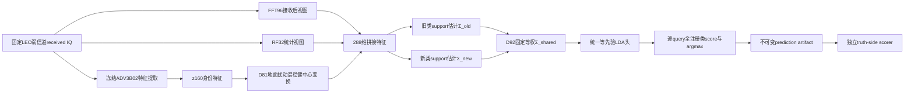

# D92方法原理、机制、输入输出与论文复现方法对比报告

日期：2026-07-27

证据状态：`EVIDENCE_BOUND_TECHNICAL_REPORT`

D92实验状态：`COMPLETED_DIAGNOSTIC_NEGATIVE_NOT_PROMOTABLE`

## 摘要

D92是面向CVS Stage2-C的轻量类增量分类头，不是新的IQ编码器，也不是重新训练Phase1主干的端到端网络。它继承D81的地面扰动谱稳健中心变换和D62/D43分类头流水线，只替换注册完成后的共享协方差估计：先用合法target-old support估计旧类任务协方差`Σ_old`，再用合法target-new support估计新类任务协方差`Σ_new`，最后固定合成为

```text
Σ_shared = 0.5Σ_old + 0.5Σ_new
```

全部旧类与新类仍由同一个等先验LDA仿射头竞争。D92不读取query真值、query的old/new角色、query批次类别数、类别配额或跨query关系，也不根据receiver、LEO场景、seed、新类数或具体TX标识切换公式。

D92解决的问题非常具体：当新类数量远多于旧类时，用全部注册support直接估计一份共享协方差，会让协方差统计更多地受新类任务支配；若完全冻结旧类协方差，则又会使新类标尺失配。D92把旧类适应与新类注册视为两个等权任务，而不是按support总行数自然加权。完整125稳定性screen显示，这个机制在K10/new20上相对D81把注册后旧类准确率提高2.622个百分点、最低旧类准确率提高4.600个百分点、遗忘降低2.622个百分点，但新类准确率下降0.653个百分点；K1因无法估计可靠类内协方差而严格回退，所有指标与D81逐值一致。D92证明了“任务均衡协方差能缓解大规模注册下的旧类遗忘”，但没有同时解决新类性能、K1适配和绝对准确率，因此不能晋级。

与论文复现方法相比，D92同时承担旧类域适应和新类注册；MRIOR-SDA、DADDA-SDA、ProtoNet CDA只承担Stage2-B闭集旧类域适应，不能直接与D92注册后的`H_old_new`比较。CSIL、MoPC-HR和Orthogonal Incremental SEI承担类增量任务，但其原论文允许base/source训练、历史统计或原生增量流程，数据权限和模型生命周期不同。项目中已有同LEO条件的复现结果可以描述性比较，但只有数据哈希、seed、support/query和候选空间完全匹配时才能称为严格paired comparison。

## 1.方法定位

### 1.1 D92要处理的科学问题

CVS的Phase2场景是：Phase1已经学习并封存旧发射机知识；部署到未见target receiver后，系统只得到该接收机上的固定LEO弱信道received IQ、K-shot已标注support和只读deployment bundle。Stage2-B用旧类support适应接收机域，Stage2-C再注册新类，随后每条query独立面对全部已注册类。

设旧类集合为`Y_old`，新类集合为`Y_new`，D92实验中的旧类数固定为6，新类数为5、10或20。困难来自三个因素：

1.接收机与LEO信道改变了特征分布，Phase1旧类头不能直接代表target域。
2.把新类加入候选空间后，旧类与新类共享同一决策空间，旧类会被新类侵入。
3.注册类数增大时，新类support行数远多于旧类support行数；若直接对全部support汇总协方差，任务权重会随新类数变化。

D92只攻击第三个问题及其引发的遗忘。它不是完整的“域变化显式建模器”，也不直接把地面旧类原型当作分类锚。

### 1.2 D92在完整系统中的位置



图中的D92核心是`Σ_old/Σ_new→Σ_shared→统一LDA头`。ADV3B02、D81中心变换、full/block组件融合、量化和artifact发布属于继承流水线；不能把这些继承组件都写成D92独创。

## 2.输入与输出

### 2.1 系统级输入

|输入|内容|是否更新|用途|
|---|---|---|---|
|Phase1 deployment bundle|冻结ADV3B02 checkpoint及与其联合封存的只读int8地面聚合知识|否|提取身份表征；为D81中心变换提供地面扰动谱|
|Phase2 capsule|`p2_min_v1`、`VALIDATED_ONCE`的固定received IQ|否|唯一合法target物理观测|
|旧类support|6个旧类、每类K个互不重复物理样本及标签|只形成target适配状态|估计旧类中心和`Σ_old`|
|新类support|5、10或20个新类、每类K个互不重复物理样本及标签|追加注册状态|估计新类中心和`Σ_new`|
|注册表|已注册类别顺序、旧类前缀和新类后缀|由合法enrollment定义|划分两个任务协方差组|
|算法锁|固定0.5/0.5权重、full/block结构、回退规则|否|防止按query或测试结果调参|
|query IQ|当前query的一份固定received IQ|否|只用于单样本前向和打分|

这里的“旧类前缀/新类后缀”来自合法注册生命周期，不是query角色Oracle。预测器知道哪些类别已经在Phase1存在、哪些类别刚刚由support注册，但不知道当前query究竟来自旧类还是新类。

### 2.2 核心函数输入

D92核心协方差函数接收：

```text
transformed: [C×K, 288]的support特征矩阵
targets:     [C×K]的连续类索引
class_count: C∈{6,11,16,26}
k_shot:      K≥1
arm:         full或block3_centered
```

288维特征由三个块组成：

```text
z_id160 + FFT96 + RF32
```

`block3_centered`只保留三个块各自的协方差，块间协方差置零；`full`保留完整288×288协方差。D92会被嵌入D62/D43的full、block、outer和held support fit中，任何query行都不进入这些fit。

### 2.3 核心函数输出

核心函数输出：

```text
coefficient: [C,288]的LDA仿射系数
intercept:   [C]的LDA截距
audit:       方法状态、权重、协方差谱、回退与访问边界记录
```

流水线随后把仿射头编译为部署状态，并输出：

- 每条query对全部已注册类的score；
- `argmax`预测类别；
- 不可覆盖的prediction artifact；
- predictor receipt、执行receipt和score哈希；
- truth-side scorer生成的旧类、新类、调和均值、floor、遗忘和逐类指标。

算法函数返回的FP32系数不等于最终允许长期保存FP32 sidecar。完整D81/D92流水线继续执行既有量化和状态封存；最终预测先封存，真值只在独立scorer侧连接。

## 3.特征与D81继承机制

### 3.1 为什么D92保留D81

D81从84个int8地面域×类聚合cell中构造类内去中心的跨域质心漂移谱。它不读取raw IQ、单样本feature、ground类别分数、单样本半径或count。对每个target类，D81在当前fit可见support上计算样本沿地面扰动谱的能量，并用一次Cauchy权重形成稳健中心：

```text
raw_w_i = 1 / (1 + energy_i / mean_energy)
μ_c^robust = Σ_i w_i z_i / Σ_i w_i
```

随后只平移该类support的`z160`中心，保持类内残差和target协方差不变，`FFT96/RF32`不变。这个设计让地面知识只影响“哪些target support更可靠”，不直接把ground旧类原型塞入query分数。

D92在此基础上重新设计注册后的协方差。如果删除D81，D92就不再是实验中实际运行的候选；如果把D81写成D92的任务均衡机制，也会混淆两者贡献。

### 3.2 K1为什么没有D81和D92增益

K1时每类只有一个物理support样本：

- D81没有类内样本差异，Cauchy可靠性权重无法区分样本；
- D92没有类内残差，不能稳定估计`Σ_old`和`Σ_new`；
- 代码因此严格调用D81基线fit，而不是伪造协方差或使用query补样本。

这不是实现漏跑，而是方法定义的可识别性边界。

## 4.D92数学机制

### 4.1 类中心

对每个注册类`c`，用当前fit可见的K-shot support计算：

```text
μ_c = (1/K) Σ_i z_ci
```

这里的`z_ci`已经经过D81稳健中心变换。旧类与新类使用相同的类中心公式。

### 4.2 任务内auto-shrinkage协方差

对旧类集合和新类集合分别拟合等先验、`lsqr`求解器语义的auto-shrinkage LDA协方差：

```text
Σ_old = AutoShrinkageCov({z_ci | c∈Y_old})
Σ_new = AutoShrinkageCov({z_ci | c∈Y_new})
```

auto-shrinkage的作用是把高维小样本协方差向更稳定的结构收缩，降低288维、少样本条件下的奇异风险。两组协方差先独立估计，因此新类数量增加不会直接把旧类任务在协方差统计中的权重压低。

### 4.3 固定任务均衡

```text
Σ_shared = 0.5Σ_old + 0.5Σ_new
```

0.5/0.5不是从query性能选出的最优权重，也不随新类数、receiver或场景变化。它来自项目对Stage2-B旧类适应与Stage2-C新类注册“同等优先”的方法锁。实验明确记录：

```text
d92_weight_scan_count = 0
d92_hyperparameter_scan_count = 0
d92_query_rows_used = 0
```

若使用`block3_centered`：

```text
Σ_shared =
diag(Σ_z160, Σ_FFT96, Σ_RF32)
```

若使用`full`，则保留三个特征块之间的交叉协方差。

### 4.4 统一等先验LDA头

所有注册类共享同一`Σ_shared`，类别先验固定为：

```text
π_c = 1/C
```

LDA仿射头为：

```text
w_c = Σ_shared^(-1) μ_c
b_c = -0.5 μ_c^T Σ_shared^(-1) μ_c + log π_c
s_c(q) = q^T w_c + b_c
ŷ(q) = argmax_c s_c(q)
```

“任务均衡”只发生在协方差构造阶段。最终没有旧类头和新类头两个分支，也没有先判断query角色再分类。旧类和新类对同一query做一次全注册类竞争。

### 4.5 数值闭合

D45/D43后续组件融合会删除所有类别共有的仿射项。D92在FP64中先执行：

```text
W ← W - mean_class(W)
b ← b - mean_class(b)
```

再跨越FP32边界，使后续再次中心化近似幂等。初始实现曾在一个125矩阵row触发近边界中心漂移；修复后完整重跑。retry1又发现注册前block组件误用了D92全协方差基线，导致注册前与D81不再逐值一致；retry2修复为“注册前与K1/K2严格D81，只有注册后且K>2启用D92”，并重新执行完整125。最终性能只采用retry2。

## 5.训练、适配与推理过程

### 5.1 Phase1

1.在source receivers上训练ADV3B02。
2.在任何target访问前封存checkpoint和合规int8地面聚合知识。
3.Phase2不更新地面组件，也不回读source样本。

### 5.2 Stage2-B：仅旧类

1.读取6个旧类的K-shot target support。
2.从固定received IQ提取`z160+FFT96+RF32`。
3.执行D81类内稳健中心变换。
4.构建注册前旧类头。
5.由于`class_count=6`，D92核心标记为`before_exact_d81`，系数和截距与D81逐值一致。

因此，D92不是一个独立的Stage2-B改进；它的注册前性能完全继承D81。

### 5.3 Stage2-C：注册新类

1.追加新类K-shot support和标签。
2.在所有当前fit可见support上重新计算类中心。
3.旧类和新类分别估计auto-shrinkage协方差。
4.固定0.5/0.5合成`Σ_shared`。
5.为全部旧类和新类计算统一LDA行。
6.经过full/block、outer/held安全组件与既有编译流程形成单一部署状态。
7.状态锁定后才打开query。

### 5.4 Query推理

1.对当前query的一份固定received IQ做一次允许的特征计算。
2.用单一仿射头计算全部注册类score。
3.直接`argmax`，不执行query-query图、Hungarian、quota、全局重排或角色路由。
4.原子发布prediction。
5.独立scorer按opaque query ID连接truth。

## 6.完整125实验设计

|维度|取值|
|---|---|
|target receiver|`20-1`,`3-19`,`7-14`,`7-7`,`8-8`|
|seed|`713102`至`713106`|
|slice|K10/new5、K10/new10、K10/new20、K5/new20、K1/new20|
|LEO场景|`leo_clear_weak`,`leo_low_elev_weak`,`leo_rain_weak`|
|旧类数|6|
|job数|5×5×5=125|
|场景单元|375|
|权威运行|retry2，125/125完成，0失败|

每个slice的结果是25个receiver×seed matched row均值，每个row内部覆盖三个LEO场景。`B-old`表示注册前旧类准确率，`A-old`表示注册后旧类准确率，`Min-old`表示row级最低旧类准确率，`New`表示已注册新类准确率，`H`表示旧类与新类准确率的调和均值，`F=B-old-A-old`表示遗忘。

## 7.D92与D81的严格matched结果

|切片|方法|B-old|A-old|Min-old|New|H|F|
|---|---|---:|---:|---:|---:|---:|---:|
|K1/new20|D81|68.144%|44.033%|14.200%|27.150%|33.410%|24.111pp|
|K1/new20|D92|68.144%|44.033%|14.200%|27.150%|33.410%|24.111pp|
|K5/new20|D81|81.267%|61.400%|30.800%|59.293%|60.035%|19.867pp|
|K5/new20|D92|81.267%|63.711%|33.200%|58.883%|60.955%|17.556pp|
|K10/new5|D81|86.111%|76.322%|50.667%|73.613%|74.606%|9.789pp|
|K10/new5|D92|86.111%|76.189%|49.800%|74.133%|74.803%|9.922pp|
|K10/new10|D81|86.111%|71.533%|42.267%|66.693%|68.815%|14.578pp|
|K10/new10|D92|86.111%|72.533%|44.200%|66.353%|69.106%|13.578pp|
|K10/new20|D81|86.111%|68.711%|38.067%|68.803%|68.591%|17.400pp|
|K10/new20|D92|86.111%|71.333%|42.667%|68.150%|69.555%|14.778pp|

### 7.1 Paired变化

|切片|ΔA-old|ΔMin-old|ΔNew|ΔH|ΔF|
|---|---:|---:|---:|---:|---:|
|K1/new20|0.000pp|0.000pp|0.000pp|0.000pp|0.000pp|
|K5/new20|+2.311pp|+2.400pp|-0.410pp|+0.920pp|-2.311pp|
|K10/new5|-0.133pp|-0.867pp|+0.520pp|+0.197pp|+0.133pp|
|K10/new10|+1.000pp|+1.933pp|-0.340pp|+0.291pp|-1.000pp|
|K10/new20|+2.622pp|+4.600pp|-0.653pp|+0.964pp|-2.622pp|

K5/new20、K10/new10和K10/new20的旧类/遗忘改善具有稳定paired信号，但都伴随新类下降。K10/new5则相反：新类略升，旧类和floor略降。固定等权没有让一个任务在所有注册规模上同时占优。

### 7.2 Receiver与场景

- K10/new20的5个receiver旧类准确率均提高，但`3-19`在D92后仍只有`A-old=57.44%`、`Min-old=25.67%`、`New=49.10%`。
- `leo_clear_weak`,`leo_low_elev_weak`,`leo_rain_weak`上的K10/new20旧类分别提高2.00、2.77和3.10个百分点。
- 三个场景的新类分别下降0.72、0.59和0.65个百分点。

这排除了“改善只来自单一receiver或单一LEO场景”的解释，也说明新类代价同样具有跨场景一致性。

## 8.Role-Oracle诊断告诉了什么

另有一个特许D92 Role-Oracle实验。它在同一次fresh run、同一support、同一状态和同一score matrix上，同时计算：

- 正式无Oracle：对全部注册类直接argmax；
- Role-Oracle上限：已知当前query属于old还是new后，只在对应角色的类别内argmax。

该实验永久标记为`LICENSED_ORACLE_UPPER_BOUND_NON_PROMOTABLE`。它不能用于方法晋级，但能定位跨角色竞争损失。

|切片|无Oracle A-old|Oracle A-old|无Oracle New|Oracle New|无Oracle H|Oracle H|
|---|---:|---:|---:|---:|---:|---:|
|K10/new5|76.19%|83.62%|74.13%|84.75%|75.15%|84.18%|
|K10/new20|71.33%|83.31%|68.15%|71.43%|69.71%|76.91%|
|K1/new20|44.03%|68.14%|27.15%|31.02%|33.59%|42.63%|

K10/new20中Oracle把旧类提高约11.98个百分点，而新类只提高约3.28个百分点，说明D92的大规模注册瓶颈主要是新类侵入旧类，而不只是角色内部旧类彼此混淆。K1/new20中旧类Oracle结果恰好回到注册前旧类准确率68.14%，表明24.11个百分点遗忘几乎都来自把新类加入统一候选空间后的跨角色竞争。合法方法必须在不知道query角色的情况下解决这个问题，不能把Oracle上限当作可部署方案。

## 9.与域适应论文复现方法的对比

### 9.1 为什么域适应方法不能直接与D92的Stage2-C结果排名

MRIOR、DADDA和ProtoNet CDA在本项目对比中识别的都是6个target-old类。它们回答“已知旧类在新接收机上如何适应”，不回答“加入5/10/20个新类后如何同时保持旧类并识别新类”。因此：

- 可将它们的`old_acc`与D92注册前`B-old`作Stage2-B描述性比较；
- 不能将MRIOR的`old_acc`与D92注册后`H_old_new`比较；
- 不能因MRIOR的K20 old准确率高，就说它解决了D92的新类注册；
- D92注册后旧类下降也不能简单解释为域适应比MRIOR差，因为D92多承担了全注册类竞争。

### 9.2 MRIOR-SDA

原论文《Mitigating Receiver Impact on Radio Frequency Fingerprint Identification via Domain Adaptation》把跨接收机RFFI定义为闭集无监督域适应：输入是有标签source receiver样本和无标签target receiver样本，机制由全局域对齐和自适应伪标签组成。项目中的`MRIOR-SDA`是CVS监督K-shot适配版本，不是作者给出的正式简称：它共享ADV3B02 checkpoint，保留GAD和Donsker–Varadhan KL方向；合法target support真标签进入target CE，真标签优先于CPL伪标签；没有额外无标签target训练池时关闭CPL并单列消融。

MRIOR-SDA通过梯度改变特征提取/分类状态，适合旧类闭集接收机域适应。D92的区别是：

|维度|D92|MRIOR-SDA|
|---|---|---|
|任务|Stage2-B旧类适应+Stage2-C新类注册|Stage2-B旧类闭集适应|
|target标签|旧类和新类K-shot support标签|旧类K-shot support标签|
|source运行时访问|禁止；只读bundle例外|项目matched版共享checkpoint；原论文训练需source数据|
|核心机制|D81稳健中心+任务均衡协方差+统一LDA|域对齐critic+target CE/伪标签|
|更新方式|D92增量为闭式协方差/仿射求解；继承流水线另有适配步骤|梯度训练|
|新类输出|支持|不支持|
|query决策|逐样本全注册类argmax|逐样本旧类闭集分类|

### 9.3 DADDA-SDA

DADDA原论文《Cross-Receiver Radio Frequency Fingerprint Identification Based on Domain Adaptation With Dynamic Distribution Alignment》同样是闭集UDA。它使用ResNet18提取全局特征，以MMD对齐全局分布；多尺度模块提取局部/子域特征，以LMMD进行类条件对齐；动态因子

```text
α = d_MMD / (d_MMD + d_LMMD)
```

调节全局与局部对齐权重。项目中的DADDA-SDA加入target support CE，LMMD对support使用真实标签；若另加无标签target池，必须作为半监督扩展单列。

DADDA-SDA比D92更像“学习域不变特征”；D92则假定冻结表征已基本可用，主要校正少样本注册头的几何与旧新任务权重。DADDA不设计新类追加、旧类遗忘或全注册类竞争，因此不能替代D92的Stage2-C评价。

### 9.4 ProtoNet CDA

ProtoNet CDA用每类support均值形成prototype，query按距离分类，不对query反传。它与D92都能做到support-only，但ProtoNet CDA在现行比较中只覆盖旧类Stage2-B；D92使用共享协方差对各维度和特征块进行判别缩放，并在Stage2-C同时容纳旧类和新类。

### 9.5 Stage2-B描述性数值

下表中的域适应矩阵使用5个receiver、5个seed`713101–713105`；D92使用`713102–713106`，两者seed集合错开1个，当前报告也没有完成跨矩阵artifact哈希配对。因此只能看趋势，不能计算paired显著性或宣布严格胜负。

|K|直接ADV3B02 old|MRIOR-SDA old|DADDA-SDA old|ProtoNet CDA old|D92注册前B-old|
|---:|---:|---:|---:|---:|---:|
|1|75.21%|69.88%|72.58%|59.47%|68.144%|
|5|75.21%|79.17%|76.74%|70.28%|81.267%|
|10|75.21%|84.50%|79.36%|70.86%|86.111%|

趋势上，D92/D81注册前旧类头在K5和K10高于三个论文适配头，MRIOR-SDA在K1高于D92/D81；但D92注册前完全继承D81，这不是D92任务均衡协方差带来的增益。域适应论文结果证明的是不同Stage2-B适配管线的效果，不是D92核心机制的消融。

## 10.与类增量论文复现方法的机制对比

### 10.1 CSIL

CSIL论文《Class-Incremental Learning for Wireless Device Identification in IoT》使用zero-bias cosine fingerprint层，通过通道扩展为新类增加表示容量，并用块状mask隔离新旧fingerprint；优化目标包含CE、知识蒸馏和EWC。它的核心思想是“扩展网络容量并限制旧知识更新”，而D92不扩展encoder，只重估共享判别几何。

|维度|D92|CSIL|
|---|---|---|
|旧知识保护|协方差任务均衡，旧类不冻结|扩展通道、mask、KD、EWC|
|新类学习|新类support中心进入统一LDA|为新类扩展fingerprint/通道并训练|
|模型更新|轻量闭式头|梯度增量训练|
|历史样本|主方法禁止source回放|论文原生base/增量流程按自身权限运行|
|主要风险|新类仍侵入旧类；K1无效|新类训练可覆盖旧决策边界；small-K可能零步|

### 10.2 MoPC-HR

MoPC-HR全名为《Non-Exemplar Class-Incremental Learning via Prototype Correction and Hierarchical Regularization for Specific Emitter Identification》。它维护类prototype，用动量prototype correction调整旧类中心，通过高斯prototype augmentation生成特征级训练样本，并以层次正则控制旧类、新类及其关系。论文默认prototype动量为0.97、噪声标准差为0.05，base和增量阶段各20epoch。

MoPC-HR和D92都不要求保存旧类raw exemplar，但侧重点不同：

- D92重新平衡两个任务的协方差统计；
- MoPC-HR显式移动旧prototype并在特征空间增强prototype；
- D92最终只有统一线性判别头；
- MoPC-HR执行增量梯度训练，在CVS大域偏移下容易出现“新类学得越多，旧类遗忘越强”的权衡。

### 10.3 Orthogonal Incremental SEI

正交空间约束FSCIL-SEI在base阶段预留相互分离的伪目标方向，并联合使用交叉熵、自监督对比和类中心分离损失；增量阶段冻结encoder，用新类support均值初始化新权重，再用边际竞争与prototype对齐做校准。它试图在Phase1就为未来类“留空间”，D92则不假设未来新类方向已预留，只在Phase2注册时重构共享协方差。

这一方法的潜在优势是K1仍可利用预留方向；D92在K1必然回退。代价是正交方法对base类顺序、伪目标容量、论文数据和完整base训练高度敏感。项目中的ManyTx代理正式结果仍存在论文数据源、真实TX顺序和未公开网络细节差距。

### 10.4 qKNN路线

项目中的合法非dense qKNN不是外部论文复现，但它是重要的类增量参照。单qKNN头将support本身作为局部记忆，结合prototype和距离进行逐样本分类；adapter版本进一步学习轻量特征变换。D92使用参数化共享协方差头，不保存逐support邻居图。

|维度|D92|单qKNN/adapter qKNN|
|---|---|---|
|决策形式|统一LDA仿射头|邻居、prototype及轻量融合|
|support状态|统计量和头参数|量化support/邻居状态|
|K1|严格回退，无D92增益|仍可使用单个邻居|
|注册类增加|协方差任务均衡|局部邻居竞争，需跨角色校准|
|query-query图|无|合法版本无；历史dense版本有，仅诊断|

## 11.类增量论文复现的数值对比

### 11.1 官方流程LEO完整矩阵与D92共同slice

CSIL和MoPC-HR官方仓库核心复现完成了5receiver×5seed×4K×4新类规模×2方法=800cell、2400个LEO场景row。其seed为`713101–713105`，D92为`713102–713106`；两者base训练、状态构造和方法权限也不同。因此下表是共同K/new切片上的描述性对照，不是严格paired结果。

|切片|方法|old-before|old-after|seen-new|H|forgetting|
|---|---|---:|---:|---:|---:|---:|
|K1/new20|D92|68.144%|44.033%|27.150%|33.410%|24.111pp|
|K1/new20|CSIL官方流程|42.833%|42.833%|0.000%|0.000%|0.000pp|
|K1/new20|MoPC-HR官方流程|45.322%|40.722%|1.363%|2.603%|4.600pp|
|K5/new20|D92|81.267%|63.711%|58.883%|60.955%|17.556pp|
|K5/new20|CSIL官方流程|42.833%|0.200%|5.557%|0.316%|42.633pp|
|K5/new20|MoPC-HR官方流程|45.322%|13.511%|17.433%|14.309%|31.811pp|
|K10/new5|D92|86.111%|76.189%|74.133%|74.803%|9.922pp|
|K10/new5|CSIL官方流程|42.833%|0.689%|20.413%|1.264%|42.144pp|
|K10/new5|MoPC-HR官方流程|45.322%|9.322%|49.547%|14.947%|36.000pp|
|K10/new10|D92|86.111%|72.533%|66.353%|69.106%|13.578pp|
|K10/new10|CSIL官方流程|42.833%|0.000%|10.460%|0.000%|42.833pp|
|K10/new10|MoPC-HR官方流程|45.322%|9.500%|32.900%|13.770%|35.822pp|
|K10/new20|D92|86.111%|71.333%|68.150%|69.555%|14.778pp|
|K10/new20|CSIL官方流程|42.833%|38.222%|1.660%|2.979%|4.611pp|
|K10/new20|MoPC-HR官方流程|45.322%|7.611%|25.187%|10.695%|37.711pp|

D92在这些共同slice上的H明显更高，但不能把差距全部归因于“D92算法优于论文算法”。CSIL/MoPC-HR流程在自己的base训练后得到的`old-before`仅约42.8%和45.3%，而D92的D81/ADV3B02底座在K10达到86.1%；底座质量、模型生命周期、训练权限和CVS接口适配共同影响结果。

更可靠的结论是：

1.D92在当前ADV3B02主线中保持了更强的旧类target基础。
2.CSIL官方语义在small-K固定batch下存在大量零步cell；K1结果不能证明其方法对LEO不敏感。
3.MoPC-HR能学到更多新类，但随K和新类训练增强，旧类遗忘明显增加。
4.两种论文方法在CVS的“LEO弱信道+大量同时新类+统一旧新竞争”条件下都出现严重旧新失衡。

### 11.2 旧的统一Stage2-C矩阵

另一批统一Stage2-C矩阵固定只有2个新类，逐K的`H_old_new`如下：

|方法|K1|K5|K10|任务边界|
|---|---:|---:|---:|---|
|CSIL|16.23%|18.05%|17.69%|论文原生管线适配|
|MoPC-HR|14.70%|24.17%|30.93%|论文原生管线适配|
|Orthogonal Incremental|9.88%|6.84%|7.73%|论文机制复现管线|
|单qKNN+FFT96|49.49%|66.02%|71.70%|严格ADV3B02、1-view、无训练adapter|
|qKNN E20|58.03%|74.29%|79.97%|严格ADV3B02、轻量adapter|

D92没有new2切片，不能填入这张表做严格排名。D92的K10/new5 H为74.803%，与qKNN E20的K10/new2 H=79.97%难度不同；新类数从2增至5会改变候选空间、遗忘和跨角色混淆，不能用5.17个百分点差值宣布qKNN优于D92。

### 11.3 最新CVS接口适配诊断

2026-07-24的CSIL/MoPC-HR v3接口适配实验进一步说明：

- CSIL修复fingerprint mask后，新类确实进入训练，但旧类准确率几乎归零，暴露的是新类覆盖旧决策边界，而不是代码空跑。
- MoPC-HR small-K接口适配与严格官方基线的H差异很小，低性能主要来自方法在“25个新类+LEO弱信道+极少样本”下的能力边界。
- MoPC-HR按5类×5阶段顺序到达的诊断比同时注册更容易累计覆盖旧类，不能把顺序诊断冒充官方同时注册结果。

这些结果支持D92对“旧新任务均衡”的关注，但也说明仅平衡协方差不足以解决全部跨角色冲突。

## 12.公平比较矩阵

|方法|原始任务|项目对比任务|source/base访问|target标签|支持新类注册|旧类保护机制|严格可与D92 paired？|
|---|---|---|---|---|---|---|---|
|D92|CVS Stage2-B/C|同原始任务|只读bundle，禁止source样本|旧类+新类K-shot|是|D81中心+任务均衡协方差|与D81是；与论文方法当前否|
|MRIOR-SDA|闭集UDA|Stage2-B监督K-shot改造|原论文需有标签source；项目版共享checkpoint|旧类support|否|域对齐与伪标签|否，只可Stage2-B描述比较|
|DADDA-SDA|闭集UDA|Stage2-B监督K-shot改造|原论文需source/target配对batch|旧类support|否|MMD/LMMD动态对齐|否，只可Stage2-B描述比较|
|ProtoNet CDA|闭集few-shot DA|Stage2-B|checkpoint+support|旧类support|当前比较未注册新类|prototype|否，只可Stage2-B描述比较|
|CSIL|类增量WDI|CVS类增量适配|按论文完整base/source流程|新类训练标签|是|通道扩展、mask、KD、EWC|当前否|
|MoPC-HR|非exemplar类增量SEI|CVS类增量适配|按论文完整base/source流程|新类训练标签|是|prototype correction+层次正则|当前否|
|Orthogonal Incremental|FSCIL-SEI|CVS类增量适配|完整base训练|新类K-shot|是|预留正交方向+权重校准|当前否|
|qKNN E20|项目轻量类增量|统一Stage2-C|checkpoint+support|旧类+新类K-shot|是|局部邻居+轻量adapter|只有相同new数与manifest时可paired|

## 13.D92的优势

1.协议边界清楚。D92 fit只读取support和只读bundle，query完全不进入适配。
2.没有query角色Oracle。最终只有一个全注册类头。
3.没有按receiver、场景、seed、新类数或TX标识调参。
4.任务权重不随新类数量自然漂移。旧类只有6类、新类可达20类时，旧任务仍保留50%协方差权重。
5.状态和query计算轻。D92核心是闭式协方差与仿射头，不引入query-query图。
6.完整125证据显示大注册规模旧类、floor和遗忘改善跨receiver、跨场景存在。
7.数值闭合经过两次缺陷修复和完整重跑，最终注册前与D81逐值一致。

## 14.D92的局限

### 14.1 K1结构性无效

没有类内残差就不能估计任务协方差。D92在K1不是“效果弱”，而是机制不激活。

### 14.2 仍以新类退化换取旧类改善

K5/new20、K10/new10和K10/new20都出现旧类改善、新类下降。固定0.5/0.5平衡的是协方差估计权，不保证score分布、prototype半径或logit标尺自动平衡。

### 14.3 没有显式ground→LEO域变换

D81只用地面扰动谱做support可靠性加权和类中心平移。D92没有学习类无关的ground到target共享变换，也没有让地面旧类知识成为K1可用的弱先验。

### 14.4 共享协方差表达能力有限

全部类共享一份`Σ_shared`，无法表示各类半径、各类不确定度和局部非线性边界。旧类与新类在同一接收机上仍可能具有不同尺度和多模态结构。

### 14.5 Role-Oracle差距仍大

K10/new20的无Oracle H比Role-Oracle低7.20个百分点，旧类准确率低11.98个百分点。合法跨角色校准仍是主要未解问题。

### 14.6 绝对性能门全部失败

K10/new20的`A-old=71.333%`、`Min-old=42.667%`、`New=68.150%`，远低于项目目标92%、88%和86%。完成125不等于达到可推广性能。

## 15.如何正确使用D92

D92适合：

- 作为D81之后的注册协方差消融；
- 检验大规模新类注册时旧任务是否被support数量淹没；
- 作为统一线性头、逐query部署的轻量参考；
- 为后续跨角色校准或类无关域变换提供基线。

D92不适合：

- 声称解决了K1域适应；
- 用Role-Oracle结果代表部署性能；
- 用单一K10/new20旧类提升掩盖新类下降；
- 与MRIOR的Stage2-B old准确率直接比较H；
- 与new2的qKNN或不同seed的论文矩阵做paired显著性结论；
- 把WiSig/ManySig+LEO模拟结果表述为真实在轨验证。

## 16.后续方法建议

下一步不应继续扫描`Σ_old/Σ_new`权重。D92已经回答了权重平衡的方向性问题，继续用query性能寻找0.4/0.6或0.6/0.4会破坏方法锁，也难以解决K1和跨角色标尺。

更有信息价值的路线是：

1.从Phase1合规int8地面聚合知识中学习类无关ground→LEO变化结构。
2.用target-old support标定共享域变换，但不让旧类身份直接压制新类。
3.让target-new support在同一变换空间独立注册。
4.用所有类相同公式估计support半径、不确定度和校准强度。
5.在support-held代理上同时约束old、新类、floor和遗忘，冻结后才打开query。
6.为K1设计可识别的弱先验或单样本不确定度机制，而不是伪造协方差。
7.继续保留单一全注册类决策，禁止role Oracle、quota和query批次重排。

## 17.结论

D92的核心贡献不是“精度已经很高”，而是把类增量共享协方差中的样本数量偏置改写为显式任务均衡。它用合法support分别估计旧类和新类协方差，再固定等权合成，并通过一个统一等先验LDA头完成逐query全注册类判决。完整125实验确认：新类规模较大时，这一改动确实能稳定减轻旧类遗忘并提高旧类floor；代价是新类准确率小幅下降，K1完全无效，绝对性能仍远低于目标。

MRIOR-SDA和DADDA-SDA擅长闭集接收机域适应，但不承担新类注册；CSIL、MoPC-HR和Orthogonal Incremental承担类增量任务，却采用不同的base训练、增量更新和数据权限。现有复现结果表明，D92在当前ADV3B02+LEO弱信道主线上保持了更好的旧新联合性能，但尚不能用严格paired统计宣布普遍优于所有论文方法。当前最准确的定性是：

> D92是一个协议合法、技术闭合、具有稳定遗忘改善信号但未达到推广门槛的任务均衡类增量头。

## 18.证据来源

### 本地权威材料

- `项目.md`
- `automation_reports/CV-SincNet/d92_registration_balanced_125_20260720/report.md`
- `code/cvsrffi/stage2_d92_registration_balanced_covariance.py`
- `code/cvsrffi/stage2_d92_query_evaluation.py`
- `code/scripts/probe_d92_registration_balanced_covariance.py`
- `analysis/d81_ground_nuisance_cauchy_center_traceability_20260720.md`
- `automation_reports/CV-SincNet/d81_comprehensive_125_20260720/report.md`
- `automation_reports/CV-SincNet/d92_role_oracle_licensed_125_20260721/report.md`
- `automation_reports/CV-SincNet/kshot_da_ci_qknn_comparison_20260715/report.md`
- `automation_reports/CV-SincNet/adv3b02_officialrepo_csil_mopc_20260723_v1/report.md`
- `automation_reports/CV-SincNet/adv3b02_csil_mopc_cvs_adapter_opt_20260724_v3/report.md`
- `paper_reproduction/CSIL/paper_checklist.md`
- `paper_reproduction/mopc_hr_non_exemplar_cil_sei/README.md`
- `paper_reproduction/orthogonal_incremental_sei/paper_checklist.md`
- `paper_reproduction/dadda/paper_checklist.md`

### 原论文

1.L. Yang, Q. Li, X. Ren, Y. Fang, and S. Wang, “Mitigating Receiver Impact on Radio Frequency Fingerprint Identification via Domain Adaptation,” *IEEE Internet of Things Journal*, vol. 11, no. 13, pp. 24024–24034, 2024, doi:`10.1109/JIOT.2024.3389491`.
2.J. Feng, S. Fang, and Y. Fan, “Cross-Receiver Radio Frequency Fingerprint Identification Based on Domain Adaptation With Dynamic Distribution Alignment,” *IEEE Internet of Things Journal*, vol. 12, no. 16, pp. 33202–33214, 2025, doi:`10.1109/JIOT.2025.3573713`.
3.“Class-Incremental Learning for Wireless Device Identification in IoT,”*IEEE Internet of Things Journal*,2021,doi:`10.1109/JIOT.2021.3078407`.
4.D. Li, Z. Chen, M. Shao, X. Chen, S. Hong, J. Qi, and H. Sun, “Non-Exemplar Class-Incremental Learning via Prototype Correction and Hierarchical Regularization for Specific Emitter Identification,” *IEEE Transactions on Intelligent Transportation Systems*, vol. 26, no. 8, pp. 12632–12646, 2025, doi:`10.1109/TITS.2025.3559174`.
5.L. Sun, R. Xue, H. Zha, Y. Lin, and W. Wang, “正交空间约束的特定辐射源小样本类增量识别方法/Few-Shot Class-Incremental Learning for Specific Emitter Identification with Orthogonal Space Constraints,” *通信学报*，论文复现以本地PDF和清单记录的版本为准。
