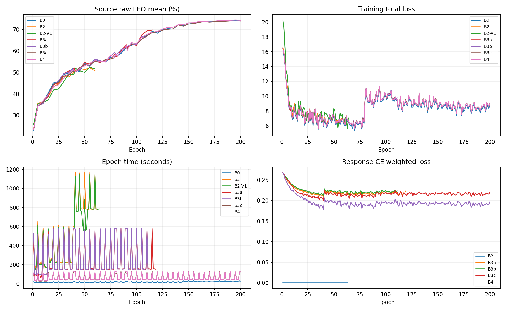
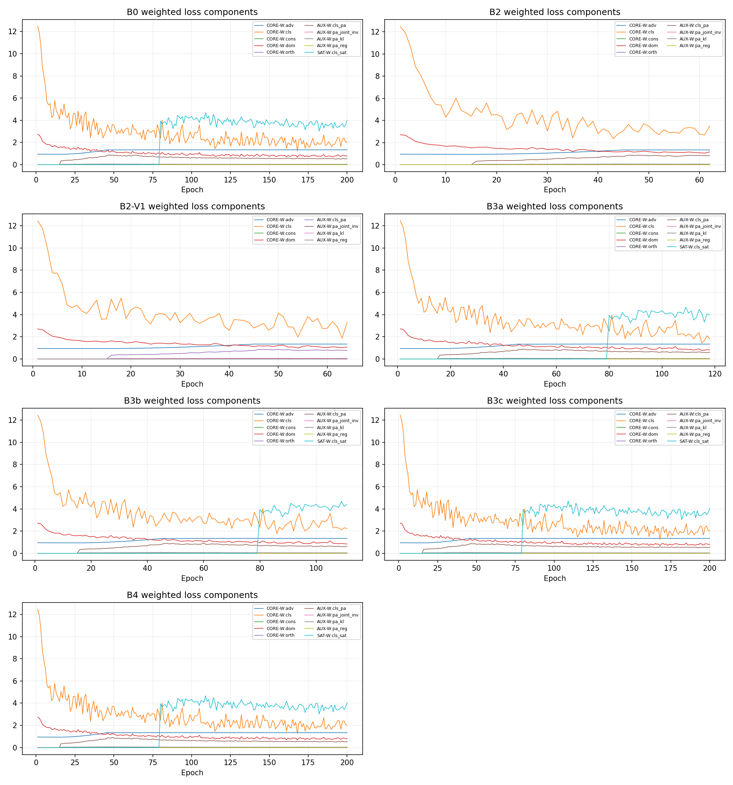
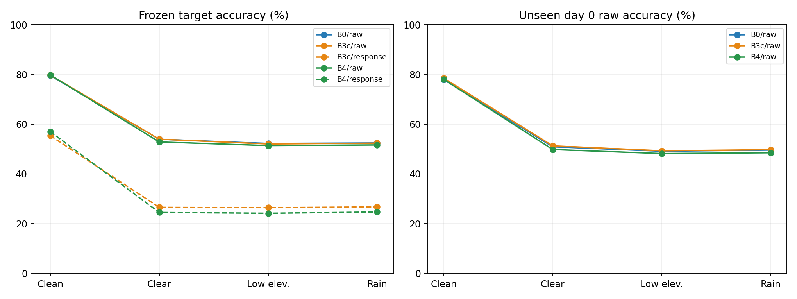

# ECRS-V1R/V2完整训练快照与已完成组目标域测试（2026-09-08）

已完成的B0/B3c/B4已完成冻结目标测试：raw三种LEO均值分别为52.8706%、52.7808%、51.9599%。B3c相对B0低0.0899个百分点，B4低0.9107个百分点。B4源域的小幅优势未延续到目标域；当前保持NO_PROMOTION_TO_DEFAULT。其余4组仍在训练。

## 状态与分析边界

训练快照采集于2026-09-08 09:05左右（N607本地时间）；下载是逐文件进行，运行组文件存在秒级采集偏差。3/7组已完成200轮并闭合源域产物；另外4组仍在训练。此处曲线只覆盖下载快照，末尾的实时状态不回填到旧曲线。

|组|状态|完整epoch|源域最优epoch|最优LEO均值%|最近验证epoch/均值%|末轮训练loss|跳过batch|
|---|---|---|---|---|---|---|---|
|B0|SOURCE_SCREEN_COMPLETE|200|199|74.1988|200/74.1840|8.8259|15|
|B2-V1|RUNNING|64|55|52.4296|60/51.5864|7.0598|9|
|B2|RUNNING|62|55|52.1506|60/50.7272|7.1480|6|
|B3a|RUNNING|118|115|69.7296|115/69.7296|8.8692|8|
|B3b|RUNNING|111|105|66.7284|110/65.9383|9.7652|9|
|B3c|SOURCE_SCREEN_COMPLETE|200|195|73.9346|200/73.8988|9.0732|12|
|B4|SOURCE_SCREEN_COMPLETE|200|195|74.4185|200/74.3481|9.0183|12|

B0为原基线；B2-V1为旧V1/R7非融合路径；B2为V1R；B3a为V2 legacy28旧参考+real8；B3b为legacy28估计参考+real8；B3c为compact8+real8；B4为compact8+complex24。B5/B6未启动。未完成组不能与E200组直接做最终排名。

同为E60时的描述性源域对照（不是最终排名；同seed不自动保证初始化与优化轨迹完全相同）：

|组|E60 clean raw%|E60 LEO raw均值%|
|---|---|---|
|B0|96.3852|56.3346|
|B2-V1|96.8704|51.5864|
|B2|96.5296|50.7272|
|B3a|96.5481|55.0617|
|B3b|96.2148|56.1654|
|B3c|96.5815|55.2148|
|B4|96.4037|55.5136|

## 数据、选择与复算

seed=392005；源接收机1/3/4/6/8，day1/2/3；源池90000，L=6300、U=56700、validation=27000，比例0.07/0.63/0.30。U池存在不表示U损失生效。训练阶段未使用目标域选checkpoint。B0冻结E199，B3c/B4冻结E195，以源域raw三种弱LEO平均准确率选择。

完整读取65个快照文件，CSV与JSONL逐epoch核对训练loss、准确率和时长；全部324000条源域最终预测逐条复算准确率、唯一ID以及receiver/day分组，与保存的统计一致。14个best/latest checkpoint的元数据见checkpoint_audit.json。没有用日志尾部代替全量分析。

## 已完成组：源域完整验证

|组/路径|clean%|clear%|low_elev%|rain%|LEO均值%|
|---|---|---|---|---|---|
|B0/raw|97.9000|76.8037|72.8556|72.9370|74.1988|
|B3c/raw|97.9667|76.3963|72.6704|72.7370|73.9346|
|B3c/response|59.5185|25.3296|24.5370|25.2556|25.0407|
|B3c/fused|97.9667|76.3963|72.6704|72.7370|73.9346|
|B3c/common_head|97.9667|76.3963|72.6704|72.7370|73.9346|
|B4/raw|97.8815|76.9111|73.3074|73.0370|74.4185|
|B4/response|68.4407|28.9000|27.5407|27.4815|27.9741|
|B4/fused|97.8815|76.9111|73.3074|73.0370|74.4185|
|B4/common_head|97.8815|76.9111|73.3074|73.0370|74.4185|

B4的源域raw LEO均值比B0高0.2198个百分点，B3c低0.2642个百分点。B4响应分支clean准确率68.44%，三种LEO约27%–29%；B3c响应分支更弱。响应分支学到了可测的分类信号，但远弱于raw，尚不能说明得到稳定、可迁移的发射机指纹。fusion关闭时fused/common_head等于raw，rescue/harm=0不是融合收益证据。

## 完整曲线与机制激活

B0/B3c/B4后期源域LEO曲线已接近平台，最优点接近训练末尾。E80附近总loss上跳与日志中的加权sat分类项由0切为约4同步，且源域准确率继续上升；不能仅凭跨阶段总loss上跳判断发散。B2/B2-V1尚处早期阶段。

|组|响应CE有效执行batch|成功更新batch|首次epoch|EMA更新|cross_rx/U/fused有效batch|
|---|---|---|---|---|---|
|B0|无revision遥测|—|—|—|无该遥测|
|B2-V1|无revision遥测|—|—|—|无该遥测|
|B2|0|0|None|0|0/0/0|
|B3a|5798|5790|1|5790|0/0/0|
|B3b|5439|5430|1|5430|0/0/0|
|B3c|9800|9788|1|9788|0/0/0|
|B4|9800|9788|1|9788|0/0/0|

V2四组响应CE从E1开始真实执行并产生成功优化步骤；EMA更新不代表U配对训练。B2的响应CE按阶段从E91启用，快照尚未到达，当前0次是阶段状态。旧V1物理项缺少逐batch专用loss记录，本报告不能补造其实际激活量；其配置保存在checkpoint审计。

E200逐batch遥测中，B3c响应CE平均加权loss=0.219855、响应分支平均梯度范数=0.477103；B4分别为0.196583和0.834564。两组末轮均49个成功步骤。该证据支持响应分支实际优化，不替代跨域机制有效性证明。

## 数值异常、失败与资源

7组均出现少量unsafe backward/step skipped警告；已完成组B0为15次，B3c/B4各12次。它们不是零异常运行，但完成组无训练Traceback且正常完成。运行组stdout可能比最后完整epoch多1次警告：例如B2为7条、epoch累计6次，B2-V1为10条、epoch累计9次，属于采集中epoch边界偏差，不能抹去或混为失败次数。未因低性能停止或干预健康训练。

V2此前r1在真实训练前的兼容性检查失败：PyTorch2.1不接受该Tensor.all的tuple维度写法。原始日志保留；修复两处降维写法后r2才开始训练，不能把失败r1计为完成实验。

|组|累计训练小时|累计epoch小时（含验证）|最近10轮平均秒|按当前速度剩余小时|
|---|---|---|---|---|
|B0|0.863|0.976|22.7|0.0|
|B2-V1|7.187|8.730|857.8|32.4|
|B2|7.137|8.729|857.5|32.9|
|B3a|4.736|8.238|238.1|5.4|
|B3b|4.464|7.883|238.0|5.9|
|B3c|2.303|3.334|67.0|0.0|
|B4|2.369|3.439|67.3|0.0|

以上是各进程累计时间而非独占GPU计费时长。ETA使用最近10轮平均值，包含周期验证；B3a/B3b约5–8小时，B2/B2-V1按当前阶段约30–40小时，后续阶段和共享GPU负载可能扩大到约1.5–2天。最终源预测与测试另计。

## 已完成组：冻结目标域测试

状态：TARGET_TEST_COMPLETE / VERIFIED。使用未参与源训练的7个接收机0/2/5/7/9/10/11、day0/1/2/3、全部6个已注册TX；每场景168000条，共3×4×168000=2016000条预测。day0进一步构成未见日期子集。全部12个无truth预测文件完成后，独立scorer才连接truth；目标结果不回流checkpoint、head或超参数选择。

|组/路径|clean%|clear%|low_elev%|rain%|LEO均值%|
|---|---|---|---|---|---|
|B0/raw|79.5673|53.9327|52.2446|52.4345|52.8706|
|B3c/raw|79.7548|53.9506|52.0327|52.3589|52.7808|
|B3c/response|55.3881|26.5363|26.4077|26.7143|26.5528|
|B3c/fused|79.7548|53.9506|52.0327|52.3589|52.7808|
|B3c/common_head|79.7548|53.9506|52.0327|52.3589|52.7808|
|B4/raw|79.8125|52.8565|51.3815|51.6417|51.9599|
|B4/response|56.9821|24.5036|24.1565|24.6839|24.4480|
|B4/fused|79.8125|52.8565|51.3815|51.6417|51.9599|
|B4/common_head|79.8125|52.8565|51.3815|51.6417|51.9599|

|组/场景|raw正确/总数|最差RX%|未见day0%|融合rescue/harm|
|---|---|---|---|---|
|B0/clean|133673/168000|72.0417|77.9190|0/0|
|B0/leo_clear_weak|90607/168000|39.7583|50.9024|0/0|
|B0/leo_low_elev_weak|87771/168000|39.7000|49.1238|0/0|
|B0/leo_rain_weak|88090/168000|40.5125|49.5952|0/0|
|B3c/clean|133988/168000|67.9708|78.4833|0/0|
|B3c/leo_clear_weak|90637/168000|39.4708|51.2786|0/0|
|B3c/leo_low_elev_weak|87415/168000|38.9792|49.2952|0/0|
|B3c/leo_rain_weak|87963/168000|39.0167|49.7262|0/0|
|B4/clean|134085/168000|71.4583|78.0095|0/0|
|B4/leo_clear_weak|88799/168000|37.1042|49.8048|0/0|
|B4/leo_low_elev_weak|86321/168000|37.5750|48.1952|0/0|
|B4/leo_rain_weak|86758/168000|38.2875|48.5071|0/0|

完整receiver/day/receiver×day/TX分组和6×6混淆矩阵位于target_test_summary.json；这是Phase1闭集冻结测试，不是Stage2未知类识别结果。

目标clean相对B0：B3c提高0.1875个百分点，B4提高0.2452个百分点；但B3c的最差接收机clean从B0的72.0417%降至67.9708%。总体准确率和分组下限必须同时看。B4在三个目标LEO场景均低于B0，响应路径LEO均值24.4480%也低于B3c的26.5528%。这些结果不支持“复杂锚点带来跨域增益”；当前证据也不足以把下降唯一归因于某一个机制。

|目标RX|B0 clean%|B3c clean%|B4 clean%|B0 LEO%|B3c LEO%|B4 LEO%|
|---|---|---|---|---|---|---|
|0|82.5875|82.8792|83.1833|63.7556|63.4694|62.5333|
|2|72.0417|67.9708|71.4583|40.0444|39.8403|37.6556|
|5|85.8125|86.2667|85.8250|62.4097|62.4222|62.0181|
|7|74.7583|74.4542|73.3833|41.2000|39.7500|38.6250|
|9|85.9833|86.9125|87.1875|61.2403|61.5819|62.4486|
|10|75.0708|77.9125|76.0667|49.6125|49.8611|47.9597|
|11|80.7167|81.8875|81.5833|51.8319|52.5403|52.4792|

|组|四场景推理秒数|CUDA峰值allocated MiB|CUDA峰值reserved MiB|
|---|---|---|---|
|B0|105.32|188.6|296.0|
|B3c|951.48|188.8|264.0|
|B4|963.43|188.8|264.0|

## 独立实时读回

读回时间：2026-09-08T09:52:41.189604；测试进程存活=False；目标汇总产物存在=True。

|组|完整epoch|进程存活|源域完成产物|GPU|
|---|---|---|---|---|
|B0|200|False|True|0|
|B2-V1|67|True|False|1|
|B2|65|True|False|2|
|B3a|129|True|False|0|
|B3b|123|True|False|0|
|B3c|200|False|True|1|
|B4|200|False|True|4|

|GPU|利用率%|显存MiB|总显存MiB|
|---|---|---|---|
|0|99|4298|24576|
|1|99|7693|24576|
|2|99|8265|24576|
|3|90|7035|24576|
|4|94|11669|24576|
|5|99|7003|24576|
|6|76|9403|24576|
|7|90|6997|24576|

GPU compute唯一PID数=17；包括其他实验、调度器上下文和本次纯推理，不能直接当作训练实验数。

## 科学结论与交付边界

保持NO_PROMOTION_TO_DEFAULT：单seed、小幅raw差异不足以推广；响应支路跨域稳定性、参考估计质量、TX/RX信息分离、view一致性和可控融合收益仍未形成完整证据。其余4组未完成，尚不能闭合V1/V1R/V2桥接矩阵。

复现脚本：code/scripts/analyze_ecrs_snapshot_20260908.py（完整解析、源预测复算、曲线）；code/scripts/eval_ecrs_completed_target_20260908.py（冻结推理与独立评分）；本报告表格由render_ecrs_report_20260908.py生成。目标测试发布代码提交9e801b182af8200c6b29155688a47a20ad7b86b5。

Git附带完整epoch/分场景验证/损失/激活CSV、源最终分组统计、checkpoint元数据、曲线和目标测试统计。原始训练日志与源预测完整压缩包保存在本机E:/type10-7/local_artifacts/ecrs_analysis_20260908_0904/complete_logs.zip（42788798字节），未把.pth权重、数据集或大体积逐样本目标logits加入Git。N607原始run/log目录完整保留。

训练run：phase1_ecrs_v1r_firstbatch_s392005_e200_20260908_r1；phase1_ecrs_v2_bridge_s392005_e200_20260908_r2。目标测试run：phase1_ecrs_completed_target_test_20260908_r1。
