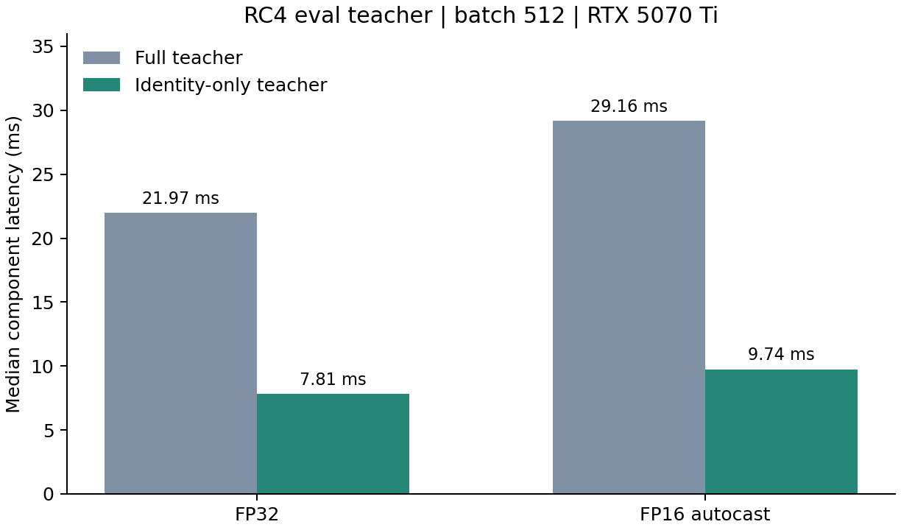
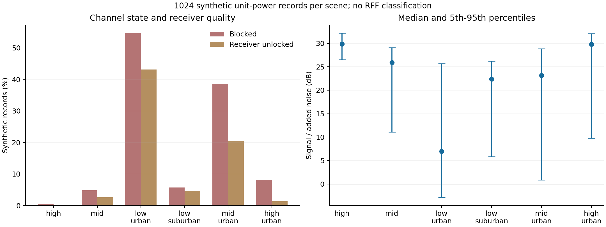

# 本轮测量与验证

所有新增测量均使用本机Windows、NumPy2.2.6、Torch2.10.0+cu128；GPU为RTX5070Ti。代码固定在`1d22591581d57cb3928e70475c7c7f930d7bbce9`后执行，之后仅根据测量将lazy RNG移出FAST默认路径。没有读取真实IQ、模型checkpoint或target。

## 1.RC4教师前向

随机初始化真实CVS模型，eval且冻结参数；B512×2×256模拟RC4 clean/weak拼接教师输入。每种模式预热5组、15次交替配对，CUDA同步后计墙钟。新旧tx_logits/z_id、模型参数/buffer及CPU/CUDA RNG精确一致。

|精度|完整教师中位ms|身份教师中位ms|局部加速|
|---|---:|---:|---:|
|FP32|21.967|7.805|2.814倍|
|FP16 autocast|29.156|9.736|2.995倍|

这是一个教师前向组件的速度，不含student反传、信道、数据加载、验证或checkpoint写入。当前测量中AMP绝对耗时高于FP32，不能据局部模式推断整体AMP应关闭；成对比较始终在同精度内进行。

若原训练中该教师前向占耗时比例f，仅这一项带来的理论总加速为`1 / (1 - f + f / s)`；本次没有量得真实训练f，所以不给新的E200小时数。已知历史整体43%至44%节省属于先前组合实现，不与本轮2.99倍相乘。

## 2.lazy RNG：拒绝默认启用的负结果

B128、长度256、每场景7次交替配对。REFERENCE为未开执行优化路径；previous FAST为9月20日已有组合；lazy FAST只增加命名RNG按需创建。四配置×六场景的IQ、完整元数据和状态均精确相等。性能通过与保真通过是两件事。

|路线|EQ|方法|lazy相对previous FAST倍数范围|结论|
|---|---|---|---:|---|
|full|False|zf|0.9710至1.0022|不默认启用|
|full|True|zf|0.9526至0.9721|不默认启用|
|full|True|mmse|0.9560至0.9744|不默认启用|
|residual|False|zf|0.9254至0.9642|不默认启用|

24个case中23个更慢。residual耗时增加约3.7%至8.1%，Mapping访问开销抵消少建一个Generator的收益。最终`FAST.lazy_rng=False`，新训练加速recipe不启用该项。独立开关和测试保留为可复现的实验对照；不能把它写成生产加速成果。

基准中的combined_vs_reference包含旧优化，不能当成本次增量。没有为追求正结果反复换样本或只报告一个正case。

## 3.六环境物理质量诊断

每场景1024条合成单位RMS复杂白噪声IQ，25Msps、256点，固定样本ID与预登记seed，residual/noeq。所有样本均保留，未按质量过滤。BLOCKED与lock来自模拟器；SNR为信号相对于新增噪声，不是真实ManySig总SNR。

|场景|BLOCKED%|失锁%|新增噪声SNR中位dB|5%至95%分位dB|SNR<10dB比例%|
|---|---:|---:|---:|---|---:|
|high|0.49|0.00|29.88|26.51至32.20|0.39|
|mid|4.79|2.64|25.93|11.10至29.10|4.79|
|low_urban|54.59|43.16|6.97|-2.83至25.66|55.57|
|low_suburban|5.66|4.59|22.39|5.85至26.21|7.23|
|mid_urban|38.57|20.51|23.17|0.85至28.82|36.82|
|high_urban|8.11|1.37|29.81|9.79至32.07|5.47|

low_urban有14.06%的样本新增噪声SNR低于0dB；这说明其压力分布包含明显低质量尾部，但不能推出14.06%样本必然不可识别，也不能据此删除样本或降低评估强度。与low_suburban相比，城市遮挡混合带来很大差别，单独增加困难采样不足以回答如何学习这段尾部。

这不是实测卫星信道、source V识别评估或target准确率。本轮尚未测真实source教师在各质量层的正确率和错误一致率，因此质量权重阈值仍未确定。

## 4.验证与重现

- 新lazy RNG测试35项：四配置×六场景、连续stream及全部命名流状态、pickle/deepcopy、spawn双进程、默认开关。另与既有29项remaining测试联合通过64项；最后连续均衡分支加强后35项通过。
- 新教师测试9项：默认关闭、EMA限定与旧模式兼容、训练模式拒绝、真实模型CPU/GPU FP32与FP16精确输出及state/RNG。
- 聚焦P0/P1审查发现benchmark最终写入可能覆盖碰撞文件，已改为独占open(x)并定点确认。后续教师增量审查无P0/P1。
- 新recipe通过现有source-only入口解析；只新增11个执行开关，未改变方法、数据角色、E200或source-only规则。
- 撤回lazy默认后的定点验证另见validation.json。以上不是N607整轮测试。

原始文件：[信道全部重复计时和质量统计](evidence/channel_benchmark.json)、[教师全部重复计时](evidence/teacher_benchmark.json)、[信道日志](evidence/channel_benchmark.log)、[教师日志](evidence/teacher_benchmark.log)。

在本分支使用ssr-gpu运行`experiments/adv3b02_xuc/tools/benchmark_urban_channel.py --output <新的JSON路径>`或`benchmark_rc4_teacher.py --output <新的JSON路径>`可重现组件基准。工具拒绝覆盖已有结果；第二项要求CUDA，只构造随机模型。
