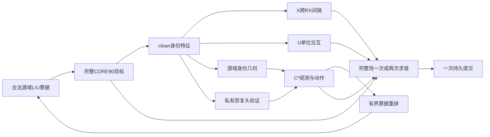

# X1＋Ux_normalized＋C2融合：再次审阅与详细验收

日期：2026-09-13。模型/数据/评估种子：392005。验收对象：上一轮15组设计及其引用的实际源代码。

**总验收结论：融合实现验收不通过，状态为`NOT_IMPLEMENTED`。现有模块的局部正确性检查通过，融合训练接线、C*控制器、课程事务与真实运行激活仍待实现和验证。**

这次核查发现，上一轮提交273f4edfa393eedabc1dc9fe18cdbf6b1bac11dd只有设计、矩阵、历史证据及设计验证脚本，共10个文件。原报告也明确写了`DESIGN_COMPLETE_NOT_IMPLEMENTED_NOT_LAUNCHED`。本次在本地工作区及该交付分支中未找到对应融合训练器、`reliable_both`控制实现或融合运行产物。因此，不能把这次验收表述为“已实现融合，经检查全部激活”。

本轮完成了源代码复核、45项CPU测试、真实M/lite_d模型的合成输入梯度检查、原Ux_normalized运行时接入检查和native配置工厂只读解析；修订了可以直接修正的设计约束。没有启动正式训练、加载checkpoint、读取训练数据/目标IQ或修改N607任务。这里的合成单步optimizer更新属于验收探针。

## 1.已确认的问题及处理

|编号/优先级|发现与影响|本轮处理|剩余状态|
|---|---|---|---|
|F01/P1|融合训练入口和共享目标事务不存在。无法确认X/U在完整CORE90场中执行，更无法确认EG两次都包含它们|核实分支文件、源代码和设计状态；拒绝以原模块测试替代系统验收|**未实现，融合验收不通过**|
|F02/P1|原课程只匹配物理ID、场景和applied mask，未约束原始epoch、warmup权重及epoch/batch依赖的holdout。重排可能改变样本受到的实际目标约束|ticket补入原始位置、确定性阶段权重、增强阶段与loss RNG；补齐启停边界；区分票据时钟与实时状态时钟|**规范已修订，执行与配对测试待完成**|
|F03/P1|M09/M10只有native标记与batch/步数覆盖。若直接套CORE90参考配置，`use_muse_ssdg=false`会丢掉原A1/FT/DAOT训练背景|新增由原X0/X1工厂解析的逐行native参考配置，矩阵明确引用；保留本轮FP32/scratch覆盖|**参数参照已补齐，实际parser/loader适配待完成**|
|F04/P1|250步审计、10步有效期、2/3次确认之间没有明确观测时钟。实现可能重复读一条证据就确认，也可能过期即清零而永不确认|补唯一observation_id、事件级连续确认、失效/过期区别、校准后确认及单证据单动作规则|**规范已修订，状态机测试待完成**|
|F05/P2|原正文要求M05被动审计，矩阵却没有显式字段；M14关闭动作后也可能被错误跳过观测|M05/M12/M13/M14显式设置相同审计策略，动作与课程分别控制|**规范已修订，RNG/模型状态隔离待证明**|
|F06/P2|把BN冻结列为当前模型的实际机制/载体变化不准确|按配方实际构建M/lite_d，查到0个BatchNorm、2个MixStyle模块；正文和矩阵改为BN=`N/A`|**已核实并修正表述**|

P1表示会影响交付正确性或科学归因；这里未把尚不存在的代码写成已发生的运行故障。F02—F05的“规范已修订”也不等于代码修复完成。15组、seed392005、CORE90基线、M12主候选及既定因子结构均保留。

验收证据：[探针汇总](probe_results.json)、[真实模型结果](kernel_probe.json)、[Ux运行时结果](runtime_probe.json)、[原native工厂解析](native_probe.json)、[修订后的设计](../adv3b02_xuc_fusion_design_s392005_20260913/report.md)。

## 2.三种方法能否合理融合

### 2.1X1与Ux_normalized：接入位置兼容，目标互补但没有无条件协同保证

X1在clean的有标签身份特征上使用单位向量余弦距离。正例为同TX、不同RX；负例为不同TX、相同RX/day/view。损失对每个anchor的全部合法triplet平均，再对合法anchor平均，权重0.05、margin0.2。当前实现不是随机抽一个triplet，也不额外要求正例同day。源码：[a1_ecrs_cross_rx.py](E:/type10-7/code/snapshots/a1_fast_v2_20260909_wt/code/cvsrffi/a1_ecrs_cross_rx.py)。

Ux_normalized先对每条接收记录的z_id归一化，再对同TX/RX的K条独立物理记录取均值，最后做TX×RX双重中心化，最小化交互残差的平方范数。顺序必须是“逐记录单位化→K均值→双重中心化”，不能先均值再单位化。损失权重0.01；近零范数时返回不可用，而不是用epsilon制造单位向量。源码：[tensor_ops.py](E:/type10-7/code/snapshots/core90_cross_response_v2_20260911_wt/code/cvsrffi/cross_response/tensor_ops.py)。

两者都可以复用同一个clean z_id：X约束跨RX判别间隔，U约束不能由TX主效应和RX主效应解释的交互。U允许残留纯RX主效应，X可以对这种残留施加额外压力；X满足triplet间隔也不保证交互最小，所以两者不是完全重复项。两者都直接作用身份骨干，不应额外训练响应预测头来代替身份特征变化。

**Ux名称中的U不是无标签集合U_s。**这个结构化交互损失使用有标签L_s中的TX×RX网格；无标签U_s仍按CORE90/A1原方法处理，不能为构造网格而读取U_s隐藏TX真值。4×4×2每块32条、每batch4块共128条这一正式接线仍待实现；本轮真实模型探针只验证了一个32条块的数学接入。

不存在“把两个loss相加就必然防塌缩”的结论。本轮特意构造所有身份向量完全相同的反例：U=0，X≈0.2，但加权X＋U的梯度范数只有5.49×10⁻¹⁸，数值上为0。保留完整TX分类及CORE90其他身份约束是必要的；还应同时看TX主效应能量、margin、类间角度及分类错误，而不能以U下降证明身份更好。这个反例说明目标的边界，不说明正式训练已经塌缩。

### 2.2C2：保留可用求解器，不能直接继承历史激活结论

原C2包由选择性博弈控制与能力课程组成，和后来GAME V2控制器、B8等路线应区分。历史C2有9800主步，记录CORRECT167次、head追赶0次、31次审计的恢复改善0次。恢复头monitor CE更坏后被截断得到的lag=0，不足以证明在线域头已经跟上；原课程直到E189才出现第一次实际困难场景切换。证据：[原C2/S4完整分析](E:/type10-7/automation_reports/CV-SincNet/core90_c2_s4_analysis_392005_20260911/report.md)。

因此，M04/M06/M07/M08/M11保留原C2语义可作为历史机制对照，但不应把它们当作“可靠恢复探针已经修复”的行。M12/M13的C*须独立验证恢复有效性，M12/M14的课程须匹配实际暴露及票据日程。这是对原控制思路的修订，不是原C2的逐位复现。

现有GameSolver具有可复用的事务基础：虚拟AdamW预测后恢复参数/动量，用校正梯度正式提交一次，并恢复应保留的一次前向buffer/RNG状态。本轮相关12项CPU测试通过。但求解器只知道closure及明确注册的stateful对象，不会自动发现未来XUC的teacher、prototype、伪标签缓存、sampler、角色轮换或controller。**solver测试通过不代表完整融合事务已经闭合。**源码：[solvers.py](E:/type10-7/code/snapshots/core90_game_20260911_wt/code/cvsrffi/game_tracking/solvers.py)。

### 2.3怎样才算有机融合实际发生

完整路径应当是：clean身份特征产生X/U梯度；源域身份几何反映这些更新；可靠恢复证据决定head/EG动作，几何状态决定有界课程顺序；EG的预测和校正两次都计算完整CORE90＋X＋U；所有在线状态只正式推进一次。

图中C*、新课程和完整场接线目前仍是设计。若C*一直没有可信动作，训练仍可以正常完成，但结果只能支持X/U及实际发生的课程路径，控制分支应标`CONTROL_NOT_ACTIVATED`。合成触发仅能证明分支可执行，不能代替真实训练激活。

## 3.逐模块验收表

|机制/模块|合理启用方式|当前证据|验收状态|
|---|---|---|---|
|CORE90原目标|所有实际有效loss和阶段权重保留；M00为普通载体|有原配方和目标实现；没有融合入口的逐项有效目标readback|**集成待验收**|
|X1 clean triplet|E1起、λ0.05、margin0.2，只用合法L_s clean|20项原测试通过；真实模型32/32合法anchor，身份梯度非零|**内核通过；正式融合未接入**|
|Ux_normalized|E1起、λ0.01、逐记录归一化，clean完整网格|5项数学测试通过；原runtime合成单步成功，response/decision关闭|**原模块通过；正式融合未接入**|
|网格/角色|同day/condition、独立物理K、balanced_partitions_v2|原V2角色与重放相关8项测试通过|**原组件通过；新共享索引/128batch待验收**|
|MixStyle角色mask|所有共同网格行都采用donor_only，保留原有TX/RX限制|角色测试覆盖query扰动不能进入donor混合；真实模型有2个MixStyle模块|**组件通过；正式触发率与mask待日志验证**|
|BatchNorm冻结|只对存在的BatchNorm执行|当前M/lite_d实际0个BatchNorm|**N/A，不能记激活**|
|响应预测头/decision分支|Ux_normalized中应关闭|原runtime两项false，λcross0.01，cross loss非零|**合理关闭，不属于缺模块**|
|C2历史恢复/控制|legacy行保留历史语义，独立标记可信度|旧结果有167次CORRECT，head0次，恢复改善0次|**历史有动作；不能算C*验证**|
|C*恢复有效性|私有副本、fit下降与配对monitor置信条件同时满足|仅规范，尚无对应控制实现|**未实现**|
|C*动作确认|唯一观测ID、年龄10步、2次事件确认、冷却与20%校正上限|本轮明确状态机语义|**未实现**|
|C*身份课程确认|校准后3次有效几何观测，独立于恢复头有效性|仅规范；早期分位数不构成成熟度保证|**未实现**|
|暴露匹配课程|完整不可变票据有界重排，包含原始目标日程|本轮补齐权重/位置时钟|**未实现**|
|完整耦合EG|两次完整CORE90＋X＋U，同IQ/RNG/伪标签，单次持久提交|基础solver12项相关测试通过；无完整融合closure|**基础通过；融合事务未验收**|
|scratch/EMA来源|各行从零；EMA只来自本次student；禁止旧权重继承|规范与参考参数满足；本次探针不加载权重|**正式argv/初始化日志待验收**|
|原A1桥接|M09/M10启用原MUSE/FT/DAOT背景和222步预算|已解析原工厂并补逐行参考配置|**参数参照通过；适配待实现**|
|truth-last评分|所有预测先固定，再独立连接truth，结果不回流|只有设计，无融合预测或评分产物|**未执行**|

`lambda_sat_cons=0`是当前CORE90配方的主动关闭，不是漏激活；卫星分类项仍按λ0.68、E80启用。X/U在空合法集合、不可用范数或已满足几何条件时也可能没有非零梯度，必须解释原因，不能要求每个batch都非零。

## 4.本轮实际运行的验证

环境：已验证ssr-gpu Python，PyTorch2.10.0+cu128；全部子进程设置`CUDA_VISIBLE_DEVICES=''`，使用CPU。每个snapshot在独立进程导入，防止三个同名`cvsrffi`包混用。完整命令及退出码见[probe_results.json](probe_results.json)，脚本见[acceptance_probe.py](acceptance_probe.py)。

|检查|结果|直接覆盖的行为|不覆盖的行为|
|---|---|---|---|
|X现有单元测试|20通过|literal triplet值/梯度、无合法集合、元数据、AMP内FP32、关闭分支的RNG/梯度边界|融合loader和完整训练|
|U归一化几何测试|5通过，13项其他机制未选|先单位化再均值、逐记录缩放不变性、近零不可用、有限梯度、低精度统计|新C*或响应分支|
|V2角色测试|8通过|角色循环、resume/ticket/index顺序、独立角色RNG、设备重编号、donor隔离|新暴露课程的跨epoch日程|
|GAME求解器相关测试|12通过，7项其他路径未选|双线性符号、非空AdamW动量的一次正式步、BN/dropout重放、非有限校正回滚、冻结头输入导数|完整CORE90＋X＋U闭包与全部外部状态|
|真实M/lite_d合成probe|通过|32×2×256输入、160维z_id、X/U直接梯度路径、CE＋X＋U单次AdamW更新|正式数据、完整4块batch、grid forward_context、EG、C*|
|原Ux_normalized runtime probe|通过|normalized开启、response/decision关闭、一个合成块、一次成功提交|真实M上的完整grid runtime或新融合训练器|
|native工厂只读解析|通过|原MUSE=true等实际选项与CORE90差异|launcher实际argv和运行预算|

45项pytest共0失败、0错误、0跳过；未选中的其他机制不计入通过数。JUnit原始结果：[X](x_unit_tests.xml)、[U数学](u_normalized_tests.xml)、[V2角色](u_roles_tests.xml)、[GAME求解器](game_solver_tests.xml)。

真实模型探针按6TX、15个RX×day域构建；本次合成块只有4TX×4RX×2条，固定同day。X原始loss=0.1965678，U原始loss=0.1016521；加权后对z_id的梯度范数分别为6.26683×10⁻⁴与1.14525×10⁻⁴。两项各自影响62个身份骨干参数张量，未直接影响dom_backbone或adv_head。CE＋X＋U的一次AdamW提交改变61个参数张量，梯度及更新后参数均有限。

该合成点X/U加权梯度余弦为0.00412，只说明这个输入上并未强烈同向或反向，不能据此声称训练全过程互补或无冲突。实际训练应按阶段统计其梯度量级、夹角和裁剪后贡献；λ0.05与λ0.01本身不能证明两项均有有效影响。本轮没有依据合成数值修改权重。

## 5.设计修订为何必要

### 5.1相同场景计数还不等于相同目标暴露

原配方包含compact从E8启用、open-world从E12启用、source episode从E20启用、soft mixup从E25启用、proxy从E45启用，以及多处25epoch warmup。实际目标中还使用epoch与batch_idx选择holdout类别。只在E41/E80/E91/E131切窗口，会跨越这些边界。参考：[CORE90参数](../adv3b02_xuc_fusion_design_s392005_20260913/core90_recipe_reference.json)、[legacy目标](E:/type10-7/code/snapshots/core90_game_20260911_wt/code/cvsrffi/game_tracking/legacy/objective.py)。

例如一张原E7票据与一张原E8票据调换，若按消费位置重新计算compact权重，原本不受该项约束的样本会受到约束，另一样本失去约束；样本/scene计数仍完全一致。即使没有跨启用点，warmup权重也会发生类似变化。

修订后，确定性的origin位置、目标阶段权重及增强日程随票据；学习率/EMA/控制时钟仍按基线实时执行推进。在线teacher与伪标签在消费时生成，EG两次共享同一结果。对照匹配的是票据多重集合及其确定性监督/增强日程，不是相同模型轨迹，也不承诺相同伪标签接纳数、实际梯度或目标误差。

### 5.2确认必须按观测事件计数

审计每250步发生一次，同一证据可被主循环读10次；如果每读一次就加确认计数，只需要一个观测就能完成“3次确认”。反过来，如果10步后自动清空确认序列，就很难积累相隔250步的观测。两种实现都可从原模糊文字导出，科学行为却不同。

修订约定同一个observation_id只计一次；过期使当前动作不可用，新观测失败才重置事件序列。几何阈值固定后才开始额外3次确认，每条观测最多授权一次head/EG动作。恢复有效性失败不会伪造低lag，也不会自动抹掉独立有效的身份几何。

早期q10/q90只提供相对参照：从随机模型采集的阈值未必对应足够分类能力，少量校准观测也可能不稳定。这属于待验证的研究假设。需报告实际阈值、分布、有效观测数及触发率，不能只看代码中存在阈值就宣称课程已经能识别成熟身份表示。本次不凭空增设绝对性能门槛或自动调参。

### 5.3原体系桥接不能只保留名称

原factory解析确认CORE90参考中`use_muse_ssdg=false`，A1 native中为true，还包含FT-RC4/DAOT等设置及X1运行时选项。M09/M10如果误用主配方，就不再回答“原X1训练背景中的X效应能否复现”。新增的[native参考](../adv3b02_xuc_fusion_design_s392005_20260913/a1_native_recipe_reference.json)逐行合并原factory与X0/X1差异，并覆盖本轮FP32、scratch等约束；不包含旧模型状态。

这仍不是可执行配置：三个体系需要共同物理角色索引适配，实际parser默认值和目标loader隔离须核实。M09/M10每epoch222步、其余13行49步的区别保留；相同E200不能写成相同计算量。

## 6.15组实验和结论闭合

本轮保持M00的ADV3B02 CORE90对比基线、M01—M08的X/U/原C2完整2³、M05/M13/M14/M12的动作×课程完整2²，以及M09/M10和M11桥接。全部模型/数据/评估seed392005，scratch，固定最终E200；名义主更新机会216200次、计划目标预测10080000条。这些是设计预算，目前实际融合训练与预测数量均无已执行证据。

主要归因关系保持：X用M02−M01等同载体差；U用M03−M01等同载体差；原C2作为控制＋课程包解释；新动作看M13−M05和M12−M14；新课程看M14−M05和M12−M13。M12−M08只能解释C*及课程修订的组合变化，不能把全部提升单归因于恢复学习率。

历史结果不能直接相加：X1−X0有小幅clean/LEO提升；Ux_normalized相对U0的clean提升伴随LEO均值下降；C2相对固定课程S4的clean提升也伴随LEO下降。三模块都开启并不自动证明它们兼容，更不证明正协同。详细历史计数及对照见[设计包历史证据](../adv3b02_xuc_fusion_design_s392005_20260913/historical_evidence.json)。本轮未重做历史全量日志分析，也未产生新目标评分。

15行设计、因子组合、seed、native引用、审计策略和票据字段已经纳入[设计验证脚本](../adv3b02_xuc_fusion_design_s392005_20260913/validate_design.py)。其`VERIFIED`仍严格限定为设计文件、规则及既有汇总算术；不扩大成训练或激活验收。

## 7.下一次实现后必须提供的直接验收证据

1. **入口与配方闭合。**15行resolved config/argv；所有必需的CORE90有效loss逐项读回；M00无X/U/C*时与基线同输入、同初始状态的一步loss、梯度和状态更新相符。共享L/U/V物理角色引用一致；不以相同seed代替实际索引。
2. **X/U真实接线。**记录合法anchor、有效网格、物理K唯一性、不可用原因、加权身份梯度和参数更新；关闭分支不生成额外状态或改变随机流。空集合或已满足约束的0梯度须与错误detach区分。
3. **完整事务。**普通步一次求值；EG两次均为全目标、同输入/随机数/伪标签；非空AdamW状态下仅一次正式提交。失败校正恢复参数、动量和注册的外部状态；EMA、prototype、sampler、角色、controller按约定只推进一次。保留GRL时不得再给编码器域梯度手动反号。
4. **C*状态机。**分别注入恢复变坏、可信高lag、可信方向失衡、过期、重复ID、校准缺失，核实普通/追赶/EG/课程行为、确认与预算。测试不引入target/truth。正式运行另报自然可信审计、实际head/EG次数及拒绝原因。
5. **课程与被动对照。**每窗口比较完整ticket多重集合、origin日程、实际applied访问；固定顺序还原基线；末窗口无漏消费/重复消费。M05的被动审计对主参数/optimizer/EMA/prototype/RNG/采样器均无副作用。
6. **真实运行闭合。**scratch来源记录、E1—E200完整日志、实际模块触发及训练资源；全部预测固定后独立评分，不按先出现的目标结果选行、调参或重跑。科学无收益或零次可信动作如实报告，不用技术失败替代。

这些是现有任务所需的正确性验证，不另设额外审批、重复数据验证或必须达到分数才能继续的门槛。本次完成的是再次审阅、规范纠错和可执行的局部验收，尚未完成的是融合训练系统的实现及真实激活验证。
