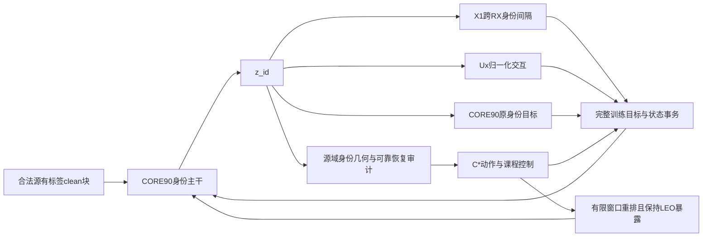

# ADV3B02-CORE90：X1、Ux_normalized与C2融合设计及15组实验

日期：2026-09-13。状态：**DESIGN_COMPLETE_NOT_IMPLEMENTED_NOT_LAUNCHED**。

本报告完成方法溯源、代码语义核对、历史指标重算、融合定义和15组实验设计。没有修改训练器、加载checkpoint、启动训练或干预N607任务。这里的“15组”指15个训练配置，每组固定模型seed392005，均训练E200；不是15个seed，也不是15套各自扩展的矩阵。用户所写“ADVB02 CORE90”按上下文统一为`ADV3B02_CORE90_SOFT_E200`的方法配置。

推荐主候选预先指定为**M12：XUC_INTEGRATED**：CORE90提供身份学习和LEO训练基础；X1约束同TX跨RX的判别间隔；Ux_normalized约束归一化身份特征的TX×RX交互；C2的控制思想改为由可靠源域证据驱动的优化动作与暴露量匹配课程。这个方案保留三条方法主线，同时明确修改C2已暴露出的观测与课程问题。它是待验证设计，不能提前称为性能提升。

本次融合对象是三条指定的改进模块/方向。FastTrust-RC4和DAOT保留在X0/X1原体系桥接对中，不偷偷加入CORE90主因子矩阵；否则“X效应”会重新混入无标签学习和教师差异。这一选择允许严格检验模块移植，但也意味着M12未必超过整个X1体系，必须实际报告与M10的系统表现差异。

## 1.证据范围与结论边界

溯源会话分别为：

- [X1会话](codex://threads/01a07ee8-1493-7ef0-aea4-9d20e690c211)：`X1_CROSS_RX_CLEAN`。
- [Ux会话](codex://threads/01a08c3c-bdb9-7ae3-b32d-f781c0b4654b)：第二版`Ux_normalized`，不是完整交叉响应预测器。
- [C2会话](codex://threads/01a08c23-a97c-7953-85d2-83fa4282ab65)：早期GAME矩阵的C2，即能力课程＋选择性双控制，不是后来V2矩阵的字母C，也不是B8。

本次直接读取会话本地记录、三个方法的源码/配置和已有完整日志分析；从既有scorer计数重算历史对照。并未重新读取N607全部原始预测与stdout。因此验证结论是“历史汇总和计数重算已核实”，不冒充又完成了一次远端全量日志审计。

主要证据：

|编号|原始材料|本次用途|
|---|---|---|
|E01|[当前项目协议](E:/type10-7/项目.md)|source-only、checkpoint来源、clean＋三LEO及truth-last边界|
|E02|[X系列预登记](E:/type10-7/automation_reports/CV-SincNet/a1_ecrs_cross_rx_s392005_20260909_r1/report.md)|X1配置、数据、初始化、训练体系|
|E03|[X系列机制审计](E:/type10-7/automation_reports/CV-SincNet/mechanism_activation_audit_20260910/report.md)|完整激活证据和X0/X1/X2匹配结果|
|E04|[X1实际损失](E:/type10-7/code/snapshots/a1_fast_v2_20260909_wt/code/cvsrffi/a1_ecrs_cross_rx.py)|合法triplet、余弦距离、归约和梯度|
|E05|[V2完整结果](E:/type10-7/automation_reports/CV-SincNet/core90_cross_response_v2_s392005_20260911_r1/completed_detail_20260912/completed_results.md)|8行E200、1600轮日志、评分计数与组织代价|
|E06|[V2代数实现](E:/type10-7/code/snapshots/core90_cross_response_v2_20260911_wt/code/cvsrffi/cross_response/tensor_ops.py)|逐样本归一化、双重中心化和零范数处理|
|E07|[V2采样实现](E:/type10-7/code/snapshots/core90_cross_response_v2_20260911_wt/code/cvsrffi/cross_response/sampler.py)、[实际接入](E:/type10-7/code/snapshots/core90_cross_response_v2_20260911_wt/code/cvsrffi/cross_response/integration.py)|同day完整块、角色轮换、MixStyle和BN行为|
|E08|[C2/S4完整分析](E:/type10-7/automation_reports/CV-SincNet/core90_c2_s4_analysis_392005_20260911/report.md)|1400轮汇总、探针失效、课程暴露及配对评分|
|E09|[C2原始配置与分析JSON](E:/type10-7/code/snapshots/core90_game_20260911_wt/docs/evidence/core90_c2_s4_full_analysis.json)|历史实际参数、167次EG、0次追赶、31次审计|
|E10|[GAME累计评分JSON](E:/type10-7/code/snapshots/core90_game_20260911_wt/docs/evidence/core90_target25_392005_20260911.json)|B0/B1/C1/C2/S4的同批次对照|
|E11|[C2求解器](E:/type10-7/code/snapshots/core90_game_20260911_wt/code/cvsrffi/game_tracking/solvers.py)、[运行入口](E:/type10-7/code/snapshots/core90_game_20260911_wt/code/cvsrffi/game_tracking/runtime.py)|预测/校正状态事务和完整目标接入位置|

全部重算数值见[historical_evidence.json](historical_evidence.json)和[历史对照CSV](historical_comparison.csv)，构建过程见[build_design_evidence.py](build_design_evidence.py)。

### 1.1首先纠正三处容易影响融合判断的混淆

**第一，X1的实验载体已经包含A1、FastTrust-RC4和DAOT。**X1−X0才隔离新增clean跨RX损失。把X1整体与另一条CORE90运行相比，差异还包含无标签学习、教师、学习率日程、batch预算和执行实现；不能全部计给跨RX。

**第二，V2的80.3697%clean来自198000条混合泛化记录。**其中30000条为“source RX＋未知day”，只有126000＋42000＝168000条属于未知RX。X系列和GAME表中的clean通常是后者口径。这里通过互斥分组的正确数/总数重算目标RX成绩，不用四舍五入的百分比反推计数。

**第三，三者历史seed392005不代表训练划分和信道实现相同。**C2的训练seed为392005，历史split seed及目标增强seed为392002；V2的data seed为392005，且其LEO生成路径与GAME未建立逐物理样本一致性。下面只解释各自体系内的差值，不做跨表绝对排名。

### 1.2历史证据支持什么

统一为每场景168000条目标RX记录后，指标单位为%，差值为百分点：

|体系|方法|clean|三LEO均值|可用的匹配解释|
|---|---|---:|---:|---|
|A1/X|X0|78.4696|68.1246|X1匹配控制|
|A1/X|X1|79.1327|68.5167|相对X0：clean＋0.6631、LEO＋0.3921|
|V2|U0|76.4964|62.3931|普通训练参考|
|V2|U1|74.9601|59.8258|网格/角色/执行载体，不加交互损失|
|V2|Ux_normalized|78.1827|61.6661|相对U1：＋3.2226、＋1.8403；相对U0：＋1.6863、−0.7270|
|GAME|B0|74.3643|61.8022|CORE90普通控制|
|GAME|C2|78.9952|62.3562|相对B0：＋4.6310、＋0.5540|
|GAME|S4|76.7119|63.7690|相同选择性控制、固定课程；C2相对它：＋2.2833、−1.4129|

这说明三者均有值得保留的局部证据，但不支持“各自所有指标都超过相同基线”或“收益可直接相加”。Ux_normalized相对原始Ux的目标RX clean/LEO分别提高2.2714/3.2726个百分点，但其相对U0的LEO仍回退。

已有模型都来自历史研究过程。用户本次正是依据已观察表现指定候选，因此未来复用这些目标RX做15组对比属于**历史接触基准上的冻结矩阵复测**。从零训练可以避免继承污染，但不能让这个基准重新成为从未接触过的盲确认集。全部结果一次性固定后报告预设对照，不根据target排序调参、换主候选或选择性补跑。

## 2.三个方法的准确数学含义

### 2.1X：相对判别约束，不是完整ECRS

对合法源有标签clean样本，令身份输出为`z_id`，逐样本单位向量为u，余弦距离为：

\[
u_i=z_i/\|z_i\|_2,\qquad d(i,j)=1-u_i^\top u_j.
\]

正例集合`P_i`：同TX、不同RX。负例集合`N_i`：不同TX、相同RX/day/view。原X1正例不要求相同day；不能擅自把它改成更窄的正例集合后仍宣称原式复现。

\[
L_X=\frac1{|A|}\sum_{i\in A}
\frac1{|P_i||N_i|}\sum_{p\in P_i,n\in N_i}
[d(i,p)-d(i,n)+0.2]_+.
\]

采用全部合法triplet、先按anchor归一、再对有效anchor平均。权重0.05，从E1启用。它不是batch-hard mining，也不是只拉近正例的中心损失。合法集合为空时断开该辅助项，不制造假梯度。X1仅消费clean，历史X2追加LEO没有继续改善，因此本次主矩阵保留clean-only，不因已有LEO前向就默认扩大X的语义。

X的优势是直接要求“同一TX跨RX仍比同RX的其他TX更近”。其局限是只要间隔满足，仍允许非零RX主效应和TX×RX交互；其梯度也可能与其他紧致、prototype、对抗目标重叠。X的历史非零loss和约127.916/128个有效anchor证明机会充分，不能单凭它们证明几何质量充分。

### 2.2U：归一化后的非加性交互约束

每个辅助块固定4TX×4RX×2条物理样本，共32条；一个128样本batch容纳4块。块内day与condition相同，K条记录不重复；不是同步多接收机事件，也不是部署K-shot。

先逐样本归一化，再在cell内平均：

\[
g_{tr}=\frac1K\sum_k\frac{z_{trk}}{\|z_{trk}\|_2}.
\]

不能交换“归一化”和“均值”的顺序，也不在cell均值后重新单位化。定义：

\[
\mu=\operatorname{mean}_{tr}g_{tr},\quad
a_t=\operatorname{mean}_{r}g_{tr}-\mu,\quad
b_r=\operatorname{mean}_{t}g_{tr}-\mu,
\]

\[
e_{tr}=g_{tr}-\mu-a_t-b_r,
\qquad L_U=\frac1{PQ}\sum_{tr}\|e_{tr}\|_2^2.
\]

新增权重0.01；按特征维平方和、cell平均、块平均计算。近零范数≤1e−8或不完整网格记不可用，不用伪单位向量补齐。原式回传到身份特征，不经响应头，不优化`z_dom`；只在有共享上游时可能间接影响共享参数。

它减少“某一TX遇到某一RX时独有的特征变化”。对于2×2块，就是压低`(g1A−g1B)−(g2A−g2B)`。它不直接要求RX主效应`b_r=0`。归一化防止仅靠缩小特征范数减小原始交互loss，但所有身份方向塌缩时U同样可为零。因此U必须与身份分类、间隔和类间几何共同解释。

### 2.3C：C2包含两个联动子系统

历史C2的基础更新是AdamW普通同步更新。它每250步审计一次，健康时可放宽到500步；用合法L_s的fit/monitor训练恢复头副本，测量可恢复domain信息和方向差异。

\[
G_{lag}=\max(CE_{online}-CE_{recovered},0)/H(D),
\]

\[
S_{domain}=\max(H(D)-CE_{recovered},0)/H(D).
\]

原生domain为5RX×3day＝15类，与纯5RX探针分开。高lag且可读出、身份状态允许时，计划最多3步在线域头追赶；低lag而恢复方向差异大时，计划完整EG校正；不新鲜/无效时普通更新。能力课程再根据身份、间隔、晴空一致性和低lag逐步提升LEO档位。

实际C2：9800次主更新、167次EG、0次head追赶、31次恢复审计全部未改善monitor CE。历史恢复头lr0.02、40步，`CE_online−CE_recovered`平均约−48.76，截断后`G_lag=0`。这个0只能解释为“未测出正滞后”，不能解释为“对手已跟上”。方向来自恢复失败的头时，也不能把方向差异当成可靠的有害博弈旋转。

课程level推进4次，但只有一次实际场景切换：前9251个batch仍是30%晴空，直到E189才进入60%低仰角/雨衰，E200没有进入80%三场景。E80—200困难LEO扰动访问为42201次，S4为409039次，比例约10.32%。因此C2较好的clean可能部分来自较轻训练暴露；这只是有机制依据的解释，不是已完成独立因果分解。

## 3.为什么可融合，又为什么不能直接叠加

同一个完整均衡块里，`g=μ+a+b+e`的主效应与交互在cell平均内积下正交。因此：

\[
\mathbb E_{tr}\|g_{tr}-\bar g_{t\cdot}\|^2
=\mathbb E_r\|b_r\|^2+\mathbb E_{tr}\|e_{tr}\|^2.
\]

这是块内等权代数关系，不是已经识别了物理TX/RX参数。它揭示互补方向：U直接约束交互部分；X相对不同身份要求跨RX变化不能侵蚀判别间隔，覆盖更广的身份几何。X不是上式方差损失，不能据此把它们视为严格正交目标；二者对e有重叠梯度。

|关系|互补机会|冲突/混淆风险|本设计的处理|
|---|---|---|---|
|X＋U|相对间隔保护＋非加性交互抑制|两者都压缩类内变化，可能损伤弱类或合谋塌缩|保持原权重，记录TX主效应、margin与交互，完整2³消融|
|X/U＋对抗|几何约束约束具体TX关系，对抗减少domain可读性|对抗与几何可能方向冲突；domain低准确率也可能只是头坏了|独立可靠恢复证据，记录梯度夹角，不新增未经归因的梯度投影|
|X/U＋C2课程|几何成熟度可为课程提供直接输入|几何进步会改变课程，单行差值混入增强暴露差异|原C2保留；新课程另作暴露量匹配2×2|
|X/U＋EG|校正整个身份学习场，可能缓解耦合不稳定|只对旧CORE90做预测步、只在最终步补X/U会跑错算法|两次场求值均含相同的CORE90＋X＋U目标|
|U组织＋任何方法|同day完整块使交互可计算、X负例更充分|采样、MixStyle角色mask、L前向BN状态共同变化|M00/M01为执行载体桥接，不将其差异单归因于采样|
|X1原训练体系＋CORE90|FastTrust/DAOT可能提供额外LEO背景能力|X1整体收益包含大量非X因素和不同更新预算|保留M09/M10这一对；主消融使用统一CORE90|

不引入响应预测、双线性预测器、身份响应联合门控、完整ECRS物理估计、DAOT额外视图、未知类注册或Phase3协同。三条指定方法的有效路径已经足够形成可证伪研究对象；扩展这些模块将使15组不能完成主要归因。

## 4.有机融合方案：共同几何、可靠动作、匹配暴露

### 4.1共同训练图

所有主矩阵行使用相同CORE90方法目标及单一模型结构：M/lite_d双分支，`z_id=160`；TX head沿既有身份预测路径，`z_dom`保留既有域分支。X/U作用于预测所用身份特征，不在新的旁路embedding上自我优化。

\[
L_{identity}=L_{CORE90,positive}+0.05\,I_XL_X+0.01\,I_UL_U.
\]

域对抗保留原符号和阶段权重。若为求解器显式构造博弈场，应只实现一次对编码器的负域梯度和对域头的正梯度，不能在保留GRL的同时再手动反号。不能把完整CORE90目标缩减成TX CE＋域CE后仍称同一基线；原prototype、open-world geometry、compact、proxy、Fishr、group CE、consistency、U和卫星CE等有效项全部进入同一个目标注册表。

X/U均复用已计算的clean身份特征；U按块计算，X按整个合法clean batch计算。复用P4Q4K2同day块、4块/batch、uniform候选选择及V2角色轮换。U原实现在L的拼接前向中临时冻结现存BatchNorm模块、使用donor_only MixStyle；M01—M08、M12—M14统一保留该策略。2026-09-13验收实际构建M/lite_d后确认BatchNorm模块数为0，因此BN冻结在当前模型记为`N/A`，不能作为已激活机制或实际载体差异。以后若架构包含BatchNorm，才检查各行冻结策略一致性。

M01的实际载体变化主要是网格采样和MixStyle角色mask；其相对M00的变化不能只称为采样效应。本轮15组未单独分解这两项；若载体严重退化，先如实报告，不用其他行掩盖。

### 4.2C*：将恢复失败与低滞后分开

新控制器记为C*，与原C2区分。来源是C2的“测量→动作→课程”思路，新增部分属于本报告的研究设计，并非历史已验证实现。

1. 继续在L_s内按采集组隔离fit/monitor，不读取U的TX真值，不从V拟合模型或持久状态。恢复使用在线adv_head副本、冻结特征、全新AdamW、40步；起始lr提议为0.002。该值是明确预登记的新设计值，不能称为已经证明合适。
2. 记录fit CE全过程及配对monitor的`CE_recovered−CE_online`。以采集组为重采样单位，固定500次bootstrap、seed392005；只有fit CE下降、monitor差值的95%上界≤0，且数值/标签覆盖均合法时，恢复结果才可用于判断lag和方向。相关窗口不能按独立样本bootstrap。这个区间只用于源域诊断控制，不是训练seed显著性。
3. 不通过时记`RECOVERY_UNRELIABLE/UNKNOWN`，不转换成lag＝0，不触发基于该恢复头的EG或head追赶。继续普通主更新。即使某行整个训练都没有可靠恢复，训练仍完成，科学结论为控制分支未获有效证据，不新增“必须激活才能训练”的门槛。
4. 保留lag的0.01/0.005滞回、readable_min0.1、方向差0.5/0.3、确认2次、250步冷却、新鲜度10步、每动作最多3次head追赶。审计固定250步，不再健康时自动变500步。额外校正比例上限20%。这些均在矩阵JSON明确，不由target结果选择。
5. 对新控制行及对应被动对照，审计过程使用独立RNG、私有副本和状态恢复；不改变主模型、BN、EMA、optimizer、prototype或U伪标签。M05作为新2×2基点也执行同样被动审计，保证“关闭动作/课程”不等于改变随机流。其成本单独列出。

验收修订：M05/M12/M13/M14均在矩阵显式声明`source_audit_policy=cstar_isolated_passive_or_active`，动作与课程另由独立布尔字段控制。M05的被动审计必须通过状态/RNG不变性验证，否则它也会污染原2³对照。不能因为`control=off`就跳过M05/M14所需的同源观测。

可靠恢复只证明这个有限预算probe可供诊断，不证明它已达到全局最优；方向不一致也只称方向不一致。修复后的探针、审计频率和控制语义作为C*整体评价，本轮不声称分别证明了每一项修复的性能贡献。

### 4.3让C*观察X/U真正关心的几何

在同day源有标签块上记录：单位特征交互能量`E_int`、TX主效应能量`E_TX`、RX主效应能量`E_RX`、X1的合法margin分布、TX分类能力、每类尾部角度，以及三种固定source LEO视图的一致性/CE。

课程可接受状态同时要求：身份能力、margin、TX主效应能量和LEO一致性不低于本行早期校准q10，交互能量不高于q90。校准固定step0/250/500，之后阈值冻结；3次新鲜观测确认。完整记录阈值和不可用情况，不从历史C2复制其已学习状态。以RX能量解释残留域效应，但不把压到零作为必达指标。

验收修订：确认按唯一且递增的`observation_id`计数，重复读取同一观测不增加次数。有效期10步只决定当前能否使用，过期本身不算一次新失败；新观测无效或条件失败才重置该条件的确认序列。几何确认从三个固定校准观测有效、阈值冻结之后开始，需再有3次合格观测；校准缺失或无效时记不可用，不以0补齐。每条观测最多授权一次head/EG动作；恢复头与身份几何分别维护有效性。该规则解决250步审计间隔与10步有效期的歧义，尚待控制器测试实现。

这样，U减小交互而TX主效应也消失时，不会被当作课程成熟；X loss下降但间隔尾部恶化时，也不会仅凭总loss下降推进。课程机制读取的是X/U引导后的身份状态，三者发生实际信息耦合。X/U权重本轮固定，不引入“自动权重”这个第四个未控制因素。

记录`cos(g_X,g_U)`及各自与TX/域对抗梯度的夹角，采用低频只读审计。负夹角属于冲突证据，不等于立即需要投影；本方案不加PCGrad，不用梯度投影悄悄改变指定方法。

### 4.4暴露量匹配能力课程

原C2的能力课程保留在M04/M06/M07/M08/M11。新融合行采用另一项明确设计：**能力改变一个有限窗口内的训练先后顺序，不取消CORE90规定的困难场景访问。**

每个窗口最长10个epoch，并至少在E8、E12、E20、E25、E41、E45、E80、E91、E131处切开。完整边界从实际配方的各目标/增强启停日程导出；不能只检查LEO和伪标签阶段。预先形成完整batch ticket：L/U物理索引、同day网格和角色、场景、实际applied mask、信道随机种子及与batch有关的随机输入。

验收修订：ticket还必须携带`origin_epoch/origin_batch_index/origin_main_step`、确定性的目标阶段权重、增强阶段及loss RNG输入。原始epoch/batch决定的warmup权重、holdout选择随ticket移动，不能按消费位置重算，从而避免相同物理样本/场景获得不同启用权重。optimizer学习率、EMA和控制器年龄按基线的单调执行时钟推进，不回退到ticket原位置。依赖在线模型的伪标签、阈值和prototype读取在消费时产生并冻结用于两次EG，不提前借用未来状态。固定顺序须还原基线日程；配对比较包含票据原始日程。参数轨迹、学习率与票据的配对关系以及模型驱动的自适应权重仍可不同，属于训练顺序作用，不宣称梯度或优化轨迹完全匹配。

窗口内所有对照的ticket多重集合完全相同。固定课程按canonical ticket顺序消费；能力课程依据当前可靠身份状态，从剩余ticket中选择：能力确认时选困难者，未确认时选较容易者。困难度使用合法L_s审计中的各场景相对clean TX CE增量乘ticket实际扰动比例，平手按ticket ID；该分数不接触target，也不使用U的隐藏TX真值。

窗口末尾无论能力是否达标，都按canonical顺序消费剩余ticket，记录`COVERAGE_DRIVEN_CONSUMPTION`，不能伪称“能力达标升级”。这是有界重排课程，**不是对原C2能力课程的严格复现**。它有意检验：在同样困难LEO暴露下，依据身份状态安排训练先后是否仍有效。

同一窗口内CORE90场景访问次数、实际applied mask、L/U样本多重集合和总主更新机会相同；跨窗口不欠账，不到E200再补训。模型参数轨迹、被接受的U伪标签和实际梯度仍会不同，这是课程作用的一部分，不宣称同样优化轨迹。所有行的常规V评估保持同一频率，V只读，不参与此训练调度。

M05/M13为固定ticket顺序，M14/M12为能力重排；构成课程与控制动作的完整2×2。若M12比原C2融合更好，但M12与M13几乎相同，则不能说课程调度产生了额外收益。

### 4.5完整EG必须包含新目标且只提交一次状态

一个主step先冻结ticket、已计算伪标签/门控、prototype读快照与随机状态。普通更新计算一次完整场；校正时：

1. 在原参数上计算`CORE90＋X＋U`完整场，执行隔离的AdamW临时预测步。
2. 使用相同IQ/增强、标签、MixStyle/Dropout随机输入，在预测参数处重新计算相同完整目标。X/U应重新计算，不复用旧梯度或detach掉。
3. 恢复原参数与optimizer状态，用校正场正式提交一次；临时BN、EMA、prototype、pseudo-memory、sampler/角色轮换和controller不得二次提交。

head追赶只更新adv_head，特征detach，不能把X/U梯度带进head-only子步。所有动作都有请求数、执行数、正式提交数和额外场求值数；损失调用数不能代替成功更新数。两次前向若仅第一次含X/U，或模型虽然回滚但AdamW动量/EMA未回滚，都属于直接算法错误。

推理图仍是单个received IQ→身份主干→原TX分类路径。没有target组块、target RX联训、跨query统计、投票或新预测头。训练期新增控制器不进入部署路径；推理参数/FLOPs预期不增加，但实际导出等价和延迟仍需实施后验证。

## 5.固定数据契约和训练预算

|项目|本次设计|
|---|---|
|模型/数据/目标增强seed|全部显式为392005；原历史C2的392002不沿用|
|数据|ManySig、equalized=1；复用V2已有source物理角色索引，所有入口消费同一索引和标签映射|
|source|RX1/3/4/6/8，day1/2/3，6个已知TX|
|L/U/V|6300/56700/27000；7%/63%/30%；V保持单一角色|
|target|RX0/2/5/7/9/10/11，day0/1/2/3|
|初始化|全部scratch；checkpoint/resume/外部teacher路径为空，EMA只来自本行学生|
|主训练|E200固定final；CORE90行为label130＋pseudo70，L128/U128、49主步/epoch|
|数值环境|统一FP32、AMP=false；AdamW、lr2e−4、weight_decay1e−4、clip5；原阶段权重/LR日程保留|
|X/U|λX=0.05、margin0.2；λU=0.01；均clean-only、E1启用|
|LEO|CORE90三阶段30%/60%/80%；λsat_cls0.68、E80计入，λsat_cons0；legacy C2行允许其已声明能力课程变化|
|目标评分|每行固定clean＋三LEO，每场景168000条，共672000条；15行共10080000条预测|

统一FP32是为减小求解器比较的AMP跳步差异，并显式区别历史V2的AMP=true。M03是指定Ux_normalized机制在统一环境下的复现，不是历史比特级复现。所有桥接行也重新绑定相同数据契约；“原方法桥接”保留方法结构和调度含义，不搬用历史校准值或权重。

M09/M10保留X0/X1的A1/FastTrust-RC4/DAOT训练体系：L128/U256、无标签loader驱动的222主步/epoch，E200约44400主更新机会。其余13行每行9800机会，全矩阵名义216200次主更新机会。额外EG/head步另算；以实际batch count核对，不能静默裁剪为49步还称原体系复现。

因此M09/M10与主矩阵**不是等计算预算比较**；它们回答“原体系中的X效应能否重现”，并帮助发现移植丢失背景依赖。主效应来自M02−M01、M03−M01等同载体对照。全矩阵不得把“同E200”写成“同计算量/同数据访问量”。

CORE90完整参考参数见[core90_recipe_reference.json](core90_recipe_reference.json)，C2历史实际机制参数见[c2_legacy_reference.json](c2_legacy_reference.json)。验收补充[a1_native_recipe_reference.json](a1_native_recipe_reference.json)，由X0/X1原工厂逐行合并选项并覆盖本轮FP32/scratch约束；M09/M10显式引用，避免误继承CORE90的`use_muse_ssdg=false`。这些均是实现参照，不是直接可运行launcher配置；native的实际parser默认值、共享角色索引注入和目标loader隔离仍需适配验收。原配方中的历史`joint_safe`选模和目标周期评估不恢复；训练过程不构建/读取target loader，固定E200独立预测后再评分。

只更改方法、seed语义显式化或报告不要求重复验证已匹配数据资产。实施时必须让所有native adapter实际使用相同物理角色索引；如果实际索引不同，先解决契约差异，不能以“同seed/同样本数”代替。数据文件路径、capsule或索引句柄等运行输入在启动登记时绑定，不在本设计凭空生成。

## 6.15组实验矩阵

机器可读定义：[matrix15.json](matrix15.json)；表格版：[matrix15.csv](matrix15.csv)。所有行seed392005、scratch、E200，M12在结果产生前确定为主候选。

|ID|实验|X|U|控制/课程|主要回答|
|---|---|:---:|:---:|---|---|
|M00|ADV3B02 CORE90|—|—|普通更新＋固定课程，标准载体|用户要求的CORE90基线|
|M01|CORE90共同网格载体|—|—|普通＋固定|组织/BN/MixStyle组合本身是否改变结果|
|M02|X|✓|—|普通＋固定|X1几何移植是否有效|
|M03|Ux_normalized|—|✓|普通＋固定|归一化交互在共同环境的效应|
|M04|C2|—|—|原C2控制＋原能力课程|原C2移植到共同载体的效应|
|M05|X＋U|✓|✓|普通＋固定|两种几何互补还是冲突|
|M06|X＋C2|✓|—|原C2控制＋原能力课程|X与C2交互|
|M07|U＋C2|—|✓|原C2控制＋原能力课程|U与C2交互|
|M08|X＋U＋原C2|✓|✓|原C2控制＋原能力课程|直接叠加是否足够；三因素交互|
|M09|A1/X0原体系桥接|—|—|FastTrust-RC4＋DAOT，原步数|X1历史训练背景控制|
|M10|A1/X1原体系桥接|✓|—|同M09|只与M09隔离X1原体系增量|
|M11|CORE90/C2原体系桥接|—|—|标准载体＋原C2控制/课程|C2在原组织方式与共同网格间的迁移|
|**M12**|**完整有机融合XUC**|✓|✓|**可靠C*动作＋暴露量匹配能力课程**|**预设主候选是否整体有效**|
|M13|融合，仅保留动作控制|✓|✓|可靠C*动作＋固定ticket课程|新课程的增量|
|M14|融合，仅保留能力课程|✓|✓|普通更新＋暴露量匹配能力课程|可靠动作控制的增量|

这里有两个完整归因结构：M01—M08组成X/U/原C2的2³；M05/M13/M14/M12组成“可靠动作×新能力课程”的2²。再用M00和三条原体系桥接解释训练背景。15行全部预定，未按source或target分数动态删行、替换或追加。

## 7.预设对照、协同定义与成败解释

记`Y(M)`为某一预先声明指标，所有公式分别在clean、三LEO均值、逐scene、RX floor、TX floor上计算，不能只挑最好的一项。

### 7.1原三模块因子分析

无C2时的X/U交互：

\[
I_{XU|C=0}=Y(M05)-Y(M02)-Y(M03)+Y(M01).
\]

有C2时：

\[
I_{XU|C=1}=Y(M08)-Y(M06)-Y(M07)+Y(M04).
\]

三阶交互：

\[
I_{XUC}=Y(M08)-Y(M06)-Y(M07)-Y(M05)
+Y(M02)+Y(M03)+Y(M04)-Y(M01).
\]

同时报告所有条件增量，例如X的`M02−M01、M05−M03、M06−M04、M08−M07`，而不把X1历史的0.3921pp当作固定可加常数。这里的C是“原控制＋原课程”包，不能再把其主效应解释成单独EG。

### 7.2有机融合相对直接叠加

四条主对照：`M12−M00`、`M12−M01`、`M12−M05`、`M12−M08`。它们依次回答：超过CORE90否、超过共同载体否、超出双几何否、改造C2是否比原样叠加更有价值。

新课程和动作的条件效应：

- 动作效应：固定课程下`M13−M05`，能力课程下`M12−M14`。
- 课程效应：普通更新下`M14−M05`，可靠动作下`M12−M13`。
- 动作/课程交互：`M12−M13−M14＋M05`。

M12−M08是C*可靠性修订＋几何读出＋课程语义变化的组合效应，不能进一步声称某个探针学习率修复单独造成提升。M11−M00、M04−M01分别描述C2在普通/共同载体中的包效应；两者的差反映载体依赖。M10−M09与M02−M01可对照X是否依赖A1背景，但因预算不同，只作跨体系异质性描述。

### 7.3指标及预先声明的解释规则

主性能指标为7个target RX的三LEO均值；clean是共同报告的关键指标。必须输出每个scene的Accuracy、Macro-F1、每RX、每TX、每day、RX×TX、RX×day×scene、最弱RX与最弱TX，并保留混淆矩阵、正确/错误计数。registered样本拒绝或defer按错误，不用接受子集准确率。

更准确地定义floor：

- `LEO_RX_mean_floor=min_r mean_s Acc(r,s)`。
- `LEO_scene_RX_floor=min_{r,s} Acc(r,s)`。
- `LEO_TX_mean_floor=min_t mean_s Acc(t,s)`。

它们不相互替代；平均值改善而极弱RX恶化，要明确报告。泛化分层固定为“目标RX＋已见day1—3”和“目标RX＋未知day0”。30000条source RX/date泛化记录可作为独立附表，不能混进主目标RX均值。

本次不虚构必达的绝对准确率。**融合成功的严格描述性条件**预先定义为：M12相对M00、M01的LEO均值均为正增量，clean不下降，三项上述floor不下降；相对M05和M08也有LEO正增量。若只clean提高则记clean优先取舍，不能称综合鲁棒性提高；如果均值升而floor降则记平均收益/尾部损失。很小的正数仍只能称单seed观察，不能当稳定性证据。

“有机结合产生额外价值”还要求M12−M08或新动作/课程对照支持对应改造，并有真实机制激活。只有三模块都启用、或M12比M00更好，都不足以单独证明正协同。C*若没有任何可信动作，报告`CONTROL_NOT_ACTIVATED`；不将这一情况当作技术失败停止，也不声称动作控制已验证。

另设更强的“可替代三条现有方法”描述：同时报告M12与M03、M10、M11的clean/LEO/floor/成本。如果它虽超过CORE90，却低于X1原体系M10的LEO表现，只能称“CORE90上的模块融合有收益”，不能称“融合优于原有三方法”。M10预算较大，这一系统比较可以展示精度/成本取舍，但不能单独归因于某个损失。本轮不再额外加入FastTrust/DAOT的2×2，以免超出15组并破坏主要因子结构。

相关物理窗口按采集组/原始记录进行配对置信分析，四场景共享底层IQ的结果一起重采样。可报告固定模型下的样本不确定性，但没有多seed方差，不能宣称跨seed显著、总体最优或晋级默认。单seed392005的限制由用户指定，本轮不追加其他seed。

## 8.实施映射和直接验证要求

本轮已使用设计报告追踪方式，把指定方法与实际代码逐项对齐。下表的verified仅表示定义和映射核实；所有新训练接入仍为pending，不能混写成已实现。

|ID|要求及来源|实施位置/职责|状态|验证要求|
|---|---|---|---|---|
|T01|三个会话精确方法身份|本报告§1—2、E02—E11|verified|排除C2/V2字母C、完整ECRS/响应预测误认|
|T02|CORE90完整方法与合法初始化|完整recipe、统一索引适配|verified（设计）|不加载旧权重，目标loader训练期不可达|
|T03|X1原数学|`a1_ecrs_cross_rx.py`迁入融合模块|verified（映射）|与原loss的值/梯度一致，正负集合和归约一致|
|T04|Ux归一化顺序及块条件|`tensor_ops.py`、`sampler.py`|verified（映射）|scale invariance、双重中心化、无标签/缺cell负测|
|T05|C2原机制与实际参数|原300ff4a9配置、solver/controller/curriculum|verified（映射）|legacy行使用原语义，不混入后续V2默认值|
|T06|统一历史计数口径|本目录evidence及构建脚本|verified|目标RX互斥分组正确数重算；禁止跨体系排名|
|T07|15行/seed/主候选/对照|matrix15.json/csv|verified（设计）|唯一15行，2³和2²完整，全部392005|
|T08|source-only/目标评分/解释边界|本报告§5、7、9|verified（设计）|新权重与历史接触基准分别声明|
|T09|共享CORE90＋X＋U训练事务|计划新增`cvsrffi/xuc_fusion/objective.py`、`step_context.py`|pending|普通与EG均消费完整目标；状态只提交一次|
|T10|C*可靠证据与动作|计划新增`xuc_fusion/source_evidence.py`、`controller.py`|pending|恢复失败为UNKNOWN；可信时可达；关闭时零副作用|
|T11|暴露匹配能力课程|计划新增`xuc_fusion/ticket_curriculum.py`|pending|窗口ticket多重集、scene/applied/物理ID一致，阶段边界不越过|
|T12|15行运行入口/评分闭合|计划新增`train_core90_xuc.py`及matrix runner；复用独立scorer|pending|实际argv、索引、参数角色、成功更新与最终预测闭合|

追踪计数：verified=8（定义/设计/映射），pending=4（新实施），deferred=0、rejected=0、blocked=0。本设计是**保留X/U数学与C2思想的显式改造**，M08才是原三模块直接组合；M12不标成三个历史方法的严格原样复现。

实施时优先完成以下聚焦验证，而不是无边界测试：

1. 构造有RX主效应但无交互的合成单位几何、交互非零几何和完全塌缩几何，验证U的作用边界以及TX/margin诊断能识别塌缩。X与原实现逐值/逐梯度核对。
2. X=U=C=off时，融合入口恢复M01载体的目标/梯度/状态；普通载体时恢复M00。审计开关不能改变主随机流。验证空块、无合法triplet、U隐藏标签和V/target越权负例。
3. 真实M/lite_d上，X/U有有限非零身份梯度；无旁路头自我学习。EG预测和校正两次都包含X/U；AdamW、BN、EMA、prototype和采样角色只正式推进一次。
4. 对C*注入“恢复更坏、可信恢复且高lag、可信恢复且方向失衡、过期证据”，分别验证普通、追赶、EG和普通路径。零次自然激活是科学缺证据，不用合成触发替代正式激活。
5. 固定/能力课程的每个窗口比较ticket多重集合和scene实际applied访问计数；禁止仅比较配置概率。最后一次窗口完整消费，E80/E131边界明确。
6. 最终同一单样本在不同推理batch切分中输出一致，目标推理不需要RX标签/组块/真值；prediction固定后scorer统一连接truth。

这些是下一次实现与真实实验的直接正确性要求；本次设计文档不需要GPU smoke，也不因未启动而新建审批、receipt或签名链。

## 9.执行、成本与预期产物

本轮范围止于设计。未来实现顺序为共享数据/目标事务→原X/U移植及原C2适配→C*可靠诊断和课程→15行入口及聚焦验证→按最小流程Git固定、一次P0/P1审查和N607发布。一个run只设一个launch owner；每GPU最多两个训练实验进程，不干预健康任务。主候选和矩阵先固定，全部完成预测后统一评分，不根据先出来的target成绩裁剪矩阵。

2026-09-13再次验收：仍无融合训练器或C*运行产物。上述验收修订只补齐规范，未实现训练系统；原X/U与GAME solver局部测试通过不能替代融合验收。完整结果见[再次验收报告](../adv3b02_xuc_acceptance_s392005_20260913/report.md)。

学习预算固定E200；计算预算分别报告主更新、完整场求值、head步、probe-fit步、成功/跳步、数据访问、墙钟、GPU时间、峰值allocated/reserved。13行的9800步基数可直接计算，M09/M10明确为44400步。不能用历史共卡墙钟保证新矩阵完成时间；真实N607环境与共享负载未预检，本报告不报虚假ETA。

原记录中Ux_normalized约4.30小时、C2约7.47小时，这些来自不同实现、AMP状态及共卡条件，仅用于理解历史成本，不乘15当本次预算。EG校正最多20%只限制额外场求值机会；head/probe成本另列，不混算成“总开销≤20%”。

预期每行产物：effective config和source角色引用、scratch初始化记录、E1—E200完整epoch日志、机制动作/几何/课程事件、资源数据、final checkpoint、无truth预测、独立score及逐组计数。任何一项已执行与否均有明确状态；只看非零配置、loss或checkpoint存在不算机制验证或评分完成。

技术停止仅限所属run的协议越界、错误数据/版本/输出、确定无法训练或生成合法预测、不可恢复数值失败等直接正确性问题；保留失败产物。低性能、U无收益、恢复头不可信、课程不产生性能改善等均是应报告的科学结果，不据此停健康训练或自动改参重跑。

本目录交付：完整设计、15行JSON/CSV、CORE90参考参数、C2历史参数参照、历史计数重算JSON/CSV及构建脚本。文件验证只检查UTF-8、引用、数学/计数、矩阵行数、seed和配置自洽。新训练算法和N607实验均尚未实施。
