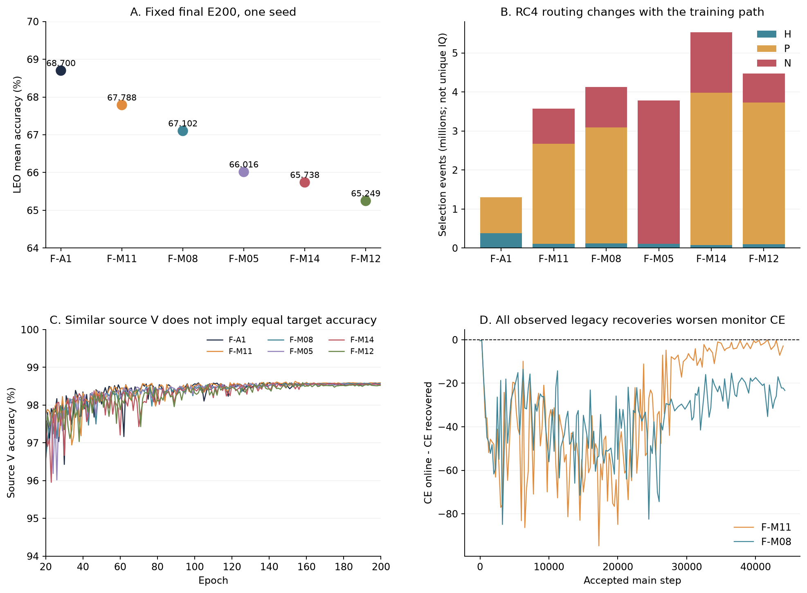

# ADV3B02 CORE90、DAOT+FastTrust与动力博弈融合：实现、实验与失配机制全量审计

日期：2026-09-14。范围：用户指定的三条研究对话及其关联发布、配置、完整日志、固定预测评分。本文是既有研究结果的解释与归档，不是新实验设计获批、不包含新训练或目标集驱动的重跑。

## 0.先给出可以站得住的结论

**目前没有证据证明“DAOT+FastTrust与有效的完整Extragradient天然不能配合”。现有负结果主要检验了不同的组合：原生有效损失/全扩展DAOT+RC4、X/Ux特征约束、C2或C*控制器、不同采样与课程。它们没有构成固定同一基座、只切换原生DAOT+RC4和完整EG的2×2实验。**

这不是文字上的区分。完整EG每步评估整个耦合目标的两次梯度；C2根据旧式恢复探针和方向指标偶尔触发修正，还改变卫星课程；C*增加恢复可靠性条件，但本轮可靠性从未通过，修正动作始终为0。把它们统称为“动力博弈收益”，再期待收益直接相加，会把实际未检验的组合当成已经失败。

已完成的FULL融合6行中，F-A1的LEO均值68.7000%最高；最接近它的F-M11为67.7877%，差−0.9123个百分点。F-M08为67.1022%，低于F-A1，但比同样全扩展DR+X+Ux、关闭C2的F-M05高1.0865个百分点。因此“加入C2总会恶化”同样不符合数据。

可信度最高的解释有四层：①首轮DR7确实改变了原生机制的更新预算及U分支GRL；②FULL修复这些问题的同时又增加了多个原生胜出版本未启用的损失/路由，缺少全扩展DR单独对照；③控制器的恢复证据和实际优化目标不匹配；④新增约束改变了同一个身份表示、教师轨迹、梯度尺度和RC4样本路由。第④层有直接运行证据，但尚不能把每个分量定量归因为多少个百分点。

图：A为单seed固定E200结果；B为选择事件累计，不能当作唯一IQ或保证互不重叠的样本数；C只放大E20后的source V区间；D是完整已记录审计，零线以下表示恢复CE更差。原始数据与SVG均随包提供。

### 0.1阅读路径与交付结构

- 第1—3节：数据协议、历史基线与CORE90逐项实现。
- 第4节：DAOT与FastTrust实际有效版本，区分配置、执行与梯度。
- 第5节：GAME V1/V2、完整EG及高学习率全部方法版本。
- 第6—7节：INITIAL15、DR7、FULL9逐行组合与详细结果。
- 第8—10节：不能协同的证据链、竞争解释和可识别性边界。
- 第11—13节：覆盖、复核、完整表格和源文件导航。
- [113条已评分行记录](tables/all_scored_row_records.csv)、[31条融合覆盖记录](tables/xuc_31_coverage.csv)、[全部FULL配置字段](tables/full_config_all_keys.csv)、[逐轮机制统计](tables/full_epoch_mechanics.csv)、[完整探针表](tables/full_gradient_probes.csv)、[控制审计表](tables/full_audits.csv)、[代码与文件来源清单](source_manifest.csv)。

113条是跨报告的评分行记录，不是113个独立方法或113次独立训练；有同一物理模型在不同对照体系中复用。失败、未完成、替代项另列，绝不从实验覆盖中删除。

## 1.研究对象、数据权限和指标口径

### 1.1当前共同物理契约

|项|当前source-only主线|
|---|---|
|数据|ManySig.pkl；equalized=1；IQ序列长度256|
|注册TX|6类，实际ID0—5；不是参考参数文件残留的16类|
|源接收机|RX=[1,3,4,6,8]|
|源日期索引|[1,2,3]；物理日期03_08、03_15、03_23；不要和索引[0,1,2]混淆|
|源L/U/V|6300/56700/27000；比例0.07/0.63/0.30|
|U的权限|来自源接收机的隐藏标签样本，不是目标域无标签适配数据|
|V的权限|单一只读源验证集；RC4可校准阈值，不向网络反传；内部交叉拟合不构造新的永久数据角色|
|目标RX|[0,2,5,7,9,10,11]，与源RX不交|
|目标day|[0,1,2,3]；包含源日期，但接收机仍未见|
|目标规模|每场景168000；每RX24000、每TX28000、每day42000|
|目标场景|clean、leo_clear_weak、leo_low_elev_weak、leo_rain_weak|
|每模型决策|4×168000=672000；来自168000条物理IQ的四场景视图，不是672000个独立物理样本|
|评分|预测先固定，再由独立scorer接truth；本次仅分析/重计已有固定预测，不启动适配、训练或新推理|

这里报告的是Phase1已注册6类分类泛化，不是Stage2开放集支持/查询适配能力，也不是对未知类拒识性能的证据。源码中有proxy-unknown等训练几何项，不等于本次目标测试真的包含未知类。

GAME V2/高LR扫描使用训练seed392005/392006/392007，但split/evaluation契约seed392002；XUC的模型、数据、评测seed均392005。物理角色成员、LEO变换随机流、训练入口均需一起匹配；只看“seed392005、E200、CORE90”不能建立严格因果比较。所有既有target均已进入探索分析，不再是未接触的新盲确认集。

### 1.2统计定义

LEO均值是三个LEO场景accuracy的等权平均。accuracy使用百分数，差值用百分点pp；Macro-F1先在每场景按6TX等权计算，再按场景平均。跨seed用样本标准差，分母n−1；只有一个seed的行不报告伪造的标准差或显著性。

“最弱RX”必须区分先在三个场景求该RX均值后取最小，与在RX×场景所有格中取最小；两个指标在原附件中并存，不能互换。TX同理。混淆矩阵、逐RX/day/TX表保留原列名与原单位；例如XUC的`rx_day_tx_metrics.csv`中accuracy是比例，而scene表是百分数。本文的自动表统一展示百分数，原始附件不静默改单位。

### 1.3checkpoint边界

历史`ADV3B02_CORE90_SOFT_E200/best_joint_safe_ssdg.pth`是旧训练和joint_safe选模产物。其旧target接触与训练角色继承不符合当前从零训练契约，不能作为干净A1/FULL初始化。早期两行继承A1仍在覆盖表保留，标记污染边界，不纳入干净晋级结论。

该历史标识对应seed392002、名义E200、AdamW lr=.0002/wd=.0001、z_id160、core90/accept85/alpha30，best记录在E194。这里的best不是当前各scratch行固定final E200，不能用“都叫E200”掩盖选模差异。旧checkpoint元信息和FCR/U0等后续复现配置在BASELINE附件分别保存，当前FULL实际配置另列。

本轮FULL的初始化记录为scratch_only=true、checkpoint_sources=[]。启用anchor的全扩展行冻结的是**本run完成E20后的EMA**，在E21前建立；完整记录写明6300/56700/27000角色、external_checkpoint_sources=[]、target_contact=false、source_V_used_for_training=false。这与加载旧“成熟基座”不同。

## 2.原ADV3B02 CORE90到底是什么

CORE90不是单独的优化器，也不是一个固定checkpoint名称就能唯一确定的数学模型。它是一套模型结构、源域分类/解耦/几何约束、卫星增强课程、伪标签阶段和优化配置的组合。名称中的core90/accept85对应几何分位等设置；不能理解为训练只使用90%样本，也不能从名称推出90%准确率。

### 2.1网络与对抗关系

M/lite_d模型有身份分支`z_id`和域分支`z_dom`，本主线维度均160；身份分类头预测6TX，域任务区分源RX×day的15域。身份特征经过GRL送入对抗域头，使域头降低域CE、身份编码器反向提高该CE。域分支自己的域CE则正常最小化。模型关闭DAC与相应stats开关，域增强使用rcn_stats及其配置系数；MixStyle仍在身份、域骨干上。

可用下面的参数分组理解，不把所有项错误写成一个普通同向最小化：

\[
g_{id}=\nabla_{\theta_{id}}(L_{TX}+L_{geometry}+L_{sat}+L_U)-\lambda_{adv}(e)\nabla_{\theta_{id}}L_{adv},\qquad
g_{adv}=\lambda_{adv}(e)\nabla_{\phi}L_{adv}.
\]

GRL只改变传入编码器的导数符号/尺度，不改变前向CE数值。域头、分类头、域骨干和共享参数以各自实际计算图为准。F-M11实际参数数1,130,809；GAME普通结构记录1,049,827。新增辅助头会改变参数空间和初始化随机数消费，不能默认所有组合拥有同一随机初始张量。

### 2.2有标签完整目标

以下为本次冻结CORE90承载代码中的主要系数；带起始轮的项还受实际warmup或调度系数影响，不能把静态lambda当成每步有效权重。全部字段、默认残留和覆盖值见配置附录。

|项|系数/起点|实现含义与注意事项|
|---|---|---|
|TX交叉熵|1；label_smoothing=.01|6类身份监督|
|domain CE|1|域分支正常预测15域|
|adversarial CE|lambda_adv=.35，另有阶段调度|身份支路GRL；对抗头正常学习|
|orth|.05|身份/域分量去相关约束|
|cons|.08|CORE90原一致性项；不能等同于DAOT多视图蒸馏|
|group CE|.16；top_frac=.35；min_domains=4|强调源域困难分组|
|Fishr代理|.04；min_domains=4|函数为logit-gradient方差代理；不是对所有网络参数逐样本求导的完整Fishr|
|prototype memory|.0032；momentum=.95；margin=.15|domain_align=.1、push=.1、min_count=2；历史代码的可微性曾改变|
|open-world feature|.0024；E12起、25轮warmup|radius12°、inter55°、sample_margin5°；robust_3sigma尾部、CVaR=.95、vacuum等|
|z_id compact|.032；E8起、25轮warmup|supcon=.3、radius=.35、CVaR=.35、radius40°|
|proxy unknown|.0045；E45起、25轮warmup|holdout1、virtual48；core=.90、accept=.85、tail=.92、overflow=.97等|
|soft unknown mixup|.0045；E25起、25轮warmup|count24、order3、alpha=.5；是源样本构造，不读取目标truth|
|source episode|.0035；E20起、25轮warmup|min_domains2、radius33°、mixup=.75|
|卫星分类CE|.68；E80起|增强样本仍用合法源TX标签；sat consistency系数0|

`use_feature_masks=true`等结构参数不等于相应损失有效：多项mask、TX/RX额外原型lambda实际为0。参考recipe中`paic_guard_enabled=true`，XUC的`resolve_args`明确覆盖为false；应以resolved_config和调用链为准。参考recipe被标为`reference_arguments_not_executable_config`，不可直接当成实际发布命令。

### 2.3采样、课程和普通U阶段

普通CORE90以L为epoch基准：batch128，每轮49次主更新，E200共9800次。MixStyle配置p=.18、alpha=.1、strength=.7，按same_tx_crossdomain规则与fallback skip运行，late阶段E110起40轮衰减，最低p=.05、strength=.32；启用位置由实际模型模块决定。

固定卫星课程的名义阶段是E1起clear比例.30；E41起low/rain比例.60；E91起三场景比例.80。E80前卫星CE未激活，故“生成了卫星view”“selected_mask为真”“卫星分类有效反传”是三个不同层次。C2会改写课程状态；ticket版本限制总票据与曝光，但仍可能改变先后顺序。

普通U分类阶段E131—200才启用：lambda_u=.16、entropy=.01；rx_day_quantile=.86、阈值clamp[.92,.97]，temporal_window2/min_conf=.8、强视图一致性、EMA=.999。F-A1和DR系列用RC4替代这条普通U目标，不能简单说“CORE90的U CE再加RC4”而不检查`self.dr is None`条件。

### 2.4历史同名基线并非一条可互换的零点

|基线|clean%|clear%|low%|rain%|LEO均值%|
|---|---:|---:|---:|---:|---:|
|FCR_ADV3B02|76.2268|61.3679|59.5875|59.4637|60.1397|
|GAME V1 B0|74.3643|62.9375|61.3351|61.1339|61.8022|
|CROSS U0，统一168000口径|74.7321|60.1482|58.3518|58.7274|59.0758|
|XUC M00|78.4619|详见完整表|详见完整表|详见完整表|62.5048|

FCR/U0的proxy radius、source episode radius、prototype memory可微性和AMP实现不同；GAME B0为FP32，U按窗口跨epoch轮转；更早B0的两个seed还存在U前缀反复消费的历史实现。U0曾用198000总体，混入30000条已见RX/未见日期后，clean从统一口径74.7321%抬到77.3005%，不能把总体构成收益误认成模型收益。

历史FCR/U0/H0的9800次尝试分别有11/10/10次非有限梯度保护跳过；三个B0接受全部9800步。这些记录保留，但约0.1%跳步不能直接换算成泛化损失。LEO评测子流也未全部匹配。完整历史差异、源评分和未完成H0等状态见[扩展基线审计](sources/BASELINE/expanded_report.md)。其历史状态不是本次实时刷新结果。

## 3.两个机制并不作用于互不相交的训练部分

DAOT定义“同一信号不同信道视图应该怎样映射”，FastTrust定义“哪些U信号能获得何种监督与权重”，博弈算法定义“在耦合目标下怎样求下一步”。概念层次不同，但最终共同作用于身份编码器、分类头、对抗头、EMA和下一轮路由。

令D为DAOT/RC4增量，B为原CORE90耦合场。即使用理想SGD形式完整EG，更新近似为：

\[
\widetilde\theta=\theta-\eta(B+D)(\theta),\quad
\theta^+=\theta-\eta(B+D)(\widetilde\theta).
\]

展开后包含`J_B D`与`J_D B`等交叉项；它不是“先获得B的收益，再加D的收益”。实际AdamW还有矩估计、裁剪、EMA、离散选择、阶段调度，因此更不能期待accuracy相加。这里是解释耦合结构的局部推导，不是本模型的收敛证明。

GRL域对抗的基础形式可参照[Ganin等人的原论文](https://jmlr.org/papers/volume17/15-239/15-239.pdf)；其经典目标域无标签适配场景与本项目源U泛化契约不同。EMA教师的反馈机制可参照[Mean Teacher原论文](https://papers.nips.cc/paper/6719-mean-teachers-are-better-role-models-weight-averaged-consistency-targets-improve-semi-supervised-deep-learning-results.pdf)。这些文献说明机制，不替代项目中的实际激活证据。

## 4.DAOT+FastTrust：从原生有效版本到全扩展版本

### 4.1DAOT的可执行数学对象

teacher是同run EMA。对同一源IQ生成多视图，取单位身份特征`u_v`。mean版本作均值聚合；robust_deployment版本先构造`b_v=.15+.85×reliability_v×importance_v`，计算初始球面中心及角残差，用残差中位数形成Huber型权重，Huber下限.30，最终再归一化加权特征得到球面目标。

主要损失为：①feature：按recoverability加权的`1−cos(z_student,z_teacher)`；②logit：按教师共识加权的`T² KL(p_teacher/T || p_student/T)`，T=3；③prototype：比较学生、教师对源L类原型的余弦相似度分布，再做蒸馏；④relation：指定样本对的学生/教师余弦关系MSE。teacher、原型快照不在同一步反传。

全扩展还加入：tangent对指定信道扰动方向的角敏感度施加预算；nuisance利用预测均值/方差拟合信道元信息；fingerprint对预定义指纹扰动保留最低敏感度。前者抑制不想要的变化，后者尝试保留身份敏感性，但其hinge可为0，不应只看lambda宣布成功。

损失归一化是`EMA(|raw_loss|)`，momentum=.95，再用raw_loss除以尺度；它**不是梯度范数均衡**。小原始损失经过很小的尺度除数后仍可能产生很大的梯度；不同分量lambda在这里不能按原数值直接比较强弱。

DAOT阶段：E1—20关闭orbit；E21—60线性升至1；E61—140保持orbit并升tangent；E141—200升tail。代码可延长总轮数，但历史E400/E600版本的标签期、LR、target探测策略等也要逐行读取，不可视作简单同一E200实验。

### 4.2FastTrust-RC4不是只筛“高置信伪标签”

RC4综合模型输出与只读V校准，形成hard H、partial P、negative N等分支。H可以使用完整伪标签CE；P使用候选集合概率质量及集合内条件约束；N只排除被判定不可能的类别，不能当成新的unknown真标签。`p_set_safe`描述集合安全性的路由依据，不是target真值准确率，也不是所有被选样本都一定正确。

全扩展的主要预算/阈值：H/P/N独立有效预算各.1；H精度目标.98、P覆盖目标.95/P精度.98、N错误排除目标.01。`rc4_total_identity_effective_budget=0`关闭另一套仅支持H/P的总预算模式，不等于关闭所有身份监督。系数H=.6、P=.4、N=.2、domain=.16、self=.1、satellite=.1、anchor=.05；partial条件尾段final=.2。

V校准发生在E1/21/41/91/161，每次27000。这些校准日志确认读了合法V，但没有保存足够的逐样本安全集合全过程来单独归因“为何F-M05的P完全空”；对此不能凭直觉认定阈值坏了。

### 4.3三个不能混称“完整DAOT+FastTrust”的版本

|项|原生A1有效损失/F-A1|DR7第一次移植|FULL扩展七行|
|---|---|---|---|
|teacher|two_view、mean|原生有效集合|three_view、robust_deployment|
|orbit z/logit|.5/.2，执行|执行|执行|
|prototype|参数可残留.2，但prototype_matrix=None，不产生此项梯度|同样未提供有效原型矩阵|源L六类原型快照，执行|
|relation|关闭|关闭|.05，执行|
|tangent/nuisance/fingerprint|0/关闭|0/关闭|.05/.1/.1；需再看实际非零梯度|
|RC4 H/P|开启|开启|开启，但是否选到样本取决于路由|
|N/anchor/U卫星hard|关闭|关闭|开启|
|U分支GRL|0|误为1|修正为0|
|epoch基准|U：222主步|L：49主步|U：222主步|
|E200主步|44400|9800|44400|
|U曝光|11340000|2502992|11340000|
|DAOT执行主步|39960|8820|39960|

原生有效版本已经取得正收益，并不意味着尚未启用的全部可选分支也已验证有效。把这些分支一次全部打开，同时加入C2/X/Ux，实际改变了研究对象。

### 4.4原生探索全部版本的解释

下列简表解释家族和比较意义，所有33条完成行的四场景精确数据在第13节自动表；60条含失败/替代覆盖在附件。

|家族/行|实际研究变化|关键读法|
|---|---|---|
|F0_FIXED_BASE/F1_RUNTIME/F2_WARM_EMA/F3_COVERAGE_KL|固定有效基线、运行路径、EMA启动、覆盖加权|LEO约68.1175/67.8954/68.0859/67.2577；计算优化不自动成为性能优化|
|X0—X7|cross-RX clean/view、EMA/覆盖、平衡/限幅及组合|X1对X0约+.3921pp；X7组合64.0986%，明显低于X0的68.1246%|
|B0_FIXED/B1_TAIL_LR/B2_RC4_WEIGHT|固定基线、尾部LR、RC4可靠性权重|67.8315/68.4974/67.8837；不同调度不可省略|
|D0_NO_ORBIT|保留RC4、去DAOT orbit|63.7173%；B0−D0=+4.1143pp，仅支持DAOT在RC4背景下的增量|
|D1_THREE_VIEW|增加教师视图|68.3034%|
|D2_PHYSICAL_ROBUST|物理可靠性/robust聚合|66.7534%，比D1低1.5500pp|
|D3_TANGENT|在对应扩展背景加入tangent|67.9089%，比D2回升约1.1556pp；相对B0仅约+.0774pp|
|E0_RESPONSE_ONLY|response路线；rho=0等实际约束|68.7149%；不能把名字中的response当成完整预测式ECRS证明|
|R3/F0—F3系列|结构、连续课程、identity coupling、teacher swap|需按家族区分重复F0名称，结果无普遍单调改善|
|B120/B160|短预算|64.0282/66.7605；不与E200/E400等预算排名|
|X2_E400/R3_CLEAN_RX_E400|延长预算探索|最终70.0337/69.6359；X2的E300峰值70.3621不是最终E400分数|
|早期继承A1两行|旧checkpoint派生|保留历史分数，不用于当前干净增益结论|

因此“单用DAOT+FastTrust有收益”可以成立于特定版本和匹配对照，但不能扩展成“全部DAOT-STN分支都有收益”或“FastTrust单独收益及协同已经分离证明”。完整FastTrust-alone×DAOT-alone因子矩阵仍不足。

## 5.动力博弈各代版本与实际结果

### 5.1GAME V1：求解器、控制器和课程是三件事

|行/族|实际版本|结论边界|
|---|---|---|
|B0|普通simultaneous AdamW，无额外审计|基础承载，不是“无域对抗”|
|B1|普通更新+审计|与B0比较也包含审计开销/执行差异|
|B2|lambda_adv=0|域对抗消融|
|B3/B3_lr_high|lr=.0001/.0004|默认lr=.0002；高LR收益不能算控制器收益|
|B3_head_slow/fast、head_scale|对抗头速率/梯度尺度变化|独立超参变化|
|adv_low/high|lambda_adv=.175/.7|不同博弈强度|
|B4|head交替2次后主步排除head|全TX1塌缩，四场景16.6667%；保留失败性能|
|B4_fixed|额外head步骤后仍作耦合主更新|与B4数学语义不同，不能写作同一算法重跑|
|B5|完整Extragradient|全场两次评估，一次接受更新|
|B6|Heun式两场平均|本矩阵无完整target评分，不能填0|
|B7|Optimistic：2g_t−g_prev|不是EG；LEO约57.98%|
|B8|对抗头临时lookahead|只预测对抗头，不是完整参数外梯度|
|S1|按状态catchup|修复对手跟不上，不直接证明身份可迁移|
|S2/S2_random|固定20%或随机修正对照|用于区分控制选择与额外计算|
|S3/S4|correction-only/两类动作|控制器依赖审计指标|
|C1/C2/C3|能力课程、控制+能力课程、随机+能力课程|课程会改变困难卫星曝光，不能把总收益都归给求解器|
|H1|最终线性对抗头的隐式响应|40次尝试13接受；12次monitor拒绝、15次CG预算未达，不是全网精确隐式求解|
|J1|局部Jacobian诊断|20次13有效；不证明完整非线性系统谱/全局收敛|
|C4|缺合法donor而未创建|设计记录，不是完成实验|

V1有26矩阵行、25目标评分，C4属于另外的未创建请求记录。完整25行在附录。几个重要值：B0=61.8022%LEO；B5完整EG≈65.45%；B8≈65.56%；S3≈65.10%；C2=62.3562%、S4=63.7690%。C2相对S4 clean提高2.2833pp，但LEO降低1.4129pp，已经说明“博弈版本最优”取决于指标。

旧C2对恢复头使用较激进的.02学习率/40步；深度审计31次恢复的monitor CE均比在线头差，原始gap被截为0。G_lag=0在此不是“对手已经达到最优”，而是恢复不成功后丢掉负值。旧C2还把hard LEO推迟到E189附近，有效困难卫星样本42201，对照S4为409039，约10.32%。这能解释clean/LEO权衡的一个明确混杂，却不能从总分反推其精确贡献。

### 5.2V2修订了什么，什么没有实际进入21行主比较

V2把经验恢复gap与可迁移性分开；以完整TX×RX×day容器组织源探针，fit/monitor capture groups不交；增加恢复有效性、独立动作时钟、一次观测一次动作、实际课程日志及负对照。源开发选中的探针配置fit CE由2.721549降到.128511，monitor却由2.729933升到4.533828；这种结果不允许当作可靠CORRECT依据。

但最终21行目标比较主要是固定课程、无动态审计的求解器对照：A普通adv0；B普通adv.35；C为B8-D1 adv0；D为B8-D1 adv.35；E完整EG adv0；F完整EG adv.35，各3seed，加三个单seed强源LR参考。**V2设计里有可靠控制器，不代表这21行每行实际执行了可靠动态控制。**

|方法|clean均值±SD%|LEO均值±SD%|3seed比较意义|
|---|---:|---:|---|
|A普通adv0|75.907±.868|60.146±1.632|无对抗参考|
|B普通adv.35|74.684±1.748|61.166±2.396|相对A有平均增益，但seed波动明显|
|C头lookahead adv0|与A完全一致|与A完全一致|应退化一致的负对照通过|
|D头lookahead adv.35|75.391±.633|58.418±1.731|相对B三个seed均下降，平均−2.748pp|
|E完整EG adv0|74.700±4.228|63.378±2.291|adv0仍改善，说明不全是消除对抗旋转|
|F完整EG adv.35|76.851±1.204|63.745±2.182|完整EG有效，但adv增量仍需配对分析|

单seed普通高LR强源参考为clean79.726%、LEO67.599%，不能拿它当“完整EG的三seed结果”。后续已经完成的六行高LR完整EG才是相应组合：

|完整EG，lr=.0004|clean均值±SD%|LEO均值±SD%|
|---|---:|---:|
|adv0，3seed|75.499±.424|65.222±1.749|
|adv.35，3seed|77.091±.997|66.555±1.147|

六行已经完成评分，不能继续沿用旧对话“刚发布、尚无E200”的状态。它们没有同时开启DAOT+FastTrust。因此66.555%与F-A1的68.700%不能直接相减来估计哪种机制更有效：data/eval随机流、训练预算和入口不同。精确逐seed数据与配对差值见后附表及原评分CSV。

### 5.3完整EG实际如何执行

该实现保存原参数、AdamW状态、随机状态和需要恢复的buffer；原点算完整场，临时预测后在同batch/已冻结teacher与mask语境下再算完整场；回到原点，用第二场梯度提交一次AdamW更新。每步接受的optimizer计数不能加成2。Heun取两场平均；Optimistic用历史梯度；head-lookahead只临时移动对抗头，这些都不是完整EG别名。

同batch两次评估能减少场差被不同数据污染，但该工程实现带裁剪与自适应矩，不等于教科书SGD外梯度。非凸网络、离散伪标签门限、EMA和动态课程也不满足简单双线性/单调算子定理。相关理论的假设范围见[同样本随机外梯度的原论文](https://proceedings.mlr.press/v151/junchi-li22a.html)，不能将其定理直接套到当前训练。

## 6.XUC三个融合批次：逐步还原实际组合

X表示clean上的cross-RX同TX拉近/不同TX间隔约束，lambda_x=.05、margin=.2。Ux表示完整有标签格上的**单位记录特征交互残差**，lambda=.01；这里U是交互符号，不是无标签池U_s。

先对每条记录归一化，再在同一TX×RX格的K样本平均，得到Z；双中心残差`R=Z−mean_RX(Z)−mean_TX(Z)+grand_mean(Z)`，Ux为各格残差向量平方范数的均值。原始未归一化Ux与当前normalized版本不是同一约束。交互为0允许纯RX主效应存在，也允许身份退化；它不等于完整可辨识解耦。

grid配置P=4TX、Q=4RX、K=2、每batch4块，共128；块内同day、同condition，balanced_partitions_v2、donor-only MixStyle。声称冻结BN的上下文确实存在，但实际M/lite_d检测到0个BatchNorm模块，故这条在本模型N/A，不能解释成实质BN改进。

### 6.1INITIAL15

|行|承载与附加项|
|---|---|
|M00|普通CORE90|
|M01|grid承载，X/Ux均关闭|
|M02/M03/M04|分别X、Ux、legacy C2|
|M05|X+Ux，无C2|
|M06/M07/M08|X+C2、Ux+C2、X+Ux+C2|
|M09|native A1有效DAOT+RC4|
|M10|native A1+X|
|M11|普通承载+C2|
|M12|X+Ux+C*动作+曝光匹配能力票据|
|M13|X+Ux+C*动作、固定票据|
|M14|X+Ux+被动C*审计+能力票据，关闭修正动作|

13条CORE90/grid行9800主步；M09/M10为44400主步。M09=68.3260%LEO、M10=67.6865%，加X降低.6395pp，和历史X1−X0的+.3921pp方向不同。它说明效果有上下文，不说明某份评分错误。M01是必要carrier对照；M03−M01与M05−M00的含义不同，不能混作单因素Ux效应。

在这组单seed、同grid承载中，还能计算两个有限的交互对照：X与Ux的`M05−M02−M03+M01=−2.0690pp`，表现出负交互；C2包与X+Ux包的`M08−M05−M04+M01=+1.7252pp`，反而是正交互，虽然联合行仍不如M01。这说明“联合没超过基线”和“统计交互为负”不是一回事。第二个对照包含C2课程，且两组都不是所需的native DR×完整EG实验；单seed交互也不是稳定性证明。

### 6.2DR7：预算与梯度语义同时漂移

对M14/M11/M05/M08/M07/M12/M13加入原生有效DR损失，仍沿用49步/epoch。所有56700个U物理ID都曾被覆盖，但总曝光只有2502992，约44.14次U池遍历，而native为200次；这是**低重复训练预算**，不是固定只训练22%的U子集。DAOT8820步与39960步相比仅22.07%。

还有更关键的GRL偏移：DR7的U strong forward使用GRL=1，原生是0。已存验证中同一域CE=.482625，z梯度由0变为.03190，而头梯度仍约.730178。这证明“前向损失值一样”不能证明移植语义一样。DR7全7行LEO约52.06%—55.28%，低于各父行；该负结果是真实的，但检验的是带移植漂移的短预算组合。

DR7墙时约3.65—3.87h，原生约12.9—13.3h；DR7每步约1.34—1.42s，原生约1.05—1.08s。总时长短不能宣传为每步加速。完整对照、非有限扫描、逐类指标在[XUC DR7详细报告](sources/XUC_DR7/detailed_results.md)。

### 6.3FULL9：已经修复什么，又新增了什么

发布训练commit=`e7dbe643f5b85062e8f4e2de6d711a5447c7a422`。本地8cc22592之后的该训练代码与发布commit比较无差异。FP32、scratch、E200、222主步/epoch、L128/U256、U末batch124；AdamW lr=.0002、wd=.0001、max_grad_norm5，EMA=.999。

FastTrust LR按ticket origin_epoch：5轮warmup，起点4e−5、峰值2e−4；到E160降至2e−5；E161起骨干降到4e−6、E181起1e−6，头仍2e−5。原点与修正点的教师目标、路由mask、scale快照冻结，每个接受主步只提交一次scale/EMA/原型状态。检查到两场共同项清单一致，不能再猜测“EG第二场漏掉DAOT”。

|行|配置|在本次完整动作扫描时的状态|
|---|---|---|
|F-M00|普通CORE90，但匹配222步和FastTrust LR；普通U仍E131起|未完成，无final目标分数|
|F-A1|普通承载+原生有效A1损失；GRL=0|E200，已评分|
|F-M14|全扩展DR+X+Ux；被动C*、能力票据|E200，已评分|
|F-M11|全扩展DR+普通承载+C2课程/动作|E200，已评分|
|F-M05|全扩展DR+X+Ux；固定票据|E200，已评分|
|F-M08|全扩展DR+X+Ux+C2课程/动作|E200，已评分|
|F-M07|全扩展DR+Ux+C2|未完成，无final目标分数|
|F-M12|全扩展DR+X+Ux+C*动作+能力票据|E200，已评分，但C*动作0|
|F-M13|全扩展DR+X+Ux+C*动作、固定票据|未完成，无final目标分数|

F-A1不是native trainer的逐位副本；它是CORE90承载上的native有效损失参考。FULL中**没有“全扩展DR、普通承载、X/Ux/C均关闭”的单独行**。所以F-M11−F-A1同时改变全扩展包和C2，不能把−.9123pp全归给C2。

## 7.FULL完整结果与误差去向

### 7.1六行四场景

|行|clean%|clear%|low%|rain%|LEO均值%|相对F-A1 pp|
|---|---:|---:|---:|---:|---:|---:|
|F-A1|78.2488|70.2185|67.8821|67.9994|68.7000|0|
|F-M11|77.6762|69.4202|66.9625|66.9804|67.7877|−.9123|
|F-M08|78.2637|68.4780|66.3315|66.4970|67.1022|−1.5978|
|F-M05|77.2506|67.2643|65.2810|65.5018|66.0157|−2.6843|
|F-M14|76.2905|67.0030|64.9381|65.2744|65.7385|−2.9615|
|F-M12|77.2619|66.4077|64.4298|64.9089|65.2488|−3.4512|

F-M08 clean略高F-A1约.0149pp，LEO却低1.5978pp；不能称其“所有性能都更差”，也不能以几乎相同clean推断表示更鲁棒。

### 7.2Macro-F1与尾部

|行|clean Macro-F1%|LEO Macro-F1%|最弱RX的LEO均值%|最弱TX的LEO均值%|
|---|---:|---:|---:|---:|
|F-A1|78.0462|68.5521|53.8778|35.5881|
|F-M11|77.4551|67.6786|53.3569|34.5655|
|F-M08|77.8816|66.8792|52.4597|29.0988|
|F-M05|76.8683|65.8868|50.6889|28.6179|
|F-M14|76.1039|65.8357|51.6194|29.7798|
|F-M12|77.1247|65.4369|49.5750|31.4345|

|行|TX0 LEO%|TX1|TX2|TX3|TX4|TX5|
|---|---:|---:|---:|---:|---:|---:|
|F-A1|80.077|35.588|59.977|56.527|95.387|84.643|
|F-M11|80.282|34.565|56.080|56.858|93.990|84.950|
|F-M08|77.386|29.099|60.420|60.295|88.073|87.340|
|F-M05|74.760|28.618|58.656|60.505|87.442|86.114|
|F-M14|71.306|29.780|57.671|61.360|91.487|82.827|
|F-M12|66.956|31.435|55.448|61.343|92.019|84.293|

损失并非均匀散布：很多融合行改善TX3，部分改善TX5，却牺牲TX0/TX1/TX4；已有最弱TX1还进一步变差。这个现象与“某些身份方向被过度压平或路由后失去监督”的假设相容，但不证明对应TX某个硬件指纹被确切删除。所有RX、day、RX×day及TX格的精确值、混淆方向见[分组表](sources/XUC_FULL/rx_day_tx_metrics.csv)和[混淆矩阵](sources/XUC_FULL/confusion_matrices.csv)。

### 7.3配对预测：救回多少，又损坏多少

对同一FULL评测契约，相对F-A1累计三个LEO场景504000个决策：

|行|F-A1错、本行对：rescue|F-A1对、本行错：harm|净正确数|
|---|---:|---:|---:|
|F-M11|14736|19334|−4598|
|F-M08|25946|33999|−8053|
|F-M05|24216|37745|−13529|
|F-M14|21788|36714|−14926|
|F-M12|21355|38749|−17394|

所有组合都救回了不少错误，所以不是简单“完全没学到有用东西”；问题是损坏原本正确的决策更多。每条差值严格等于`100×(rescue−harm)/504000`。四场景不是独立重复试验，不能用50万级决策数制造极小p值来替代跨训练seed的不确定性。

## 8.训练内部证据：哪些机制真正运行

### 8.1曝光、路由与控制动作

完成六行均接受44400步，实际U曝光11340000、L曝光5683200；唯一物理L/U分别6300/56700。DAOT39960步，RC444400步。此处L曝光来自循环loader，不是新增568万条有标签数据。

|行|H累计|P累计|N累计|U卫星hard累计|CORRECT主步|
|---|---:|---:|---:|---:|---:|
|F-A1|380407|923119|0|0|0|
|F-M14|81589|3894801|1552506|81589|0|
|F-M11|106588|2560971|907491|106588|1056|
|F-M05|104282|0|3674712|104282|0|
|F-M08|114208|2973298|1042017|114208|1076|
|F-M12|102293|3623542|745698|102293|0|

这些是逐步选择次数，不是唯一样本，也不能把不同分支总数简单相加作为监督样本总数。F-M05的P=0，证明“partial开关开启”没有转化为实际P监督；F-M08通过不同训练轨迹产生了大量P。这是真实路由分叉，不能仅用静态参数相同否认。

F-M11的1056次修正占2.3784%主步；F-M08的1076次占2.4234%。它们远不是每步完整EG。动作日志另有各11次HOLD_CURRICULUM，completion摘要把这些并入普通主步；这是计数层级差异，不是丢失更新。

### 8.2C2恢复审计失效：本轮直接证据

完整扫描中F-M11有148次legacy audit，**148次恢复后CE都更差**；F-M08为149/149；在读回时仍训练的F-M07为151/151。F-M11最后一次在线CE2.69861、恢复CE5.54941，原始gap−2.85080，再截为G_lag=0。

15域均匀先验熵log(15)=2.70805；在线CE接近它只能说在线头接近随机域预测，不能区分“身份真的去域”“头容量/优化不足”“样本泛化差”。恢复头更差也不能证明没有可读域信息。C2仍可能根据其他方向/课程指标触发动作；因此不能说恢复失败就意味着整个控制器没有执行。

旧审计的方向参考主要是当前有标签clean项，卫星/U项不在其参考范围内；C*方向也是在线/恢复对抗梯度在身份参数上的比较。**控制器没有直接衡量DAOT/RC4约束是否与身份分类目标发生冲突，而被它触发的完整场修正却会移动这些目标共同作用的参数。**这是观测范围与作用范围的不一致。

### 8.3C*：可靠性检查工作了，但控制效果尚未发生

F-M14/F-M05/F-M12各178次C*观测，恢复有效数均0；F-M13扫描时146次，也全部无效。其日志通常表现为fit CE下降、monitor bootstrap上界仍为正，于是G_lag/readability/direction保留None，避免把失败恢复伪装成零gap。此时不能把F-M12称作“可靠控制器改善/损害了泛化”的实证，因为没有CORRECT/CATCHUP动作。

C*使用fit/monitor capture groups隔离、恢复lr=.002/40步、500次组bootstrap、上界≤0等条件；动作还要求观测新鲜≤10步、几何连续确认、动作确认、readability≥.1、lag与方向阈值、250步冷却和一次观测一次动作。阈值完整见代码与矩阵，不能凭C2的失效结果静默放宽。

250步才产生一次新观测，而观测最多消费一次，本身已使44400步中修正上限约178次、约.4%，远低于名义20%动作比例上限。这里的20%是上限，不是保证20%的修正。即便未来探针可靠，也不能自动认为这种稀疏控制等价于全程EG。

### 8.4困难课程：历史的问题不能原样套在FULL

历史C2确实显著压低hard曝光，但FULL当前已完成的C2行不是这种情况。按E80起真正激活卫星CE的selected_mask累计：固定票据的F-A1/F-M05/F-M14/F-M12均2686483；F-M11/F-M08均2749015，约多2.33%。固定票据clear833199、low926935、rain926349；C2三个场景约各916000。

因此本轮不能再以“C2没给足困难卫星训练”作为已证实的主要原因。**总曝光接近不等于teacher/RC4路由经历相同**：ticket origin_epoch驱动LR与损失阶段，live_epoch驱动校准与当前EMA；票据次序、能力状态、路径依赖仍会改变训练。独立生成的DAOT视图还有自己的阶段逻辑，不能只查有标签卫星mask就认定所有增强课程同步。

### 8.5梯度：有效激活与失衡证据必须分开

全扩展行的orbit z/logit/proto/relation和nuisance在45个定期梯度探针中约40次出现非零；tangent约31次。fingerprint在部分动作中有非零loss记录，但这些45次梯度抽查为0，故只能写“配置并有loss执行，采样探针未观察到有效梯度”，不能写全程梯度0，也不能宣传保护机制已被证明起效。

F-M11在step44000的同一探针：

|分量|记录的梯度范数|
|---|---:|
|DAOT总|20.52624|
|RC4总|4.50527|
|orbit feature|1.81485|
|orbit logit|8.09418|
|orbit prototype|13.57163|
|orbit relation|.70059|
|tangent|.29112|
|nuisance|.31612|
|fingerprint|0|
|RC4 domain|4.47961|
|RC4 adv|.42629|
|RC4 partial set/conditional|.12150/.12654|
|RC4 negative|.18547|
|anchor|.000697|

这是按代码指定参数集合测得的梯度范数，不是可相加的能量分解，也不能直接与只对`z_id`求导的X/Ux范数相比。它说明新增prototype/logit可以成为很强的局部梯度来源，而不是“系数.2所以影响很小”。F-M11阶段平均总梯度范数常显著高于裁剪阈值5；加入分量会通过全局裁剪改变其他分量的有效步长。不过已有聚合只支持范数分布，不能捏造精确裁剪占比。

X与Ux的梯度余弦平均在约+.23—+.24，而不是普遍负值。现有探针没有提供DAOT对ADV、DAOT对TX在同一参数范围、同一主步的全量余弦。因此“二者梯度一直对冲”是未经验证的说法。即使余弦为正，两个约束也可能共同压掉有用身份变化，正余弦不代表泛化协同。

## 9.为何没有获得更好的协同：分级诊断

### 9.1已证实的实现/设计问题

**第一，组合对象没有对齐。**单独较好的完整EG，未在当前融合矩阵中以同一形式与原生A1有效损失组合。C2只是少数步修正；C*尚未动作。不能根据这些实验否定“native A1+每步完整EG”。

**第二，首轮移植不是保真的负对照。**49/222步预算差与U的GRL=1已由代码和梯度验证确认。低曝光、不同teacher滞后尺度、不同阶段实际更新数同时存在，任何一项都可能改变收益。

**第三，FULL的修复与扩展捆绑。**恢复44400步和GRL=0的同时加入three-view robust、prototype/relation/tangent/nuisance/fingerprint、N/anchor/satellite hard；F-A1没有这些，F-M11有这些又有C2，无法单因素分离。历史D1→D2的负收益已经提示robust扩展并非无条件有利。

**第四，控制证据不可靠或不完整。**C2恢复全败仍被截为零gap；C*正确拒绝不可靠恢复但没有产生控制作用；观测范围没有覆盖全部新目标。

### 9.2有直接运行迹象、尚不能确定因果份额的机制

**约束重叠与过强平滑。**CORE90已有orth、cons、Fishr代理、原型、紧致与源episode；X拉近跨RX同TX；Ux抑制TX×RX交互；DAOT对信道视图保持特征/预测/原型/关系一致；GRL继续去除域可读性。它们都依赖“哪些变化是身份，哪些是环境”的判断。如果真实指纹以TX×信道或TX×RX交互形式出现，约束集合可能同时抑制噪声与可迁移身份线索。尾部TX退化和新增prototype强梯度与此相容，但没有经过特征干预证明。

**教师—路由—学生的闭环放大。**EMA参数由学生更新；RC4选择依赖模型/V校准；选出的监督再改变学生。在同一步冻结目标避免了EG伪比较，但跨步仍形成反馈。更强的一致性可使错误伪标签更稳定；N可排除真实类；P可能因安全判据收缩为空。F-M05 P=0、F-M08大量P、F-A1更高H，直接说明路由系统工作在不同状态。未读取U truth，不能把这些选择次数解释成伪标签真实精度。

**尺度归一化与裁剪竞争。**loss-scale归一化平衡标量量级，不平衡方向和曲率；新增prototype的强梯度经全局clip会挤压TX/ADV的有效步长，并改变AdamW历史矩。低损失不等于弱扰动。单独为CORE90选出的高LR或校正策略也不自动适合增加DAOT后的曲率。

**对手与主干的时标改变。**U的GRL=0并不关闭U对对抗头的正常训练。U约束又改变身份表示，下一次L对抗看到新的特征；后期骨干LR降到1e−6、头仍2e−5，时标比发生变化。只有E200终点相同不足以匹配这种动态过程。

### 9.3现有证据不支持的归因

1.不能说“全部损失都启用了，因此完整功能已验证”：P可能空，fingerprint梯度未被探针观察，C*动作0。
2.不能说“source V都98.5%，所以训练没问题”：它是已见源分布；FULL六行source差很小，target LEO跨度3.45pp。
3.不能把C2历史hard曝光不足直接套到当前FULL：当前统计相反。
4.不能把F-M12−F-M14的−.4897pp归给C*修正：两者动作均0，且没有逐位确定性重放证据；需保留执行路径、随机性及其他状态差异。
5.不能说“EG的收益全来自解决域博弈”：adv0下完整EG也提升，说明其他优化/正则化效应参与。
6.不能用共享GPU墙时差证明准确率差由并发造成；目前没有这种因果证据。
7.不能把任一target上选出的峰值或最佳行再称为独立盲验证。

## 10.如何定义真正的“有机结合”与尚缺的证据

本节说明可识别的研究问题，不构成启动授权。要回答原问题，最小逻辑对象应是固定同一数据、承载、初始化分布、44400主步、LR规则和预测输入下的四格：普通更新/完整EG × 原生有效DAOT+RC4关/开。EG必须包含整个共同目标并遵守一次状态提交，不能只对对抗头做lookahead后仍称完整EG。

协同统计可定义为：`I=(S_EG+DR−S_DR)−(S_EG−S_base)`。若I>0并在配对seed中稳定，才能讨论超加性；如果I≈0但联合优于各自，也已可能满足实用目标。现有表缺少匹配四格，故本报告不计算一个看似精确但跨契约的“协同系数”。

下一层才是全扩展包逐项：先区分原生DR与full DR，再研究X、Ux、C2课程、可靠控制，避免一次把十几项叠上去。每项需要的诊断不是多设审批，而是能解释其实际行为：同参数范围的TX/ADV/DAOT/RC4梯度范数与余弦；裁剪前后比例；恢复fit/monitor差异；RC4选择原因和分布；教师漂移及每阶段曝光。当前读过的target只可作探索性历史分析，不应反向决定重跑与晋级后继续宣称无偏确认。

优先级上，先澄清“哪一种game”和“哪一种DR”比增加更复杂控制器重要。现有证据较支持保留原生有效DR作为锚点，避免把尚未证明有利的全扩展包当默认基座；这属于基于既有数据的研究判断，不是已经证明下一组会赢。

## 11.覆盖、快照与验证范围

用户指定三线程共定位18份续接/分段会话文件，作为实验目录、授权历史和版本入口；没有把对话文字当成运行完成证据。实验主体覆盖A1的14个相关root/60条状态行，GAME V1的26矩阵行及25目标评分、V2的21评分、高LR完整EG的6评分、融合15+7+9=31行。独立对话存在交叉引用，计数不按消息数或报告出现次数累加成独立实验。

A1广覆盖沿用并重新解析2026-09-13T01:01:59.388367完整证据快照：33完成评分（31scratch+2继承）、1source-only、1当时运行、8失败/未启动、17被替代。附录明确其历史时点，本次没有声称对全部A1旧队列做了实时刷新。GAME V1已有深度全日志的7重点行是1400epoch/68600动作/218审计，不能将其冒充25行全动作原始重扫。

INITIAL15+DR7已有完整4400epoch记录及动作汇总证据，其中native M09/M10不使用同一actions.jsonl结构。FULL本次在N607只读扫描所有9行的完整actions文件、epoch日志、控制审计、校准、activation、stdout错误指纹，再独立扫描actions聚合逐轮损失、场景与分支。没有只截取尾部几行代替全日志。

FULL动作审计与逐轮机制扫描是两次顺序读取，记录截止分别为2026-09-14 10:51:27与10:53:19（UTC+8）。运行行会继续增长，不是同一原子时刻：前一份epoch日志最新完整轮为F-M00 E178/F-M07 E177/F-M13 E163，后一份动作已涉及E179/E178/E165，其中当前轮可能尚未结束。以各文件`read_at`为准，不把两个快照的分子分母拼成同一统计。六条已完成行稳定，完整评分存放在独立early-evaluator目录，主流水线`score=None`不能推断“没有评分”。

本次扫描没有动作gap、非有限动作标记、两场组件遗漏或scale提交不一致证据。目标评分已有独立recount：FULL六行4032000新决策，与三个历史参考合计6048000；V2 21行为14112000、高LR六行为4032000。这些都是评分闭合证据，不是独立新盲基准确认。原始大体量预测未再次复制进本文，索引和整数混淆矩阵/重计数记录足以追查；未声称本次重新推理。

为补齐原A1汇总缺少的RX/day与Macro-F1，本次又只读遍历33个A1模型已有固定预测，共22176000条决策。逐模型重建metadata映射并与全部168000个truth-side sample_id/标签精确核对，检查四场景决策无重复、每场景整数正确数与旧score一致；33行全部完成，无错误。得到33792条分组明细、4752个混淆矩阵格、792条逐类precision/recall/F1记录。没有加载checkpoint、重新推理或改动远端产物，也未更新旧分数。两条继承模型仍保留污染标记。

## 12.附件导航与可复核源码

- [总评分记录](tables/all_scored_row_records.csv)：113行，保留来源路径、家族、seed与边界。
- [FULL机制总表](tables/full_mechanism_summary.csv)：曝光、H/P/N、控制计数、source终点、墙时。
- [逐轮全机制](tables/full_epoch_mechanics.csv)：每轮动作、场景、selected数、各raw/weighted loss均值。
- [逐探针梯度](tables/full_gradient_probes.csv)：全部已记录probe，保留参数作用域区别。
- [控制器每次审计](tables/full_audits.csv)、[分量激活表](tables/full_component_activation.csv)。
- [配置逐键表](tables/full_config_all_keys.csv)：resolved_config与resolved_dr_config分开，不丢弃看似无用的默认项。
- [全部配置阅读版](configuration_appendix.md)：完整字段索引及原生/全扩展差异。
- [A1完整60状态](sources/A1/all_60_rows.csv)、[A1完整训练曲线](sources/A1/all_training_curves.csv)、[A1全部目标测试](sources/A1/all_target_tests.csv)。
- [本次补齐A1全部33行RX/day/TX与交叉格](tables/a1_33_rx_day_tx_details.csv)、[A1完整混淆矩阵](tables/a1_33_confusion_matrices.csv)、[A1逐类precision/recall/F1](tables/a1_33_class_metrics.csv)、[A1 Macro-F1与最弱RX/TX](tables/a1_33_macro_tail_summary.csv)。
- [GAME V2逐RX/day/TX/Macro-F1](sources/GAME_V2/target_detailed_metrics.csv)、[高LR六行明细](sources/EG_HIGH/target_detailed_metrics.csv)、[高LR配对差值](sources/EG_HIGH/matched_metric_deltas.csv)。
- [XUC旧22行逐RX/day/class](sources/XUC_DR7/receiver_day_class_metrics.csv)、[FULL逐类precision/recall/F1](sources/XUC_FULL/per_class_metrics.csv)。
- [融合主目标](../../../experiments/adv3b02_xuc/code/cvsrffi/xuc_fusion/objective.py)：Labeled目标、U替换、X/Ux及两场项记录。
- [全扩展DR](../../../experiments/adv3b02_xuc/code/cvsrffi/xuc_fusion/full_dr_objective.py)、[首次DR移植](../../../experiments/adv3b02_xuc/code/cvsrffi/xuc_fusion/dr_objective.py)、[运行状态提交](../../../experiments/adv3b02_xuc/code/cvsrffi/xuc_fusion/runtime.py)。
- [DAOT球面目标与归一化](../../../experiments/adv3b02_xuc/code/cvsrffi/orbit_teacher.py)、[DAOT损失组装](../../../experiments/adv3b02_xuc/code/cvsrffi/daot_training.py)、[原生训练/RC4入口](../../../experiments/adv3b02_xuc/code/SSDG/train_ssdg.py)。
- [X/Ux代数](../../../experiments/adv3b02_xuc/code/cvsrffi/cross_response/tensor_ops.py)、[C*逻辑](../../../experiments/adv3b02_xuc/code/cvsrffi/xuc_fusion/control.py)、[票据曝光](../../../experiments/adv3b02_xuc/code/cvsrffi/xuc_fusion/tickets.py)。
- [全源清单](source_manifest.csv)：文件大小与来源；SHA用于本地副本一致性检查，不新增实验封存/许可链。

源码副本用于解释已发布行为，不是新的可直接运行release。原报告复制保留历史相对链接，完整来源以source_manifest绝对路径定位；本文主导航只链接包内已存在文件。报告不覆盖旧实验、checkpoint或日志。

## 13.全量评分与预算/配置表

以下由源CSV自动生成，保留四场景数值；六位小数是计算复核精度，不表示统计确定性。不同家族之间不作无条件排行榜。同名F0/B0等通过family与run区分。

<!-- GENERATED_TABLES -->

### 13.1.A1：33条评分记录

|run|row|seed|clean|leo_clear_weak|leo_low_elev_weak|leo_rain_weak|leo_mean|inherited_target_contact|
|---|---|---|---|---|---|---|---|---|
|a1_ecrs_cross_rx_s392005_20260909_r1|X0_A1_RUNTIME|392005|78.469643|69.200000|67.510714|67.663095|68.124603|False|
|a1_ecrs_cross_rx_s392005_20260909_r1|X1_CROSS_RX_CLEAN|392005|79.132738|69.670238|67.832143|68.047619|68.516667|False|
|a1_ecrs_cross_rx_s392005_20260909_r1|X2_CROSS_RX_VIEWS|392005|78.420238|69.276786|67.643452|67.701786|68.207341|False|
|a1_ecrs_cross_rx_s392005_20260909_r1|X3_WARM_EMA|392005|78.733929|69.455952|67.699405|67.952381|68.369246|False|
|a1_ecrs_cross_rx_s392005_20260909_r1|X4_COVERAGE_KL|392005|78.429762|68.885119|67.239286|67.437500|67.853968|False|
|a1_ecrs_cross_rx_s392005_20260909_r1|X5_BALANCED_L|392005|78.250000|65.402976|64.039286|64.103571|64.515278|False|
|a1_ecrs_cross_rx_s392005_20260909_r1|X6_BOUNDED_DOMAIN|392005|78.731548|68.275595|66.466667|66.544643|67.095635|False|
|a1_ecrs_cross_rx_s392005_20260909_r1|X7_COMBINED|392005|75.997619|65.058333|63.463095|63.774405|64.098611|False|
|a1_extended_s392005_20260910_r1|R3_CLEAN_RX_E400|392005|76.050595|70.257143|69.144643|69.505952|69.635913|False|
|a1_extended_s392005_20260910_r1|X2_E400|392005|77.498810|70.841667|69.465476|69.794048|70.033730|False|
|a1_fast_selected_adv3b02_s392005_20260908_r1|A1_FAST_SEQUENTIAL|392005|76.621429|68.920238|66.934524|67.167262|67.674008|True|
|a1_fast_selected_adv3b02_s392005_20260908_r1|A1_REFERENCE|392005|76.733929|68.889881|66.932738|67.077381|67.633333|True|
|a1_fast_v2_s392005_20260909_r1|F0_FIXED_BASE|392005|79.846429|69.282143|67.460119|67.610119|68.117460|False|
|a1_fast_v2_s392005_20260909_r1|F1_RUNTIME|392005|78.935714|69.057143|67.224405|67.404762|67.895437|False|
|a1_fast_v2_s392005_20260909_r1|F2_WARM_EMA|392005|78.860714|69.143452|67.515476|67.598810|68.085913|False|
|a1_fast_v2_s392005_20260909_r1|F3_COVERAGE_KL|392005|78.902381|68.338690|66.563690|66.870833|67.257738|False|
|a1_mechanism_periodic_s392005_20260910_r1|B0_FIXED|392005|77.673810|68.811905|67.254762|67.427976|67.831548|False|
|a1_mechanism_periodic_s392005_20260910_r1|B1_TAIL_LR|392005|78.253571|69.480357|67.784524|68.227381|68.497421|False|
|a1_mechanism_periodic_s392005_20260910_r1|B2_RC4_WEIGHT|392005|78.692262|68.978571|67.253571|67.419048|67.883730|False|
|a1_mechanism_periodic_s392005_20260910_r1|D0_NO_ORBIT|392005|77.810714|65.203571|62.943452|63.004762|63.717262|False|
|a1_mechanism_periodic_s392005_20260910_r1|D1_THREE_VIEW|392005|79.093452|69.522024|67.656548|67.731548|68.303373|False|
|a1_mechanism_periodic_s392005_20260910_r1|D2_PHYSICAL_ORBIT|392005|78.047024|67.796429|66.140476|66.323214|66.753373|False|
|a1_mechanism_periodic_s392005_20260910_r1|D3_TANGENT|392005|78.812500|68.988095|67.251786|67.486905|67.908929|False|
|a1_mechanism_periodic_s392005_20260910_r1|E0_RESPONSE_ONLY|392005|79.773214|69.932738|68.082143|68.129762|68.714881|False|
|a1_mechanism_periodic_s392005_20260910_r1|F0_R3_REFERENCE|392005|78.662500|67.976786|66.205952|66.534524|66.905754|False|
|a1_mechanism_periodic_s392005_20260910_r1|F1_R3_CONTINUOUS|392005|78.913095|68.680357|67.216667|67.422619|67.773214|False|
|a1_mechanism_periodic_s392005_20260910_r1|F2_R3_IDENTITY|392005|78.605357|68.530357|66.853571|66.871429|67.418452|False|
|a1_mechanism_periodic_s392005_20260910_r1|F3_R3_SWAP|392005|77.811310|67.910714|66.536905|66.821429|67.089683|False|
|a1_r3_budget_s392005_20260909_r2|R3_B120|392005|77.369643|64.775000|63.601786|63.707738|64.028175|False|
|a1_r3_budget_s392005_20260909_r2|R3_B160|392005|78.580357|67.791071|66.108333|66.382143|66.760516|False|
|a1_r3_scratch_s392005_20260908_r1|R3_FAST_SEQUENTIAL|392005|78.614881|69.273810|67.513095|67.910119|68.232341|False|
|a1_r3_scratch_s392005_20260908_r1|R3_REFERENCE|392005|79.112500|69.569643|67.819048|68.151190|68.513294|False|
|a1_r3_scratch_s392005_20260908_r1|R3_STRUCTURE_CONTROL|392005|77.988690|68.642262|66.949405|67.111905|67.567857|False|

### 13.2.GAME_V1：25条评分记录

|run|row|seed|clean|leo_clear_weak|leo_low_elev_weak|leo_rain_weak|leo_mean|inherited_target_contact|
|---|---|---|---|---|---|---|---|---|
||B0|392005|74.364286|62.937500|61.335119|61.133929|61.802183||
||B1|392005|73.626190|64.388095|62.157143|61.705952|62.750397||
||B2|392005|77.062500|65.284524|63.250595|62.813095|63.782738||
||B3|392005|77.169643|59.622024|58.002976|57.810714|58.478571||
||B3_lr_high|392005|77.372619|65.801190|63.972024|63.975595|64.582937||
||B3_head_slow|392005|76.985714|63.959524|61.957738|61.632143|62.516468||
||B3_head_fast|392005|75.931548|65.748214|63.563095|63.392857|64.234722||
||B7|392005|76.043452|59.318452|57.389881|57.226786|57.978373||
||S1|392005|73.731548|61.383929|59.703571|59.481548|60.189683||
||S3|392005|77.261310|66.526786|64.616071|64.158929|65.100595||
||S4|392005|76.711905|65.083929|63.225000|62.998214|63.769048||
||C1|392005|78.742857|63.415476|61.590476|61.363095|62.123016||
||C2|392005|78.995238|64.162500|61.682143|61.223810|62.356151||
||H1|392005|74.941071|65.791667|63.631548|63.386905|64.270040||
||J1|392005|78.173214|64.378571|62.747024|62.610714|63.245437||
||B8|392005|78.522619|67.352976|64.848810|64.465476|65.555754||
||B3_head_scale|392005|75.059524|63.992262|62.283929|62.094643|62.790278||
||B3_adv_low|392005|77.336310|65.909524|63.835714|63.525595|64.423611||
||B3_adv_high|392005|76.275595|64.267262|62.531548|62.314286|63.037698||
||B4|392005|16.666667|16.666667|16.666667|16.666667|16.666667||
||B4_fixedk|392005|77.604762|65.436905|63.247619|62.993452|63.892659||
||B5|392005|77.292857|66.847619|64.858333|64.630357|65.445437||
||S2|392005|76.130952|65.061310|63.436905|63.144643|63.880952||
||S2_random|392005|78.509524|65.511310|63.458929|63.204762|64.058333||
||C3|392005|77.485119|61.602976|59.799405|59.541667|60.314683||

### 13.3.GAME_V2：21条评分记录

|run|row|seed|clean|leo_clear_weak|leo_low_elev_weak|leo_rain_weak|leo_mean|inherited_target_contact|
|---|---|---|---|---|---|---|---|---|
|V2_A_seed392005|V2_A|392005|76.904167|60.987500|59.733333|59.592857|60.104563||
|V2_A_seed392006|V2_A|392006|75.315476|62.897024|61.329167|61.165476|61.797222||
|V2_A_seed392007|V2_A|392007|75.501786|59.480952|58.079762|58.044048|58.534921||
|V2_B_seed392005|V2_B|392005|76.694048|65.232143|63.215476|62.805357|63.750992||
|V2_B_seed392006|V2_B|392006|73.527976|62.056548|60.046429|60.081548|60.728175||
|V2_B_seed392007|V2_B|392007|73.828571|59.977976|58.492857|58.588690|59.019841||
|V2_C_seed392005|V2_C|392005|76.904167|60.987500|59.733333|59.592857|60.104563||
|V2_C_seed392006|V2_C|392006|75.315476|62.897024|61.329167|61.165476|61.797222||
|V2_C_seed392007|V2_C|392007|75.501786|59.480952|58.079762|58.044048|58.534921||
|V2_D_seed392005|V2_D|392005|76.016667|60.351786|58.713095|58.592857|59.219246||
|V2_D_seed392006|V2_D|392006|74.751190|60.405952|59.072024|59.330952|59.602976||
|V2_D_seed392007|V2_D|392007|75.405357|57.458333|55.860714|55.975595|56.431548||
|V2_E_seed392005|V2_E|392005|78.323214|65.714286|64.232738|63.880357|64.609127||
|V2_E_seed392006|V2_E|392006|75.723214|65.909524|64.122024|64.339881|64.790476||
|V2_E_seed392007|V2_E|392007|70.054762|61.828571|60.245238|60.129167|60.734325||
|V2_F_seed392005|V2_F|392005|77.919048|65.078571|63.383929|63.227381|63.896627||
|V2_F_seed392006|V2_F|392006|77.088690|67.114286|65.266667|65.161905|65.847619||
|V2_F_seed392007|V2_F|392007|75.545833|62.465476|60.954167|61.056548|61.492063||
|V2_STRONG_SOURCE_LR_LOW_seed392005|V2_STRONG_SOURCE_LR_LOW|392005|77.291667|58.691071|56.976786|56.875595|57.514484||
|V2_STRONG_SOURCE_LR_BASE_seed392005|V2_STRONG_SOURCE_LR_BASE|392005|76.694048|65.232143|63.215476|62.805357|63.750992||
|V2_STRONG_SOURCE_LR_HIGH_seed392005|V2_STRONG_SOURCE_LR_HIGH|392005|79.725595|69.188095|67.116667|66.492857|67.599206||

### 13.4.EG_HIGH：6条评分记录

|run|row|seed|clean|leo_clear_weak|leo_low_elev_weak|leo_rain_weak|leo_mean|inherited_target_contact|
|---|---|---|---|---|---|---|---|---|
|V2_EG_HIGH_ADV0_seed392005|V2_EG_HIGH_ADV0|392005|75.782738|64.468452|62.822024|62.773214|63.354563||
|V2_EG_HIGH_ADV0_seed392006|V2_EG_HIGH_ADV0|392006|75.702381|67.881548|66.280952|66.305357|66.822619||
|V2_EG_HIGH_ADV0_seed392007|V2_EG_HIGH_ADV0|392007|75.010714|66.896429|64.845238|64.723214|65.488294||
|V2_EG_HIGH_ADV035_seed392005|V2_EG_HIGH_ADV035|392005|77.048810|67.356548|65.491071|65.206548|66.018056||
|V2_EG_HIGH_ADV035_seed392006|V2_EG_HIGH_ADV035|392006|78.108333|69.104167|67.425000|67.086310|67.871825||
|V2_EG_HIGH_ADV035_seed392007|V2_EG_HIGH_ADV035|392007|76.116071|67.082143|65.233333|65.008333|65.774603||

### 13.5.XUC：28条评分记录

|run|row|seed|clean|leo_clear_weak|leo_low_elev_weak|leo_rain_weak|leo_mean|inherited_target_contact|
|---|---|---|---|---|---|---|---|---|
||M00|392005|78.461905|63.492857|61.975000|62.046429|62.504762||
||M01|392005|76.800000|62.756548|60.776786|60.584524|61.372619||
||M02|392005|78.764286|62.645833|60.872619|60.683333|61.400595||
||M03|392005|79.130952|64.059524|61.839881|61.755952|62.551786||
||M04|392005|79.273810|60.252976|57.445238|57.507143|58.401786||
||M05|392005|79.942262|61.723810|59.904762|59.903571|60.510714||
||M06|392005|78.794643|59.470833|56.735119|56.980357|57.728770||
||M07|392005|79.702381|60.125000|57.171429|57.013095|58.103175||
||M08|392005|78.192857|60.654762|58.466667|58.673810|59.265079||
||M09|392005|78.161905|69.598214|67.632738|67.747024|68.325992||
||M10|392005|78.373810|68.921429|66.932738|67.205357|67.686508||
||M11|392005|80.202381|59.248214|57.952976|58.020238|58.407143||
||M12|392005|77.097619|58.559524|56.632143|56.714881|57.302183||
||M13|392005|78.432143|64.521429|61.977381|61.677976|62.725595||
||M14|392005|80.348214|58.401190|56.555357|56.757143|57.237897||
||DR-M14|392005|76.705357|56.066667|54.578571|54.685119|55.110119||
||DR-M11|392005|79.067857|55.828571|54.117857|54.299405|54.748611||
||DR-M05|392005|77.441667|54.130357|52.608333|52.814881|53.184524||
||DR-M08|392005|77.829762|53.431548|51.815476|52.182143|52.476389||
||DR-M07|392005|76.910714|52.969048|51.532143|51.688690|52.063294||
||DR-M12|392005|77.069048|56.256548|54.686310|54.904762|55.282540||
||DR-M13|392005|76.152976|54.123810|52.758929|53.127976|53.336905||
||F-A1|392005|78.248810|70.218452|67.882143|67.999405|68.700000||
||F-M14|392005|76.290476|67.002976|64.938095|65.274405|65.738492||
||F-M11|392005|77.676190|69.420238|66.962500|66.980357|67.787698||
||F-M05|392005|77.250595|67.264286|65.280952|65.501786|66.015675||
||F-M08|392005|78.263690|68.477976|66.331548|66.497024|67.102183||
||F-M12|392005|77.261905|66.407738|64.429762|64.908929|65.248810||

### 13.6.FULL运行、开销与控制证据

|row|epoch|steps|hours|source_val_pct|legacy_audits|legacy_recovery_worse|cstar_audits|cstar_valid|xu_cosine_mean|
|---|---|---|---|---|---|---|---|---|---|
|F-M00|178|39616||98.455556|0|0|0|0||
|F-A1|200|44400|13.799351|98.555556|0|0|0|0||
|F-M14|200|44400|13.684857|98.540741|0|0|178|0|0.244202|
|F-M11|200|44400|11.726927|98.588889|148|148|0|0||
|F-M05|200|44400|12.137488|98.562963|0|0|178|0|0.234436|
|F-M08|200|44400|12.291032|98.574074|149|149|0|0|0.228355|
|F-M07|177|39456||98.588889|151|151|0|0||
|F-M12|200|44400|12.023203|98.522222|0|0|178|0|0.228865|
|F-M13|163|36365||98.551852|0|0|146|0|0.239914|

### 13.7.可比与不可单因素归因的配对差值

|baseline|variant|meaning|clean_delta_pp|leo_mean_delta_pp|
|---|---|---|---|---|
|M09|M10|native A1 plus X|0.211905|-0.639484|
|M01|M02|X on grid|1.964286|0.027976|
|M01|M03|Ux on grid|2.330952|1.179167|
|M05|M08|C2 package on X+Ux|-1.749405|-1.245635|
|M00|M11|ordinary C2 package|1.740476|-4.097619|
|F-A1|F-M11|full extension plus C2 vs native-loss carrier; confounded|-0.572619|-0.912302|
|F-M05|F-M08|C2 package conditional on full DR+X+Ux|1.013095|1.086508|
|F-M14|F-M12|Cstar enabled vs passive; both zero correction, not active-control efficacy|0.971429|-0.489683|

### 13.8.GAME_V2完整跨seed统计

|method|metric|n_seeds|mean_pct|sample_std_pct|
|---|---|---|---|---|
|V2_A|clean_accuracy_pct|3|75.90714285714286|0.8684585005822452|
|V2_A|leo_clear_weak_accuracy_pct|3|61.12182539682539|1.7119925483043827|
|V2_A|leo_low_elev_weak_accuracy_pct|3|59.714087301587305|1.6247878735317431|
|V2_A|leo_rain_weak_accuracy_pct|3|59.600793650793655|1.5607294200953936|
|V2_A|leo_mean_accuracy_pct|3|60.14556878306878|1.6315373078926003|
|V2_A|leo_mean_macro_f1_pct|3|60.22989080099288|1.9553239537285132|
|V2_B|clean_accuracy_pct|3|74.68353174603175|1.7476326647862759|
|V2_B|leo_clear_weak_accuracy_pct|3|62.422222222222224|2.6461019022012295|
|V2_B|leo_low_elev_weak_accuracy_pct|3|60.584920634920636|2.4069198042449447|
|V2_B|leo_rain_weak_accuracy_pct|3|60.49186507936508|2.1380691658890454|
|V2_B|leo_mean_accuracy_pct|3|61.16633597883598|2.3958163538566|
|V2_B|leo_mean_macro_f1_pct|3|61.112568410432054|2.169230069559298|
|V2_C|clean_accuracy_pct|3|75.90714285714286|0.8684585005822452|
|V2_C|leo_clear_weak_accuracy_pct|3|61.12182539682539|1.7119925483043827|
|V2_C|leo_low_elev_weak_accuracy_pct|3|59.714087301587305|1.6247878735317431|
|V2_C|leo_rain_weak_accuracy_pct|3|59.600793650793655|1.5607294200953936|
|V2_C|leo_mean_accuracy_pct|3|60.14556878306878|1.6315373078926003|
|V2_C|leo_mean_macro_f1_pct|3|60.22989080099288|1.9553239537285132|
|V2_D|clean_accuracy_pct|3|75.39107142857142|0.632859035165039|
|V2_D|leo_clear_weak_accuracy_pct|3|59.40535714285714|1.6863895733441576|
|V2_D|leo_low_elev_weak_accuracy_pct|3|57.88194444444444|1.7596124419221393|
|V2_D|leo_rain_weak_accuracy_pct|3|57.96646825396825|1.7632009724144395|
|V2_D|leo_mean_accuracy_pct|3|58.41792328042328|1.7309183717781067|
|V2_D|leo_mean_macro_f1_pct|3|57.819340254455646|2.170211790735246|
|V2_E|clean_accuracy_pct|3|74.70039682539682|4.2280542643001855|
|V2_E|leo_clear_weak_accuracy_pct|3|64.48412698412699|2.301849465090951|
|V2_E|leo_low_elev_weak_accuracy_pct|3|62.86666666666667|2.2708985511448625|
|V2_E|leo_rain_weak_accuracy_pct|3|62.78313492063492|2.3098595525882724|
|V2_E|leo_mean_accuracy_pct|3|63.3779761904762|2.2912636301261187|
|V2_E|leo_mean_macro_f1_pct|3|63.22289073983444|2.9471666453093786|
|V2_F|clean_accuracy_pct|3|76.85119047619048|1.2043011247107551|
|V2_F|leo_clear_weak_accuracy_pct|3|64.88611111111112|2.330372980343111|
|V2_F|leo_low_elev_weak_accuracy_pct|3|63.2015873015873|2.1620245873984634|
|V2_F|leo_rain_weak_accuracy_pct|3|63.148611111111116|2.053811781425528|
|V2_F|leo_mean_accuracy_pct|3|63.7454365079365|2.181710331242614|
|V2_F|leo_mean_macro_f1_pct|3|63.72902193923836|2.5337711010003114|
|V2_STRONG_SOURCE_LR_BASE|clean_accuracy_pct|1|76.69404761904762||
|V2_STRONG_SOURCE_LR_BASE|leo_clear_weak_accuracy_pct|1|65.23214285714286||
|V2_STRONG_SOURCE_LR_BASE|leo_low_elev_weak_accuracy_pct|1|63.215476190476195||
|V2_STRONG_SOURCE_LR_BASE|leo_rain_weak_accuracy_pct|1|62.80535714285714||
|V2_STRONG_SOURCE_LR_BASE|leo_mean_accuracy_pct|1|63.75099206349207||
|V2_STRONG_SOURCE_LR_BASE|leo_mean_macro_f1_pct|1|63.564699952720375||
|V2_STRONG_SOURCE_LR_HIGH|clean_accuracy_pct|1|79.72559523809524||
|V2_STRONG_SOURCE_LR_HIGH|leo_clear_weak_accuracy_pct|1|69.18809523809524||
|V2_STRONG_SOURCE_LR_HIGH|leo_low_elev_weak_accuracy_pct|1|67.11666666666667||
|V2_STRONG_SOURCE_LR_HIGH|leo_rain_weak_accuracy_pct|1|66.49285714285715||
|V2_STRONG_SOURCE_LR_HIGH|leo_mean_accuracy_pct|1|67.59920634920636||
|V2_STRONG_SOURCE_LR_HIGH|leo_mean_macro_f1_pct|1|67.09574907036406||
|V2_STRONG_SOURCE_LR_LOW|clean_accuracy_pct|1|77.29166666666667||
|V2_STRONG_SOURCE_LR_LOW|leo_clear_weak_accuracy_pct|1|58.691071428571426||
|V2_STRONG_SOURCE_LR_LOW|leo_low_elev_weak_accuracy_pct|1|56.97678571428572||
|V2_STRONG_SOURCE_LR_LOW|leo_rain_weak_accuracy_pct|1|56.87559523809524||
|V2_STRONG_SOURCE_LR_LOW|leo_mean_accuracy_pct|1|57.51448412698412||
|V2_STRONG_SOURCE_LR_LOW|leo_mean_macro_f1_pct|1|57.61350297085029||

### 13.9.EG_HIGH完整跨seed统计

|method|metric|n_seeds|mean_pct|sample_std_pct|
|---|---|---|---|---|
|V2_EG_HIGH_ADV0|clean_accuracy_pct|3|75.49861111111112|0.42443704100404234|
|V2_EG_HIGH_ADV0|leo_clear_weak_accuracy_pct|3|66.4154761904762|1.7566420155042741|
|V2_EG_HIGH_ADV0|leo_low_elev_weak_accuracy_pct|3|64.64940476190476|1.737759976635028|
|V2_EG_HIGH_ADV0|leo_rain_weak_accuracy_pct|3|64.60059523809524|1.7692611067746875|
|V2_EG_HIGH_ADV0|leo_mean_accuracy_pct|3|65.2218253968254|1.7493159611358338|
|V2_EG_HIGH_ADV0|leo_mean_macro_f1_pct|3|64.84332861025763|1.6287370043559057|
|V2_EG_HIGH_ADV035|clean_accuracy_pct|3|77.09107142857142|0.9968031027926029|
|V2_EG_HIGH_ADV035|leo_clear_weak_accuracy_pct|3|67.84761904761905|1.0968174107570003|
|V2_EG_HIGH_ADV035|leo_low_elev_weak_accuracy_pct|3|66.04980158730159|1.1979086931608844|
|V2_EG_HIGH_ADV035|leo_rain_weak_accuracy_pct|3|65.7670634920635|1.1467910860194004|
|V2_EG_HIGH_ADV035|leo_mean_accuracy_pct|3|66.55482804232804|1.147030422117313|
|V2_EG_HIGH_ADV035|leo_mean_macro_f1_pct|3|66.84715717176718|0.5925103817326947|

### 13.10.A1全部33行新补齐Macro-F1与尾部

|row|clean_macro_f1_pct|leo_macro_f1_pct|weak_rx_leo_mean_pct|weak_tx_leo_mean_pct|inherited_target_contact|
|---|---|---|---|---|---|
|X0_A1_RUNTIME|78.280631|68.200284|52.279167|35.060714|False|
|X1_CROSS_RX_CLEAN|78.902299|68.600834|53.423611|35.452381|False|
|X2_CROSS_RX_VIEWS|78.070018|68.209672|52.400000|34.319048|False|
|X3_WARM_EMA|78.551489|68.462927|53.287500|34.647619|False|
|X4_COVERAGE_KL|78.134881|67.883606|52.129167|34.434524|False|
|X5_BALANCED_L|77.833698|64.507246|44.600000|30.664286|False|
|X6_BOUNDED_DOMAIN|78.627413|67.143193|52.584722|33.127381|False|
|X7_COMBINED|75.758818|64.191531|45.573611|28.998810|False|
|R3_CLEAN_RX_E400|76.010751|69.499954|56.126389|35.775000|False|
|X2_E400|77.310134|70.102523|56.198611|35.404762|False|
|A1_FAST_SEQUENTIAL|76.421836|67.679782|53.747222|33.036905|True|
|A1_REFERENCE|76.538894|67.658756|53.668056|33.686905|True|
|F0_FIXED_BASE|79.761843|68.240761|52.456944|34.833333|False|
|F1_RUNTIME|78.755368|67.972672|53.009722|33.919048|False|
|F2_WARM_EMA|78.697966|68.148657|52.890278|34.630952|False|
|F3_COVERAGE_KL|78.661057|67.441086|50.558333|34.419048|False|
|B0_FIXED|77.557427|68.011329|53.483333|34.069048|False|
|B1_TAIL_LR|78.118225|68.690117|53.034722|38.116667|False|
|B2_RC4_WEIGHT|78.488834|68.014251|52.777778|33.223810|False|
|D0_NO_ORBIT|77.716627|64.058916|46.901389|30.944048|False|
|D1_THREE_VIEW|78.863772|68.270781|54.697222|32.701190|False|
|D2_PHYSICAL_ORBIT|77.934941|66.971377|51.098611|34.238095|False|
|D3_TANGENT|78.666717|68.024064|51.938889|35.923810|False|
|E0_RESPONSE_ONLY|79.500596|68.585057|52.766667|35.100000|False|
|F0_R3_REFERENCE|78.650299|67.063480|50.879167|34.284524|False|
|F1_R3_CONTINUOUS|78.750044|67.837720|51.181944|33.319048|False|
|F2_R3_IDENTITY|78.525859|67.505227|52.672222|33.334524|False|
|F3_R3_SWAP|77.682662|67.136283|51.926389|33.496429|False|
|R3_B120|77.161712|64.178350|49.059722|31.409524|False|
|R3_B160|78.379694|66.835490|50.822222|34.650000|False|
|R3_FAST_SEQUENTIAL|78.505062|68.278789|52.513889|34.361905|False|
|R3_REFERENCE|78.985422|68.576605|52.386111|34.009524|False|
|R3_STRUCTURE_CONTROL|77.926705|67.671334|52.606944|32.065476|False|
