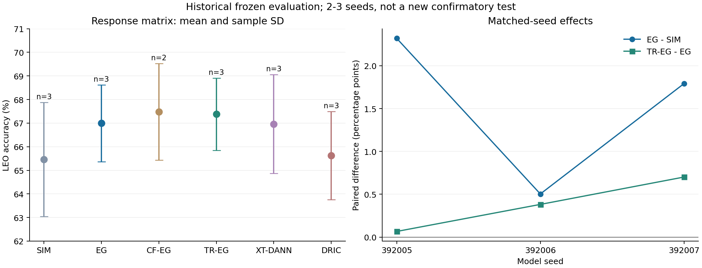

# 动力博弈、DAOT与FastTrust-RC4：代码、实验与证据总审计

核对日期：2026-09-27。远端证据采集开始于18:11:38（UTC+8）；目标指标使用已经固定的历史预测。本文属于描述性复核，不是新的盲测确认，也不授权训练、恢复暂停任务或按目标成绩选模。

**结论：完整EG在两代受控实验中有正收益，但“动力博弈有效”不能泛化到所有控制器和响应方法；历史融合失败也不能证明DAOT＋FastTrust与完整EG天然不相容。后续原生DR×EG四格已观察到联合增量，但交互效应随seed改变，尚不能声称稳定协同。**

本次补齐了此前分散的代码、配置、失败记录与原始聚合证据，新增远端完整epoch读回，并发现旧报告未收录的FULL三行评分。核心数字均有可追溯文件；没有用模型名、旧RUNNING、单个非零loss或验收通过代替实际运行证据。

## 阅读入口

|需要了解的问题|入口|
|---|---|
|历史CORE90、A1、GAME V1/V2、高LR、XUC/DR7/FULL为什么不同|[历史实验专题](chapters/historical_findings.md)|
|SIM、EG、CF-EG、TR-EG、XT-DANN、DRIC实际怎样更新|[逐项代码考证与公式](chapters/code_findings.md)|
|本轮全部统计、三seed配对、day0、FULL9、日志范围|[结果与日志分析](RESULTS.md)|
|每行指标、逐RX/day/TX、混淆矩阵、源域曲线|[响应矩阵原始结果目录](records/response_matrix_eval_20260917/results/report.md)|
|9月14日的完整45k字符历史论证及逐项配置|[原综合报告](../daot_fasttrust_game_20260914/report.md)、[配置附录](../daot_fasttrust_game_20260914/configuration_appendix.md)|
|源码、测试、配置、验收与发布工具|[响应实现快照](implementation/response/README.md)、[设计实施计划](implementation/response_games_plan_20260914.md)|
|上传了什么、哪些仍是外部产物、怎样复核|[交付范围与复现边界](DELIVERY.md)、[文件来源清单](publication_manifest.csv)|
|外部文献、创新性与可声明范围|[文献核查](LITERATURE.md)|

## 1.研究对象与共同数据边界

这里研究的是Phase1地面弱标注、跨接收机域泛化。ManySig/WiSig是地面代理数据，LEO是模拟压力视图，不能写成真实卫星实验。源域U的TX标签隐藏，但接收机和日期域标签可用；U不等于目标域无标签适配数据。

响应矩阵使用source RX1/3/4/6/8、day1/2/3，L/U/V为6300/56700/27000，对应source全池7%/63%/30%；有标签训练比例为6300/(6300+56700)=10%。域对抗头预测5RX×3day的15个域，身份头预测6个TX。V用于只读校准/评价，不反向更新持久状态。

目标RX0/2/5/7/9/10/11，day0/1/2/3，每场景168000条物理记录。Clean和三LEO视图产生每模型672000次预测，仍然只有168000条物理IQ。全体是跨RX，只有day0的42000条同时跨天，占25%。三LEO场景也不是三个独立训练seed。

本报告沿用现有评分，不将这些四视图历史基准称为当前协议下新的单观测unknown确认实验。它没有验证Phase2少样本新类注册、Phase3多节点协同或真实unknown拒识。具体协议见[当日协议快照](protocol_snapshot.md)。

模型seed392005/392006/392007与split/data/augmentation/evaluation seed必须分开。响应矩阵固定数据和增强seed392005；原生DAOT＋RC4控制组还有sat_view_seed2027和不同训练随机流。GAME V2又使用过split/eval392002。只凭“同seed”不能证明所有随机过程匹配。

## 2.“动力博弈”实际包含哪些不同问题

|层次|对象|改变的内容|主要误解|
|---|---|---|---|
|表征与监督|CORE90、DAOT、FastTrust-RC4、X、Ux|学习目标、教师与伪标签、身份/域表征|这些模块并非彼此独立|
|基础求解器|SIM、完整EG、Heun、Optimistic、head-lookahead|如何利用当前、预测或历史梯度更新|只预测域头不等于完整EG|
|自适应控制|C2、C*、能力/曝光课程|何时修正、追赶、暂停课程|配置有预算不等于实际执行了动作|
|响应求解|CF-EG、TR-EG、XT-DANN、DRIC-Lite|身份损伤、坐标漂移、跨身份响应或任务漂移|局部风险约束不等于全局泛化保证|
|严格删去DR的对照|PURE_SIM等|完整跳过DAOT、RC4校准/路由/H/P/辅助项|旧R0的DR-off不是后来的pure_game|

CORE90还包含分类、域分支、正交、Group CE、Fishr、原型/几何、proxy unknown、episode、MixStyle和卫星分类等共同目标。名称为“pure_game”的组也不是只剩两个交叉熵。

## 3.为什么两套机制会相互影响

令T为当前row实际启用的全部非编码器对抗任务，D_L、D_U为L/U域交叉熵。有效场概括为：

\[
F_\theta=\nabla_\theta T-\lambda_E\nabla_\theta D_L,\qquad
F_\phi=\alpha_L\nabla_\phi D_L+\alpha_U\nabla_\phi D_U.
\]

U域CE不给身份编码器对抗梯度，但U仍可通过DAOT和RC4身份目标更新编码器。该非对称结构使两边交叉Jacobian通常不满足简单零和转置关系。DRIC必须显式构建域场，而不能把GRL的高阶自动微分当成真实Jacobian。

DAOT教师约束与RC4伪监督改变同一个身份表征；域头在不断变化的表征上学习。编码器变化会进一步改变EMA、置信度、校准、H/P路由和下一步样本有效权重。因此，“优化不同部分”不意味着计算图或优化轨迹独立。求解器的第二次场评估若使用不同教师、归一化除数、路由、随机增强或Adam矩，其变化就掺入了额外目标漂移。

当前实现明确冻结每主步的U、教师、路由与随机语境，重放原点实际用过的归一化除数，接受后仅提交一次EMA、原型和scale状态。这是使完整EG比较可解释的必要语义；它本身不证明测试性能提高。

## 4.历史“融合失败”包含三个不同问题

**第一，DR7确有移植差异。**原生每轮222步被改成49步，E200总主更新从44400降为9800，U曝光从11340000降为2502992；U的GRL从0变成1。该批结果不能视为原生有效DR＋完整EG的公平试验。即使与49步父实验相比也普遍退化，但仍同时包含目标移植变化，不能唯一归因给博弈机制。

**第二，FULL修复预算和U梯度时，又加入整套扩展。**三视图robust、prototype、relation、tangent、nuisance、fingerprint及RC4的N、anchor、卫星Hard等改变了方法。F-A1的DAOT prototype虽然名义系数非零，但实际prototype_matrix为空；CORE90原型记忆仍存在，两者不能混称。缺少full DR alone对照，不能把full DR+C2与F-A1的差异全部归给C2。

**第三，控制器并未执行每步完整EG。**FULL F-M11为1056/44400次CORRECT，F-M08为1076/44400；新增补齐的F-M07为1638/44400。F-M12/F-M13的C*修正和追赶均为0。C2恢复审计中存在恢复后CE变差却被截断为零lag的证据；C*在可靠性门控失败后不动作，不能将该结果当作有效响应修正的性能验证。完整历史审计、梯度探针和路由分叉见专题章。

这些事实足以否定“早期融合失败证明机制天然不兼容”的结论，但也不证明修复后必然成功。其余解释，如新增损失间冲突、EMA延迟和身份/域方向纠缠，属于代码支持且有诊断迹象的机制假设，尚未被单因素干预分别量化。

## 5.后续响应方法：实现与实验支持要分开

|方法|实现要点|目前实验支持|
|---|---|---|
|完整EG|全部参与参数做虚拟AdamW预测，恢复原点与矩，再提交第二场梯度|新响应矩阵相对SIM三seed均正，平均+1.5380pp|
|CF-EG|有/无编码器对抗两条EG轨迹，插值原始梯度，逐类场景风险筛选最大可行β|两seed相对EG一负一正，均值−0.2687pp，成本高|
|TR-EG|同一训练IQ的域头输入做SO(d)坐标配准，补偿预测头第一层|三seed相对EG均正，平均+0.3824pp；样本仍少|
|XT-DANN|合法L按TX互斥分组，跨组域头响应及编码器对抗；不使用U隐藏TX|三seed平均−0.0342pp，未见一致增量|
|DRIC-Lite|末端投影＋域头低维响应，任务位移参照、局部风险半空间及球约束|相对SIM仅+0.1656pp，相对EG为−1.3724pp|

CF的硬约束保护每个TX×场景的平均负概率margin，不是逐样本或最差RX/day保证。TR的旋转解释率可能为负；良好坐标拟合也不自动等于目标泛化。XT额外使用合法L及二阶链，曝光相同不等于计算量相同。DRIC只修正末端，早期骨干仍接受普通DANN更新；其约束基于局部线性化且有预热混合，不能声称全骨干风险永不增加或全局收敛。

## 6.当前最强与最弱的证据

图中误差棒为样本标准差；CF只有两个seed，其均值不能直接作为三seed排名。右图显示匹配seed的实际差值。

完整EG的证据强于复杂响应修正。新响应矩阵EG−SIM的三seed差值为+2.3198、+0.5032、+1.7911pp。TR-EG−EG为+0.0655、+0.3812、+0.7006pp。前者收益幅度更明显；后者方向一致但小样本、差值较小，仍是描述性观察。

原生DR×EG四格使用另一种normalizer政策。已评分的两个完整seed中，联合相对DR＋SIM分别+1.6591、+1.2413pp。交互量

\[
I=Y_{DR+EG}-Y_{DR+SIM}-Y_{noDR+EG}+Y_{noDR+SIM}
\]

分别为−0.3155和+1.8044pp。**联合结果变好与稳定正交互不是同一结论。**第三个四格所需模型现在已训练完成，但未找到其目标评分，不能补0、估计或用source V替代。

另外，ADV0移除的是整项对抗损失，包括域头训练，不是仅关闭编码器GRL。完整EG在ADV0背景下仍可获益，说明其改善不能全部归因于域博弈旋转；非线性任务优化、步长/裁剪和AdamW预测也可能参与。

## 7.证据范围与当前缺项

本次读取并解析三个远端run的全部可用epoch记录，共11133条：响应36×200=7200，FULL9×200=1800，原生3×200=600，暂停pure的1533条。扫描79个stdout文件共37066行。原生日志中的2400次NaN关键词匹配主要涉及不适用的诊断值，必须与真正的loss/grad跳步分开，详见RESULTS。

历史逐步审计和探针按原始包复用；本次没有重新解析约数十GB的全部actions.jsonl，不能将本轮epoch全量检查写成“全历史每一步均重新审计”。最新remote_evidence包含完整选定JSON/JSONL元数据和stdout匹配；超过本次范围的原始逐步文件保留N607路径。

FULL9共6048000条冻结预测在本次重新连接既有truth独立复计，36个场景全部通过；响应矩阵33行的22176000条预测及132场景采用9月17日已保存的独立重计证据，本次重新计算CSV均值、配对和四格交互，不冒充重新扫描了这22176000条预测。

尚无证据支持的声明包括：纯博弈优于原生DR、DRIC稳定胜出、FULL扩展整体优于F-A1、已完成三seed全矩阵目标测试、跨物理信道族的统一排名、或者RFFI中首次提出域对抗/博弈动力学。

后续如继续科研，应先补齐已登记且已冻结模型的缺失评估与源域机制证据，保留暂停任务的原授权边界；新的确认实验须事先冻结方法、预算和评价口径，并使用适当的独立确认数据。当前目标分数不能回流到同一确认集的参数选择或选择性重跑。本次仅完成分析和材料交付。
